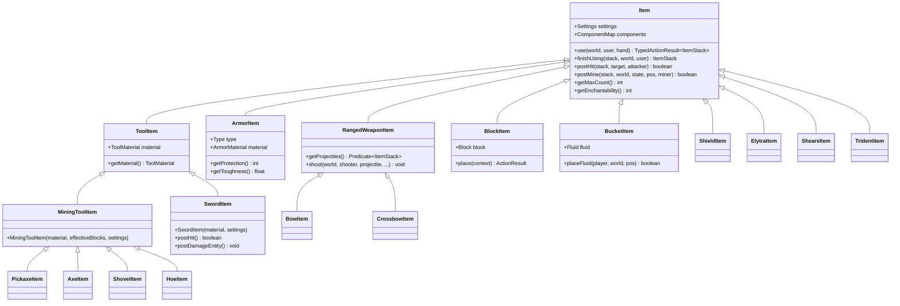
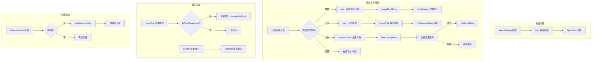
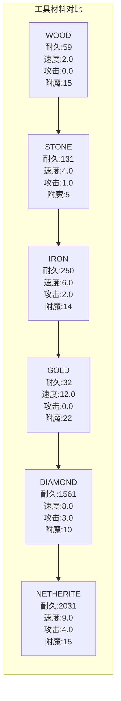
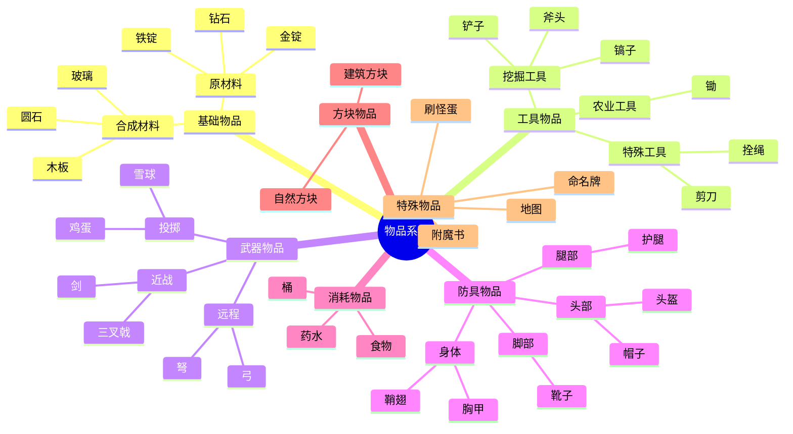

# Minecraft 1.21 物品实现详解 (Item Implementations)

## 目录

1. [概述](#概述)
2. [工具类物品](#工具类物品)
3. [武器类物品](#武器类物品)
4. [消耗品类](#消耗品类)
5. [特殊物品](#特殊物品)
6. [附魔与耐久](#附魔与耐久)
7. [自定义物品](#自定义物品)
8. [源码分析](#源码分析)
9. [架构图](#架构图)

---

## 概述

Minecraft 1.21 的物品系统是游戏核心子系统之一，包含了从简单的原材料到复杂的工具、武器和特殊功能物品。本文档深入分析 `net.minecraft.item` 包中的各类物品实现，揭示其设计模式和架构机制。

### 物品类型分类

| 类别 | 典型物品 | 核心特性 |
|------|----------|----------|
| 基础物品 | 钻石、金锭、圆石 | 无特殊行为，仅堆叠 |
| 工具物品 | 镐、斧、铲、锄 | ToolMaterial + ToolComponent |
| 武器物品 | 剑、弓、弩、三叉戟 | 攻击行为 + 耐久消耗 |
| 防具物品 | 头盔、胸甲、护腿、靴子 | ArmorMaterial + 属性修饰符 |
| 消耗品 | 食物、药水、桶 | use() / finishUsing() 生命周期 |
| 方块物品 | 木板、石头、泥土 | BlockItem 封装方块放置逻辑 |
| 特殊物品 | 命名牌、鞍、刷怪蛋 | useOnEntity() 实体交互 |

### 核心设计模式

```
D:\Minecraft-Learning\assets\mc\1.21\net\minecraft\item\
├── Item.java (基类 - 单例模式)
│   ├── ToolItem.java (工具基类)
│   │   ├── SwordItem.java
│   │   ├── PickaxeItem.java
│   │   ├── AxeItem.java
│   │   ├── ShovelItem.java
│   │   └── HoeItem.java
│   ├── ArmorItem.java (防具)
│   ├── BlockItem.java (方块封装)
│   ├── RangedWeaponItem.java (远程武器基类)
│   │   ├── BowItem.java
│   │   └── CrossbowItem.java
│   └── [其他特殊物品...]
└── ItemStack.java (物品堆叠 - 数据容器)
```

---

## 工具类物品

### 1.1 工具系统架构

工具类物品采用 `ToolMaterial` + `ToolComponent` 双组件设计：

```java
// ToolMaterial - 基础材料属性
public interface ToolMaterial {
    int getDurability();                    // 耐久度上限
    float getMiningSpeedMultiplier();       // 挖掘速度
    float getAttackDamage();                // 基础攻击力
    TagKey<Block> getInverseTag();          // 无效方块标签
    int getEnchantability();                // 附魔能力
    Ingredient getRepairIngredient();        // 修复材料
}
```

**预定义工具材料 (ToolMaterials)：**

```java
19:73:D:\Minecraft-Learning\assets\mc\1.21\net\minecraft\item\ToolMaterials.java
public enum ToolMaterials implements ToolMaterial {
    WOOD(BlockTags.INCORRECT_FOR_WOODEN_TOOL, 59, 2.0f, 0.0f, 15, ...),
    STONE(BlockTags.INCORRECT_FOR_STONE_TOOL, 131, 4.0f, 1.0f, 5, ...),
    IRON(BlockTags.INCORRECT_FOR_IRON_TOOL, 250, 6.0f, 2.0f, 14, ...),
    DIAMOND(BlockTags.INCORRECT_FOR_DIAMOND_TOOL, 1561, 8.0f, 3.0f, 10, ...),
    GOLD(BlockTags.INCORRECT_FOR_GOLD_TOOL, 32, 12.0f, 0.0f, 22, ...),
    NETHERITE(BlockTags.INCORRECT_FOR_NETHERITE_TOOL, 2031, 9.0f, 4.0f, 15, ...);
    
    // 构造参数: inverseTag, durability, speed, damage, enchantability, repairIngredient
}
```

### 1.2 ToolComponent - 工具行为定义

```java
// ToolComponent 定义工具的有效方块和效率
ToolComponent createToolComponent() {
    return new ToolComponent(
        List.of(
            // 规则1: 对特定方块高效率
            ToolComponent.Rule.of(BlockTags.NEEDS_DIAMOND_TOOL, 8.0f),
            // 规则2: 总是掉落（蜘蛛网）
            ToolComponent.Rule.ofAlwaysDropping(List.of(Blocks.COBWEB), 15.0f),
            // 规则3: 使用标签匹配
            ToolComponent.Rule.of(BlockTags.PICKAXE_MINEABLE, 1.5f)
        ),
        1.0f,  // 默认速度
        2      // 每方块耐久消耗
    );
}
```

### 1.3 工具类物品实现

**MiningToolItem - 采矿工具基类：**

```java
20:39:D:\Minecraft-Learning\assets\mc\1.21\net\minecraft\item\MiningToolItem.java
public class MiningToolItem extends ToolItem {
    public MiningToolItem(ToolMaterial material, TagKey<Block> effectiveBlocks, 
                         Item.Settings settings) {
        super(material, settings.component(
            DataComponentTypes.TOOL, 
            material.createComponent(effectiveBlocks)
        ));
    }

    @Override
    public boolean postHit(ItemStack stack, LivingEntity target, LivingEntity attacker) {
        return true;
    }

    @Override
    public void postDamageEntity(ItemStack stack, LivingEntity target, LivingEntity attacker) {
        stack.damage(2, attacker, EquipmentSlot.MAINHAND);  // 攻击实体消耗2点耐久
    }
}
```

**具体工具实现：**

| 工具类型 | 有效方块标签 | 基础攻击速度 |
|----------|--------------|--------------|
| PickaxeItem | BlockTags.PICKAXE_MINEABLE | -2.8 |
| AxeItem | BlockTags.AXE_MINEABLE | -3.0 |
| ShovelItem | BlockTags.SHOVEL_MINEABLE | -3.0 |
| HoeItem | 自定义 | -3.0 |

### 1.4 剪刀的特殊行为

```java
28:70:D:\Minecraft-Learning\assets\mc\1.21\net\minecraft\item\ShearsItem.java
public class ShearsItem extends Item {
    public static ToolComponent createToolComponent() {
        return new ToolComponent(
            List.of(
                ToolComponent.Rule.ofAlwaysDropping(List.of(Blocks.COBWEB), 15.0f),
                ToolComponent.Rule.of(BlockTags.LEAVES, 15.0f),
                ToolComponent.Rule.of(BlockTags.WOOL, 5.0f),
                ToolComponent.Rule.of(List.of(Blocks.VINE, Blocks.GLOW_LICHEN), 2.0f)
            ), 1.0f, 1
        );
    }

    @Override
    public boolean postMine(ItemStack stack, World world, BlockState state, 
                           BlockPos pos, LivingEntity miner) {
        // 非火焰方块时消耗耐久
        if (!world.isClient && !state.isIn(BlockTags.FIRE)) {
            stack.damage(1, miner, EquipmentSlot.MAINHAND);
        }
        // 返回是否应该掉落物品
        return state.isIn(BlockTags.LEAVES) || state.isOf(Blocks.COBWEB) 
            || state.isOf(Blocks.SHORT_GRASS) || state.isIn(BlockTags.WOOL);
    }

    @Override
    public ActionResult useOnBlock(ItemUsageContext context) {
        // 收割植物生长阶段
        if (block instanceof AbstractPlantStemBlock && !hasMaxAge) {
            world.setBlockState(pos, withMaxAge(state));
            itemStack.damage(1, player, LivingEntity.getSlotForHand(context.getHand()));
            return ActionResult.success(world.isClient);
        }
        return super.useOnBlock(context);
    }
}
```

---

## 武器类物品

### 2.1 剑 (SwordItem)

```java
26:54:D:\Minecraft-Learning\assets\mc\1.21\net\minecraft\item\SwordItem.java
public class SwordItem extends ToolItem {
    public SwordItem(ToolMaterial toolMaterial, Item.Settings settings) {
        super(toolMaterial, settings.component(
            DataComponentTypes.TOOL, 
            SwordItem.createToolComponent()
        ));
    }

    private static ToolComponent createToolComponent() {
        return new ToolComponent(
            List.of(
                // 蜘蛛网总是掉落
                ToolComponent.Rule.ofAlwaysDropping(List.of(Blocks.COBWEB), 15.0f),
                // 对剑有效方块1.5倍效率
                ToolComponent.Rule.of(BlockTags.SWORD_EFFICIENT, 1.5f)
            ), 1.0f, 2  // 默认速度1.0, 每次使用消耗2耐久
        );
    }

    @Override
    public boolean canMine(BlockState state, World world, BlockPos pos, PlayerEntity miner) {
        return !miner.isCreative();  // 创造模式不可挖掘
    }

    @Override
    public boolean postHit(ItemStack stack, LivingEntity target, LivingEntity attacker) {
        return true;  // 返回是否增加使用统计
    }

    @Override
    public void postDamageEntity(ItemStack stack, LivingEntity target, LivingEntity attacker) {
        stack.damage(1, attacker, EquipmentSlot.MAINHAND);  // 攻击消耗1耐久
    }
}
```

**剑的属性修饰符：**

```java
// 攻击伤害 = 基础值 + 材料加成
// 攻击速度 = -2.4 (快速但非即时)

// 示例: 钻石剑
// 攻击伤害 = 3.0 + 4.0 = 7.0
// 攻击速度 = -2.4
```

### 2.2 弓 (BowItem)

```java
24:103:D:\Minecraft-Learning\assets\mc\1.21\net\minecraft\item\BowItem.java
public class BowItem extends RangedWeaponItem {
    public static final int TICKS_PER_SECOND = 20;
    public static final int RANGE = 15;

    @Override
    public void onStoppedUsing(ItemStack stack, World world, LivingEntity user, 
                              int remainingUseTicks) {
        if (!(user instanceof PlayerEntity)) return;
        
        PlayerEntity player = (PlayerEntity)user;
        ItemStack projectile = player.getProjectileType(stack);
        if (projectile.isEmpty()) return;
        
        // 计算拉弓进度 (0.0 - 1.0)
        int useTicks = this.getMaxUseTime(stack, user) - remainingUseTicks;
        float pullProgress = BowItem.getPullProgress(useTicks);
        
        if (pullProgress < 0.1) return;  // 最小拉弓要求
        
        // 加载弹药并发射
        List<ItemStack> projectiles = BowItem.load(stack, projectile, player);
        this.shootAll(serverWorld, player, hand, stack, projectiles, 
                     pullProgress * 3.0f, 1.0f, pullProgress == 1.0f, null);
        
        // 播放音效
        world.playSound(..., SoundEvents.ENTITY_ARROW_SHOOT, ...);
    }

    public static float getPullProgress(int useTicks) {
        float f = (float)useTicks / 20.0f;
        f = (f * f + f * 2.0f) / 3.0f;  // 非线性曲线
        return Math.min(f, 1.0f);
    }

    @Override
    public UseAction getUseAction(ItemStack stack) {
        return UseAction.BOW;
    }

    @Override
    public int getMaxUseTime(ItemStack stack, LivingEntity user) {
        return 72000;  // 无限时长
    }
}
```

### 2.3 弩 (CrossbowItem)

```java
50:283:D:\Minecraft-Learning\assets\mc\1.21\net\minecraft\item\CrossbowItem.java
public class CrossbowItem extends RangedWeaponItem {
    private static final float DEFAULT_PULL_TIME = 1.25f;
    public static final int RANGE = 8;
    
    @Override
    public TypedActionResult<ItemStack> use(World world, PlayerEntity user, Hand hand) {
        ItemStack stack = user.getStackInHand(hand);
        ChargedProjectilesComponent charged = stack.get(DataComponentTypes.CHARGED_PROJECTILES);
        
        // 已装填则发射
        if (charged != null && !charged.isEmpty()) {
            this.shootAll(world, user, hand, stack, 
                         CrossbowItem.getSpeed(charged), 1.0f, null);
            return TypedActionResult.consume(stack);
        }
        
        // 未装填则开始拉弦
        if (!user.getProjectileType(stack).isEmpty()) {
            user.setCurrentHand(hand);
            return TypedActionResult.consume(stack);
        }
        return TypedActionResult.fail(stack);
    }

    @Override
    public void usageTick(World world, LivingEntity user, ItemStack stack, 
                          int remainingUseTicks) {
        float progress = (float)(stack.getMaxUseTime(user) - remainingUseTicks) 
                       / (float)CrossbowItem.getPullTime(stack, user);
        
        if (progress >= 0.2f && !this.charged) {
            this.charged = true;
            // 播放第一段音效
        }
        if (progress >= 0.5f && !this.loaded) {
            this.loaded = true;
            // 播放第二段音效
        }
    }

    @Override
    public Predicate<ItemStack> getProjectiles() {
        return BOW_PROJECTILES;  // 箭矢或烟花火箭
    }

    private static float getSpeed(ChargedProjectilesComponent stack) {
        return stack.contains(Items.FIREWORK_ROCKET) ? 1.6f : 3.15f;
    }
}
```

### 2.4 三叉戟 (TridentItem)

```java
40:163:D:\Minecraft-Learning\assets\mc\1.21\net\minecraft\item\TridentItem.java
public class TridentItem extends Item implements ProjectileItem {
    public static final int MIN_DRAW_DURATION = 10;
    public static final float ATTACK_DAMAGE = 8.0f;
    public static final float THROW_SPEED = 2.5f;

    @Override
    public void onStoppedUsing(ItemStack stack, World world, LivingEntity user, 
                              int remainingUseTicks) {
        int useTicks = this.getMaxUseTime(stack, user) - remainingUseTicks;
        if (useTicks < 10) return;  // 最小蓄力时间
        
        float spinAttackStrength = EnchantmentHelper.getTridentSpinAttackStrength(
            stack, playerEntity);
        
        if (spinAttackStrength > 0.0f && !playerEntity.isTouchingWaterOrRain()) {
            return;  // 激流需要水或雨
        }
        
        if (TridentItem.isAboutToBreak(stack)) return;
        
        if (world instanceof ServerWorld && !world.isClient) {
            stack.damage(1, playerEntity, LivingEntity.getSlotForHand(user.getActiveHand()));
            
            if (spinAttackStrength == 0.0f) {
                // 投掷三叉戟
                TridentEntity trident = new TridentEntity(world, playerEntity, stack);
                trident.setVelocity(playerEntity, playerEntity.getPitch(), 
                                   playerEntity.getYaw(), 0.0f, 2.5f, 1.0f);
                world.spawnEntity(trident);
                
                if (!playerEntity.isInCreativeMode()) {
                    playerEntity.getInventory().removeOne(stack);
                }
            } else {
                // 激流冲刺
                playerEntity.addVelocity(j *= spinAttackStrength / m, ...);
                playerEntity.useRiptide(20, 8.0f, stack);
            }
        }
    }

    @Override
    public UseAction getUseAction(ItemStack stack) {
        return UseAction.SPEAR;
    }
}
```

### 2.5 盾牌 (ShieldItem)

```java
26:77:D:\Minecraft-Learning\assets\mc\1.21\net\minecraft\item\ShieldItem.java
public class ShieldItem extends Item implements Equipment {
    public static final float MIN_DAMAGE_AMOUNT_TO_BREAK = 3.0f;

    public ShieldItem(Item.Settings settings) {
        super(settings);
        DispenserBlock.registerBehavior(this, ArmorItem.DISPENSER_BEHAVIOR);
    }

    @Override
    public UseAction getUseAction(ItemStack stack) {
        return UseAction.BLOCK;
    }

    @Override
    public int getMaxUseTime(ItemStack stack, LivingEntity user) {
        return 72000;  // 无限时长
    }

    @Override
    public TypedActionResult<ItemStack> use(World world, PlayerEntity user, Hand hand) {
        user.setCurrentHand(hand);
        return TypedActionResult.consume(user.getStackInHand(hand));
    }

    @Override
    public boolean canRepair(ItemStack stack, ItemStack ingredient) {
        return ingredient.isIn(ItemTags.PLANKS);  // 可用木板修复
    }

    @Override
    public EquipmentSlot getSlotType() {
        return EquipmentSlot.OFFHAND;  // 副手槽位
    }
}
```

---

## 消耗品类

### 3.1 桶 (BucketItem)

```java
40:158:D:\Minecraft-Learning\assets\mc\1.21\net\minecraft\item\BucketItem.java
public class BucketItem extends Item implements FluidModificationItem {
    private final Fluid fluid;  // EMPTY, WATER, LAVA, MILK, FISH, etc.

    @Override
    public TypedActionResult<ItemStack> use(World world, PlayerEntity user, Hand hand) {
        ItemStack stack = user.getStackInHand(hand);
        BlockHitResult hitResult = BucketItem.raycast(world, user, 
            this.fluid == Fluids.EMPTY 
                ? RaycastContext.FluidHandling.SOURCE_ONLY 
                : RaycastContext.FluidHandling.NONE);
        
        if (hitResult.getType() == HitResult.Type.BLOCK) {
            BlockPos pos = hitResult.getBlockPos();
            
            if (this.fluid == Fluids.EMPTY) {
                // 拾取液体
                FluidDrainable drainable = (FluidDrainable)block;
                ItemStack fluidStack = drainable.tryDrainFluid(user, world, pos, state);
                if (!fluidStack.isEmpty()) {
                    // 触发成就
                    Criteria.FILLED_BUCKET.trigger(player, fluidStack);
                    return TypedActionResult.success(
                        ItemUsage.exchangeStack(stack, user, fluidStack), world.isClient);
                }
            } else {
                // 放置液体
                if (this.placeFluid(user, world, pos, hitResult)) {
                    this.onEmptied(user, world, stack, pos);
                    Criteria.PLACED_BLOCK.trigger(player, pos, stack);
                    user.incrementStat(Stats.USED.getOrCreateStat(this));
                    return TypedActionResult.success(
                        ItemUsage.exchangeStack(stack, user, 
                            getEmptiedStack(stack, user)), world.isClient);
                }
            }
        }
        return TypedActionResult.pass(stack);
    }

    @Override
    public boolean placeFluid(@Nullable PlayerEntity player, World world, 
                             BlockPos pos, @Nullable BlockHitResult hitResult) {
        // 处理超维度世界(下界放水会蒸发)
        if (world.getDimension().ultrawarm() && this.fluid.isIn(FluidTags.WATER)) {
            // 生成烟雾粒子
            world.playSound(..., SoundEvents.BLOCK_FIRE_EXTINGUISH, ...);
            for (int i = 0; i < 8; i++) {
                world.addParticle(ParticleTypes.LARGE_SMOKE, ...);
            }
            return true;
        }
        
        // 标准流体放置
        if (world.setBlockState(pos, this.fluid.getDefaultState().getBlockState(), 
                                Block.NOTIFY_ALL_AND_REDRAW)) {
            this.playEmptyingSound(player, world, pos);
            world.emitGameEvent(GameEvent.FLUID_PLACE, pos);
            return true;
        }
        return false;
    }
}
```

### 3.2 附魔书 (EnchantedBookItem)

```java
11:27:D:\Minecraft-Learning\assets\mc\1.21\net\minecraft\item\EnchantedBookItem.java
public class EnchantedBookItem extends Item {
    public EnchantedBookItem(Item.Settings settings) {
        super(settings);
    }

    @Override
    public boolean isEnchantable(ItemStack stack) {
        return false;  // 附魔书本身不能再被附魔
    }

    public static ItemStack forEnchantment(EnchantmentLevelEntry info) {
        ItemStack book = new ItemStack(Items.ENCHANTED_BOOK);
        book.addEnchantment(info.enchantment, info.level);
        return book;
    }
}
```

### 3.3 刷怪蛋 (SpawnEggItem)

```java
45:175:D:\Minecraft-Learning\assets\mc\1.21\net\minecraft\item\SpawnEggItem.java
public class SpawnEggItem extends Item {
    private static final Map<EntityType<? extends MobEntity>, SpawnEggItem> SPAWN_EGGS 
        = Maps.newIdentityHashMap();
    private final EntityType<?> type;
    private final int primaryColor;
    private final int secondaryColor;

    @Override
    public ActionResult useOnBlock(ItemUsageContext context) {
        World world = context.getWorld();
        if (!(world instanceof ServerWorld)) return ActionResult.SUCCESS;
        
        BlockPos pos = context.getBlockPos();
        BlockEntity entity = world.getBlockEntity(pos);
        
        if (entity instanceof Spawner) {
            // 修改刷怪笼
            ((Spawner)entity).setEntityType(this.getEntityType(stack), world.getRandom());
            stack.decrement(1);
            return ActionResult.CONSUME;
        }
        
        // 生成实体
        EntityType<?> entityType = this.getEntityType(stack);
        Entity spawned = entityType.spawnFromItemStack((ServerWorld)world, stack, 
            context.getPlayer(), pos, SpawnReason.SPAWN_EGG, true, ...);
        
        if (spawned != null) {
            stack.decrementUnlessCreative(1, context.getPlayer());
            return ActionResult.CONSUME;
        }
        return ActionResult.PASS;
    }

    @Override
    public TypedActionResult<ItemStack> use(World world, PlayerEntity user, Hand hand) {
        // 在液体中生成
        if (hitResult.getType() == HitResult.Type.BLOCK 
            && world.getBlockState(pos).getBlock() instanceof FluidBlock) {
            EntityType<?> type = this.getEntityType(stack);
            Entity entity = type.spawnFromItemStack(..., SpawnReason.SPAWN_EGG, ...);
            if (entity != null) {
                stack.decrementUnlessCreative(1, user);
                return TypedActionResult.consume(stack);
            }
        }
        return TypedActionResult.pass(stack);
    }

    public static Iterable<SpawnEggItem> getAll() {
        return Iterables.unmodifiableIterable(SPAWN_EGGS.values());
    }
}
```

---

## 特殊物品

### 4.1 鞘翅 (ElytraItem)

```java
21:52:D:\Minecraft-Learning\assets\mc\1.21\net\minecraft\item\ElytraItem.java
public class ElytraItem extends Item implements Equipment {
    public ElytraItem(Item.Settings settings) {
        super(settings);
        DispenserBlock.registerBehavior(this, ArmorItem.DISPENSER_BEHAVIOR);
    }

    public static boolean isUsable(ItemStack stack) {
        return stack.getDamage() < stack.getMaxDamage() - 1;
    }

    @Override
    public boolean canRepair(ItemStack stack, ItemStack ingredient) {
        return ingredient.isOf(Items.PHANTOM_MEMBRANE);  // 用幻翼膜修复
    }

    @Override
    public TypedActionResult<ItemStack> use(World world, PlayerEntity user, Hand hand) {
        return this.equipAndSwap(this, world, user, hand);  // 装备替换
    }

    @Override
    public RegistryEntry<SoundEvent> getEquipSound() {
        return SoundEvents.ITEM_ARMOR_EQUIP_ELYTRA;
    }

    @Override
    public EquipmentSlot getSlotType() {
        return EquipmentSlot.CHEST;
    }
}
```

### 4.2 防具 (ArmorItem)

```java
38:180:D:\Minecraft-Learning\assets\mc\1.21\net\minecraft\item\ArmorItem.java
public class ArmorItem extends Item implements Equipment {
    public static final DispenserBehavior DISPENSER_BEHAVIOR = new ItemDispenserBehavior() {
        @Override
        protected ItemStack dispenseSilently(BlockPointer pointer, ItemStack stack) {
            return ArmorItem.dispenseArmor(pointer, stack) 
                ? stack 
                : super.dispenseSilently(pointer, stack);
        }
    };

    public static boolean dispenseArmor(BlockPointer pointer, ItemStack armor) {
        BlockPos pos = pointer.pos().offset(pointer.state().get(DispenserBlock.FACING));
        List<Entity> entities = pointer.world().getEntitiesByClass(
            LivingEntity.class, new Box(pos), 
            EntityPredicates.EXCEPT_SPECTATOR.and(new EntityPredicates.Equipable(armor)));
        
        if (entities.isEmpty()) return false;
        
        LivingEntity entity = (LivingEntity)entities.get(0);
        EquipmentSlot slot = entity.getPreferredEquipmentSlot(armor);
        ItemStack armorStack = armor.split(1);
        entity.equipStack(slot, armorStack);
        
        if (entity instanceof MobEntity) {
            ((MobEntity)entity).setEquipmentDropChance(slot, 2.0f);
            ((MobEntity)entity).setPersistent();
        }
        return true;
    }

    public ArmorItem(RegistryEntry<ArmorMaterial> material, Type type, 
                     Item.Settings settings) {
        super(settings);
        this.material = material;
        this.type = type;
        DispenserBlock.registerBehavior(this, DISPENSER_BEHAVIOR);
        
        this.attributeModifiers = Suppliers.memoize(() -> {
            int protection = material.value().getProtection(type);
            float toughness = material.value().toughness();
            return AttributeModifiersComponent.builder()
                .add(EntityAttributes.GENERIC_ARMOR, 
                    new EntityAttributeModifier(identifier, protection, ...), 
                    slot)
                .add(EntityAttributes.GENERIC_ARMOR_TOUGHNESS, 
                    new EntityAttributeModifier(identifier, toughness, ...), 
                    slot)
                .add(EntityAttributes.GENERIC_KNOCKBACK_RESISTANCE, 
                    new EntityAttributeModifier(identifier, knockbackResist, ...), 
                    slot)
                .build();
        });
    }

    @Override
    public TypedActionResult<ItemStack> use(World world, PlayerEntity user, Hand hand) {
        return this.equipAndSwap(this, world, user, hand);
    }

    public static enum Type implements StringIdentifiable {
        HELMET(EquipmentSlot.HEAD, 11, "helmet"),
        CHESTPLATE(EquipmentSlot.CHEST, 16, "chestplate"),
        LEGGINGS(EquipmentSlot.LEGS, 15, "leggings"),
        BOOTS(EquipmentSlot.FEET, 13, "boots"),
        BODY(EquipmentSlot.BODY, 16, "body");  // 鞘翅

        public boolean isTrimmable() {
            return this == HELMET || this == CHESTPLATE || this == LEGGINGS || this == BOOTS;
        }
    }
}
```

**防具材料 (ArmorMaterials)：**

```java
21:96:D:\Minecraft-Learning\assets\mc\1.21\net\minecraft\item\ArmorMaterials.java
public class ArmorMaterials {
    public static final RegistryEntry<ArmorMaterial> LEATHER = register("leather", ...);
    public static final RegistryEntry<ArmorMaterial> CHAIN = register("chainmail", ...);
    public static final RegistryEntry<ArmorMaterial> IRON = register("iron", ...);
    public static final RegistryEntry<ArmorMaterial> GOLD = register("gold", ...);
    public static final RegistryEntry<ArmorMaterial> DIAMOND = register("diamond", ...);
    public static final RegistryEntry<ArmorMaterial> TURTLE = register("turtle", ...);
    public static final RegistryEntry<ArmorMaterial> NETHERITE = register("netherite", ...);
    public static final RegistryEntry<ArmorMaterial> ARMADILLO = register("armadillo", ...);

    private static RegistryEntry<ArmorMaterial> register(String id, 
        EnumMap<ArmorItem.Type, Integer> defense, int enchantability, ...) {
        return Registry.registerReference(Registries.ARMOR_MATERIAL, 
            Identifier.ofVanilla(id), 
            new ArmorMaterial(enumMap, enchantability, equipSound, 
                            repairIngredient, layers, toughness, knockbackResistance));
    }
}
```

| 材料 | 头盔 | 胸甲 | 护腿 | 靴子 | 韧性 | 附魔 | 修复材料 |
|------|------|------|------|------|------|------|----------|
| Leather | 1 | 3 | 2 | 1 | 0 | 15 | 皮革 |
| Chain | 2 | 5 | 4 | 1 | 0 | 12 | 铁锭 |
| Iron | 2 | 6 | 5 | 2 | 0 | 9 | 铁锭 |
| Gold | 2 | 5 | 3 | 1 | 0 | 25 | 金锭 |
| Diamond | 3 | 8 | 6 | 3 | 2 | 10 | 钻石 |
| Turtle | 2 | 6 | 5 | 2 | 0 | 9 | 龟壳 |
| Netherite | 3 | 8 | 6 | 3 | 3 | 15 | 下界合金锭 |
| Armadillo | 3 | 8 | 6 | 3 | 0 | 10 | 犰狳鳞片 |

### 4.3 方块物品 (BlockItem)

```java
45:219:D:\Minecraft-Learning\assets\mc\1.21\net\minecraft\item\BlockItem.java
public class BlockItem extends Item {
    private final Block block;

    @Override
    public ActionResult useOnBlock(ItemUsageContext context) {
        ActionResult result = this.place(new ItemPlacementContext(context));
        if (!result.isAccepted() && context.getStack().contains(DataComponentTypes.FOOD)) {
            // 如果是食物方块(如蛋糕)，尝试食用
            ActionResult foodResult = super.use(context.getWorld(), context.getPlayer(), 
                                              context.getHand()).getResult();
            return foodResult == ActionResult.CONSUME 
                ? ActionResult.CONSUME_PARTIAL 
                : foodResult;
        }
        return result;
    }

    public ActionResult place(ItemPlacementContext context) {
        // 1. 检查功能标志
        if (!this.getBlock().isEnabled(context.getWorld().getEnabledFeatures())) {
            return ActionResult.FAIL;
        }
        
        // 2. 获取放置状态
        BlockState state = this.getPlacementState(context);
        if (state == null) return ActionResult.FAIL;
        
        // 3. 放置方块
        if (!this.place(context, state)) return ActionResult.FAIL;
        
        // 4. 处理方块实体数据
        BlockPos pos = context.getBlockPos();
        BlockState placedState = world.getBlockState(pos);
        if (placedState.isOf(state.getBlock())) {
            this.placeFromNbt(pos, world, stack, placedState);
            this.postPlacement(pos, world, player, stack, placedState);
            BlockItem.copyComponentsToBlockEntity(world, pos, stack);
            state.getBlock().onPlaced(world, pos, state, player, stack);
        }
        
        // 5. 播放音效
        BlockSoundGroup soundGroup = placedState.getSoundGroup();
        world.playSound(player, pos, this.getPlaceSound(placedState), ...);
        world.emitGameEvent(GameEvent.BLOCK_PLACE, pos, ...);
        
        // 6. 消耗物品
        stack.decrementUnlessCreative(1, player);
        return ActionResult.success(world.isClient);
    }

    private static void copyComponentsToBlockEntity(World world, BlockPos pos, 
                                                     ItemStack stack) {
        BlockEntity blockEntity = world.getBlockEntity(pos);
        if (blockEntity != null) {
            blockEntity.readComponents(stack);
            blockEntity.markDirty();
        }
    }

    @Override
    public void onItemEntityDestroyed(ItemEntity entity) {
        // 潜影盒等容器物品被销毁时掉落内容物
        ContainerComponent container = entity.getStack().set(
            DataComponentTypes.CONTAINER, ContainerComponent.DEFAULT);
        if (container != null) {
            ItemUsage.spawnItemContents(entity, container.iterateNonEmptyCopy());
        }
    }
}
```

---

## 附魔与耐久

### 5.1 耐久系统

```java
// ItemStack 耐久操作
public class ItemStack {
    public void damage(int amount, ServerWorld world, 
                      @Nullable ServerPlayerEntity player, 
                      Consumer<Item> breakCallback) {
        if (!this.isDamageable()) return;
        if (player != null && player.isInCreativeMode()) return;
        
        // 应用附魔效果(经验修复等)
        amount = EnchantmentHelper.getItemDamage(world, this, amount);
        if (amount <= 0) return;
        
        int newDamage = this.getDamage() + amount;
        this.setDamage(newDamage);
        
        if (newDamage >= this.getMaxDamage()) {
            Item item = this.getItem();
            this.decrement(1);  // 堆叠数量-1
            breakCallback.accept(item);
        }
    }

    public boolean isDamageable() {
        return this.contains(DataComponentTypes.MAX_DAMAGE) 
            && !this.contains(DataComponentTypes.UNBREAKABLE) 
            && this.contains(DataComponentTypes.DAMAGE);
    }

    public int getItemBarStep(ItemStack stack) {
        // 物品栏显示步骤 (0-13)
        return MathHelper.clamp(
            Math.round(13.0f - (float)stack.getDamage() * 13.0f / (float)stack.getMaxDamage()),
            0, 13);
    }

    public int getItemBarColor(ItemStack stack) {
        // 耐久条颜色 (绿色->红色渐变)
        float f = Math.max(0.0f, 
            ((float)stack.getMaxDamage() - (float)stack.getDamage()) / (float)stack.getMaxDamage());
        return MathHelper.hsvToRgb(f / 3.0f, 1.0f, 1.0f);
    }
}
```

### 5.2 物品可附魔性

```java
// Item 类的可附魔判断
public class Item {
    public boolean isEnchantable(ItemStack stack) {
        return stack.getMaxCount() == 1  // 不可堆叠
            && stack.contains(DataComponentTypes.MAX_DAMAGE);  // 有耐久度
    }

    public int getEnchantability() {
        return 0;  // 默认不可附魔
    }
}

// ToolItem 委托给 ToolMaterial
public class ToolItem extends Item {
    @Override
    public int getEnchantability() {
        return this.material.getEnchantability();
    }
}

// ArmorItem 委托给 ArmorMaterial
public class ArmorItem extends Item {
    @Override
    public int getEnchantability() {
        return this.material.value().enchantability();
    }
}
```

### 5.3 物品修复

```java
public class Item {
    public boolean canRepair(ItemStack stack, ItemStack ingredient) {
        return false;  // 默认不可修复
    }
}

public class ToolItem extends Item {
    @Override
    public boolean canRepair(ItemStack stack, ItemStack ingredient) {
        return this.material.getRepairIngredient().test(ingredient) 
            || super.canRepair(stack, ingredient);
    }
}

public class ArmorItem extends Item {
    @Override
    public boolean canRepair(ItemStack stack, ItemStack ingredient) {
        return this.material.value().repairIngredient().get().test(ingredient) 
            || super.canRepair(stack, ingredient);
    }
}

public class ShieldItem extends Item {
    @Override
    public boolean canRepair(ItemStack stack, ItemStack ingredient) {
        return ingredient.isIn(ItemTags.PLANKS);  // 可用木板修复
    }
}
```

---

## 自定义物品

### 6.1 Item.Settings 配置

```java
public class Item {
    public static class Settings {
        public Settings food(FoodComponent foodComponent) {
            return this.component(DataComponentTypes.FOOD, foodComponent);
        }

        public Settings maxCount(int maxCount) {
            return this.component(DataComponentTypes.MAX_STACK_SIZE, maxCount);
        }

        public Settings maxDamage(int maxDamage) {
            this.component(DataComponentTypes.MAX_DAMAGE, maxDamage);
            this.component(DataComponentTypes.MAX_STACK_SIZE, 1);  // 有耐久不可堆叠
            this.component(DataComponentTypes.DAMAGE, 0);
            return this;
        }

        public Settings rarity(Rarity rarity) {
            return this.component(DataComponentTypes.RARITY, rarity);
        }

        public Settings fireproof() {
            return this.component(DataComponentTypes.FIRE_RESISTANT, Unit.INSTANCE);
        }

        public Settings attributeModifiers(AttributeModifiersComponent modifiers) {
            return this.component(DataComponentTypes.ATTRIBUTE_MODIFIERS, modifiers);
        }

        public Settings component(ComponentType<T> type, T value) {
            if (this.components == null) {
                this.components = ComponentMap.builder()
                    .addAll(DataComponentTypes.DEFAULT_ITEM_COMPONENTS);
            }
            this.components.add(type, value);
            return this;
        }
    }
}
```

### 6.2 创建自定义物品示例

```java
// 1. 创建物品类
public class CustomSwordItem extends ToolItem {
    public CustomSwordItem(ToolMaterial material, Item.Settings settings) {
        super(material, settings.component(
            DataComponentTypes.TOOL,
            new ToolComponent(List.of(
                ToolComponent.Rule.of(BlockTags.SWORD_EFFICIENT, 1.5f)
            ), 1.0f, 2)
        ));
    }

    @Override
    public boolean postHit(ItemStack stack, LivingEntity target, LivingEntity attacker) {
        // 自定义命中逻辑
        if (!attacker.getWorld().isClient) {
            attacker.getWorld().spawnLightning Bolt(...);
        }
        return true;
    }
}

// 2. 注册物品
Registry.register(
    Registries.ITEM,
    Identifier.of("mymod", "custom_sword"),
    new CustomSwordItem(ToolMaterials.DIAMOND, new Item.Settings()
        .rarity(Rarity.EPIC)
        .attributeModifiers(CustomSwordItem.createAttributeModifiers(
            ToolMaterials.DIAMOND, 4.0f, -2.4f)));
);
```

### 6.3 物品生命周期方法

```java
public class Item {
    // 使用相关
    public TypedActionResult<ItemStack> use(World world, PlayerEntity user, Hand hand);
    public ItemStack finishUsing(ItemStack stack, World world, LivingEntity user);
    public void usageTick(World world, LivingEntity user, ItemStack stack, int remaining);
    public void onStoppedUsing(ItemStack stack, World world, LivingEntity user, int remaining);
    
    // 方块交互
    public ActionResult useOnBlock(ItemUsageContext context);
    public ActionResult useOnEntity(ItemStack stack, PlayerEntity user, LivingEntity entity, Hand hand);
    
    // 挖掘/攻击
    public boolean postMine(ItemStack stack, World world, BlockState state, 
                           BlockPos pos, LivingEntity miner);
    public boolean postHit(ItemStack stack, LivingEntity target, LivingEntity attacker);
    public void postDamageEntity(ItemStack stack, LivingEntity target, LivingEntity attacker);
    
    // 背包/实体
    public void inventoryTick(ItemStack stack, World world, Entity entity, 
                            int slot, boolean selected);
    public void onCraftByPlayer(ItemStack stack, World world, PlayerEntity player);
    public void onItemEntityDestroyed(ItemEntity entity);
    
    // 属性查询
    public float getMiningSpeed(ItemStack stack, BlockState state);
    public UseAction getUseAction(ItemStack stack);
    public int getMaxUseTime(ItemStack stack, LivingEntity user);
    public boolean canMine(BlockState state, World world, BlockPos pos, PlayerEntity miner);
    public boolean isCorrectForDrops(ItemStack stack, BlockState state);
}
```

---

## 源码分析

### 7.1 关键文件清单

| 文件路径 | 行数 | 功能描述 |
|----------|------|----------|
| Item.java | 808 | 物品基类，定义生命周期和默认行为 |
| ItemStack.java | 1373 | 物品堆叠容器，存储数量和组件数据 |
| ToolItem.java | 53 | 工具物品基类，关联 ToolMaterial |
| MiningToolItem.java | 39 | 采矿工具(镐/斧/铲/锄)基类 |
| SwordItem.java | 54 | 剑的具体实现 |
| PickaxeItem.java | 16 | 镐子(使用 MiningToolItem) |
| ArmorItem.java | 180 | 防具物品，包含属性修饰符 |
| BowItem.java | 103 | 弓的实现 |
| CrossbowItem.java | 283 | 弩的实现，支持多箭矢 |
| TridentItem.java | 163 | 三叉戟，支持激流附魔 |
| ShieldItem.java | 77 | 盾牌实现 |
| BucketItem.java | 158 | 桶实现 |
| BlockItem.java | 219 | 方块物品封装 |
| ShearsItem.java | 70 | 剪刀实现 |
| SpawnEggItem.java | 175 | 刷怪蛋实现 |
| EnchantedBookItem.java | 27 | 附魔书实现 |
| ElytraItem.java | 52 | 鞘翅实现 |
| ToolMaterials.java | 73 | 工具材料枚举 |
| ArmorMaterials.java | 96 | 防具材料注册 |

### 7.2 ItemStack 组件系统

```java
148:289:D:\Minecraft-Learning\assets\mc\1.21\net\minecraft\item\ItemStack.java
public final class ItemStack implements ComponentHolder, FabricItemStack {
    // 序列化编解码器
    public static final Codec<ItemStack> CODEC = RecordCodecBuilder.create(instance -> 
        instance.group(
            ITEM_CODEC.fieldOf("id").forGetter(ItemStack::getRegistryEntry),
            Codecs.rangedInt(1, 99).optionalFieldOf("count", 1).forGetter(ItemStack::getCount),
            ComponentChanges.CODEC.optionalFieldOf("components", ComponentChanges.EMPTY)
                .forGetter(stack -> stack.components.getChanges())
        ).apply(instance, ItemStack::new)
    );

    // NBT 序列化
    public static Optional<ItemStack> fromNbt(RegistryWrapper.WrapperLookup registries, 
                                              NbtElement nbt) {
        return CODEC.parse(registries.getOps(NbtOps.INSTANCE), nbt)
            .resultOrPartial(error -> LOGGER.error("Tried to load invalid item: '{}'", error));
    }

    public NbtElement encode(RegistryWrapper.WrapperLookup registries) {
        if (this.isEmpty()) {
            throw new IllegalStateException("Cannot encode empty ItemStack");
        }
        return CODEC.encodeStart(registries.getOps(NbtOps.INSTANCE), this).getOrThrow();
    }

    // 组件操作
    public <T> T set(ComponentType<? super T> type, @Nullable T value) {
        return this.components.set(type, value);
    }

    public <T> T remove(ComponentType<? extends T> type) {
        return this.components.remove(type);
    }

    public void applyChanges(ComponentChanges changes) {
        this.components.applyChanges(changes);
        this.getItem().postProcessComponents(this);
    }
}
```

### 7.3 物品注册表

```java
// Items.java 定义所有原版物品
public final class Items {
    public static final Item ACACIA_BOAT = register("acacia_boat", 
        new BoatItem(BoatType.ACACIA, new Item.Settings()));
    
    public static final Item DIAMOND_SWORD = register("diamond_sword", 
        new SwordItem(ToolMaterials.DIAMOND, new Item.Settings()));
    
    public static final Item DIAMOND_PICKAXE = register("diamond_pickaxe", 
        new PickaxeItem(ToolMaterials.DIAMOND, new Item.Settings()));
    
    // 更多物品...
    
    private static Item register(String id, Item item) {
        return Registry.register(Registries.ITEM, Identifier.ofVanilla(id), item);
    }
}
```

---

## 架构图

### Mermaid 类图



### Mermaid 物品系统流程图



### Mermaid 工具材料属性对比



### Mermaid 物品分类总览



---

## 总结

Minecraft 1.21 的物品系统展现了高度模块化和组件化的设计：

1. **单例模式**：每种物品类型只有一个 Item 实例
2. **组件系统**：使用 ComponentMap 存储物品堆叠数据
3. **材料抽象**：ToolMaterial/ArmorMaterial 分离数据与行为
4. **继承层次**：清晰的物品类型继承树
5. **生命周期**：完善的使用/挖掘/攻击生命周期方法
6. **序列化支持**：Codec + PacketCodec 双协议支持

这套系统为 Mod 开发提供了清晰的扩展点，同时也保持了游戏的核心性能。

---

## 显式覆盖文件

本文档显式覆盖以下源码文件，共133个Java文件：

### 基础物品类 (item/)

| 类名 | 包路径 | 说明 |
|------|--------|------|
| `AirBlockItem.java` | net/minecraft/item | 空气物品 |
| `AliasedBlockItem.java` | net/minecraft/item | 别名方块物品 |
| `AnimalArmorItem.java` | net/minecraft/item | 动物护甲物品 |
| `ArmorItem.java` | net/minecraft/item | 护甲物品 |
| `ArmorStandItem.java` | net/minecraft/item | 护甲架物品 |
| `ArrowItem.java` | net/minecraft/item | 箭物品 |
| `AxeItem.java` | net/minecraft/item | 斧物品 |
| `BannerItem.java` | net/minecraft/item | 旗帜物品 |
| `BannerPatternItem.java` | net/minecraft/item | 旗帜图案物品 |
| `BedItem.java` | net/minecraft/item | 床物品 |
| `BlockItem.java` | net/minecraft/item | 方块物品基类 |
| `BoatItem.java` | net/minecraft/item | 船物品 |
| `BoneMealItem.java` | net/minecraft/item | 骨粉物品 |
| `BookItem.java` | net/minecraft/item | 书物品 |
| `BowItem.java` | net/minecraft/item | 弓物品 |
| `BrushItem.java` | net/minecraft/item | 刷子物品 |
| `BucketItem.java` | net/minecraft/item | 桶物品 |
| `BundleItem.java` | net/minecraft/item | Bundles物品 |
| `ChorusFruitItem.java` | net/minecraft/item | 紫颂果物品 |
| `CompassItem.java` | net/minecraft/item | 指南针物品 |
| `CrossbowItem.java` | net/minecraft/item | 弩物品 |
| `DebugStickItem.java` | net/minecraft/item | 调试棒物品 |
| `DecorationItem.java` | net/minecraft/item | 装饰物品基类 |
| `DiscFragmentItem.java` | net/minecraft/item | 唱片碎片物品 |
| `DyeItem.java` | net/minecraft/item | 染料物品 |
| `EggItem.java` | net/minecraft/item | 鸡蛋物品 |
| `ElytraItem.java` | net/minecraft/item | 鞘翅物品 |
| `EmptyMapItem.java` | net/minecraft/item | 空地图物品 |
| `EnchantedBookItem.java` | net/minecraft/item | 附魔书物品 |
| `EndCrystalItem.java` | net/minecraft/item | end水晶物品 |
| `EnderEyeItem.java` | net/minecraft/item | 末影之眼物品 |
| `EnderPearlItem.java` | net/minecraft/item | 末影珍珠物品 |
| `EntityBucketItem.java` | net/minecraft/item | 实体桶物品 |
| `ExperienceBottleItem.java` | net/minecraft/item | 经验瓶物品 |
| `FilledMapItem.java` | net/minecraft/item | 填充地图物品 |
| `FireChargeItem.java` | net/minecraft/item | 火球物品 |
| `FireworkRocketItem.java` | net/minecraft/item | 烟花火箭物品 |
| `FireworkStarItem.java` | net/minecraft/item | 烟花之星物品 |
| `FishingRodItem.java` | net/minecraft/item | 钓鱼竿物品 |
| `FlintAndSteelItem.java` | net/minecraft/item | 打火石物品 |
| `GlassBottleItem.java` | net/minecraft/item | 玻璃瓶物品 |
| `GlowInkSacItem.java` | net/minecraft/item | 发光墨囊物品 |
| `GoatHornItem.java` | net/minecraft/item | 山羊角物品 |
| `HangingSignItem.java` | net/minecraft/item | 悬挂告示牌物品 |
| `HoeItem.java` | net/minecraft/item | 锄物品 |
| `HoneyBottleItem.java` | net/minecraft/item | 蜂蜜瓶物品 |
| `HoneycombItem.java` | net/minecraft/item | 蜂蜜comb物品 |
| `InkSacItem.java` | net/minecraft/item | 墨囊物品 |
| `Item.java` | net/minecraft/item | 物品基类 |
| `ItemFrameItem.java` | net/minecraft/item | 物品展示框物品 |
| `KnowledgeBookItem.java` | net/minecraft/item | 知识之书物品 |
| `LeadItem.java` | net/minecraft/item | 拴绳物品 |
| `LingeringPotionItem.java` | net/minecraft/item | 滞留药水物品 |
| `MaceItem.java` | net/minecraft/item | 连枷物品 |
| `MilkBucketItem.java` | net/minecraft/item | 牛奶桶物品 |
| `MinecartItem.java` | net/minecraft/item | 矿车物品 |
| `NameTagItem.java` | net/minecraft/item | 命名牌物品 |
| `OminousBottleItem.java` | net/minecraft/item | 不祥瓶物品 |
| `OperatorOnlyBlockItem.java` | net/minecraft/item | 仅操作员方块物品 |
| `PickaxeItem.java` | net/minecraft/item | 镐物品 |
| `PlayerHeadItem.java` | net/minecraft/item | 玩家头颅物品 |
| `PotionItem.java` | net/minecraft/item | 药水物品 |
| `PowderSnowBucketItem.java` | net/minecraft/item | 粉雪桶物品 |
| `RangedWeaponItem.java` | net/minecraft/item | 远程武器物品基类 |
| `SaddleItem.java` | net/minecraft/item | 鞍物品 |
| `ScaffoldingItem.java` | net/minecraft/item | 脚手架物品 |
| `ShearsItem.java` | net/minecraft/item | 剪刀物品 |
| `ShieldItem.java` | net/minecraft/item | 盾牌物品 |
| `ShovelItem.java` | net/minecraft/item | 铲物品 |
| `SignItem.java` | net/minecraft/item | 告示牌物品 |
| `SmithingTemplateItem.java` | net/minecraft/item | 锻造模板物品 |
| `SnowballItem.java` | net/minecraft/item | 雪球物品 |
| `SpawnEggItem.java` | net/minecraft/item | 刷怪蛋物品 |
| `SpectralArrowItem.java` | net/minecraft/item | 光灵箭物品 |
| `SplashPotionItem.java` | net/minecraft/item | 喷溅药水物品 |
| `SpyglassItem.java` | net/minecraft/item | 望远镜物品 |
| `SuspiciousStewItem.java` | net/minecraft/item | 可疑炖菜物品 |
| `SwordItem.java` | net/minecraft/item | 剑物品 |
| `TallBlockItem.java` | net/minecraft/item | 高方块物品 |
| `ThrowablePotionItem.java` | net/minecraft/item | 可投掷药水物品 |
| `TippedArrowItem.java` | net/minecraft/item | 药箭物品 |
| `ToolItem.java` | net/minecraft/item | 工具物品基类 |
| `TridentItem.java` | net/minecraft/item | 三叉戟物品 |
| `VerticallyAttachableBlockItem.java` | net/minecraft/item | 垂直可附方块物品 |
| `WindChargeItem.java` | net/minecraft/item | 风荷物品 |
| `WritableBookItem.java` | net/minecraft/item | 可写书物品 |
| `WrittenBookItem.java` | net/minecraft/item | 已写字的书物品 |

### 物品工具和上下文 (item/)

| 类名 | 包路径 | 说明 |
|------|--------|------|
| `ArmorMaterial.java` | net/minecraft/item | 护甲材料接口 |
| `ArmorMaterials.java` | net/minecraft/item | 护甲材料枚举 |
| `Equipment.java` | net/minecraft/item | 装备接口 |
| `Instrument.java` | net/minecraft/item | 乐器接口 |
| `Instruments.java` | net/minecraft/item | 乐器枚举 |
| `ItemConvertible.java` | net/minecraft/item | 物品可转换接口 |
| `ItemGroup.java` | net/minecraft/item | 物品创造栏分组 |
| `ItemGroups.java` | net/minecraft/item | 物品创造栏分组注册 |
| `ItemKeys.java` | net/minecraft/item | 物品快捷键 |
| `ItemPlacementContext.java` | net/minecraft/item | 物品放置上下文 |
| `ItemStack.java` | net/minecraft/item | 物品堆叠 |
| `ItemStackSet.java` | net/minecraft/item | 物品堆叠集合 |
| `ItemUsage.java` | net/minecraft/item | 物品使用工具类 |
| `ItemUsageContext.java` | net/minecraft/item | 物品使用上下文 |
| `Items.java` | net/minecraft/item | 所有物品注册表 |
| `MiningToolItem.java` | net/minecraft/item | 挖掘工具物品 |
| `OnAStickItem.java` | net/minecraft/item | 连枷物品基类 |
| `PlaceableOnWaterItem.java` | net/minecraft/item | 可放水物品接口 |
| `ProjectileItem.java` | net/minecraft/item | 投射物物品接口 |
| `SignChangingItem.java` | net/minecraft/item | 告示牌变更物品接口 |
| `ToolMaterial.java` | net/minecraft/item | 工具材料接口 |
| `ToolMaterials.java` | net/minecraft/item | 工具材料枚举 |
| `AutomaticItemPlacementContext.java` | net/minecraft/item | 自动物品放置上下文 |
| `BlockPredicatesChecker.java` | net/minecraft/item | 方块谓词检查器 |

### 地图相关 (item/map/)

| 类名 | 包路径 | 说明 |
|------|--------|------|
| `MapBannerMarker.java` | net/minecraft/item/map | 地图旗帜标记 |
| `MapDecoration.java` | net/minecraft/item/map | 地图装饰 |
| `MapDecorationType.java` | net/minecraft/item/map | 地图装饰类型枚举 |
| `MapDecorationTypes.java` | net/minecraft/item/map | 地图装饰类型注册 |
| `MapFrameMarker.java` | net/minecraft/item/map | 地图框架标记 |
| `MapState.java` | net/minecraft/item/map | 地图状态 |

### 工具提示数据 (item/tooltip/)

| 类名 | 包路径 | 说明 |
|------|--------|------|
| `BundleTooltipData.java` | net/minecraft/item/tooltip | Bundles工具提示数据 |
| `TooltipAppender.java` | net/minecraft/item/tooltip | 工具提示附加器接口 |
| `TooltipData.java` | net/minecraft/item/tooltip | 工具提示数据接口 |
| `TooltipType.java` | net/minecraft/item/tooltip | 工具提示类型 |

### 护甲修剪 (item/armor/)

| 类名 | 包路径 | 说明 |
|------|--------|------|
| `ArmorTrim.java` | net/minecraft/item/armor | 护甲修剪数据 |
| `ArmorTrimMaterial.java` | net/minecraft/item/armor | 护甲修剪材料 |
| `ArmorTrimMaterials.java` | net/minecraft/item/armor | 护甲修剪材料注册 |
| `ArmorTrimPattern.java` | net/minecraft/item/armor | 护甲修剪图案 |
| `ArmorTrimPatterns.java` | net/minecraft/item/armor | 护甲修剪图案注册 |

---

**参考源码文件：**

- `D:\Minecraft-Learning\assets\mc\1.21\net\minecraft\item\Item.java`
- `D:\Minecraft-Learning\assets\mc\1.21\net\minecraft\item\ItemStack.java`
- `D:\Minecraft-Learning\assets\mc\1.21\net\minecraft\item\ToolMaterials.java`
- `D:\Minecraft-Learning\assets\mc\1.21\net\minecraft\item\ArmorMaterials.java`

**相关文档：**
- [06-方块物品系统](./06-block-item-system.md) - 方块和物品系统的整体架构
- [35-附魔系统](./35-enchantment-system.md) - 附魔机制的深入分析
