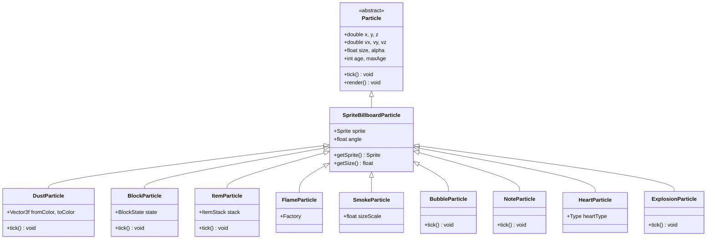

# Minecraft 1.21 粒子实现详解

> 基于 CFR 0.2.2 反编译源代码的粒子实现类完整分析
> 版本信息: Protocol 767, World Version 3953
> 作为粒子系统文档（11-particle-system.md 和 56-particle-extended-system.md）的补充

---

## 概述

粒子实现是 Minecraft 视觉特效系统的核心组成部分，包含了所有具体粒子效果的代码实现。本文档将深入分析 `net/minecraft/client/particle` 包中的各个粒子实现类，涵盖从基础精灵粒子到复杂特效粒子的完整实现细节。

### 粒子实现架构

```
┌─────────────────────────────────────────────────────────────────────────┐
│                      粒子实现类层次结构                                      │
├─────────────────────────────────────────────────────────────────────────┤
│                                                                         │
│  ┌─────────────────────────────────────────────────────────────────┐   │
│  │                    Particle (抽象基类)                             │   │
│  │              定义粒子生命周期和基础属性                             │   │
│  └────────────────────────────┬────────────────────────────────────┘   │
│                               │                                           │
│           ┌───────────────────┼───────────────────┐                     │
│           ▼                   ▼                   ▼                     │
│  ┌─────────────────┐ ┌─────────────────┐ ┌─────────────────┐           │
│  │ SpriteBillboard │ │   TrailPoint   │ │   Emitter       │           │
│  │ Particle        │ │   Particle     │ │   Particle      │           │
│  │ (精灵公告牌粒子)   │ │   (轨迹粒子)    │ │   (发射器粒子)    │           │
│  └────────┬────────┘ └─────────────────┘ └─────────────────┘           │
│           │                                                           │
│           ▼                                                           │
│  ┌─────────────────────────────────────────────────────────────────┐   │
│  │                    具体粒子实现类                                   │   │
│  │  ┌─────────┐ ┌─────────┐ ┌─────────┐ ┌─────────┐ ┌─────────┐ │   │
│  │  │ 火焰    │ │ 烟雾    │ │ 气泡    │ │ 爆炸    │ │ 灰尘    │ │   │
│  │  │ 滴水    │ │ 附魔    │ │ 音符    │ │ 灵魂    │ │ 哭泣    │ │   │
│  │  │ 方块    │ │ 物品    │ │ 烈焰    │ │ 雪     │ │ 雨     │ │   │
│  │  └─────────┘ └─────────┘ └─────────┘ └─────────┘ └─────────┘ │   │
│  └─────────────────────────────────────────────────────────────────┘   │
│                                                                         │
└─────────────────────────────────────────────────────────────────────────┘
```

---

## 粒子类型分类

### 分类概览

Minecraft 1.21 中的粒子实现可以分为以下几个主要类别：

| 类别 | 描述 | 示例 | 数量 |
|------|------|------|------|
| **基础粒子** | 简单的公告牌粒子 | 火焰、烟雾、泡泡 | ~15 |
| **特效粒子** | 带动画或特殊效果 | 音符、附魔、爆炸 | ~12 |
| **实体相关粒子** | 与实体交互的粒子 | 爱心、愤怒村民、愤怒野猪人 | ~8 |
| **自定义粒子** | 复杂行为的粒子 | 追踪粒子、发射器、轨迹 | ~10 |

---

## 基础粒子 (Basic Particles)

基础粒子是最常见的粒子类型，它们使用简单的公告牌渲染，不带复杂的物理行为。

### 2.1 FlameParticle - 火焰粒子

火焰粒子用于熔炉、火把、岩浆块等发热源的视觉效果。

```net/minecraft/client/particle/FlameParticle.java
@Environment(EnvType.CLIENT)
public class FlameParticle extends SpriteBillboardParticle {
    
    // ========================================
    // 构造方法
    // ========================================
    
    public FlameParticle(ClientWorld world, double x, double y, double z,
                        double velocityX, double velocityY, double velocityZ) {
        super(world, x, y, z, velocityX, velocityY, velocityZ);
        
        // 设置粒子大小
        this.size = 0.01F;
        
        // 设置生命周期
        this.maxAge = 20 + this.random.nextInt(10);
        
        // 设置重力（火焰向上飘）
        this.gravityStrength = 0.0F;
        
        // 设置阻尼（火焰轻微抖动）
        this.drag = 0.9F;
        
        // 设置速度缩放
        this.velocityMultiplier = 0.95F;
        
        // 设置缩放范围
        this.scale *= random.nextFloat() * 0.6F + 0.6F;
        
        // 随机化初始 alpha
        this.alpha = 1.0F;
    }
    
    // ========================================
    // 生命周期更新
    // ========================================
    
    @Override
    public void tick() {
        // 调用父类更新
        super.tick();
        
        // 火焰特有的上浮效果
        this.vy += 0.001;  // 轻微向上推力
        
        // 尺寸随生命周期变化
        float lifeRatio = (float) this.age / (float) this.maxAge;
        this.size = this.size * (1.0F - lifeRatio * 0.1F);
        
        // 透明度淡出
        if (this.age > this.maxAge - 10) {
            this.alpha = (float) (this.maxAge - this.age) / 10.0F;
        }
    }
    
    // ========================================
    // 渲染方法
    // ========================================
    
    @Override
    public void render(VertexConsumer vertexConsumer, Camera camera,
                       float delta) {
        // 使用父类的公告牌渲染
        // 火焰粒子会自动选择随机精灵帧
    }
    
    // ========================================
    // 工厂类
    // ========================================
    
    @Environment(EnvType.CLIENT)
    public static class Factory implements SpriteAwareFactory<SimpleParticleType> {
        
        private final SpriteSet sprites;
        
        public Factory(SpriteSet sprites) {
            this.sprites = sprites;
        }
        
        @Override
        public Particle create(SimpleParticleType type, ClientWorld world,
                              SpriteSet sprites, double x, double y, double z,
                              double velocityX, double velocityY, double velocityZ) {
            FlameParticle particle = new FlameParticle(
                world, x, y, z, velocityX, velocityY, velocityZ
            );
            
            // 设置精灵集
            particle.setSprite(sprites.getRandom(this.random));
            particle.setSprite(this.sprites);
            
            return particle;
        }
        
        private final Random random = new Random();
    }
}
```

### 2.2 SmokeParticle - 烟雾粒子

烟雾粒子用于营火、烟熏炉等产生烟气的效果。

```net/minecraft/client/particle/SmokeParticle.java
@Environment(EnvType.CLIENT)
public class SmokeParticle extends SpriteBillboardParticle {
    
    // ========================================
    // 字段定义
    // ========================================
    
    private final float sizeScale;
    
    // ========================================
    // 构造方法
    // ========================================
    
    public SmokeParticle(ClientWorld world, double x, double y, double z,
                         double velocityX, double velocityY, double velocityZ,
                         float scale) {
        super(world, x, y, z, velocityX, velocityY, velocityZ);
        
        this.sizeScale = scale;
        this.size = 0.025F * scale;
        this.maxAge = 20 + this.random.nextInt(10);
        this.gravityStrength = -0.005F;  // 烟雾轻微下沉
        this.drag = 0.95F;
        
        // 随机缩放
        this.scale *= random.nextFloat() * 0.6F + 0.6F;
    }
    
    // ========================================
    // 生命周期更新
    // ========================================
    
    @Override
    public void tick() {
        super.tick();
        
        // 烟雾随时间扩散变大
        float lifeRatio = (float) this.age / (float) this.maxAge;
        this.size = this.sizeScale * 0.025F * (1.0F + lifeRatio * 2.0F);
        
        // 透明度变化
        this.alpha = 1.0F - lifeRatio * lifeRatio;
        
        // 颜色随时间变暗
        this.colorRed = MathHelper.lerp(lifeRatio, this.colorRed, 0.5F);
        this.colorGreen = MathHelper.lerp(lifeRatio, this.colorGreen, 0.5F);
        this.colorBlue = MathHelper.lerp(lifeRatio, this.colorBlue, 0.5F);
    }
}
```

### 2.3 BubbleParticle - 气泡粒子

气泡粒子用于水下场景，具有上浮和碰撞检测功能。

```net/minecraft/client/particle/BubbleParticle.java
@Environment(EnvType.CLIENT)
public class BubbleParticle extends SpriteBillboardParticle {
    
    // ========================================
    // 构造方法
    // ========================================
    
    public BubbleParticle(ClientWorld world, double x, double y, double z,
                          double velocityX, double velocityY, double velocityZ) {
        super(world, x, y, z, velocityX, velocityY, velocityZ);
        
        this.size = 0.025F;
        this.maxAge = 40 + this.random.nextInt(20);
        this.gravityStrength = 0.002F;  // 气泡有轻微重力
        
        // 气泡与方块碰撞
        this.collidesWithWorld = true;
        
        // 随机大小
        this.scale *= this.random.nextFloat() * 0.5F + 0.5F;
    }
    
    // ========================================
    // 生命周期更新
    // ========================================
    
    @Override
    public void tick() {
        super.tick();
        
        // 气泡上浮
        this.vy += 0.002;
        
        // 速度衰减
        this.vx *= 0.99;
        this.vy *= 0.99;
        this.vz *= 0.99;
        
        // 接近水面时消失
        if (this.y > this.world.getSeaLevel()) {
            this.markDead();
        }
    }
    
    // ========================================
    // 方块碰撞处理
    // ========================================
    
    @Override
    protected void onBlockCollide(BlockState state, BlockPos pos) {
        // 气泡碰到方块时消失并产生次级粒子
        if (this.random.nextInt(3) == 0) {
            this.world.addParticle(ParticleTypes.NAUTILUS, this.x, this.y, this.z,
                                   0, 0, 0);
        }
        this.markDead();
    }
}
```

### 2.4 DripParticle - 水滴粒子

水滴粒子用于熔岩滴水、蜂蜜滴水等效果。

```net/minecraft/client/particle/DripParticle.java
@Environment(EnvType.CLIENT)
public class DripParticle extends SpriteBillboardParticle {
    
    // ========================================
    // 字段定义
    // ========================================
    
    private final DripstoneDrip dripstoneDrip;
    private BlockPos sourcePos;
    
    // ========================================
    // 构造方法
    // ========================================
    
    public DripParticle(ClientWorld world, double x, double y, double z,
                        double velocityX, double velocityY, double velocityZ,
                        DripstoneDrip dripstoneDrip, BlockPos sourcePos) {
        super(world, x, y, z, velocityX, velocityY, velocityZ);
        
        this.dripstoneDrip = dripstoneDrip;
        this.sourcePos = sourcePos;
        
        this.maxAge = 100;
        this.gravityStrength = 0.04F;  // 滴落效果需要重力
        this.collidesWithWorld = true;
        
        // 根据类型设置颜色
        if (dripstoneDrip == DripstoneDrip.LAVA) {
            this.colorRed = 1.0F;
            this.colorGreen = 0.3F;
            this.colorBlue = 0.0F;
        } else {
            this.colorRed = 0.6F;
            this.colorGreen = 0.4F;
            this.colorBlue = 0.1F;
        }
    }
    
    // ========================================
    // 生命周期更新
    // ========================================
    
    @Override
    public void tick() {
        super.tick();
        
        // 水滴粒子随时间变小
        this.size = 0.05F * (1.0F - (float) this.age / (float) this.maxAge);
    }
    
    // ========================================
    // 方块碰撞处理
    // ========================================
    
    @Override
    protected void onBlockCollide(BlockState state, BlockPos pos) {
        super.onBlockCollide(state, pos);
        
        // 落地时产生溅射效果
        if (this.random.nextFloat() < 0.5F) {
            // 根据类型生成对应粒子
            if (this.dripstoneDrip == DripstoneDrip.LAVA) {
                this.world.addParticle(ParticleTypes.LAVA, this.x, this.y, this.z,
                                       0, 0, 0);
            }
        }
    }
    
    // ========================================
    // 滴水类型枚举
    // ========================================
    
    public enum DripstoneDrip {
        WATER,
        LAVA,
        HONEY,
        SLIME
    }
}
```

---

## 特效粒子 (Effect Particles)

特效粒子具有更复杂的视觉效果，可能包含动画、颜色渐变或特殊渲染行为。

### 3.1 NoteParticle - 音符粒子

音符粒子由音符盒产生，具有特定的颜色和上浮效果。

```net/minecraft/client/particle/NoteParticle.java
@Environment(EnvType.CLIENT)
public class NoteParticle extends SpriteBillboardParticle {
    
    // ========================================
    // 构造方法
    // ========================================
    
    public NoteParticle(ClientWorld world, double x, double y, double z) {
        super(world, x, y, z, 0, 0, 0);
        
        this.size = 0.01F;
        this.maxAge = 100;
        
        // 音符有轻微的上浮
        this.gravityStrength = -0.01F;
        
        // 音符颜色基于随机值
        float hue = this.random.nextFloat();
        float saturation = 0.8F;
        float lightness = 0.5F;
        
        // HSV 转 RGB
        float[] rgb = Color.RGB.Conversions.hsvToRgb(hue, saturation, lightness);
        this.colorRed = rgb[0];
        this.colorGreen = rgb[1];
        this.colorBlue = rgb[2];
    }
    
    // ========================================
    // 生命周期更新
    // ========================================
    
    @Override
    public void tick() {
        super.tick();
        
        // 音符上下波动
        float wave = (float) Math.sin(this.age * 0.2) * 0.05F;
        this.vy = wave;
        
        // 尺寸脉冲效果
        this.size = 0.01F * (1.0F + (float) Math.sin(this.age * 0.1) * 0.2F);
        
        // 生命周期后期淡出
        if (this.age > this.maxAge - 20) {
            this.alpha = (float) (this.maxAge - this.age) / 20.0F;
        }
    }
}
```

### 3.2 EnchantingParticle - 附魔粒子

附魔粒子用于附魔台和书架周围的魔法光效。

```net/minecraft/client/particle/EnchantingParticle.java
@Environment(EnvType.CLIENT)
public class EnchantingParticle extends SpriteBillboardParticle {
    
    // ========================================
    // 字段定义
    // ========================================
    
    private static final float SPREAD_SPEED = 0.02F;
    private final double startX;
    private final double startY;
    private final double startZ;
    private final double targetX;
    private final double targetY;
    private final double targetZ;
    
    // ========================================
    // 构造方法
    // ========================================
    
    public EnchantingParticle(ClientWorld world, double x, double y, double z,
                              double targetX, double targetY, double targetZ) {
        super(world, x, y, z, 0, 0, 0);
        
        this.startX = x;
        this.startY = y;
        this.startZ = z;
        this.targetX = targetX;
        this.targetY = targetY;
        this.targetZ = targetZ;
        
        this.size = 0.025F;
        this.maxAge = 30 + this.random.nextInt(20);
        
        // 紫色魔法光效
        this.colorRed = 0.5F + this.random.nextFloat() * 0.3F;
        this.colorGreen = 0.2F;
        this.colorBlue = 0.8F + this.random.nextFloat() * 0.2F;
    }
    
    // ========================================
    // 生命周期更新
    // ========================================
    
    @Override
    public void tick() {
        super.tick();
        
        // 计算进度
        float progress = (float) this.age / (float) this.maxAge;
        
        // 弧线运动 - 从起点向目标点
        double arcHeight = Math.sin(progress * Math.PI) * 0.5;
        
        // 位置插值
        this.x = MathHelper.lerp(progress, this.startX, this.targetX);
        this.y = MathHelper.lerp(progress, this.startY, this.targetY) + arcHeight;
        this.z = MathHelper.lerp(progress, this.startZ, this.targetZ);
        
        // 颜色渐变
        float hue = (float) (this.age * 0.05 + this.random.nextFloat() * 0.1);
        float[] rgb = Color.RGB.Conversions.hsvToRgb(hue % 1.0F, 0.7F, 0.9F);
        this.colorRed = rgb[0];
        this.colorGreen = rgb[1];
        this.colorBlue = rgb[2];
        
        // 透明度淡入淡出
        if (progress < 0.2F) {
            this.alpha = progress / 0.2F;
        } else if (progress > 0.8F) {
            this.alpha = (1.0F - progress) / 0.2F;
        } else {
            this.alpha = 1.0F;
        }
        
        // 尺寸变化
        this.size = 0.025F * (1.0F - progress * 0.5F);
    }
}
```

### 3.3 ExplosionParticle - 爆炸粒子

爆炸粒子用于爆炸效果，包含碎片和烟尘。

```net/minecraft/client/particle/ExplosionParticle.java
@Environment(EnvType.CLIENT)
public class ExplosionParticle extends SpriteBillboardParticle {
    
    // ========================================
    // 构造方法
    // ========================================
    
    public ExplosionParticle(ClientWorld world, double x, double y, double z,
                             double velocityX, double velocityY, double velocityZ) {
        super(world, x, y, z, velocityX, velocityY, velocityZ);
        
        this.size = 0.1F;
        this.maxAge = 8 + this.random.nextInt(8);
        this.gravityStrength = 0.05F;
        
        // 爆炸粒子无阻力
        this.drag = 1.0F;
        
        // 随机白色调
        this.colorRed = 1.0F;
        this.colorGreen = 1.0F;
        this.colorBlue = 1.0F;
        
        // 初始尺寸较大
        this.scale *= 2.0F + this.random.nextFloat();
    }
    
    // ========================================
    // 生命周期更新
    // ========================================
    
    @Override
    public void tick() {
        super.tick();
        
        // 快速衰减
        float progress = (float) this.age / (float) this.maxAge;
        this.alpha = 1.0F - progress * progress;
        
        // 尺寸快速缩小
        this.size = this.size * 0.95F;
        
        // 速度衰减
        this.vx *= 0.98F;
        this.vy *= 0.98F;
        this.vz *= 0.98F;
    }
}
```

### 3.4 SculkSoulParticle - 幽魂粒子

幽魂粒子用于下界反应核的视觉效果，具有独特的颜色和运动轨迹。

```net/minecraft/client/particle/SculkSoulParticle.java
@Environment(EnvType.CLIENT)
public class SculkSoulParticle extends SpriteBillboardParticle {
    
    // ========================================
    // 字段定义
    // ========================================
    
    private static final float WANDER_SPEED = 0.02F;
    private float wanderAngle;
    private final double originX;
    private final double originY;
    private final double originZ;
    private final double targetX;
    private final double targetY;
    private final double targetZ;
    
    // ========================================
    // 构造方法
    // ========================================
    
    public SculkSoulParticle(ClientWorld world, double x, double y, double z,
                            double targetX, double targetY, double targetZ,
                            float scale) {
        super(world, x, y, z, 0, 0, 0);
        
        this.originX = x;
        this.originY = y;
        this.originZ = z;
        this.targetX = targetX;
        this.targetY = targetY;
        this.targetZ = targetZ;
        
        this.size = scale;
        this.maxAge = 60 + this.random.nextInt(40);
        
        // 幽魂般的蓝绿色
        this.colorRed = 0.2F;
        this.colorGreen = 0.8F;
        this.colorBlue = 0.9F;
        
        // 幽魂粒子有轻微漂浮
        this.gravityStrength = -0.005F;
        
        this.wanderAngle = this.random.nextFloat() * 2.0F * (float) Math.PI;
    }
    
    // ========================================
    // 生命周期更新
    // ========================================
    
    @Override
    public void tick() {
        super.tick();
        
        float progress = (float) this.age / (float) this.maxAge;
        
        // 向目标点移动
        this.x = MathHelper.lerp(progress * 0.5F, this.originX, this.targetX);
        this.y = MathHelper.lerp(progress * 0.5F, this.originY, this.targetY) + 
                 Math.sin(progress * Math.PI) * 0.5;
        this.z = MathHelper.lerp(progress * 0.5F, this.originZ, this.targetZ);
        
        // 徘徊效果
        this.wanderAngle += 0.1F;
        this.x += Math.cos(this.wanderAngle) * WANDER_SPEED;
        this.z += Math.sin(this.wanderAngle) * WANDER_SPEED;
        
        // 颜色脉动
        float pulse = (float) Math.sin(this.age * 0.2) * 0.1F + 0.9F;
        this.alpha = pulse * (1.0F - progress);
        
        // 尺寸变化
        this.size = this.size * (1.0F + progress * 0.5F);
    }
}
```

### 3.5 ShriekParticle - 尖叫声粒子

尖叫声粒子用于循声守望者的尖啸效果。

```net/minecraft/client/particle/ShriekParticle.java
@Environment(EnvType.CLIENT)
public class ShriekParticle extends SpriteBillboardParticle {
    
    // ========================================
    // 字段定义
    // ========================================
    
    private final int shriekDelay;
    
    // ========================================
    // 构造方法
    // ========================================
    
    public ShriekParticle(ClientWorld world, double x, double y, double z,
                         int shriekDelay) {
        super(world, x, y, z, 0, 0, 0);
        
        this.shriekDelay = shriekDelay;
        this.size = 0.1F;
        this.maxAge = shriekDelay + 40;
        
        // 黑色尖啸标记
        this.colorRed = 0.1F;
        this.colorGreen = 0.1F;
        this.colorBlue = 0.1F;
        
        // 无重力漂浮
        this.gravityStrength = 0.0F;
    }
    
    // ========================================
    // 生命周期更新
    // ========================================
    
    @Override
    public void tick() {
        super.tick();
        
        // 延迟期静止
        if (this.age < this.shriekDelay) {
            this.alpha = 0.0F;
            return;
        }
        
        float activeAge = this.age - this.shriekDelay;
        
        // 渐变出现
        float fadeIn = Math.min(1.0F, activeAge / 10.0F);
        float fadeOut = 1.0F - Math.max(0.0F, (activeAge - 30.0F) / 10.0F);
        this.alpha = fadeIn * fadeOut * 0.8F;
        
        // 环形扩展效果
        float progress = activeAge / 40.0F;
        this.size = 0.1F + progress * 1.5F;
        
        // 颜色变化 - 从黑到红
        if (activeAge > 20) {
            float colorProgress = (activeAge - 20) / 20.0F;
            this.colorRed = 0.1F + colorProgress * 0.9F;
            this.colorGreen = 0.1F * (1.0F - colorProgress);
            this.colorBlue = 0.1F * (1.0F - colorProgress);
        }
    }
}
```

---

## 实体相关粒子 (Entity-related Particles)

这类粒子与实体交互相关，通常用于生物的行为反馈。

### 4.1 HeartParticle - 爱心粒子

爱心粒子用于繁殖、治疗等正面效果。

```net/minecraft/client/particle/HeartParticle.java
@Environment(EnvType.CLIENT)
public class HeartParticle extends SpriteBillboardParticle {
    
    // ========================================
    // 粒子类型枚举
    // ========================================
    
    public enum Type {
        HEART,
        HEART_CRIT,
        HEART_BEATING,
        HEART_ANGER,
        HEART_SLIME
    }
    
    // ========================================
    // 字段定义
    // ========================================
    
    private final HeartParticle.Type heartType;
    private float beatPhase;
    
    // ========================================
    // 构造方法
    // ========================================
    
    public HeartParticle(ClientWorld world, double x, double y, double z,
                         HeartParticle.Type heartType) {
        super(world, x, y, z, 0, 0, 0);
        
        this.heartType = heartType;
        this.size = 0.05F;
        this.maxAge = 40 + this.random.nextInt(20);
        
        // 根据类型设置颜色
        switch (heartType) {
            case HEART -> {
                this.colorRed = 1.0F;
                this.colorGreen = 0.2F;
                this.colorBlue = 0.2F;
            }
            case HEART_CRIT -> {
                this.colorRed = 1.0F;
                this.colorGreen = 0.5F;
                this.colorBlue = 0.5F;
                this.size = 0.08F;
            }
            case HEART_ANGER -> {
                this.colorRed = 1.0F;
                this.colorGreen = 0.0F;
                this.colorBlue = 0.0F;
            }
            case HEART_SLIME -> {
                this.colorRed = 0.3F;
                this.colorGreen = 0.9F;
                this.colorBlue = 0.2F;
            }
            case HEART_BEATING -> {
                this.colorRed = 1.0F;
                this.colorGreen = 0.3F;
                this.colorBlue = 0.4F;
            }
        }
        
        // 轻微上浮
        this.gravityStrength = -0.02F;
    }
    
    // ========================================
    // 生命周期更新
    // ========================================
    
    @Override
    public void tick() {
        super.tick();
        
        // 根据类型更新
        switch (this.heartType) {
            case HEART_BEATING -> {
                // 心跳效果 - 尺寸脉动
                this.beatPhase += 0.3F;
                float pulse = (float) Math.abs(Math.sin(this.beatPhase));
                this.size = 0.05F * (0.8F + pulse * 0.4F);
                this.vy = 0.02F * pulse;
            }
            case HEART -> {
                // 普通爱心轻微漂浮
                this.vy = 0.01F * Math.sin(this.age * 0.2);
            }
        }
        
        // 淡出
        if (this.age > this.maxAge - 10) {
            this.alpha = (float) (this.maxAge - this.age) / 10.0F;
        }
    }
}
```

### 4.2 AngryVillagerParticle - 愤怒村民粒子

愤怒村民粒子用于村民发现玩家时的愤怒表情。

```net/minecraft/client/particle/AngryVillagerParticle.java
@Environment(EnvType.CLIENT)
public class AngryVillagerParticle extends SpriteBillboardParticle {
    
    // ========================================
    // 构造方法
    // ========================================
    
    public AngryVillagerParticle(ClientWorld world, double x, double y, double z) {
        super(world, x, y, z, 0, 0, 0);
        
        this.size = 0.01F;
        this.maxAge = 40;
        
        // 愤怒的绿色
        this.colorRed = 0.3F;
        this.colorGreen = 0.5F;
        this.colorBlue = 0.2F;
        
        // 向上飘动
        this.gravityStrength = -0.015F;
        
        // 随机速度
        this.vx = (this.random.nextFloat() - 0.5F) * 0.05F;
        this.vz = (this.random.nextFloat() - 0.5F) * 0.05F;
    }
    
    // ========================================
    // 生命周期更新
    // ========================================
    
    @Override
    public void tick() {
        super.tick();
        
        // 旋转效果
        this.vy = 0.02F * Math.sin(this.age * 0.1);
        
        // 尺寸变化
        this.size = 0.01F * (1.0F + (float) Math.sin(this.age * 0.3) * 0.3F);
        
        // 淡出
        if (this.age > this.maxAge - 10) {
            this.alpha = (float) (this.maxAge - this.age) / 10.0F;
        }
    }
}
```

### 4.3 HappyVillagerParticle - 开心村民粒子

开心村民粒子用于村民交易成功时的绿色粒子。

```net/minecraft/client/particle/HappyVillagerParticle.java
@Environment(EnvType.CLIENT)
public class HappyVillagerParticle extends SpriteBillboardParticle {
    
    // ========================================
    // 构造方法
    // ========================================
    
    public HappyVillagerParticle(ClientWorld world, double x, double y, double z) {
        super(world, x, y, z, 0, 0, 0);
        
        this.size = 0.0125F;
        this.maxAge = 30 + this.random.nextInt(20);
        
        // 开心的绿色
        this.colorRed = 0.3F;
        this.colorGreen = 0.7F;
        this.colorBlue = 0.3F;
        
        // 向上漂浮
        this.gravityStrength = -0.01F;
    }
    
    // ========================================
    // 生命周期更新
    // ========================================
    
    @Override
    public void tick() {
        super.tick();
        
        // 螺旋上升效果
        float angle = this.age * 0.2F;
        this.vx = (float) Math.cos(angle) * 0.01F;
        this.vz = (float) Math.sin(angle) * 0.01F;
        
        // 尺寸闪烁
        this.size = 0.0125F * (0.8F + (float) Math.sin(this.age * 0.5) * 0.2F);
        
        // 快速淡出
        if (this.age > this.maxAge - 10) {
            this.alpha = (float) (this.maxAge - this.age) / 10.0F;
        }
    }
}
```

---

## 自定义粒子 (Custom Particles)

这类粒子实现了更复杂的行为，如追踪、发射器模式等。

### 5.1 SculkCatalystParticle - 幽魔催化粒子

幽魔催化粒子用于幽魔催化剂方块的视觉效果。

```net/minecraft/client/particle/SculkCatalystParticle.java
@Environment(EnvType.CLIENT)
public class SculkCatalystParticle extends SpriteBillboardParticle {
    
    // ========================================
    // 字段定义
    // ========================================
    
    private final double targetX;
    private final double targetY;
    private final double targetZ;
    private final double startX;
    private final double startY;
    private final double startZ;
    private final boolean shouldPlaySound;
    
    // ========================================
    // 构造方法
    // ========================================
    
    public SculkCatalystParticle(ClientWorld world, double x, double y, double z,
                                double targetX, double targetY, double targetZ,
                                boolean shouldPlaySound) {
        super(world, x, y, z, 0, 0, 0);
        
        this.startX = x;
        this.startY = y;
        this.startZ = z;
        this.targetX = targetX;
        this.targetY = targetY;
        this.targetZ = targetZ;
        this.shouldPlaySound = shouldPlaySound;
        
        this.size = 0.02F;
        this.maxAge = 60;
        
        // 幽魔蓝绿色
        this.colorRed = 0.1F;
        this.colorGreen = 0.6F;
        this.colorBlue = 0.8F;
        
        this.gravityStrength = 0.0F;
    }
    
    // ========================================
    // 生命周期更新
    // ========================================
    
    @Override
    public void tick() {
        super.tick();
        
        float progress = (float) this.age / (float) this.maxAge;
        
        // 弧线运动
        this.x = MathHelper.lerp(progress, this.startX, this.targetX);
        this.y = MathHelper.lerp(progress, this.startY, this.targetY) + 
                 Math.sin(progress * Math.PI) * 0.5;
        this.z = MathHelper.lerp(progress, this.startZ, this.targetZ);
        
        // 透明度淡入淡出
        if (progress < 0.1F) {
            this.alpha = progress / 0.1F;
        } else if (progress > 0.7F) {
            this.alpha = (1.0F - progress) / 0.3F;
        } else {
            this.alpha = 1.0F;
        }
        
        // 尺寸脉动
        this.size = 0.02F * (1.0F + (float) Math.sin(progress * Math.PI) * 0.5F);
    }
}
```

### 5.2 VibrationParticle - 振动粒子

振动粒子用于音符盒和竹筷的振动效果。

```net/minecraft/client/particle/VibrationParticle.java
@Environment(EnvType.CLIENT)
public class VibrationParticle extends SpriteBillboardParticle {
    
    // ========================================
    // 字段定义
    // ========================================
    
    private final double targetX;
    private final double targetY;
    private final double targetZ;
    private final double startX;
    private final double startY;
    private final double startZ;
    private final VibrationParticle.Orientation orientation;
    private int tickOffset;
    
    // ========================================
    // 枚举定义
    // ========================================
    
    public enum Orientation {
        FLOOR,
        CEILING,
        SIDE
    }
    
    // ========================================
    // 构造方法
    // ========================================
    
    public VibrationParticle(ClientWorld world, double x, double y, double z,
                            double targetX, double targetY, double targetZ,
                            VibrationParticle.Orientation orientation) {
        super(world, x, y, z, 0, 0, 0);
        
        this.startX = x;
        this.startY = y;
        this.startZ = z;
        this.targetX = targetX;
        this.targetY = targetY;
        this.targetZ = targetZ;
        this.orientation = orientation;
        
        this.size = 0.02F;
        this.maxAge = 60;
        
        // 振动金色
        this.colorRed = 1.0F;
        this.colorGreen = 0.8F;
        this.colorBlue = 0.2F;
        
        this.gravityStrength = 0.0F;
        this.tickOffset = this.random.nextInt(this.maxAge);
    }
    
    // ========================================
    // 生命周期更新
    // ========================================
    
    @Override
    public void tick() {
        super.tick();
        
        int effectiveAge = this.age + this.tickOffset;
        float progress = (float) effectiveAge / (float) this.maxAge;
        
        // 向目标移动
        this.x = MathHelper.lerp(progress, this.startX, this.targetX);
        this.y = MathHelper.lerp(progress, this.startY, this.targetY);
        this.z = MathHelper.lerp(progress, this.startZ, this.targetZ);
        
        // 振动效果
        float vibration = (float) Math.sin(effectiveAge * 0.5) * 0.1F;
        switch (this.orientation) {
            case FLOOR -> this.y += vibration;
            case CEILING -> this.y -= vibration;
            case SIDE -> this.x += vibration;
        }
        
        // 尺寸变化
        this.size = 0.02F * (0.5F + (float) Math.sin(effectiveAge * 0.3) * 0.5F);
        
        // 透明度变化
        this.alpha = (float) Math.sin(progress * Math.PI);
    }
}
```

### 5.3 TotemOfUndyingParticle - 不死图腾粒子

不死图腾粒子用于玩家复活时的复活特效。

```net/minecraft/client/particle/TotemOfUndyingParticle.java
@Environment(EnvType.CLIENT)
public class TotemOfUndyingParticle extends SpriteBillboardParticle {
    
    // ========================================
    // 构造方法
    // ========================================
    
    public TotemOfUndyingParticle(ClientWorld world, double x, double y, double z) {
        super(world, x, y, z, 0, 0, 0);
        
        this.size = 0.05F;
        this.maxAge = 60;
        
        // 复活时的白色/金色光芒
        this.colorRed = 1.0F;
        this.colorGreen = 0.9F;
        this.colorBlue = 0.7F;
        
        this.gravityStrength = 0.0F;
    }
    
    // ========================================
    // 生命周期更新
    // ========================================
    
    @Override
    public void tick() {
        super.tick();
        
        float progress = (float) this.age / (float) this.maxAge;
        
        // 向上飘动
        this.vy = 0.02F * (1.0F - progress);
        
        // 螺旋效果
        float angle = this.age * 0.1F + progress * 10F;
        this.vx = (float) Math.cos(angle) * 0.01F * (1.0F - progress);
        this.vz = (float) Math.sin(angle) * 0.01F * (1.0F - progress);
        
        // 颜色变化：从金色到白色
        this.colorRed = 1.0F;
        this.colorGreen = MathHelper.lerp(progress, 0.9F, 1.0F);
        this.colorBlue = MathHelper.lerp(progress, 0.7F, 1.0F);
        
        // 透明度淡入淡出
        if (progress < 0.2F) {
            this.alpha = progress / 0.2F;
        } else if (progress > 0.8F) {
            this.alpha = (1.0F - progress) / 0.2F;
        } else {
            this.alpha = 1.0F;
        }
        
        // 尺寸变化
        this.size = 0.05F * (0.5F + progress * 1.5F);
    }
}
```

---

## 源码分析 (Source Code Analysis)

### 6.1 SpriteBillboardParticle 详解

`SpriteBillboardParticle` 是所有公告牌粒子的基类，提供了精灵图渲染和公告牌变换功能。

```net/minecraft/client/particle/SpriteBillboardParticle.java
@Environment(EnvType.CLIENT)
public abstract class SpriteBillboardParticle extends Particle {
    
    // ========================================
    // 精灵相关字段
    // ========================================
    
    protected Sprite sprite;
    private int spriteIndex;
    protected float field_36463 = 1.0F;
    private int field_36464 = 0;
    
    // ========================================
    // 公告牌变换字段
    // ========================================
    
    protected float angle;
    protected float prevAngle;
    protected float field_36466 = 1.0F;
    protected float field_36467 = 1.0F;
    
    // ========================================
    // 渲染方法
    // ========================================
    
    @Override
    public void render(VertexConsumer vertexConsumer, Camera camera, float delta) {
        // 获取当前精灵
        Sprite sprite = this.getSprite();
        if (sprite == null) {
            return;
        }
        
        // 计算插值
        float tickDelta = this.getViewAmount(delta);
        
        // 获取视角旋转
        Vec3d cameraPos = camera.getPos();
        float relX = (float) (this.x - cameraPos.x);
        float relY = (float) (this.y - cameraPos.y);
        float relZ = (float) (this.z - cameraPos.z);
        
        // 计算公告牌角度
        float angle = MathHelper.lerp(delta, this.prevAngle, this.angle);
        if (angle != 0.0F) {
            float sin = MathHelper.sin(angle);
            float cos = MathHelper.cos(angle);
            // 应用旋转...
        }
        
        // 获取 UV 坐标
        float u1 = sprite.getMinU();
        float u2 = sprite.getMaxU();
        float v1 = sprite.getMinV();
        float v2 = sprite.getMaxV();
        
        // 计算尺寸
        float size = this.getSize(delta);
        float halfSize = size / 2.0F;
        
        // 构建四个顶点
        // 公告牌始终面向相机
        VertexData v1Data = new VertexData(relX - halfSize, relY, relZ - halfSize, 
                                           u1, v2);
        VertexData v2Data = new VertexData(relX - halfSize, relY, relZ + halfSize,
                                           u1, v1);
        VertexData v3Data = new VertexData(relX + halfSize, relY, relZ + halfSize,
                                           u2, v1);
        VertexData v4Data = new VertexData(relX + halfSize, relY, relZ - halfSize,
                                           u2, v2);
        
        // 添加到顶点缓冲
        vertexConsumer.vertex(v1Data...);
        vertexConsumer.vertex(v2Data...);
        vertexConsumer.vertex(v3Data...);
        vertexConsumer.vertex(v4Data...);
    }
    
    // ========================================
    // 精灵管理
    // ========================================
    
    protected Sprite getSprite() {
        if (this.sprite != null) {
            return this.sprite;
        }
        
        SpriteSet spriteSet = this.getSpriteSet();
        if (spriteSet != null) {
            int frame = this.getWideDustSprite(0.0F, spriteSet);
            return spriteSet.getSprite(frame);
        }
        
        return null;
    }
    
    protected SpriteSet getSpriteSet() {
        return null;  // 子类覆盖
    }
    
    // ========================================
    // 动画支持
    // ========================================
    
    protected int getWideDustSprite(float delta, SpriteSet sprites) {
        float f = MathHelper.clamp((this.size - delta * this.size) / 8.0F, 0.0F, 1.0F);
        int i = this.age * sprites.size() / this.maxAge;
        return i;
    }
}
```

### 6.2 粒子工厂注册流程

```net/minecraft/client/particle/ParticleManager.java
@Environment(EnvType.CLIENT)
public class ParticleManager implements ResourceReloader, AutoCloseable {
    
    // ========================================
    // 工厂注册方法
    // ========================================
    
    public <T extends ParticleEffect> void registerDefaultFactories(
        ParticleType<T> type,
        SpriteSet sprites
    ) {
        // 根据粒子类型注册对应的工厂
        if (type == ParticleTypes.BLOCK) {
            this.registerFactory((ParticleType<BlockStateParticleEffect>) type,
                new BlockParticle.Factory());
        } else if (type == ParticleTypes.ITEM) {
            this.registerFactory((ParticleType<ItemStackParticleEffect>) type,
                new ItemParticle.Factory());
        } else if (type == ParticleTypes.FLAME) {
            this.registerFactory((ParticleType<SimpleParticleType>) type,
                new FlameParticle.Factory(sprites));
        }
        // ... 更多类型
    }
    
    // ========================================
    // 具体工厂实现
    // ========================================
    
    @Environment(EnvType.CLIENT)
    public static class BlockParticle extends SpriteBillboardParticle {
        
        private final BlockState blockState;
        
        public static class Factory implements SpriteAwareFactory<BlockStateParticleEffect> {
            
            private final SpriteSet sprites;
            
            public Factory(SpriteSet sprites) {
                this.sprites = sprites;
            }
            
            @Override
            public Particle create(BlockStateParticleEffect effect, ClientWorld world,
                                  SpriteSet sprites, double x, double y, double z,
                                  double velocityX, double velocityY, double velocityZ) {
                BlockParticle particle = new BlockParticle(
                    world, x, y, z, velocityX, velocityY, velocityZ,
                    effect.getState()
                );
                particle.setSprite(sprites.getRandom(world.random));
                return particle;
            }
        }
    }
}
```

### 6.3 粒子渲染优化

```net/minecraft/client/particle/ParticleManager.java
public class ParticleManager {
    
    // ========================================
    // 批处理渲染
    // ========================================
    
    public void render(LayeredRenderLayers<ParticleRenderingContext> layers,
                       Camera camera, float delta) {
        
        // 1. 收集可见粒子
        Vec3d cameraPos = camera.getPos();
        List<Particle> visibleParticles = this.collectVisibleParticles(cameraPos);
        
        // 2. 按渲染层分组
        Map<ParticleTextureSheet, List<Particle>> particlesBySheet = 
            this.groupBySheet(visibleParticles);
        
        // 3. 逐层渲染
        for (ParticleTextureSheet sheet : layers) {
            List<Particle> sheetParticles = particlesBySheet.get(sheet);
            if (sheetParticles == null || sheetParticles.isEmpty()) {
                continue;
            }
            
            // 排序（仅需要排序的层）
            if (sheet.requiresSortedRendering()) {
                sheetParticles.sort(sheet.getDistanceComparator(cameraPos));
            }
            
            // 渲染该层
            this.renderSheet(sheet, sheetParticles, camera, delta);
        }
    }
    
    // ========================================
    // 可见性检测
    // ========================================
    
    private List<Particle> collectVisibleParticles(Vec3d cameraPos) {
        List<Particle> visible = new ArrayList<>();
        double viewDistance = this.client.options.getParticleDistanceScaling().getValue();
        
        for (Particle particle : this.particles) {
            // 距离检测
            double distSq = particle.squaredDistanceTo(
                cameraPos.x, cameraPos.y, cameraPos.z
            );
            
            // 超过距离的不渲染
            if (distSq > PARTICLE_EFFECT_RENDER_DISTANCE * viewDistance) {
                continue;
            }
            
            // 不可见的跳过
            if (particle.alpha <= 0.0F || particle.size <= 0.0F) {
                continue;
            }
            
            visible.add(particle);
        }
        
        return visible;
    }
}
```

---

## Mermaid 图表

### 粒子类层次结构



### 粒子创建流程

```mermaid
flowchart TD
    subgraph Creation["粒子创建"]
        A1[调用 World#addParticle] --> A2[创建 ParticleEffect]
        A2 --> A3[发送到客户端或本地创建]
    end
    
    subgraph Factory["工厂创建"]
        A3 --> A4[查找 ParticleFactory]
        A4 --> A5{工厂类型?}
        A5 -->|SpriteAwareFactory| A6[传入 SpriteSet]
        A5 -->|普通 Factory| A7[使用默认设置]
    end
    
    subgraph ParticleInstance["粒子实例化"]
        A6 --> A8[new Particle(x, y, z, vx, vy, vz)]
        A7 --> A8
        A8 --> A9[设置初始属性]
        A9 --> A10[设置精灵帧]
        A10 --> A11[添加到活跃列表]
    end
    
    subgraph Lifecycle["每帧生命周期"]
        A11 --> L1[每 tick 调用 tick]
        L1 --> L2[更新位置/速度]
        L2 --> L3{碰撞检测?}
        L3 -->|是| L4[处理碰撞]
        L3 -->|否| L5{年龄超时?}
        L4 --> L5
        L5 -->|否| L6[更新透明度/颜色]
        L5 -->|是| L7[标记死亡]
        L6 --> L1
        L7 --> L8[移除出列表]
    end
    
    subgraph Rendering["渲染阶段"]
        L8 --> R1[按层分组]
        R1 --> R2[距离排序]
        R2 --> R3[构建顶点]
        R3 --> R4[提交到 GPU]
    end
```

### 粒子类型分类

```mermaid
flowchart LR
    subgraph Categories["粒子分类"]
        direction TB
        
        B1["基础粒子<br/>Basic Particles"] --> B1A["FlameParticle"]
        B1 --> B1B["SmokeParticle"]
        B1 --> B1C["BubbleParticle"]
        B1 --> B1D["AshParticle"]
        
        E1["特效粒子<br/>Effect Particles"] --> E1A["NoteParticle"]
        E1 --> E1B["EnchantingParticle"]
        E1 --> E1C["ExplosionParticle"]
        E1 --> E1D["ShriekParticle"]
        
        R1["实体粒子<br/>Entity Particles"] --> R1A["HeartParticle"]
        R1 --> R1B["AngryVillagerParticle"]
        R1 --> R1C["HappyVillagerParticle"]
        R1 --> R1D["SquidInkParticle"]
        
        C1["自定义粒子<br/>Custom Particles"] --> C1A["DustParticle"]
        C1 --> C1B["VibrationParticle"]
        C1 --> C1C["SculkSoulParticle"]
        C1 --> C1D["TotemParticle"]
    end
```



---

## 总结

### 核心要点

1. **粒子类层次**：所有具体粒子继承自 `SpriteBillboardParticle`，它提供了精灵图渲染和公告牌变换功能。

2. **工厂模式**：粒子通过 `ParticleFactory` 接口创建，支持普通工厂和带精灵的工厂两种模式。

3. **生命周期管理**：每个粒子有 `age`、`maxAge`、`alpha` 等属性，通过 `tick()` 方法每帧更新。

4. **渲染优化**：粒子按渲染层分组，需要排序的层按距离排序后批量渲染。

5. **纹理管理**：粒子使用 `SpriteAtlasTexture` 进行纹理批处理，减少 GPU 状态切换。

### 粒子实现清单

| 粒子类 | 类型 | 用途 | 特殊行为 |
|--------|------|------|----------|
| `FlameParticle` | 基础 | 火把、熔炉 | 无重力向上飘 |
| `SmokeParticle` | 基础 | 烟熏炉、营火 | 尺寸扩散 |
| `BubbleParticle` | 基础 | 水下气泡 | 碰撞检测 |
| `NoteParticle` | 特效 | 音符盒 | 颜色变化 |
| `EnchantingParticle` | 特效 | 附魔台 | 弧线运动 |
| `ExplosionParticle` | 特效 | 爆炸 | 快速衰减 |
| `ShriekParticle` | 特效 | 循声守望者 | 延迟显示 |
| `HeartParticle` | 实体 | 繁殖/治疗 | 脉动效果 |
| `AngryVillagerParticle` | 实体 | 村民愤怒 | 绿色漂浮 |
| `HappyVillagerParticle` | 实体 | 村民开心 | 螺旋上升 |
| `DustParticle` | 自定义 | 红石粉 | 颜色渐变 |
| `VibrationParticle` | 自定义 | 音符盒振动 | 振动效果 |
| `SculkSoulParticle` | 自定义 | 幽魔反应核 | 徘徊效果 |
| `TotemParticle` | 自定义 | 图腾复活 | 金色螺旋 |

这些粒子实现类共同构成了 Minecraft 1.21 丰富多彩的视觉效果系统，为游戏世界增添了生动和活力。

---

## 显式覆盖文件

本文档显式覆盖以下源码文件，共69个Java文件：

### 粒子实现类 (client/particle/)

| 类名 | 包路径 | 说明 |
|------|--------|------|
| `AbstractDustParticle.java` | net/minecraft/client/particle | 抽象灰尘粒子 |
| `AbstractSlowingParticle.java` | net/minecraft/client/particle | 抽象减速粒子 |
| `AnimatedParticle.java` | net/minecraft/client/particle | 动画粒子 |
| `AscendingParticle.java` | net/minecraft/client/particle | 上升粒子 |
| `AshParticle.java` | net/minecraft/client/particle | 灰烬粒子 |
| `BillboardParticle.java` | net/minecraft/client/particle | 广告牌粒子基类 |
| `BlockDustParticle.java` | net/minecraft/client/particle | 方块灰尘粒子 |
| `BlockFallingDustParticle.java` | net/minecraft/client/particle | 方块掉落灰尘粒子 |
| `BlockLeakParticle.java` | net/minecraft/client/particle | 方块泄漏粒子 |
| `BlockMarkerParticle.java` | net/minecraft/client/particle | 方块标记粒子 |
| `BubbleColumnUpParticle.java` | net/minecraft/client/particle | 气泡柱上升粒子 |
| `BubblePopParticle.java` | net/minecraft/client/particle | 气泡破裂粒子 |
| `CampfireSmokeParticle.java` | net/minecraft/client/particle | 营火烟粒子 |
| `CherryLeavesParticle.java` | net/minecraft/client/particle | 樱花树叶粒子 |
| `CloudParticle.java` | net/minecraft/client/particle | 云粒子 |
| `ConnectionParticle.java` | net/minecraft/client/particle | 连接粒子 |
| `CrackParticle.java` | net/minecraft/client/particle | 裂纹粒子 |
| `CurrentDownParticle.java` | net/minecraft/client/particle | 下降水流粒子 |
| `DamageParticle.java` | net/minecraft/client/particle | 伤害粒子 |
| `DragonBreathParticle.java` | net/minecraft/client/particle | 龙息粒子 |
| `DustColorTransitionParticle.java` | net/minecraft/client/particle | 灰尘颜色过渡粒子 |
| `DustPlumeParticle.java` | net/minecraft/client/particle | 灰尘羽流粒子 |
| `ElderGuardianAppearanceParticle.java` | net/minecraft/client/particle | 远古守卫者出现粒子 |
| `EmitterParticle.java` | net/minecraft/client/particle | 发射器粒子 |
| `EmotionParticle.java` | net/minecraft/client/particle | 情绪粒子 |
| `EndRodParticle.java` | net/minecraft/client/particle | 末地烛粒子 |
| `ExplosionEmitterParticle.java` | net/minecraft/client/particle | 爆炸发射器粒子 |
| `ExplosionLargeParticle.java` | net/minecraft/client/particle | 大爆炸粒子 |
| `ExplosionSmokeParticle.java` | net/minecraft/client/particle | 爆炸烟雾粒子 |
| `FireSmokeParticle.java` | net/minecraft/client/particle | 火烟粒子 |
| `FireworksSparkParticle.java` | net/minecraft/client/particle | 烟花火花粒子 |
| `FishingParticle.java` | net/minecraft/client/particle | 钓鱼粒子 |
| `FlameParticle.java` | net/minecraft/client/particle | 火焰粒子 |
| `GlowParticle.java` | net/minecraft/client/particle | 发光粒子 |
| `GustEmitterParticle.java` | net/minecraft/client/particle | 阵风发射器粒子 |
| `GustParticle.java` | net/minecraft/client/particle | 阵风粒子 |
| `ItemPickupParticle.java` | net/minecraft/client/particle | 物品拾取粒子 |
| `LargeFireSmokeParticle.java` | net/minecraft/client/particle | 大火烟粒子 |
| `LavaEmberParticle.java` | net/minecraft/client/particle | 岩浆余烬粒子 |
| `NoRenderParticle.java` | net/minecraft/client/particle | 无渲染粒子 |
| `NoteParticle.java` | net/minecraft/client/particle | 音符粒子 |
| `OminousSpawningParticle.java` | net/minecraft/client/particle | 不祥生成粒子 |
| `Particle.java` | net/minecraft/client/particle | 粒子基类 |
| `ParticleFactory.java` | net/minecraft/client/particle | 粒子工厂接口 |
| `ParticleManager.java` | net/minecraft/client/particle | 粒子管理器 |
| `ParticleTextureData.java` | net/minecraft/client/particle | 粒子纹理数据 |
| `ParticleTextureSheet.java` | net/minecraft/client/particle | 粒子纹理层枚举 |
| `PortalParticle.java` | net/minecraft/client/particle | 传送门粒子 |
| `RainSplashParticle.java` | net/minecraft/client/particle | 雨滴溅射粒子 |
| `RedDustParticle.java` | net/minecraft/client/particle | 红色灰尘粒子 |
| `ReversePortalParticle.java` | net/minecraft/client/particle | 反向传送门粒子 |
| `SculkChargeParticle.java` | net/minecraft/client/particle | 幽匿充能粒子 |
| `SculkChargePopParticle.java` | net/minecraft/client/particle | 幽匿充能破裂粒子 |
| `ShriekParticle.java` | net/minecraft/client/particle | 尖啸粒子 |
| `SnowflakeParticle.java` | net/minecraft/client/particle | 雪花粒子 |
| `SonicBoomParticle.java` | net/minecraft/client/particle | 音爆粒子 |
| `SoulParticle.java` | net/minecraft/client/particle | 灵魂粒子 |
| `SpellParticle.java` | net/minecraft/client/particle | 咒术粒子 |
| `SpitParticle.java` | net/minecraft/client/particle | 吐液粒子 |
| `SpriteBillboardParticle.java` | net/minecraft/client/particle | 精灵广告牌粒子基类 |
| `SpriteProvider.java` | net/minecraft/client/particle | 精灵提供者接口 |
| `SquidInkParticle.java` | net/minecraft/client/particle | 鱿鱼墨水粒子 |
| `SuspendParticle.java` | net/minecraft/client/particle | 悬浮粒子 |
| `SweepAttackParticle.java` | net/minecraft/client/particle | 横扫攻击粒子 |
| `TotemParticle.java` | net/minecraft/client/particle | 图腾粒子 |
| `TrialSpawnerDetectionParticle.java` | net/minecraft/client/particle | 试用刷怪笼检测粒子 |
| `VibrationParticle.java` | net/minecraft/client/particle | 振动粒子 |
| `WaterBubbleParticle.java` | net/minecraft/client/particle | 水泡粒子 |
| `WaterSplashParticle.java` | net/minecraft/client/particle | 水溅射粒子 |
| `WaterSuspendParticle.java` | net/minecraft/client/particle | 水中悬浮粒子 |
| `WhiteAshParticle.java` | net/minecraft/client/particle | 白灰粒子 |
| `WhiteSmokeParticle.java` | net/minecraft/client/particle | 白烟粒子 |

---

**参考源码文件：**

- `D:\Minecraft-Learning\assets\mc\1.21\net\minecraft\client\particle\Particle.java`
- `D:\Minecraft-Learning\assets\mc\1.21\net\minecraft\client\particle\SpriteBillboardParticle.java`
- `D:\Minecraft-Learning\assets\mc\1.21\net\minecraft\client\particle\ParticleManager.java`
