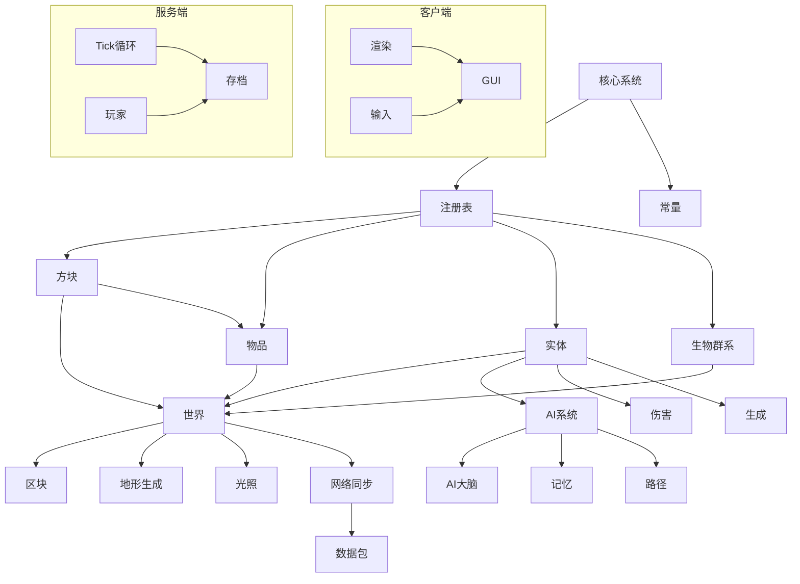
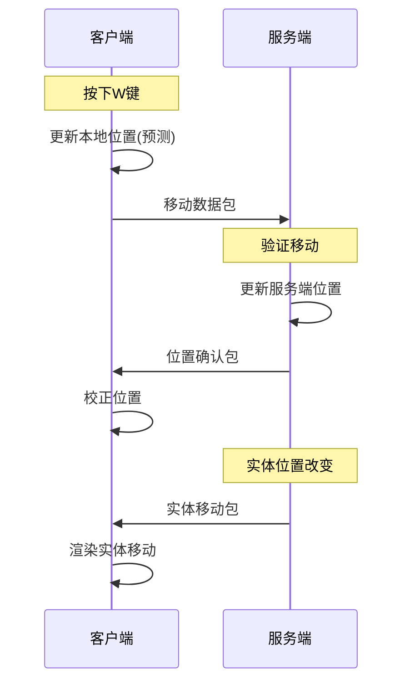
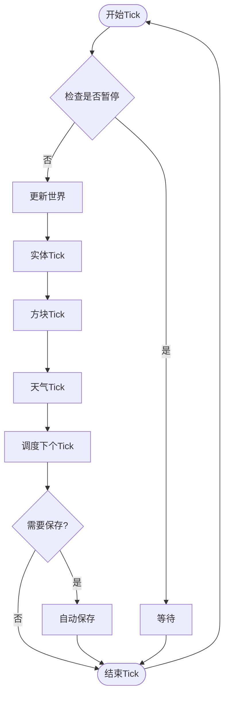

# Minecraft 源码萌新教程计划

> 目标：让完全不懂 Minecraft 源码的人，通过这套教程能理解 MC 的架构，并能够进行 Mod 开发

---

## 一、教程整体架构

```
tutorials/
│
├── README.md                      # 教程总览和学习路线图
│
├── Part-0-Prerequisites/          # 第0部分：前置知识
│   ├── 00-course-overview.md     # 课程概述
│   ├── 01-java-basics.md         # Java 基础知识速查
│   ├── 02-development-env.md     # 开发环境搭建
│   └── 03-project-intro.md      # 项目结构介绍
│
├── Part-1-Foundation/            # 第1部分：核心基础
│   ├── 04-registry-system.md     # 注册表系统（最重要！）
│   ├── 05-client-server-arch.md  # 客户端-服务端架构
│   ├── 06-shared-constants.md    # 全局常量与版本
│   └── 07-bootstrap-flow.md      # 启动引导流程
│
├── Part-2-World/                 # 第2部分：世界系统
│   ├── 08-world-core.md          # 世界核心类
│   ├── 09-chunk-system.md        # 区块系统
│   ├── 10-biome-system.md        # 生物群系系统
│   ├── 11-terrain-gen.md         # 地形生成
│   ├── 12-lighting-system.md     # 光照系统
│   └── 13-heightmap.md           # 高度图
│
├── Part-3-Block-Item/            # 第3部分：方块与物品
│   ├── 14-block-basics.md        # 方块基础
│   ├── 15-block-state.md         # 方块状态
│   ├── 16-block-entity.md        # 方块实体
│   ├── 17-item-basics.md         # 物品基础
│   ├── 18-item-stack.md          # 物品堆叠
│   └── 19-item-component.md      # 物品组件（1.21新特性）
│
├── Part-4-Entity/                # 第4部分：实体系统
│   ├── 20-entity-intro.md        # 实体入门
│   ├── 21-entity-lifecycle.md    # 实体生命周期
│   ├── 22-living-entity.md       # 有生命实体
│   ├── 23-mob-entity.md          # 生物实体
│   ├── 24-entity-attributes.md    # 属性系统
│   ├── 25-damage-system.md       # 伤害系统
│   └── 26-spawn-system.md        # 生成系统
│
├── Part-5-AI/                     # 第5部分：AI系统
│   ├── 27-ai-brain-intro.md      # AI大脑入门
│   ├── 28-memory-system.md       # 记忆系统
│   ├── 29-sensor-system.md       # 传感器系统
│   ├── 30-task-system.md         # 任务系统
│   ├── 31-activity-schedule.md   # 活动与日程
│   └── 32-pathfinding.md         # 路径导航
│
├── Part-6-Network/               # 第6部分：网络系统
│   ├── 33-network-intro.md      # 网络入门
│   ├── 34-packet-system.md       # 数据包系统
│   ├── 35-protocol-states.md     # 协议状态机
│   └── 36-sync-mechanism.md      # 同步机制
│
├── Part-7-Command/               # 第7部分：命令系统
│   ├── 37-command-intro.md       # 命令入门
│   ├── 38-brigadier-basics.md    # Brigadier基础
│   └── 39-custom-command.md      # 自定义命令
│
├── Part-8-Resource/              # 第8部分：资源系统
│   ├── 40-resource-pack.md       # 资源包系统
│   ├── 41-datapack-intro.md      # 数据包入门
│   ├── 42-loot-table.md          # 战利品表
│   ├── 43-advancement.md         # 进度系统
│   └── 44-recipe-system.md       # 配方系统
│
├── Part-9-Client/                # 第9部分：客户端
│   ├── 45-minecraft-client.md     # MinecraftClient主类
│   ├── 46-render-system.md       # 渲染系统
│   ├── 47-gui-system.md          # GUI系统
│   └── 48-input-handling.md      # 输入处理
│
├── Part-10-Server/              # 第10部分：服务端
│   ├── 49-server-intro.md        # 服务端入门
│   ├── 50-player-manager.md      # 玩家管理
│   ├── 51-save-system.md         # 存档系统
│   └── 52-dedicated-vs-integrated.md # 独立vs整合
│
├── Part-11-Advanced/             # 第11部分：进阶主题
│   ├── 53-datafixer.md           # 数据修复系统
│   ├── 54-fluids.md              # 流体系统
│   ├── 55-village-system.md      # 村民系统
│   ├── 56-raid-system.md         # 袭击系统
│   └── 57-structure-system.md    # 结构系统
│
└── Part-12-Practice/            # 第12部分：实战项目
    ├── 98-project1-block.md       # 项目1：添加新方块
    ├── 99-project2-item.md        # 项目2：添加新物品
    ├── 100-project3-entity.md     # 项目3：添加新生物
    └── 101-project4-datapack.md   # 项目4：数据包
```

---

## 二、每个文档的编写模板

```markdown
# [章节标题]

## 目标
本章学完后你能理解什么？

## 前置知识
需要了解哪些前面的知识？

## 核心概念
用最简单的话解释这个系统是什么

## 图解
用 mermaid 图展示工作原理

## 核心代码
### 关键类/方法
### 代码逐行解析

## 实战演示
添加/修改一个简单的东西

## 小结
本章要点

## 练习
思考题和编码练习

## 相关链接
延伸阅读
```

---

## 三、详细章节计划

### Part-0-Prerequisites（第0部分：前置知识）

#### 00-course-overview.md
```
目的：介绍整个课程体系和学习路线
内容：
  - 课程目标
  - 学习路线图（Mermaid）
  - 每个部分的内容简介
  - 如何使用这套教程
```

#### 01-java-basics.md
```
目的：快速过一遍阅读源码需要的Java知识
内容：
  - 类和对象
  - 继承和接口
  - 泛型
  - Lambda表达式
  - Stream API
  - 常用集合（List, Map, Set）
```

#### 02-development-env.md
```
目的：搭建能阅读和调试MC源码的环境
内容：
  - IDEA 配置
  - 反编译工具（CFR, FernFlower）
  - 源码项目导入
  - 断点调试
```

#### 03-project-intro.md
```
目的：了解项目结构和文件组织
内容：
  - 项目目录结构
  - 5364个文件分类
  - 关键目录作用
  - 如何高效搜索代码
```

---

### Part-1-Foundation（第1部分：核心基础）

#### 04-registry-system.md
```
目的：理解MC如何管理所有游戏内容（最重要！）
Mermaid图：
  - 注册表三层结构图
  - 物品注册流程图
  - 注册表查找流程图
核心内容：
  - Identifier 是什么
  - RegistryKey 是什么
  - RegistryEntry 是什么
  - 如何注册一个方块/物品
实战：
  - 找到石头方块的注册代码
  - 理解它的ID是什么
```

#### 05-client-server-arch.md
```
目的：理解MC客户端和服务端的关系
Mermaid图：
  - 客户端-服务端通信图
  - ServerWorld vs ClientWorld
  - Tick同步流程图
核心内容：
  - 为什么服务端是"权威"
  - isClient 字段的作用
  - 数据包如何传递
```

#### 06-shared-constants.md
```
目的：了解MC的关键常量
核心内容：
  - Protocol 版本
  - World 版本
  - Tick 常量
  - 世界大小限制
实战：
  - 查看 SharedConstants.java
```

#### 07-bootstrap-flow.md
```
目的：理解MC启动时发生了什么
Mermaid图：
  - 启动流程图
核心内容：
  - Bootstrap.initialize() 做了什么
  - 注册表初始化顺序
  - 创造模式物品栏怎么来的
```

---

### Part-2-World（第2部分：世界系统）

#### 08-world-core.md
```
目的：理解World类的核心作用
Mermaid图：
  - World类继承关系
  - 世界操作流程图
核心内容：
  - World vs ServerWorld vs ClientWorld
  - 坐标系统
  - 方块查询
```

#### 09-chunk-system.md
```
目的：理解MC如何存储和管理区块
Mermaid图：
  - Chunk加载流程
  - 懒加载机制
核心内容：
  - Chunk的结构
  - ChunkSection是什么
  - 如何获取方块
```

#### 10-biome-system.md
```
目的：理解生物群系如何工作
Mermaid图：
  - 生物群系生成流程
核心内容：
  - Biome类结构
  - 温度和降雨
  - 生物群系ID
```

#### 11-terrain-gen.md
```
目的：理解地形是如何生成的
Mermaid图：
  - 地形生成管线
核心内容：
  - ChunkGenerator
  - Noise采样
  - 特征生成
```

#### 12-lighting-system.md
```
目的：理解光照计算
Mermaid图：
  - 光照传播流程
核心内容：
  - 方块光照 vs 天空光照
  - 光照传播算法
```

#### 13-heightmap.md
```
目的：理解高度图的作用
Mermaid图：
  - 高度图类型
核心内容：
  - 四种高度图
  - 高度图用途
```

---

### Part-3-Block-Item（第3部分：方块与物品）

#### 14-block-basics.md
```
目的：理解方块类的结构
Mermaid图：
  - Block类继承关系
  - 方块创建流程
核心内容：
  - Block vs AbstractBlock
  - 方块属性
```

#### 15-block-state.md
```
目的：理解方块状态系统
Mermaid图：
  - 状态映射图
核心内容：
  - BlockState是什么
  - Property接口
  - 状态转换
```

#### 16-block-entity.md
```
目的：理解方块实体
Mermaid图：
  - 方块实体生命周期
核心内容：
  - BlockEntity是什么
  - 什么时候需要方块实体
  - NBT数据存储
```

#### 17-item-basics.md
```
目的：理解物品类的结构
Mermaid图：
  - Item类继承关系
  - 物品创建流程
核心内容：
  - Item类
  - ItemGroup
```

#### 18-item-stack.md
```
目的：理解ItemStack
Mermaid图：
  - ItemStack结构
核心内容：
  - 物品数量
  - 物品数据
  - 组件系统
```

#### 19-item-component.md
```
目的：理解1.21的组件系统
Mermaid图：
  - ComponentMap结构
核心内容：
  - 组件是什么
  - 常见组件类型
```

---

### Part-4-Entity（第4部分：实体系统）

#### 20-entity-intro.md
```
目的：实体系统入门
Mermaid图：
  - Entity类继承关系
  - 实体类型分类
核心内容：
  - Entity基类
  - EntityType注册
```

#### 21-entity-lifecycle.md
```
目的：理解实体的生命周期
Mermaid图：
  - 实体生命周期流程
核心内容：
  - 创建、移动、销毁
  - Tick更新
```

#### 22-living-entity.md
```
目的：理解有生命实体
Mermaid图：
  - LivingEntity结构
核心内容：
  - 生命值
  - 饥饿值
  - 效果
```

#### 23-mob-entity.md
```
目的：理解生物实体
核心内容：
  - MobEntity基类
  - 导航和移动
```

#### 24-entity-attributes.md
```
目的：理解属性系统
Mermaid图：
  - 属性系统结构
核心内容：
  - Attribute类型
  - 属性修改
```

#### 25-damage-system.md
```
目的：理解伤害计算
Mermaid图：
  - 伤害流程图
核心内容：
  - 伤害来源
  - 伤害计算
  - 护甲
```

#### 26-spawn-system.md
```
目的：理解实体生成
Mermaid图：
  - 生成检查流程
核心内容：
  - 生成条件
  - 生成范围
```

---

### Part-5-AI（第5部分：AI系统）

#### 27-ai-brain-intro.md
```
目的：AI大脑入门
Mermaid图：
  - Brain三层架构
核心内容：
  - 为什么需要AI大脑
  - Brain、Task、Activity的关系
```

#### 28-memory-system.md
```
目的：理解记忆系统
Mermaid图：
  - 记忆存储结构
核心内容：
  - MemoryModuleType
  - 记忆过期
```

#### 29-sensor-system.md
```
目的：理解传感器系统
Mermaid图：
  - 感知流程
核心内容：
  - Sensor基类
  - 常见传感器
```

#### 30-task-system.md
```
目的：理解任务系统
核心内容：
  - Task是什么
  - 优先级
```

#### 31-activity-schedule.md
```
目的：理解活动和日程
Mermaid图：
  - 日程表
核心内容：
  - Activity
  - Schedule
```

#### 32-pathfinding.md
```
目的：理解路径导航
Mermaid图：
  - 路径查找流程
核心内容：
  - PathNode
  - PathAnchor
```

---

### Part-6-Network（第6部分：网络系统）

#### 33-network-intro.md
```
目的：网络入门
Mermaid图：
  - 网络架构图
核心内容：
  - 为什么需要网络
  - 客户端-服务端通信
```

#### 34-packet-system.md
```
目的：理解数据包
Mermaid图：
  - 数据包发送流程
核心内容：
  - Packet接口
  - PacketByteBuf
```

#### 35-protocol-states.md
```
目的：理解协议状态机
Mermaid图：
  - 协议状态转换图
核心内容：
  - HANDSHAKING → LOGIN → PLAY
  - 1.21新状态
```

#### 36-sync-mechanism.md
```
目的：理解同步机制
Mermaid图：
  - 位置同步流程
核心内容：
  - 预测和回滚
  - Chunk同步
```

---

### Part-7-Command（第7部分：命令系统）

#### 37-command-intro.md
```
目的：命令系统入门
Mermaid图：
  - 命令解析流程
核心内容：
  - 命令源
  - 命令上下文
```

#### 38-brigadier-basics.md
```
目的：理解Brigadier
Mermaid图：
  - 参数解析流程
核心内容：
  - ArgumentBuilder
  - 内置参数类型
```

#### 39-custom-command.md
```
目的：自定义命令
实战：
  - 创建一个简单的命令
```

---

### Part-8-Resource（第8部分：资源系统）

#### 40-resource-pack.md
```
目的：理解资源包
Mermaid图：
  - 资源加载流程
核心内容：
  - Pack接口
  - 资源定位
```

#### 41-datapack-intro.md
```
目的：理解数据包
Mermaid图：
  - 数据包结构
核心内容：
  - 函数
  - 进度
```

#### 42-loot-table.md
```
目的：理解战利品表
Mermaid图：
  - 战利品表结构
核心内容：
  - 条件
  - 函数
```

#### 43-advancement.md
```
目的：理解进度系统
Mermaid图：
  - 进度树结构
核心内容：
  - 显示信息
  - 奖励
```

#### 44-recipe-system.md
```
目的：理解配方系统
Mermaid图：
  - 配方查找流程
核心内容：
  - 配方类型
  - 配方匹配
```

---

### Part-9-Client（第9部分：客户端）

#### 45-minecraft-client.md
```
目的：理解MinecraftClient
Mermaid图：
  - 客户端组件关系
核心内容：
  - 主循环
  - 线程模型
```

#### 46-render-system.md
```
目的：理解渲染系统
Mermaid图：
  - 渲染管线
核心内容：
  - GameRenderer
  - WorldRenderer
```

#### 47-gui-system.md
```
目的：理解GUI系统
Mermaid图：
  - 屏幕层次
核心内容：
  - Screen基类
  - HUD渲染
```

#### 48-input-handling.md
```
目的：理解输入处理
Mermaid图：
  - 输入处理流程
核心内容：
  - 键盘
  - 鼠标
```

---

### Part-10-Server（第10部分：服务端）

#### 49-server-intro.md
```
目的：服务端入门
Mermaid图：
  - 服务器架构
核心内容：
  - MinecraftServer
  - Tick循环
```

#### 50-player-manager.md
```
目的：理解玩家管理
Mermaid图：
  - 玩家登录流程
核心内容：
  - 连接处理
  - 玩家列表
```

#### 51-save-system.md
```
目的：理解存档系统
Mermaid图：
  - 存档保存流程
核心内容：
  - Chunk保存
  - Player保存
```

#### 52-dedicated-vs-integrated.md
```
目的：理解两种服务器
Mermaid图：
  - 对比图
核心内容：
  - 独立服务器
  - 整合服务器
```

---

### Part-11-Advanced（第11部分：进阶主题）

#### 53-datafixer.md
```
目的：理解数据修复
Mermaid图：
  - 版本迁移流程
核心内容：
  - Schema
  - Fix
```

#### 54-fluids.md
```
目的：理解流体系统
Mermaid图：
  - 流体状态
核心内容：
  - 水和岩浆
```

#### 55-village-system.md
```
目的：理解村民系统
Mermaid图：
  - 村民职业
核心内容：
  - 交易
  - 职业
```

#### 56-raid-system.md
```
目的：理解袭击系统
Mermaid图：
  - 袭击流程
核心内容：
  - RaidManager
```

#### 57-structure-system.md
```
目的：理解结构系统
Mermaid图：
  - 结构生成
核心内容：
  - StructurePiece
  - Jigsaw
```

---

### Part-12-Practice（第12部分：实战项目）

#### 98-project1-block.md
```
项目：添加一个新方块
步骤：
  1. 注册方块
  2. 创建方块类
  3. 添加材质
  4. 测试
```

#### 99-project2-item.md
```
项目：添加一个新物品
步骤：
  1. 注册物品
  2. 创建物品类
  3. 添加材质
  4. 添加合成/熔炼配方
```

#### 100-project3-entity.md
```
项目：添加一个新生物
步骤：
  1. 注册实体类型
  2. 创建实体类
  3. 添加AI
  4. 添加掉落物
```

#### 101-project4-datapack.md
```
项目：创建一个数据包
步骤：
  1. 创建数据包结构
  2. 添加函数
  3. 添加进度
  4. 测试
```

---

## 四、Mermaid 图规划

### 1. 全局学习路线图

```mermaid
graph LR
    subgraph Phase0["第0部分：前置知识"]
        P0-1[Java基础] --> P0-2[开发环境]
        P0-2 --> P0-3[项目结构]
    end

    subgraph Phase1["第1部分：核心基础"]
        P0-3 --> P1-1[注册表系统]
        P1-1 --> P1-2[客户端服务端]
        P1-2 --> P1-3[启动流程]
    end

    subgraph Phase2["第2部分：世界系统"]
        P1-3 --> P2-1[World类]
        P2-1 --> P2-2[Chunk]
        P2-2 --> P2-3[地形生成]
    end

    subgraph Phase3["第3部分：方块物品"]
        P2-3 --> P3-1[方块基础]
        P3-1 --> P3-2[方块状态]
        P3-2 --> P3-3[物品系统]
    end

    subgraph Phase4["第4部分：实体系统"]
        P3-3 --> P4-1[实体入门]
        P4-1 --> P4-2[生命周期]
        P4-2 --> P4-3[AI系统]
    end

    subgraph Phase5["第5部分：进阶"]
        P4-3 --> P5-1[网络]
        P5-1 --> P5-2[命令]
        P5-2 --> P5-3[资源]
    end

    P5-3 --> Final[实战项目]
```



### 2. 系统依赖关系图



### 3. 客户端-服务端通信图



### 4. Tick 循环流程图



### 5. 注册表查找流程图

```mermaid
flowchart TD
    Start[查找"石头"] --> ID[Identifier<br/>"minecraft:stone"]

    ID --> Key[创建RegistryKey]
    Key --> Registry{Registry存在?}

    Registry -->|是| Entry[获取Entry]
    Registry -->|否| Error[抛出异常]

    Entry --> Value{Entry有效?}
    Value -->|是| Return[返回RegistryEntry]
    Value -->|否| Null[返回null]
```

---

## 五、每个章节的核心Mermaid图清单

| 章节 | 主要Mermaid图 |
|------|--------------|
| 00 | 学习路线图 |
| 04 | 注册表三层结构、注册流程 |
| 05 | 客户端-服务端通信图 |
| 06 | 常量分类表 |
| 07 | 启动流程图 |
| 08 | World继承关系、World操作图 |
| 09 | Chunk结构、懒加载流程 |
| 10 | 生物群系生成流程 |
| 11 | 地形生成管线 |
| 12 | 光照传播图 |
| 13 | 高度图类型 |
| 14 | Block继承关系 |
| 15 | 状态映射图 |
| 16 | 方块实体生命周期 |
| 17 | Item继承关系 |
| 18 | ItemStack结构 |
| 19 | ComponentMap结构 |
| 20 | Entity继承关系 |
| 21 | 实体生命周期 |
| 22 | LivingEntity结构 |
| 23 | MobEntity结构 |
| 24 | 属性系统 |
| 25 | 伤害计算流程 |
| 26 | 生成检查流程 |
| 27 | AI三层架构 |
| 28 | 记忆存储结构 |
| 29 | 传感器感知 |
| 30 | 任务优先级 |
| 31 | 日程表 |
| 32 | 路径查找 |
| 33 | 网络架构 |
| 34 | 数据包发送流程 |
| 35 | 协议状态转换 |
| 36 | 位置同步流程 |
| 37 | 命令解析 |
| 38 | Brigadier参数 |
| 40 | 资源加载 |
| 41 | 数据包结构 |
| 42 | 战利品表 |
| 43 | 进度树 |
| 44 | 配方匹配 |
| 45 | 客户端组件 |
| 46 | 渲染管线 |
| 47 | 屏幕层次 |
| 48 | 输入处理 |
| 49 | 服务器架构 |
| 50 | 登录流程 |
| 51 | 保存流程 |
| 53 | 版本迁移 |
| 55 | 村民交易 |
| 56 | 袭击流程 |

---

## 六、每个章节的"萌新必懂"原则

### 1. 比喻法
每个系统都要有生活中的比喻：
- 注册表 = 图书馆的索引卡片
- 区块 = 乐高积木的一小块
- 实体 = 游戏里的"活物"
- 数据包 = 快递包裹

### 2. 图先于文字
每个章节先放Mermaid图，让萌新先看图理解

### 3. 代码要简化
不要给完整代码，给关键片段和解释

### 4. 动手要简单
每个章节都有一个小练习，让萌新能找到相关代码

### 5. 前后要关联
告诉萌新这个系统和前面学过的什么有关

---

## 七、总结

这套教程共 **12个部分、47个章节**，预计学习时间：

| 部分 | 预计时间 | 章节数 |
|------|---------|--------|
| 第0部分 | 2-3天 | 4章 |
| 第1部分 | 3-5天 | 4章 |
| 第2部分 | 5-7天 | 6章 |
| 第3部分 | 5-7天 | 6章 |
| 第4部分 | 5-7天 | 6章 |
| 第5部分 | 5-7天 | 6章 |
| 第6部分 | 3-5天 | 4章 |
| 第7部分 | 2-3天 | 3章 |
| 第8部分 | 3-5天 | 5章 |
| 第9部分 | 3-5天 | 4章 |
| 第10部分 | 2-3天 | 4章 |
| 第11部分 | 3-5天 | 5章 |
| 第12部分 | 长期 | 4章 |

**总计**: 约 50-60 天可以学完核心内容

---

*计划制定时间: 2026-03-19*
