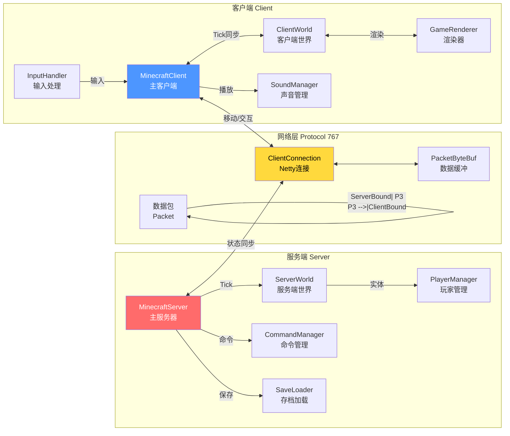
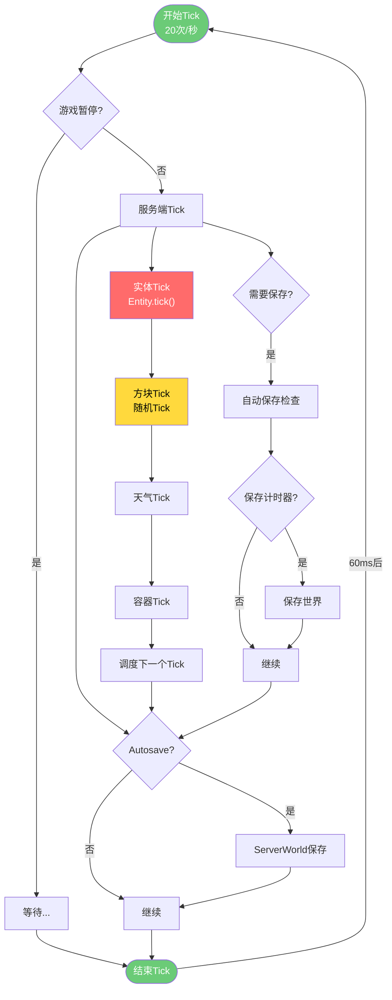
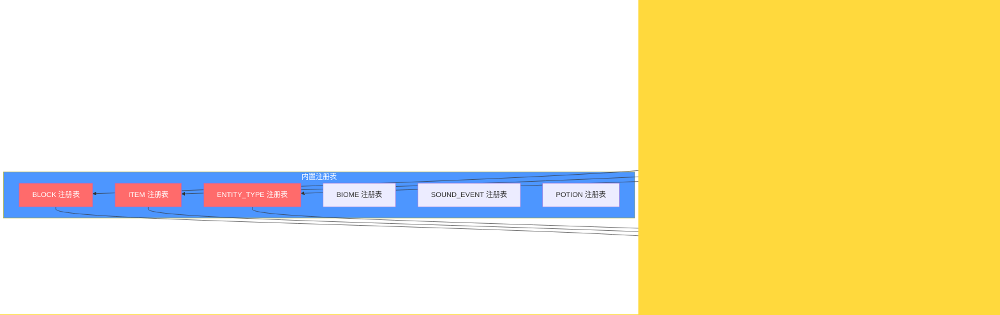
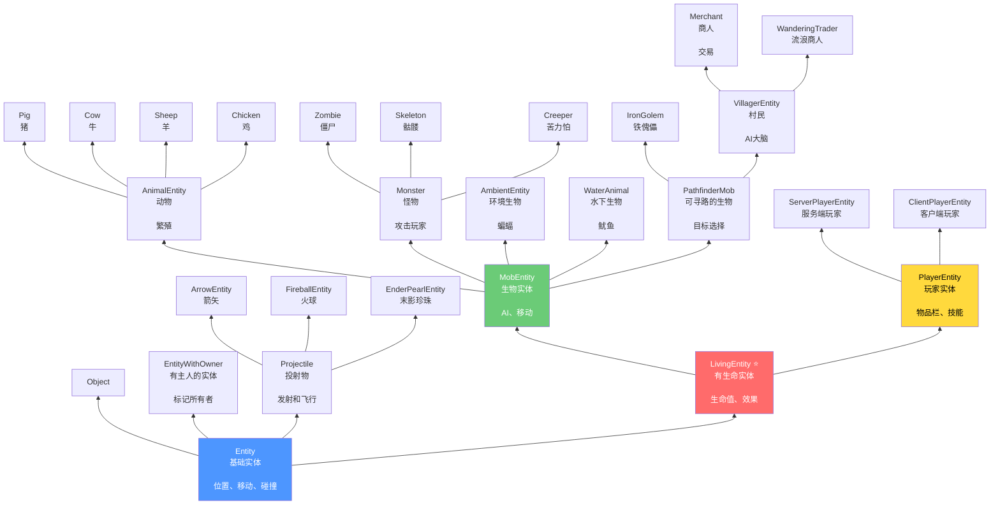
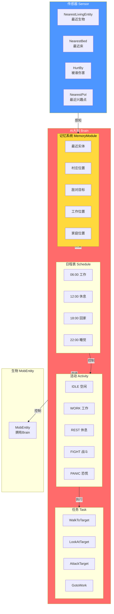
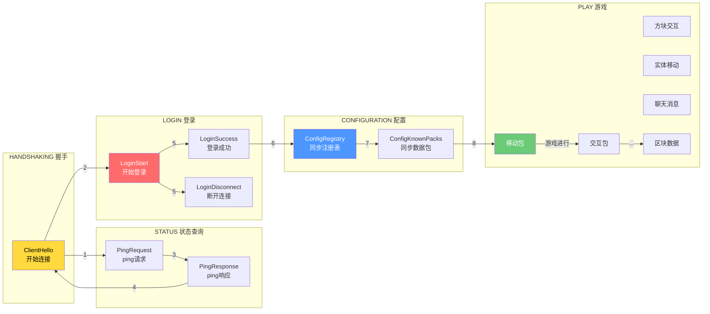
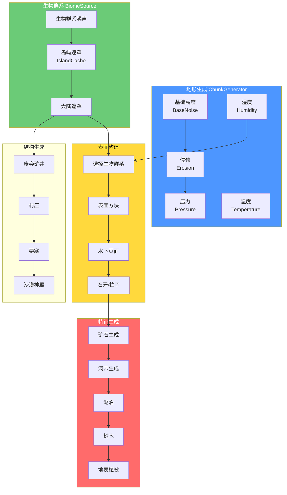
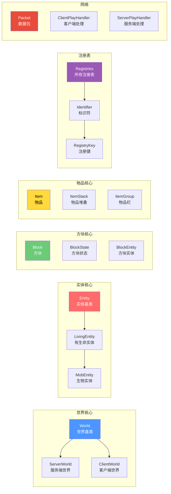

# Minecraft 源码学习路线图

> 包含所有核心系统的可视化图表，帮助萌新理解MC的整体架构

---

## 一、全局学习路线图

```mermaid
flowchart TB
    subgraph Phase0["第0部分：前置知识 (2-3天)"]
        P0-1["Java基础速查<br/>01-java-basics.md"]
        P0-2["开发环境搭建<br/>02-development-env.md"]
        P0-3["项目结构介绍<br/>03-project-intro.md"]
        P0-4["课程概述<br/>00-course-overview.md"]
    end

    subgraph Phase1["第1部分：核心基础 (3-5天)"]
        P1-1["注册表系统 ⭐<br/>04-registry-system.md"]
        P1-2["客户端-服务端架构<br/>05-client-server-arch.md"]
        P1-3["全局常量与版本<br/>06-shared-constants.md"]
        P1-4["启动引导流程<br/>07-bootstrap-flow.md"]
    end

    subgraph Phase2["第2部分：世界系统 (5-7天)"]
        P2-1["World核心类<br/>08-world-core.md"]
        P2-2["Chunk区块系统<br/>09-chunk-system.md"]
        P2-3["Biome生物群系<br/>10-biome-system.md"]
        P2-4["地形生成<br/>11-terrain-gen.md"]
        P2-5["光照系统<br/>12-lighting-system.md"]
        P2-6["Heightmap高度图<br/>13-heightmap.md"]
    end

    subgraph Phase3["第3部分：方块物品 (5-7天)"]
        P3-1["Block方块基础<br/>14-block-basics.md"]
        P3-2["BlockState方块状态<br/>15-block-state.md"]
        P3-3["BlockEntity方块实体<br/>16-block-entity.md"]
        P3-4["Item物品基础<br/>17-item-basics.md"]
        P3-5["ItemStack物品堆叠<br/>18-item-stack.md"]
        P3-6["Component组件系统<br/>19-item-component.md"]
    end

    subgraph Phase4["第4部分：实体系统 (5-7天)"]
        P4-1["Entity实体入门<br/>20-entity-intro.md"]
        P4-2["实体生命周期<br/>21-entity-lifecycle.md"]
        P4-3["LivingEntity<br/>22-living-entity.md"]
        P4-4["MobEntity生物<br/>23-mob-entity.md"]
        P4-5["Attribute属性<br/>24-entity-attributes.md"]
        P4-6["Damage伤害系统<br/>25-damage-system.md"]
        P4-7["Spawn生成系统<br/>26-spawn-system.md"]
    end

    subgraph Phase5["第5部分：AI系统 (5-7天)"]
        P5-1["AI Brain入门 ⭐<br/>27-ai-brain-intro.md"]
        P5-2["Memory记忆系统<br/>28-memory-system.md"]
        P5-3["Sensor传感器<br/>29-sensor-system.md"]
        P5-4["Task任务系统<br/>30-task-system.md"]
        P5-5["Activity & Schedule<br/>31-activity-schedule.md"]
        P5-6["Pathfinding路径<br/>32-pathfinding.md"]
    end

    subgraph Phase6["第6部分：网络系统 (3-5天)"]
        P6-1["Network网络入门<br/>33-network-intro.md"]
        P6-2["Packet数据包<br/>34-packet-system.md"]
        P6-3["Protocol协议状态<br/>35-protocol-states.md"]
        P6-4["Sync同步机制<br/>36-sync-mechanism.md"]
    end

    subgraph Phase7["第7部分：命令系统 (2-3天)"]
        P7-1["Command命令入门<br/>37-command-intro.md"]
        P7-2["Brigadier基础<br/>38-brigadier-basics.md"]
        P7-3["自定义命令<br/>39-custom-command.md"]
    end

    subgraph Phase8["第8部分：资源系统 (3-5天)"]
        P8-1["ResourcePack资源包<br/>40-resource-pack.md"]
        P8-2["Datapack数据包<br/>41-datapack-intro.md"]
        P8-3["LootTable战利品<br/>42-loot-table.md"]
        P8-4["Advancement进度<br/>43-advancement.md"]
        P8-5["Recipe配方<br/>44-recipe-system.md"]
    end

    subgraph Phase9["第9部分：客户端 (3-5天)"]
        P9-1["MinecraftClient<br/>45-minecraft-client.md"]
        P9-2["Render渲染<br/>46-render-system.md"]
        P9-3["GUI界面<br/>47-gui-system.md"]
        P9-4["Input输入<br/>48-input-handling.md"]
    end

    subgraph Phase10["第10部分：服务端 (2-3天)"]
        P10-1["Server服务端入门<br/>49-server-intro.md"]
        P10-2["PlayerManager玩家<br/>50-player-manager.md"]
        P10-3["Save存档系统<br/>51-save-system.md"]
        P10-4["独立vs整合服务器<br/>52-dedicated-vs-integrated.md"]
    end

    subgraph Phase11["第11部分：进阶 (3-5天)"]
        P11-1["DataFixer数据修复<br/>53-datafixer.md"]
        P11-2["Fluid流体<br/>54-fluids.md"]
        P11-3["Village村民<br/>55-village-system.md"]
        P11-4["Raid袭击<br/>56-raid-system.md"]
        P11-5["Structure结构<br/>57-structure-system.md"]
    end

    subgraph Phase12["第12部分：实战 💪"]
        P12-1["项目1:新方块<br/>98-project1-block.md"]
        P12-2["项目2:新物品<br/>99-project2-item.md"]
        P12-3["项目3:新生物<br/>100-project3-entity.md"]
        P12-4["项目4:数据包<br/>101-project4-datapack.md"]
    end

    P0-1 --> P0-2 --> P0-3 --> P0-4
    P0-4 --> P1-1 --> P1-2 --> P1-3 --> P1-4
    P1-4 --> P2-1 --> P2-2 --> P2-3 --> P2-4 --> P2-5 --> P2-6
    P2-6 --> P3-1 --> P3-2 --> P3-3 --> P3-4 --> P3-5 --> P3-6
    P3-6 --> P4-1 --> P4-2 --> P4-3 --> P4-4 --> P4-5 --> P4-6 --> P4-7
    P4-7 --> P5-1 --> P5-2 --> P5-3 --> P5-4 --> P5-5 --> P5-6
    P5-6 --> P6-1 --> P6-2 --> P6-3 --> P6-4
    P6-4 --> P7-1 --> P7-2 --> P7-3
    P7-3 --> P8-1 --> P8-2 --> P8-3 --> P8-4 --> P8-5
    P8-5 --> P9-1 --> P9-2 --> P9-3 --> P9-4
    P9-4 --> P10-1 --> P10-2 --> P10-3 --> P10-4
    P10-4 --> P11-1 --> P11-2 --> P11-3 --> P11-4 --> P11-5
    P11-5 --> P12-1
    P12-1 --> P12-2 --> P12-3 --> P12-4

    style P1-1 fill:#ff6b6b,color:#fff
    style P5-1 fill:#ff6b6b,color:#fff
```



---

## 二、系统依赖关系图

```mermaid
flowchart TD
    subgraph Core["核心层"]
        Registry["注册表系统<br/>Registry"]
        Constants["常量系统<br/>SharedConstants"]
        Bootstrap["启动引导<br/>Bootstrap"]
    end

    subgraph Content["内容层 - 游戏元素"]
        Block["方块系统<br/>Block"]
        Item["物品系统<br/>Item"]
        Entity["实体系统<br/>Entity"]
        Biome["生物群系<br/>Biome"]
        Fluid["流体系统<br/>Fluid"]
    end

    subgraph WorldLayer["世界层"]
        World["World世界"]
        Chunk["Chunk区块"]
        Gen["地形生成<br/>ChunkGenerator"]
        Light["光照系统"]
        Heightmap["高度图"]
        Border["世界边界"]
    end

    subgraph EntityAI["实体AI层"]
        Living["LivingEntity"]
        Mob["MobEntity"]
        Brain["AI大脑<br/>Brain"]
        Memory["记忆系统"]
        Sensor["传感器"]
        Task["任务"]
        Path["路径导航"]
    end

    subgraph Network["网络层"]
        Packet["数据包<br/>Packet"]
        Protocol["协议状态"]
        Sync["同步机制"]
    end

    subgraph Gameplay["游戏机制层"]
        Damage["伤害系统"]
        Spawn["生成系统"]
        Recipe["配方系统"]
        Loot["战利品表"]
        Adv["进度系统"]
        Command["命令系统"]
    end

    subgraph Client["客户端层"]
        MCClient["MinecraftClient"]
        Render["渲染引擎"]
        GUI["GUI系统"]
        Input["输入处理"]
        Audio["音频系统"]
    end

    subgraph Server["服务端层"]
        Server["MinecraftServer"]
        PlayerMgr["玩家管理"]
        Save["存档系统"]
        Tick["Tick循环"]
    end

    Core --> Registry
    Registry --> Block
    Registry --> Item
    Registry --> Entity
    Registry --> Biome
    Registry --> Fluid

    Block --> World
    Item --> World
    Entity --> World
    Biome --> World

    World --> Chunk
    World --> Gen
    World --> Light
    World --> Heightmap
    World --> Border

    Entity --> Living
    Living --> Mob
    Mob --> Brain
    Brain --> Memory
    Brain --> Sensor
    Brain --> Task
    Brain --> Path

    World --> Network
    Network --> Sync

    Entity --> Damage
    Entity --> Spawn
    World --> Gameplay

    Tick --> Server
    Server --> PlayerMgr
    Server --> Save

    MCClient --> Render
    MCClient --> GUI
    MCClient --> Input
    MCClient --> Audio

    Network <-->|数据包| Client
    Network <-->|数据包| Server

    style Registry fill:#ffd93d,color:#000
    style World fill:#6bcb77,color:#000
    style Brain fill:#ff6b6b,color:#fff
    style Network fill:#4d96ff,color:#fff
```

---

## 三、客户端-服务端通信架构



---

## 四、Tick游戏循环流程



---

## 五、注册表系统架构



---

## 六、实体系统继承关系



---

## 七、AI大脑系统架构



---

## 八、网络协议状态机



---

## 九、世界生成管线



---

## 十、关键类速查表



---

## 十一、萌新学习检查点

```mermaid
flowchart LR
    subgraph Checkpoints["学习检查点"]
        C1["✅ 理解注册表三层结构"]
        C2["✅ 能找到石头方块的代码"]
        C3["✅ 理解客户端-服务端分离"]
        C4["✅ 理解World和Chunk的关系"]
        C5["✅ 理解Entity是什么"]
        C6["✅ 理解AI大脑的三层结构"]
        C7["✅ 理解网络数据包流程"]
        C8["✅ 能创建自定义命令"]
        C9["✅ 能创建数据包"]
        C10["✅ 能添加新方块/物品"]
    end

    Start["开始学习"] --> C1
    C1 --> C2
    C2 --> C3
    C3 --> C4
    C4 --> C5
    C5 --> C6
    C6 --> C7
    C7 --> C8
    C8 --> C9
    C9 --> C10
    C10 --> Done["完成基础学习！"]

    style C1 fill:#6bcb77,color:#fff
    style C2 fill:#6bcb77,color:#fff
    style C3 fill:#6bcb77,color:#fff
    style C4 fill:#6bcb77,color:#fff
    style C5 fill:#6bcb77,color:#fff
    style C6 fill:#6bcb77,color:#fff
    style C7 fill:#6bcb77,color:#fff
    style C8 fill:#6bcb77,color:#fff
    style C9 fill:#6bcb77,color:#fff
    style C10 fill:#6bcb77,color:#fff
    style Done fill:#ffd93d,color:#000
```



---

## 十二、时间规划建议

| 阶段 | 内容 | 建议时间 | 累计 |
|------|------|---------|------|
| 第0部分 | 前置知识 | 2-3天 | 2-3天 |
| 第1部分 | 核心基础 | 3-5天 | 5-8天 |
| 第2部分 | 世界系统 | 5-7天 | 10-15天 |
| 第3部分 | 方块物品 | 5-7天 | 15-22天 |
| 第4部分 | 实体系统 | 5-7天 | 20-29天 |
| 第5部分 | AI系统 | 5-7天 | 25-36天 |
| 第6部分 | 网络系统 | 3-5天 | 28-41天 |
| 第7-8部分 | 命令资源 | 5-8天 | 33-49天 |
| 第9-10部分 | 客户端服务端 | 5-8天 | 38-57天 |
| 第11-12部分 | 进阶实战 | 7-14天 | 45-71天 |

---

*文档更新时间: 2026-03-19*
