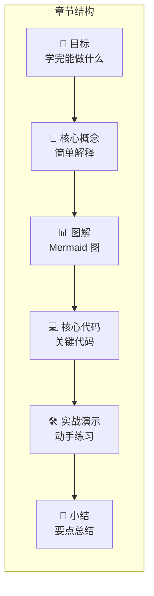
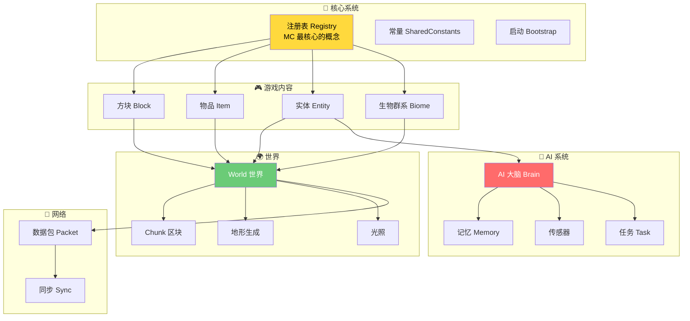
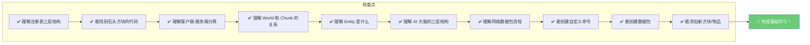

# Minecraft 源码入门教程 - 课程总览

> **面向人群**：想学习 Minecraft 源码、想做 Mod 开发的零基础萌新
> 
> **学习目标**：理解 MC 架构，能读懂源码，会做 Mod

---

## 目标

学完这套教程后，你将能够：

```
✅ 理解 Minecraft 的整体架构
✅ 读懂 Minecraft 核心源码
✅ 理解注册表系统（最重要的概念）
✅ 掌握客户端-服务端分离原理
✅ 学会创建自己的方块、物品、生物
✅ 能够编写数据包和自定义命令
```

---

## 前置知识

在开始之前，你需要准备：

```
📦 Java 基础（会写简单代码即可）
💻 一台电脑（内存 8GB 以上更好）
🎯 耐心（源码有 5000+ 个文件，别慌！）
```

> 💡 **不用担心**：本教程 Part-0 会带你快速过一遍 Java 基础

---

## 学习路线图

```mermaid
flowchart TB
    subgraph P0["📚 Part-0: 前置知识 (2-3天)"]
        direction TB
        P0-1["Java 基础速查<br/>类和对象、继承、泛型"]
        P0-2["开发环境搭建<br/>IDEA、反编译、调试"]
        P0-3["项目结构介绍<br/>5000+ 文件怎么看"]
    end

    subgraph P1["🏠 Part-1: 核心基础 (3-5天)"]
        direction TB
        P1-1["⭐ 注册表系统<br/>MC 最核心的概念"]
        P1-2["客户端-服务端架构<br/>为什么分客户端和服务端"]
        P1-3["启动引导流程<br/>MC 启动时发生了什么"]
    end

    subgraph P2["🌍 Part-2: 世界系统 (5-7天)"]
        direction TB
        P2-1["World 世界核心"]
        P2-2["Chunk 区块系统"]
        P2-3["Biome 生物群系"]
        P2-4["地形生成"]
        P2-5["光照系统"]
    end

    subgraph P3["🧱 Part-3: 方块物品 (5-7天)"]
        direction TB
        P3-1["Block 方块"]
        P3-2["BlockState 方块状态"]
        P3-3["BlockEntity 方块实体"]
        P3-4["Item 物品"]
        P3-5["ItemStack 物品堆叠"]
    end

    subgraph P4["🐄 Part-4: 实体系统 (5-7天)"]
        direction TB
        P4-1["Entity 实体入门"]
        P4-2["LivingEntity 有生命实体"]
        P4-3["MobEntity 生物"]
        P4-4["属性与伤害"]
    end

    subgraph P5["🤖 Part-5: AI 系统 (5-7天)"]
        direction TB
        P5-1["⭐ AI Brain 大脑<br/>MC 最有趣的系统"]
        P5-2["Memory 记忆系统"]
        P5-3["Sensor 传感器"]
        P5-4["Task 任务系统"]
    end

    subgraph P6["📡 Part-6: 网络系统 (3-5天)"]
        P6-1["数据包 Packet"]
        P6-2["协议状态机"]
        P6-3["同步机制"]
    end

    subgraph P7["💪 Part-7+: 进阶实战"]
        P7-1["命令系统"]
        P7-2["资源包/数据包"]
        P7-3["客户端渲染"]
        P7-4["实战项目"]
    end

    P0-1 --> P0-2 --> P0-3
    P0-3 --> P1-1 --> P1-2 --> P1-3
    P1-3 --> P2-1 --> P2-2 --> P2-3 --> P2-4 --> P2-5
    P2-5 --> P3-1 --> P3-2 --> P3-3 --> P3-4 --> P3-5
    P3-5 --> P4-1 --> P4-2 --> P4-3 --> P4-4
    P4-4 --> P5-1 --> P5-2 --> P5-3 --> P5-4
    P5-4 --> P6-1 --> P6-2 --> P6-3
    P6-3 --> P7-1 --> P7-2 --> P7-3 --> P7-4

    style P1-1 fill:#ff6b6b,color:#fff
    style P5-1 fill:#ff6b6b,color:#fff
    style P7-4 fill:#6bcb77,color:#fff
```



---

## 为什么要学习 MC 源码？

### 1. 理解 Mod 的原理

当你安装一个 Mod 时，你是否好奇它是怎么实现的？

```
没有看过源码：      看过源码后：
┌─────────────┐    ┌─────────────┐
│   我装了     │    │   我知道    │
│   Xaeros    │    │   小地图    │
│   小地图    │    │   是怎么    │
│   Mod      │    │   实现的！  │
└─────────────┘    └─────────────┘
```

### 2. 自己做 Mod

市面上的 Mod 还不够？自己动手！

```
你的想法 ──────→ [理解源码] ──────→ 自己写 Mod
    │                                  │
    └──────────────────────────────────┘
              不需要学完也能开始！
```

### 3. 理解游戏设计

Minecraft 的代码是精心设计的，值得学习！

```
学完这套教程后，你会：
├── 理解什么是"客户端预测"
├── 理解区块是怎么存储的
├── 理解生物的 AI 是怎么工作的
└── 理解数据包是什么
```

---

## 课程结构介绍

### 每个章节的组成

每个章节都包含以下内容：



### 萌新友好原则

```
1️⃣  图先于文字 ─ 先看图理解，再看文字
2️⃣  比喻法     ─ 用生活例子解释概念
3️⃣  代码简化   ─ 只展示关键片段
4️⃣  前后关联   ─ 告诉你在哪里用过
```

---

## 系统依赖关系图



---

## 如何使用这套教程

### 建议的学习顺序

```
1️⃣  按顺序学习 Part-0 → Part-12
2️⃣  每章都要看图！图片比文字重要
3️⃣  尝试在 IDEA 中搜索对应的代码
4️⃣  做每章后面的练习题
```

### 学习时间规划

| 部分 | 内容 | 建议时间 | 累计 |
|------|------|----------|------|
| Part-0 | 前置知识 | 2-3 天 | 2-3 天 |
| Part-1 | 核心基础 | 3-5 天 | 5-8 天 |
| Part-2 | 世界系统 | 5-7 天 | 10-15 天 |
| Part-3 | 方块物品 | 5-7 天 | 15-22 天 |
| Part-4 | 实体系统 | 5-7 天 | 20-29 天 |
| Part-5 | AI 系统 | 5-7 天 | 25-36 天 |
| Part-6-12 | 进阶实战 | 20-35 天 | 45-71 天 |

> ⏰ **总计**：大约 45-71 天可以学完核心内容
> 
> 💡 **不急**：按自己的节奏来，学懂最重要

---

## 萌新必懂的核心概念

### 什么是注册表（Registry）？

> 想象注册表是**图书馆的索引卡片**📇

```
图书馆                    Minecraft
─────────                ─────────
书架上的书    ←──对应──→  方块、物品、实体
索引卡片    ←──对应──→  注册表 Registry
书的编号    ←──对应──→  Identifier (如 minecraft:stone)

当你需要找一本书时：
1. 查索引卡片 → 找到书架位置 → 拿到书

当你需要找"石头"时：
1. 用 "minecraft:stone" 查注册表 → 找到石头方块
```

### 什么是客户端-服务端分离？

> 想象你和朋友**视频通话**📱

```
你（客户端）              朋友（服务端）
─────────────            ─────────────
看到画面渲染              负责游戏逻辑
发送操作                  验证操作
本地预测                  权威数据源

视频通话：
- 你看到的是"预测"的画面
- 朋友的画面是"权威"的
- 网络不好时，你可能会"卡顿"

MC 多人游戏：
- 客户端渲染看到的世界
- 服务端运行真实的世界
- 两者通过网络包同步
```

### 什么是 Tick？

> Tick 就是游戏的**心跳**💓

```
现实世界：           MC 世界：
1秒 = 1次心跳        1秒 = 20次 Tick

每次 Tick 发生：
├── 所有实体移动一步
├── 所有方块检查是否需要更新
├── 天气变化
└── 检查各种游戏逻辑

每分钟 = 1200 次 Tick
每小时 = 72000 次 Tick
```

---

## 学习检查点



---

## 小结

```
✅ 本教程面向零基础萌新
✅ 共 12 个部分，预计 45-71 天学完
✅ 每个章节都有图解、代码、练习
✅ 核心概念：注册表、客户端-服务端分离、AI 大脑
```

---

## 练习

### 思考题

1. **为什么 Minecraft 需要注册表系统？**
   - 如果没有注册表，游戏怎么知道有哪些方块？

2. **客户端和服务端各负责什么？**
   - 哪边的 World 是"权威"的？

3. **Tick 是什么？**
   - MC 为什么是 20 Tick/秒，而不是 60？

### 行动清单

- [ ] 安装 IDEA 开发环境（详见下一章）
- [ ] 导入 Minecraft 源码项目
- [ ] 搜索 `Registries` 类，了解注册表结构
- [ ] 搜索 `Identifier` 类，了解命名规则

---

## 相关链接

| 章节 | 内容 |
|------|------|
| [01-java-basics.md](./01-java-basics.md) | Java 基础速查 |
| [02-development-env.md](./02-development-env.md) | 开发环境搭建 |
| [03-project-intro.md](./03-project-intro.md) | 项目结构介绍 |
| [04-registry-system.md](../Part-1-Foundation/04-registry-system.md) | 注册表系统（核心！） |

---

> **下一章预告**：[Java 基础速查](01-java-basics.md) - 快速过一遍阅读源码需要的 Java 知识

---

*文档更新时间: 2026-03-19*
