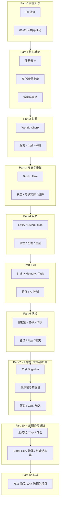

# 第 00 章：课程总览（Course Overview）

## 目录

- [编号与命名说明](#编号与命名说明)
- [课程目标](#课程目标)
- [学习路径图](#学习路径图)
- [Part-0 章节一览](#part-0-章节一览)
- [主线教程（Part-1～Part-12）](#主线教程part1part12)
- [核心概念速览](#核心概念速览)
- [前置知识要求](#前置知识要求)
- [源码获取方式](#源码获取方式)
- [学习方法建议](#学习方法建议)
- [版本信息](#版本信息)
- [常见问题](#常见问题)
- [下一步](#下一步)

---

## 编号与命名说明

为与侧边栏、文件名一致，约定如下：

| 范围 | 含义 | 示例 |
|------|------|------|
| **Part-0：00～05** | 前置准备，文件名 `00`～`05` | 本文件为 `00-course-overview.md` |
| **Part-1 起：04～** | 正式源码章节的两位数字前缀与文件名一致 | 如 `04-registry-system.md` 即第 4 章（注册表） |

Part-0 各篇标题统一为 **「第 0X 章：中文标题（English）」**；侧栏若显示不同样式，以本仓库 Markdown 的 `title` 与一级标题为准。

**主线章节（Part-1 起）** 一律使用同一格式：**YAML `title` 与正文首个一级标题 `#` 保持一致**，写法为 `第 NN 章：主题（可选英文副标题）`，其中 **NN 与文件名前缀两位或三位数字相同**（如 `09-world-core.md` 对应「第 08 章」）。请勿混用「第四章」「08 - 」等其它前缀，以免与侧栏、搜索不一致。

扩展阅读见仓库根目录 [教程总入口](../README.md) 与 [学习路线图](../01-LEARNING-ROADMAP.md)。

---

## 课程目标

本系列教程帮助 Java 开发者系统理解 **Minecraft 1.21** 核心源码结构，建立「从注册表到网络、从世界到 AI」的整体心智模型，并能用 IDE 自主深挖。

---

## 学习路径图

下列示意图与当前目录 **Part-0～Part-12** 对齐（不含可选的 `Part-13-Additional` 补充篇）。



---

## Part-0 章节一览

按推荐顺序阅读（全部在 `Part-0-Prerequisites/` 下）。

| 编号 | 文件 | 内容 | 建议时间 |
|------|------|------|----------|
| 00 | [00-course-overview.md](./00-course-overview.md) | 课程总览与路线图（本文） | 20 分钟 |
| 01 | [01-java-basics.md](./01-java-basics.md) | Java 基础速查（Java Basics） | 30 分钟 |
| 02 | [02-development-env.md](./02-development-env.md) | 开发环境搭建（Development Environment） | 30 分钟 |
| 03 | [03-project-intro.md](./03-project-intro.md) | 项目结构介绍（Project Layout） | 20 分钟 |
| 04 | [04-project-structure.md](./04-project-structure.md) | 项目结构与源码阅读技巧 | 15 分钟 |
| 05 | [05-sourcecode-guide.md](./05-sourcecode-guide.md) | 附录：源码查找指南 | 20 分钟 |

说明：**03** 侧重「目录与模块划分」，**04** 侧重「读大型仓库的策略与技巧」，**05** 为可反复查阅的查找手册，可与正式章节穿插使用。

---

## 主线教程（Part-1～Part-12）

| Part | 目录 | 核心主题 |
|------|------|----------|
| Part-1 | [Part-1-Foundation](../Part-1-Foundation/) | 注册表、架构、常量、启动、Tick |
| Part-2 | [Part-2-World](../Part-2-World/) | World、Chunk、群系、生成、光照、高度图 |
| Part-3 | [Part-3-Block-Item](../Part-3-Block-Item/) | 方块、状态、方块实体、物品与组件 |
| Part-4 | [Part-4-Entity](../Part-4-Entity/) | 实体生命周期、生物、属性、伤害、生成 |
| Part-5 | [Part-5-AI](../Part-5-AI/) | Brain、记忆、感知、任务、日程、路径、AI 控制 |
| Part-6 | [Part-6-Network](../Part-6-Network/) | 网络入门、数据包、协议、同步、登录、Play、聊天 |
| Part-7 | [Part-7-Command](../Part-7-Command/) | 命令与 Brigadier |
| Part-8 | [Part-8-Resource](../Part-8-Resource/) | 资源包、数据包、战利品、进度、配方 |
| Part-9 | [Part-9-Client](../Part-9-Client/) | 客户端、渲染、GUI、输入、渲染层级、实体模型 |
| Part-10 | [Part-10-Server](../Part-10-Server/) | 服务端、玩家管理、Tick、存档、独立/整合服 |
| Part-11 | [Part-11-Advanced](../Part-11-Advanced/) | DataFixer、流体、村庄、袭击、结构及进阶专题 |
| Part-12 | [Part-12-Practice](../Part-12-Practice/) | 实战项目（方块、物品、实体、数据包） |

可选补充：[Part-13-Additional](../Part-13-Additional/)（粒子、附魔、音效等扩展主题，编号独立于主线）。

---

## 核心概念速览

### 注册表系统 (Registry)

> **比喻**：注册表像图书馆的**索引系统**。
>
> - **Identifier**：`minecraft:diamond_block` 一类的「书目编号」
> - **RegistryKey / RegistryEntry**：索引与条目
> - **Registries**：各注册表集合

### 客户端-服务端架构

> **比喻**：服务端像掌握全部规则的**权威**，客户端负责**展示与输入**，双方通过**数据包**同步。

### 启动引导流程

> 启动顺序可粗略理解为：Bootstrap 与注册表初始化 → 再进入客户端或服务端主循环（含 Tick）。

---

## 前置知识要求

### 必须掌握

- Java 语法（类、接口、继承、泛型）
- 基本集合（Map、List、Set）与常见 API
- 面向对象基本概念

### 建议掌握

- Maven / Gradle 基础
- 常见设计模式
- Git

### 可选了解

- Java NIO 或 Netty
- 数据序列化概念

---

## 源码获取方式

本教程默认对照本地反编译或映射后的源码，例如：

```
D:\Minecraft-Learning\assets\minecraft\source\net\minecraft\
```

推荐使用 [Fabric Loom](https://github.com/FabricMC/fabric-loom) 或 IDE 插件 [Minecraft Development](https://plugins.jetbrains.com/plugin/8322-minecraft-development) 生成可导航工程。

---

## 学习方法建议

### 1. 带着问题阅读

例如：「物品如何注册？」「移动对应哪些数据包？」

### 2. 善用 IDE

- 跳转到定义、查找用法、类层次结构
- 全文搜索包名与关键类名

### 3. 对照游戏现象

读代码时结合游戏内表现验证推断。

### 4. 自己画架构图

每学完一个 Part，用一张图总结输入输出与依赖关系。

---

## 版本信息

| 信息 | 值 |
|------|-----|
| Minecraft 版本 | 1.21 |
| 协议版本 | 767 |
| 世界版本 | 3953 |
| 资源包版本 | 34 |
| 数据包版本 | 48 |

---

## 常见问题

### Q: 需要读完所有 Java 源文件吗？

**A**: 不需要。教程围绕核心子系统组织，掌握路径后可有选择地深入。

### Q: 反编译代码难读怎么办？

**A**: 类名与方法签名通常可辨；可配合映射（Mappings）与官方命名习惯逐步适应。

### Q: 做模组是否要学完全部？

**A**: 使用 Fabric / NeoForge 等 API 时许多细节可封装；理解源码有助于排查性能与兼容问题。

---

## 下一步

请按顺序完成 Part-0：

1. [第 01 章：Java 基础速查](./01-java-basics.md)
2. [第 02 章：开发环境搭建](./02-development-env.md)
3. [第 03 章：项目结构介绍](./03-project-intro.md)
4. [第 04 章：项目结构与源码阅读技巧](./04-project-structure.md)
5. [第 05 章：源码查找指南](./05-sourcecode-guide.md)

完成后进入 [Part-1 核心基础](../Part-1-Foundation/)。
