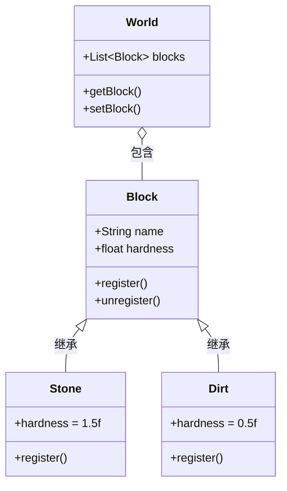
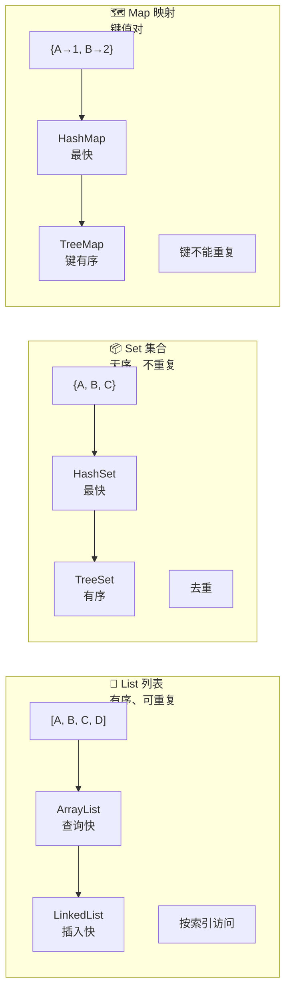
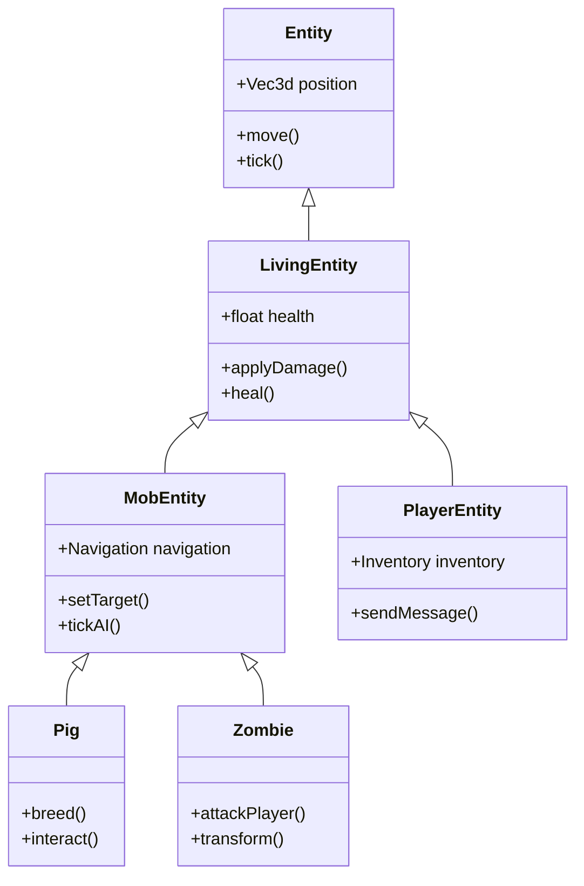

# ☕ Java 基础速查

> **面向读者**：需要阅读 Minecraft 源码的人
> 
> **目标**：快速掌握阅读 MC 源码所需的 Java 知识

---

## 目标

学完本章后，你将能够：

```
✅ 理解类和对象的概念
✅ 理解继承和接口的区别
✅ 读懂泛型代码 <T>
✅ 理解 Lambda 表达式 () -> {}
✅ 使用 List、Map、Set 集合
✅ 在 MC 源码中找到对应的代码
```

---

## 前置知识

```
📖 知道什么是编程语言
💻 会安装软件
🧠 有抽象思维（会分类）
```

---

## 核心概念

### 什么是类（Class）？

> 类就是** blueprints 蓝图**📐

```
现实世界：           Java 世界：
─────────           ─────────
汽车设计图    ←──→  类 Class
具体的车    ←──→  对象 Object

类 定义了"这种东西应该有什么"：
- 有 4 个轮子
- 有方向盘
- 能前进、后退、刹车

对象 是根据图纸造出来的具体东西：
- 我的红色宝马
- 你的黑色奔驰
```

### 什么是继承（Inheritance）？

> 继承就是** 子承父业**👨‍👦

```
Animal（动物）
    ├── eat()   // 吃东西
    └── sleep() // 睡觉

    Dog（狗）继承 Animal
        ├── eat()   // 狗也吃东西 ✓
        ├── sleep() // 狗也睡觉 ✓
        └── bark()  // 狗还会叫 ✨

    Cat（猫）继承 Animal
        ├── eat()   // 猫也吃东西 ✓
        ├── sleep() // 猫也睡觉 ✓
        └── meow()  // 猫会喵喵叫 ✨
```

### 什么是接口（Interface）？

> 接口就是** 能力清单**📋

```
接口定义：          现实例子：
─────────         ─────────
implements        能力认证
Readable          能被读取
Writable          能被写入
Serializable      能被序列化

Comparable        能比较大小
Runnable          能被执行
```

**类和接口的区别**：

```
类（class）        接口（interface）
─────────         ───────────────
只能继承一个        可以实现多个
可以有具体代码      只能有抽象方法
可以有成员变量      只能有常量
"是什么"          "能做什么"
```

### 什么是泛型（Generics）？

> 泛型就是** 模板**📄

```
不用泛型：              用泛型：
─────────              ─────────
List list = new ArrayList();   List<String> list = new ArrayList<>();
list.add(123);                 list.add("Hello");
list.add("World");             list.add("World");
int num = (int) list.get(0);  String s = list.get(0);
// 需要强制转换              不需要！类型安全
// 可能出错                 不容易出错
```

---

## 图解

### 类和对象的关系



### 集合类型对比



### 继承层次示例



---

## 核心代码

### 1. 类的定义

```java
// Minecraft 中的方块类
public class Block {
    // 成员变量（属性）
    private String name;
    private float hardness;  // 硬度
    private float resistance; // 抗爆性

    // 构造方法（创建对象时调用）
    public Block(Settings settings) {
        this.hardness = settings.hardness;
        this.resistance = settings.resistance;
    }

    // 方法（行为）
    public void onBreak(World world) {
        // 挖掘方块时的逻辑
        dropItems(world);
    }

    // Getter 和 Setter
    public float getHardness() {
        return this.hardness;
    }
}
```

**逐行解析**：

```
1. public class Block
   └─ 公开的类，名字叫 Block

2. private float hardness;
   └─ 私有变量，外部不能直接访问

3. public Block(Settings settings)
   └─ 构造方法，创建 Block 时传入设置

4. public void onBreak(World world)
   └─ 公开方法，参数是 World，返回空
```

### 2. 继承的实现

```java
// 石头方块继承自 Block
public class StoneBlock extends Block {
    // 子类可以添加自己的变量
    private final BlockState defaultState;

    // 子类可以添加自己的方法
    public void polish() {
        // 抛光石头的逻辑
    }

    // 子类可以重写父类的方法
    @Override
    public float getHardness() {
        return 2.0f;  // 石头比普通方块硬
    }
}
```

**逐行解析**：

```
1. extends Block
   └─ 表示继承自 Block 类

2. @Override
   └─ 注解，表示这个方法是重写父类的

3. private final BlockState defaultState;
   └─ final 表示这个引用不能改变
```

### 3. 接口的实现

```java
// 让实体能够被命名
public interface Nameable {
    Component getCustomName();      // 获取名称
    void setCustomName(Component);  // 设置名称
}

// 让实体能够呼吸
public interface Breathable {
    boolean canBreathe();
    void breathe();
}

// 生物实体实现多个接口
public class PigEntity extends AnimalEntity implements Nameable, Breathable {
    private Component customName;

    @Override
    public Component getCustomName() {
        return this.customName;
    }

    @Override
    public boolean canBreathe() {
        return true;  // 猪可以在水下屏息
    }
}
```

### 4. 泛型的使用

```java
// Minecraft 中的注册表 - 典型的泛型使用
public class Registry~T~ {
    private final Map~Identifier, T~ entries;
    private final Map~T, Identifier~ ids;

    // 注册一个东西
    public void register(Identifier id, T value) {
        entries.put(id, value);
        ids.put(value, id);
    }

    // 根据 ID 获取
    public @Nullable T get(Identifier id) {
        return entries.get(id);
    }

    // 根据值获取 ID
    public @Nullable Identifier getId(T value) {
        return ids.get(value);
    }
}

// 实际使用
Registry~Block~ BLOCK_REGISTRY = new Registry<>();
Registry~Item~ ITEM_REGISTRY = new Registry<>();
Registry~EntityType~ ENTITY_REGISTRY = new Registry~();
```

### 5. Lambda 表达式

```java
// 传统写法
Runnable r1 = new Runnable() {
    @Override
    public void run() {
        System.out.println("Hello");
    }
};

// Lambda 写法（简洁！）
Runnable r2 = () -> System.out.println("Hello");

// 带参数
Consumer~String~ c1 = (String name) -> System.out.println(name);
Consumer~String~ c2 = name -> System.out.println(name); // 类型可以省略

// 多行代码用 {}
Runnable r3 = () -> {
    System.out.println("第一行");
    System.out.println("第二行");
};

// Minecraft 中的实际用法
// 事件监听
EventCallback callback = (event) -> {
    // 处理事件
    event.cancel();
};
```

### 6. 集合的使用

```java
// List - 有序列表
List~String~ inventory = new ArrayList~();
inventory.add("diamond");
inventory.add("sword");
inventory.add("apple");
String first = inventory.get(0);  // "diamond"

// Set - 无序集合（自动去重）
Set~Identifier~ registeredBlocks = new HashSet~();
registeredBlocks.add(new Identifier("minecraft:stone"));
registeredBlocks.add(new Identifier("minecraft:stone")); // 不会重复添加
boolean hasStone = registeredBlocks.contains(new Identifier("minecraft:stone"));

// Map - 键值对
Map~String, Block~ blockRegistry = new HashMap~();
blockRegistry.put("stone", new StoneBlock());
blockRegistry.put("dirt", new DirtBlock());

Block stone = blockRegistry.get("stone"); // 获取石头
for (Map.Entry~String, Block~ entry : blockRegistry.entrySet()) {
    String name = entry.getKey();
    Block block = entry.getValue();
}

// Minecraft 中的实际例子 - 获取所有生物群系
Registry~Biome~ biomeRegistry = Registries.BIOME;
for (Biome biome : biomeRegistry) {
    Identifier id = biomeRegistry.getId(biome);
    System.out.println("Biome: " + id);
}
```

---

## 实战演示

### 在 MC 源码中找类

**任务**：找到 `Entity` 类的定义

```
在 IDEA 中操作：
1. 按两下 Shift（快速搜索）
2. 输入 "Entity.java"
3. 回车打开文件

你会看到：
..../source/net/minecraft/entity/Entity.java
```

**找到后观察**：

```java
public abstract class Entity implements Nameable, SyncedEntityProperties, CommandSource {
    // 这是实体类的定义
    // - abstract 表示抽象类，不能直接创建
    // - implements 表示实现了多个接口
}
```

### 练习：找一找

1. 找到 `PlayerEntity` 类
   - 它继承自哪个类？
   - 它实现了哪些接口？

2. 找到 `Block` 类
   - 它有哪些重要的成员变量？
   - 它有哪些重要的方法？

3. 找到 `World` 类
   - 这个类主要负责什么？

---

## 小结

```
✅ 类是蓝图，对象是实例
✅ 继承用 extends，一个类只能继承一个父类
✅ 接口用 implements，一个类可以实现多个接口
✅ 泛型 <T> 让代码更安全
✅ Lambda () -> {} 让代码更简洁
✅ List/Set/Map 是最常用的集合
```

---

## 练习

### 思考题

1. **类和对象的区别是什么？**
   - 用 Minecraft 的例子说明

2. **为什么 MC 的 Entity 是抽象类？**
   - 不能直接 `new Entity()` 吗？

3. **List 和 Set 的区别是什么？**
   - 什么时候用 List？什么时候用 Set？

4. **为什么要用泛型？**
   - 不用泛型可以吗？

### 编码练习

```java
// 1. 创建一个简单的类（假设你是 MC 开发者）
// 创建一个小猪 Pig 类

public class Pig {
    // 成员变量
    private String name;
    private int health;
    private boolean isBaby;

    // 构造方法
    public Pig(String name) {
        this.name = name;
        this.health = 10;
        this.isBaby = false;
    }

    // 方法
    public void eat() {
        System.out.println(name + " 在吃东西");
        health += 2;
    }

    public void makeSound() {
        System.out.println(name + " 发出哼哼声");
    }

    // Getter
    public int getHealth() {
        return health;
    }

    public boolean isBaby() {
        return isBaby;
    }
}

// 2. 使用这个类
public class Test {
    public static void main(String[] args) {
        Pig myPig = new Pig("小猪一号");
        myPig.eat();
        myPig.makeSound();
        System.out.println("生命值: " + myPig.getHealth());
    }
}
```

---

## 相关链接

> ⚠️ **注意**：以下源码示例来源于 CFR 反编译代码，变量名和方法名可能与原始源码有所差异。

| 内容 | 链接 |
|------|------|
| Java 官方教程 | https://docs.oracle.com/javase/tutorial/ |
| Java 基础速查 | [01-java-basics.md](./01-java-basics.md) |
| 开发环境搭建 | [02-development-env.md](./02-development-env.md) |
| 项目结构介绍 | [03-project-intro.md](./03-project-intro.md) |
| 注册表系统 | [04-registry-system.md](../Part-1-Foundation/04-registry-system.md) |

---

> **下一章预告**：[开发环境搭建](./02-development-env.md) - 学会配置 IDEA、导入源码、调试 MC

---

*文档更新时间: 2026-03-19*
