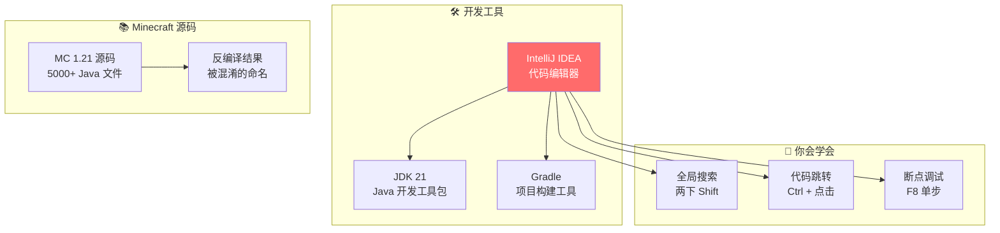
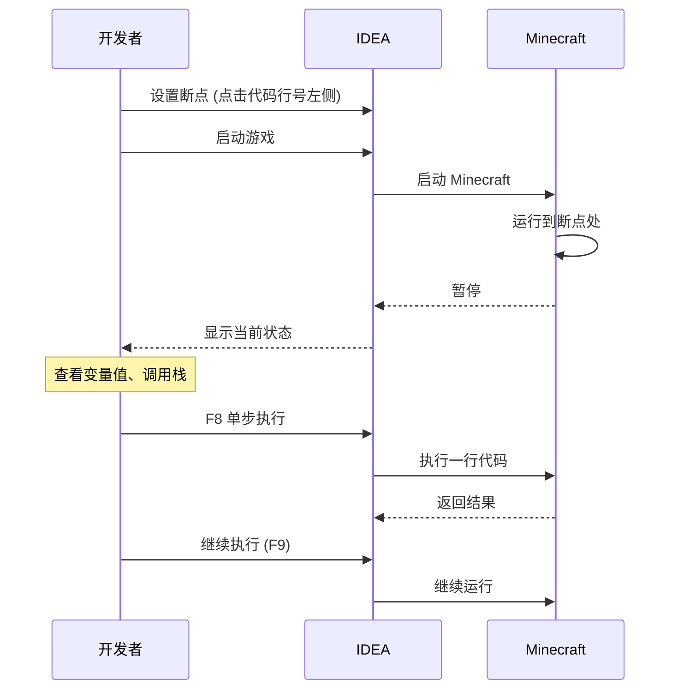
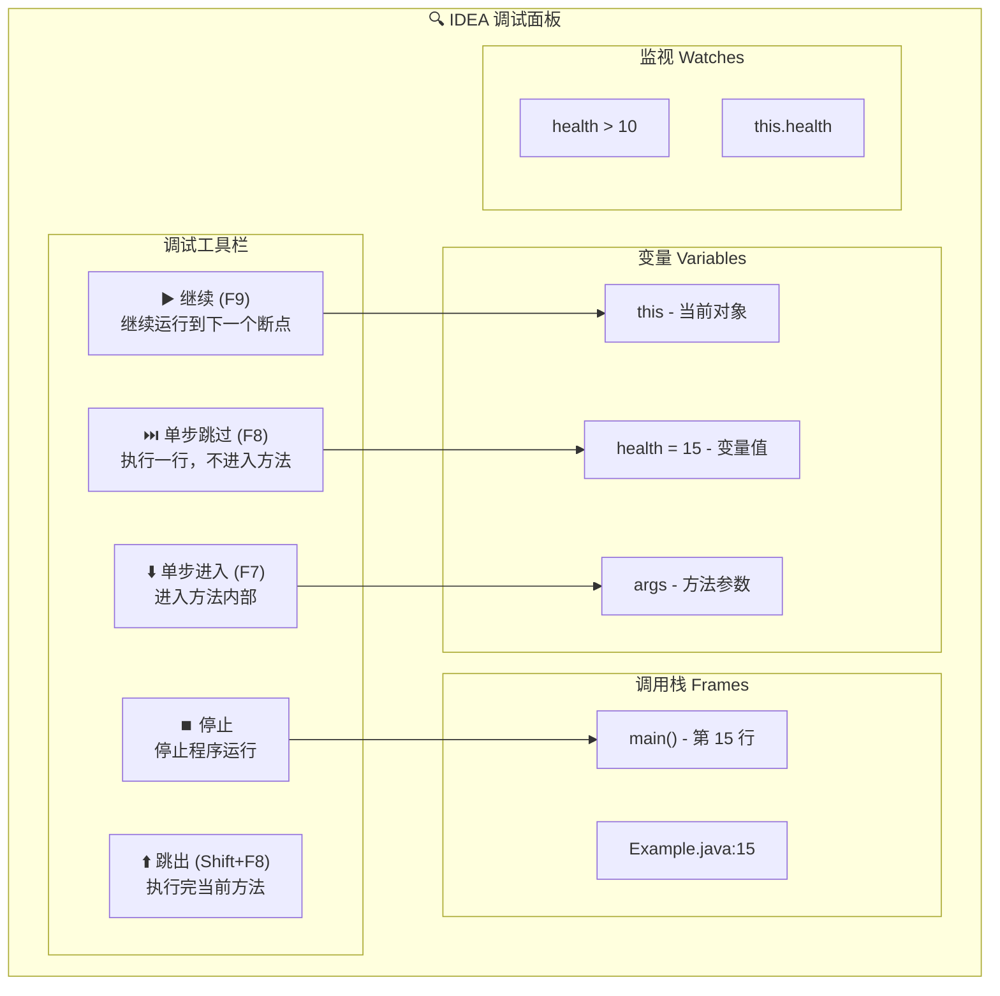

# 💻 开发环境搭建

> **面向读者**：准备阅读 Minecraft 源码的人
>
> **目标**：搭建能阅读、搜索、调试 MC 源码的环境

> ⚠️ **注意**：以下源码示例来源于 CFR 反编译代码，变量名和方法名可能与原始源码有所差异。部分代码经过简化以便于理解。

---

## 目标

学完本章后，你将能够：

```
✅ 安装和配置 IntelliJ IDEA
✅ 导入 Minecraft 源码项目
✅ 使用 IDEA 的搜索功能查找代码
✅ 设置断点调试 MC
✅ 使用反编译工具查看混淆的代码
```

---

## 前置知识

```
☕ Java 基础（会安装 JDK）
💻 电脑操作（会解压文件）
📦 8GB 以上可用内存
💾 20GB 以上可用磁盘空间
```

---

## 核心概念

### 什么是 IDEA？

> IDEA 就是** 写代码的超级编辑器**✏️

```
普通的文本编辑器：    IDEA：
─────────────      ─────────────
写文字              写代码
不支持代码提示       强大的代码提示
没有代码跳转        可以跳转到定义
手动找文件          搜索所有文件
没有调试功能        可以打断点调试
```

### 什么是反编译？

> 反编译就是** 把编译好的代码变回源代码**🔄

```
Minecraft 发布时：
源代码 (.java)  ────编译────>  字节码 (.class)  ────打包───>  minecraft.jar

阅读源码时：
minecraft.jar  ────反编译────>  近似源代码 (.java)

注意：反编译得到的代码不是100%完美的，
      变量名、方法名可能被混淆成 a()、b()、c()
```

### 为什么需要断点调试？

> 断点调试就是** 让程序停下来看里面发生了什么**🛑

```
没有调试：          有调试：
─────────          ─────────
程序飞速运行        程序可以暂停
只能看最终结果      可以看每一步
很难找到 bug       容易定位问题

想象：检查快递包裹
- 不开箱：只能看外观
- 开箱检查：能看到里面是什么
```

---

## 图解

### 开发环境架构



### 调试流程



---

## 核心配置

### 1. 安装 JDK 21

```
下载地址：
https://adoptium.net/temurin/releases/?version=21

安装步骤：
1. 下载 Windows x64 Installer (.msi)
2. 双击运行安装
3. 记住安装路径（默认 C:\Program Files\Eclipse Adoptium\jdk-21...）
4. 配置环境变量：
   - JAVA_HOME = C:\Program Files\Eclipse Adoptium\jdk-21...
   - Path 添加 %JAVA_HOME%\bin
5. 验证：打开 PowerShell，输入 java -version
```

### 2. 安装 IntelliJ IDEA

```
下载地址：
https://www.jetbrains.com/idea/download/
推荐：IntelliJ IDEA Community Edition（免费的社区版）

安装步骤：
1. 下载 Community 版
2. 运行安装程序
3. 选择安装路径
4. 勾选"创建桌面快捷方式"
5. 完成后启动 IDEA
```

### 3. IDEA 基础配置

```java
// 打开 IDEA 后，进行以下配置：

// File -> Settings -> Editor -> Font
// 设置字体大小（推荐 16-18）
Font: JetBrains Mono 或 Consolas
Size: 16

// File -> Settings -> Editor -> General -> Code Completion
// 开启代码提示
Show suggestions as you type: ✓

// File -> Settings -> Editor -> General -> Code Completion
// 忽略大小写
Case-sensitive completion: None
```

### 4. 导入 Minecraft 源码

```
导入步骤：
1. 打开 IDEA，选择 Open
2. 选择源码目录：`..../source/`
3. 选择 Import as Gradle project
4. 等待 Gradle 同步完成（可能需要 5-10 分钟）
5. 同步完成后，你会在左侧看到项目结构

注意：如果导入失败，检查 build.gradle 文件是否存在
```

### 5. 推荐插件

```
安装方法：File -> Settings -> Plugins -> Marketplace

推荐插件：
┌─────────────────────────────────────────────────────┐
│ 1. Minecraft Development                            │
│    - 识别 .mcfunction 文件                          │
│    - 命令补全                                        │
│    - 数据包支持                                      │
├─────────────────────────────────────────────────────┤
│ 2. .lang File Support                               │
│    - 支持 .lang 语言文件                             │
│    - 翻译键补全                                      │
├─────────────────────────────────────────────────────┤
│ 3. Rainbow Brackets                                 │
│    - 彩虹括号（方便看代码结构）                        │
├─────────────────────────────────────────────────────┤
│ 4. Key Promoter X                                  │
│    - 快捷键提示（帮助你学习快捷键）                    │
└─────────────────────────────────────────────────────┘
```

---

## 断点调试方法

### 设置断点

```java
public class Example {
    public static void main(String[] args) {
        int health = 20;           // ← 在这一行设置断点
        health = health - 5;        // ← 或者在这里
        System.out.println(health);
    }
}
// 设置方法：点击代码行号左侧的红点
// 取消方法：再点击一次红点
```

### 调试面板介绍



### 调试 Minecraft 实体受伤

```
场景：想看看玩家被僵尸攻击时，伤害是怎么计算的

步骤：
1. 找到伤害计算的代码
   - 搜索 "applyDamage"
   - 或 "damage" 方法

2. 在关键位置设置断点
   - Entity.applyDamage()
   - LivingEntity.getDamageAgainst()

3. 启动游戏
   - 点击绿色的虫子图标 (🐛)
   - 选择 "Minecraft Client" 或 "Minecraft Server"

4. 进行触发条件
   - 创建一个新世界
   - 找到一只僵尸
   - 让僵尸攻击你

5. 观察
   - 当僵尸攻击时，IDEA 会暂停
   - 你可以看到：
     * 受伤实体的信息
     * 伤害来源
     * 最终伤害值
     * 护甲减免
```

---

## 实战演示

### 任务 1：搜索石头方块

```
目标：找到 Minecraft 中石头方块的定义

1. 在 IDEA 中按两下 Shift（快速搜索）
2. 输入 "Blocks"
3. 找到 Blocks.java 文件（可能在 util 或 registry 包）
4. 打开文件，搜索 "STONE"
5. 你会看到类似：
   public static final Block STONE = register("stone", new Block(...));
```

### 任务 2：追踪玩家移动

```
目标：理解玩家移动的代码流程

1. 搜索 "move" 方法（在 PlayerEntity 或 Entity 类中）
2. 设置断点在 movementInput 处理
3. 启动游戏，单人模式
4. 按 W 键移动
5. 观察：
   - movementInput 的值如何变化
   - velocity 如何被更新
   - 位置 (x, y, z) 如何改变
```

---

## 小结

```
✅ JDK 21 是必须的
✅ IDEA 是阅读代码的最佳工具
✅ Gradle 用于构建项目
✅ 两下 Shift 是最重要的快捷键
✅ 断点调试可以看程序运行时发生了什么
✅ 插件可以提升开发体验
```

---

## 练习

### 思考题

1. **为什么要用 IDEA 而不是 VS Code？**
   - IDEA 有哪些专门针对 Java 的功能？

2. **反编译和源码有什么区别？**
   - 为什么变量名可能是 a、b、c？

3. **断点调试有什么用？**
   - 什么场景下需要调试？

### 行动清单

- [ ] 安装 JDK 21
- [ ] 安装 IntelliJ IDEA Community
- [ ] 导入 Minecraft 源码项目
- [ ] 安装 Minecraft Development 插件
- [ ] 搜索 "Blocks.STONE" 的定义
- [ ] 在某个方法设置断点，体验调试

---

## 相关链接

| 内容 | 链接 |
|------|------|
| JDK 21 下载 | https://adoptium.net/temurin/releases/?version=21 |
| IDEA 下载 | https://www.jetbrains.com/idea/download/ |
| IDEA 快捷键 | https://www.jetbrains.com/idea/guide/tutorials/learning-keys-advanced/ |
| Minecraft Development 插件 | IDEA 内置插件市场搜索 |

---

> **下一章预告**：[项目结构介绍](./03-project-intro.md) - 5000+ 文件怎么分类，怎么高效阅读

---

*文档更新时间: 2026-03-19*
