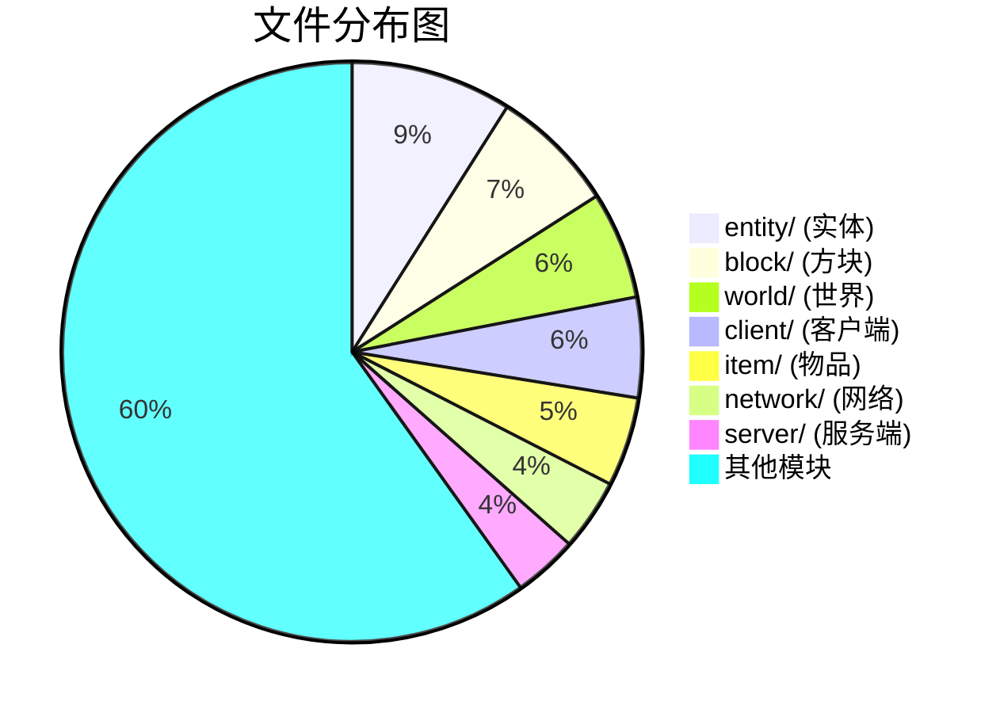
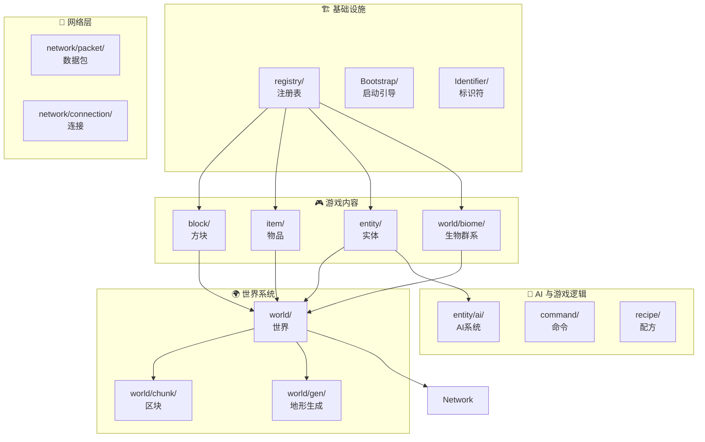
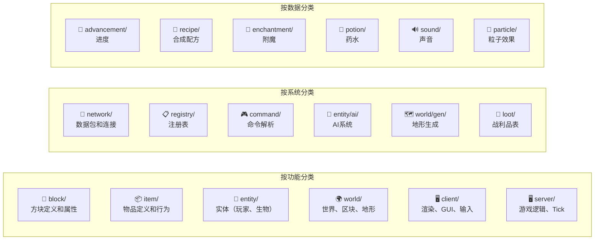
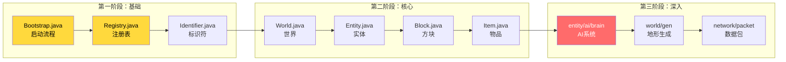

# 第 03 章：项目结构介绍（Project Layout）

> **面向读者**：准备开始阅读 Minecraft 源码的人
> 
> **目标**：理解项目目录结构，知道 5000+ 文件怎么分类，高效搜索代码

---

## 目标

学完本章后，你将能够：

```
✅ 理解 Minecraft 源码的目录结构
✅ 知道每个目录负责什么功能
✅ 快速定位想找的代码
✅ 使用 IDEA 高效搜索代码
✅ 了解推荐的阅读顺序
```

---

## 前置知识

```
📂 了解文件目录的概念
☕ 知道 Java 的包（package）是什么
🔍 会使用搜索功能
```

---

## 核心概念

### 目录结构概览

```
..../source/
├── net/
│   └── minecraft/              ← 核心源码目录（5364 个文件）
│       ├── block/              ← 方块系统
│       ├── entity/             ← 实体系统
│       ├── item/               ← 物品系统
│       ├── world/              ← 世界系统
│       ├── client/             ← 客户端代码
│       ├── server/              ← 服务端代码
│       ├── network/            ← 网络系统
│       ├── registry/            ← 注册表系统
│       └── ... (其他模块)
├── META-INF/                   ← 游戏入口
├── mojang/                     ← 图形渲染 (Blaze3D)
└── build.gradle                ← 构建配置
```

### 模块分类图

> 想象 Minecraft 是一个** 大型餐厅**🍽️

```
Minecraft                    大型餐厅
─────────                   ─────────
方块系统 (block)      ←→    厨房里的食材
实体系统 (entity)     ←→    服务员和厨师
物品系统 (item)       ←→    菜单上的菜品
世界系统 (world)      ←→    餐厅本身（空间）
客户端 (client)       ←→    前台接待
服务端 (server)       ←→    后厨管理
网络系统 (network)    ←→    传菜员
注册表 (registry)     ←→    菜单索引
```

---

## 图解

### 5364 个文件分类



### 核心模块依赖关系



### 目录功能速查



---

## 核心目录详解

### 1. block/ - 方块系统

```
block/
├── AbstractBlock.java          ← 方块基类
├── Block.java                  ← 方块主类
├── BlockState.java             ← 方块状态
├── entity/                     ← 方块实体
│   ├── ChestBlockEntity.java
│   ├── FurnaceBlockEntity.java
│   └── ...
├── dispenser/                  ← 发射器
├── jukebox/                    ← 唱片机
└── *.java                      ← 各种方块定义

示例：找钻石矿石
block/diamond_ore/DiamondOreBlock.java
```

### 2. entity/ - 实体系统

```
entity/
├── Entity.java                 ← 实体基类
├── LivingEntity.java           ← 有生命实体
├── MobEntity.java              ← 生物实体
├── PlayerEntity.java           ← 玩家
├── ai/                         ← AI系统
│   ├── brain/                  ← AI大脑
│   │   ├── Brain.java
│   │   ├── Activity.java
│   │   └── Schedule.java
│   ├── pathing/                ← 路径导航
│   └── sensing/                ← 传感器
├── animal/                     ← 动物
│   ├── pig/
│   ├── cow/
│   └── sheep/
└── monster/                    ← 怪物
    ├── zombie/
    ├── skeleton/
    └── creeper/

示例：找僵尸
entity/monster/zombie/ZombieEntity.java
```

### 3. item/ - 物品系统

```
item/
├── Item.java                   ← 物品基类
├── ItemStack.java              ← 物品堆叠
├── tool/                       ← 工具
│   ├── PickaxeItem.java
│   ├── SwordItem.java
│   └── AxeItem.java
├── food/                       ← 食物
│   └── FoodComponent.java
└── *.java                      ← 各种物品

示例：找钻石剑
item/sword/DiamondSwordItem.java
```

### 4. world/ - 世界系统

```
world/
├── World.java                  ← 世界基类
├── ServerWorld.java            ← 服务端世界
├── ClientWorld.java            ← 客户端世界
├── chunk/
│   ├── Chunk.java              ← 区块
│   ├── ChunkSection.java       ← 区块切片
│   └── WorldChunk.java
├── gen/
│   ├── ChunkGenerator.java     ← 区块生成器
│   ├── terrain/                ← 地形
│   └── feature/                ← 特征（树木、矿石等）
├── biome/                      ← 生物群系
│   ├── Biome.java
│   └── BiomeKeys.java
└── *.java                      ← 其他世界相关

示例：找主世界生成
world/gen/chunk/ChunkGenerator.java
```

### 5. client/ - 客户端

```
client/
├── MinecraftClient.java        ← 客户端主类
├── render/
│   ├── WorldRenderer.java      ← 世界渲染
│   ├── entity/                 ← 实体渲染
│   └── texture/                ← 纹理
├── gui/
│   ├── screen/                 ← 屏幕
│   └── hud/                    ← HUD
└── input/                      ← 输入处理
```

### 6. server/ - 服务端

```
server/
├── MinecraftServer.java        ← 服务端主类
├── PlayerManager.java          ← 玩家管理
└── TickScheduler.java          ← Tick调度
```

### 7. registry/ - 注册表

```
registry/
├── Registry.java               ← 注册表基类
├── Registries.java             ← 所有注册表
├── RegistryKey.java            ← 注册键
└── *.java                       ← 各种注册表
```

### 8. network/ - 网络

```
network/
├── packet/
│   ├── c2s/                    ← 客户端→服务端
│   └── s2c/                    ← 服务端→客户端
├── ClientConnection.java       ← 连接管理
└── protocol/                  ← 协议
```

---

## 高效搜索代码

### IDEA 搜索技巧

```
┌─────────────────────────────────────────────────────────────┐
│ 🔍 搜索类型                  │ 📝 用法                        │
├─────────────────────────────────────────────────────────────┤
│ 全局搜索 (两下 Shift)        │ 搜索文件名、类名                 │
│ 全文搜索 (Ctrl+Shift+F)      │ 在所有文件中搜索关键词           │
│ 查找用法 (Alt+F7)            │ 查找某个方法/变量在哪里被使用     │
│ 查找类 (Ctrl+N)              │ 快速打开类                      │
│ 查找文件 (Ctrl+Shift+N)      │ 快速打开文件                    │
│ 查找符号 (Ctrl+Alt+Shift+N)  │ 搜索方法、字段                  │
└─────────────────────────────────────────────────────────────┘
```

### 常用搜索示例

```java
// 1. 找石头方块
// 方法1: 两下 Shift → 输入 "Blocks" → 打开 Blocks.java → 搜索 STONE
// 方法2: Ctrl+Shift+F → 搜索 "STONE"

// 2. 找实体受伤逻辑
// Ctrl+Shift+F → 搜索 "applyDamage"

// 3. 找方块放置逻辑
// Ctrl+Shift+F → 搜索 "onBlockActivated"

// 4. 找世界保存逻辑
// Ctrl+Shift+F → 搜索 "save"

// 5. 找玩家移动逻辑
// Ctrl+Shift+F → 搜索 "move" (在 entity 包下)
```

### 快速定位技巧

```
想找...                    去哪里找...
─────────                 ──────────────────────────
方块定义                  block/*.java
物品定义                  item/*.java
实体定义                  entity/*/*.java
世界生成                  world/gen/*
注册表                    registry/*.java
网络包                    network/packet/*
客户端渲染                client/render/*
服务端逻辑                server/*.java
命令系统                  command/*
配方                      recipe/*
战利品表                  loot/*
```

---

## 推荐阅读顺序

### 入门路线图



### 必读文件清单

| 优先级 | 文件 | 为什么要读 |
|--------|------|-----------|
| ⭐⭐⭐ | `Bootstrap.java` | 理解 MC 启动时做了什么 |
| ⭐⭐⭐ | `Registries.java` | 理解注册表系统 |
| ⭐⭐⭐ | `Registry.java` | 理解注册表实现 |
| ⭐⭐ | `Identifier.java` | 理解命名规则 `minecraft:stone` |
| ⭐⭐ | `World.java` | 理解世界的核心方法 |
| ⭐⭐ | `Entity.java` | 理解实体的基础 |
| ⭐⭐ | `Block.java` | 理解方块的属性 |
| ⭐⭐ | `Item.java` | 理解物品的行为 |
| ⭐ | `Entity/LivingEntity.java` | 理解有生命实体 |
| ⭐ | `Entity/MobEntity.java` | 理解生物 |
| ⭐ | `world/gen/ChunkGenerator.java` | 理解地形生成 |
| ⭐ | `entity/ai/brain/Brain.java` | 理解 AI 系统 |

---

## 小结

```
✅ MC 源码有 5364 个文件
✅ 核心目录：block、entity、item、world、client、server
✅ 使用 Ctrl+Shift+F 进行全文搜索
✅ 两下 Shift 搜索文件名
✅ 推荐阅读顺序：启动 → 注册表 → 核心类 → 高级系统
```

---

## 练习

### 思考题

1. **为什么要分类存放文件？**
   - 如果所有代码都在一个文件会怎样？

2. **block/ 和 entity/ 有什么区别？**
   - 为什么石头在 block/，猪在 entity/？

3. **客户端和服务端为什么要分开？**
   - 合并在一起不行吗？

### 行动清单

- [ ] 打开 IDEA，浏览项目结构
- [ ] 打开 `net/minecraft` 目录，了解每个子目录
- [ ] 使用两下 Shift 搜索 `Blocks.java`
- [ ] 搜索 `STONE` 字段，看看石头怎么定义的
- [ ] 使用全文搜索搜索 `Registry.REGISTRY`
- [ ] 找一找你最喜欢的方块/物品的代码

### 探索任务

```
任务：理解"钻石剑"是怎么定义的

1. 找到钻石剑的定义
   - 搜索 "DIAMOND_SWORD" 或 "DiamondSwordItem"

2. 理解它的继承关系
   - DiamondSwordItem extends 什么？
   - 一直追踪到 Item 基类

3. 找到它的注册代码
   - 在 Items.java 中搜索 DIAMOND_SWORD
   - 看看是怎么注册的

4. 找到它在哪里被合成
   - 在 recipe 包中搜索
```

---

## 相关链接

> ⚠️ **注意**：以下源码示例来源于 CFR 反编译代码，变量名和方法名可能与原始源码有所差异。

| 内容 | 链接 |
|------|------|
| 注册表系统 | [04-registry-system.md](../Part-1-Foundation/04-registry-system.md) |
| 客户端架构 | [05-client-server-arch.md](../Part-1-Foundation/05-client-server-arch.md) |
| 启动流程 | [09-bootstrap-flow.md](../Part-1-Foundation/09-bootstrap-flow.md) |

---

> **恭喜完成 Part-0！** 接下来开始学习 [04-registry-system.md](../Part-1-Foundation/04-registry-system.md)

---

*文档更新时间: 2026-03-19*
