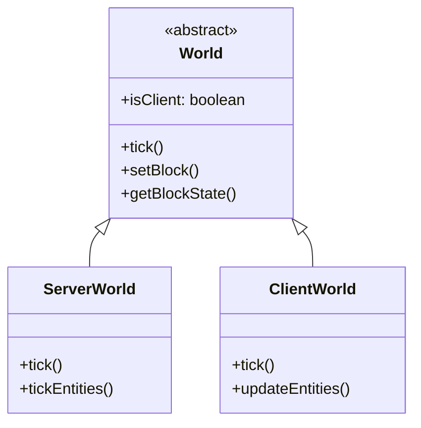
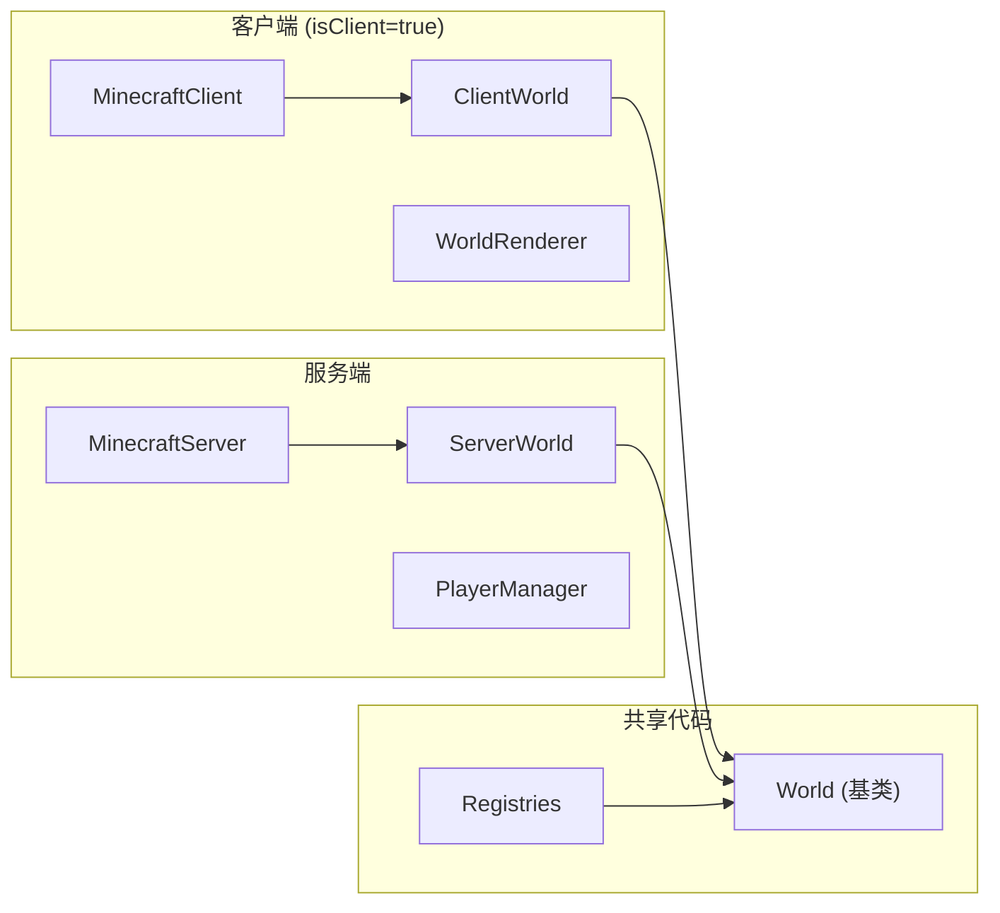

# 第 04 章：项目结构与源码阅读技巧（Project and Source Reading）

## 章节目标

学完本章后，你将能够：
- 理解 Minecraft 源码的整体目录结构
- 快速定位关键类和核心方法
- 使用有效策略阅读大型代码库

## 前置知识

- 了解 Java 包（package）概念
- 熟悉基本的设计模式

## Minecraft 源码目录结构

### 整体架构

```
net.minecraft/
├── client/              # 客户端专用代码 (@Environment(CLIENT))
├── server/              # 服务端专用代码 (@Environment(SERVER))
├── shared/              # 共享代码（两者都可用）
│
├── world/               # 世界系统
├── entity/              # 实体系统
├── block/               # 方块系统
├── item/                # 物品系统
├── network/             # 网络系统
├── registry/            # 注册表系统 ⭐
├── command/             # 命令系统
├── data/                # 数据生成
├── datafixer/           # 数据修复
├── resource/            # 资源管理
└── [其他子系统]
```

### 核心包详解

| 包名 | 内容 | 示例类 |
|------|------|--------|
| `net.minecraft.client` | 客户端渲染、GUI、输入 | `MinecraftClient`, `GameRenderer` |
| `net.minecraft.server` | 服务端管理、网络 | `MinecraftServer`, `PlayerManager` |
| `net.minecraft.world` | 世界管理、方块操作 | `World`, `Chunk`, `ServerWorld` |
| `net.minecraft.entity` | 实体基类、玩家、AI | `Entity`, `LivingEntity`, `PlayerEntity` |
| `net.minecraft.block` | 方块定义、状态 | `Block`, `BlockState`, `BlockEntity` |
| `net.minecraft.item` | 物品定义、堆叠 | `Item`, `ItemStack` |
| `net.minecraft.registry` | 注册表系统 ⭐ | `Registries`, `RegistryKey` |
| `net.minecraft.network` | 数据包、协议 | `Packet`, `ClientConnection` |
| `net.minecraft.command` | 命令解析 | `CommandManager`, `CommandDispatcher` |

## 快速定位技巧

### 场景 1: 找注册表

```
目标：找到物品注册的位置

搜索: "Registries.ITEM"
或: "registry/Registries.java"
```

### 场景 2: 找方块交互逻辑

```
目标：找到玩家破坏方块时的代码

可能位置:
- net.minecraft.block.Block
- net.minecraft.world.World.setBlock()
```

### 场景 3: 找玩家移动处理

```
目标：找到玩家位置同步的代码

可能位置:
- net.minecraft.network.packet.c2s.play.PlayerMoveC2SPacket
- net.minecraft.server.network.ServerPlayNetworkHandler
```

## 核心类速查

### 世界相关

| 类 | 职责 | 文件位置 |
|----|------|----------|
| `World` | 抽象世界基类 | `net.minecraft.world.World` |
| `ServerWorld` | 服务端世界 | `net.minecraft.server.world.ServerWorld` |
| `ClientWorld` | 客户端世界 | `net.minecraft.client.world.ClientWorld` |
| `Chunk` | 区块数据 | `net.minecraft.world.chunk.Chunk` |

### 实体相关

| 类 | 职责 | 文件位置 |
|----|------|----------|
| `Entity` | 实体基类 | `net.minecraft.entity.Entity` |
| `LivingEntity` | 生物实体 | `net.minecraft.entity.LivingEntity` |
| `PlayerEntity` | 玩家实体 | `net.minecraft.entity.player.PlayerEntity` |
| `ServerPlayerEntity` | 服务端玩家 | `net.minecraft.server.network.ServerPlayerEntity` |
| `ClientPlayerEntity` | 客户端玩家 | `net.minecraft.client.network.ClientPlayerEntity` |

### 注册表相关

| 类 | 职责 | 文件位置 |
|----|------|----------|
| `Registries` | 全局注册表容器 | `net.minecraft.registry.Registries` |
| `RegistryKey` | 资源定位键 | `net.minecraft.registry.RegistryKey` |
| `Identifier` | 资源标识符 | `net.minecraft.util.Identifier` |
| `RegistryEntry` | 注册表条目 | `net.minecraft.registry.entry.RegistryEntry` |

## 阅读策略

### 策略 1: 从入口点开始

```
游戏启动流程:
Main.main()
  └── Bootstrap.initialize()
        └── MinecraftServer/MinecraftClient
```

### 策略 2: 带着问题追踪

不要线性阅读，而是：
1. 提出具体问题
2. 找到相关入口类
3. 追踪方法调用链
4. 理解核心逻辑

### 策略 3: 善用类图理解继承

```java
// 查看类的继承关系
World (抽象基类)
├── ServerWorld (服务端实现)
└── ClientWorld (客户端实现)

// 用 Ctrl+H 查看
```

### 策略 4: 关注关键方法签名

```java
// 这些方法通常很重要
public void tick()           // 每tick更新
public boolean setBlock(...) // 方块操作
public void readNbt(...)     // 数据读取
public void writeNbt(...)    // 数据保存
```

## Mermaid 类图示例



## 理解客户端-服务端分离



## 源码阅读示例

### 示例：追踪方块放置

```
问题: 玩家放置方块时发生了什么？

1. 找到玩家交互入口
   ClientPlayerEntity.interact()
   
2. 追踪到服务端处理
   ServerPlayerEntity.interact()
   
3. 找到方块放置
   World.setBlock()
   
4. 检查服务端 vs 客户端
   if (!world.isClient) {
       // 只在服务端执行逻辑
   }
```

### 示例：理解注册流程

```
问题: 钻石方块是如何注册的？

1. 找到 Registries 类
   net.minecraft.registry.Registries
   
2. 找到 BLOCK 注册表
   public static final DefaultedRegistry~Block~ BLOCK
   
3. 找到注册位置
   Blocks.java (静态字段初始化)
   
4. 理解 ID 生成
   Identifier.ofVanilla("diamond_block")
```

## 常见模式识别

### 观察者模式

```java
// 事件监听器
public interface BlockBreakEvent {
    void onBlockBreak(Player player, Block block);
}

// 使用
block.addListener(event -> {
    // 处理破坏事件
});
```

### 注册表模式

```java
// 统一注册接口
public interface Registry<T> {
    T get(RegistryKey<T> key);
    RegistryKey<T> getKey(T value);
}
```

### 工厂模式

```java
// 创建实体的工厂
public interface EntityType~T extends Entity~ {
    T create(World world);
}
```

## 使用 IDE 工具

### 书签标记

长时间阅读时，使用书签标记重要位置：
- `Ctrl+F11` 添加数字书签
- `Ctrl+数字` 跳转到书签

### 结构视图

`Ctrl+F12` 打开当前文件结构，快速跳转方法。

### 架构视图

Settings → Appearance → Tool Window Bars
启用 Structure 工具窗口。

## 课后自查

1. 能否在 10 秒内找到 `World` 类？
2. `ServerWorld` 和 `ClientWorld` 有什么关系？
3. 如何找到物品注册的地方？
4. 使用哪种阅读策略最适合你？
5. 能否画出关键类的继承关系图？

## 下一步

现在你已经掌握了项目结构和阅读技巧，让我们进入核心内容：[注册表系统](./Part-1-Foundation/04-registry-system.md) ⭐
