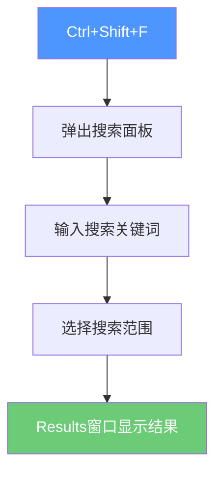
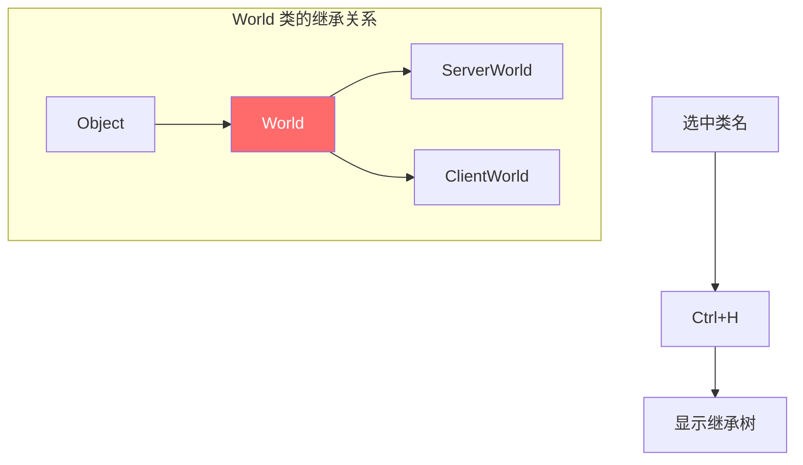
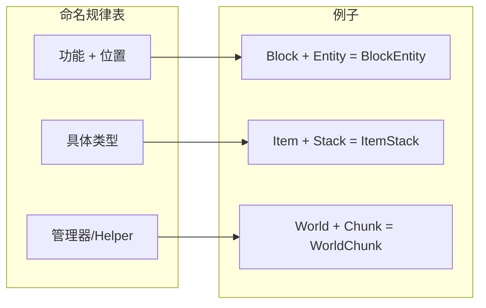
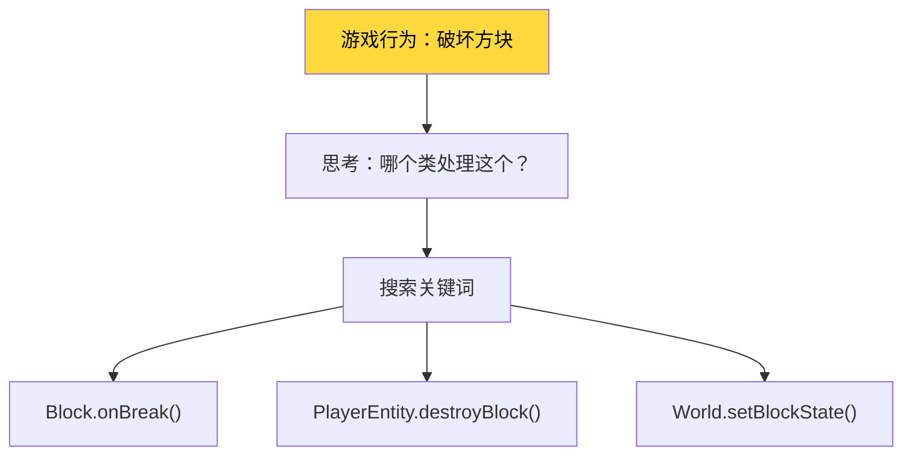
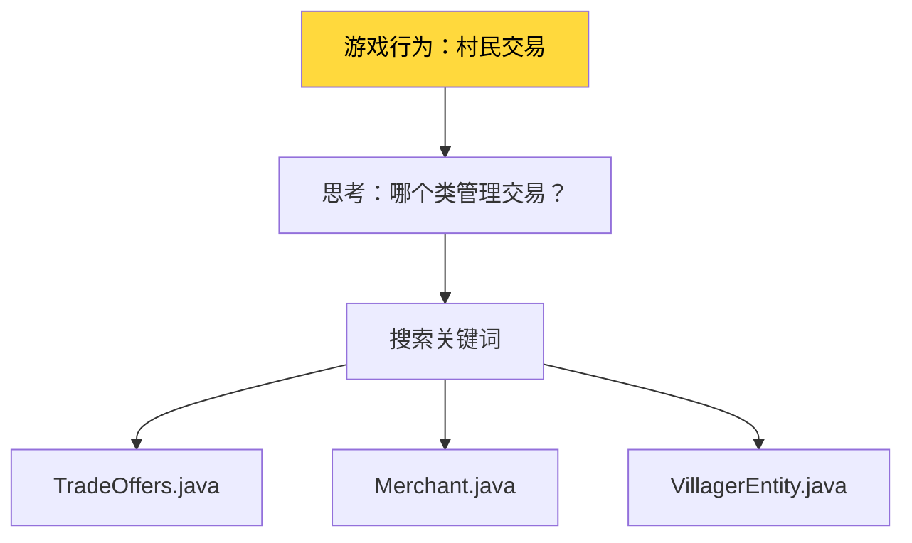
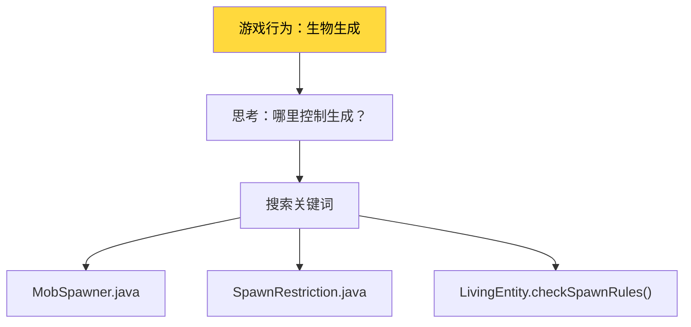
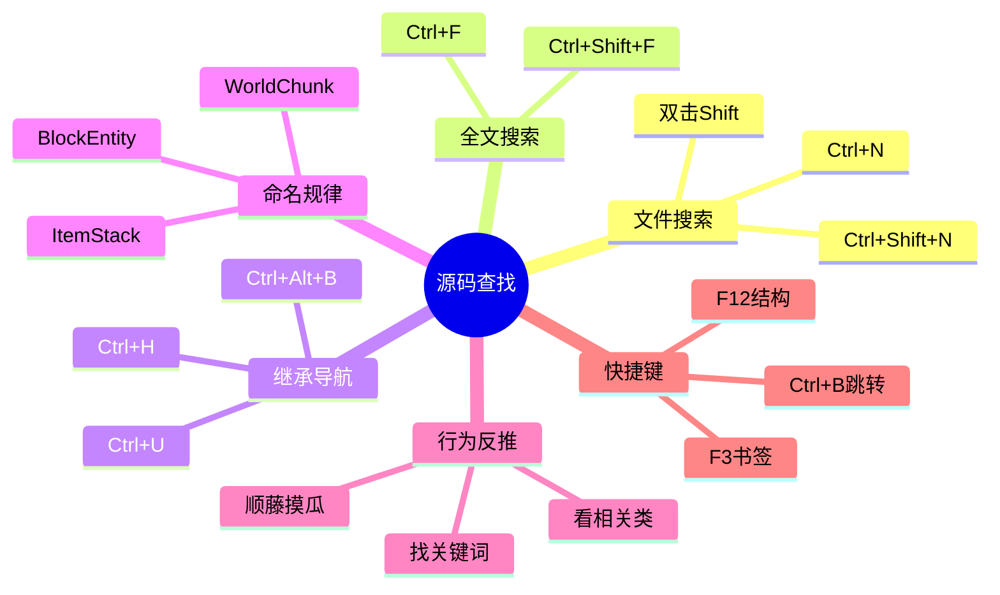

# 附录：源码查找指南

> 学会这章，你就能像老手一样快速找到任意游戏功能的源码位置！

---

## 目标

学完本章后，你将能够：
1. 在 IDEA 中快速搜索和定位源码
2. 理解 Minecraft 源码的命名规律
3. 根据游戏行为推测源码位置
4. 使用书签和收藏夹管理重要代码

---

## 前置知识

- 会使用 IDEA（或其他 Java IDE）
- 知道 Java 基本语法
- 了解项目结构

---

## 核心概念：源码在哪里？

### 项目结构速览

```
..../                           ← 你的项目根目录
├── source/                    ← Minecraft 源码（5364个Java文件）
│   ├── net/minecraft/
│   │   ├── registry/          ← 注册表系统
│   │   ├── world/             ← 世界系统
│   │   ├── block/             ← 方块系统
│   │   ├── item/              ← 物品系统
│   │   ├── entity/            ← 实体系统
│   │   ├── client/            ← 客户端
│   │   ├── server/            ← 服务端
│   │   └── ...
│   └── com/mojang/
│       └── brigadier/         ← 命令解析库
├── analysis/                   ← 源码分析文档
├── tutorials/                  ← 教程文档
└── README.md
```

---

## 技巧1：快速搜索文件

### 方法A：双击 Shift（推荐！）

```
操作：连续按两次 Shift 键
```


**适用场景**：
- 知道文件名，想快速打开
- 例如：`World.java`、`Block.java`、`Enchantment.java`

**搜索技巧**：
- 输入文件名的一部分即可，如搜 `World` 会显示所有包含 World 的文件
- 使用驼峰命名缩写，如搜 `WE` 可以找到 `WorldEvent`

### 方法B：Ctrl+Shift+N（文件搜索）

```
操作：Ctrl + Shift + N
```

**特点**：
- 可以搜索所有类型文件
- 支持正则表达式
- 支持路径过滤

### 方法C：Ctrl+N（类搜索）

```
操作：Ctrl + N
```

**特点**：
- 只搜索 Java 类
- 支持模糊搜索
- 显示类的包路径

---

## 技巧2：全文搜索

### 方法A：Ctrl+Shift+F（全局搜索）

```
操作：Ctrl + Shift + F
```



**适用场景**：
- 找某个方法在哪里被调用
- 找某个字符串在哪里使用
- 找某个变量在哪里定义

**示例**：
| 搜索内容 | 目的 |
|---------|------|
| `TICKS_PER_SECOND` | 找游戏tick常量定义 |
| `minecraft:stone` | 找石头方块注册位置 |
| `onBlockBreak` | 找破坏方块的逻辑 |
| `damage` | 找伤害相关代码 |

### 方法B：Ctrl+F（当前文件搜索）

```
操作：Ctrl + F
```

**特点**：
- 速度快，只在当前文件搜索
- 支持正则表达式
- 支持大小写敏感/不敏感

### 方法C：Ctrl+Shift+R（全局替换）

```
操作：Ctrl + Shift + R
```

**特点**：
- 先搜索，再替换
- 支持预览
- 支持整个项目或指定目录

---

## 技巧3：类继承导航

### 方法A：Ctrl+H（类型层次结构）

```
操作：Ctrl + H
```



**适用场景**：
- 想了解某个类的父类是谁
- 想看某个类有哪些子类
- 理解类的继承关系

### 方法B：Ctrl+Alt+B（实现导航）

```
操作：Ctrl + Alt + B
```

**特点**：
- 如果光标在接口上，显示所有实现类
- 如果光标在抽象方法上，显示所有实现

**示例**：
| 光标位置 | 显示结果 |
|---------|---------|
| `interface Entity` | 所有 Entity 的实现类 |
| `interface Item` | 所有 Item 的实现类 |
| `method tick()` | 所有实现了 tick() 的类 |

### 方法C：Ctrl+U（父类导航）

```
操作：Ctrl + U
```

**特点**：
- 跳转到父类/父接口
- 和 Ctrl+Alt+B 配合使用

---

## 技巧4：方法导航

### 方法A：Ctrl+F12（文件结构）

```
操作：Ctrl + F12
```

**显示内容**：
```
World.java
├── 字段
│   ├── isClient: boolean
│   ├── border: WorldBorder
│   └── ...
├── 方法
│   ├── tick()
│   ├── getBlockState()
│   ├── setBlockState()
│   └── ...
```

**特点**：
- 快速了解一个类的所有成员
- 可以直接点击跳转

### 方法B：F12 或 Ctrl+G（跳转到行）

```
操作：F12
```

**特点**：
- 跳转到指定行号
- 行号在 IDE 左下角显示

### 方法C：Ctrl+[ 和 Ctrl+]（代码块导航）

```
操作：Ctrl + [  （向前）
操作：Ctrl + ]  （向后）
```

**特点**：
- 跳转到代码块的开始/结束
- 适合在大方法中快速移动

---

## 技巧5：根据命名规律找源码

### Minecraft 的命名规律



### 常用对应关系

| 关键词 | 可能的文件名 | 位置 |
|--------|-------------|------|
| 方块实体 | `BlockEntity.java` | `net.minecraft.block.entity` |
| 物品堆叠 | `ItemStack.java` | `net.minecraft.item` |
| 实体类型 | `EntityType.java` | `net.minecraft.entity` |
| 世界 | `World.java` | `net.minecraft.world` |
| 区块 | `WorldChunk.java` | `net.minecraft.world.chunk` |
| 玩家 | `PlayerEntity.java` | `net.minecraft.entity.player` |
| 村民 | `VillagerEntity.java` | `net.minecraft.entity.passive` |
| 僵尸 | `ZombieEntity.java` | `net.minecraft.entity.mob` |
| 附魔 | `Enchantment.java` | `net.minecraft.enchantment` |
| 配方 | `Recipe.java` | `net.minecraft.recipe` |
| 战利品表 | `LootTables.java` | `net.minecraft.loot` |
| 声音 | `SoundEvent.java` | `net.minecraft.sound` |
| 粒子 | `Particle.java` | `net.minecraft.particle` |
| 药水效果 | `StatusEffect.java` | `net.minecraft.entity.effect` |

---

## 技巧6：从游戏行为反推源码

### 场景1：想知道破坏方块时发生了什么



**搜索步骤**：
1. 全局搜索 `breakBlock` 或 `onBlockBreak`
2. 找到 `Block.java` 中的 `onBreak()` 方法
3. 查看方法内部的逻辑

### 场景2：想知道村民如何交易



**搜索步骤**：
1. 全局搜索 `getOffers` 或 `trade`
2. 找到 `Merchant.java` 接口
3. 看它的实现类

### 场景3：想知道生物如何生成



**搜索步骤**：
1. 全局搜索 `canSpawn` 或 `spawn`
2. 找 `SpawnRestriction.java` 看生成规则
3. 找 `MobSpawner.java` 看生成逻辑

---

## 技巧7：常用快捷键速查

### 文件操作

| 快捷键 | 功能 |
|--------|------|
| `Ctrl+Shift+N` | 全局文件搜索 |
| `Ctrl+N` | 类搜索 |
| `Ctrl+Shift+T` | 测试类搜索 |
| `Alt+F1` | 在资源管理器中定位 |

### 导航

| 快捷键 | 功能 |
|--------|------|
| `Ctrl+G` | 跳转到行 |
| `Ctrl+H` | 类型层次结构 |
| `Ctrl+Alt+H` | 方法调用层次 |
| `Ctrl+B` | 跳转到声明 |
| `Ctrl+Alt+B` | 跳转到实现 |
| `F4` | 跳转到源码 |
| `Ctrl+U` | 跳转到父类 |

### 搜索

| 快捷键 | 功能 |
|--------|------|
| `Ctrl+F` | 当前文件搜索 |
| `Ctrl+Shift+F` | 全局搜索 |
| `Ctrl+R` | 当前文件替换 |
| `Ctrl+Shift+R` | 全局替换 |
| `Ctrl+Shift+/` | 注释/取消注释 |

### 编辑

| 快捷键 | 功能 |
|--------|------|
| `Ctrl+D` | 复制行 |
| `Ctrl+Y` | 删除行 |
| `Ctrl+/` | 注释行 |
| `Ctrl+Shift+↑/↓` | 移动代码块 |
| `Ctrl+Alt+L` | 格式化代码 |

---

## 技巧8：使用书签管理重要代码

### 添加书签

```
操作：
1. 将光标放在要标记的行
2. 按 F3 或 Ctrl+F11
3. 选择书签编号（0-9）
```

### 查看所有书签

```
操作：Shift+F3
```

**特点**：
- 可以给代码加数字书签
- 方便在多个文件间快速跳转
- 书签可以命名

### 收藏夹（Favorites）

```
操作：
1. 右键点击文件/方法
2. 选择"Add to Favorites"
3. 在左侧 Favorites 面板查看
```

---

## 技巧9：IDEA 常用插件推荐

### 必需插件

| 插件名 | 功能 |
|--------|------|
| **Minecraft Development** | MC 项目支持、生成模板 |
| **Translation** | 翻译插件，看不懂英文变量名时用 |
| **Key Promoter X** | 快捷键提示 |

### 推荐插件

| 插件名 | 功能 |
|--------|------|
| **Rainbow Brackets** | 括号颜色高亮 |
| **GitToolBox** | Git 增强 |
| **String Manipulation** | 字符串处理 |

---

## 实战练习

### 练习1：找到钻石剑的定义

**目标**：找到 `diamond_sword` 在哪里定义

**提示**：
1. 先想好关键词：`diamond_sword` 或 `DIAMOND_SWORD`
2. 用 Ctrl+Shift+F 全局搜索
3. 在 `Items.java` 或 `Registries.java` 中找

### 练习2：找到玩家跳跃的代码

**目标**：找到玩家跳跃时执行的代码

**提示**：
1. 搜索关键词：`jump`、`setVelocity`
2. 在 `LivingEntity.java` 或 `PlayerEntity.java` 中找
3. 查看 `jump()` 方法

### 练习3：找到区块保存的代码

**目标**：找到区块数据保存到磁盘的代码

**提示**：
1. 搜索关键词：`save`、`write`、`NBT`
2. 在 `WorldChunk.java` 或 `ServerWorld.java` 中找
3. 查看 `writeNbt()` 或 `save()` 方法

### 练习4：找到附魔效果计算

**目标**：找到锋利附魔增加伤害的代码

**提示**：
1. 搜索关键词：`Sharpness`、`EnchantmentHelper`
2. 在 `EnchantmentHelper.java` 中找
3. 查看 `getDamageBonus()` 方法

### 练习5：找到村民职业选择

**目标**：找到村民如何选择职业

**提示**：
1. 搜索关键词：`profession`、`VillagerProfession`
2. 在 `VillagerEntity.java` 中找
3. 查看 `setProfession()` 方法

---

## 小结



---

## 相关链接

> ⚠️ **注意**：以下源码示例来源于 CFR 反编译代码，变量名和方法名可能与原始源码有所差异。

- [Part-0: 项目结构](./03-project-intro.md)
- [Part-1: 注册表系统](../Part-1-Foundation/04-registry-system.md)
- Part-2: World核心 - 文档待完成

---

## 延伸阅读

- [IDEA 官方快捷键文档](https://www.jetbrains.com/help/idea/keymap-reference.html)
- [Minecraft Wiki: 开发教程](https://minecraft.fandom.com/wiki/Tutorials)

---

*最后更新：2026-03-19*
