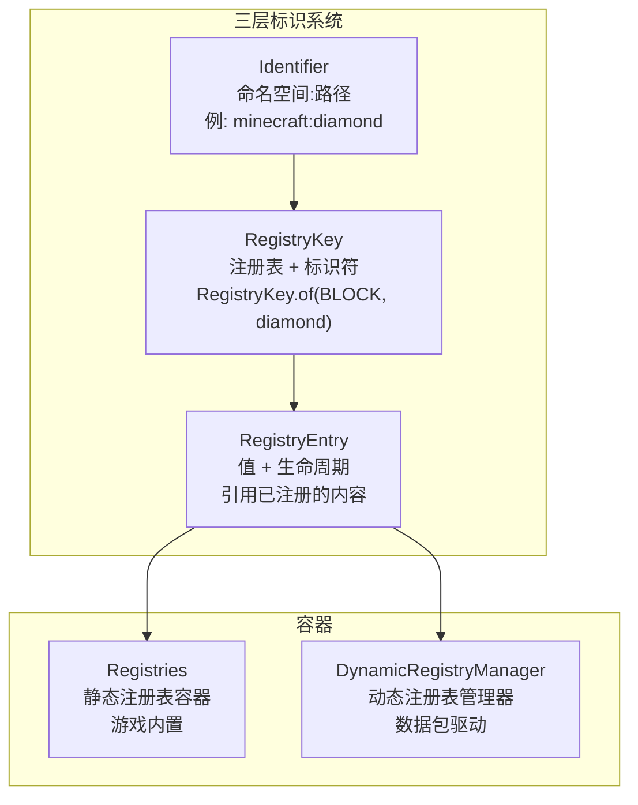
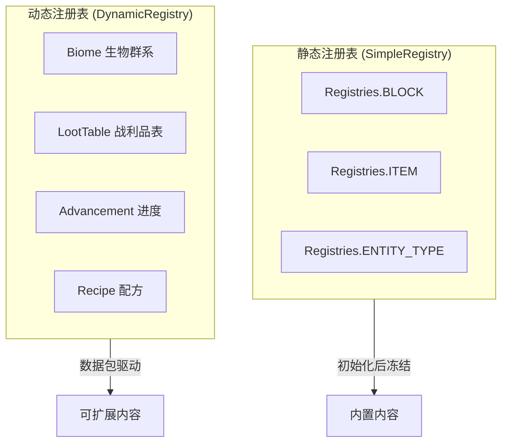
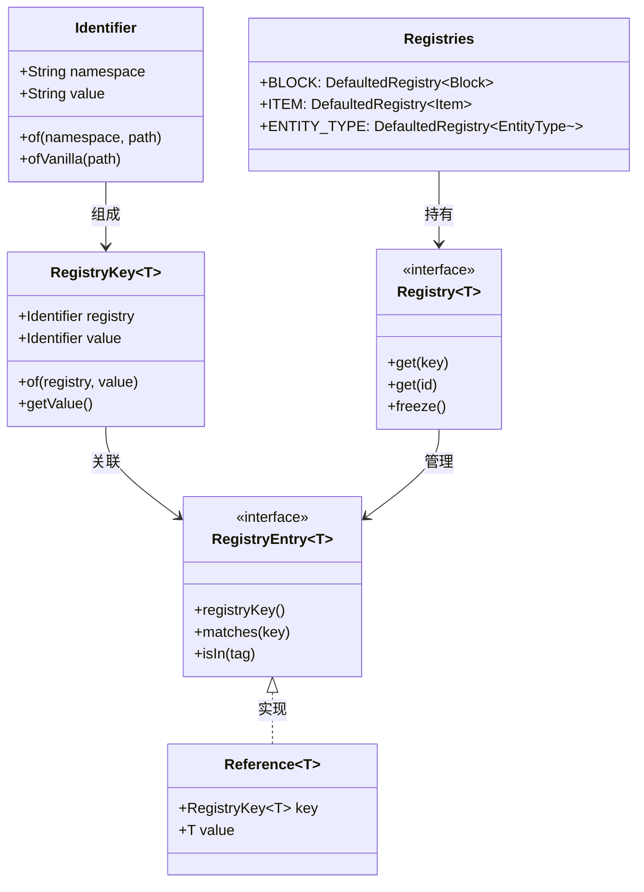

# 第 04 章：注册表系统（Registry System）

## 章节目标

学完本章后，你将能够：
- 理解 Minecraft 注册表系统的核心概念
- 区分 Identifier、RegistryKey、RegistryEntry 三层架构
- 掌握注册新物品/方块/实体的完整流程
- 理解标签（Tag）系统的使用方法

## 前置知识

- Java 泛型基础
- 基本的数据结构（Map、List）
- 理解什么是"注册"的概念

## 核心概念 ⭐

### 注册表系统 = 图书馆索引系统

**生活比喻**：想象 Minecraft 是一个大型图书馆：

| 图书馆组件 | Minecraft 对应 | 示例 |
|-----------|---------------|------|
| 书籍 ISBN 号 | `Identifier` | `minecraft:diamond_block` |
| 分类卡片 | `RegistryKey` | `RegistryKey.of(BLOCK, "diamond_block")` |
| 索引卡 | `RegistryEntry` | 记录书籍位置、借阅状态 |
| 索引柜 | `Registries` | 所有分类的总和 |

### 三层标识系统



## 源码解析

### 1. Identifier - 资源标识符

```java
// net/minecraft/util/Identifier.java
public class Identifier implements Comparable<Identifier> {
    
    private final String namespace;  // 命名空间
    private final String value;      // 路径
    
    // 创建方式
    public static Identifier of(String namespace, String path) {
        return new Identifier(namespace, path);
    }
    
    // 便捷方法：minecraft 命名空间
    public static Identifier ofVanilla(String path) {
        return new Identifier("minecraft", path);
    }
}
```

**使用示例：**

```java
// 定义标识符
Identifier diamondId = Identifier.ofVanilla("diamond");
Identifier myModId = Identifier.of("mymod", "custom_item");

// 字符串格式
String str = diamondId.toString();  // "minecraft:diamond"
```

### 2. RegistryKey - 注册表键

```java
// net/minecraft/registry/RegistryKey.java
public class RegistryKey<T> {
    
    private final Identifier registry;  // 注册表标识符
    private final Identifier value;     // 值标识符
    
    // 创建注册表键
    public static <T> RegistryKey<T> of(
        RegistryKey<? extends Registry<T>> registry,  // 注册表类型
        Identifier value                                // 值标识符
    ) {
        return new RegistryKey<>(registry.value, value);
    }
    
    // 获取值标识符
    public Identifier getValue() {
        return value;
    }
}
```

**使用示例：**

```java
// 创建方块键
RegistryKey<Block> diamondBlockKey = RegistryKey.of(
    RegistryKeys.BLOCK,                           // BLOCK 注册表
    Identifier.ofVanilla("diamond_block")         // "minecraft:diamond_block"
);

// 创建物品键
RegistryKey<Item> diamondKey = RegistryKey.of(
    RegistryKeys.ITEM,
    Identifier.ofVanilla("diamond")
);
```

### 3. Registry 接口

```java
// net/minecraft/registry/Registry.java
public interface Registry<T>
extends Keyable, IndexedIterable<T> {
    
    // 获取注册表键
    RegistryKey<? extends Registry<T>> getKey();
    
    // 根据 ID 获取值
    @Nullable T get(@Nullable Identifier id);
    
    // 根据键获取值
    @Nullable T get(@Nullable RegistryKey<T> key);
    
    // 获取原始数字 ID
    int getRawId(@Nullable T value);
    
    // 获取值对应的键
    Optional<RegistryKey<T>> getKey(T value);
    
    // 检查是否包含
    boolean contains(RegistryKey<T> key);
    
    // 冻结注册表（静态注册表初始化后冻结）
    Registry<T> freeze();
}
```

### 4. Registries 全局注册表容器

```java
// net/minecraft/registry/Registries.java
public class Registries {
    
    // 根注册表（注册表的注册表）
    private static final MutableRegistry<MutableRegistry<?>> ROOT = 
        new SimpleRegistry(
            RegistryKey.ofRegistry(RegistryKeys.ROOT), 
            Lifecycle.stable()
        );
    
    // 核心注册表
    public static final DefaultedRegistry<Block> BLOCK = 
        createIntrusive(RegistryKeys.BLOCK, "air", registry -> Blocks.AIR);
    
    public static final DefaultedRegistry<Item> ITEM = 
        createIntrusive(RegistryKeys.ITEM, "air", registry -> Items.AIR);
    
    public static final DefaultedRegistry<EntityType<?>> ENTITY_TYPE = 
        createIntrusive(RegistryKeys.ENTITY_TYPE, "pig", registry -> EntityType.PIG);
    
    public static final Registry<SoundEvent> SOUND_EVENT = 
        create(RegistryKeys.SOUND_EVENT, registry -> SoundEvents.ENTITY_ITEM_PICKUP);
    
    // 更多注册表...
}
```

### 5. RegistryEntry - 注册表条目

```java
// net/minecraft/registry/entry/RegistryEntry.java
public interface RegistryEntry<T> {
    
    // 获取所有者
    RegistryEntryOwner<T> getOwner();
    
    // 获取键
    RegistryKey<T> registryKey();
    
    // 检查是否匹配键
    boolean matches(RegistryKey<T> key);
    
    // 检查是否在标签中
    boolean isIn(TagKey<T> tag);
    
    // 引用实现
    public static class Reference<T> implements RegistryEntry<T> {
        private final RegistryEntryOwner<T> owner;
        private RegistryKey<T> registryKey;
        private final T value;
        
        public T value() {
            return value;
        }
        
        public RegistryKey<T> registryKey() {
            return registryKey;
        }
    }
}
```

### 6. 注册流程 - register 方法

```java
// 简化版注册流程
public static <V, T extends V> T register(
    Registry<V> registry,      // 注册表
    RegistryKey<V> key,       // 注册键
    T entry                   // 要注册的条目
) {
    // 调用可变注册表的 add 方法
    ((MutableRegistry<V>)registry).add(key, entry, RegistryEntryInfo.DEFAULT);
    return entry;
}

// 在注册表冻结后尝试注册会抛出异常
private void assertNotFrozen(RegistryKey<?> key) {
    if (this.frozen) {
        throw new IllegalStateException(
            "Registry is already frozen (trying to add key: " + key + ")");
    }
}
```

## 实战：注册自定义物品

### 完整示例

```java
// 1. 定义物品
public static final Item MY_CUSTOM_ITEM = register(
    Registries.ITEM,
    Identifier.of("mymod", "custom_item"),  // 模组ID:物品ID
    new Item(new Item.Settings()
        .maxCount(64)
        .rarity(Rarity.RARE)
        .food(FoodComponents.GOLDEN_APPLE)
    )
);

// 2. 使用 RegistryKey 方式（推荐）
RegistryKey<Item> MY_ITEM_KEY = RegistryKey.of(
    RegistryKeys.ITEM,
    Identifier.of("mymod", "my_item")
);

public static final Item MY_ITEM = register(
    Registries.ITEM,
    MY_ITEM_KEY,
    new Item(new Item.Settings())
);

// 3. 获取已注册的物品
Item diamond = Registries.ITEM.get(Identifier.ofVanilla("diamond"));
Item diamond2 = Registries.ITEM.getOrThrow(
    RegistryKey.of(RegistryKeys.ITEM, Identifier.ofVanilla("diamond"))
);
```

### 方块注册

```java
// 方块注册
public static final Block MY_BLOCK = register(
    Registries.BLOCK,
    Identifier.of("mymod", "my_block"),
    new Block(AbstractBlock.Settings.create()
        .strength(3.0f)
        .requiresTool()
    )
);

// 方块自动生成对应物品
// Minecraft 会自动为方块创建物品形式
```

## 标签系统 (Tag)

### TagKey 标签键

```java
// 定义标签
TagKey<Block> MINEABLE_PICKAXE = TagKey.of(
    RegistryKeys.BLOCK,
    Identifier.ofVanilla("mineable/pickaxe")
);

// 检查物品是否在标签中
boolean canMineWithPickaxe = block.getRegistryEntry()
    .isIn(TagKey.of(RegistryKeys.BLOCK, 
        Identifier.ofVanilla("mineable/pickaxe")));
```

### JSON 中的标签定义

```json
{
    "replace": false,
    "values": [
        "minecraft:cobblestone",
        "minecraft:stone",
        "#minecraft:needs_iron_tool",
        "#minecraft:needs_diamond_tool"
    ]
}
```

### 使用标签查询

```java
// 获取标签中的所有条目
Optional<RegistryEntryList.Named<Block>> tag = 
    Registries.BLOCK.getEntryList(MINEABLE_PICKAXE);

tag.ifPresent(entries -> {
    for (RegistryEntry<Block> entry : entries) {
        Block block = entry.value();
        // 处理每个可挖的方块
    }
});
```

## 静态 vs 动态注册表



| 类型 | 特点 | 示例 |
|------|------|------|
| **静态注册表** | 游戏内置、初始化后冻结 | `BLOCK`, `ITEM`, `ENTITY_TYPE` |
| **动态注册表** | 数据包驱动、可扩展 | `BIOME`, `LOOT_TABLE`, `RECIPE` |

## 生命周期追踪

```java
// Lifecycle 枚举
public enum Lifecycle {
    stable(),           // 稳定版本
    experimental(),     // 实验版本
    deprecated(),        // 废弃版本
    experimental_worldgen()  // 实验性世界生成
}

// 注册时指定生命周期
Registry.register(registry, key, entry, 
    new RegistryEntryInfo(Lifecycle.experimental()));
```

## 常见错误与排查

### 错误 1: 在注册表冻结后注册

```
Error: Adding duplicate key (...) or Registry is already frozen
```

**原因**: 在 Bootstrap 初始化完成后仍尝试注册
**解决**: 确保注册代码在 mod 初始化阶段执行

### 错误 2: 标识符冲突

```
Error: Duplicate key: minecraft:diamond
```

**原因**: 使用了已存在的标识符
**解决**: 使用唯一的命名空间（如模组ID）

### 错误 3: 获取不存在的注册表

```java
// ❌ 错误
Block block = Registries.BLOCK.get("nonexistent");

// ✅ 正确
Block block = Registries.BLOCK.getOrThrow(
    RegistryKey.of(RegistryKeys.BLOCK, Identifier.ofVanilla("nonexistent"))
);
```

## 课后自查

1. 能否解释 Identifier、RegistryKey、RegistryEntry 三者的区别？
2. 如何注册一个新的物品？写出完整代码。
3. 标签系统和注册表有什么区别？
4. 什么是注册表的"冻结"机制？为什么需要它？
5. 如何检查一个方块是否可以挖掘？

## 架构图



## 参考文件

| 文件 | 描述 |
|------|------|
| `net/minecraft/util/Identifier.java` | 资源标识符 |
| `net/minecraft/registry/RegistryKey.java` | 注册表键 |
| `net/minecraft/registry/Registry.java` | 注册表接口 |
| `net/minecraft/registry/Registries.java` | 全局注册表容器 |
| `net/minecraft/registry/SimpleRegistry.java` | 注册表实现 |
| `net/minecraft/registry/entry/RegistryEntry.java` | 注册表条目 |

## 下一步

注册表系统是 Minecraft 的核心！现在让我们学习 [客户端-服务端架构](./05-client-server-arch.md)。
