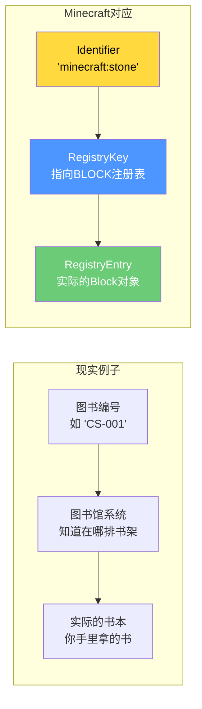
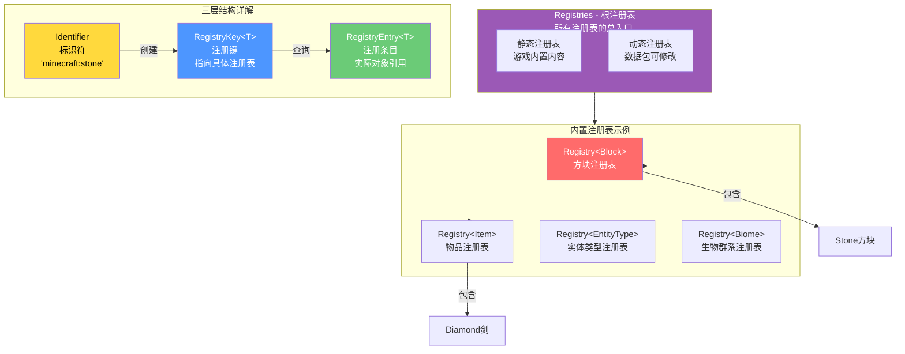
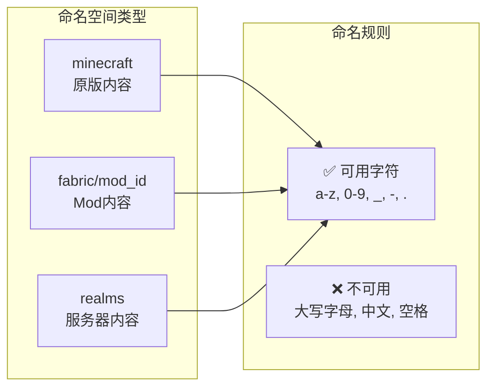
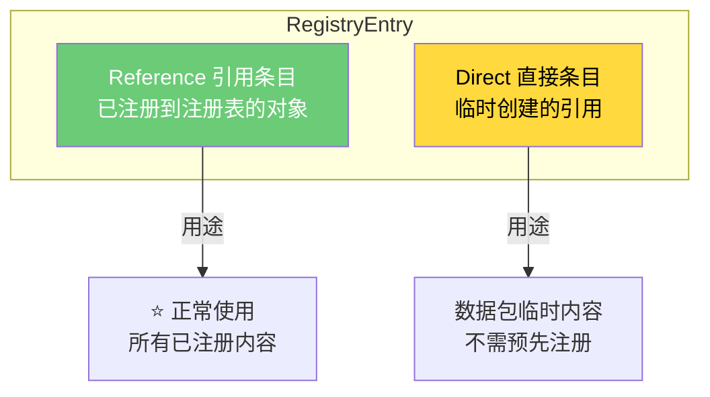
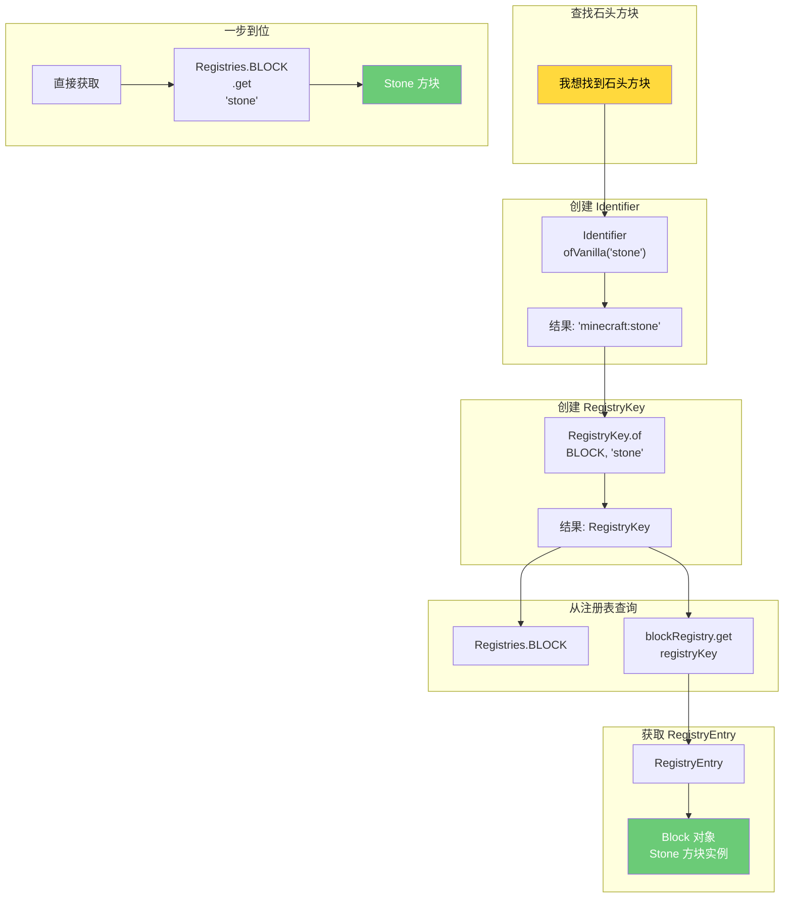
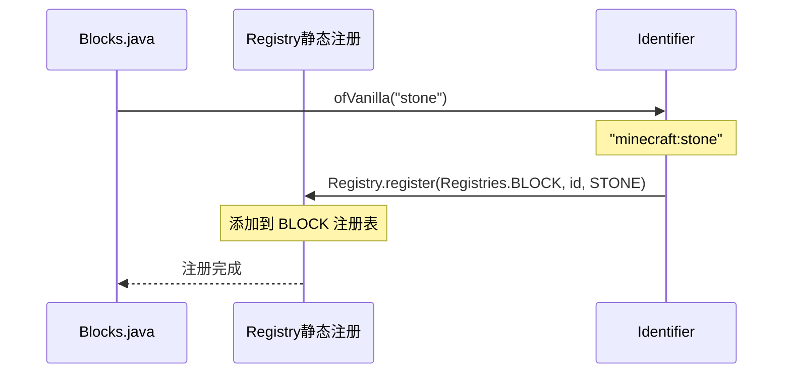
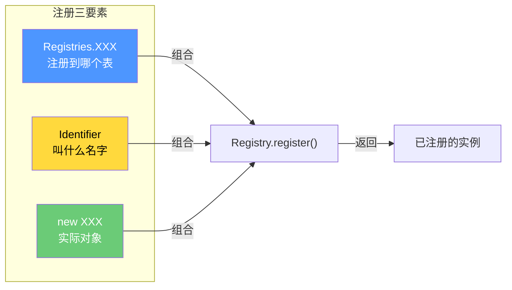
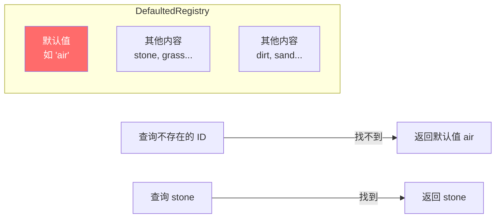
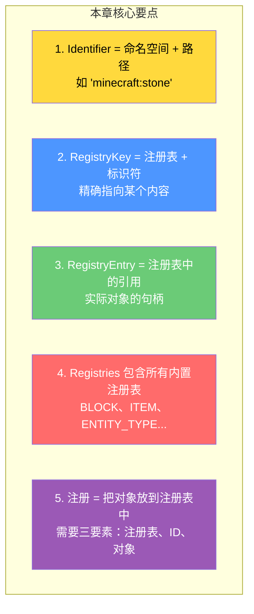

# 第四章：注册表系统（Registry System）

> ⭐ **这是 Minecraft 源码中最重要的系统！学完这章，你就能理解MC如何管理所有的游戏内容。**

> ⚠️ **注意**：以下源码示例来源于 CFR 反编译代码，变量名和方法名可能与原始源码有所差异。部分代码经过简化以便于理解。

---

## 目标

学完本章后，你将理解：

1. **注册表是什么** - MC用来管理所有游戏元素的"图书馆"
2. **三层结构** - Identifier → RegistryKey → RegistryEntry 的关系
3. **如何查找游戏内容** - 找到石头方块、钻石剑在哪里定义
4. **如何注册新内容** - Mod开发的核心技能

---

## 前置知识

- 了解 Java 的基本语法（类、接口、泛型）
- 知道什么是 `Map`（键值对存储）

---

## 核心概念：用比喻理解注册表

### 比喻：图书馆的索引系统

想象 Minecraft 是一个**巨大的图书馆**，里面有：

| 图书馆概念 | Minecraft 对应 |
|-----------|---------------|
| 图书馆 | `Registries`（所有注册表的总入口） |
| 书架 | `Registry`（每种类型的注册表，如 BLOCK、ITEM） |
| 书架上的书 | 注册表中的具体内容（如石头、钻石剑、猪） |
| 书的编号 | `Identifier`（如 `minecraft:stone`） |
| 借书证 | `RegistryKey`（精确指向某本书） |
| 书的副本 | `RegistryEntry`（实际的书本对象） |

### 为什么需要这三层？



---

## 图解：注册表三层结构



---

## 第一层：Identifier（标识符）

### 是什么？

`Identifier` 是 Minecraft 中**唯一标识符**，格式为 `命名空间:路径`。

### 生活中的例子

就像网购时的**快递单号**：`顺丰-SF123456789`

- `顺丰` = 命名空间（namespace）
- `SF123456789` = 路径（path）

### Minecraft 中的例子

| Identifier | 命名空间 | 路径 |
|-----------|---------|-----|
| `minecraft:stone` | minecraft | stone |
| `minecraft:diamond_sword` | minecraft | diamond_sword |
| `minecraft:pig` | minecraft | pig |
| `minecraft:the_nether` | minecraft | the_nether |
| `fabric:stone` | fabric | stone |

### 源码解析

```12:28:net/minecraft/util/Identifier.java
public static final String DEFAULT_NAMESPACE = "minecraft";  // 默认命名空间
public static final char NAMESPACE_SEPARATOR = ':';          // 分隔符
```

```139:144:net/minecraft/util/Identifier.java
// 创建 Identifier 的方式
public static Identifier of(String namespace, String path) {
    return Identifier.ofValidated(namespace, path);
}

public static Identifier ofVanilla(String path) {
    // 快捷方法：自动使用 minecraft 命名空间
    return new Identifier(DEFAULT_NAMESPACE, path);
}
```

### 命名空间规则



---

## 第二层：RegistryKey（注册键）

### 是什么？

`RegistryKey` = Registry（注册表类型）+ Identifier（具体内容）

就像图书馆里的**借书证**，上面写着：
- 在哪个图书馆？（REGISTRY）
- 要借哪本书？（IDENTIFIER）

### 源码解析

```58:60:net/minecraft/registry/RegistryKey.java
public static <T> RegistryKey<T> of(
    RegistryKey<? extends Registry<T>> registry,  // 在哪个注册表
    Identifier value                              // 什么标识符
) {
    return RegistryKey.of(registry.value, value);
}
```

### 创建 RegistryKey 的例子

```java
// 石头方块的注册键
RegistryKey<Block> STONE_KEY = RegistryKey.of(
    Registries.BLOCK.getKey(),      // 方块注册表
    Identifier.ofVanilla("stone")  // "minecraft:stone"
);

// 等价于
RegistryKey<Block> STONE_KEY = RegistryKey.of(
    RegistryKeys.BLOCK,
    new Identifier("minecraft", "stone")
);
```

### RegistryKeys 预定义常量

```116:152:net/minecraft/registry/RegistryKeys.java
public class RegistryKeys {
    public static final RegistryKey<Registry<Block>> BLOCK = of("block");
    public static final RegistryKey<Registry<Item>> ITEM = of("item");
    public static final RegistryKey<Registry<EntityType<?>>> ENTITY_TYPE = of("entity_type");
    public static final RegistryKey<Registry<Biome>> BIOME = of("worldgen/biome");
    public static final RegistryKey<Registry<World>> WORLD = of("dimension");
    // ... 还有80多个注册键
}
```

---

## 第三层：RegistryEntry（注册条目）

### 是什么？

`RegistryEntry` 是注册表中的**实际对象引用**。

类比：借书证上写的书，最终指向**书架上真正的书**。

### 两种类型



### 源码中的 RegistryEntry

```40:42:net/minecraft/registry/entry/RegistryEntry.java
public interface RegistryEntry<T> {
    T value();                    // 获取实际对象
    boolean hasKeyAndValue();     // 是否有键值对
    Optional<RegistryKey<T>> getKey();  // 获取注册键
}
```

---

## 注册表查找流程图



---

## 内置注册表列表

Minecraft 内置了 **80+ 个注册表**，最常用的有：

| 注册表 | 源码字段 | 管理的类型 |
|--------|----------|-----------|
| BLOCK | `Registries.BLOCK` | 方块（石头、泥土、草方块...） |
| ITEM | `Registries.ITEM` | 物品（钻石剑、金苹果...） |
| ENTITY_TYPE | `Registries.ENTITY_TYPE` | 实体类型（猪、牛、僵尸...） |
| BIOME | `Registries.BIOME` | 生物群系（平原、森林、沙漠...） |
| SOUND_EVENT | `Registries.SOUND_EVENT` | 音效 |
| POTION | `Registries.POTION` |药水 |
| PARTICLE_TYPE | `Registries.PARTICLE_TYPE` | 粒子效果 |
| ENCHANTMENT | `Registries.ENCHANTMENT` | 附魔 |
| ITEM_GROUP | `Registries.ITEM_GROUP` | 创造模式物品栏 |

### 源码中的注册表定义

```134:143:net/minecraft/registry/Registries.java
public class Registries {
    // 方块注册表 - 默认值是空气方块
    public static final DefaultedRegistry<Block> BLOCK = 
        Registries.createIntrusive(RegistryKeys.BLOCK, "air", registry -> Blocks.AIR);
    
    // 物品注册表 - 默认值是空气物品
    public static final DefaultedRegistry<Item> ITEM = 
        Registries.createIntrusive(RegistryKeys.ITEM, "air", registry -> Items.AIR);
    
    // 实体类型注册表 - 默认值是猪
    public static final DefaultedRegistry<EntityType<?>> ENTITY_TYPE = 
        Registries.createIntrusive(RegistryKeys.ENTITY_TYPE, "pig", registry -> EntityType.PIG);
}
```

---

## 实战：找到石头方块的注册代码

### 步骤1：找到 Blocks.java

```
source/net/minecraft/block/Blocks.java
```

### 步骤2：找到 STONE 常量

```java
// 石头方块的定义（简化）
public class Blocks {
    // 每个方块都调用 register 方法注册
    public static final Block STONE = register(
        "stone",                    // 标识符路径
        new Block(AbstractBlock.Settings...)  // 方块属性
    );
}
```

### 步骤3：理解注册流程



---

## 如何注册一个新方块（Mod开发基础）

### 方法1：使用 Registry.register

```java
// 在 Mod 初始化时调用
public class MyMod {
    public static final Block MY_CUSTOM_BLOCK = 
        Registry.register(
            Registries.BLOCK,                          // 注册到方块注册表
            Identifier.of("mymod", "magic_block"),     // ID: mymod:magic_block
            new Block(AbstractBlock.Settings.of(Material.STONE))  // 创建方块
        );
}
```

### 关键点说明



### 常见错误

| 错误 | 原因 | 解决方法 |
|------|------|----------|
| `Registry is frozen` | 注册表已冻结 | 在正确的时机注册 |
| `Missing default` | 默认值不存在 | DefaultedRegistry 需要默认值 |
| `Intrusive holder` | 条件注册导致崩溃 | 对象创建也要条件化 |

---

## DefaultedRegistry（带默认值的注册表）

有些注册表有一个**默认值**，当找不到某个ID时返回这个默认值。



### 源码示例

```140:144:net/minecraft/registry/Registries.java
// DefaultedRegistry - 有默认值 "air"
public static final DefaultedRegistry<Block> BLOCK = 
    Registries.createIntrusive(
        RegistryKeys.BLOCK, 
        "air",                    // 默认值 ID
        registry -> Blocks.AIR    // 默认值对象
    );

// 普通 Registry - 没有默认值
public static final Registry<Potion> POTION = 
    Registries.create(RegistryKeys.POTION, Potions::registerAndGetDefault);
```

---

## 常用代码片段

### 1. 获取物品

```java
// 方法1：通过 Identifier
Item diamond = Registries.ITEM.get(Identifier.ofVanilla("diamond"));

// 方法2：通过 RegistryKey
RegistryKey<Item> diamondKey = RegistryKey.of(RegistryKeys.ITEM, Identifier.ofVanilla("diamond"));
Item diamond2 = Registries.ITEM.get(diamondKey);

// 方法3：通过 getOrThrow（推荐，更安全）
Item diamond3 = Registries.ITEM.getOrThrow(diamondKey);
```

### 2. 检查是否存在

```java
Identifier id = Identifier.ofVanilla("stone");
boolean exists = Registries.BLOCK.containsId(id);  // true

Identifier fakeId = Identifier.ofVanilla("fake_block");
boolean fakeExists = Registries.BLOCK.containsId(fakeId);  // false
```

### 3. 遍历所有内容

```java
// 遍历所有方块
for (Block block : Registries.BLOCK) {
    System.out.println(Registries.BLOCK.getId(block));
}

// 流式遍历
Registries.BLOCK.stream()
    .filter(block -> block.getDefaultState().isSolid())
    .forEach(System.out::println);
```

### 4. 创建 RegistryEntry 引用

```java
// 获取 RegistryEntry（用于数据包等场景）
RegistryEntry<Block> stoneEntry = Registries.BLOCK.getEntry(Identifier.ofVanilla("stone"));
stoneEntry.ifPresent(entry -> {
    Block block = entry.value();
    System.out.println(block);
});
```

---

## Registry 接口方法速查

```java
// 获取值
registry.get(Identifier)           // 通过 ID 获取
registry.get(RegistryKey)          // 通过键获取
registry.getOrThrow(RegistryKey)   // 获取，不存在抛异常

// 查询
registry.containsId(Identifier)    // 是否包含该 ID
registry.contains(RegistryKey)     // 是否包含该键
registry.getId(T)                  // 获取对象的 ID
registry.getKey(T)                 // 获取对象的键

// 遍历
registry.forEach()                // 遍历所有
registry.stream()                  // 流式处理
registry.getIds()                  // 获取所有 ID
registry.getKeys()                 // 获取所有键

// 注册
Registry.register(registry, id, value)  // 注册新值
```

---

## 小结



### 记住这个顺序

```
Identifier (String) 
    ↓ 创建
RegistryKey<T> (指向哪个注册表 + 标识符)
    ↓ 查询
RegistryEntry<T> (注册表中的引用)
    ↓ 获取值
T (实际对象，如 Block、Item)
```

---

## 练习

### 练习1：查找代码

在源码中找到以下内容：

1. 找到 `diamond_sword` 物品的注册代码
2. 找到 `pig` 实体类型的注册代码
3. 找到 `plains` 生物群系的注册代码

### 练习2：理解输出

阅读以下代码，说出输出结果：

```java
Identifier id = Identifier.of("fabric", "my_item");
RegistryKey<Item> key = RegistryKey.of(RegistryKeys.ITEM, id);
System.out.println("ID: " + id);
System.out.println("Namespace: " + id.getNamespace());
System.out.println("Path: " + id.getPath());
System.out.println("Key: " + key.getValue());
```

### 练习3：模拟注册

假设你要创建一个 Mod，想添加一个"魔法水晶"方块，写出注册代码（不需要实际运行，理解思路即可）。

---

## 相关链接

### 源码文件

| 文件 | 路径 | 作用 |
|------|------|------|
| `Registries.java` | `net/minecraft/registry/Registries.java` | 所有内置注册表 |
| `RegistryKey.java` | `net/minecraft/registry/RegistryKey.java` | 注册键定义 |
| `Identifier.java` | `net/minecraft/util/Identifier.java` | 标识符定义 |
| `Registry.java` | `net/minecraft/registry/Registry.java` | 注册表接口 |
| `RegistryEntry.java` | `net/minecraft/registry/entry/RegistryEntry.java` | 注册条目 |
| `RegistryKeys.java` | `net/minecraft/registry/RegistryKeys.java` | 预定义注册键常量 |

### 进阶阅读

> ⚠️ **注意**：以下链接指向的文档可能尚未完成或位置可能变化
- 下一章：[第五章：客户端-服务端架构](./05-client-server-arch.md) - 理解客户端和服务端如何共享注册表
- 下一章：[第六章：共享常量](./06-shared-constants.md) - 了解游戏的基本数值设定
- 进阶主题：数据包系统 - 理解动态注册表如何被数据包修改

---

> 📝 **提示**：注册表系统是 Minecraft 源码的核心，几乎所有系统都会用到它。确保你完全理解这章内容后再继续！

---

*文档版本：Minecraft 1.21, Protocol 767, World Version 3953*
*最后更新：2026-03-19*
