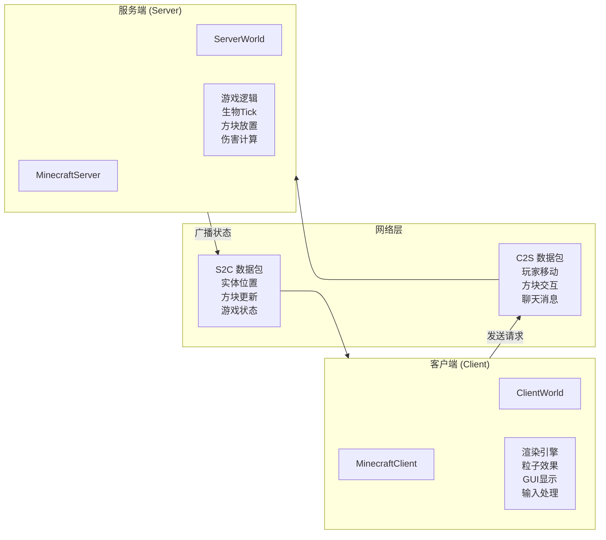
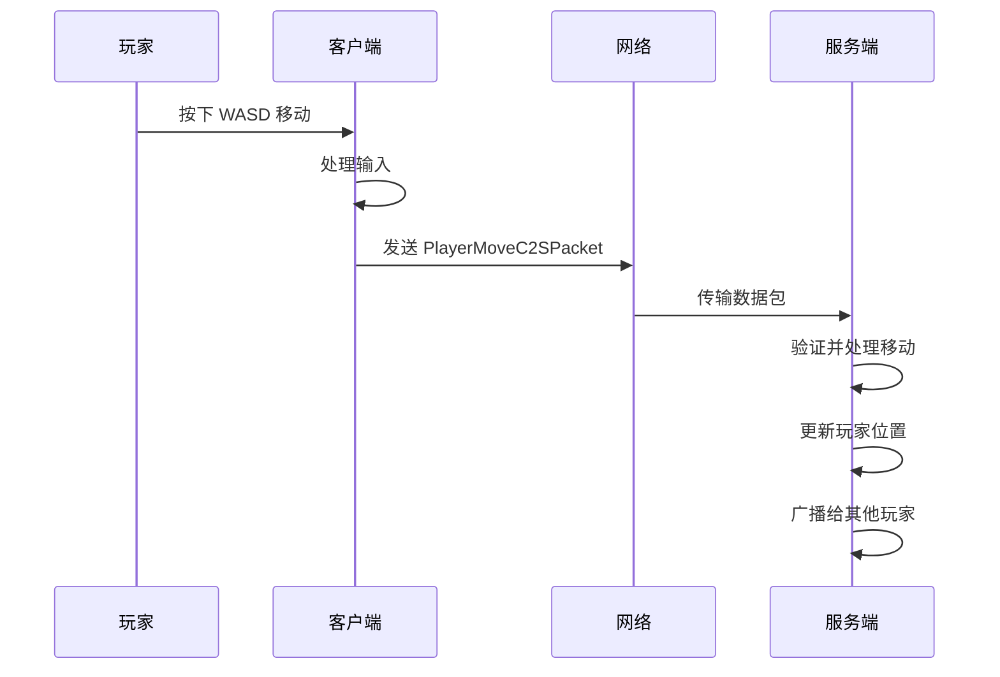
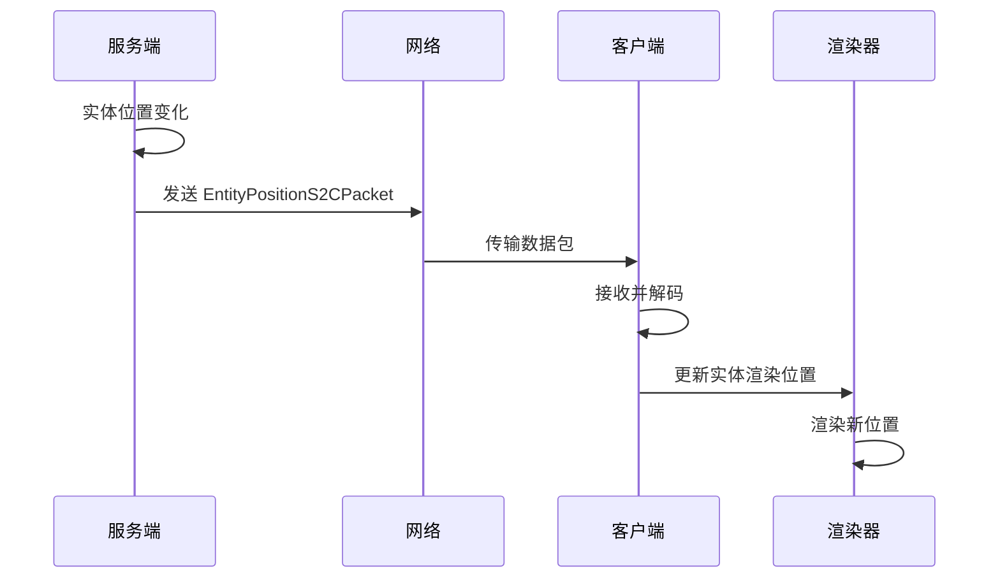
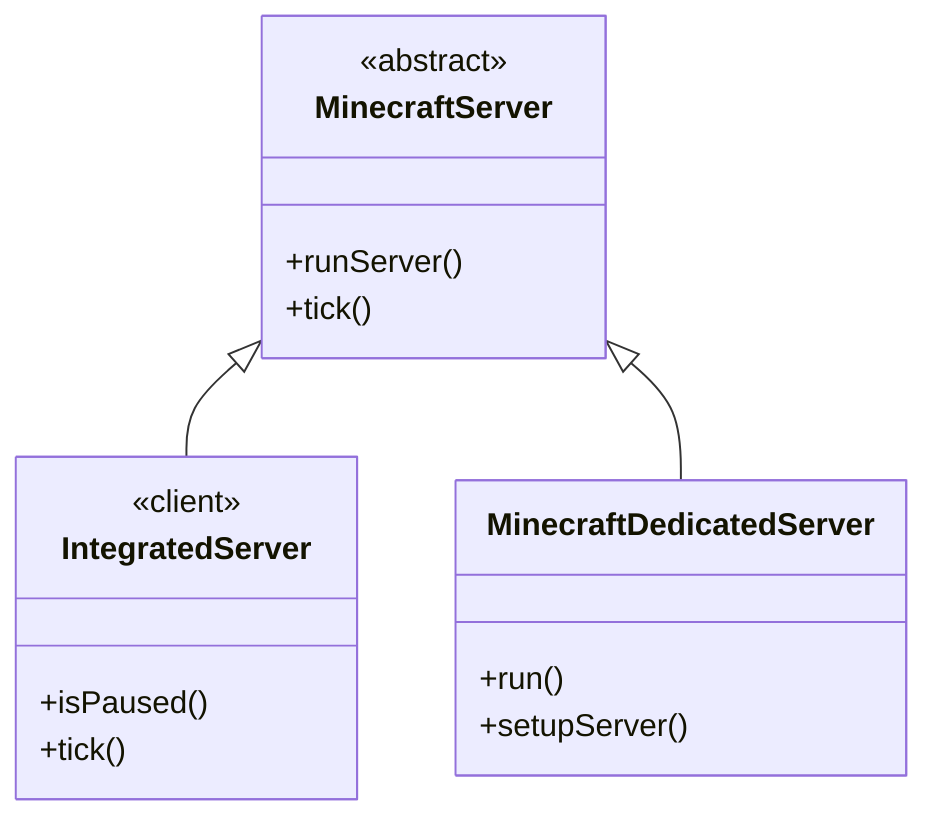

# 第 05 章：客户端-服务端架构（Client-Server Architecture）

## 章节目标

学完本章后，你将能够：
- 理解 Minecraft 客户端-服务端的分离设计
- 识别 `isClient` 标志位的作用
- 理解 World 抽象类及其客户端/服务端实现
- 掌握数据包在两端之间的流动方式

## 前置知识

- 了解基本的多人游戏概念
- 理解 Java 继承和多态

## 核心概念

### 老师与学生模型

> **生活比喻**：想象 Minecraft 的客户端-服务端关系就像教室里的老师和学生
>
> | 角色 | Minecraft 对应 | 职责 |
>|------|---------------|------|
>| 老师 | **服务端** | 掌握所有"正确答案"，决定游戏规则 |
>| 学生 | **客户端** | 只能看到老师的板书（渲染），按老师指示行动 |
>| 举手提问 | **C2S 数据包** | 客户端发送请求给服务端 |
>| 老师回答 | **S2C 数据包** | 服务端发送结果给客户端 |

### 核心设计原则

1. **逻辑权威性**：服务端是游戏逻辑的绝对权威
2. **状态同步**：客户端通过数据包接收服务端的游戏状态
3. **环境区分**：使用 `World.isClient` 标志位区分运行环境



## 源码解析

### 1. World 抽象基类

```java
// net/minecraft/world/World.java
public abstract class World implements RegistryWrapperProvider<World>, AutoCloseable {
    
    // 关键标志：区分客户端和服务端
    public final boolean isClient;
    
    // 世界属性
    private final WorldBorder border;           // 世界边界
    private final BiomeAccess biomeAccess;      // 生物群系访问
    private final RegistryKey<World> registryKey; // 世界键
    
    protected World(World.Properties properties, 
                    RegistryKey<World> registryKey,
                    WorldEvoker evoker,
                    boolean isClient) {
        this.isClient = isClient;
        this.registryKey = registryKey;
        // ...
    }
    
    // 核心抽象方法 - 子类必须实现
    public abstract void tick(BooleanSupplier shouldKeepTicking);
    
    // 方块操作
    public abstract boolean setBlock(BlockPos pos, BlockState state, int flags);
    
    // 获取区块
    public abstract @Nullable Chunk getChunk(int x, int z, ChunkStatus status, boolean load);
}
```

### 2. ServerWorld - 服务端世界

```java
// net/minecraft/server/world/ServerWorld.java
public class ServerWorld extends World {
    
    // 服务端特有组件
    private final MinecraftServer server;              // 服务器引用
    private final ChunkManager chunkManager;          // 区块管理器
    private final ServerTickManager tickManager;      // Tick 管理器
    
    // Tick 方法实现
    @Override
    public void tick(BooleanSupplier shouldKeepTicking) {
        // 1. 处理游戏刻
        this.getChunkManager().tick(shouldKeepTicking);
        
        // 2. Tick 所有实体
        this.tickEntityPredicates();
        
        // 3. 随机区块更新
        this.tickChunkPositions();
        
        // 4. 同步时间
        this.syncWorldTime();
    }
    
    // 服务端特有的实体管理
    public void tickEntities() {
        // 服务端负责所有实体的逻辑更新
        for (Entity entity : this.entities) {
            entity.tick();
        }
    }
}
```

### 3. ClientWorld - 客户端世界

```java
// net/minecraft/client/world/ClientWorld.java
@Environment(EnvType.CLIENT)
public class ClientWorld extends World {
    
    // 客户端特有组件
    private final ClientWorldProperties properties;
    private final ChunkManager chunkManager;
    
    public ClientWorld(ClientWorldProperties properties, 
                       ChunkManager chunkManager,
                       WorldInfo info,
                       Registry<Biome> biomeRegistry,
                       Registry<DimensionType> dimensionTypeRegistry,
                       Supplier<DimensionType> dimensionTypeSupplier) {
        super(..., isClient = true);  // 始终为 true
        this.properties = properties;
        this.chunkManager = chunkManager;
    }
    
    @Override
    public void tick(BooleanSupplier shouldKeepTicking) {
        // 客户端的 Tick 主要做渲染相关更新
        this.chunkManager.tick(shouldKeepTicking);
        this.clientTick(shouldKeepTicking);
    }
    
    // 客户端不执行真正的游戏逻辑
    // 只根据收到的数据包更新状态
}
```

### 4. MinecraftServer - 服务端主类

```java
// net/minecraft/server/MinecraftServer.java
public abstract class MinecraftServer extends Thread
        implements RegistryAttributeProvider,
                   CommandSource,
                   SystemDetailA,
                   AutoCloseable {
    
    // 世界管理
    private final Map<RegistryKey<World>, ServerWorld> worlds;
    
    // 玩家管理
    private PlayerManager playerManager;
    
    // Tick 循环
    protected void runServer() {
        while (this.running) {
            long targetTickTime = tickManager.getNanosPerTick();  // 50ms
            
            this.tickStartTimeNanos += targetTickTime;
            this.tick(shouldKeepTicking);
            
            // 等待下一个 Tick
            Thread.sleep(50);  // 每秒 20 Tick
        }
    }
}
```

### 5. MinecraftClient - 客户端主类

```java
// net/minecraft/client/MinecraftClient.java
@Environment(EnvType.CLIENT)
public class MinecraftClient extends BarnChoreProcessor 
        implements WindowEventHandler, WorldAccess {
    
    public static final MinecraftClient INSTANCE;
    
    // 当前世界
    @Nullable private ClientWorld world;
    
    // 渲染组件
    private final GameRenderer gameRenderer;
    private final WorldRenderer worldRenderer;
    
    // 游戏循环
    public void run() {
        while (this.running) {
            this.render(!paused);
        }
    }
}
```

## 区分运行环境的代码模式

### 模式 1: if (world.isClient)

```java
// 在公共代码中常见
public void someMethod() {
    if (this.world.isClient) {
        // 客户端代码 - 渲染、音频等
        this.playSound(soundEvent);
    } else {
        // 服务端代码 - 游戏逻辑
        this.updateServerState();
    }
}
```

### 模式 2: @Environment 注解

```java
// 客户端专用代码
@Environment(EnvType.CLIENT)
public class TitleScreen extends Screen {
    // 只有客户端会编译这个类
}

// 服务端专用代码
@Environment(EnvType.SERVER)
public class DedicatedServer extends MinecraftServer {
    // 只有服务端会编译这个类
}
```

### 模式 3: 客户端/服务端实现分离

```java
// 抽象基类在共享代码中
public abstract class Entity {
    public abstract void tick();
}

// 服务端实现
public class ServerEntity extends Entity {
    @Override
    public void tick() {
        // 服务端逻辑：AI、移动、交互
    }
}

// 客户端实现
@Environment(EnvType.CLIENT)
public class ClientEntity extends Entity {
    @Override
    public void tick() {
        // 客户端逻辑：动画、粒子
    }
}
```

## 数据包流动

### 客户端到服务端 (C2S)



### 服务端到客户端 (S2C)



### 常见数据包类型

| 方向 | 数据包 | 用途 |
|------|--------|------|
| C2S | `PlayerMoveC2SPacket` | 玩家移动 |
| C2S | `PlayerActionC2SPacket` | 方块破坏/放置 |
| C2S | `ChatMessageC2SPacket` | 聊天消息 |
| S2C | `ChunkDataS2CPacket` | 区块数据 |
| S2C | `EntitySpawnS2CPacket` | 实体生成 |
| S2C | `PlayerSpawnS2CPacket` | 玩家加入 |

## 整合服务器 vs 独立服务器



| 特性 | 整合服务器 | 独立服务器 |
|------|-----------|-----------|
| 运行环境 | 客户端内 | 独立进程 |
| 可暂停 | ✅ | ❌ |
| 玩家上限 | 8 人 | 配置决定 |
| 控制台 | ❌ | ✅ |

## 实战示例：添加自定义实体

### 服务端注册

```java
// 服务端模组初始化
public void onInitialize() {
    // 注册实体类型
    RegistryKey<EntityType<?>> MY_ENTITY = RegistryKey.of(
        RegistryKeys.ENTITY_TYPE,
        Identifier.of("mymod", "my_entity")
    );
    
    EntityType<?> entityType = EntityType.Builder.create(
        MyEntity::new,          // 实体工厂方法
        SpawnGroup.CREATURE
    )
    .setDimensions(EntityDimensions.fixed(0.6f, 1.8f))
    .build("my_entity");
    
    Registry.register(Registries.ENTITY_TYPE, MY_ENTITY, entityType);
}
```

### 实体类定义

```java
// 共享代码
public class MyEntity extends Entity {
    // 共享的实体数据和方法
}

// 服务端特有逻辑
public class MyEntity extends MyEntity {
    @Override
    public void tick() {
        // 服务端：AI 行为
        this.updateAi();
    }
}
```

## 课后自查

1. 什么是 `World.isClient` 标志位？它的作用是什么？
2. `ServerWorld` 和 `ClientWorld` 有什么区别？
3. 为什么服务端是游戏逻辑的权威？
4. 玩家放置方块时，客户端和服务端分别做什么？
5. `@Environment` 注解的作用是什么？

## 架构图

```mermaid
flowchart TB
    subgraph 共享代码["共享代码 (net.minecraft.*)"]
        W["World.java<br/>抽象基类"]
        E["Entity.java<br/>实体基类"]
        B["Block.java<br/>方块基类"]
        R["Registries<br/>注册表"]
    end
    
    subgraph 客户端["客户端 (net.minecraft.client)"]
        MC["MinecraftClient"]
        CW["ClientWorld"]
        GR["GameRenderer"]
        WR["WorldRenderer"]
        GUI["GUI系统"]
    end
    
    subgraph 服务端["服务端 (net.minecraft.server)"]
        MS["MinecraftServer"]
        SW["ServerWorld"]
        PM["PlayerManager"]
        CMD["CommandManager"]
    end
    
    W <|-- CW
    W <|-- SW
    E <|-- ClientEntity
    E <|-- ServerEntity
    
    MC --> CW
    MS --> SW
    
    CW --> W
    SW --> W
    
    GR --> CW
    WR --> CW
    PM --> MS
```

## 参考文件

| 文件 | 描述 |
|------|------|
| `net/minecraft/world/World.java` | 世界抽象基类 |
| `net/minecraft/server/world/ServerWorld.java` | 服务端世界 |
| `net/minecraft/client/world/ClientWorld.java` | 客户端世界 |
| `net/minecraft/server/MinecraftServer.java` | 服务端主类 |
| `net/minecraft/client/MinecraftClient.java` | 客户端主类 |

## 下一步

现在你理解了客户端-服务端架构。让我们学习 [全局常量与版本信息](./06-shared-constants.md)。
