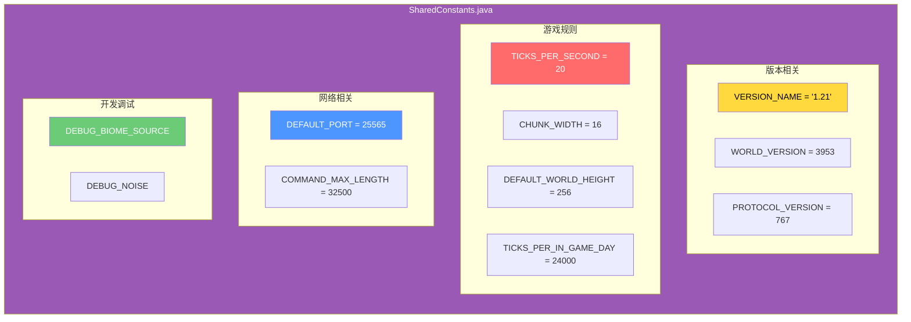
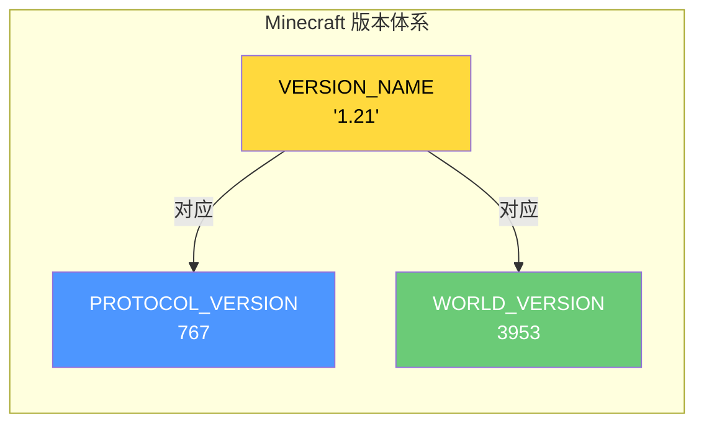
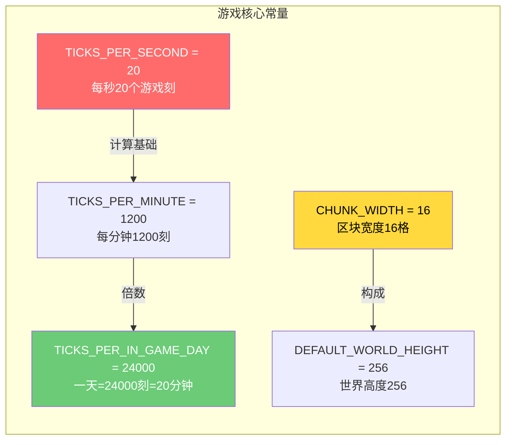
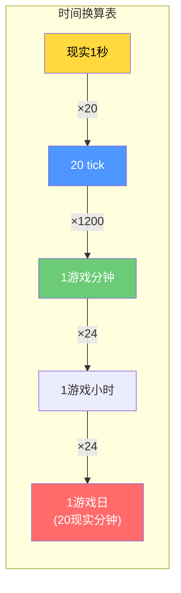
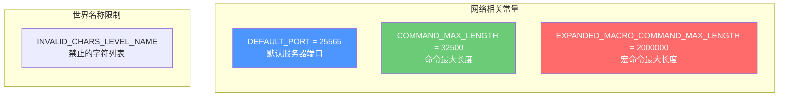
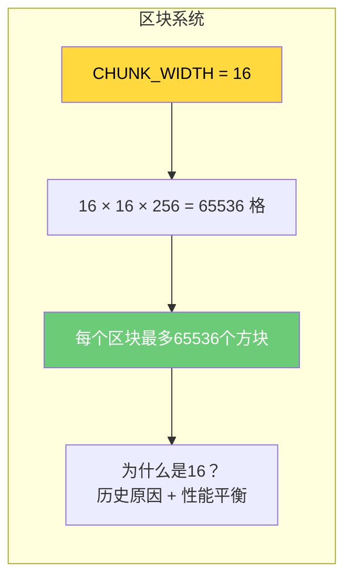
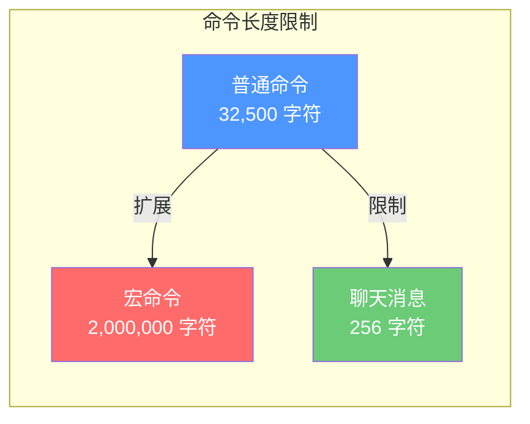
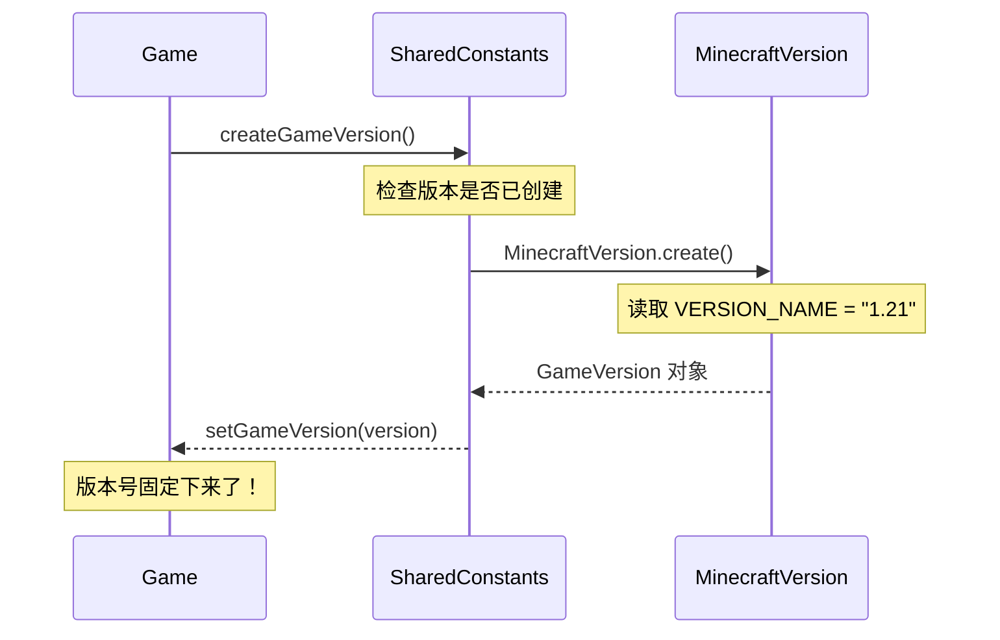
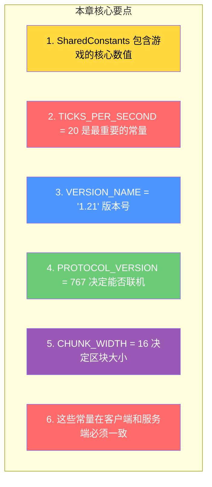

# 第六章：共享常量（Shared Constants）

> ⭐ **理解这章，你就能知道 Minecraft 的"游戏规则"藏在哪里！**

> ⚠️ **注意**：以下源码示例来源于 CFR 反编译代码，变量名和方法名可能与原始源码有所差异。部分代码经过简化以便于理解。

---

## 目标

学完本章后，你将理解：

1. **SharedConstants 包含什么**
2. **关键常量：TICKS_PER_SECOND、CHUNK_WIDTH 等**
3. **版本号和协议版本在哪里定义**
4. **这些常量如何影响游戏行为**

---

## 前置知识

- 了解 Java 的基本常量定义（`public static final`）
- 知道 Minecraft 的注册表系统（第四章）

---

## 核心概念：用比喻理解共享常量

### 比喻：宪法和法律

想象 Minecraft 是一个**国家**，SharedConstants 就是这个国家的**宪法**：

| 国家概念 | Minecraft 对应 |
|---------|---------------|
| 宪法 | `SharedConstants.java` |
| 规定国家名字 | `VERSION_NAME = "1.21"` |
| 规定一票否决权 | `TICKS_PER_SECOND = 20` |
| 规定国土面积 | `CHUNK_WIDTH = 16` |
| 宪法修订 | 游戏版本更新 |

### 为什么叫"共享"常量？

```
因为这些常量在【客户端】和【服务端】都需要知道！

比如：
- 客户端需要知道一秒多少tick，才能正确播放动画
- 服务端需要知道一秒多少tick，才能正确计时

如果两边数值不一致，就会出现：
- 客户端看到的水流动画和实际速度不一样
- 玩家移动速度和服务器验证不一致
```

---

## 图解：常量分类



---

## 版本相关常量

### 核心版本常量



### 源码解析

```15:25:net/minecraft/SharedConstants.java
public class SharedConstants {
    // 版本名称 - 你在主菜单看到的
    public static final String VERSION_NAME = "1.21";
    
    // 世界版本 - 用于检测存档兼容性
    public static final int WORLD_VERSION = 3953;
    
    // 网络协议版本 - 多人游戏通信协议
    public static final int RELEASE_TARGET_PROTOCOL_VERSION = 767;
    
    // 数据包版本
    public static final int RESOURCE_PACK_VERSION = 34;
    public static final int DATA_PACK_VERSION = 48;
}
```

### 这些版本号有什么用？

| 常量 | 用途 | 例子 |
|------|------|------|
| `VERSION_NAME` | 显示给玩家 | "1.21" |
| `WORLD_VERSION` | 存档兼容性 | 1.20的存档不能在1.21打开 |
| `PROTOCOL_VERSION` | 网络通信 | 版本不同无法连接 |
| `DATA_PACK_VERSION` | 数据包兼容性 | 影响数据包加载 |

---

## 游戏规则常量

### 最重要的游戏常量



### 源码解析

```129:140:net/minecraft/SharedConstants.java
public class SharedConstants {
    // 区块大小 - 永远是16！
    public static final int CHUNK_WIDTH = 16;
    
    // 世界高度 - 256格（之前版本是128）
    public static final int DEFAULT_WORLD_HEIGHT = 256;
    
    // 时间系统 - 非常重要的常量
    public static final int TICKS_PER_SECOND = 20;       // 1秒 = 20tick
    public static final int TICKS_PER_MINUTE = 1200;     // 1分钟 = 1200tick
    public static final int TICKS_PER_IN_GAME_DAY = 24000; // 游戏内一天 = 24000tick = 20分钟
}
```

### 为什么是 20tick/秒？

```
原因：
1. 20是 50ms 的倍数，方便计算
2. 20Hz 的更新频率足够平滑
3. 早期硬件性能有限

计算公式：
- 1 tick = 50ms
- 1 秒 = 1000ms / 50ms = 20 tick
- 1 游戏日 = 20分钟 = 20 * 60 * 20 = 24000 tick
```

### 游戏日和现实时间的转换



---

## 网络相关常量

### 端口和命令限制



### 源码解析

```107:136:net/minecraft/SharedConstants.java
public class SharedConstants {
    // 默认端口 - 你在路由器看到的
    public static final int DEFAULT_PORT = 25565;
    
    // 命令长度限制
    public static final int COMMAND_MAX_LENGTH = 32500;
    public static final int EXPANDED_MACRO_COMMAND_MAX_LENGTH = 2000000;
    
    // 世界名称禁止字符
    public static final char[] INVALID_CHARS_LEVEL_NAME = 
        new char[]{'/', '\n', '\r', '\t', '\u0000', '\f', '`', '?', 
                   '*', '\\', '<', '>', '|', '"', ':'};
}
```

---

## 区块系统常量

### CHUNK_WIDTH = 16 的意义



### 区块大小计算

```
区块大小 = 16 × 16 × 高度

Minecraft 1.21 区块大小：
- 主世界：16 × 16 × 320 = 81,920 格
- 下界：16 × 16 × 128 = 32,768 格
- 末地：16 × 16 × 256 = 65,536 格
```

---

## 命令系统常量

### 命令长度限制



---

## 版本号查询系统

### 游戏版本创建



### 源码解析

```148:171:net/minecraft/SharedConstants.java
public class SharedConstants {
    // 游戏版本单例
    private static GameVersion gameVersion;
    
    // 创建版本（只执行一次）
    public static void createGameVersion() {
        if (gameVersion == null) {
            gameVersion = MinecraftVersion.create();
        }
    }
    
    // 获取协议版本（用于网络通信）
    public static int getProtocolVersion() {
        return 767;  // 硬编码返回
    }
}
```

---

## 常量查找实战

### 如何找到某个常量

```
查找步骤：
1. 打开 SharedConstants.java
2. 使用 Ctrl+F 搜索常量名
3. 阅读常量周围的注释
4. 追踪常量的使用位置
```

### 常用常量速查表

| 常量名 | 值 | 用途 |
|--------|-----|------|
| `TICKS_PER_SECOND` | 20 | 每秒游戏刻 |
| `TICKS_PER_IN_GAME_DAY` | 24000 | 游戏内一天 |
| `CHUNK_WIDTH` | 16 | 区块宽度 |
| `DEFAULT_WORLD_HEIGHT` | 256 | 默认世界高度 |
| `DEFAULT_PORT` | 25565 | 服务器端口 |
| `COMMAND_MAX_LENGTH` | 32500 | 命令最大长度 |

---

## 实战：计算游戏时间

### 将tick转换为现实时间

```java
public class TimeCalculator {
    // 将游戏tick转换为现实秒数
    public static double ticksToSeconds(int ticks) {
        return ticks / 20.0;  // 因为每秒20tick
    }
    
    // 将游戏tick转换为游戏内天数
    public static double ticksToDays(int ticks) {
        return ticks / 24000.0;  // 因为每天24000tick
    }
    
    // 例子：太阳升起需要多少tick？
    public static void main(String[] args) {
        // 游戏内日出是 tick 0
        // 游戏内日落是 tick 12000
        // 游戏内午夜是 tick 18000
        
        System.out.println("日出: 0 tick");
        System.out.println("日落: " + 12000 + " tick = " + ticksToSeconds(12000) + " 秒");
        System.out.println("午夜: " + 18000 + " tick = " + ticksToSeconds(18000) + " 秒");
        System.out.println("完整一天: " + ticksToDays(24000) + " 天");
    }
}
```

---

## 小结



### 记住这些数字

```
重要常数：
- 20 = 每秒tick数
- 24000 = 每天tick数（20分钟）
- 16 = 区块宽度
- 256 = 世界高度
- 767 = 协议版本
- 3953 = 世界版本
- 25565 = 默认端口
```

---

## 练习

### 练习1：计算时间

一个红石中继器的延迟是 2 tick，请问：
1. 等于多少现实时间？
2. 等于多少游戏时间？

### 练习2：理解版本兼容性

为什么 Minecraft 1.20.4 的玩家无法连接到 1.21 的服务器？

### 练习3：查找区块数量

如果世界是 1000×1000 格，需要多少个区块？

### 练习4：阅读源码

在源码中找到 `TICKS_PER_SECOND` 的所有使用位置，理解它如何影响游戏逻辑。

---

## 相关链接

### 源码文件

| 文件 | 路径 | 作用 |
|------|------|------|
| `SharedConstants.java` | `net/minecraft/SharedConstants.java` | 所有共享常量定义 |
| `MinecraftVersion.java` | `net/minecraft/MinecraftVersion.java` | 版本信息获取 |
| `GameVersion.java` | `net/minecraft/GameVersion.java` | 版本类定义 |

### 进阶阅读

> ⚠️ **注意**：以下链接指向的文档可能尚未完成或位置可能变化
- 下一章：[第七章：启动流程](./07-bootstrap-flow.md) - 了解游戏启动时发生了什么
- 深入了解：区块系统 - 理解区块如何工作
- 网络相关：协议版本 - 理解网络协议

---

> 💡 **提示**：SharedConstants 虽然看起来只是一些数字，但它们决定了 Minecraft 的基本运行规则。记住这些关键常量，对理解整个游戏系统非常重要！

---

*文档版本：Minecraft 1.21, Protocol 767, World Version 3953*
*最后更新：2026-03-19*
