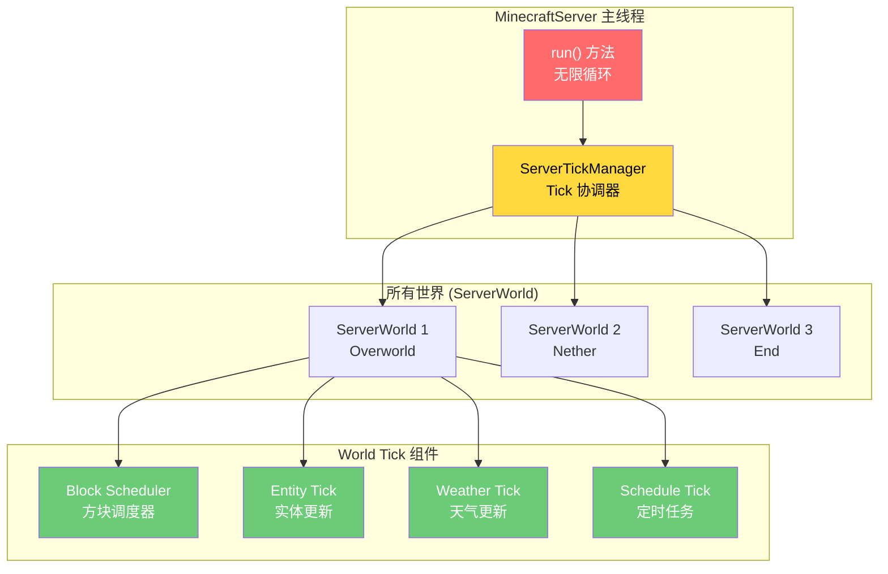
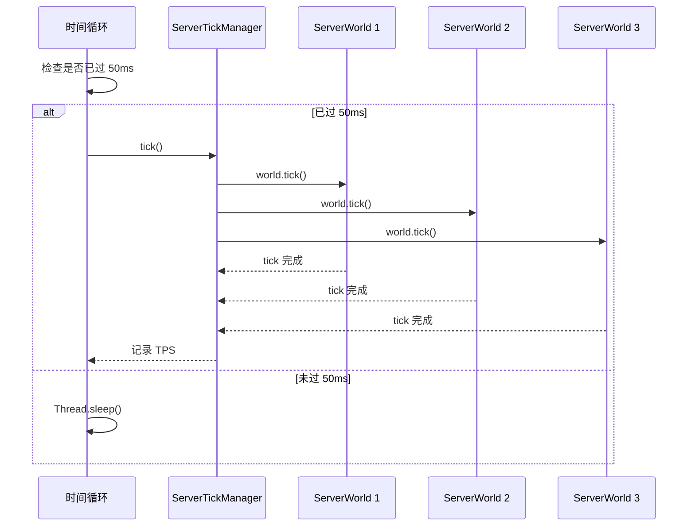
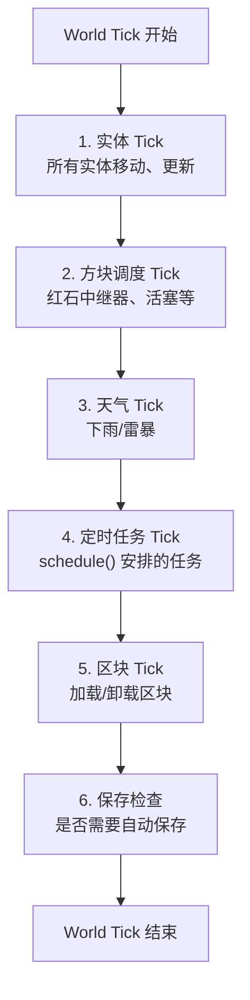
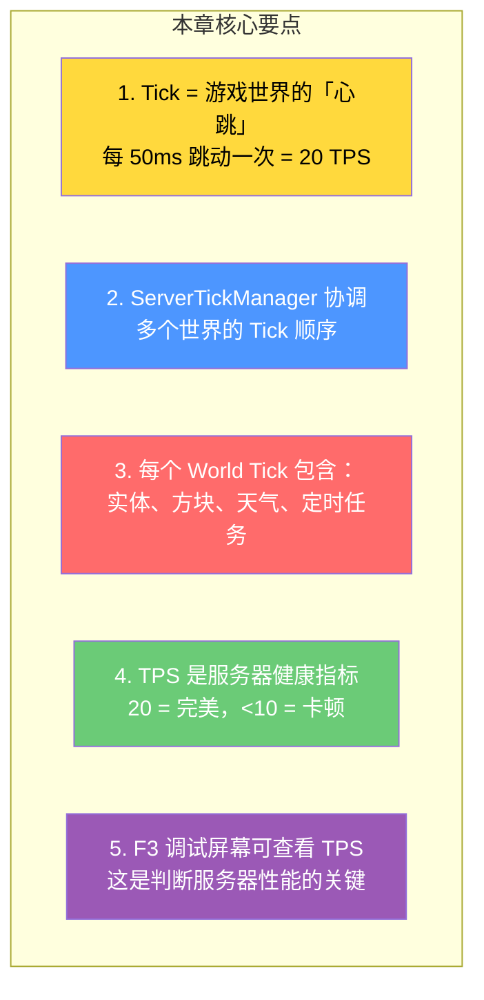

# 第 08 章：服务器 Tick 系统（Server Tick）

> **理解这章，你就理解了 Minecraft 的「心跳」—— 游戏世界每秒钟跳动 20 次！**

> ⚠️ **注意**：以下源码示例来源于 CFR 反编译代码，变量名和方法名可能与原始源码有所差异。部分代码经过简化以便于理解。

---

## 目标

学完本章后，你将理解：

1. **什么是 Tick**，以及它为什么是 20 TPS
2. **ServerTickManager** 如何协调多个世界的 Tick
3. **TPS**（Ticks Per Second）是什么，以及如何影响游戏体验
4. **服务端主循环** 的实现原理
5. **每个 Tick 发生了什么**（实体更新、方块调度、天气等）

---

## 前置知识

- 了解 Minecraft 的客户端-服务端架构（第 05 章）
- 知道什么是 `World`（世界）
- 了解多人游戏的基本概念

---

## 核心概念：什么是 Tick？

### 比喻：心跳

> 想象 Minecraft 的世界是一个活着的生物，而 **Tick 就是这个生物的心跳**。

```
现实世界:         Minecraft 世界:
─────────────     ─────────────
1 秒 = 1 次心跳   1 秒 = 20 次 Tick
每次心跳          每个 Tick
  - 心脏跳动        - 世界更新一步
  - 血液泵送        - 所有实体移动
                   - 方块检查更新
                   - 天气变化
```

### 数字速查

```
1 Tick  = 50 毫秒（0.05 秒）
1 秒    = 20 Tick
1 分钟  = 1200 Tick
1 游戏日 = 24000 Tick（20 分钟）
```

### TPS：服务器健康指标

**TPS（Ticks Per Second）** 是衡量服务器性能的核心指标：

| TPS | 状态 | 玩家体验 |
|-----|------|---------|
| 20 | 完美 | 如丝般顺滑 |
| 18-19 | 良好 | 轻微卡顿，可接受 |
| 15-17 | 一般 | 明显卡顿 |
| 10-14 | 差 | 严重卡顿 |
| < 10 | 极差 | 游戏几乎不可玩 |

```
💡 提示：当你按 F3 看到「20 TPS」时，服务器运行在最佳状态！
```

---

## 图解：Tick 系统核心架构



---

## 服务端主循环：run() 方法

### 核心源码

```java
// net/minecraft/server/MinecraftServer.java
public class MinecraftServer extends Thread {

    // Tick 时间数组（用于计算平均 Tick 时间）
    private final long[] tickTimes = new long[100];
    private int tickTimesIndex = 0;

    // 平均 Tick 时间（毫秒）
    private volatile float averageTickTime;

    // Tick 计数器
    private long serverTime;

    public void run() {
        this.lastTime = System.nanoTime();

        while (this.running) {
            long currentTime = System.nanoTime();
            long elapsedTime = currentTime - this.lastTime;

            // 如果距离上次 Tick 超超过 1 秒，重置计数器
            if (elapsedTime > 1_000_000_000L) {
                this.lastTime = currentTime;
                this.tickTimesIndex = 0;
            }

            // 目标 Tick 时间：50ms = 50,000,000 ns
            long targetTickTime = 50_000_000L;

            // 执行单个 Tick
            if (elapsedTime >= targetTickTime) {
                this.tick();           // 执行游戏逻辑
                this.lastTime = currentTime;

                // 记录 Tick 时间用于监控
                this.tickTimes[this.tickTimesIndex++ % 100] = elapsedTime;
                this.averageTickTime = this.calculateAverageTickTime();
            } else {
                // 休眠以节省 CPU
                try {
                    long sleepTime = (targetTickTime - elapsedTime) / 1_000_000L;
                    if (sleepTime > 0) {
                        Thread.sleep(sleepTime);
                    }
                } catch (InterruptedException e) {
                    Thread.currentThread().interrupt();
                }
            }
        }
    }

    private void tick() {
        this.serverTime++;  // 增加游戏时间
        this.tickManager.tick();
    }
}
```

### 流程图解



---

## World Tick：每个 Tick 世界发生什么

### ServerWorld.tick() 流程



### 每个 Tick 的具体内容

```
1. Entity Tick（实体更新）
   ├── 所有实体移动一步
   ├── 生物 AI 决策
   ├── 属性更新（生命值、饥饿值）
   └── 碰撞检测

2. Block Tick（方块调度）
   ├── 红石中继器延迟
   ├── 活塞伸出/缩回
   ├── 水流
   └── 熔岩扩散

3. Weather Tick（天气）
   ├── 降雨量增加/减少
   ├── 雷击检查
   └── 云层移动

4. Schedule Tick（定时任务）
   ├── 农作物生长检查
   ├── 冰融化
   └── 告示牌文字变化

5. Chunk Tick（区块管理）
   ├── 区块加载请求处理
   └── 未使用区块卸载
```

---

## TPS 计算与监控

### 源码中的 TPS 计算

```java
// 计算平均 Tick 时间
private float calculateAverageTickTime() {
    long total = 0;
    for (int i = 0; i < 100; i++) {
        total += tickTimes[i];
    }
    return total / 100f / 1_000_000f;  // 转换为毫秒
}

// TPS = 1000ms / 平均 Tick 时间
// 例如：平均 Tick 时间 = 55ms → TPS ≈ 18.2
```

### 如何查看 TPS

```
按 F3 打开调试屏幕，观察右上角：
┌─────────────────────────────┐
│ 20 ticks per second         │  ← TPS，20 是完美的
│ 59.9 avg: 57.9 ms          │  ← 平均 Tick 耗时
└─────────────────────────────┘
```

---

## 为什么是 20 TPS？

### 历史原因

```
Minecraft 诞生于 2009 年，当时的硬件性能有限。
20 TPS 是一个在「流畅度」和「性能消耗」之间的平衡点。

虽然现代硬件可以轻松运行更高的 TPS，
但保持 20 TPS 可以确保：
1. 所有客户端都能跟上（低配电脑）
2. 网络同步不会过载
3. 与旧版本兼容
```

### 1.14+ 的优化

```
从 1.14 开始，Minecraft 进行了大量 Tick 优化：

1. Chunk 调度优化 → 更智能的区块加载
2. Entity 调度优化 → 不活跃实体降低 Tick 频率
3. 区块排序优化 → 优先处理玩家附近的区块
4. 异步保存优化 → 保存操作在独立线程

结果：即使在 1.21，大型服务器也能稳定 20 TPS！
```

---

## 实战：找到 tick() 方法

### 练习：搜索源码

在源码中找到以下方法：

1. `MinecraftServer.java` - 找到 `run()` 方法，观察主循环结构
2. `ServerWorld.java` - 找到 `tick()` 方法，观察 World Tick 的内容
3. `ServerTickManager.java` - 找到 `tick()` 方法，观察多世界协调

### 观察模式

理解 `tickTimes` 数组的作用：

```java
// tickTimes 数组存储最近 100 次 Tick 的耗时
private final long[] tickTimes = new long[100];

// 每次 Tick 后记录耗时
this.tickTimes[this.tickTimesIndex++ % 100] = elapsedTime;

// 计算平均值用于监控
float avgTickTime = calculateAverageTickTime();

// TPS ≈ 1000 / avgTickTime
// 例如：avgTickTime = 50ms → TPS ≈ 20
```

---

## 小结



---

## 练习

### 练习 1：Tick 计算

如果一个服务器的平均 Tick 时间为 60ms，那么它的 TPS 大约是多少？

### 练习 2：识别 Tick 阶段

以下操作会在哪个 Tick 阶段发生？

- 玩家按 W 键移动 → ?
- 红石中继器延迟 → ?
- 农作物生长 → ?
- 天气变化 → ?

### 练习 3：查找源码

在源码中找到 `ServerWorld.tick()` 方法，列出它调用的所有子方法。

---

## 相关链接

| 文件 | 路径 | 作用 |
|------|------|------|
| `MinecraftServer.java` | `net/minecraft/server/MinecraftServer.java` | 服务端主循环 |
| `ServerWorld.java` | `net/minecraft/server/world/ServerWorld.java` | World Tick 实现 |
| `ServerTickManager.java` | `net/minecraft/server/world/ServerTickManager.java` | Tick 协调器 |

---

> 💡 **提示**：理解 Tick 系统对于理解游戏的所有「时间相关」机制至关重要。从实体移动到红石延迟，从天气变化到农作物生长，都离不开 Tick。

---

*文档版本：Minecraft 1.21, Protocol 767, World Version 3953*
*最后更新：2026-03-25*
