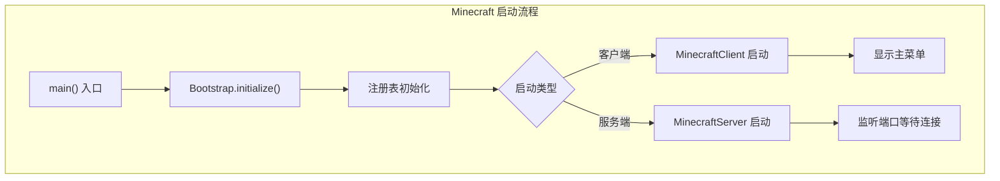
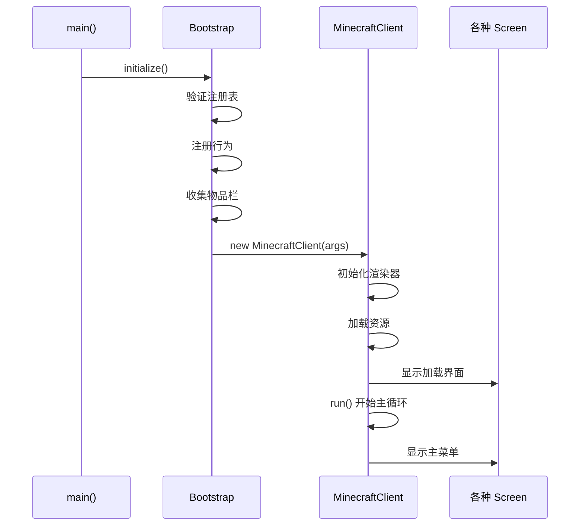
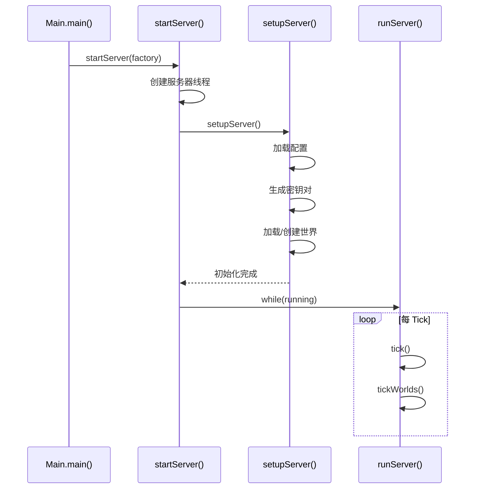
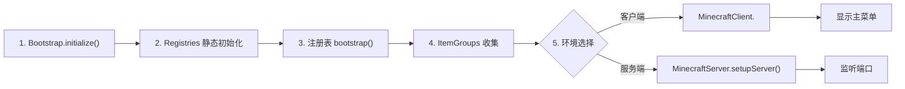

# 第 09 章：启动引导流程（Bootstrap Flow）

## 章节目标

学完本章后，你将能够：
- 理解 Minecraft 从启动到游戏就绪的完整流程
- 掌握 Bootstrap 初始化的作用
- 理解服务端和客户端的不同启动路径

## 前置知识

- 了解基本的 Java 程序入口点概念

## 核心概念

### 餐厅开业比喻

> **生活比喻**：Minecraft 启动就像开一家餐厅
>
> | 餐厅准备 | Minecraft 启动 | 说明 |
>|---------|----------------|------|
>| 打扫厨房 | `Bootstrap.initialize()` | 初始化基础组件 |
>| 准备食材 | `Registries` 初始化 | 加载物品/方块定义 |
>| 培训员工 | 命令系统注册 | 注册所有命令 |
>| 开门迎客 | 服务器启动 | 等待玩家连接 |



## 源码解析

### 1. Bootstrap 类 - 启动初始化

```java
// net/minecraft/Bootstrap.java
public class Bootstrap {
    
    private static boolean initialized;
    
    // 主要初始化方法
    public static void initialize() {
        if (initialized) {
            return;  // 防止重复初始化
        }
        initialized = true;
        
        Instant start = Instant.now();
        
        // 1. 验证注册表已加载
        if (Registries.REGISTRIES.getIds().isEmpty()) {
            throw new IllegalStateException("Unable to load registries");
        }
        
        // 2. 注册默认可燃方块
        FireBlock.registerDefaultFlammables();
        
        // 3. 注册堆肥可转化物品
        ComposterBlock.registerDefaultCompostableItems();
        
        // 4. 验证实体类型
        if (EntityType.getId(EntityType.PLAYER) == null) {
            throw new IllegalStateException("Failed loading EntityTypes");
        }
        
        // 5. 注册选择器选项
        EntitySelectorOptions.register();
        
        // 6. 注册投掷器行为
        DispenserBehavior.registerDefaults();
        
        // 7. 注册炼药锅行为
        CauldronBehavior.registerBehavior();
        
        // 8. 注册表后处理
        Registries.bootstrap();
        
        // 9. 收集创造模式物品栏
        ItemGroups.collect();
        
        // 10. 设置输出流
        setOutputStreams();
        
        LOAD_TIME.set(Duration.between(start, Instant.now()).toMillis());
    }
}
```

### 2. 客户端启动流程



### MinecraftClient 构造

```java
// net/minecraft/client/MinecraftClient.java
public MinecraftClient(RunArgs args) {
    super("Client");
    instance = this;
    
    // 1. 基础配置
    this.runDirectory = args.directories.runDir;
    this.resourcePackDir = args.directories.resourcePackDir.toPath();
    this.networkProxy = args.network.netProxy;
    
    // 2. 认证服务
    this.authenticationService = new YggdrasilAuthenticationService(this.networkProxy);
    this.sessionService = this.authenticationService.createMinecraftSessionService();
    this.session = args.network.session;
    
    // 3. 窗口系统
    this.windowProvider = new WindowProvider(this);
    this.window = this.windowProvider.createWindow(...);
    this.mouse = new Mouse(this);
    this.keyboard = new Keyboard(this);
    
    // 4. 资源管理
    this.resourceManager = new ReloadableResourceManagerImpl(ResourceType.CLIENT_RESOURCES);
    this.textureManager = new TextureManager(this.resourceManager);
    this.fontManager = new FontManager(this.textureManager);
    
    // 5. 渲染系统
    this.bakedModelManager = new BakedModelManager(...);
    this.entityRenderDispatcher = new EntityRenderDispatcher(...);
    this.itemRenderer = new ItemRenderer(...);
    this.particleManager = new ParticleManager(...);
    this.gameRenderer = new GameRenderer(...);
    this.worldRenderer = new WorldRenderer(...);
    
    // 6. 加载资源
    SplashOverlay.init(this);
    this.setScreen(new MessageScreen(Text.translatable("gui.loadingMinecraft")));
    ResourceReload resourceReload = this.resourceManager.reload(...);
    this.setOverlay(new SplashOverlay(this, resourceReload, ...));
}
```

### 3. 服务端启动流程



### MinecraftServer 启动

```java
// net/minecraft/server/MinecraftServer.java
public static <S extends MinecraftServer> S startServer(
        Function<Thread, S> serverFactory) {
    
    AtomicReference<MinecraftServer> reference = new AtomicReference<>();
    
    Thread thread = new Thread(() -> {
        MinecraftServer server = reference.get();
        server.runServer();
    }, "Server thread");
    
    // 高优先级
    if (Runtime.getRuntime().availableProcessors() > 4) {
        thread.setPriority(8);
    }
    
    MinecraftServer server = serverFactory.apply(thread);
    reference.set(server);
    thread.start();
    
    return server;
}

// 主循环
protected void runServer() {
    try {
        if (this.setupServer()) {
            this.tickStartTimeNanos = Util.getMeasuringTimeNano();
            
            while (this.running) {
                long targetTickTime = tickManager.getNanosPerTick();  // 50ms
                
                this.tickStartTimeNanos += targetTickTime;
                this.profiler.push("tick");
                this.tick(shouldKeepTicking);
                this.profiler.swap("nextTickWait");
                
                // 等待下一个 Tick
                Thread.sleep(50);
            }
        }
    } catch (Throwable e) {
        // 崩溃处理
    } finally {
        this.stopped = true;
        this.shutdown();
    }
}
```

## 启动参数

### 客户端启动参数

```bash
# 启动客户端示例
java -jar minecraft.jar

# 带配置启动
java -jar minecraft.jar --version 1.21 --gameDir ./game

# 开发环境
java -cp minecraft.jar net.minecraft.client.main.Main \
    --accessToken dummy \
    --version 1.21 \
    --gameDir . \
    --assetsDir ./assets
```

### 服务端启动参数

```bash
# 基本启动
java -jar server.jar nogui

# 带配置启动
java -Xmx4G -Xms2G -jar server.jar nogui --world world_name

# 配置文件位置
# server.properties - 服务器配置
# ops.json - OP 列表
# whitelist.json - 白名单
```

## 关键初始化顺序



## 常见启动问题

### 问题 1: 注册表未加载

```
Error: Unable to load registries
```

**原因**: 在 Bootstrap 之前尝试访问注册表
**解决**: 确保所有注册代码在正确的初始化阶段执行

### 问题 2: 资源包加载失败

```
Error: Couldn't load resource pack
```

**解决**: 检查资源包格式和版本兼容性

### 问题 3: 服务端端口被占用

```
Error: Unable to access address
```

**解决**: 更换端口或关闭占用程序

## 课后自查

1. Bootstrap.initialize() 的作用是什么？
2. 客户端和服务端的启动流程有什么不同？
3. 服务端的主循环是如何控制 Tick 的？
4. 为什么 Bootstrap 有 `initialized` 标志？
5. 资源加载在客户端启动的哪个阶段完成？

## 参考文件

| 文件 | 描述 |
|------|------|
| `net/minecraft/Bootstrap.java` | 启动初始化类 |
| `net/minecraft/client/MinecraftClient.java` | 客户端主类 |
| `net/minecraft/server/MinecraftServer.java` | 服务端主类 |
| `net/minecraft/registry/Registries.java` | 注册表容器 |

## 下一步

你已经完成了 Part-1 核心基础的学习！接下来可以学习：
- [Part-2 世界系统](../Part-2-World/08-world-system.md)
- [Part-3 实体系统](../Part-3-Entity/12-entity-system.md)
