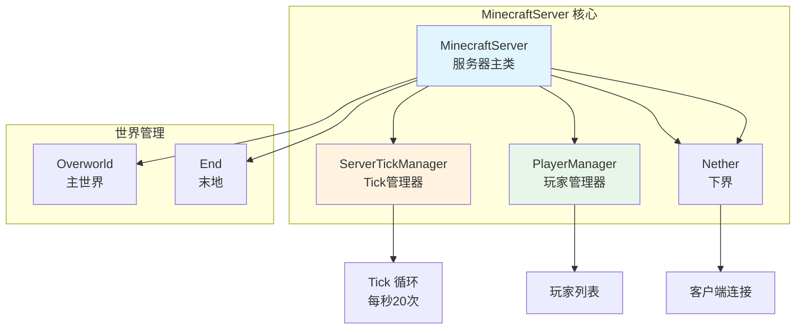
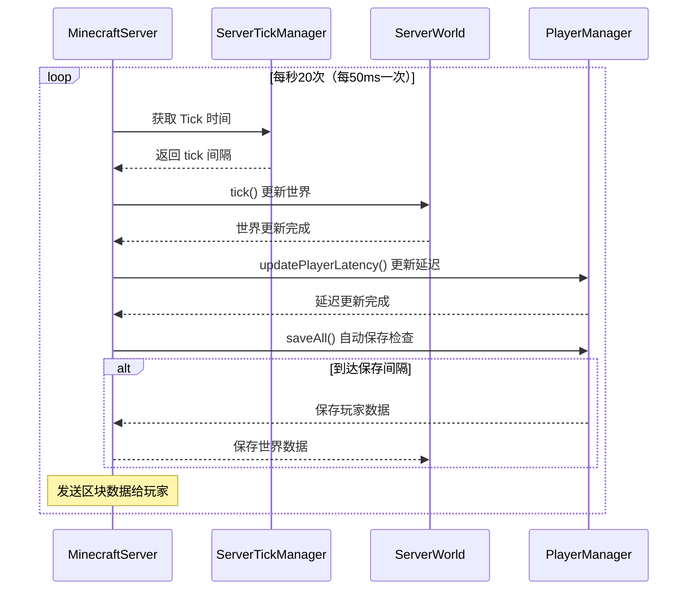

# 第四十九章：Minecraft 服务器核心 - MinecraftServer

## 目标

- 理解 MinecraftServer 是什么
- 了解服务器 Tick 循环的运作方式
- 认识世界管理的基本概念
- 区分服务器端和客户端的职责

## 前置知识

- 理解 Minecraft 的客户端-服务器架构
- 了解什么是 Tick（游戏刻）
- 知道世界是什么（主世界、下界、末地）

## 核心概念

### MinecraftServer 是什么？

想象一下 Minecraft 服务器就像一个**餐厅**：

- **餐厅经理（MinecraftServer）**：负责整个餐厅的运营
- **服务员（PlayerManager）**：管理顾客（玩家）的接待和服务
- **厨房（ServerWorld）**：准备食物（生成方块、生物等）
- **仓库（存档系统）**：存储食材（世界数据）

`MinecraftServer` 是服务端的核心类，它：
- 管理所有世界的运行
- 处理玩家的连接和断开
- 控制游戏 Tick 的节奏
- 保存和加载世界数据

```java
// 源码位置：net/minecraft/server/MinecraftServer.java
public abstract class MinecraftServer
extends ReentrantThreadExecutor<ServerTask>
implements QueryableServer, ChunkErrorHandler, CommandOutput, AutoCloseable {
    
    // 核心组件
    private final Map<RegistryKey<World>, ServerWorld> worlds;  // 所有世界
    private PlayerManager playerManager;  // 玩家管理器
    private final ServerTickManager tickManager;  // Tick 管理器
    private final ServerNetworkIo networkIo;  // 网络通信
    
    // 运行状态
    private volatile boolean running = true;  // 服务器是否运行
    private int ticks;  // 当前 Tick 数
}
```

### 核心组件详解

| 组件 | 作用 | 类比 |
|------|------|------|
| `worlds` | 管理主世界、下界、末地等所有维度 | 餐厅的多个厨房 |
| `playerManager` | 管理所有在线玩家 | 服务员团队 |
| `tickManager` | 控制 Tick 节奏 | 餐厅的时钟 |
| `networkIo` | 处理网络连接 | 餐厅的门迎 |

## 图解（Mermaid）

### 服务器架构图



### Tick 循环流程图



## 核心代码

### 服务器启动

```java
// MinecraftServer.java - 服务器主循环
protected void runServer() {
    if (this.setupServer()) {  // 设置服务器
        this.tickStartTimeNanos = Util.getMeasuringTimeNano();
        
        while (this.running) {  // 服务器运行主循环
            // 计算 Tick 间隔
            long l = this.tickManager.getNanosPerTick();
            
            // 执行 Tick
            this.tick(shouldKeepTicking);
            
            // 等待下一个 Tick
            this.runTasksTillTickEnd();
        }
    }
}
```

### Tick 方法核心

```java
public void tick(BooleanSupplier shouldKeepTicking) {
    ++this.ticks;  // Tick 数加1
    
    this.tickManager.step();  // Tick 管理器步进
    this.tickWorlds(shouldKeepTicking);  // 更新所有世界
    
    // 自动保存逻辑
    --this.ticksUntilAutosave;
    if (this.ticksUntilAutosave <= 0) {
        this.ticksUntilAutosave = this.getAutosaveInterval();
        this.saveAll(true, false, false);  // 保存世界
    }
}
```

### 世界管理

```java
// 获取主世界
public final ServerWorld getOverworld() {
    return this.worlds.get(World.OVERWORLD);
}

// 获取指定世界
@Nullable
public ServerWorld getWorld(RegistryKey<World> key) {
    return this.worlds.get(key);
}

// 获取所有世界
public Iterable<ServerWorld> getWorlds() {
    return this.worlds.values();
}
```

## 实战演示

### 场景：服务器 Tick 循环如何工作

想象你开了一家 Minecraft 餐厅：

```
🍽️ Tick 1（0秒）          🍽️ Tick 2（0.05秒）        🍽️ Tick 3（0.1秒）
┌─────────────────┐       ┌─────────────────┐       ┌─────────────────┐
│ 1. 玩家移动     │       │ 1. 怪物AI更新    │       │ 1. 红石更新     │
│ 2. 区块加载检查 │  ──▶  │ 2. 农作物生长   │  ──▶  │ 2. 实体移动     │
│ 3. 命令执行     │       │ 3. 天气更新     │       │ 3. 村民交易     │
│ 4. 发送数据     │       │ 4. 刷怪笼工作   │       │ 4. 发送数据     │
└─────────────────┘       └─────────────────┘       └─────────────────┘
```

每 300 个 Tick（15秒）触发一次自动保存！

## 和 MinecraftClient 的区别

| 特性 | MinecraftServer | MinecraftClient |
|------|-----------------|-----------------|
| **运行环境** | 服务端（无 GUI） | 客户端（有 GUI） |
| **Tick 循环** | 服务端独立控制 | 客户端跟随服务端 |
| **世界数据** | 完整保存到磁盘 | 只显示服务端发来的 |
| **玩家** | 管理多个玩家 | 只是一个玩家 |
| **实体处理** | 计算所有实体行为 | 只渲染附近的实体 |

```java
// 客户端和服务端的Tick差异

// 客户端 Tick（MinecraftClient.java）
@Override
public void tick() {
    if (this.isPaused()) return;  // 暂停时不更新
    super.tick();
}

// 服务端 Tick（MinecraftServer.java）
@Override
public void tick(BooleanSupplier shouldKeepTicking) {
    ++this.ticks;  // 始终递增
    this.tickWorlds(shouldKeepTicking);  // 始终更新世界
}
```

## 小结

1. **MinecraftServer 是服务端核心**：管理所有世界、玩家、网络通信
2. **Tick 循环每秒 20 次**：每 50ms 执行一次完整的游戏逻辑更新
3. **世界由 ServerWorld 表示**：主世界、下界、末地都是独立的 ServerWorld
4. **服务端负责所有计算**：客户端只负责显示，服务端决定一切

## 练习

1. **思考题**：如果服务器 Tick 卡顿超过 5 秒，会发生什么？
2. **找一找**：在源码中找到 `runServer()` 方法，理解它如何启动服务器循环
3. **实践**：阅读 `tickWorlds()` 方法，了解它如何遍历所有世界

## 相关链接

- [Part-11 网络通信](./Part-11-Network/) - 了解玩家如何连接服务器
- [Part-12 世界生成](./Part-12-WorldGen/) - 了解 ServerWorld 如何生成地形
- 源码：`net/minecraft/server/MinecraftServer.java`

---

### 源码文件位置

| 文件 | 源码路径 | 说明 |
|------|----------|------|
| MinecraftServer.java | `net/minecraft/server/MinecraftServer.java` | 服务器主类 |
| TickScheduler.java | `net/minecraft/server/TickScheduler.java` | Tick 调度器 |
| WorldGenerationProgressListener.java | `net/minecraft/server/WorldGenerationProgressListener.java` | 世界生成进度监听器 |

---

**关键词**：MinecraftServer、Tick、ServerWorld、PlayerManager
