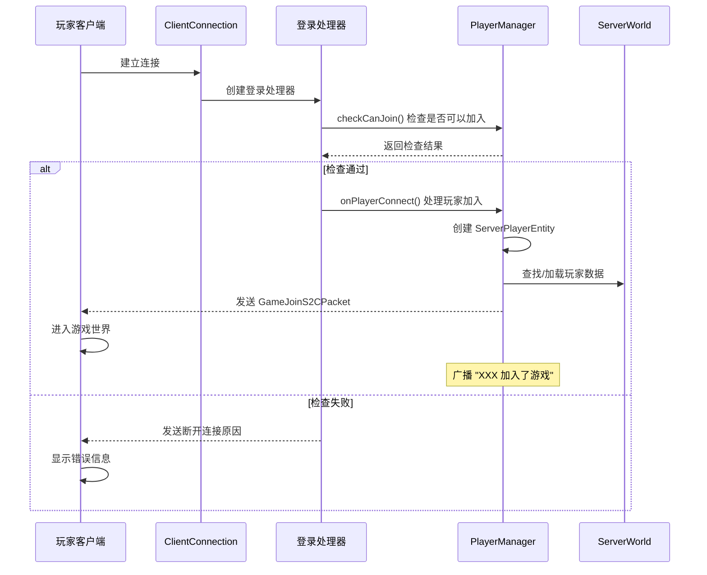
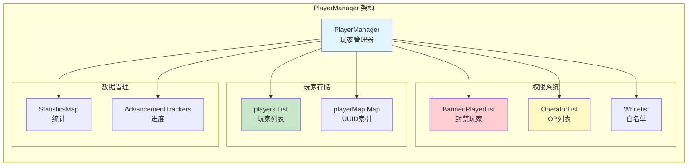

# 第五十章：玩家大管家 - PlayerManager

## 目标

- 理解 PlayerManager 是什么
- 掌握玩家登录流程
- 了解玩家列表的管理方式
- 认识玩家数据的同步机制

## 前置知识

- 理解 MinecraftServer 的基本架构（上一章）
- 了解什么是玩家实体（PlayerEntity）
- 知道网络连接的基本概念

## 核心概念

### PlayerManager 是什么？

想象 PlayerManager 是**酒店的前台**：

- **接待员（onPlayerConnect）**：办理入住（玩家连接）
- **房间管理（players 列表）**：管理所有入住的客人
- **会员系统（op/whitelist）**：管理权限和访问控制
- **行李寄存（PlayerData）**：保存玩家的背包、位置等信息

`PlayerManager` 负责：
- 管理所有在线玩家
- 处理玩家的加入和离开
- 保存和加载玩家数据
- 管理 OP、白名单、封禁列表

```java
// 源码位置：net/minecraft/server/PlayerManager.java
public abstract class PlayerManager {
    
    // 玩家存储
    private final List<ServerPlayerEntity> players;           // 所有玩家
    private final Map<UUID, ServerPlayerEntity> playerMap;   // UUID 索引
    
    // 权限管理
    private final BannedPlayerList bannedProfiles;            // 封禁玩家
    private final BannedIpList bannedIps;                    // 封禁IP
    private final OperatorList ops;                          // OP列表
    private final Whitelist whitelist;                        // 白名单
    
    // 数据存储
    private final Map<UUID, ServerStatHandler> statisticsMap;    // 统计
    private final Map<UUID, PlayerAdvancementTracker> advancementTrackers;  // 进度
}
```

## 图解（Mermaid）

### 玩家登录流程图



### PlayerManager 组件关系图



## 核心代码

### 玩家连接处理

```java
// PlayerManager.java - 玩家连接的核心方法
public void onPlayerConnect(ClientConnection connection, 
                            ServerPlayerEntity player, 
                            ConnectedClientData clientData) {
    
    // 1. 加载玩家数据
    NbtCompound nbtCompound;
    Optional<Object> optional = this.loadPlayerData(player);
    
    // 2. 确定出生世界
    RegistryKey<World> registryKey = optional.flatMap(...).orElse(World.OVERWORLD);
    ServerWorld serverWorld = this.server.getWorld(registryKey);
    player.setServerWorld(serverWorld);
    
    // 3. 创建网络处理器
    ServerPlayNetworkHandler serverPlayNetworkHandler = 
        new ServerPlayNetworkHandler(this.server, connection, player, clientData);
    
    // 4. 发送初始数据包
    serverPlayNetworkHandler.sendPacket(new GameJoinS2CPacket(...));
    serverPlayNetworkHandler.sendPacket(new DifficultyS2CPacket(...));
    serverPlayNetworkHandler.sendPacket(new PlayerAbilitiesS2CPacket(...));
    
    // 5. 发送玩家列表
    serverPlayNetworkHandler.sendPacket(PlayerListS2CPacket.entryFromPlayer(this.players));
    
    // 6. 添加到玩家列表
    this.players.add(player);
    this.playerMap.put(player.getUuid(), player);
    
    // 7. 广播加入消息
    this.broadcast(Text.translatable("multiplayer.player.joined", player.getDisplayName()), false);
}
```

### 玩家连接检查

```java
// 检查玩家是否可以加入
@Nullable
public Text checkCanJoin(SocketAddress address, GameProfile profile) {
    
    // 1. 检查是否被封禁
    if (this.bannedProfiles.contains(profile)) {
        BannedPlayerEntry entry = (BannedPlayerEntry)this.bannedProfiles.get(profile);
        return Text.translatable("multiplayer.disconnect.banned.reason", entry.getReason());
    }
    
    // 2. 检查白名单
    if (!this.isWhitelisted(profile)) {
        return Text.translatable("multiplayer.disconnect.not_whitelisted");
    }
    
    // 3. 检查IP封禁
    if (this.bannedIps.isBanned(address)) {
        return Text.translatable("multiplayer.disconnect.banned_ip.reason", ...);
    }
    
    // 4. 检查服务器是否满员
    if (this.players.size() >= this.maxPlayers && !this.canBypassPlayerLimit(profile)) {
        return Text.translatable("multiplayer.disconnect.server_full");
    }
    
    return null;  // null = 可以加入
}
```

### 玩家离开处理

```java
// 移除玩家
public void remove(ServerPlayerEntity player) {
    // 1. 保存玩家数据
    this.savePlayerData(player);
    
    // 2. 处理载具（如果玩家在船上或矿车里）
    if (player.hasVehicle() && (entity2 = player.getRootVehicle()).hasPlayerRider()) {
        player.stopRiding();
        entity2.streamPassengersAndSelf().forEach(Entity::discard);
    }
    
    // 3. 从世界移除玩家
    serverWorld.removePlayer(player, Entity.RemovalReason.UNLOADED_WITH_PLAYER);
    
    // 4. 从列表移除
    this.players.remove(player);
    this.playerMap.remove(player.getUuid());
    
    // 5. 广播离开消息
    this.sendToAll(new PlayerRemoveS2CPacket(List.of(player.getUuid())));
}
```

### 玩家数据保存

```java
// 保存玩家数据
protected void savePlayerData(ServerPlayerEntity player) {
    // 保存到磁盘
    this.saveHandler.savePlayerData(player);
    
    // 保存统计
    ServerStatHandler statHandler = this.statisticsMap.get(player.getUuid());
    if (statHandler != null) {
        statHandler.save();
    }
    
    // 保存进度
    PlayerAdvancementTracker tracker = this.advancementTrackers.get(player.getUuid());
    if (tracker != null) {
        tracker.save();
    }
}
```

## 实战演示

### 场景：玩家完整登录过程

```
🎮 玩家点击"加入服务器"后的流程：

1️⃣ 连接建立（Tick 0）
   └─> ClientConnection 创建网络连接
   └─> ServerLoginNetworkHandler 处理登录

2️⃣ 身份验证（Tick 1-5）
   └─> 检查服务器是否在线模式
   └─> 在线模式：验证微软账户
   └─> 离线模式：允许任何名字

3️⃣ 权限检查（Tick 6）
   └─> checkCanJoin() 返回 null？
       ├─ 是 → 继续登录
       └─ 否 → 断开连接

4️⃣ 世界初始化（Tick 7-10）
   └─> 创建 ServerPlayerEntity
   └─> 加载玩家背包、位置等数据
   └─> 确定出生世界

5️⃣ 进入游戏（Tick 11）
   └─> 发送 GameJoinS2CPacket
   └─> 发送区块数据
   └─> 广播加入消息

6️⃣ 游戏进行中
   └─> 每 Tick 更新位置、状态
   └─> 每 600 Tick 更新延迟显示
   └─> 定期保存数据
```

## 玩家数据存储位置

玩家的数据存储在 `world/playerdata/` 目录下：

```
📁 世界目录/
├── 📁 playerdata/          # 玩家数据
│   ├── xxxxxxxx-xxxx-xxxx-xxxx-xxxxxxxxxxxx.dat  # UUID命名的文件
│   └── ...
├── 📁 stats/               # 统计信息
│   └── xxxxxxxx-xxxx-xxxx-xxxx-xxxxxxxxxxxx.json
├── 📁 advancements/         # 进度成就
│   └── xxxxxxxx-xxxx-xxxx-xxxx-xxxxxxxxxxxx.json
└── 📁 raids/               # 袭击数据
```

## 小结

1. **PlayerManager 是玩家大管家**：管理所有玩家的加入、离开、数据
2. **登录流程严格**：先检查权限，再加载数据，最后进入世界
3. **玩家数据持久化**：玩家的背包、位置、进度都会保存
4. **权限管理完整**：支持 OP、白名单、封禁列表

## 练习

1. **思考题**：如果玩家在游戏中突然断线，PlayerManager 如何处理？
2. **找一找**：阅读 `respawnPlayer()` 方法，了解玩家如何重生
3. **实践**：查看 `broadcast()` 方法，理解聊天消息如何广播给所有玩家

## 相关链接

- [Part-11 网络通信](./Part-11-Network/) - 了解 ClientConnection 如何工作
- [Part-12 实体系统](./Part-12-Entity/) - 了解 ServerPlayerEntity
- 源码：`net/minecraft/server/PlayerManager.java`
- 独立服务器：`net/minecraft/server/dedicated/DedicatedPlayerManager.java`
- 整合服务器：`net/minecraft/server/integrated/IntegratedPlayerManager.java`

---

### 源码文件位置

| 文件 | 源码路径 | 说明 |
|------|----------|------|
| PlayerManager.java | `net/minecraft/server/PlayerManager.java` | 玩家管理器基类 |
| ServerPlayerEntity.java | `net/minecraft/server/network/ServerPlayerEntity.java` | 服务端玩家实体 |
| PlayerList.java | `net/minecraft/server/PlayerList.java` | 玩家列表（1.20前使用） |

---

**关键词**：PlayerManager、ServerPlayerEntity、Login、Logout
