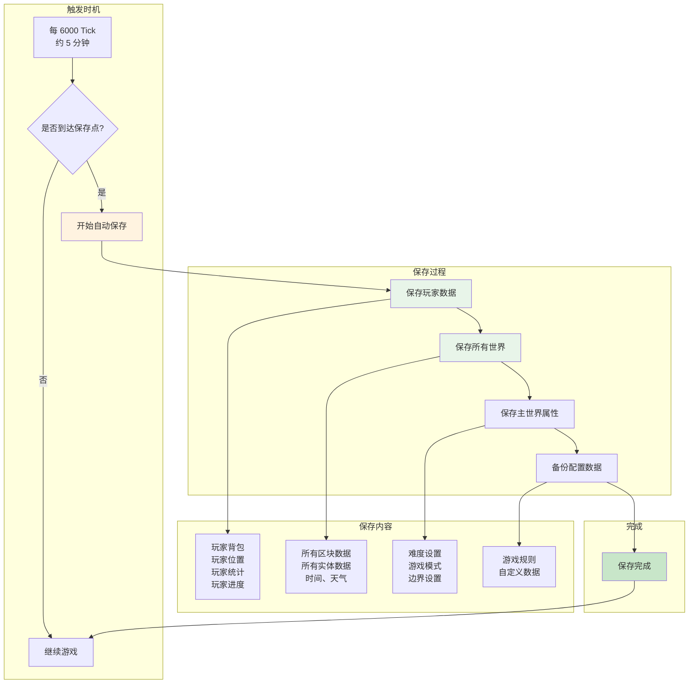
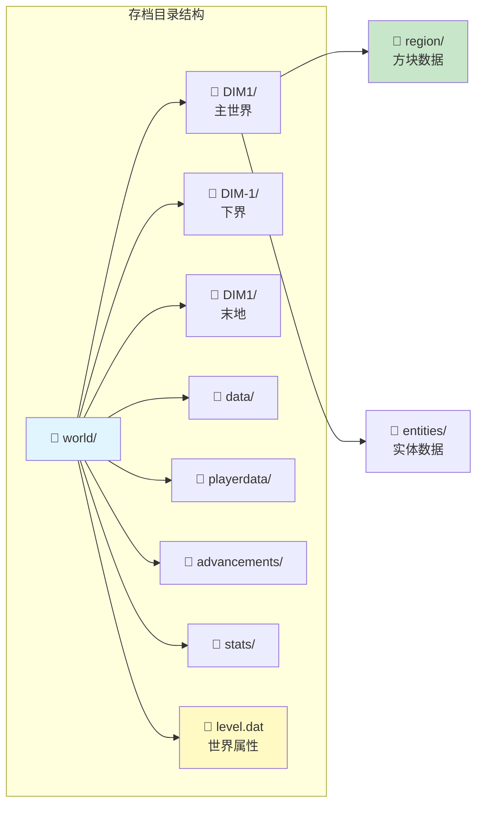

# 第五十一章：世界守护者 - 存档系统

## 目标

- 理解 Minecraft 存档系统的基本概念
- 掌握自动保存的触发机制
- 了解 Chunk（区块）保存的原理
- 认识玩家数据如何持久化

## 前置知识

- 理解 MinecraftServer 的基本架构
- 了解 PlayerManager 如何管理玩家
- 知道什么是世界（World）和区块（Chunk）

## 核心概念

### 存档系统是什么？

把 Minecraft 的存档系统想象成**图书馆的自动还书系统**：

- **书架（World）**：存放所有的"书"（方块数据）
- **借阅记录（PlayerData）**：记录谁借了什么（玩家的背包、位置）
- **自动还书机（Autosave）**：每 15 秒自动把所有"借阅记录"放回书架
- **图书馆员（LevelStorage）**：管理整个图书馆的运作

`MinecraftServer` 的存档系统负责：
- 保存世界的方块数据
- 保存玩家的背包、位置、进度
- 管理存档的加载和创建
- 处理世界转换

## 图解（Mermaid）

### 保存流程图



### 世界文件结构图



## 核心代码

### 服务器保存方法

```java
// MinecraftServer.java - 保存世界
public boolean save(boolean suppressLogs, boolean flush, boolean force) {
    boolean bl = false;
    
    // 1. 保存所有世界
    for (ServerWorld serverWorld : this.getWorlds()) {
        if (!suppressLogs) {
            LOGGER.info("Saving chunks for level '{}'/{}", 
                       serverWorld, serverWorld.getRegistryKey().getValue());
        }
        serverWorld.save(null, flush, serverWorld.savingDisabled && !force);
        bl = true;
    }
    
    // 2. 保存世界属性
    ServerWorld serverWorld2 = this.getOverworld();
    ServerWorldProperties properties = this.saveProperties.getMainWorldProperties();
    properties.setWorldBorder(serverWorld2.getWorldBorder().write());
    
    // 3. 保存自定义数据
    this.saveProperties.setCustomBossEvents(this.getBossBarManager().toNbt(...));
    
    // 4. 保存配置数据
    this.session.backupLevelDataFile(..., this.getPlayerManager().getUserData());
    
    return bl;
}

// 保存所有数据（包括玩家）
public boolean saveAll(boolean suppressLogs, boolean flush, boolean force) {
    try {
        this.saving = true;
        
        // 先保存所有玩家
        this.getPlayerManager().saveAllPlayerData();
        
        // 再保存世界
        boolean bl = this.save(suppressLogs, flush, force);
        return bl;
    } finally {
        this.saving = false;
    }
}
```

### 自动保存触发

```java
// MinecraftServer.java - Tick 中的自动保存
public void tick(BooleanSupplier shouldKeepTicking) {
    long l = Util.getMeasuringTimeNano();
    ++this.ticks;
    
    this.tickManager.step();
    this.tickWorlds(shouldKeepTicking);
    
    // 自动保存计数
    --this.ticksUntilAutosave;
    if (this.ticksUntilAutosave <= 0) {
        this.ticksUntilAutosave = this.getAutosaveInterval();
        
        LOGGER.debug("Autosave started");
        this.profiler.push("save");
        
        // 执行保存
        this.saveAll(true, false, false);
        
        this.profiler.pop();
        LOGGER.debug("Autosave finished");
    }
}

// 计算保存间隔
private int getAutosaveInterval() {
    float f;
    if (this.tickManager.isSprinting()) {
        // 服务器繁忙时减少保存频率
        long l = this.getAverageNanosPerTick() + 1L;
        f = (float)TimeHelper.SECOND_IN_NANOS / (float)l;
    } else {
        f = this.tickManager.getTickRate();
    }
    // 基础间隔 300 Tick（约 15 秒）
    return Math.max(100, (int)(f * 300.0f));
}
```

### 玩家数据保存

```java
// PlayerManager.java - 保存玩家数据
public void saveAllPlayerData() {
    for (int i = 0; i < this.players.size(); ++i) {
        this.savePlayerData(this.players.get(i));
    }
}

protected void savePlayerData(ServerPlayerEntity player) {
    // 通过 PlayerSaveHandler 保存到磁盘
    this.saveHandler.savePlayerData(player);
    
    // 保存统计
    ServerStatHandler statHandler = this.statisticsMap.get(player.getUuid());
    if (statHandler != null) {
        statHandler.save();
    }
    
    // 保存进度
    PlayerAdvancementTracker tracker = this.advancementTrackers.get(player.getUuid());
    if (tracker != null) {
        tracker.save();
    }
}
```

### 世界数据保存

```java
// ServerWorld.java - 保存世界
public void save(@Nullable Runnable callback, boolean flush, boolean savingDisabled) {
    if (savingDisabled) return;  // 如果禁用保存则跳过
    
    // 1. 保存区块数据
    this.chunkManager.save(flush);
    
    // 2. 保存实体数据
    this.saveEntityData();
    
    // 3. 保存时间等属性
    this.saveWorldState();
}
```

## 实战演示

### 场景：5分钟内的保存流程

```
⏱️ 时间轴（假设 Tick 正常）

Tick 0:        服务器启动，ticksUntilAutosave = 6000
Tick 1-5999:   正常游戏，ticksUntilAutosave 递减
               ├─ 每 Tick 减 1
               └─ 约 300 秒后到达 0

Tick 6000:     触发自动保存！
               ├─ 保存所有玩家数据
               ├─ 保存所有区块
               └─ 保存配置

Tick 6001:     ticksUntilAutosave 重置为 6000
               └─ 继续正常游戏

🔔 服务器日志示例：
[18:00:00] [Server thread/INFO]: Saving chunks for level 'minecraft:overworld'/minecraft:overworld
[18:00:01] [Server thread/INFO]: Saving chunks for level 'minecraft:the_nether'/minecraft:the_nether
[18:00:02] [Server thread/INFO]: Saving chunks for level 'minecraft:the_end'/minecraft:the_end
[18:00:03] [Server thread/INFO]: ThreadedAnvilChunkStorage: All dimensions are saved
```

### 手动保存命令

玩家可以使用 `/save-all` 命令手动保存：

```
/save-all     - 保存所有数据
/save-on      - 开启自动保存（默认开启）
/save-off     - 关闭自动保存（不推荐！）
```

## 区块（Chunk）保存详解

Minecraft 使用 **Anvil 格式**保存区块数据：

```
📁 DIM1/region/
├── r.0.0.mca    # 区域文件 (0,0) 到 (31,31)
├── r.0.1.mca    # 区域文件 (0,32) 到 (31,63)
├── r.1.0.mca    # 区域文件 (32,0) 到 (63,31)
└── ...

📄 .mca 文件结构：
┌─────────────────────────────────┐
│ Header (8 bytes per region)     │
│ ├─ Location[0]: x=0, z=0        │
│ ├─ Location[1]: x=0, z=1        │
│ └─ ...                          │
├─────────────────────────────────┤
│ Chunk Data (compressed NBT)     │
│ ├─ Chunk[0,0] - Zlib 压缩        │
│ ├─ Chunk[0,1] - Zlib 压缩        │
│ └─ ...                          │
└─────────────────────────────────┘
```

每个 Chunk 包含：
- 方块状态（16 x 256 x 16）
- 区块高度图
- 实体数据
- 方块实体数据
- 天空暗度

## 小结

1. **自动保存每 5 分钟一次**：每 6000 Tick 触发一次
2. **保存顺序很重要**：先玩家，再世界
3. **Chunk 使用 Anvil 格式**：高效压缩的区块存储
4. **玩家数据独立存储**：每个玩家一个文件（UUID命名）

## 练习

1. **思考题**：为什么玩家数据要先于世界数据保存？
2. **找一找**：阅读 `saveProperties` 的定义，了解它保存什么配置
3. **实践**：查看 `level.dat` 文件的结构

## 相关链接

- [Part-8 区块系统](./Part-8-Chunk/) - 了解 Chunk 的结构
- [Part-9 实体系统](./Part-9-Entity/) - 了解实体如何保存
- 源码：`net/minecraft/server/MinecraftServer.java` (save 相关方法)

---

### 源码文件位置

| 文件 | 源码路径 | 说明 |
|------|----------|------|
| WorldSaveHandler.java | `net/minecraft/server/WorldSaveHandler.java` | 世界存档处理器 |
| Session.java | `net/minecraft/server/Session.java` | 服务器会话管理 |
| PlayerData.java | `net/minecraft/server/PlayerData.java` | 玩家数据接口 |

---

**关键词**：WorldSaveHandler、Autosave、Chunk、Anvil
