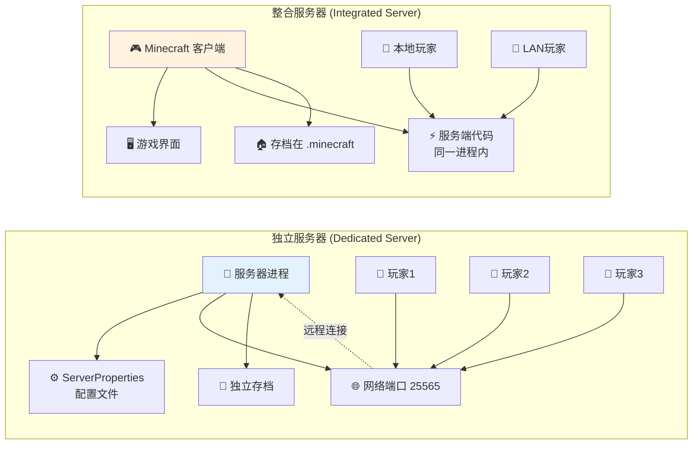
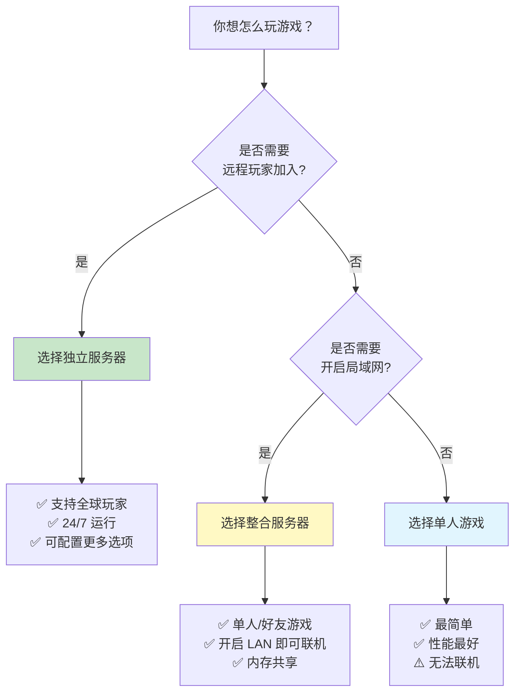

# 第五十二章：双生子 - 独立服务器与整合服务器

## 目标

- 理解独立服务器和整合服务器的区别
- 掌握两种服务器的优缺点
- 了解它们各自的适用场景
- 认识代码中如何区分这两种服务器

## 前置知识

- 理解 MinecraftServer 的基本架构
- 了解 MinecraftClient 客户端的工作方式
- 知道什么是本地局域网联机

## 核心概念

### 两种服务器的区别

想象两种餐厅模式：

**独立服务器 = 连锁餐厅**
- 独立的店面、独立的员工
- 可以服务来自四面八方的顾客（玩家）
- 需要专门的人来管理

**整合服务器 = 家庭厨房**
- 就在顾客家里
- 只有住在房子里的人能来
- 关闭房门（退出游戏）就结束了

```java
// 独立服务器
// 源码：net/minecraft/server/dedicated/MinecraftDedicatedServer.java
public class MinecraftDedicatedServer extends MinecraftServer {
    // 独立的配置文件
    private final ServerPropertiesLoader propertiesLoader;
    
    // 独立的命令行
    private final List<PendingServerCommand> commandQueue;
    
    @Override
    public boolean isDedicated() {
        return true;
    }
}

// 整合服务器
// 源码：net/minecraft/server/integrated/IntegratedServer.java
public class IntegratedServer extends MinecraftServer {
    // 关联到客户端
    private final MinecraftClient client;
    
    // 游戏暂停状态
    private boolean paused = true;
    
    @Override
    public boolean isDedicated() {
        return false;
    }
}
```

## 图解（Mermaid）

### 两种服务器架构对比



### 选择流程图



## 核心代码对比

### 初始化对比

```java
// ==================== 独立服务器 ====================
// MinecraftDedicatedServer.java

public boolean setupServer() throws IOException {
    // 1. 启动控制台输入线程
    Thread thread = new Thread("Server console handler") {
        @Override
        public void run() {
            BufferedReader reader = new BufferedReader(
                new InputStreamReader(System.in, StandardCharsets.UTF_8));
            while (!isStopped() && isRunning()) {
                String command = reader.readLine();
                enqueueCommand(command, getCommandSource());
            }
        }
    };
    thread.start();
    
    // 2. 加载配置文件
    ServerPropertiesHandler properties = this.propertiesLoader.getPropertiesHandler();
    
    // 3. 设置在线模式
    this.setOnlineMode(properties.onlineMode);
    
    // 4. 绑定网络端口
    this.getNetworkIo().bind(inetAddress, this.getServerPort());
    
    // 5. 加载玩家管理器
    this.setPlayerManager(new DedicatedPlayerManager(this, ...));
    
    // 6. 加载世界
    this.loadWorld();
    
    return true;
}
```

```java
// ==================== 整合服务器 ====================
// IntegratedServer.java

public boolean setupServer() {
    // 1. 简单设置（不需要控制台）
    
    // 2. 强制在线模式（验证本地玩家）
    this.setOnlineMode(true);
    this.setPvpEnabled(true);
    this.setFlightEnabled(true);
    
    // 3. 生成密钥
    this.generateKeyPair();
    
    // 4. 加载世界
    this.loadWorld();
    
    return true;
}
```

### Tick 循环对比

```java
// ==================== 独立服务器 Tick ====================
@Override
public void tick(BooleanSupplier shouldKeepTicking) {
    // 直接执行 Tick
    super.tick(shouldKeepTicking);
    
    // 执行控制台命令
    this.executeQueuedCommands();
}

// ==================== 整合服务器 Tick ====================
@Override
public void tick(BooleanSupplier shouldKeepTicking) {
    int j;
    boolean bl = this.paused;
    
    // 检查游戏是否暂停
    this.paused = MinecraftClient.getInstance().isPaused();
    
    // 暂停时保存并返回
    if (!bl && this.paused) {
        LOGGER.info("Saving and pausing game...");
        this.saveAll(false, false, false);
        return;
    }
    
    // 恢复时同步时间
    if (bl && !this.paused) {
        this.sendTimeUpdatePackets();
    }
    
    // 继续正常 Tick
    super.tick(shouldKeepTicking);
}
```

### PlayerManager 对比

```java
// ==================== 独立服务器 PlayerManager ====================
// DedicatedPlayerManager.java

public class DedicatedPlayerManager extends PlayerManager {
    public DedicatedPlayerManager(MinecraftDedicatedServer server, ...) {
        super(server, ..., server.getProperties().maxPlayers);
        
        // 加载权限配置
        this.loadUserBanList();      // 加载封禁列表
        this.saveUserBanList();
        this.loadIpBanList();
        this.loadOpList();
        this.loadWhitelist();        // 加载白名单
    }
    
    @Override
    public boolean isWhitelisted(GameProfile profile) {
        // 检查白名单
        return !this.isWhitelistEnabled() 
            || this.isOperator(profile) 
            || this.getWhitelist().isAllowed(profile);
    }
}
```

```java
// ==================== 整合服务器 PlayerManager ====================
// IntegratedPlayerManager.java

public class IntegratedPlayerManager extends PlayerManager {
    @Nullable
    private NbtCompound userData;  // 单人游戏玩家数据
    
    public IntegratedPlayerManager(IntegratedServer server, ...) {
        super(server, ..., 8);  // 最多 8 个玩家
        this.setViewDistance(10);
    }
    
    @Override
    protected void savePlayerData(ServerPlayerEntity player) {
        // 主机玩家的数据保存到 level.dat
        if (this.getServer().isHost(player.getGameProfile())) {
            this.userData = player.writeNbt(new NbtCompound());
        }
        super.savePlayerData(player);
    }
}
```

## 详细对比表

| 特性 | 独立服务器 | 整合服务器 |
|------|-----------|-----------|
| **运行环境** | 纯服务端，无 GUI | 客户端内嵌服务端 |
| **适用场景** | 多人服务器、租赁服 | 单人/局域网游戏 |
| **最大玩家数** | 可配置（通常 20-100+） | 固定 8 人 |
| **在线模式** | 可配置开关 | 强制开启 |
| **暂停功能** | 无 | 有（单进程） |
| **控制台** | 有（命令行） | 无 |
| **OP 权限** | 配置文件管理 | 自动给主机 |
| **白名单** | 支持 | 不支持 |
| **封禁列表** | 支持 | 不支持 |
| **RCON** | 支持 | 不支持 |
| **资源占用** | 仅服务端 | 客户端+服务端 |

## LAN 联机原理

当你选择"对局域网开放"时发生了什么？

```java
// IntegratedServer.java - 开启 LAN
@Override
public boolean openToLan(@Nullable GameMode gameMode, boolean cheatsAllowed, int port) {
    try {
        // 1. 绑定网络端口
        this.getNetworkIo().bind(null, port);
        LOGGER.info("Started serving on {}", port);
        
        // 2. 记录 LAN 端口
        this.lanPort = port;
        
        // 3. 启动 LAN 发现服务
        this.lanPinger = new LanServerPinger(this.getServerMotd(), "" + port);
        this.lanPinger.start();
        
        // 4. 设置作弊权限
        this.getPlayerManager().setCheatsAllowed(cheatsAllowed);
        
        return true;
    } catch (IOException e) {
        return false;
    }
}
```

## 小结

1. **独立服务器是完整的服务端**：可以远程访问，支持完整的管理功能
2. **整合服务器是客户端附带的服务端**：只能本地或局域网访问
3. **选择依据**：需要远程联机选独立，仅仅是本地/局域网选整合
4. **代码层面**：通过 `isDedicated()` 方法区分两种服务器

## 练习

1. **思考题**：为什么整合服务器最多只能有 8 个玩家？
2. **找一找**：阅读 `openToLan()` 方法，理解 LAN 联机如何工作
3. **实践**：对比 `DedicatedPlayerManager` 和 `IntegratedPlayerManager` 的 `savePlayerData()` 方法

## 相关链接

- [Part-49 服务器核心](./49-server-intro.md) - MinecraftServer 的基本概念
- [Part-50 玩家管理](./50-player-manager.md) - PlayerManager 的详细实现
- 独立服务器源码：`net/minecraft/server/dedicated/MinecraftDedicatedServer.java`
- 整合服务器源码：`net/minecraft/server/integrated/IntegratedServer.java`

---

### 源码文件位置

| 文件 | 源码路径 | 说明 |
|------|----------|------|
| IntegratedServer.java | `net/minecraft/server/integrated/IntegratedServer.java` | 整合服务器（单人/局域网） |
| DedicatedServer.java | `net/minecraft/server/dedicated/MinecraftDedicatedServer.java` | 独立服务器（专用服务器） |
| MinecraftServer.java | `net/minecraft/server/MinecraftServer.java` | 服务器主类（共同基类） |

---

**关键词**：IntegratedServer、DedicatedServer、LAN、Singleplayer
