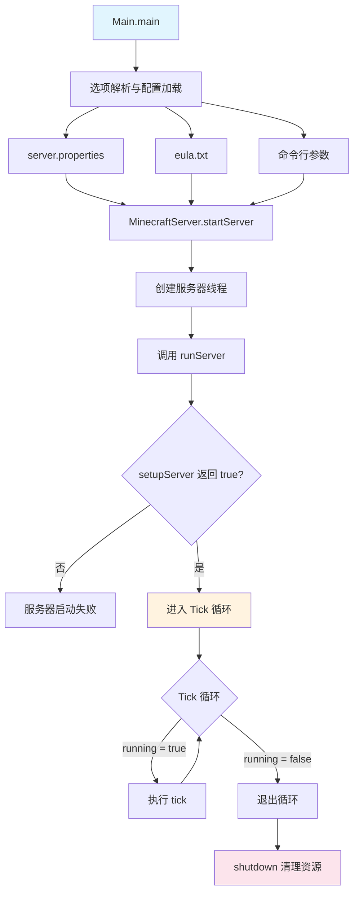
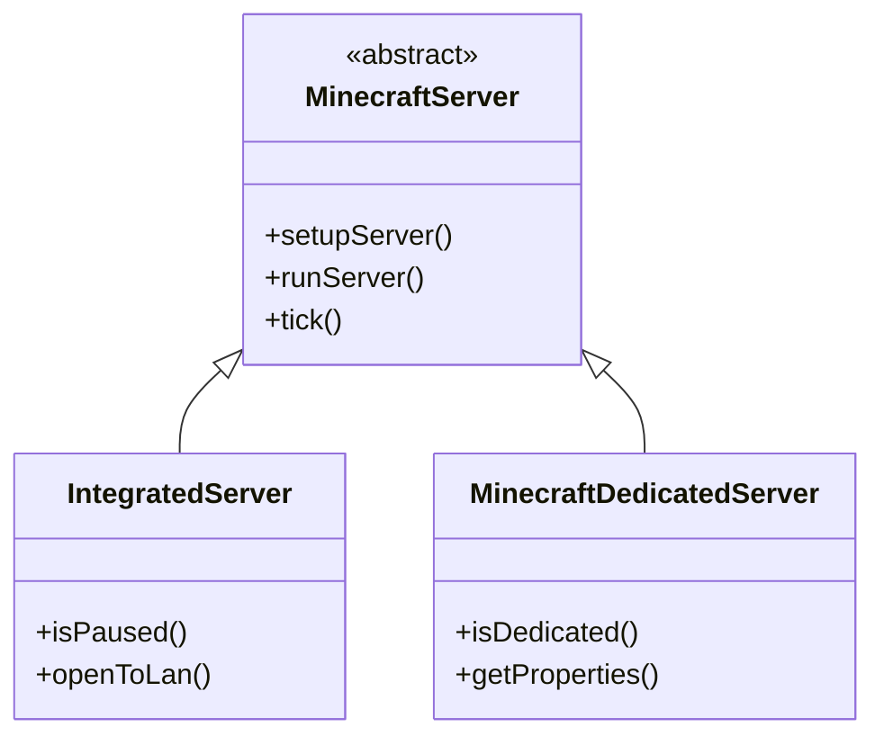

# 第 57 章：服务端入门（Dedicated Server Intro）

> 本章将带你深入了解 Minecraft 服务端的架构设计，理解服务器如何管理世界、处理玩家连接和维护游戏状态。

## 章节目标

- 理解服务端核心架构（`MinecraftServer`）
- 掌握服务端启动与关闭流程
- 了解整合服务器与独立服务器的区别
- 理解服务端如何协调多个世界

## 前置知识

- 熟悉 Minecraft 基本游戏概念（世界、玩家、实体）
- 了解 Java 基础语法和面向对象概念
- 知道什么是线程和线程池

## 核心概念

### 服务端 = 游戏世界的"图书馆管理员"

想象服务端是一个大型图书馆的管理员：

```
┌─────────────────────────────────────────────────────────────────┐
│                        Minecraft 服务端                            │
│                                                                     │
│    ┌───────────────┐   ┌───────────────┐   ┌───────────────┐    │
│    │   主世界      │   │    下界       │   │    末地       │    │
│    │  (Overworld) │   │  (Nether)   │   │   (The End)  │    │
│    └───────────────┘   └───────────────┘   └───────────────┘    │
│              │                  │                  │                │
│              └──────────────────┼──────────────────┘                │
│                                 │                                   │
│                    ┌────────────┴────────────┐                      │
│                    │     MinecraftServer     │                      │
│                    │      (图书馆管理员)      │                      │
│                    └────────────┬────────────┘                      │
│                                 │                                   │
│              ┌─────────────────┼─────────────────┐              │
│              ▼                 ▼                 ▼               │
│    ┌───────────────┐   ┌───────────────┐   ┌───────────────┐    │
│    │   玩家管理     │   │   网络连接     │   │   Tick 循环   │    │
│    │ (PlayerManager)│   │ (NetworkIo)  │   │  (ServerTick) │    │
│    └───────────────┘   └───────────────┘   └───────────────┘    │
│                                                                     │
└─────────────────────────────────────────────────────────────────┘
```

**关键比喻**：
- `MinecraftServer` = 图书馆管理员，负责协调一切
- `ServerWorld` = 图书馆中的不同楼层（主世界、下界、末地）
- `PlayerManager` = 借阅证办理处，管理读者的进出
- `ServerTickManager` = 时钟，每秒敲20下推进游戏时间

---

## 1. 服务端架构概述

### 1.1 核心类层次

```
net.minecraft.server
├── MinecraftServer.java          # 核心抽象基类
├── PlayerManager.java            # 玩家管理抽象类
├── ServerNetworkIo.java          # 网络I/O管理
├── ServerTickManager.java        # Tick管理器
├── Main.java                     # 独立服务器入口
│
├── dedicated/                    # 独立服务器模块
│   ├── MinecraftDedicatedServer.java
│   ├── DedicatedPlayerManager.java
│   ├── DedicatedServer.java
│   └── ServerPropertiesHandler.java
│
├── integrated/                   # 整合服务器模块(单人游戏)
│   ├── IntegratedServer.java
│   └── IntegratedPlayerManager.java
│
└── network/                      # 网络处理模块
    ├── ServerLoginNetworkHandler.java
    ├── ServerPlayNetworkHandler.java
    └── ServerHandshakeNetworkHandler.java
```

### 1.2 设计模式：模板方法

`MinecraftServer` 采用**模板方法模式**：

```java
// MinecraftServer.java:211-216
public abstract class MinecraftServer
extends ReentrantThreadExecutor<ServerTask>
implements QueryableServer, ChunkErrorHandler, CommandOutput, AutoCloseable
```

核心流程由抽象基类定义，子类实现具体细节：

```java
// MinecraftServer.java:359
protected abstract boolean setupServer() throws IOException;  // 子类实现

// MinecraftServer.java:661
protected void runServer() {
    if (this.setupServer()) {  // 调用子类实现
        while (this.running) {
            this.tick(...);      // 固定的Tick循环
        }
    }
}
```

---

## 2. 服务端启动流程

### 2.1 启动时序图



### 2.2 核心成员变量

```java
// MinecraftServer.java:235-306
public abstract class MinecraftServer {
    // 存储与会话
    protected final LevelStorage.Session session;
    protected final PlayerSaveHandler saveHandler;
    
    // 网络
    private final ServerNetworkIo networkIo;
    
    // 世界管理
    private final Map<RegistryKey<World>, ServerWorld> worlds;
    
    // 玩家管理
    private PlayerManager playerManager;
    
    // 配置状态
    private volatile boolean running = true;
    private int ticks;
    private int ticksUntilAutosave = 6000;  // 约5分钟
    
    // 性能监控
    private final long[] tickTimes = new long[100];
    private float averageTickTime;
    
    // Tick管理
    private final ServerTickManager tickManager;
    
    // 服务器线程
    private final Thread serverThread;
}
```

### 2.3 静态工厂方法

```java
// MinecraftServer.java:308-319
public static <S extends MinecraftServer> S startServer(Function<Thread, S> serverFactory) {
    AtomicReference<MinecraftServer> atomicReference = new AtomicReference<>();
    Thread thread = new Thread(() -> ((MinecraftServer)atomicReference.get()).runServer(), "Server thread");
    thread.setUncaughtExceptionHandler((thread, throwable) -> LOGGER.error("Uncaught exception", throwable));
    if (Runtime.getRuntime().availableProcessors() > 4) {
        thread.setPriority(8);  // 高优先级线程
    }
    MinecraftServer server = serverFactory.apply(thread);
    atomicReference.set(server);
    thread.start();
    return server;
}
```

**设计要点**：
- 使用 `AtomicReference` 解决线程初始化时序问题
- 服务器线程名称固定为 "Server thread"
- 多核系统上提升线程优先级到 8

---

## 3. 世界管理

### 3.1 世界创建

```java
// MinecraftServer.java:387-435
protected void createWorlds(WorldGenerationProgressListener listener) {
    ServerWorldProperties properties = saveProperties.getMainWorldProperties();
    boolean isDebugWorld = saveProperties.isDebugWorld();
    
    // 获取维度配置
    Registry<DimensionOptions> registry = combinedDynamicRegistries
        .getCombinedRegistryManager().get(RegistryKeys.DIMENSION);
    
    // 主世界特殊生成器
    DimensionOptions overworld = registry.get(DimensionOptions.OVERWORLD);
    ServerWorld mainWorld = new ServerWorld(
        this, workerExecutor, session, properties,
        World.OVERWORLD, overworld, listener, isDebugWorld,
        BiomeAccess.hashSeed(seed), specialSpawners, true, null);
    worlds.put(World.OVERWORLD, mainWorld);
    
    // 初始化计分板和数据命令存储
    initScoreboard(mainWorld.getPersistentStateManager());
    dataCommandStorage = new DataCommandStorage(persistentStateManager);
    
    // 创建其他维度世界(下界、末地)
    for (Entry<RegistryKey<DimensionOptions>, DimensionOptions> entry : registry.getEntrySet()) {
        if (entry.getKey() == DimensionOptions.OVERWORLD) continue;
        
        RegistryKey<World> worldKey = RegistryKey.of(RegistryKeys.WORLD, 
            entry.getKey().getValue());
        ServerWorld dimWorld = new ServerWorld(...);
        worlds.put(worldKey, dimWorld);
    }
}
```

### 3.2 出生点设置

```java
// MinecraftServer.java:437-471
private static void setupSpawn(ServerWorld world, ServerWorldProperties properties,
                               boolean bonusChest, boolean debugWorld) {
    if (debugWorld) {
        properties.setSpawnPos(BlockPos.ORIGIN.up(80), 0.0f);
        return;
    }
    
    // 找到最佳出生位置
    ChunkPos spawnChunk = new ChunkPos(
        world.getChunkManager().getNoiseConfig()
            .getMultiNoiseSampler().findBestSpawnPosition());
    
    // 螺旋搜索安全位置
    int j = 0, k = 0, l = 0, m = -1;
    for (int n = 0; n < MathHelper.square(11); ++n) {
        BlockPos testPos;
        if (j >= -5 && j <= 5 && k >= -5 && k <= 5 &&
            (testPos = SpawnLocating.findServerSpawnPoint(world, 
                new ChunkPos(spawnChunk.x + j, spawnChunk.z + k))) != null) {
            properties.setSpawnPos(testPos, 0.0f);
            break;
        }
        // 螺旋路径计算
        if (j == k || (j < 0 && j == -k) || (j > 0 && j == 1 - k)) {
            int temp = l; l = -m; m = temp;
        }
        j += l; k += m;
    }
}
```

---

## 4. 整合服务器 vs 独立服务器

### 4.1 类层次结构



### 4.2 整合服务器 (IntegratedServer)

```java
// IntegratedServer.java:46-67
@Environment(EnvType.CLIENT)
public class IntegratedServer extends MinecraftServer {
    private final MinecraftClient client;
    private boolean paused = true;      // 可暂停
    private int lanPort = -1;           // LAN端口
    
    @Override
    public boolean isPaused() {
        return this.paused;  // 客户端暂停时服务器也暂停
    }
    
    @Override
    public void tick(BooleanSupplier shouldKeepTicking) {
        boolean wasPaused = paused;
        paused = MinecraftClient.getInstance().isPaused();
        
        // 暂停时保存游戏
        if (!wasPaused && paused) {
            LOGGER.info("Saving and pausing game...");
            saveAll(false, false, false);
            return;
        }
        
        super.tick(shouldKeepTicking);
    }
}
```

### 4.3 独立服务器 (MinecraftDedicatedServer)

```java
// MinecraftDedicatedServer.java:72-206
public class MinecraftDedicatedServer extends MinecraftServer {
    private final List<PendingServerCommand> commandQueue = 
        Collections.synchronizedList(Lists.newArrayList());
    private final ServerPropertiesLoader propertiesLoader;
    
    @Override
    public boolean setupServer() throws IOException {
        // 启动控制台输入处理线程
        Thread consoleThread = new Thread("Server console handler") {
            @Override
            public void run() {
                BufferedReader reader = new BufferedReader(
                    new InputStreamReader(System.in, StandardCharsets.UTF_8));
                while (!isStopped() && isRunning()) {
                    String line = reader.readLine();
                    if (line != null) {
                        enqueueCommand(line, getCommandSource());
                    }
                }
            }
        };
        consoleThread.setDaemon(true);
        consoleThread.start();
        
        // 绑定网络
        InetAddress addr = serverIp.isEmpty() ? null : InetAddress.getByName(serverIp);
        getNetworkIo().bind(addr, serverPort);
        
        return true;
    }
}
```

### 4.4 关键差异对比

| 特性 | 整合服务器 | 独立服务器 |
|------|-----------|-----------|
| 运行环境 | 客户端内 | 独立JVM |
| 可暂停 | 是 (跟随游戏) | 否 |
| 控制台 | 无 | 有 (stdin) |
| 玩家上限 | 8 | 配置决定 |
| 出生点保护 | 无 | 有 (spawn-protection) |
| 白名单 | 无 | 有 |
| RCON | 无 | 有 |
| Watchdog | 无 | 有 |

---

## 5. 关闭流程

```java
// MinecraftServer.java:583-624
public void shutdown() {
    LOGGER.info("Stopping server");
    this.getNetworkIo().stop();        // 停止网络
    
    if (this.playerManager != null) {
        LOGGER.info("Saving players");
        this.playerManager.saveAllPlayerData();
        this.playerManager.disconnectAllPlayers();
    }
    
    LOGGER.info("Saving worlds");
    for (ServerWorld serverWorld : this.getWorlds()) {
        serverWorld.savingDisabled = false;
    }
    
    // 等待区块保存完成
    while (worlds.values().stream()
        .anyMatch(world -> world.getChunkManager().chunkLoadingManager.shouldDelayShutdown())) {
        for (ServerWorld world : worlds) {
            world.getChunkManager().removePersistentTickets();
            world.getChunkManager().tick(() -> true, false);
        }
        runTasksTillTickEnd();
    }
    
    this.save(false, true, false);    // 最终保存
    
    // 关闭所有世界
    for (ServerWorld serverWorld : this.getWorlds()) {
        serverWorld.close();
    }
    
    this.session.close();              // 关闭存储会话
}
```

---

## 6. 实战演示

### 6.1 获取服务端信息

```java
// 获取服务器线程
Thread serverThread = MinecraftServer.getServerThread();

// 获取当前Tick数
int currentTick = MinecraftServer.getServer().getTicks();

// 获取在线玩家数
int playerCount = MinecraftServer.getServer().getCurrentPlayerCount();

// 获取服务器运行时间（毫秒）
long uptime = MinecraftServer.getServer().getServerTime();

// 获取TPS和MSPT
double tps = MinecraftServer.getServer().getTickManager().getTicksPerSecond();
double mspt = MinecraftServer.getServer().getTickManager().getAverageTickTime();
```

### 6.2 执行服务器命令

```java
// 在服务端执行命令
MinecraftServer server = MinecraftServer.getServer();
server.getCommandManager().execute(
    server.getCommandSource(), 
    "say Hello from server!"
);

// 广播消息给所有玩家
server.getPlayerManager().broadcast(
    Text.literal("Server is starting..."),
    false  // false 表示普通消息，true 表示操作栏消息
);
```

### 6.3 遍历所有世界

```java
// 遍历所有维度
for (ServerWorld world : MinecraftServer.getServer().getWorlds()) {
    LOGGER.info("World: {} has {} chunks loaded", 
        world.getRegistryKey().getValue(),
        world.getChunkManager().getLoadedChunkCount());
}
```

---

## 7. 课后自查

- [ ] 能够解释 `MinecraftServer` 在服务端架构中的核心作用
- [ ] 理解服务端启动流程中的 `setupServer()` 和 `runServer()` 区别
- [ ] 掌握整合服务器和独立服务器的关键差异
- [ ] 能够描述服务端关闭时的资源清理顺序
- [ ] 理解为什么服务端需要独立线程

---

**参考源码路径**：

```
D:\Minecraft-Learning\assets\mc\1.21\net\minecraft\server\MinecraftServer.java
D:\Minecraft-Learning\assets\mc\1.21\net\minecraft\server\integrated\IntegratedServer.java
D:\Minecraft-Learning\assets\mc\1.21\net\minecraft\server\dedicated\MinecraftDedicatedServer.java
```
