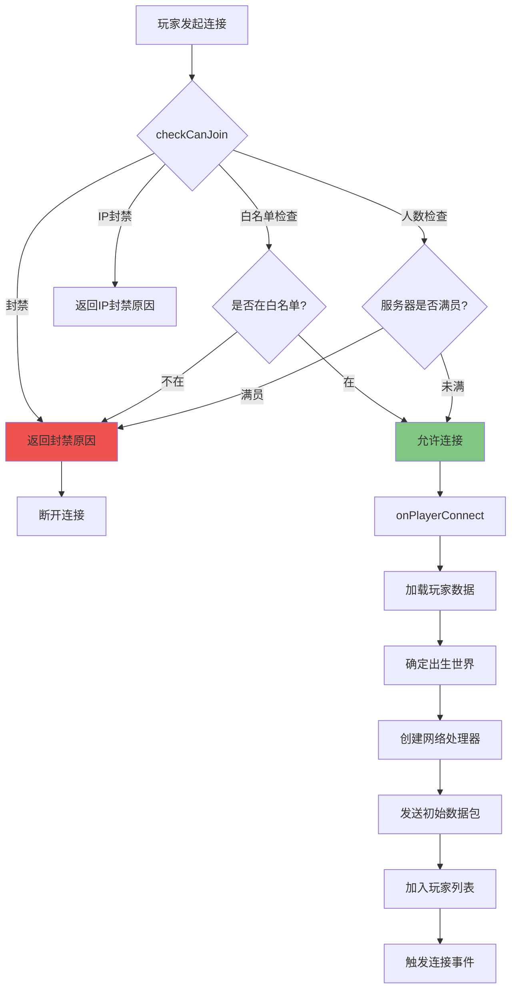
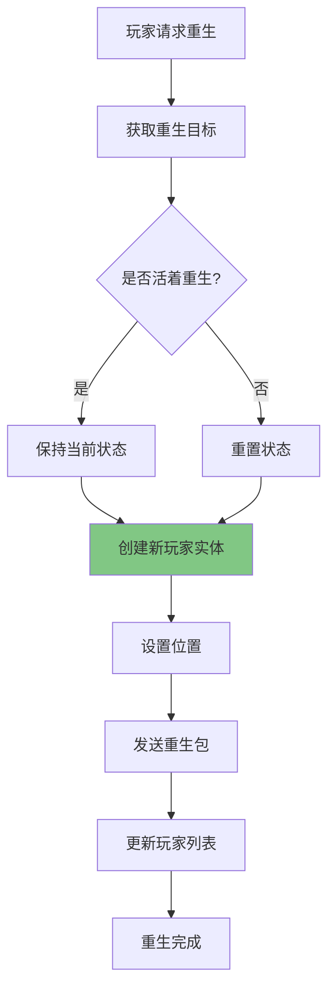

# 第 58 章：玩家管理（PlayerManager）

> 本章将深入解析 Minecraft 服务端如何管理玩家连接、处理登录流程、广播消息和维护玩家数据。

## 章节目标

- 理解 `PlayerManager` 的核心职责
- 掌握玩家登录验证流程
- 了解玩家数据保存机制
- 学会如何操作玩家列表和广播消息

## 前置知识

- 了解网络协议基础（TCP/IP 连接概念）
- 熟悉 Minecraft 玩家实体 `ServerPlayerEntity`
- 知道什么是 UUID 和 GameProfile

## 核心概念

### 玩家管理器 = 游戏大厅的"检票员"

想象 `PlayerManager` 是一个游戏大厅的检票员：

```
┌─────────────────────────────────────────────────────────────────┐
│                        PlayerManager                              │
│                      (游戏大厅检票员)                               │
│                                                                     │
│  ┌─────────────────────────────────────────────────────────────┐   │
│  │                     入场检查                               │   │
│  │  ┌───────────┐ ┌───────────┐ ┌───────────┐ ┌───────────┐ │   │
│  │  │ 封禁名单   │ │ 白名单    │ │ 人数限制   │ │ 版本检查   │ │   │
│  │  │ (Ban)    │ │ (Whitelist)│ │ (Max)    │ │ (Version)│ │   │
│  │  └───────────┘ └───────────┘ └───────────┘ └───────────┘ │   │
│  └─────────────────────────────────────────────────────────────┘   │
│                              │                                    │
│                              ▼                                    │
│  ┌─────────────────────────────────────────────────────────────┐   │
│  │                     数据加载                               │   │
│  │  ┌───────────┐ ┌───────────┐ ┌───────────┐               │   │
│  │  │ 玩家存档   │ │ 统计信息   │ │ 进度追踪   │               │   │
│  │  │ (PlayerData)│ │ (Stats) │ │ (Advancement)│             │   │
│  │  └───────────┘ └───────────┘ └───────────┘               │   │
│  └─────────────────────────────────────────────────────────────┘   │
│                              │                                    │
│                              ▼                                    │
│  ┌─────────────────────────────────────────────────────────────┐   │
│  │                     日常管理                               │   │
│  │  ┌───────────┐ ┌───────────┐ ┌───────────┐               │   │
│  │  │ 消息广播   │ │ 延迟同步   │ │ 重生处理   │               │   │
│  │  │ (Broadcast)│ │ (Latency)│ │ (Respawn)│               │   │
│  │  └───────────┘ └───────────┘ └───────────┘               │   │
│  └─────────────────────────────────────────────────────────────┘   │
│                                                                     │
└─────────────────────────────────────────────────────────────────┘
```

**关键比喻**：
- 封禁名单 = 门口的黑名单告示牌
- 白名单 = VIP名单
- 玩家数据 = 玩家入场时领取的会员卡
- 消息广播 = 大厅广播系统

---

## 1. PlayerManager 概述

### 1.1 核心职责

`PlayerManager` 是玩家管理的抽象基类，负责：

| 职责 | 说明 |
|------|------|
| 玩家列表管理 | 维护所有在线玩家的列表和映射 |
| 登录验证 | 检查玩家是否可以加入服务器 |
| 玩家数据 | 加载和保存玩家数据 |
| 权限管理 | OP、白名单、封禁列表 |
| 消息广播 | 向所有或特定玩家发送消息 |
| 统计追踪 | 管理玩家的统计数据和进度 |

### 1.2 核心数据结构

```java
// PlayerManager.java:119-146
public abstract class PlayerManager {
    private final MinecraftServer server;
    private final List<ServerPlayerEntity> players;          // 玩家列表
    private final Map<UUID, ServerPlayerEntity> playerMap;   // UUID索引
    
    // 访问控制
    private final BannedPlayerList bannedProfiles;           // 封禁玩家
    private final BannedIpList bannedIps;                    // 封禁IP
    private final OperatorList ops;                          // OP列表
    private final Whitelist whitelist;                       // 白名单
    
    // 玩家数据
    private final Map<UUID, ServerStatHandler> statisticsMap;
    private final Map<UUID, PlayerAdvancementTracker> advancementTrackers;
    
    // 配置
    private boolean whitelistEnabled;
    private int viewDistance;
    private int simulationDistance;
}
```

---

## 2. 玩家连接处理

### 2.1 连接流程图



### 2.2 玩家连接处理

```java
// PlayerManager.java:155-240
public void onPlayerConnect(ClientConnection connection, ServerPlayerEntity player, 
                           ConnectedClientData clientData) {
    GameProfile profile = player.getGameProfile();
    
    // 从UserCache获取/缓存玩家信息
    UserCache userCache = this.server.getUserCache();
    if (userCache != null) {
        String name = userCache.getByUuid(profile.getId())
            .map(GameProfile::getName).orElse(profile.getName());
        userCache.add(profile);
    }
    
    // 加载玩家数据
    Optional<NbtCompound> playerData = loadPlayerData(player);
    
    // 确定出生世界
    RegistryKey<World> respawnDim = playerData
        .flatMap(nbt -> DimensionType.worldFromDimensionNbt(...))
        .orElse(World.OVERWORLD);
    ServerWorld spawnWorld = server.getWorld(respawnDim) ?: server.getOverworld();
    player.setServerWorld(spawnWorld);
    
    // 创建网络处理器
    ServerPlayNetworkHandler handler = new ServerPlayNetworkHandler(
        server, connection, player, clientData);
    connection.transitionInbound(..., handler);
    
    // 发送初始数据包
    handler.sendPacket(new GameJoinS2CPacket(...));
    handler.sendPacket(new DifficultyS2CPacket(...));
    handler.sendPacket(new PlayerAbilitiesS2CPacket(...));
    handler.sendPacket(new SynchronizeRecipesS2CPacket(...));
    
    // 发送命令树
    sendCommandTree(player);
    
    // 发送记分板
    sendScoreboard(serverWorld.getScoreboard(), player);
    
    // 加入玩家列表
    this.players.add(player);
    this.playerMap.put(player.getUuid(), player);
    this.sendToAll(PlayerListS2CPacket.entryFromPlayer(List.of(player)));
    
    // 触发连接事件
    serverWorld.onPlayerConnected(player);
    bossBarManager.onPlayerConnect(player);
}
```

### 2.3 连接检查

```java
// PlayerManager.java:347-371
@Nullable
public Text checkCanJoin(SocketAddress address, GameProfile profile) {
    // 检查封禁玩家列表
    if (this.bannedProfiles.contains(profile)) {
        BannedPlayerEntry entry = bannedProfiles.get(profile);
        MutableText reason = Text.translatable("multiplayer.disconnect.banned.reason", 
            entry.getReason());
        if (entry.getExpiryDate() != null) {
            reason.append(Text.translatable("multiplayer.disconnect.banned.expiration", 
                DATE_FORMATTER.format(entry.getExpiryDate())));
        }
        return reason;
    }
    
    // 检查白名单
    if (!this.isWhitelisted(profile)) {
        return Text.translatable("multiplayer.disconnect.not_whitelisted");
    }
    
    // 检查封禁IP
    if (this.bannedIps.isBanned(address)) {
        return Text.translatable("multiplayer.disconnect.banned_ip.reason", ...);
    }
    
    // 检查服务器人数
    if (players.size() >= maxPlayers && !canBypassPlayerLimit(profile)) {
        return Text.translatable("multiplayer.disconnect.server_full");
    }
    
    return null;  // 允许加入
}
```

---

## 3. 玩家重生

### 3.1 重生流程



### 3.2 重生处理

```java
// PlayerManager.java:394-437
public ServerPlayerEntity respawnPlayer(ServerPlayerEntity player, boolean alive, 
                                       Entity.RemovalReason reason) {
    // 获取重生目标
    TeleportTarget target = player.getRespawnTarget(alive, TeleportTarget.NO_OP);
    ServerWorld targetWorld = target.world();
    
    // 创建新玩家实体
    ServerPlayerEntity newPlayer = new ServerPlayerEntity(
        server, targetWorld, player.getGameProfile(), player.getClientOptions());
    newPlayer.networkHandler = player.networkHandler;  // 复用网络连接
    newPlayer.copyFrom(player, alive);
    newPlayer.setId(player.getId());
    
    // 设置位置
    Vec3d pos = target.pos();
    newPlayer.refreshPositionAndAngles(pos.x, pos.y, pos.z, 
        target.yaw(), target.pitch());
    
    // 发送重生包
    newPlayer.networkHandler.sendPacket(new PlayerRespawnS2CPacket(
        newPlayer.createCommonPlayerSpawnInfo(targetWorld), 
        alive ? KEEP_ATTRIBUTES : 0));
    
    // 更新列表
    this.players.remove(player);
    this.players.add(newPlayer);
    this.playerMap.put(newPlayer.getUuid(), newPlayer);
    
    return newPlayer;
}
```

---

## 4. 消息广播

### 4.1 广播类型

```java
// PlayerManager.java:683-774

// 普通广播
public void broadcast(Text message, boolean overlay) {
    this.server.sendMessage(message);  // 发送到控制台
    for (ServerPlayerEntity player : this.players) {
        player.sendMessageToClient(message, overlay);
    }
}

// 聊天消息广播（带签名验证）
public void broadcast(SignedMessage message, ServerPlayerEntity sender, 
                      MessageType.Parameters params) {
    // 验证消息签名
    boolean secure = verify(message);
    this.server.logChatMessage(message.getContent(), params, secure ? null : "Not Secure");
    
    SentMessage sent = SentMessage.of(message);
    for (ServerPlayerEntity player : this.players) {
        boolean shouldFilter = shouldFilterMessagesSentTo.test(player);
        player.sendChatMessage(sent, shouldFilter, params);
    }
}
```

### 4.2 广播示例

```java
// 广播普通消息给所有玩家
playerManager.broadcast(Text.literal("服务器即将关闭！"), false);

// 广播聊天消息
SignedMessage signedMessage = SignedMessage.of(
    ChatMessageContent.of("Hello, everyone!"),
    SignedMessage.Root.of(UUID.randomUUID(), sender.getUuid(), time, salt, signature)
);
playerManager.broadcast(signedMessage, sender, MessageType.Parameters.of(
    MessageType.CHAT, sender.getWorld().getRegistryKey(), sender.getId()
));
```

---

## 5. 玩家数据管理

### 5.1 数据存储结构

```
playerdata/
├── <uuid1>.dat           # 玩家数据文件 (压缩的 NBT)
├── <uuid1>.dat_old       # 备份
├── <uuid2>.dat
└── ...
```

### 5.2 玩家数据内容

| 字段 | 类型 | 说明 |
|------|------|------|
| DataVersion | int | 数据版本 |
| PlayerUUID | string | 玩家 UUID |
| Pos | list | 位置坐标 |
| Motion | list | 速度向量 |
| Rotation | list | 视角旋转 |
| FallDistance | float | 掉落距离 |
| Fire | short | 燃烧时间 |
| Air | short | 空气时间 |
| OnGround | byte | 是否在地面上 |
| Dimension | int | 当前维度 |
| SpawnX/Y/Z | int | 设置的复活点 |
| inventory | list | 物品栏 |
| EnderItems | list | 末影箱物品 |
| abilities | compound | 玩家能力 |
|XpSeed | int | 经验种子 |
| Score | int | 分数 |
| recipeUsed | list | 使用的配方 |
| advancement | compound | 进度数据 |
| stats | compound | 统计数据 |

---

## 6. 延迟同步

### 6.1 延迟计算

```java
// PlayerManager.java - 每Tick更新
public void updatePlayerLatency() {
    for (ServerPlayerEntity player : this.players) {
        // 计算玩家延迟（Ping）
        int latency = player.networkHandler.getLatency();
        
        // 同步延迟信息给其他玩家
        if (latency != player.lastLatency) {
            player.lastLatency = latency;
            this.sendToAll(PlayerListS2CPacket.updateLatency(
                List.of(player), 
                latency
            ));
        }
    }
}
```

---

## 7. 实战演示

### 7.1 获取所有在线玩家

```java
// 获取玩家列表
List<ServerPlayerEntity> players = server.getPlayerManager().getPlayerList();

// 根据名称查找
@Nullable
ServerPlayerEntity player = server.getPlayerManager().getPlayerByName("Steve");

// 根据UUID查找
@Nullable
ServerPlayerEntity player = server.getPlayerManager().getPlayerByUuid(uuid);

// 遍历所有玩家
for (ServerPlayerEntity player : server.getPlayerManager().getPlayerList()) {
    player.sendMessage(Text.literal("Hello, " + player.getName().getString()));
}
```

### 7.2 踢出玩家

```java
// 踢出玩家
public void kickPlayer(ServerPlayerEntity player, Text reason) {
    player.networkHandler.disconnect(reason);
}

// 示例
ServerPlayerEntity player = server.getPlayerManager().getPlayerByName("Griefer");
if (player != null) {
    kickPlayer(player, Text.literal("违反服务器规则！"));
}
```

### 7.3 管理OP列表

```java
// 添加OP
server.getPlayerManager().addToOperators(player.getGameProfile());

// 移除OP
server.getPlayerManager().removeFromOperators(player.getGameProfile());

// 检查是否为OP
boolean isOp = server.getPlayerManager().isOperator(player.getGameProfile());
```

### 7.4 管理白名单

```java
// 启用白名单
server.getPlayerManager().setWhitelistEnabled(true);

// 添加玩家到白名单
server.getPlayerManager().addToWhitelist(player.getGameProfile());

// 从白名单移除
server.getPlayerManager().removeFromWhitelist(player.getGameProfile());
```

---

## 8. 课后自查

- [ ] 能够描述玩家登录验证的完整流程
- [ ] 理解 `checkCanJoin()` 方法的检查顺序
- [ ] 掌握玩家重生时数据如何传递
- [ ] 能够使用广播功能向所有玩家发送消息
- [ ] 理解玩家数据保存在哪里

---

**参考源码路径**：

```
D:\Minecraft-Learning\assets\mc\1.21\net\minecraft\server\PlayerManager.java
D:\Minecraft-Learning\assets\mc\1.21\net\minecraft\server\network\ServerPlayNetworkHandler.java
```
