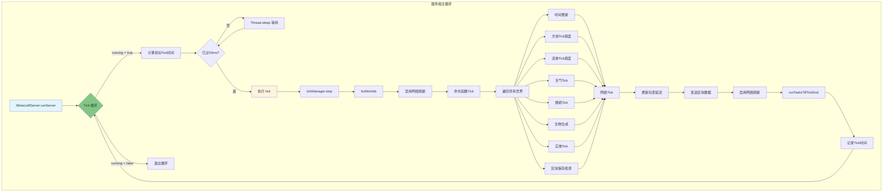
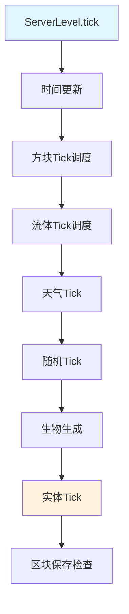
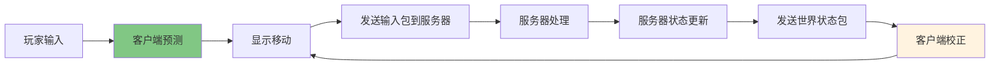

# 第 59 章：Tick系统（Tick Loop）

> 本章将深入解析 Minecraft 的 Tick 系统，理解游戏如何通过"心跳"机制推进世界状态。

## 章节目标

- 理解 Tick 的概念和重要性
- 掌握服务端 Tick 循环的完整流程
- 了解世界 Tick 的执行顺序
- 理解 TPS 和 MSPT 的含义

## 前置知识

- 熟悉 Java 多线程基础
- 了解 Minecraft 世界和实体的基本概念
- 知道什么是 TickScheduler

## 核心概念

### Tick = 游戏的"心跳"

想象 Tick 就像人类的心脏跳动：

```
┌─────────────────────────────────────────────────────────────────┐
│                        Tick 时间线                                │
├─────────────────────────────────────────────────────────────────┤
│                                                                     │
│  Tick 1 ──► Tick 2 ──► Tick 3 ──► ... ──► Tick N                │
│    │         │         │                   │                         │
│  0ms       50ms      100ms               5000ms                      │
│    │         │         │                   │                         │
│  心脏       心脏       心脏       ...       心脏                      │
│  跳动       跳动       跳动               跳动                      │
│                                                                     │
│  💓 每秒 20 次心跳 = 20 TPS (Ticks Per Second)                   │
│  ⏱️ 每次心跳耗时约 50ms = 50ms per tick                        │
│                                                                     │
└─────────────────────────────────────────────────────────────────┘
```

**关键比喻**：
- Tick = 心脏跳动，每跳一次，世界向前推进一点点
- TPS = 心率，健康的服务器心率是 20
- MSPT = 每次心跳耗时，越短越好
- TickScheduler = 预约医生，在指定时间执行任务

---

## 1. Tick 系统概述

### 1.1 为什么需要 Tick

Minecraft 是一个离散模拟游戏，世界状态不能连续变化。Tick 提供了一个稳定的时间基准：

```
┌─────────────────────────────────────────────────────────────────┐
│                        连续时间 vs 离散时间                           │
├─────────────────────────────────────────────────────────────────┤
│                                                                     │
│  连续时间:  0.1s → 0.2s → 0.3s → ... → 1.0s                   │
│              │       │       │              │                       │
│             实体   实体   实体            实体                      │
│             位置   位置   位置            位置                     │
│             连续   连续   连续            连续                     │
│             变化   变化   变化            变化                     │
│                                                                     │
│  离散时间:  Tick 1 → Tick 2 → Tick 3 → ... → Tick 20            │
│              │       │       │              │                       │
│             每50ms更新一次，状态跳跃式前进                          │
│                                                                     │
└─────────────────────────────────────────────────────────────────┘
```

### 1.2 TPS 指标

TPS（Ticks Per Second）是衡量服务器性能的核心指标：

| TPS 范围 | 状态 | 说明 |
|----------|------|------|
| 20 TPS | 完美 | 服务器运行在最佳状态 |
| 18-19 TPS | 良好 | 轻微卡顿，可接受 |
| 15-17 TPS | 一般 | 明显卡顿 |
| 10-14 TPS | 差 | 严重卡顿，经验惩罚 |
| < 10 TPS | 极差 | 游戏几乎不可玩 |

---

## 2. 服务端 Tick 循环

### 2.1 Tick 循环时序图



### 2.2 服务端 Tick 核心

```java
// MinecraftServer.java:887-914
public void tick(BooleanSupplier shouldKeepTicking) {
    long startTime = Util.getMeasuringTimeNano();
    ++this.ticks;  // Tick计数器
    
    this.tickManager.step();           // Tick管理器步进
    this.tickWorlds(shouldKeepTicking); // 更新所有世界
    
    // 定期更新服务器元数据
    if (startTime - lastPlayerSampleUpdate >= PLAYER_SAMPLE_UPDATE_INTERVAL_NANOS) {
        this.lastPlayerSampleUpdate = startTime;
        this.metadata = this.createMetadata();
    }
    
    // 自动保存
    --this.ticksUntilAutosave;
    if (this.ticksUntilAutosave <= 0) {
        this.ticksUntilAutosave = this.getAutosaveInterval();
        this.saveAll(true, false, false);
    }
    
    // 更新Tick时间统计
    long tickDuration = Util.getMeasuringTimeNano() - startTime;
    recentTickTimesNanos = recentTickTimesNanos - tickTimes[ticks % 100] + tickDuration;
    tickTimes[ticks % 100] = tickDuration;
    averageTickTime = averageTickTime * 0.8f + tickDuration * 0.2f;
}
```

### 2.3 世界 Tick

```java
// MinecraftServer.java:967-1007
public void tickWorlds(BooleanSupplier shouldKeepTicking) {
    // 禁用所有玩家的网络刷新
    getPlayerManager().getPlayerList().forEach(player -> 
        player.networkHandler.disableFlush());
    
    // 执行数据包函数
    profiler.push("commandFunctions");
    getCommandFunctionManager().tick();
    
    // Tick所有世界
    profiler.swap("levels");
    for (ServerWorld serverWorld : this.getWorlds()) {
        profiler.push(serverWorld.toString());
        
        // 每20tick同步一次时间
        if (ticks % 20 == 0) {
            sendTimeUpdatePackets(serverWorld);
        }
        
        // 世界Tick
        serverWorld.tick(shouldKeepTicking);
        profiler.pop();
    }
    
    // 处理网络连接
    profiler.swap("connection");
    getNetworkIo().tick();
    
    // 更新玩家延迟
    profiler.swap("players");
    playerManager.updatePlayerLatency();
    
    // 发送区块数据
    profiler.swap("send chunks");
    for (ServerPlayerEntity player : playerManager.getPlayerList()) {
        player.networkHandler.chunkDataSender.sendChunkBatches(player);
        player.networkHandler.enableFlush();
    }
}
```

---

## 3. 世界 Tick 详解

### 3.1 ServerLevel Tick 执行顺序



```
┌────────────────────────────────────────────────────────────────┐
│                   ServerLevel Tick 执行顺序                       │
├────────────────────────────────────────────────────────────────┤
│                                                                │
│  1️⃣ 时间更新 (incrementTime)                                     │
│     - gameTime++                                               │
│     - dayTime = (dayTime + 1) % 24000                         │
│     - 触发 WORLD_BORDER_CENTER 事件 (每20tick)                  │
│                                                                │
│  2️⃣ 方块Tick调度 (blockTickScheduler)                           │
│     - 执行预约的方块更新 (红石、活塞、命令方块等)                    │
│     - 处理 scheduleTick 预约                                    │
│                                                                │
│  3️⃣ 流体Tick调度 (fluidTickScheduler)                          │
│     - 执行预约的流体更新 (水流动、熔岩流动等)                       │
│     - 处理 scheduleTick 预约                                    │
│                                                                │
│  4️⃣ 天气Tick (weather)                                         │
│     - 更新天气状态 (雨/雪强度)                                    │
│     - 处理天气过渡                                               │
│     - 闪电生成检查                                               │
│                                                                │
│  5️⃣ 区块Tick (chunkTick)                                       │
│     - 随机Tick (随机方块更新)                                    │
│     - 生物生成检查                                               │
│     - 村民职业/工作站检查                                         │
│                                                                │
│  6️⃣ 实体Tick (entities)                                       │
│     - 生物AI/NPC行为                                             │
│     - 实体移动和碰撞                                             │
│     - 玩家输入处理                                               │
│     - 投射物物理                                                 │
│                                                                │
│  7️⃣ 区块保存检查 (chunkSave)                                    │
│     - 检查需要保存的脏区块                                        │
│     - 自动保存触发                                               │
│                                                                │
└────────────────────────────────────────────────────────────────┘
```

### 3.2 TickScheduler 详解

`TickScheduler` 是 Minecraft 中用于调度延迟 Tick 的核心组件：

```java
// TickScheduler 工作原理
public class TickScheduler<T> {
    private final PriorityQueue<ScheduledTick<T>> scheduledTicks = 
        new PriorityQueue<>(Comparator.comparingLong(ScheduledTick::tickTime));
    
    private final Map<T, ScheduledTick<T>> tickMap = new HashMap<>();
    
    public void tick(boolean keepLoaded) {
        this.currentTick++;
        
        // 处理预约的 Tick
        while (!this.scheduledTicks.isEmpty()) {
            ScheduledTick<T> tick = this.scheduledTicks.peek();
            
            // 检查 Tick 是否到时间
            if (tick.tickTime > this.currentTick) {
                break;  // 最早的 Tick 还没到时间
            }
            
            this.scheduledTicks.poll();
            
            // 检查区块是否加载
            if (!keepLoaded && !this.isChunkLoaded(tick.pos())) {
                continue;  // 跳过未加载区块的 Tick
            }
            
            // 执行 Tick
            this.executeTick(tick);
        }
    }
}
```

### 3.3 方块 Tick 示例

```java
// 红石中继器的延迟 Tick
public class RepeaterBlock extends AbstractRedstoneGateBlock {
    
    @Override
    public void scheduledTick(BlockState state, ServerWorld world, 
                              BlockPos pos, Random random) {
        // 检查输入是否有变化
        int inputPower = this.getPower(world, pos, state);
        int outputPower = state.get(POWER) ? 15 : 0;
        
        if (inputPower != outputPower) {
            // 更新输出
            world.setBlockState(pos, state.with(POWER, inputPower));
            
            // 通知相邻方块
            world.updateNeighborsAlways(pos, this);
            
            // 调度下一个 Tick（用于锁存）
            this.scheduleTick(state, world, pos, 1);
        }
    }
    
    public void scheduleTick(BlockState state, ServerWorld world, 
                             BlockPos pos, int delay) {
        // 预约 1 tick 后执行
        world.getBlockTickScheduler().schedule(pos, state, delay);
    }
}
```

---

## 4. 性能监控

### 4.1 TPS 计算

```java
// TPS 与 MSPT 关系
public class TickMetrics {
    
    // Tick 时间数组（纳秒）
    private final long[] tickTimes = new long[100];
    private int tickTimeIndex = 0;
    
    // 计算 TPS
    public double calculateTPS() {
        long totalTickTime = 0;
        for (long tickTime : this.tickTimes) {
            totalTickTime += tickTime;
        }
        
        // 平均 Tick 时间（毫秒）
        double avgTickTimeMs = (double) totalTickTime / this.tickTimes.length / 1_000_000.0;
        
        // 计算 TPS (理论最大 20)
        // 如果平均 Tick 时间为 50ms，TPS = 20
        return Math.min(20.0, 50.0 / avgTickTimeMs);
    }
}
```

### 4.2 TPS 与 MSPT 关系表

```
┌─────────────────────────────────────────────────────────────────┐
│                    TPS 与 MSPT 关系图                              │
├─────────────────────────────────────────────────────────────────┤
│                                                                     │
│  TPS = 20.0  ──► MSPT = 50.0ms  ──► 完美性能                  │
│  TPS = 19.0  ──► MSPT = 52.6ms  ──► 轻微延迟                   │
│  TPS = 18.0  ──► MSPT = 55.6ms  ──► 可接受                      │
│  TPS = 15.0  ──► MSPT = 66.7ms  ──► 明显卡顿                   │
│  TPS = 10.0  ──► MSPT = 100.0ms ──► 严重卡顿                   │
│                                                                     │
│  ┌───────────────────────────────────────────────────────────────┐  │
│  │  公式: TPS = min(20.0, 50.0 / MSPT)                       │  │
│  │  MSPT = sum(tickTimes) / count / 1,000,000                │  │
│  └───────────────────────────────────────────────────────────────┘  │
│                                                                     │
└─────────────────────────────────────────────────────────────────┘
```

### 4.3 过载检测

```java
// MinecraftServer.java:677-682
long elapsed = Util.getMeasuringTimeNano() - tickStartTimeNanos;
if (elapsed > OVERLOAD_THRESHOLD_NANOS + 20L * targetTickTime) {
    long missedTicks = elapsed / targetTickTime;
    LOGGER.warn("Can't keep up! Running {}ms or {} ticks behind",
        elapsed / TimeHelper.MILLI_IN_NANOS, missedTicks);
    tickStartTimeNanos += missedTicks * targetTickTime;
}
```

---

## 5. 客户端 Tick

### 5.1 客户端 Tick 与服务端的差异

| 特性 | 服务端 Tick | 客户端 Tick |
|------|------------|-------------|
| 执行位置 | 服务器 | 本地客户端 |
| 实体处理 | 所有在线玩家 | 仅本地玩家 |
| 物理模拟 | 完整同步 | 预测+校正 |
| 随机Tick | 是 | 是 |
| 生物生成 | 是 | 否 |

### 5.2 客户端预测与校正



---

## 6. 实战演示

### 6.1 预约 Tick

```java
// 预约方块 Tick
public void scheduleBlockTick(ServerWorld world, BlockPos pos, int delay) {
    BlockState state = world.getBlockState(pos);
    world.getBlockTickScheduler().schedule(pos, state, delay);
}

// 预约流体 Tick
public void scheduleFluidTick(ServerWorld world, BlockPos pos, int delay) {
    FluidState state = world.getFluidState(pos);
    world.getFluidTickScheduler().schedule(pos, state, delay);
}

// 取消预约的 Tick
public void cancelTick(ServerWorld world, BlockPos pos) {
    world.getBlockTickScheduler().cancel(pos);
}
```

### 6.2 性能监控命令

```bash
# 查看 TPS 和 MSPT
/debug tick

# 在游戏中按 F3 查看性能信息
# - 右上角显示 "TPS: 20.0"
# - 下方显示 "MSPT: 50.0"
```

### 6.3 获取 Tick 数

```java
// 获取服务器当前 Tick 数
long currentTick = MinecraftServer.getServer().getTicks();

// 获取服务器运行时间（现实秒）
long realTimeSeconds = MinecraftServer.getServer().getTicks() / 20L;

// 获取游戏时间
long gameTime = world.getTime();

// 获取一天的时间 (0-24000)
long dayTime = world.getTimeOfDay();
```

---

## 7. 课后自查

- [ ] 能够解释为什么 Minecraft 需要 Tick 系统
- [ ] 理解服务端 Tick 循环的完整执行流程
- [ ] 掌握 ServerLevel Tick 的执行顺序
- [ ] 能够描述 TPS 和 MSPT 的关系
- [ ] 理解 TickScheduler 的工作原理

---

**参考源码路径**：

```
D:\Minecraft-Learning\assets\mc\1.21\net\minecraft\server\MinecraftServer.java
D:\Minecraft-Learning\assets\mc\1.21\net\minecraft\server\level\ServerLevel.java
D:\Minecraft-Learning\assets\mc\1.21\net\minecraft\server\level\ServerTickManager.java
D:\Minecraft-Learning\assets\mc\1.21\net\minecraft\world\TickScheduler.java
```
