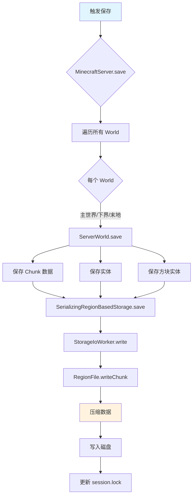
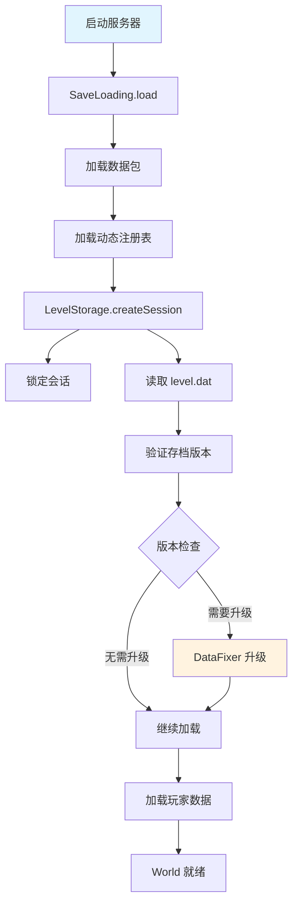

# 第 60 章：存档系统（Save System）

> 本章将深入解析 Minecraft 的存档系统，理解游戏如何将世界数据保存到磁盘，并在下次启动时完整恢复。

## 章节目标

- 理解存档系统的分层架构
- 掌握 Chunk 保存与加载流程
- 了解 Anvil 存储格式
- 理解数据修复（DataFixer）机制

## 前置知识

- 熟悉 Minecraft 世界和 Chunk 的概念
- 了解 NBT 数据格式基础
- 知道什么是 Region 文件

## 核心概念

### 存档系统 = 游戏的"记忆宫殿"

想象存档系统是一座巨大的记忆宫殿：

```
┌─────────────────────────────────────────────────────────────────┐
│                        存档系统架构                                │
│                      (记忆宫殿)                                   │
│                                                                     │
│  ┌─────────────────────────────────────────────────────────────┐ │
│  │                        顶层入口                               │ │
│  │              MinecraftServer / IntegratedServer               │ │
│  └─────────────────────────┬───────────────────────────────────┘ │
│                            │                                        │
│                            ▼                                        │
│  ┌─────────────────────────────────────────────────────────────┐ │
│  │                    SaveLoading                                │ │
│  │               (档案管理员)                                    │ │
│  └─────────────────────────┬───────────────────────────────────┘ │
│                            │                                        │
│                            ▼                                        │
│  ┌─────────────────────────────────────────────────────────────┐ │
│  │                    LevelStorage                               │ │
│  │               (书架管理员)                                    │ │
│  └─────────────────────────┬───────────────────────────────────┘ │
│                            │                                        │
│          ┌─────────────────┼─────────────────┐                    │
│          ▼                 ▼                 ▼                     │
│  ┌───────────────┐ ┌───────────────┐ ┌───────────────┐        │
│  │  书架 (region/)│ │  书架 (DIM1/) │ │  书架 (player/)│        │
│  │  - r.0.0.mca  │ │  - r.0.0.mca  │ │  - steve.dat │        │
│  │  - r.0.1.mca  │ │  - r.0.1.mca  │ │  - alex.dat  │        │
│  │  - ...        │ │  - ...        │ │  - ...       │        │
│  └───────────────┘ └───────────────┘ └───────────────┘        │
│                                                                     │
└─────────────────────────────────────────────────────────────────┘
```

**关键比喻**：
- `MinecraftServer` = 图书馆馆长
- `LevelStorage` = 书架管理员
- `RegionFile` = 书架上的书架（每个存1024个Chunk）
- `.mca文件` = 一本本书（每个Chunk一章）
- `level.dat` = 图书馆的目录索引

---

## 1. 存档目录结构

### 1.1 标准存档目录

```
saves/
└── MyWorld/                          # 存档根目录
    ├── level.dat                     # 主世界配置 (GZIP压缩的NBT)
    ├── level.dat_old                 # 上一次存档的备份
    ├── levelname.txt                 # 显示名称
    ├── icon.png                      # 存档图标
    ├── session.lock                  # 会话锁文件
    │
    ├── data/                         # 游戏数据目录
    │   ├── capabilities.json
    │   ├── advancements/
    │   ├── stats/
    │   └── custombossevents/
    │
    ├── playerdata/                   # 玩家数据
    │   └── <uuid>.dat
    │
    ├── DIM1/                        # 下界 (The Nether)
    │   └── region/
    │       └── r.<x>.<z>.mca
    │
    ├── DIM-1/                       # 末地 (The End)
    │   └── region/
    │       └── r.<x>.<z>.mca
    │
    └── region/                       # 主世界 Region 文件
        ├── r.0.0.mca
        ├── r.0.1.mca
        └── ...
```

### 1.2 Region 文件命名规则

Region 文件使用 Anvil 格式，命名规则：

```
r.<regionX>.<regionZ>.mca
```

- `regionX = floor(chunkX / 32)`
- `regionZ = floor(chunkZ / 32)`
- 每个 Region 文件包含 32x32 = 1024 个 Chunk

---

## 2. 保存流程

### 2.1 保存流程图



### 2.2 Chunk 保存核心

```java
// SerializingRegionBasedStorage.java
private <T> Dynamic<T> serialize(ChunkPos chunkPos, DynamicOps<T> ops) {
    HashMap map = Maps.newHashMap();
    
    // 遍历所有区块段落 (Section)
    for (int i = this.world.getBottomSectionCoord(); 
         i < this.world.getTopSectionCoord(); ++i) {
        long l = SerializingRegionBasedStorage.chunkSectionPosAsLong(chunkPos, i);
        
        // 从未保存队列中移除
        this.unsavedElements.remove(l);
        
        // 获取加载的数据
        Optional optional = (Optional)this.loadedElements.get(l);
        if (optional == null || optional.isEmpty()) continue;
        
        // 使用 Codec 编码
        DataResult<T> dataResult = this.codecFactory.apply(() -> this.onUpdate(l))
            .encodeStart(ops, optional.get());
        
        // 创建包含版本信息的 NBT 结构
        String string = Integer.toString(i);
        dataResult.resultOrPartial(LOGGER::error)
            .ifPresent(object -> map.put(ops.createString(string), object));
    }
    
    return new Dynamic<T>(ops, ops.createMap(ImmutableMap.of(
        ops.createString(SECTIONS_KEY), ops.createMap(map),
        ops.createString("DataVersion"), 
            ops.createInt(SharedConstants.getGameVersion().getSaveVersion().getId())
    )));
}
```

### 2.3 异步写入

```java
// StorageIoWorker.java
public class StorageIoWorker implements NbtScannable, AutoCloseable {
    private final TaskExecutor<TaskQueue.PrioritizedTask> executor;
    private final RegionBasedStorage storage;
    private final Map<ChunkPos, Result> results = Maps.newLinkedHashMap();
    
    // 优先级队列
    static enum Priority {
        FOREGROUND,   // 前台任务 - 立即执行
        BACKGROUND,   // 后台任务 - 批量执行
        SHUTDOWN;     // 关闭任务 - 最后执行
    }
    
    // 异步写入
    public CompletableFuture<Void> setResult(ChunkPos pos, @Nullable NbtCompound nbt) {
        return this.run(() -> {
            Result result = this.results.computeIfAbsent(pos, pos2 -> new Result(nbt));
            result.nbt = nbt;
            return Either.left(result.future);
        }).thenCompose(Function.identity());
    }
}
```

---

## 3. 加载流程

### 3.1 加载流程图



### 3.2 level.dat 加载

```java
// LevelStorage.Session.java
public Dynamic<?> readLevelProperties() throws IOException {
    // 使用 NbtIo 读取
    // 应用 DataFixer
    Dynamic<?> dynamic = NbtIo.readCompressed(this.getLevelPath(WorldSavePath.LEVEL_DAT));
    
    // 获取数据版本
    int dataVersion = NbtHelper.getDataVersion(dynamic, 1343);
    
    // 应用 DataFixer 升级
    if (dataVersion < SharedConstants.getGameVersion().getSaveVersion().getId()) {
        dynamic = this.storageAccess.update(dynamic, dataVersion);
    }
    
    return parseLevelNbt(dynamic);
}
```

---

## 4. Anvil 格式

### 4.1 Anvil 格式结构

| 特性 | 说明 |
|------|------|
| 文件格式 | `.mca` (Minecraft Anvil) |
| 单文件大小 | 32x32 Chunks |
| 压缩 | 可配置 (GZIP/DEFLATE/LZ4) |
| 最大支持 | 单 Chunk 超过 1MB 时使用外部文件 |

### 4.2 RegionFile 头结构

```
┌────────────────────────────────────────────────┐
│              Region 文件头 (8KB)                   │
├────────────────────────────────────────────────┤
│                                                 │
│  偏移表 (4KB):                                   │
│  ┌──────┬──────┬──────┬──────┬─────┐      │
│  │ Chunk│ Chunk│ Chunk│ ... │     │      │
│  │  0   │  1   │  2   │     │ 1023 │      │
│  │ 4字节│ 4字节│ 4字节│     │ 4字节│      │
│  └──────┴──────┴──────┴─────┴─────┘      │
│                                                 │
│  时间戳表 (4KB):                                 │
│  ┌──────┬──────┬──────┬─────┐              │
│  │ 时间 │ 时间 │ 时间 │ ... │              │
│  │  0   │  1   │  2   │     │              │
│  │ 4字节│ 4字节│ 4字节│     │              │
│  └──────┴──────┴──────┴─────┘              │
│                                                 │
└────────────────────────────────────────────────┘

Chunk 数据格式:
[4 bytes: 大小][1 byte: 压缩格式][N bytes: 数据]
```

### 4.3 Chunk 压缩格式

```java
// 支持的压缩格式
public static final ChunkCompressionFormat GZIP     = ...;  // ID: 1
public static final ChunkCompressionFormat DEFLATE = ...;  // ID: 2 (默认)
public static final ChunkCompressionFormat UNCOMPRESSED = ...; // ID: 3
public static final ChunkCompressionFormat LZ4      = ...;  // ID: 4

// 可在 server.properties 中配置:
// region-file-compression=deflate
```

---

## 5. 自动存档

### 5.1 存档时机

| 时机 | 触发条件 | 保存内容 |
|------|----------|----------|
| 定期自动保存 | 每 6000 Tick (5分钟) | 所有已加载区块 |
| 区块退出加载 | `setChunkLoaded(false)` | 该区块 |
| 玩家退出 | 玩家断开连接 | 玩家数据 |
| 服务器关闭 | `server.stop()` | 完整存档 |
| 区块修改 | Chunk 变脏 | 脏区块 |

### 5.2 自动保存配置

```yaml
# server.properties
# 自动存档间隔 (单位: 游戏刻, 20 ticks = 1 秒)
# 默认 6000 = 5 分钟
auto-save-interval=6000
```

### 5.3 定时保存

```java
// MinecraftServer.java
private int ticksUntilAutosave = 6000;  // 默认5分钟

public void tick(BooleanSupplier shouldKeepTicking) {
    // ...
    
    // 自动保存
    --this.ticksUntilAutosave;
    if (this.ticksUntilAutosave <= 0) {
        this.ticksUntilAutosave = this.getAutosaveInterval();
        this.saveAll(true, false, false);
    }
}
```

---

## 6. 数据修复 (DataFixer)

### 6.1 为什么需要 DataFixer

```
┌─────────────────────────────────────────────────────────────────┐
│                      DataFixer 必要性                              │
├─────────────────────────────────────────────────────────────────┤
│                                                                     │
│  版本 1.20 的存档                                                  │
│  ┌─────────────────────────────────────────────────────────┐   │
│  │ Block: "minecraft:stone" (命名空间ID)                      │   │
│  │ Enchant: {id: 16, lvl: 1} (数字附魔ID)                    │   │
│  │ Entity: {id: 95} (方块实体数字ID)                          │   │
│  └─────────────────────────────────────────────────────────┘   │
│                              │                                    │
│                              ▼ 用 DataFixer 升级 ▼                 │
│                              │                                    │
│  版本 1.21 的存档                                                  │
│  ┌─────────────────────────────────────────────────────────┐   │
│  │ Block: "minecraft:stone" (保持不变)                          │   │
│  │ Enchant: {id: "minecraft:sharpness", lvl: 1}               │   │
│  │ Entity: "minecraft:sign" (字符串实体ID)                     │   │
│  └─────────────────────────────────────────────────────────┘   │
│                                                                     │
└─────────────────────────────────────────────────────────────────┘
```

### 6.2 DataFixer 工作原理

```java
// 数据修复流程
public NbtCompound fixNbt(NbtCompound nbt, int fromVersion, int toVersion) {
    
    // 将 NBT 转换为 Dynamic
    Dynamic<NbtElement> dynamic = Dynamic.convert(
        NbtOps.INSTANCE,
        JsonOps.INSTANCE,
        nbt
    );
    
    // 添加版本信息
    dynamic = dynamic.set("DataVersion", dynamic.createInt(fromVersion));
    
    // 执行修复 (逐版本升级)
    dynamic = fixerUpper.update(
        dynamic, 
        fromVersion, 
        toVersion
    );
    
    // 提取修复后的数据
    return (NbtCompound) dynamic.getValue();
}
```

### 6.3 常见修复类型

| 修复类型 | 示例 |
|----------|------|
| ID扁平化 | `95` → `"minecraft:light_weighted_pressure_plate"` |
| 附魔格式 | `{id: 16, lvl: 1}` → `{id: "minecraft:sharpness", lvl: 1}` |
| 方块状态 | `BlockState: "facing=north"` → `BlockState: {Facing: "north"}` |
| 命名空间 | `"achievements.mineStone"` → `"minecraft:adventure/mine_a_block"` |

---

## 7. 故障排查

### 7.1 常见问题

#### 存档损坏
```
症状: 无法加载存档，提示 "Corruption in level.dat"

解决方案:
1. 备份存档
2. 删除损坏的 level.dat，让游戏重新生成
3. 或使用 level.dat_old 恢复
```

#### Chunk 加载失败
```
症状: "Could not load chunk" 或 "Chunk file is in wrong location"

Minecraft 会自动修复位置问题
如果问题持续，检查磁盘空间
```

#### 数据版本不兼容
```
症状: "Data version is more recent than expected"

解决方案:
将存档放入 1.21 版本的 Minecraft 中打开
```

### 7.2 调试命令

```bash
# 手动触发完整保存
/save-all

# 服务器控制台
save-all flush

# 查看存档信息
/debug save
```

---

## 8. 课后自查

- [ ] 能够描述存档系统的分层架构
- [ ] 理解 Chunk 保存的完整流程
- [ ] 掌握 Anvil 格式的基本结构
- [ ] 了解自动存档的触发时机
- [ ] 理解 DataFixer 的作用

---

**参考源码路径**：

```
D:\Minecraft-Learning\assets\mc\1.21\net\minecraft\world\level\storage\LevelStorage.java
D:\Minecraft-Learning\assets\mc\1.21\net\minecraft\world\storage\RegionFile.java
D:\Minecraft-Learning\assets\mc\1.21\net\minecraft\world\storage\SerializingRegionBasedStorage.java
D:\Minecraft-Learning\assets\mc\1.21\net\minecraft\world\ChunkSerializer.java
```
