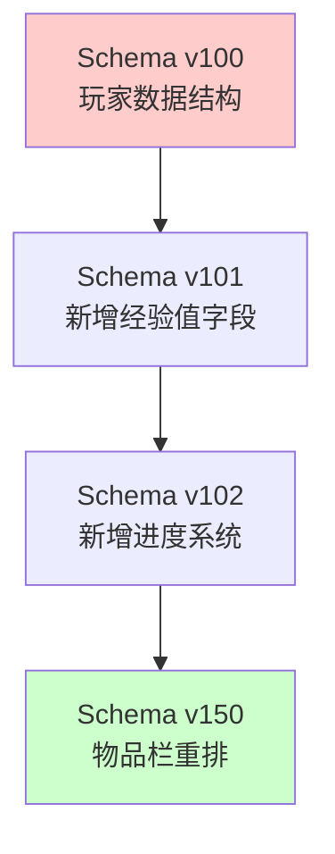
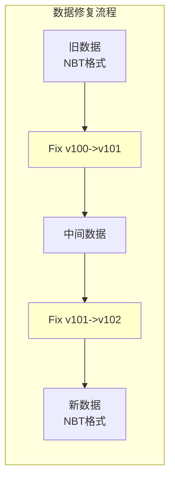
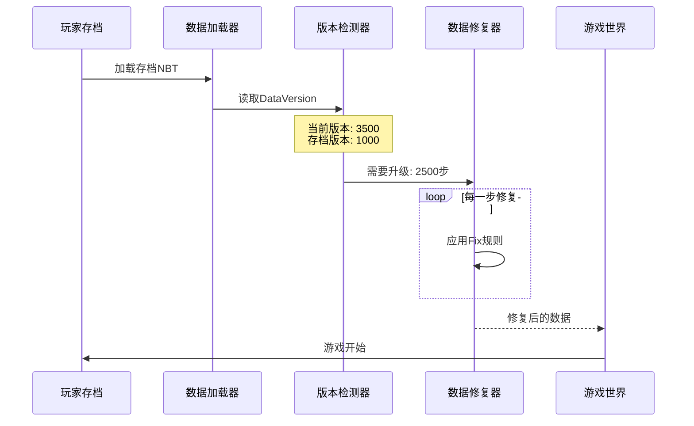

# 第53章 数据修复系统 (DataFixer)

## 目标

- 理解什么是数据修复
- 了解 Schema 和 Fix 的概念
- 掌握从旧版本迁移数据的方法

## 前置知识

- NBT 数据结构基础 (第6章)
- 游戏存档格式

## 核心概念

### 什么是数据修复？

想象你搬家时，需要把所有东西从旧房子搬到新房子。但是旧房子的一些家具可能不符合新房子的大小，这时候你需要一个"搬家规划师"来调整每件家具。数据修复系统就是 Minecraft 的"搬家规划师"。

当游戏更新到新版本时，旧版本存档中的数据格式可能和新版本不兼容。数据修复系统会自动把旧数据"改造"成新格式，让你的存档能够在新版本中正常使用。

### Schema（数据模式）

**Schema 就像是一张"数据蓝图"**，它定义了数据的结构。



在源码中，Schema 定义在 `TypeReferences.java` 里：

```java
public static final TypeReference PLAYER = new TypeReference(DSL.fields("player"));
public static final TypeReference CHUNK = new TypeReference(DSL.fields("chunk"));
```

### Fix（修复器）

**Fix 就像是数据修复的具体"操作手册"**，它告诉系统怎么把数据从 A 版本改成 B 版本。



### 数据修复类型

Minecraft 维护着多种数据类型的修复：

| 类型 | 作用 | 示例 |
|------|------|------|
| `LEVEL` | 世界整体数据 | 游戏难度、生物群系 |
| `PLAYER` | 玩家数据 | 背包、位置、属性 |
| `CHUNK` | 区块数据 | 方块、实体、村民 |
| `STRUCTURE` | 结构数据 | 存档的结构方块 |
| `RAIDS` | 袭击数据 | 村民袭击进度 |

## 图解：版本迁移流程



## 核心代码

### DataFixTypes 枚举

定义所有需要修复的数据类型：

```java
// 源码位置: DataFixTypes.java
public enum DataFixTypes {
    LEVEL(TypeReferences.LEVEL),        // 世界数据
    PLAYER(TypeReferences.PLAYER),      // 玩家数据
    CHUNK(TypeReferences.CHUNK),        // 区块数据
    STRUCTURE(TypeReferences.STRUCTURE), // 结构数据
    RAID(TypeReferences.RAID),          // 袭击数据
    // ... 更多类型
}
```

### 数据修复的核心方法

```java
public <T> Dynamic<T> update(DataFixer dataFixer, Dynamic<T> dynamic, 
                             int oldVersion, int newVersion) {
    // 遍历所有中间版本，逐步修复
    return dataFixer.update(this.typeReference, dynamic, oldVersion, newVersion);
}
```

### 自定义数据修复示例

如果要为你的 Mod 添加数据修复：

```java
// 1. 定义类型引用
public static final TypeReference MY_MOD_DATA = new TypeReference(
    DSL.fields("MyModData")
);

// 2. 创建 Fix
public static DataFix createMyDataFix() {
    return new DataFix(DSL.field("oldField"), 
        ops -> dynamic -> dynamic.update("oldField", "newField"));
}
```

## 实战演示：查看存档版本

你可以使用命令查看当前存档的版本：

```
/datafu get <玩家> DataVersion
```

或者在代码中检测：

```java
public int getSaveVersion(NbtCompound nbt) {
    return nbt.getInt("DataVersion");
}
```

## 小结

```
┌─────────────────────────────────────────────────────────┐
│                    数据修复系统                          │
├─────────────────────────────────────────────────────────┤
│  核心概念：                                             │
│  • Schema = 数据结构的"蓝图"                            │
│  • Fix = 从旧版到新版的"操作手册"                       │
│  • 版本号 = 追踪需要执行哪些修复                         │
│                                                         │
│  流程：                                                 │
│  加载NBT → 检测版本 → 逐步修复 → 加载游戏               │
│                                                         │
│  常见修复类型：                                         │
│  • 重命名字段      • 改变数据结构                       │
│  • 添加新字段      • 删除废弃字段                       │
│  • 移动字段位置    • 转换数据类型                       │
└─────────────────────────────────────────────────────────┘
```

## 练习

1. **思考题**：如果游戏版本从 1.12 跳到 1.18（跳过了很多版本），数据修复系统如何处理？

2. **实践题**：在 Mod 开发中，如何为自己的物品添加数据修复支持？

3. **进阶题**：为什么 Minecraft 要使用"逐步修复"而不是"一步到位"？

## 相关链接

- [Minecraft Wiki: Data Fixer Upper](https://minecraft.fandom.com/wiki/Data_Fixer_Upper)
- [Mojang DataFixerUpper Library](https://github.com/Mojang/DataFixerUpper)
- 相关源码：
  - `net.minecraft.datafixer.DataFixTypes`
  - `net.minecraft.datafixer.TypeReferences`
  - `net.minecraft.datafixer.fix.*`

---

### 源码文件位置

| 文件 | 源码路径 | 说明 |
|------|----------|------|
| DataFixerUpper.java | `net/minecraft/datafixer/DataFixerUpper.java` | 数据修复器主类 |
| DynamicOps.java | `net/minecraft/datafixer/DynamicOps.java` | 动态操作接口 |
| Schema.java | `net/minecraft/datafixer/Schema.java` | 数据模式定义 |

---

**关键词**：DataFixer、Schema、Fix、NBT、Version
