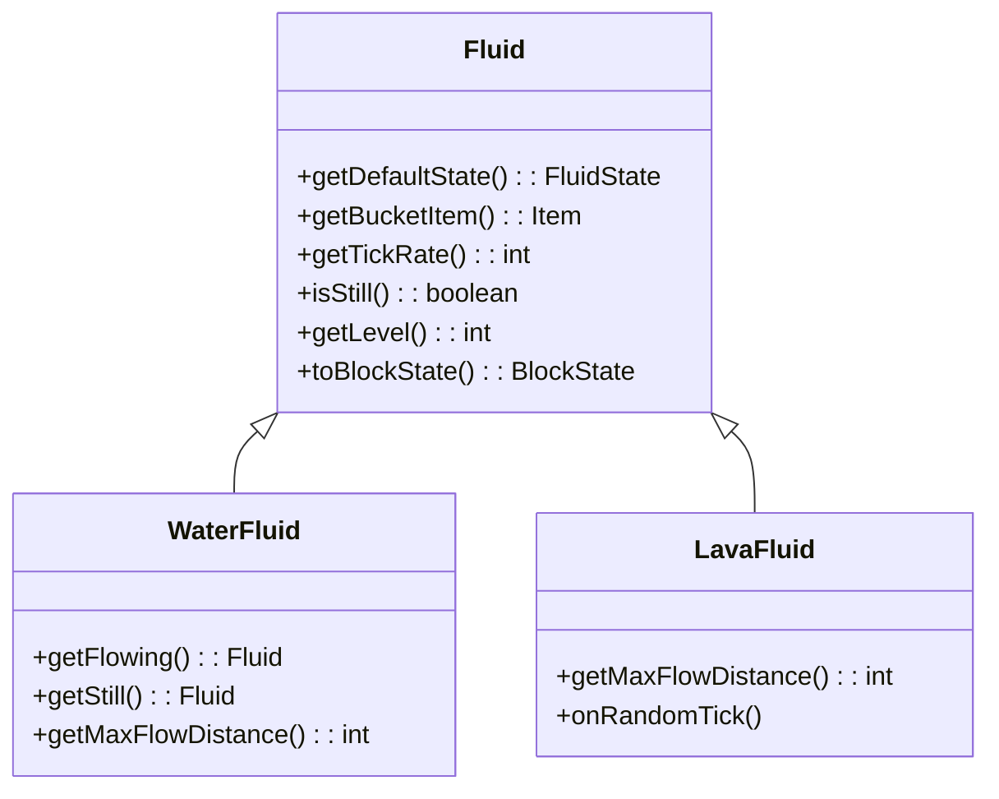
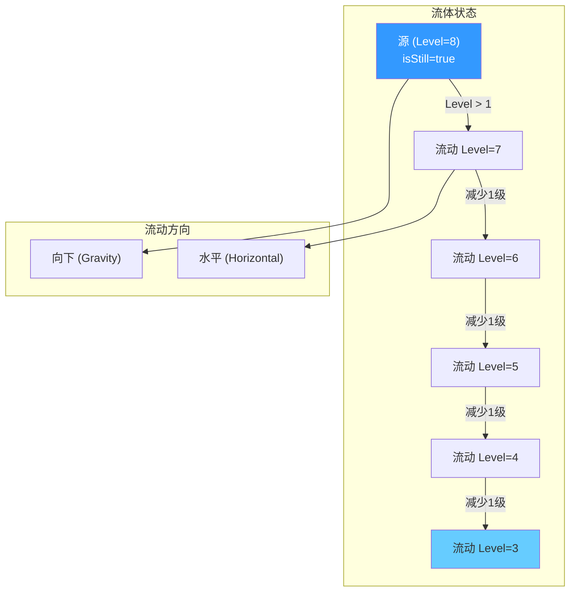
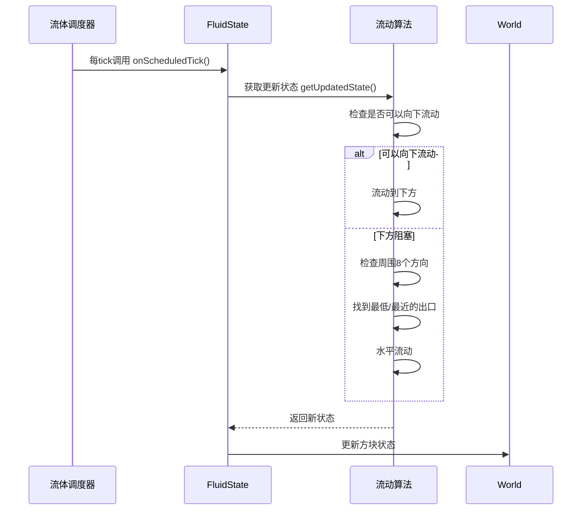

# 第54章 流体系统 (Fluids)

## 目标

- 理解流体系统的基本概念
- 掌握 Fluid 和 FluidState 的关系
- 了解流动算法的原理

## 前置知识

- Block 和 BlockState 的关系 (第8章)
- 方块状态系统 StateManager

## 核心概念

### 什么是流体？

想象你有一杯水。杯子里的水会：
- 保持液面水平（静止状态）
- 从高处流向低处（重力作用）
- 填满周围的空隙（流动特性）

在 Minecraft 中，**流体就是像水和岩浆这样的液体**，它们会在世界中流动、填充空间。

### 生活中的比喻：水流系统

把 Minecraft 的流体系统想象成**城市自来水系统**：

| 真实世界 | Minecraft 流体 |
|---------|---------------|
| 水管 | 流体方块 |
| 水龙头 | 流体源 |
| 水压 | 流体等级 (level) |
| 流动 | 流动算法 |

## Fluid 和 FluidState

### 类比理解

```
Block     ←→  Fluid
BlockState ←→ FluidState
```

就像每个方块位置有一个 BlockState，每个位置也可以有一个 FluidState。

### Fluid 类（流体的"类型"）



### FluidState 类（流体的"状态"）

每个位置的流体状态记录了：

```java
public final class FluidState extends State<Fluid, FluidState> {
    // 继承自 State 类
    // 包含流体的具体属性，如等级、是否下落等
    
    public int getLevel() {
        return getFluid().getLevel(this);  // 获取流动等级
    }
    
    public boolean isStill() {
        return getFluid().isStill(this);    // 是否是静止的
    }
}
```

### 流体等级系统

```
Level = 0     :  最深层（接近源头）
Level = 1-7   :  流动中的水
Level = 8     :  静止的水
Level = 9     :  满的方块
```

## 图解：流体流动



### 流动算法流程



## 核心代码

### 定义流体

```java
// 水流体
public abstract class WaterFluid extends FlowableFluid {
    
    @Override
    public Fluid getFlowing() {
        return Fluids.FLOWING_WATER;  // 返回流动版本
    }
    
    @Override
    public Fluid getStill() {
        return Fluids.WATER;          // 返回静止版本
    }
    
    // 最大流动距离（水平方向）
    @Override
    public int getMaxFlowDistance(WorldView world) {
        return 4;  // 水可以流4格
    }
    
    // 每格降低的等级
    @Override
    public int getLevelDecreasePerBlock(WorldView world) {
        return 1;
    }
}
```

### 岩浆的特殊处理

岩浆和水的区别：

```java
// 岩浆流得更慢
@Override
public int getTickRate(WorldView world) {
    return world.getDimension().ultrawarm() ? 10 : 30;
    // 下界更快 (10 tick)，主世界很慢 (30 tick)
}

// 岩浆流动距离更短
@Override
public int getMaxFlowDistance(WorldView world) {
    return world.getDimension().ultrawarm() ? 4 : 2;
    // 下界4格，其他地方只有2格
}
```

### 流动算法核心

```java
// FlowableFluid.java 中的流动逻辑
protected void tryFlow(World world, BlockPos fluidPos, FluidState state) {
    // 1. 检查是否可以向下流动
    if (canFlow(world, fluidPos, blockState, Direction.DOWN, ...)) {
        // 2. 向下流动
        flow(world, blockPos, blockState, Direction.DOWN, fluidState);
    }
    // 3. 如果不能向下，尝试水平流动
    else {
        flowToSides(world, fluidPos, state, blockState);
    }
}

// 获取可以流向的所有方向
protected Map<Direction, FluidState> getSpread(World world, 
                                               BlockPos pos, 
                                               BlockState state) {
    // 遍历四个水平方向
    // 计算每个方向的距离
    // 返回可以流动的方向
}
```

## 实战演示：创建自定义流体

```java
// 1. 定义流体类
public class CustomFluid extends FlowableFluid {
    
    @Override
    public Fluid getFlowing() {
        return ModFluids.FLOWING_CUSTOM;
    }
    
    @Override
    public Fluid getStill() {
        return ModFluids.CUSTOM;
    }
    
    @Override
    public Item getBucketItem() {
        return ModItems.CUSTOM_BUCKET;
    }
    
    @Override
    protected int getLevelDecreasePerBlock(WorldView world) {
        return 1;
    }
    
    @Override
    public int getTickRate(WorldView world) {
        return 5;
    }
    
    @Override
    protected boolean isInfinite(World world) {
        return true;  // 是否无限（如海洋）
    }
}
```

## 小结

```
┌─────────────────────────────────────────────────────────┐
│                    流体系统                              │
├─────────────────────────────────────────────────────────┤
│  核心概念：                                             │
│  • Fluid = 流体的"类型"（如水、岩浆）                    │
│  • FluidState = 流体的"状态"（等级、是否下落）           │
│  • Level = 0-8，代表流体深度/量                         │
│                                                         │
│  流动规则：                                             │
│  • 向下流动（重力）                                     │
│  • 水平流动（向低处）                                   │
│  • Level 随距离递减                                     │
│                                                         │
│  特殊属性：                                             │
│  • 水：无限源、流动8格、降1级/格                         │
│  • 岩浆：非无限、流动短、烧毁物品                       │
└─────────────────────────────────────────────────────────┘
```

## 练习

1. **思考题**：为什么水有"无限源"的特性，但岩浆没有？

2. **实践题**：如果要让蜂蜜像水一样流动，需要修改哪些参数？

3. **调试题**：使用 F3 调试菜单观察流动水的 Level 值变化。

4. **进阶题**：思考如何实现"双向流动"的液体（如岩浆从两边向中间流）。

## 相关链接

- [Minecraft Wiki: Fluids](https://minecraft.fandom.com/wiki/Fluid)
- [Minecraft Wiki: Water](https://minecraft.fandom.com/wiki/Water)
- [Minecraft Wiki: Lava](https://minecraft.fandom.com/wiki/Lava)
- 相关源码：
  - `net.minecraft.fluid.Fluid`
  - `net.minecraft.fluid.FluidState`
  - `net.minecraft.fluid.FlowableFluid`
  - `net.minecraft.fluid.WaterFluid`
  - `net.minecraft.fluid.LavaFluid`

---

### 源码文件位置

| 文件 | 源码路径 | 说明 |
|------|----------|------|
| Fluid.java | `net/minecraft/fluid/Fluid.java` | 流体基类 |
| FlowableFluid.java | `net/minecraft/fluid/FlowableFluid.java` | 可流动流体实现 |
| FluidState.java | `net/minecraft/fluid/FluidState.java` | 流体状态 |

---

**关键词**：Fluid、FluidState、Water、Lava、Flow
