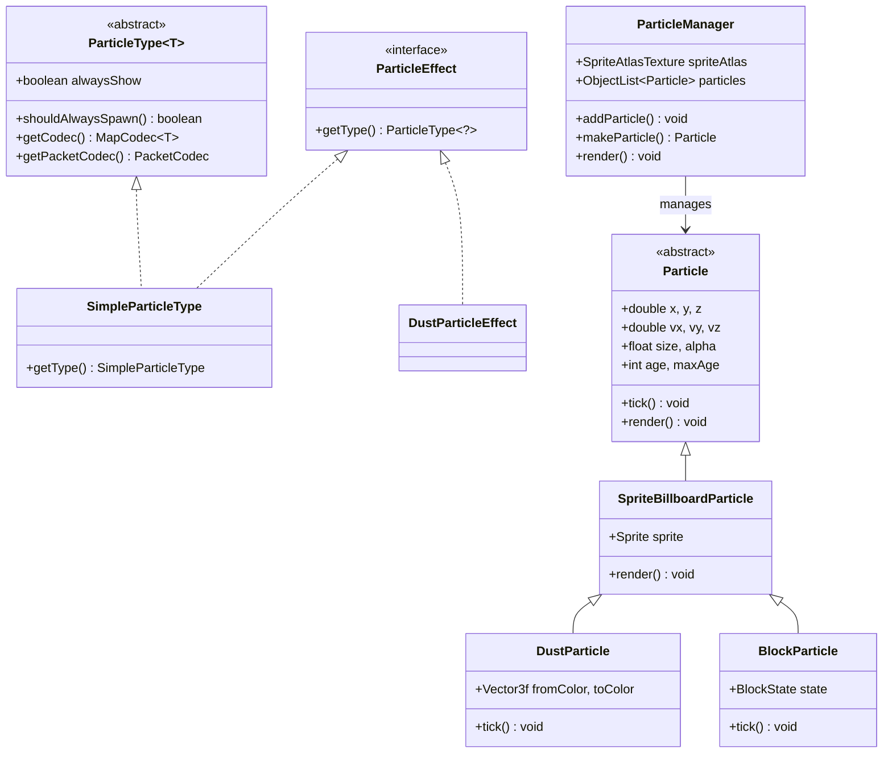
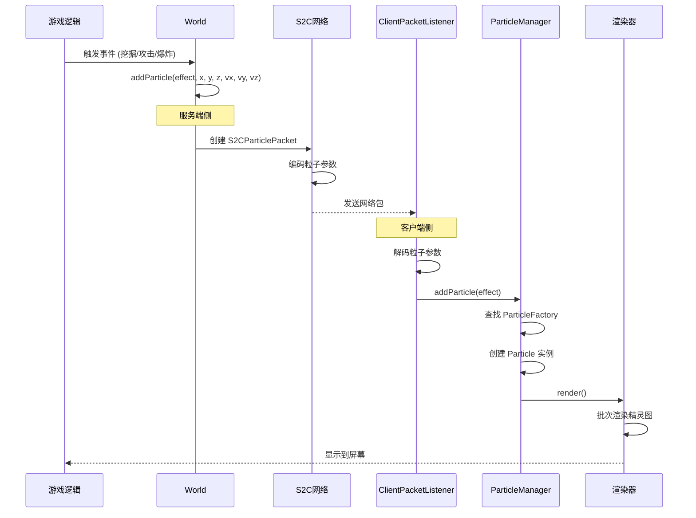

# 第 58 章：粒子系统（Particle System）

> 本章将深入解析 Minecraft 的粒子系统，理解各种视觉特效的实现原理。

## 章节目标

- 理解粒子系统的架构设计
- 掌握粒子类型的注册机制
- 了解粒子生成的网络传输流程
- 学会创建自定义粒子类型

## 前置知识

- 熟悉 Minecraft 的网络协议基础
- 了解 PacketCodec 编解码机制
- 知道什么是 Billboard 渲染

## 核心概念

### 粒子 = 飘舞的精灵

想象粒子是一位"魔术师"：

```
┌─────────────────────────────────────────────────────────────────┐
│                      粒子系统架构图                                  │
├─────────────────────────────────────────────────────────────────┤
│                                                                     │
│  服务端                                                         │
│  ┌─────────────────────────────────────────────────────────────┐ │
│  │  游戏事件触发                                                 │ │
│  │  ┌─────────┐  ┌─────────┐  ┌─────────┐  ┌─────────┐      │ │
│  │  │ 爆炸    │  │ 火焰    │  │ 气泡    │  │ 挖掘    │      │ │
│  │  └────┬────┘  └────┬────┘  └────┬────┘  └────┬────┘      │ │
│  │       │            │            │            │             │ │
│  │       └────────────┴────────────┴────────────┘             │ │
│  │                         │                                  │ │
│  │                         ▼                                  │ │
│  │              ┌─────────────────────┐                      │ │
│  │              │  S2CParticlePacket  │                      │ │
│  │              └──────────┬──────────┘                      │ │
│  └─────────────────────────┼────────────────────────────────┘ │
│                            │                                   │
│                            ▼ 网络传输 ▼                          │
│                                                                     │
│  客户端                                                         │
│  ┌─────────────────────────────────────────────────────────────┐ │
│  │                         │                                  │ │
│  │                         ▼                                  │ │
│  │              ┌─────────────────────┐                      │ │
│  │              │   ParticleManager   │                      │ │
│  │              └──────────┬──────────┘                      │ │
│  │       ┌─────────────────┼─────────────────┐              │ │
│  │       ▼                 ▼                 ▼              │ │
│  │  ┌─────────┐      ┌─────────┐      ┌─────────┐           │ │
│  │  │ Flame   │      │ Bubble  │      │  Dust   │           │ │
│  │  │Particle │      │Particle │      │Particle │           │ │
│  │  └────┬────┘      └────┬────┘      └────┬────┘           │ │
│  │       │                 │                 │               │ │
│  │       └─────────────────┴─────────────────┘               │ │
│  │                         │                                  │ │
│  │                         ▼                                  │ │
│  │              ┌─────────────────────┐                      │ │
│  │              │  渲染到屏幕         │                      │ │
│  │              └─────────────────────┘                      │ │
│  └─────────────────────────────────────────────────────────────┘ │
│                                                                     │
└─────────────────────────────────────────────────────────────────┘
```

**关键比喻**：
- ParticleType = 粒子的"身份证"
- ParticleEffect = 粒子的"出生证"
- Particle = 粒子的"本体"
- ParticleFactory = 粒子的"生产线"

---

## 1. 粒子系统架构

### 1.1 核心组件关系



### 1.2 粒子类型分类

| 分类 | 说明 | 示例 |
|------|------|------|
| SimpleParticleType | 无参数粒子 | flame, smoke, bubble |
| DustParticleEffect | 带颜色的粒子 | redstone, glowstone |
| BlockStateParticleEffect | 方块碎片 | 挖掘方块 |
| ItemStackParticleEffect | 物品图标 | 消耗物品 |
| DustColorTransitionEffect | 渐变粒子 | 末影珍珠 |

---

## 2. 核心类详解

### 2.1 ParticleType 类

```java
// ParticleType.java
public abstract class ParticleType<T extends ParticleEffect> {
    // 是否总是显示（不受距离限制）
    private final boolean alwaysShow;

    protected ParticleType(boolean alwaysShow) {
        this.alwaysShow = alwaysShow;
    }

    // 某些粒子（如爆炸）不受距离限制
    public boolean shouldAlwaysSpawn() {
        return this.alwaysShow;
    }

    // 用于数据包序列化
    public abstract MapCodec<T> getCodec();
    
    // 用于网络包传输
    public abstract PacketCodec<? super RegistryByteBuf, T> getPacketCodec();
}
```

### 2.2 ParticleEffect 接口

```java
// ParticleEffect.java
public interface ParticleEffect {
    // 返回粒子类型
    ParticleType<?> getType();
}
```

### 2.3 Particle 基类

```java
// Particle.java
public abstract class Particle {
    protected double x, y, z;
    protected double vx, vy, vz;
    protected float size;
    protected float r, g, b, alpha;
    protected int age;
    protected int maxAge;
    protected boolean dead;

    // 每 tick 更新粒子状态
    public abstract void tick();

    // 渲染粒子到屏幕
    public abstract void render(ParticleRenderState renderer, MatrixStack matrices, float delta);

    // 获取精灵图索引（用于动画粒子）
    protected int getWideDustSprite(float delta, SpriteSet sprites) {
        float f = MathHelper.clamp((this.size - delta * this.size) / 8.0F, 0.0F, 1.0F);
        int i = this.age * sprites.size() / this.maxAge;
        return i;
    }
}
```

---

## 3. 粒子生成流程

### 3.1 服务端到客户端的流程



### 3.2 世界级生成方法

```java
// World.java

// 无参数全局粒子（所有客户端都能看到）
public void addParticle(ParticleEffect effect, double x, double y, double z,
                        double velocityX, double velocityY, double velocityZ) {
    if (this.isClient) {
        this.particleManager.addParticle(effect, x, y, z, velocityX, velocityY, velocityZ);
    }
}

// 仅指定玩家能看到的粒子
public void addParticle(ParticleEffect effect, boolean alwaysShow, 
                       double x, double y, double z,
                       double velocityX, double velocityY, double velocityZ) {
    if (this.isClient) {
        this.particleManager.addParticle(effect, alwaysShow, x, y, z, velocityX, velocityY, velocityZ);
    }
}

// 选择性生成（指定玩家）
public void addParticle(ServerPlayerEntity player, ParticleEffect effect, 
                        double x, double y, double z,
                        double velocityX, double velocityY, double velocityZ) {
    // 只发送到特定玩家
}
```

---

## 4. 粒子管理器

### 4.1 ParticleManager 结构

```java
// ParticleManager.java
public class ParticleManager implements ResourceReloader, AutoCloseable {
    // 粒子纹理图集
    private final SpriteAtlasTexture spriteAtlas;

    // 所有活跃粒子的列表
    private final ObjectList<Particle> particles = new ObjectArrayList<>(16384);

    // 待移除粒子索引
    private final IntArray pendingParticles = new IntArray(1024);

    // 精灵图池
    private final Map<ParticleType<?>, SpriteSet> spriteSets;

    // 最大粒子数量限制
    private static final int MAX_PARTICLES = 16384;

    // 添加粒子到世界
    public <T extends ParticleEffect> void addParticle(T effect, double x, double y, double z,
                                                        double velocityX, double velocityY, double velocityZ) {
        this.addParticle(effect, false, x, y, z, velocityX, velocityY, velocityZ);
    }

    // 创建粒子实例（通过工厂）
    private <T extends ParticleEffect> Particle makeParticle(T effect, double x, double y, double z,
                                                            double velocityX, double velocityY, double velocityZ) {
        ParticleFactory<T> factory = this.factoryMap.get(effect.getType());
        if (factory != null) {
            return factory.create(effect, this.clientWorld, this.spriteSets.get(effect.getType()),
                                   x, y, z, velocityX, velocityY, velocityZ);
        }
        return null;
    }
}
```

---

## 5. 带参数的粒子效果

### 5.1 DustParticleEffect

```java
// DustParticleEffect.java
public class DustParticleEffect extends AbstractDustParticleEffect {
    public static final Vector3f RED = Vec3d.unpackRgb(0xFF0000).toVector3f();
    public static final Vector3f GREEN = Vec3d.unpackRgb(0x00FF00).toVector3f();
    public static final Vector3f BLUE = Vec3d.unpackRgb(0x0000FF).toVector3f();

    public static final DustParticleEffect DEFAULT = new DustParticleEffect(RED, 1.0F);

    private final Vector3f color;

    public DustParticleEffect(Vector3f color, float scale) {
        super(scale);
        this.color = color;
    }

    public ParticleType<DustParticleEffect> getType() {
        return ParticleTypes.DUST;
    }

    public Vector3f getColor() {
        return this.color;
    }
}
```

### 5.2 BlockStateParticleEffect

```java
// BlockStateParticleEffect.java
public class BlockStateParticleEffect implements ParticleEffect {
    private final ParticleType<BlockStateParticleEffect> type;
    private final BlockState state;

    public BlockStateParticleEffect(ParticleType<BlockStateParticleEffect> type, BlockState state) {
        this.type = type;
        this.state = state;
    }

    public BlockState getState() {
        return this.state;
    }

    public ParticleType<BlockStateParticleEffect> getType() {
        return this.type;
    }
}
```

### 5.3 DustColorTransitionParticleEffect

```java
// DustColorTransitionParticleEffect.java
public class DustColorTransitionParticleEffect extends AbstractDustParticleEffect {
    private final Vector3f fromColor;
    private final Vector3f toColor;

    public DustColorTransitionParticleEffect(Vector3f fromColor, Vector3f toColor, float scale) {
        super(scale);
        this.fromColor = fromColor;
        this.toColor = toColor;
    }

    public Vector3f getFromColor() {
        return this.fromColor;
    }

    public Vector3f getToColor() {
        return this.toColor;
    }
}
```

---

## 6. 常见粒子类型速查表

| ID | 类 | 说明 | 常用场景 |
|----|----|------|----------|
| `flame` | SimpleParticleType | 火焰 | 熔炉、火把 |
| `smoke` | SimpleParticleType | 烟雾 | 营火、烟熏炉 |
| `bubble` | SimpleParticleType | 气泡 | 水下 |
| `heart` | SimpleParticleType | 爱心 | 繁殖、治疗 |
| `crit` | SimpleParticleType | 暴击 | 暴击伤害 |
| `explosion` | SimpleParticleType | 爆炸 | TNT |
| `dust` | DustParticleEffect | 彩色灰尘 | 红石粉 |
| `block` | BlockStateParticleEffect | 方块碎片 | 挖掘方块 |
| `item` | ItemStackParticleEffect | 物品图标 | 消耗物品 |
| `dust_color_transition` | DustColorTransitionParticleEffect | 颜色渐变 | 末影珍珠 |

---

## 7. 自定义粒子

### 7.1 定义自定义粒子类型

```java
// ModParticles.java
public class ModParticles {
    // 注册粒子类型
    public static final ParticleType<MyParticleEffect> MAGIC_DUST = 
        ParticleType.register("magic_dust", false, 
            MyParticleEffect::createCodec, 
            MyParticleEffect.PACKET_CODEC);
}
```

### 7.2 创建粒子效果类

```java
// MyParticleEffect.java
public class MyParticleEffect implements ParticleEffect {
    private final Vector3f color;
    private final float scale;

    public MyParticleEffect(Vector3f color, float scale) {
        this.color = color;
        this.scale = scale;
    }

    public Vector3f getColor() {
        return this.color;
    }

    public float getScale() {
        return this.scale;
    }

    public ParticleType<MyParticleEffect> getType() {
        return ModParticles.MAGIC_DUST;
    }

    // 数据包编解码器
    public static MapCodec<MyParticleEffect> createCodec() {
        return RecordCodecBuilder.mapCodec(instance ->
            instance.group(
                Vector3f.CODEC.fieldOf("color").forGetter(MyParticleEffect::getColor),
                Codec.FLOAT.fieldOf("scale").forGetter(MyParticleEffect::getScale)
            ).apply(instance, MyParticleEffect::new)
        );
    }

    public static PacketCodec<RegistryByteBuf, MyParticleEffect> PACKET_CODEC =
        PacketCodec.tuple(
            PacketCodec.of((buf, effect) -> {
                buf.writeFloat(effect.color.getX());
                buf.writeFloat(effect.color.getY());
                buf.writeFloat(effect.color.getZ());
            }, buf -> new Vector3f(buf.readFloat(), buf.readFloat(), buf.readFloat())),
            PacketCodec.FLOAT,
            MyParticleEffect::new
        );
}
```

### 7.3 创建粒子渲染类

```java
// MagicDustParticle.java
public class MagicDustParticle extends SpriteBillboardParticle {
    private final Vector3f particleColor;

    public MagicDustParticle(ClientWorld world, double x, double y, double z,
                            double vx, double vy, double vz,
                            Vector3f color, float scale) {
        super(world, x, y, z, vx, vy, vz);
        this.particleColor = color;
        this.size = scale;
        this.maxAge = 40 + world.random.nextInt(20);
    }

    @Override
    public void tick() {
        super.tick();
        
        // 颜色渐变效果
        float ratio = (float) this.age / this.maxAge;
        this.colorRed = particleColor.getX();
        this.colorGreen = particleColor.getY();
        this.colorBlue = particleColor.getZ();
        
        // 缩小效果
        this.size *= 0.95F;
    }
}
```

### 7.4 注册粒子工厂

```java
// ModParticles.java (客户端)
public class ModParticles {
    public static void registerFactories() {
        // 注册工厂
        ParticleFactoryRegistry.getInstance().register(
            MAGIC_DUST,
            (effect, world, sprites, x, y, z, vx, vy, vz) -> 
                new MagicDustParticle(world, x, y, z, vx, vy, vz,
                    effect.getColor(), effect.getScale())
        );
    }
}
```

---

## 8. 性能优化

### 8.1 粒子数量限制

```java
// ParticleManager.java
private static final int MAX_PARTICLES = 16384;

// 添加粒子时检查数量
public <T extends ParticleEffect> void addParticle(...) {
    Particle particle = this.makeParticle(...);
    if (particle != null) {
        this.particles.add(particle);
        // 超出限制时移除最旧的粒子
        if (this.particles.size() > MAX_PARTICLES) {
            this.particles.remove(this.particles.size() - 1);
        }
    }
}
```

### 8.2 距离剔除

```java
// 粒子可见距离设置
public enum ParticleStatus {
    ALL,      // 显示所有粒子
    DECREASED, // 减少粒子数量
    MINIMAL   // 最小粒子数量
}

// 根据设置调整可见距离
public void setParticleStatus(ParticleStatus status) {
    switch (status) {
        case ALL -> this.viewDistance = 100.0;
        case DECREASED -> this.viewDistance = 50.0;
        case MINIMAL -> this.viewDistance = 25.0;
    }
}
```

### 8.3 精灵图批处理

```
┌─────────────────────────────────────────────────────────────────┐
│                    精灵图批处理优化                                   │
├─────────────────────────────────────────────────────────────────┤
│                                                                     │
│  优化前: 每个粒子单独绑定纹理                                         │
│  ┌────┐ ┌────┐ ┌────┐ ┌────┐ ┌────┐                             │
│  │ T1 │ │ T2 │ │ T1 │ │ T3 │ │ T2 │  → 5次纹理绑定               │
│  └────┘ └────┘ └────┘ └────┘ └────┘                              │
│                                                                     │
│  优化后: 批次渲染相同纹理                                             │
│  ┌─────────────┐                                                 │
│  │ SpriteAtlas │  → 1次纹理绑定                                     │
│  │ ┌──┬──┬──┐  │                                                 │
│  │ │T1│T2│T3│  │                                                 │
│  │ └──┴──┴──┘  │                                                 │
│  └─────────────┘                                                 │
│                                                                     │
└─────────────────────────────────────────────────────────────────┘
```

---

## 9. 课后自查

- [ ] 能够解释粒子系统的架构设计
- [ ] 理解 ParticleType 和 ParticleEffect 的区别
- [ ] 掌握粒子生成的网络传输流程
- [ ] 了解如何创建自定义粒子类型
- [ ] 能够实现带参数的自定义粒子

---

**参考源码路径**：

```
D:\Minecraft-Learning\assets\mc\1.21\net\minecraft\particle\ParticleType.java
D:\Minecraft-Learning\assets\mc\1.21\net\minecraft\particle\ParticleEffect.java
D:\Minecraft-Learning\assets\mc\1.21\net\minecraft\particle\SimpleParticleType.java
D:\Minecraft-Learning\assets\mc\1.21\net\minecraft\particle\Particle.java
D:\Minecraft-Learning\assets\mc\1.21\net\minecraft\client\particle\ParticleManager.java
D:\Minecraft-Learning\assets\mc\1.21\net\minecraft\particle\DustParticleEffect.java
D:\Minecraft-Learning\assets\mc\1.21\net\minecraft\particle\BlockStateParticleEffect.java
```
