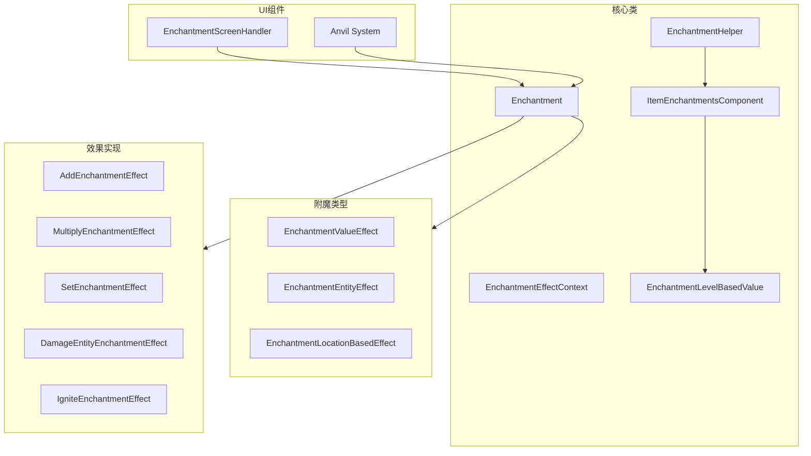
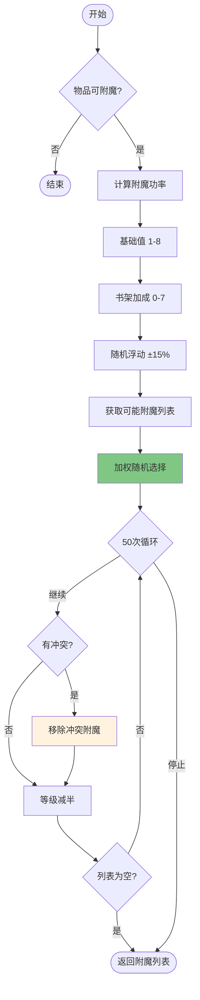

# 第 59 章：附魔系统（Enchantment System）

> 本章将深入解析 Minecraft 的附魔系统，理解附魔的生成逻辑和效果应用机制。

## 章节目标

- 理解附魔系统的架构设计
- 掌握附魔生成算法
- 了解附魔效果的组件化系统
- 学会自定义附魔类型

## 前置知识

- 熟悉 LootContext 机制
- 了解数据组件系统基础
- 知道什么是加权随机算法

## 核心概念

### 附魔 = 给装备注入魔力

想象附魔系统是一位"魔法工匠"：

```
┌─────────────────────────────────────────────────────────────────┐
│                      附魔系统流程图                                  │
├─────────────────────────────────────────────────────────────────┤
│                                                                     │
│  玩家                                                         │
│    │                                                           │
│    ▼                                                            │
│  ┌─────────────────────────────────────────────────────────────┐ │
│  │                     附魔台                                  │ │
│  │  ┌─────────┐  ┌─────────┐  ┌─────────┐                   │ │
│  │  │ 书架加成 │  │ 青金石  │  │ 经验值  │                   │ │
│  │  │  0-15   │  │  消耗   │  │  消耗   │                   │ │
│  │  └────┬────┘  └────┬────┘  └────┬────┘                   │ │
│  │       │             │             │                          │ │
│  │       └─────────────┼─────────────┘                          │ │
│  │                     ▼                                        │ │
│  │            ┌─────────────────┐                            │ │
│  │            │  附魔生成算法    │                            │ │
│  │            │  - 随机选择      │                            │ │
│  │            │  - 冲突检测      │                            │ │
│  │            │  - 权重计算      │                            │ │
│  │            └────────┬────────┘                            │ │
│  └─────────────────────┼────────────────────────────────────┘ │
│                        ▼                                        │
│  ┌─────────────────────────────────────────────────────────────┐ │
│  │                     铁砧 (可选)                              │ │
│  │  - 合并附魔书                                                │ │
│  │  - 合并相同附魔                                              │ │
│  │  - 修复物品                                                 │ │
│  └─────────────────────────────────────────────────────────────┘ │
│                        ▼                                        │
│                     附魔装备                                      │
│                                                                     │
└─────────────────────────────────────────────────────────────────┘
```

**关键比喻**：
- Enchantment = 附魔的"身份证"
- Definition = 附魔的"属性表"
- ItemEnchantmentsComponent = 装备的"附魔列表"
- EnchantmentEffectContext = 附魔的"使用场景"

---

## 1. 附魔系统架构

### 1.1 核心类关系



### 1.2 附魔类型分类

| 分类 | 说明 | 示例 |
|------|------|------|
| 保护类 | 减少伤害 | Protection, Fire Protection |
| 武器类 | 增加伤害 | Sharpness, Smite, Bane of Arthropods |
| 工具类 | 提升效率 | Efficiency, Silk Touch, Fortune |
| 远程类 | 弓/弩强化 | Power, Punch, Flame |
| 特殊类 | 独特效果 | Mending, Curse of Binding |

---

## 2. 核心类详解

### 2.1 Enchantment 类

```java
// Enchantment.java
public record Enchantment(
    Text description,           // 描述文本
    Definition definition,     // 附魔定义
    RegistryEntryList<Enchantment> exclusiveSet,  // 互斥附魔列表
    ComponentMap effects       // 效果组件映射
) {
    
    // Definition 内部记录
    public record Definition(
        RegistryEntryList<Item> supportedItems,   // 支持的物品
        Optional<RegistryEntryList<Item>> primaryItems,  // 主要物品
        int weight,                               // 权重
        int maxLevel,                             // 最大等级
        Cost minCost,                            // 最小成本
        Cost maxCost,                            // 最大成本
        int anvilCost,                           // 铁砧成本
        List<AttributeModifierSlot> slots         // 装备槽位
    ) {}
    
    // Cost 记录
    public record Cost(int base, int perLevelAboveFirst) {
        public int forLevel(int level) {
            return this.base + this.perLevelAboveFirst * (level - 1);
        }
    }
    
    // 判断物品是否支持该附魔
    public boolean isSupportedItem(ItemStack stack) {
        return stack.isIn(this.definition.supportedItems);
    }
    
    // 判断两个附魔是否兼容
    public static boolean canBeCombined(RegistryEntry<Enchantment> first, 
                                        RegistryEntry<Enchantment> second) {
        return !first.equals(second) && 
               !first.value().exclusiveSet.contains(second) && 
               !second.value().exclusiveSet.contains(first);
    }
}
```

### 2.2 EnchantmentHelper 类

```java
// EnchantmentHelper.java
public class EnchantmentHelper {
    
    // 获取物品附魔等级
    public static int getLevel(RegistryEntry<Enchantment> enchantment, ItemStack stack) {
        ItemEnchantmentsComponent component = stack.getOrDefault(
            DataComponentTypes.ENCHANTMENTS, 
            ItemEnchantmentsComponent.DEFAULT
        );
        return component.getLevel(enchantment);
    }
    
    // 获取可能的附魔条目
    public static List<EnchantmentLevelEntry> getPossibleEntries(
            int level, ItemStack stack, 
            Stream<RegistryEntry<Enchantment>> possibleEnchantments) {
        
        List<EnchantmentLevelEntry> list = new ArrayList<>();
        boolean isBook = stack.isOf(Items.BOOK);
        
        possibleEnchantments
            .filter(enchantment -> enchantment.value().isPrimaryItem(stack) || isBook)
            .forEach(enchantmentEntry -> {
                Enchantment enchantment = enchantmentEntry.value();
                for (int j = enchantment.getMaxLevel(); j >= enchantment.getMinLevel(); j--) {
                    if (level < enchantment.getMinPower(j) || level > enchantment.getMaxPower(j)) {
                        continue;
                    }
                    list.add(new EnchantmentLevelEntry(enchantmentEntry, j));
                    break;
                }
            });
        
        return list;
    }
}
```

### 2.3 ItemEnchantmentsComponent

```java
// ItemEnchantmentsComponent.java
public class ItemEnchantmentsComponent implements TooltipAppender {
    // 默认空附魔
    public static final ItemEnchantmentsComponent DEFAULT = 
        new ItemEnchantmentsComponent(new Object2IntOpenHashMap<>(), true);
    
    // 附魔到等级的映射
    final Object2IntOpenHashMap<RegistryEntry<Enchantment>> enchantments;
    final boolean showInTooltip;
    
    // Builder 模式
    public static class Builder {
        public void set(RegistryEntry<Enchantment> enchantment, int level) {
            if (level <= 0) {
                this.enchantments.removeInt(enchantment);
            } else {
                this.enchantments.put(enchantment, Math.min(level, 255));
            }
        }
        
        public void add(RegistryEntry<Enchantment> enchantment, int level) {
            if (level > 0) {
                this.enchantments.merge(enchantment, Math.min(level, 255), Integer::max);
            }
        }
    }
}
```

---

## 3. 附魔生成算法

### 3.1 完整生成流程

```java
// EnchantmentHelper.java
public static List<EnchantmentLevelEntry> generateEnchantments(
        Random random, 
        ItemStack stack, 
        int level, 
        Stream<RegistryEntry<Enchantment>> possibleEnchantments) {
    
    List<EnchantmentLevelEntry> result = new ArrayList<>();
    Item item = stack.getItem();
    int enchantability = item.getEnchantability();
    
    // 物品不可附魔
    if (enchantability <= 0) {
        return result;
    }
    
    // 1. 附加随机加成
    level += 1 + random.nextInt(enchantability / 4 + 1) + 
             random.nextInt(enchantability / 4 + 1);
    
    // 2. 应用随机浮动 (±15%)
    float variance = (random.nextFloat() + random.nextFloat() - 1.0f) * 0.15f;
    level = MathHelper.clamp(Math.round((float)level + (float)level * variance), 
                              1, Integer.MAX_VALUE);
    
    // 3. 获取可能的附魔列表
    List<EnchantmentLevelEntry> possible = getPossibleEntries(level, stack, possibleEnchantments);
    
    if (!possible.isEmpty()) {
        // 4. 首次加权随机选择
        Weighting.getRandom(random, possible).ifPresent(result::add);
        
        // 5. 循环尝试添加更多附魔
        while (random.nextInt(50) <= level) {
            if (!result.isEmpty()) {
                // 移除冲突附魔
                removeConflicts(possible, Util.getLast(result));
            }
            
            if (possible.isEmpty()) break;
            
            // 再次随机选择
            Weighting.getRandom(random, possible).ifPresent(result::add);
            
            // 等级减半
            level /= 2;
        }
    }
    
    return result;
}
```

### 3.2 附魔生成流程图



### 3.3 书架加成公式

```java
// 计算附魔所需经验等级
public static int calculateRequiredExperienceLevel(Random random, int slotIndex, 
                                                   int bookshelfCount, ItemStack stack) {
    Item item = stack.getItem();
    int enchantability = item.getEnchantability();
    
    if (enchantability <= 0) {
        return 0;
    }
    
    // 书架数量限制
    if (bookshelfCount > 15) {
        bookshelfCount = 15;
    }
    
    // 基础值计算
    int base = random.nextInt(8) + 1 + (bookshelfCount >> 1) + random.nextInt(bookshelfCount + 1);
    
    // 不同槽位对应不同经验消耗
    if (slotIndex == 0) {
        return Math.max(base / 3, 1);  // 槽位0: 最低
    }
    if (slotIndex == 1) {
        return base * 2 / 3 + 1;       // 槽位1: 中等
    }
    return Math.max(base, bookshelfCount * 2);  // 槽位2: 最高
}
```

---

## 4. 附魔效果系统

### 4.1 效果组件类型

```java
// EnchantmentEffectComponentTypes.java
public interface EnchantmentEffectComponentTypes {
    // 伤害保护
    public static final ComponentType<List<EnchantmentEffectEntry<...>>> DAMAGE_PROTECTION = 
        register("damage_protection", ...);
    
    // 伤害加成
    public static final ComponentType<List<EnchantmentEffectEntry<...>>> DAMAGE = 
        register("damage", ...);
    
    // 实体效果
    public static final ComponentType<List<EnchantmentEffectEntry<...>>> POST_ATTACK = 
        register("post_attack", ...);
    
    // 实体装备变化
    public static final ComponentType<List<EnchantmentEffectEntry<...>>> EQUIPMENT_CHANGE = 
        register("equipment_change", ...);
}
```

### 4.2 值效果类型

| 类型 | 效果 | 公式 |
|------|------|------|
| `Constant` | 常数值 | `value` |
| `Linear` | 线性增长 | `base + perLevel * (level - 1)` |
| `LevelsSquared` | 平方增长 | `level² + added` |
| `Clamped` | 限制范围 | `clamp(value, min, max)` |

```java
// Linear 实现
public record Linear(float base, float perLevelAboveFirst) implements EnchantmentLevelBasedValue {
    @Override
    public float getValue(int level) {
        return this.base + this.perLevelAboveFirst * (float)(level - 1);
    }
}

// 平方实现
public record LevelsSquared(float added) implements EnchantmentLevelBasedValue {
    @Override
    public float getValue(int level) {
        return (float)(level * level) + this.added;
    }
}
```

### 4.3 实体效果类型

| 类型 | 效果 | 说明 |
|------|------|------|
| `ApplyMobEffectEnchantmentEffect` | 给予药水效果 | 附魔后给予状态效果 |
| `DamageEntityEnchantmentEffect` | 伤害实体 | 对目标造成额外伤害 |
| `IgniteEnchantmentEffect` | 点燃目标 | 火焰附加 |
| `ExplodeEnchantmentEffect` | 爆炸 | 击退效果 |
| `SummonEntityEnchantmentEffect` | 召唤实体 | 召唤生物 |

### 4.4 附魔效果上下文

```java
// EnchantmentEffectContext.java
public record EnchantmentEffectContext(
    ItemStack stack,           // 附魔物品
    @Nullable EquipmentSlot slot,  // 装备槽位
    @Nullable LivingEntity owner,   // 所有者
    @Nullable Consumer<Item> onBreak  // 物品损坏回调
) {
    public EnchantmentEffectContext(ItemStack stack, EquipmentSlot slot, LivingEntity owner) {
        this(stack, slot, owner, item -> owner.sendEquipmentBreakStatus(item, slot));
    }
}
```

---

## 5. 附魔台机制

### 5.1 附魔流程

```java
// EnchantmentScreenHandler.java
public boolean onButtonClick(PlayerEntity player, int id) {
    // 检查经验和青金石
    if (this.enchantmentPower[id] > 0 && 
        !itemStack.isEmpty() && 
        (player.experienceLevel >= this.enchantmentPower[id] || 
         player.getAbilities().creativeMode)) {
        
        this.context.run((world, pos) -> {
            // 生成附魔选项
            List<EnchantmentLevelEntry> list = this.generateEnchantments(...);
            
            if (!list.isEmpty()) {
                // 消耗经验
                player.applyEnchantmentCosts(itemStack3, this.enchantmentPower[id]);
                
                // 如果是书，转换为附魔书
                if (itemStack3.isOf(Items.BOOK)) {
                    itemStack3 = itemStack.withItem(Items.ENCHANTED_BOOK);
                    this.inventory.setStack(0, itemStack3);
                }
                
                // 添加附魔
                for (EnchantmentLevelEntry entry : list) {
                    itemStack3.addEnchantment(entry.enchantment, entry.level);
                }
                
                // 消耗青金石
                itemStack2.decrementUnlessCreative(i, player);
                
                // 播放音效
                world.playSound(null, pos, SoundEvents.BLOCK_ENCHANTMENT_TABLE_USE, ...);
            }
        });
    }
}
```

### 5.2 书架加成

```
┌─────────────────────────────────────────────────────────────────┐
│                      书架加成规则                                    │
├─────────────────────────────────────────────────────────────────┤
│                                                                     │
│  书架检测范围: 附魔台周围 5 格内                                       │
│                                                                     │
│  书架数量  │  经验加成      │  可用附魔等级                           │
│  ───────┼──────────────┼────────────────                        │
│    0    │     +1-8      │   1-8                                │
│    1    │     +1-9      │   1-10                               │
│    5    │     +3-13     │   3-14                               │
│   10    │     +6-18     │   6-20                               │
│   15    │     +9-23     │   9-30                               │
│                                                                     │
└─────────────────────────────────────────────────────────────────┘
```

---

## 6. 铁砧机制

### 6.1 合并逻辑

```java
// 附魔兼容性检查
public static boolean isCompatible(Collection<RegistryEntry<Enchantment>> existing, 
                                  RegistryEntry<Enchantment> candidate) {
    for (RegistryEntry<Enchantment> entry : existing) {
        if (!Enchantment.canBeCombined(entry, candidate)) {
            return false;
        }
    }
    return true;
}

// 冲突移除
public static void removeConflicts(List<EnchantmentLevelEntry> possible, 
                                  EnchantmentLevelEntry picked) {
    possible.removeIf(entry -> !Enchantment.canBeCombined(
        picked.enchantment, entry.enchantment));
}
```

### 6.2 铁砧损坏机制

```
┌─────────────────────────────────────────────────────────────────┐
│                      铁砧物品损坏                                    │
├─────────────────────────────────────────────────────────────────┤
│                                                                     │
│  合并次数    │  损坏概率        │  结果                           │
│  ─────────┼──────────────┼────────────────                    │
│    0-1    │     0%        │  正常                           │
│    2-3    │    ~12%       │  轻微损坏                       │
│    4-5    │    ~50%       │  严重损坏                       │
│    6+     │    ~100%      │  消失                           │
│                                                                     │
└─────────────────────────────────────────────────────────────────┘
```

---

## 7. 自定义附魔

### 7.1 注册自定义附魔

```java
// ModEnchantments.java
public class ModEnchantments {
    public static RegistryEntry<Enchantment> FIRE_AURA;
    
    public static void bootstrap(Registerable<Enchantment> registry) {
        FIRE_AURA = registry.register(
            Identifier.of("modid", "fire_aura"),
            Enchantment.builder(
                Enchantment.definition(
                    registryEntryLookup3.getOrThrow(ItemTags.SWORD_ENCHANTABLE),
                    5,           // weight
                    3,           // maxLevel
                    Enchantment.leveledCost(10, 15),
                    Enchantment.leveledCost(25, 15),
                    2,           // anvilCost
                    AttributeModifierSlot.MAINHAND
                )
            )
            .addEffect(
                EnchantmentEffectComponentTypes.POST_ATTACK,
                new IgniteEnchantmentEffect(),
                LootConditions.EMPTY
            )
            .build()
        );
    }
}
```

### 7.2 自定义效果组件

```java
// 自定义附魔效果
public class CustomEnchantmentEffect implements EnchantmentEntityEffect {
    @Override
    public void apply(ServerWorld world, int level, EnchantmentEffectContext context,
                     Entity entity, Vec3d pos) {
        if (entity instanceof LivingEntity living) {
            living.addStatusEffect(new StatusEffectInstance(
                StatusEffects.STRENGTH,
                100 * level,
                level - 1
            ));
        }
    }
}

// 注册自定义效果
public static final ComponentType<List<EnchantmentEffectEntry<CustomEnchantmentEffect>>> 
    CUSTOM_EFFECT = register("custom_effect", ...);
```

---

## 8. 课后自查

- [ ] 能够解释附魔系统的架构设计
- [ ] 理解附魔生成算法的随机性
- [ ] 掌握附魔效果的组件化系统
- [ ] 了解附魔台和铁砧的工作原理
- [ ] 能够创建自定义附魔类型

---

**参考源码路径**：

```
D:\Minecraft-Learning\assets\mc\1.21\net\minecraft\enchantment\Enchantment.java
D:\Minecraft-Learning\assets\mc\1.21\net\minecraft\enchantment\EnchantmentHelper.java
D:\Minecraft-Learning\assets\mc\1.21\net\minecraft\enchantment\Enchantments.java
D:\Minecraft-Learning\assets\mc\1.21\net\minecraft\component\type\ItemEnchantmentsComponent.java
D:\Minecraft-Learning\assets\mc\1.21\net\minecraft\enchantment\EnchantmentLevelBasedValue.java
D:\Minecraft-Learning\assets\mc\1.21\net\minecraft\component\EnchantmentEffectComponentTypes.java
D:\Minecraft-Learning\assets\mc\1.21\net\minecraft\screen\EnchantmentScreenHandler.java
```
