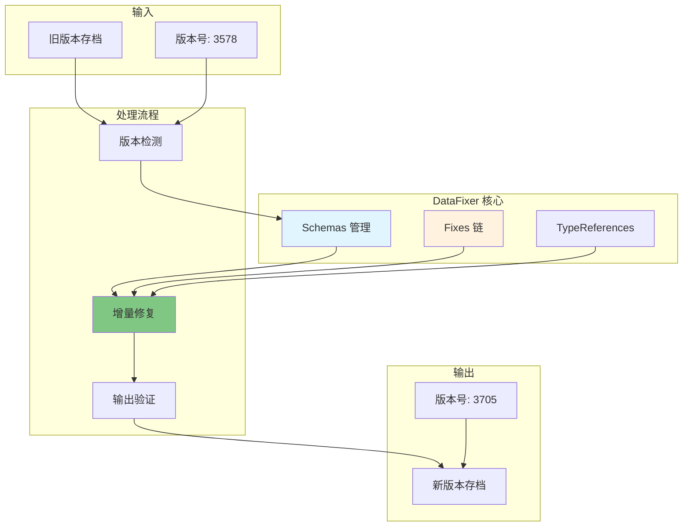
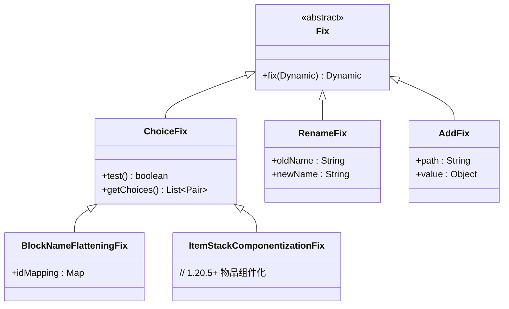

# 第 62 章：数据修复系统（DataFixer）

> 本章将深入解析 Minecraft 的 DataFixer 系统，理解游戏如何在版本升级时自动修复旧存档的数据。

## 章节目标

- 理解 DataFixer 的设计理念
- 掌握 Schema 和 Fix 的概念
- 了解增量修复的工作原理
- 能够编写自定义 Fix

## 前置知识

- 熟悉 NBT 数据格式
- 了解 Minecraft 版本历史
- 知道什么是序列化/反序列化

## 核心概念

### 数据修复 = 旧书翻新

想象 DataFixer 是一位古籍修复师：

```
┌─────────────────────────────────────────────────────────────────┐
│                     DataFixer 工作原理                             │
├─────────────────────────────────────────────────────────────────┤
│                                                                     │
│  旧版本存档 (如 1.20)                                           │
│  ┌─────────────────────────────────────────────────────────┐   │
│  │ {                                                          │   │
│  │   "id": 95,           ← 旧格式：数字ID              │   │
│  │   "Enchantments": [    ← 旧格式：无命名空间           │   │
│  │     {id: 16, lvl: 1}                                   │   │
│  │   ]                                                          │   │
│  │ }                                                          │   │
│  └─────────────────────────────────────────────────────────┘   │
│                              │                                        │
│                              ▼ DataFixer 逐版本修复 ▼              │
│                              │                                        │
│  ┌─────────────────────────────────────────────────────────┐   │
│  │ Step 1: 1.20 → 1.20.1                                  │   │
│  │ Step 2: 1.20.1 → 1.21                                    │   │
│  │ Step 3: 1.21 → 1.21.1                                    │   │
│  └─────────────────────────────────────────────────────────┘   │
│                              │                                        │
│                              ▼                                        │
│  新版本存档 (1.21)                                               │
│  ┌─────────────────────────────────────────────────────────┐   │
│  │ {                                                          │   │
│  │   "id": "minecraft:light_block",  ← 新格式：命名空间ID   │   │
│  │   "Enchantments": [    ← 新格式：有命名空间              │   │
│  │     {id: "minecraft:sharpness", lvl: 1}                │   │
│  │   ]                                                          │   │
│  │ }                                                          │   │
│  └─────────────────────────────────────────────────────────┘   │
│                                                                     │
└─────────────────────────────────────────────────────────────────┘
```

**关键比喻**：
- Schema = 古籍的"装订规则"
- Fix = 修复师的"修复技巧"
- 增量修复 = 逐页翻新旧书，一页一页修复
- TypeReference = 书籍的"分类标签"

---

## 1. DataFixer 概述

### 1.1 为什么需要 DataFixer

Minecraft 经历了无数次版本更新，数据结构发生了变化：

| 版本 | 重大变化 | 数据格式变化 |
|------|----------|--------------|
| 1.13 | 方块状态系统 | 数字ID → 命名空间ID |
| 1.14 | 村民职业重构 | 完全重写村民数据 |
| 1.17 | 洞穴与山峰 | 世界高度扩展 |
| 1.19 | 幽匿系统 | 新增幽匿方块和实体 |
| 1.20 | 自定义交易 | 交易格式重构 |
| 1.21 | 物品组件化 | 物品数据组件化 |

### 1.2 DataFixer 核心目标

```
1️⃣ 确保旧世界数据可以加载到新版本
2️⃣ 保持游戏逻辑的向后兼容性
3️⃣ 支持增量版本迁移（可以跳过多个版本）
4️⃣ 自动化数据转换减少手动修复
```

---

## 2. 架构设计

### 2.1 整体架构图



### 2.2 核心组件

```
┌─────────────────────────────────────────────────────────────────┐
│                      DataFixer 组件                                │
├─────────────────────────────────────────────────────────────────┤
│                                                                     │
│  Schemas (数据模式)                                               │
│  ├── 定义每个版本的数据结构                                        │
│  └── 用于验证和导航数据                                           │
│                                                                     │
│  Fixes (修复器)                                                   │
│  ├── 实际执行数据转换的组件                                       │
│  └── 分为 ChoiceFix、RenameFix、AddFix 等                        │
│                                                                     │
│  TypeReferences (类型引用)                                         │
│  ├── 强类型的数据引用                                             │
│  └── 如 PLAYER、CHUNK、BLOCK_ENTITY 等                          │
│                                                                     │
│  DataFixerUpper (修复器上层)                                      │
│  ├── 编排整个修复流程                                             │
│  └── 支持增量修复                                                 │
│                                                                     │
└─────────────────────────────────────────────────────────────────┘
```

### 2.3 Schema 版本链

```
Schema 1343 (1.8)
    ↓
Schema 1451 (1.9)
    ↓
Schema 1631 (1.14)
    ↓
Schema 2202 (1.15)
    ↓
Schema 2586 (1.16)
    ↓
Schema 3120 (1.17)
    ↓
Schema 3465 (1.19)
    ↓
Schema 3578 (1.20)
    ↓
Schema 3705 (1.21) ← 当前版本
```

---

## 3. Schema 系统

### 3.1 Schema 定义示例

```java
// Schema1460.java - 1.14.4 版本的 Schema
public class Schema1460 extends Schema {
    
    public Schema1460(int versionKey, Schema parent) {
        super(versionKey, parent);
    }
    
    public void registerTypes(SchemaFactory factory) {
        // 注册类型定义
        factory.registerSimple(
            new LazyTypeReference("Level"), 
            () -> DSL.and(
                DSL.fields("Level",
                    DSL.optionalFields("Player", TypeReferences.PLAYER)
                )
            )
        );
        
        // 注册方块类型
        factory.registerSimple(
            new LazyTypeReference("BlockEntity"), 
            () -> DSL.fields("BlockEntity",
                TypeReferences.BLOCK_ENTITY.in(p -> p.get("id"))
            )
        );
    }
}
```

### 3.2 DSL 类型定义

```java
// 基本类型
DSL::remainder      // 保留所有未处理的字段
DSL::optionalFields  // 可选字段
DSL::fields         // 必需字段
DSL::choice         // 联合类型

// 类型引用
TypeReferences.PLAYER           // 玩家类型
TypeReferences.BLOCK_ENTITY     // 方块实体类型
TypeReferences.ITEM_STACK       // 物品堆叠类型

// 约束
DSL.constType(TypeSerializer)  // 常量类型
DSL.enumType(Class)            // 枚举类型
```

---

## 4. Fix 系统

### 4.1 Fix 类型层次



### 4.2 ChoiceFix 实现

```java
// ChoiceFix.java
public class ChoiceFix extends Fix {
    
    private final Type<?> type;
    private final List<Pair<TypeChoiceFix, UnaryOperator>> choices;
    
    @Override
    public Dynamic<?> fix(Dynamic<?> data) {
        // 根据条件选择不同的修复策略
        String type = data.get("id").asString("");
        for (Pair<TypeChoiceFix, UnaryOperator> choice : choices) {
            if (choice.getFirst().test(data)) {
                return choice.getSecond().apply(data);
            }
        }
        return data;
    }
}
```

### 4.3 注册修复

```java
// 在 Schema 中注册修复
public class Schema1629 extends Schema {
    
    @Override
    public void registerFixes(FixerUpper upper) {
        // 注册方块名修复
        this.registerFix(
            upper, 
            "Block Name", 
            new BlockNameFlatteningFix(this)
        );
        
        // 注册物品ID修复
        this.registerFix(
            upper, 
            "Item Id", 
            new ItemIdFix(this)
        );
    }
}
```

---

## 5. 版本管理

### 5.1 版本常量

```java
// SharedConstants.java
public class SharedConstants {
    
    // 当前数据版本
    public static final int CURRENT_DATA_VERSION = 3705;
    
    // 版本历史（部分）
    // 1.13: 1515
    // 1.14: 1631
    // 1.15: 2202
    // 1.16: 2586
    // 1.17: 3120
    // 1.18: 3120
    // 1.19: 3465
    // 1.20: 3578
    // 1.21: 3705
}
```

### 5.2 增量修复

```java
// 增量修复原理
public Dynamic<?> update(
    DynamicOps ops, 
    Dynamic input, 
    int version, 
    int targetVersion
) {
    if (version >= targetVersion) {
        return input;  // 无需修复
    }
    
    Dynamic current = input;
    // 逐版本修复
    for (int v = version; v < targetVersion; v++) {
        Fix fix = getFix(v);
        current = fix.fix(current);
    }
    return current;
}
```

---

## 6. 常见修复类型

### 6.1 方块名扁平化 (1.13)

```java
// BlockNameFlatteningFix.java
public class BlockNameFlatteningFix extends ChoiceFix {
    
    // 映射表: 数字ID -> 字符串ID
    // 1 -> "minecraft:air"
    // 2 -> "minecraft:stone"
    // ...
    
    @Override
    public Dynamic<?> fix(Dynamic<?> data) {
        // 将 "id" 字段从整数转换为字符串
        int id = data.get("id").asInt(0);
        String name = getBlockName(id);
        return data.set("id", data.createString(name));
    }
}
```

### 6.2 附魔格式修复

```java
// ItemStackEnchantmentFix.java

// 1.12 格式: {ench: [{id: 16, lvl: 1}]}
// 1.13+ 格式: {Enchantments: [{id: "minecraft:sharpness", lvl: 1}]}

@Override
public Dynamic<?> fix(Dynamic<?> data) {
    // 提取旧格式数据
    ListTag ench = data.get("ench").asList();
    
    // 转换为新格式
    ListTag newEnch = new ListTag();
    for (Tag tag : ench) {
        int oldId = ((IntTag) tag.get("id")).asInt();
        int level = ((IntTag) tag.get("lvl")).asInt();
        
        String newId = convertEnchantmentId(oldId);
        
        CompoundTag newTag = new CompoundTag();
        newTag.put("id", StringTag.of("minecraft:" + newId));
        newTag.put("lvl", IntTag.of(level));
        
        newEnch.add(newTag);
    }
    
    return data.remove("ench").set("Enchantments", newEnch);
}
```

---

## 7. 实战演示

### 7.1 自定义 Fix 开发

```java
// 1. 创建自定义修复类
public class ModBlockRenameFix extends ChoiceFix {
    private final Map<String, String> blockRenames;

    public ModBlockRenameFix(Schema schema, int version,
                             Map<String, String> blockRenames) {
        super(schema, false, "mod_block_rename", 
              References.BLOCK_ENTITY, version);
        this.blockRenames = blockRenames;
    }

    @Override
    protected TypeRewriteRule makeRule() {
        return this.facade.getChoiceType(
            References.BLOCK_ENTITY,
            this.getVersionKey()
        ).revision(this.fromVersion()).type().xpath(
            this.xpath("d/@id")
        ).visit(
            XpatHVisitor.fromChanger(
                pair -> pair.mapFirst(name -> {
                    String oldName = name.asString("");
                    String newName = blockRenames.getOrDefault(oldName, oldName);
                    return name.equals(oldName) ?
                        name.createString(newName) : name;
                })
            )
        );
    }
}
```

### 7.2 测试 DataFixer

```java
@Test
public void testDataFixerMigration() {
    // 创建旧版本数据
    NbtCompound oldData = createOldVersionData();
    
    // 创建修复器
    DataFixerUpper fixer = createDataFixer();
    
    // 执行修复
    NbtCompound migratedData = fixer.update(
        References.STRUCTURE,
        new Dynamic<>(NbtOps.INSTANCE, oldData),
        MIN_VERSION,
        CURRENT_DATA_VERSION
    ).getValue();
    
    // 验证修复结果
    assertEquals("minecraft:new_block",
        migratedData.getString("BlockId"));
}
```

---

## 8. 课后自查

- [ ] 能够解释 DataFixer 的设计理念
- [ ] 理解 Schema 和 Fix 的区别
- [ ] 掌握增量修复的工作原理
- [ ] 了解常见的修复类型
- [ ] 能够编写简单的自定义 Fix

---

**参考源码路径**：

```
D:\Minecraft-Learning\assets\mc\1.21\net\minecraft\datafixer\Schemas.java
D:\Minecraft-Learning\assets\mc\1.21\net\minecraft\datafixer\Fixes.java
D:\Minecraft-Learning\assets\mc\1.21\net\minecraft\datafixer\TypeReferences.java
```
