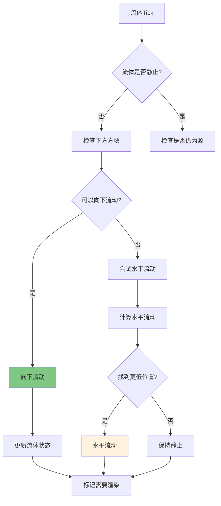

# 第 63 章：流体系统（Fluid System）

> 本章将深入解析 Minecraft 的流体系统，理解水、岩浆等液体的流动算法和渲染机制。

## 章节目标

- 理解流体状态机的设计
- 掌握流动算法原理
- 了解流体与实体的交互
- 学会自定义流体类型

## 前置知识

- 熟悉 Minecraft 区块和方块的概念
- 了解 TickScheduler 基础
- 知道什么是 AABB 碰撞

## 核心概念

### 流体 = 水往低处流的自然规律

想象流体系统是一位遵循物理定律的舞者：

```
┌─────────────────────────────────────────────────────────────────┐
│                      流体流动原理                                    │
├─────────────────────────────────────────────────────────────────┤
│                                                                     │
│  流动优先级:                                                       │
│                                                                     │
│  1️⃣ 向下流动（最高优先级）                                           │
│     ┌─────────┐                                                    │
│     │  Water  │                                                    │
│     │    ↓    │ ← 检测正下方方块                                    │
│     │  Air    │                                                    │
│     └─────────┘                                                    │
│                                                                     │
│  2️⃣ 水平流动（第二优先级）                                           │
│     ┌────┬────┬────┐                                               │
│     │    │ Air│    │                                               │
│     ├────┼────┼────┤                                               │
│     │Water│ → │Air │ ← 水平传播                                     │
│     └────┴────┴────┘                                               │
│                                                                     │
│  3️⃣ 斜向流动（最低优先级）                                          │
│     ┌────┬────┬────┐                                               │
│     │Air │Air │    │                                               │
│     ├────┼────┼────┤                                               │
│     │Water│ ↘ │Air │ ← 斜向传播（更慢）                             │
│     └────┴────┴────┘                                               │
│                                                                     │
└─────────────────────────────────────────────────────────────────┘
```

**关键比喻**：
- Fluid = 舞蹈的"舞者"
- FluidState = 舞者的"当前姿势"
- FlowableFluid = 舞者的"流动能力"
- 流动方向 = 舞者移动的"方向"

---

## 1. 流体系统概述

### 1.1 流体类型

```
┌─────────────────────────────────────────────────────────────────┐
│                         流体类型分类                                 │
├─────────────────────────────────────────────────────────────────┤
│                                                                     │
│  ┌─────────────────────────┐    ┌─────────────────────────┐      │
│  │        Water           │    │         Lava             │      │
│  │      (水资源)            │    │       (岩浆)             │      │
│  └───────────┬─────────────┘    └───────────┬─────────────┘      │
│              │                              │                       │
│  ┌───────────┴─────────────┐    ┌───────────┴─────────────┐      │
│  │     Still Water        │    │      Still Lava         │      │
│  │     Flowing Water      │    │      Flowing Lava      │      │
│  │     Waterlogged Blocks │    │     (普通/流动)           │      │
│  └─────────────────────────┘    └─────────────────────────┘      │
│                                                                     │
│  ┌───────────────────────────────────────────────────────────┐  │
│  │                    FluidType 抽象层                            │  │
│  │           (支持模组自定义流体: Milk, Blood, etc.)          │  │
│  └───────────────────────────────────────────────────────────┘  │
│                                                                     │
└─────────────────────────────────────────────────────────────────┘
```

### 1.2 流体属性对比

| 属性 | Water | Lava | 说明 |
|------|-------|------|------|
| 流动速度 | 5 | 3 | 数值越大流动越快 |
| 密度 | 1000 | 3000 | 影响实体下沉速度 |
| 阻力 | 0.8 | 0.5 | 移动速度衰减系数 |
| 伤害 | 0 | 4 | 对实体的伤害值 |
| 发光 | false | true | 是否发光 |
| 无限源 | true | false | 是否支持无限源 |

---

## 2. 核心类详解

### 2.1 Fluid 类

```java
// Fluid.java
public class Fluid {
    // 流体状态注册表
    public static final Registry<Fluid> REGISTRY = Registries.FLUID;
    
    // 流体属性
    private final Map<Direction, FluidState> flowingStates = new Reference2RefMap();
    private final Map<Direction, FluidState> stillStates = new Reference2RefMap();
    private final FlowableFluid container = this.getFluidType();
    
    // 流体高度
    private final int height;
    private final int maxHeight;
    private final boolean still;
    private final boolean infinite;
    
    // 物理属性
    private final RegistryEntry<Attribute> attribute;
}
```

### 2.2 FluidState 类

```java
// FluidState.java
public class FluidState implements State<FluidState, Fluid> {
    // 流体状态数据
    private final Fluid fluid;
    private final int level;           // 高度等级 (0-8)
    private final boolean infinite;
    private final VoxelShape shape;
    
    public FluidState(Fluid fluid, int level, boolean infinite) {
        this.fluid = fluid;
        this.level = level;
        this.infinite = infinite;
        this.shape = this.calculateShape();
    }
    
    // 8级高度系统
    public boolean isStill() {
        return this.level >= 8;  // level >= 8 表示静止
    }
    
    public int getLevel() {
        return this.level;
    }
}
```

### 2.3 8 级高度系统

```
┌─────────────────────────────────────────────────────────────────┐
│                       8级高度系统                                   │
├─────────────────────────────────────────────────────────────────┤
│                                                                     │
│  Level 8: ████████████████████████████████  完全充满             │
│  Level 7: ██████████████████████████████░░░  7/8 高度           │
│  Level 6: ███████████████████████████░░░░░  6/8 高度           │
│  Level 5: ███████████████████████░░░░░░░░  5/8 高度           │
│  Level 4: ████████████████░░░░░░░░░░░░░  4/8 高度           │
│  Level 3: ███████████░░░░░░░░░░░░░░░░░░  3/8 高度           │
│  Level 2: ████░░░░░░░░░░░░░░░░░░░░░░░░  2/8 高度           │
│  Level 1: ██░░░░░░░░░░░░░░░░░░░░░░░░░░  1/8 高度           │
│  Level 0: ░░░░░░░░░░░░░░░░░░░░░░░░░░░░  空                 │
│                                                                     │
└─────────────────────────────────────────────────────────────────┘
```

---

## 3. 流动算法

### 3.1 流动算法流程图



### 3.2 流动计算核心

```java
// FlowableFluid.java
protected int calculateFlowDirection(WorldAccess world, BlockPos pos, Direction direction) {
    // 获取流体高度
    int thisHeight = this.getHeight(world.getFluidState(pos));
    
    // 尝试所有相邻位置
    int minHeight = Integer.MAX_VALUE;
    
    for (Direction dir : DIRECTIONS) {
        if (dir == direction.getOpposite()) continue;  // 跳过上游
        
        BlockPos neighbourPos = pos.offset(dir);
        FluidState neighbourState = world.getFluidState(neighbourPos);
        
        if (this.canFlow(world, pos, neighbourPos, dir, neighbourState)) {
            int neighbourHeight = this.getHeight(neighbourState);
            minHeight = Math.min(minHeight, neighbourHeight);
        }
    }
    
    return Math.min(minHeight + this.getFlowSpeed(world, pos, 
                   world.getBlockState(pos), world.getFluidState(pos)), 
                   this.getMaxHeight());
}
```

### 3.3 流动规则

```java
// FlowableFluid.java
protected boolean canFlow(WorldAccess world, BlockPos fromPos, BlockPos toPos, 
                          Direction direction, FluidState fluidState) {
    // 1. 检查是否可以流向该位置
    BlockState toState = world.getBlockState(toPos);
    
    if (!toState.isAir() && !this.isSame(fluidState) && 
        !toState.canBeReplacedForFluidTest(world, toPos, direction)) {
        return false;
    }
    
    // 2. 检查是否有阻挡
    if (toState.getBlock() instanceof FenceBlock || 
        toState.getBlock() instanceof WallBlock) {
        return direction == Direction.UP;  // 只有向上可以穿过栅栏/墙
    }
    
    // 3. 检查流体属性
    FluidState fromState = world.getFluidState(fromPos);
    if (fluidState.isEmpty()) {
        return true;
    }
    
    return !fluidState.isStill() && this.isSame(fluidState);
}
```

---

## 4. 无限流体源机制

### 4.1 无限源原理

```java
// FlowableFluid.java
public boolean isInfinite(FluidState state, WorldView world, BlockPos pos) {
    // 无限流体源的条件：
    // 1. 流体高度 >= 8（静止状态）
    // 2. 有两个或更多的相邻无限源
    
    if (state.getLevel() < 8) {
        return false;
    }
    
    int sourceCount = 0;
    for (Direction direction : Direction.Type.HORIZONTAL) {
        BlockPos neighbour = pos.offset(direction);
        FluidState neighbourState = world.getFluidState(neighbour);
        if (neighbourState.getFluid().equals(this) && neighbourState.getLevel() >= 8) {
            sourceCount++;
            if (sourceCount >= 2) {
                return true;
            }
        }
    }
    
    return false;
}
```

### 4.2 无限源示意图

```
┌─────────────────────────────────────────────────────────────────┐
│                       无限水源机制                                    │
├─────────────────────────────────────────────────────────────────┤
│                                                                     │
│  情况 1: 两个水源相邻                                             │
│  ┌────┬────┬────┐                                               │
│  │    │ 水 │    │                                               │
│  ├────┼────┼────┤                                               │
│  │    │ 水 │    │ ← 两个水源相连，形成无限源                       │
│  └────┴────┴────┘                                               │
│                                                                     │
│  情况 2: 单个水源                                                │
│  ┌────┬────┬────┐                                               │
│  │    │    │    │                                               │
│  ├────┼────┼────┤                                               │
│  │    │ 水 │    │ ← 单个水源，不会产生无限水流                     │
│  └────┴────┴────┘                                               │
│                                                                     │
└─────────────────────────────────────────────────────────────────┘
```

---

## 5. 流体与实体交互

### 5.1 水对实体的效果

```java
// WaterFluid.java
public void onEntityCollision(FluidState state, World world, BlockPos pos, 
                               Entity entity) {
    // 水对实体的效果
    entity.setOnGround(true);
    
    // 减速效果
    if (entity.isSprinting()) {
        entity.setSprinting(false);
    }
    
    // 溺水伤害检测
    if (entity instanceof LivingEntity living) {
        if (entity.getBlockStateAtPos().isOf(Blocks.WATER) && 
            entity.getAirBicycle() < 0) {
            // 溺水处理
        }
    }
}
```

### 5.2 岩浆伤害

```java
// LavaFluid.java
public void onEntityCollision(FluidState state, World world, BlockPos pos, 
                               Entity entity) {
    if (!world.isClient()) {
        entity.setOnFire(true);
        entity.damage(world, DamageTypes.IN_WALL, DAMAGE);
    }
    
    // 减少岩浆中的移动速度
    entity.setVelocity(entity.getVelocity().multiply(0.8, 0.9, 0.8));
}
```

---

## 6. 自定义流体

### 6.1 创建自定义流体

```java
// MilkFluid.java
public class MilkFluid extends FlowableFluid {
    
    @Override
    protected void beforeBreakingInWorld(World world, BlockPos pos, BlockState state) {
        // 自定义破碎逻辑
    }

    @Override
    protected boolean canBreak(World world, BlockPos pos, BlockState state) {
        return false;
    }

    @Override
    protected int getFlowSpeed(World world, BlockPos pos, BlockState state, FluidState fluidState) {
        return 4;  // 比水慢一点
    }

    @Override
    public int getLevel(FluidState state) {
        return state.isStill() ? 8 : state.getLevel();
    }

    @Override
    public boolean isFluidStateless() {
        return false;
    }
}
```

### 6.2 注册自定义流体

```java
// 流体注册
public class FluidRegistry {
    public static final FlowableFluid MILK = Registry.register(
        Registries.FLUID,
        new Identifier("modid", "milk"),
        new MilkFluid()
    );
    
    public static final Block MILK_BLOCK = Registry.register(
        Registries.BLOCK,
        new Identifier("modid", "milk_block"),
        new FluidBlock(MILK, FabricBlockSettings.copy(Blocks.WATER))
    );
}
```

---

## 7. 性能优化

### 7.1 流动冷却机制

```java
// 1. 流动冷却机制 - 流体不会每tick都计算流动
protected static final int FLOW_TICK_RATE = 5;

// 2. 距离衰减 - 远离源的流体更新频率降低
protected int getFlowSpeed(World world, BlockPos pos, BlockState state, FluidState fluidState) {
    int distanceFromSource = calculateDistanceFromSource(world, pos, fluidState);
    return Math.max(1, FLOW_SPEED - distanceFromSource / 8);
}

// 3. 距离检查 - 超出范围的流体停止更新
public static int getTickRate(World world, BlockPos pos) {
    int playerDistance = world.getClosestPlayerDistance(pos);
    if (playerDistance > 64) {
        return Integer.MAX_VALUE;  // 停止更新
    } else if (playerDistance > 32) {
        return 40;  // 降低频率
    } else {
        return FLOW_TICK_RATE;  // 正常频率
    }
}
```

---

## 8. 课后自查

- [ ] 能够解释流体状态机的设计理念
- [ ] 理解 8 级高度系统的意义
- [ ] 掌握流动算法的优先级
- [ ] 了解无限源机制的工作原理
- [ ] 能够创建自定义流体类型

---

**参考源码路径**：

```
D:\Minecraft-Learning\assets\mc\1.21\net\minecraft\fluid\Fluid.java
D:\Minecraft-Learning\assets\mc\1.21\net\minecraft\fluid\FluidState.java
D:\Minecraft-Learning\assets\mc\1.21\net\minecraft\fluid\FlowableFluid.java
D:\Minecraft-Learning\assets\mc\1.21\net\minecraft\fluid\WaterFluid.java
D:\Minecraft-Learning\assets\mc\1.21\net\minecraft\fluid\LavaFluid.java
```
