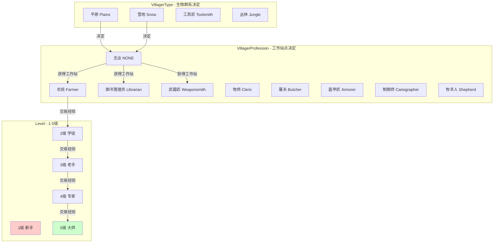
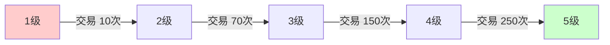
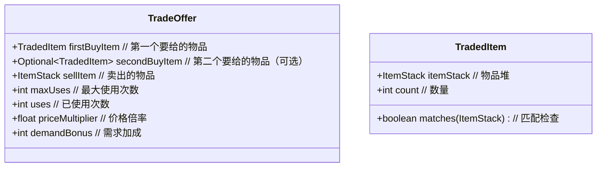
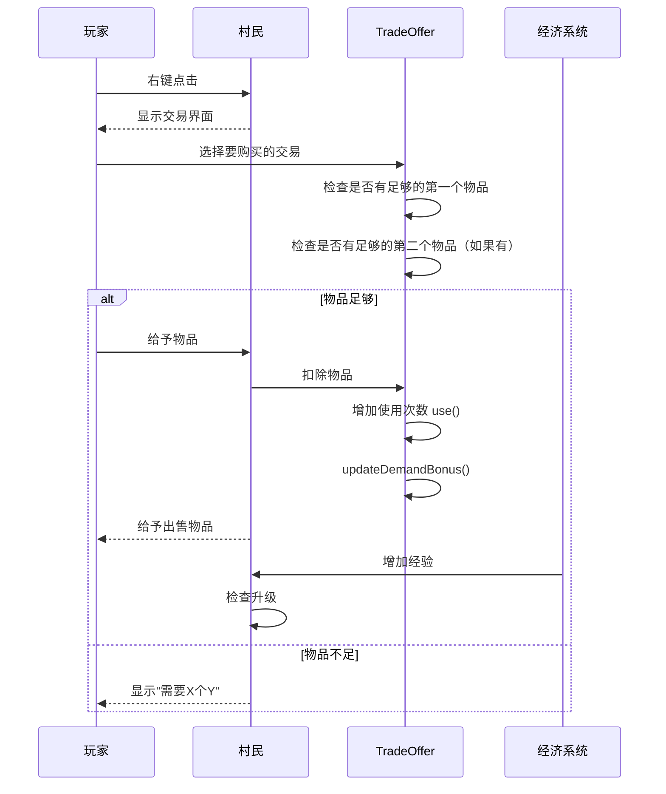
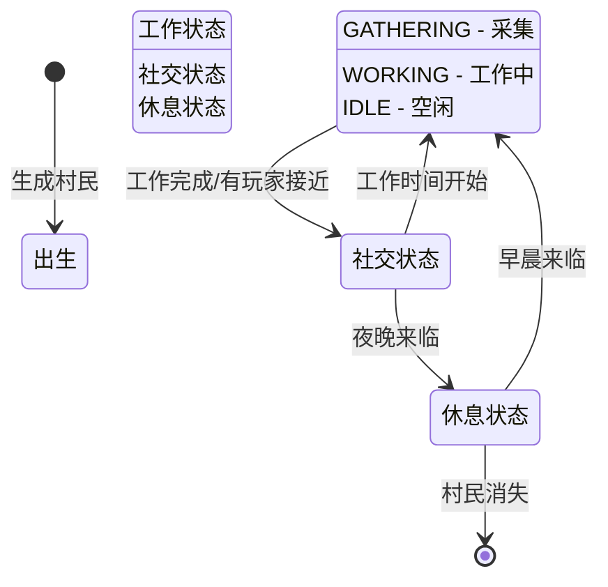

# 第 64 章：村民系统（Village System）

## 目标

- 理解村民系统的组成
- 掌握村民职业和等级机制
- 了解交易系统的运作
- 认识村民AI的基本原理

## 前置知识

- 生物 AI 基础（第 27～33 章）
- 实体系统（第 20～26 章）
- 物品和容器（第 17～19 章）

## 核心概念

### 村民系统是什么？

把村民系统想象成一个**小镇的居民区**：

```
┌────────────────────────────────────────┐
│              村庄 (Village)             │
├────────────────────────────────────────┤
│                                        │
│   🏠 建筑设施      🧑‍🌾 村民职业           │
│   ├─ 铁匠铺    →   武器匠              │
│   ├─ 图书馆    →   图书管理员          │
│   ├─ 农场      →   农民                │
│   └─ 教堂      →   牧师                │
│                                        │
│   💼 交易系统      ⬆️ 等级系统           │
│   ├─ 买        →   经验升级            │
│   ├─ 卖        →   解锁更好交易        │
│   └─ 特殊      →   专属商品            │
│                                        │
└────────────────────────────────────────┘
```

### 村民职业

村民有多种职业，每种职业在特定地点工作：

| 职业 | 工作站点 | 可交易物品 |
|------|---------|-----------|
| 农民 | 堆肥桶 | 小麦、面包、曲奇 |
| 图书管理员 | 书架 | 书籍、附魔书 |
| 武器匠 | 高炉 | 钻石装备、附魔武器 |
| 工具匠 | 工作台 | 钻石工具 |
| 牧师 | 讲道台 | 下界物品、附魔书 |
| 商人 | 绿宝石 | 各种物品 |
| 渔民 |  barrels | 鱼、灯笼 |
| 牧羊人 | 围栏 | 羊毛、羊 |
| 皮匠 | 大锅 | 皮革装备 |

## 图解：村民职业系统



## 村民等级系统

### 升级所需经验



### VillagerData 数据结构

```java
public class VillagerData {
    // 最小/最大等级
    public static final int MIN_LEVEL = 1;
    public static final int MAX_LEVEL = 5;
    
    // 每级所需经验
    private static final int[] LEVEL_BASE_EXPERIENCE = {
        0,    // 1级所需
        10,   // 2级所需
        70,   // 3级所需
        150,  // 4级所需
        250   // 5级所需
    };
    
    private final VillagerType type;       // 村民类型（生物群系）
    private final VillagerProfession profession;  // 职业
    private final int level;              // 等级 1-5
    
    public int getLevel() {
        return this.level;
    }
}
```

## 交易系统

### 交易结构



### 交易流程



### 价格动态调整

```
基础价格 = 首次购买时的价格

当前价格 = 基础价格 × (1 + 需求加成/100) + 特殊加成

需求加成 = 已使用次数 - (最大使用次数 - 已使用次数)
```

例如：
- 最大使用次数 = 12
- 已使用 4 次
- 需求加成 = 4 - (12 - 4) = -4
- 需求为负 → 价格降低！

## 村民AI

### 村民行为状态机



### 村民AI特点

1. **寻找工作站**：村民会寻找与职业匹配的工作站点
2. **社交**：村民会聚集在一起聊天
3. **生育**：满足条件时村民会生小村民
4. **记忆**：村民会记住重要的位置（如床、工作站）

## 核心代码

### 村民数据

```java
// 创建村民数据
VillagerData data = new VillagerData(
    VillagerType.PLAINS,      // 村民类型
    VillagerProfession.FARMER, // 职业
    1                         // 等级
);

// 升级村民
data = data.withLevel(2);

// 更换职业
data = data.withProfession(VillagerProfession.BUTCHER);
```

### 职业注册

```java
// 注册新职业
public static final VillagerProfession MY_JOB = VillagerProfession.register(
    "my_mod:my_job",                    // 职业ID
    PointOfInterestTypes.MASON,          // 工作站点类型
    SoundEvents.ENTITY_VILLAGER_WORK      // 工作音效
);

// 也可以指定次级工作站点
public static final VillagerProfession FARMER = VillagerProfession.register(
    "farmer",
    PointOfInterestTypes.FARMER,
    ImmutableSet.of(Items.WHEAT, Items.WHEAT_SEEDS),  // 可收集物品
    ImmutableSet.of(Blocks.FARMLAND),                   // 次级工作站点
    SoundEvents.ENTITY_VILLAGER_WORK_FARMER
);
```

### 交易生成

```java
// 使用 TradeOffers 工厂方法
public static List<TradeOffer> forEmerald(int uses, int maxUses) {
    return List.of(
        new TradeOffer(
            new TradedItem(Items.WHEAT, 20),        // 买20个小麦
            new ItemStack(Items.EMERALD, 1),        // 卖1个绿宝石
            maxUses,
            uses,
            0.05f                                   // 价格倍率
        )
    );
}
```

## 实战演示：创建自定义村民职业

```java
// 1. 创建工作站类型
public class MyModPOI {
    public static final PointOfInterestType MY_WORKSTATION = 
        PointOfInterestType.register(
            "my_mod:my_workstation",
            PointOfInterestTypes.MASON,  // 继承 mason 的搜寻范围
            1,                            // 搜索距离
            ImmutableSet.of(Blocks.MY_BLOCK)
        );
}

// 2. 创建职业
public static final VillagerProfession MY_PROFESSION = 
    VillagerProfession.register(
        "my_mod:my_profession",
        RegistryKey.of(RegistryKeys.POINT_OF_INTEREST_TYPE, 
            new Identifier("my_mod", "my_workstation")),
        SoundEvents.ENTITY_VILLAGER_WORK
    );

// 3. 注册职业交易
@Override
public void onCommonSetup(SetupServerEvent event) {
    VillagerProfession MY_PROFESSION = MyModVillagers.MY_PROFESSION;
    
    TradeOfferLists.register(MY_PROFESSION, new TradeOffer[][]
        // 1级交易
        new TradeOffer[]{ createTrade() },
        // 2级交易
        new TradeOffer[]{ createTrade() },
        // ... 其他等级
    );
}
```

## 小结

```
┌─────────────────────────────────────────────────────────┐
│                    村民系统                              │
├─────────────────────────────────────────────────────────┤
│  村民类型 (VillagerType)：                               │
│  • 由生物群系决定外观                                    │
│  • 平原、雪地、热带草原、丛林                            │
│                                                         │
│  村民职业 (VillagerProfession)：                         │
│  • 由工作站决定                                         │
│  • 12种职业 + 无业                                      │
│                                                         │
│  村民等级 (Level)：                                     │
│  • 1-5级，通过交易获得经验                              │
│  • 每级有专属交易池                                     │
│                                                         │
│  交易系统 (TradeOffer)：                                 │
│  • 动态价格：需求越多价格越高                            │
│  • 使用次数限制                                         │
│  • 经验反馈                                             │
│                                                         │
│  村民AI：                                               │
│  • 工作 → 社交 → 休息 循环                              │
│  • 会聚集和社交                                         │
└─────────────────────────────────────────────────────────┘
```

## 练习

1. **思考题**：为什么村民的交易价格会随时间变化？

2. **实践题**：创建一个只卖下界物品的村民职业。

3. **调试题**：使用 `/data get entity @e[type=villager]` 查看村民的当前职业和等级。

4. **设计题**：设计一个"钻石交易商"职业，只能用绿宝石换钻石。

5. **进阶题**：如何让村民在特定条件下自动改变职业？

## 相关链接

- [Minecraft Wiki: Villager](https://minecraft.fandom.com/wiki/Villager)
- [Minecraft Wiki: Trading](https://minecraft.fandom.com/wiki/Trading)
- [Minecraft Wiki: Zombie Villager](https://minecraft.fandom.com/wiki/Zombie_Villager)
- 相关源码：
  - `net.minecraft.village.VillagerData`
  - `net.minecraft.village.VillagerProfession`
  - `net.minecraft.village.VillagerType`
  - `net.minecraft.village.TradeOffer`
  - `net.minecraft.village.TradeOffers`
  - `net.minecraft.village.Gossips`

---

### 源码文件位置

| 文件 | 源码路径 | 说明 |
|------|----------|------|
| VillagerEntity.java | `net/minecraft/entity/passive/VillagerEntity.java` | 村民实体 |
| VillagerData.java | `net/minecraft/village/VillagerData.java` | 村民数据（职业、等级、类型） |
| TradeOffers.java | `net/minecraft/village/TradeOffers.java` | 交易报价工厂类 |

---

**关键词**：Villager、VillagerData、TradeOffer、Profession、Level
