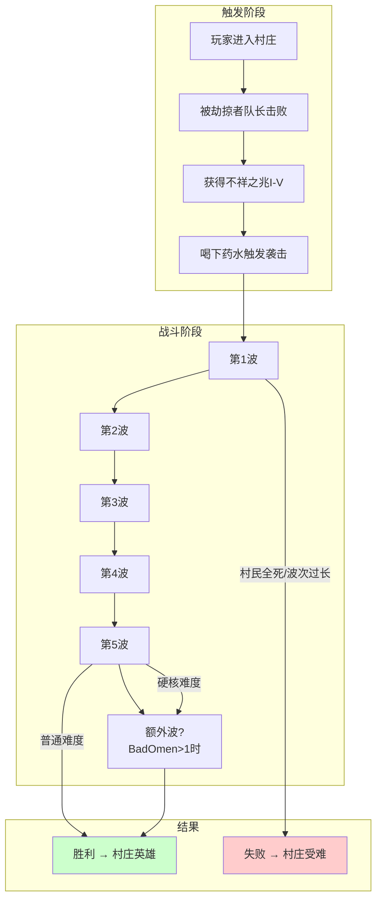
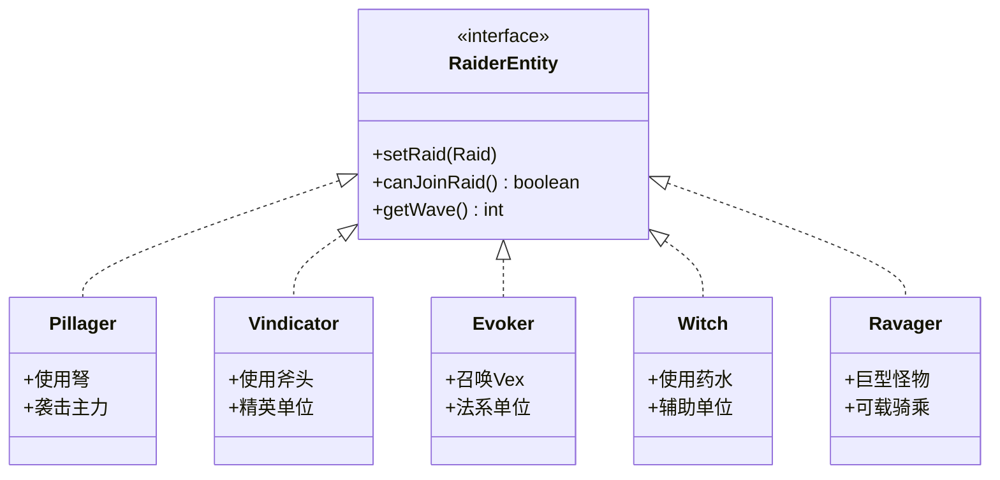
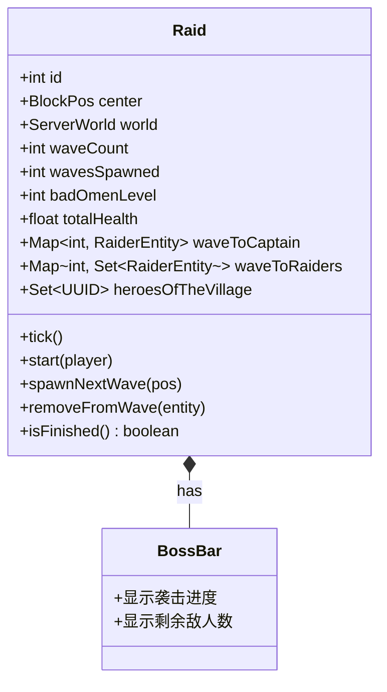
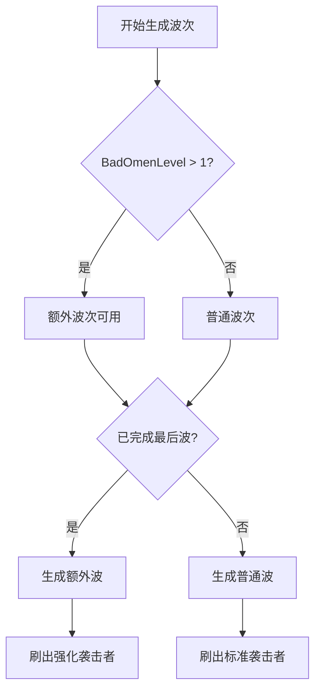

# 第 65 章：袭击系统（Raid System）

## 目标

- 理解袭击系统的概念
- 掌握 Raid 和 RaidManager 的关系
- 了解袭击波次的生成机制
- 认识胜利奖励"村庄英雄"效果

## 前置知识

- 村民系统（第 63 章）
- 实体生成系统
- 状态效果系统

## 核心概念

### 什么是袭击系统？

把袭击系统想象成**一场"怪物攻城战"**：

```
┌─────────────────────────────────────────────────────────┐
│                    袭击流程                              │
├─────────────────────────────────────────────────────────┤
│                                                         │
│  1️⃣ 触发条件                                           │
│     └─ 玩家进入村庄 + 获得"不祥之兆"效果                │
│                                                         │
│  2️⃣ 准备阶段                                           │
│     └─ 玩家喝掉不祥之兆 → 触发袭击                      │
│                                                         │
│  3️⃣ 战斗阶段                                           │
│     └─ 多波袭击生物攻击村庄                             │
│                                                         │
│  4️⃣ 结束阶段                                           │
│     ├─ 胜利：获得"村庄英雄"效果                         │
│     └─ 失败：村民受难，袭击终止                          │
│                                                         │
└─────────────────────────────────────────────────────────┘
```

### 不祥之兆效果

不祥之兆是一种特殊的药水效果：

| 等级 | 意义 |
|------|------|
| I 级 | 1波袭击 |
| II 级 | 2波袭击 |
| III 级 | 3波袭击 |
| IV 级 | 4波袭击 |
| V 级 | 5波袭击 + 额外奖励波 |

## 图解：袭击流程



### 袭击生物类型



## Raid 和 RaidManager

### Raid 类（单次袭击）



### RaidManager 类（管理所有袭击）

```java
// 管理世界上所有的袭击
public class RaidManager extends PersistentState {
    private Map<Integer, Raid> raids = new HashMap<>();
    private ServerWorld world;
    private int nextAvailableId;
    
    // 每tick更新所有袭击
    public void tick() {
        for (Raid raid : raids.values()) {
            raid.tick();
        }
    }
    
    // 开始新的袭击
    public Raid startRaid(ServerPlayerEntity player, BlockPos pos) {
        // 检查条件...
        Raid raid = getOrCreateRaid(player.getServerWorld(), pos);
        raid.start(player);
        return raid;
    }
}
```

## 袭击波次详解

### 波次配置

```java
// Raid.java 中的 Member 枚举
enum Member {
    VINDICATOR(EntityType.VINDICATOR, new int[]{0, 0, 2, 0, 1, 4, 2, 5}),
    EVOKER(EntityType.EVOKER, new int[]{0, 0, 0, 0, 0, 1, 1, 2}),
    PILLAGER(EntityType.PILLAGER, new int[]{0, 4, 3, 3, 4, 4, 4, 2}),
    WITCH(EntityType.WITCH, new int[]{0, 0, 0, 0, 3, 0, 0, 1}),
    RAVAGER(EntityType.RAVAGER, new int[]{0, 0, 0, 1, 0, 1, 0, 2});
}
```

### 波次数量（根据难度）

| 难度 | 波次数量 |
|------|---------|
| 和平 | 0 (不触发) |
| 简单 | 3 波 |
| 普通 | 5 波 |
| 困难 | 7 波 |

### 波次生成规则



## 村庄英雄效果

### 胜利奖励

当玩家成功击退所有袭击波次后，会获得**村庄英雄**效果：

```java
// 授予村庄英雄效果
StatusEffectInstance heroEffect = new StatusEffectInstance(
    StatusEffects.HERO_OF_THE_VILLAGE,  // 效果类型
    48000,                               // 持续时间 (40分钟)
    badOmenLevel - 1,                    // 效果等级
    false,                               // 环境效果
    false,                               // 粒子显示
    true                                 // 图标显示
);

entity.addStatusEffect(heroEffect);
```

### 村庄英雄效果属性

| 属性 | 描述 |
|------|------|
| 持续时间 | 40分钟（48000 tick） |
| 效果等级 | 等于不祥之兆等级 - 1 |
| 交易折扣 | 村民对英雄提供更低的交易价格 |

## 核心代码

### 开始袭击

```java
public boolean start(ServerPlayerEntity serverPlayerEntity) {
    StatusEffectInstance statusEffectInstance = 
        serverPlayerEntity.getStatusEffect(StatusEffects.RAID_OMEN);
    
    if (statusEffectInstance == null) {
        return false;  // 没有不祥之兆，无法开始
    }
    
    // 获取不祥之兆等级
    this.badOmenLevel += statusEffectInstance.getAmplifier() + 1;
    this.badOmenLevel = MathHelper.clamp(
        this.badOmenLevel, 
        0, 
        this.getMaxAcceptableBadOmenLevel()  // 最大5级
    );
    
    // 首次开始袭击
    if (!this.hasSpawned()) {
        serverPlayerEntity.incrementStat(Stats.RAID_TRIGGER);
        Criteria.VOLUNTARY_EXILE.trigger(serverPlayerEntity);
    }
    
    return true;
}
```

### 生成袭击者

```java
private void spawnNextWave(BlockPos pos) {
    int waveNumber = this.wavesSpawned + 1;
    this.totalHealth = 0.0f;
    
    // 遍历所有袭击者类型
    for (Member member : Member.VALUES) {
        // 计算该波次该类型数量
        int count = this.getCount(member, waveNumber, isExtraWave);
        count += this.getBonusCount(member, random, waveNumber, difficulty);
        
        // 生成每个袭击者
        for (int i = 0; i < count; i++) {
            RaiderEntity entity = member.type.create(world);
            
            // 第一只设置为巡逻队长
            if (!hasCaptain) {
                entity.setPatrolLeader(true);
                this.setWaveCaptain(waveNumber, entity);
                hasCaptain = true;
            }
            
            this.addRaider(waveNumber, entity, pos, false);
        }
    }
}
```

## 实战演示：触发和测试袭击

### 指令触发

```
/effect give @s minecraft:raid_omen 30 1
/gamerule doTraderGossip true
```

### 调试袭击状态

```java
// 获取当前位置的袭击
Raid raid = world.getRaidAt(player.getBlockPos(), 64);

// 检查袭击状态
if (raid != null) {
    raid.getBadOmenLevel();      // 获取不祥之兆等级
    raid.getGroupsSpawned();     // 已生成的波次
    raid.getRaiderCount();       // 当前敌人数
    raid.isFinished();           // 是否结束
}
```

## 小结

```
┌─────────────────────────────────────────────────────────┐
│                    袭击系统                              │
├─────────────────────────────────────────────────────────┤
│  触发流程：                                             │
│  进入村庄 → 被队长击杀 → 获得不祥之兆                   │
│  喝下药水 → 触发袭击                                    │
│                                                         │
│  袭击者类型：                                           │
│  • 烈焰人队长 - 标记玩家                               │
│  • 劫掠者 - 远程攻击                                   │
│  • 卫道士 - 近战精英                                   │
│  • 唤魔者 - 召唤Vex小兵                                │
│  • 女巫 - 药水支援                                     │
│  • 劫兽 - 巨型坐骑                                     │
│                                                         │
│  波次规则：                                             │
│  • 简单3波 / 普通5波 / 困难7波                         │
│  • 不祥之兆>1时有额外波次                              │
│  • 胜利获得村庄英雄效果                                 │
│                                                         │
│  持久化：                                               │
│  • RaidManager 管理所有袭击                             │
│  • 跨区块保存袭击数据                                   │
└─────────────────────────────────────────────────────────┘
```

## 练习

1. **思考题**：为什么不祥之兆最高只能到5级？

2. **实践题**：使用指令模拟一次完整的袭击流程。

3. **设计题**：如果要在Mod中添加一种新的袭击者单位，需要修改哪些代码？

4. **调试题**：观察袭击期间Boss血条的数值变化，理解波次切换逻辑。

5. **进阶题**：思考如何实现"围攻多个村庄"的机制。

## 相关链接

- [Minecraft Wiki: Raid](https://minecraft.fandom.com/wiki/Raid)
- [Minecraft Wiki: Bad Omen](https://minecraft.fandom.com/wiki/Bad_Omen)
- [Minecraft Wiki: Hero of the Village](https://minecraft.fandom.com/wiki/Hero_of_the_Village)
- 相关源码：
  - `net.minecraft.village.raid.Raid`
  - `net.minecraft.village.raid.RaidManager`
  - `net.minecraft.entity.raid.RaiderEntity`
  - `net.minecraft.world.GameRules.DISABLE_RAIDS`

---

### 源码文件位置

| 文件 | 源码路径 | 说明 |
|------|----------|------|
| Raid.java | `net/minecraft/village/raid/Raid.java` | 袭击事件类 |
| RaidManager.java | `net/minecraft/village/raid/RaidManager.java` | 袭击管理器 |
| RaidStatus.java | `net/minecraft/village/raid/RaidStatus.java` | 袭击状态枚举 |

---

**关键词**：Raid、BadOmen、HeroOfTheVillage、Raider
