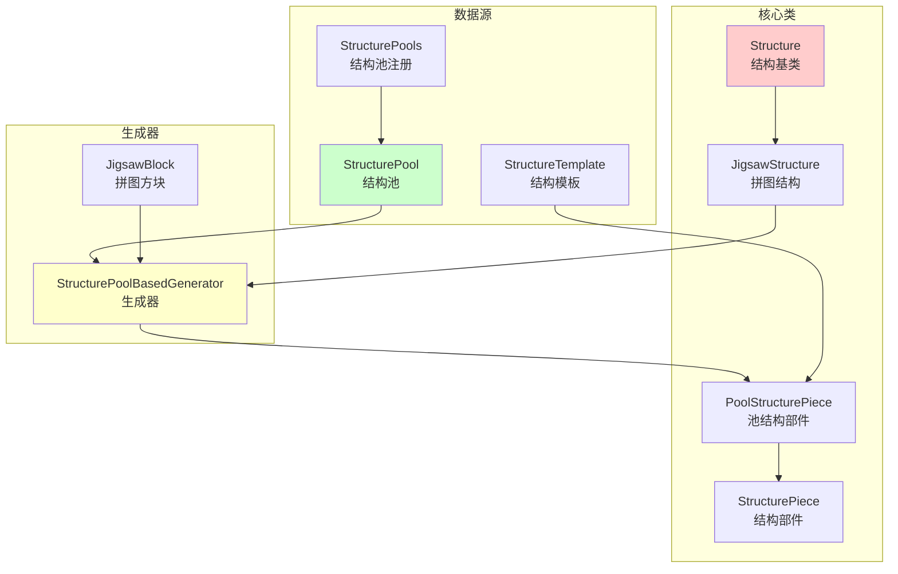
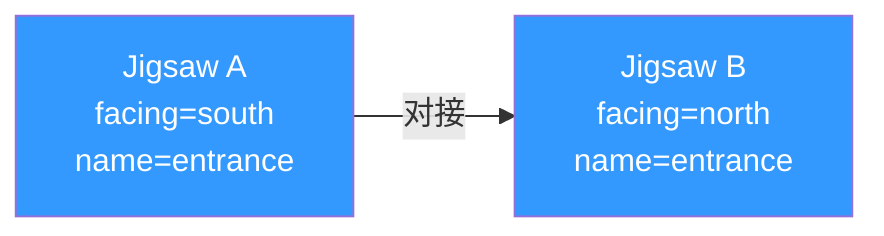

# 第 66 章：结构系统（Structure System）

## 目标

- 理解结构系统的概念
- 掌握 StructurePiece 的使用方法
- 了解 Jigsaw 拼图结构生成器
- 认识结构生成的完整流程

## 前置知识

- 世界生成基础
- 生物群系系统
- 方块放置系统

## 核心概念

### 什么是结构系统？

把 Minecraft 的结构系统想象成**乐高积木的拼装过程**：

```
┌─────────────────────────────────────────────────────────┐
│                 结构系统 = 乐高积木                      │
├─────────────────────────────────────────────────────────┤
│                                                         │
│  🔧 基础零件                                            │
│     └─ StructurePiece = 单个乐高块                     │
│                                                         │
│  🧩 拼图连接                                            │
│     └─ Jigsaw = 乐高凸起和凹槽                        │
│                                                         │
│  📦 零件库                                              │
│     └─ StructurePool = 乐高套装                         │
│                                                         │
│  🏗️ 拼装过程                                            │
│     └─ StructureGenerator = 拼装说明书                 │
│                                                         │
└─────────────────────────────────────────────────────────┘
```

### Minecraft 中的结构

| 结构 | 生成方式 | 示例 |
|------|---------|------|
| 沙漠神殿 | 预定义 | 单一块状结构 |
| 要塞 | Jigsaw | 由多个房间拼接 |
| 村庄 | Jigsaw | 由房屋+道路拼接 |
| 林地府邸 | Jigsaw | 由房间和走廊拼接 |
| 下界要塞 | Jigsaw | 随机走廊组合 |

## 图解：结构系统架构



### Jigsaw 结构生成流程

```mermaid
sequenceDiagram
    participant 世界 as WorldGen
    participant 结构 as JigsawStructure
    participant 生成器 as Generator
    participant 池 as StructurePool
    participant 模板 as StructureTemplate
    
    世界->>结构: 检查生物群系<br/>获取生成位置
    
    结构->>池: 获取起始池<br/>start_pool
    
    池->>模板: 随机选择一个元素
    
    生成器->>生成器: 查找起始拼图<br/>findStartingJigsawPos()
    
    Note over 生成器: 第一次拼装：<br/>放置起始模板
    
    loop 递归拼装
        生成器->>生成器: 找到当前模板的<br/>所有Jigsaw方块
        
        For 每个Jigsaw方块
            生成器->>池: 查找目标池<br/>pool="minecraft:xxx"
            
            池->>模板: 随机选择一个<br/>目标模板
            
            生成器->>生成器: 检查连接匹配<br/>attachmentMatches()
            
            alt 匹配成功
                生成器->>生成器: 计算位置和旋转
                生成器->>生成器: 添加到Piece列表
            else 匹配失败
                生成器->>生成器: 尝试备用池
            end
        End
        
        生成器->>生成器: 检查是否达到<br/>最大深度/大小
    end
    
    生成器-->>世界: 返回所有StructurePiece
    世界->>世界: 生成方块到世界中
```

## StructurePiece 结构部件

### 基础结构

```java
public abstract class StructurePiece {
    // 边界盒 - 定义这个部件占据的空间
    protected BlockBox boundingBox;
    
    // 朝向 - 定义部件的方向
    @Nullable
    private Direction facing;
    
    // 镜像 - 水平翻转
    private BlockMirror mirror;
    
    // 旋转 - 0°, 90°, 180°, 270°
    private BlockRotation rotation;
    
    // 链长度 - 递归深度
    protected int chainLength;
    
    // 类型标识
    private final StructurePieceType type;
}
```

### 常用方法

```java
// 获取部件在世界中的实际位置
protected BlockPos.Mutable offsetPos(int x, int y, int z) {
    return new BlockPos.Mutable(
        applyXTransform(x, z),   // X坐标变换
        applyYTransform(y),      // Y坐标变换（加上边界盒最小Y）
        applyZTransform(x, z)    // Z坐标变换
    );
}

// 添加方块到世界
protected void addBlock(StructureWorldAccess world, BlockState block, 
                        int x, int y, int z, BlockBox box) {
    BlockPos.Mutable pos = offsetPos(x, y, z);
    if (!box.contains(pos)) return;  // 必须在边界盒内
    world.setBlockState(pos, block, Block.NOTIFY_LISTENERS);
}

// 填充一个矩形区域
protected void fillWithOutline(StructureWorldAccess world, BlockBox box,
                               int minX, int minY, int minZ,
                               int maxX, int maxY, int maxZ,
                               BlockState outline, BlockState inside) {
    // 填充空心矩形
}
```

### 创建自定义 StructurePiece

```java
public class MyStructurePiece extends StructurePiece {
    
    public MyStructurePiece(StructurePieceType type, int length, 
                             BlockBox boundingBox) {
        super(type, length, boundingBox);
    }
    
    public MyStructurePiece(StructurePieceType type, NbtCompound nbt) {
        super(type, nbt);
    }
    
    @Override
    protected void writeNbt(StructureContext context, NbtCompound nbt) {
        // 保存额外数据
    }
    
    @Override
    public void generate(StructureWorldAccess world, StructureAccessor accessor,
                        ChunkGenerator generator, Random random,
                        BlockBox box, ChunkPos chunkPos, BlockPos pivot) {
        // 生成逻辑
        BlockState wood = Blocks.OAK_PLANKS.getDefaultState();
        BlockState air = Blocks.AIR.getDefaultState();
        
        // 填充 5x5x5 的空心立方体
        fillWithOutline(world, box, 
            0, 0, 0,  // 最小坐标
            4, 4, 4,  // 最大坐标
            wood, air, false  // 外层木头，内部空气
        );
    }
}
```

## Jigsaw 结构管理器

### JigsawBlock 方块

```java
// Jigsaw方块有4个重要属性
public class JigsawBlock {
    // 连接方向
    Direction facing = ...;
    
    // 目标池名称
    String pool = "minecraft:empty";
    
    // 目标拼图名称
    String name = "empty";
    
    // 优先级
    int priority = 0;
}
```

### 连接规则



两个 Jigsaw 方块能够连接的条件：
1. **方向相反**：A 向南，B 向北
2. **名称匹配**：entrance 对 entrance
3. **高度兼容**：RIGID 对 RIGID 或TERRAIN_MATCHING

### StructurePool 结构池

```java
// 结构池定义
public class StructurePool {
    // 池的唯一标识
    ResourceKey<StructurePool> key;
    
    // 池中的所有元素
    List<StructurePoolElement> elements;
    
    // 当池为空时的后备
    RegistryEntry<StructurePool> fallback;
    
    // 投影模式
    Projection projection = Projection.RIGID;
}
```

### 投影模式

| 模式 | 描述 | 用途 |
|------|------|------|
| `RIGID` | 严格高度 | 地牢、房间 |
| `TERRAIN_MATCHING` | 适应地形 | 地表建筑 |

## 核心代码

### 注册新结构

```java
// 1. 定义结构
public class MyStructure extends JigsawStructure {
    public MyStructure(Config config, RegistryEntry<StructurePool> startPool,
                      int size, HeightProvider startHeight, 
                      boolean useExpansionHack) {
        super(config, startPool, size, startHeight, useExpansionHack);
    }
    
    @Override
    public Optional<StructurePosition> getStructurePosition(
            Structure.Context context) {
        // 调用生成器
        return StructurePoolBasedGenerator.generate(
            context,
            this.startPool,
            Optional.empty(),
            this.size,
            ...其他参数
        );
    }
}

// 2. 在初始化时注册
@Override
public void onConfigured(RegistrationContext context, 
                         MutableRegistry<Structure> registry) {
    RegistryKey<StructurePool> poolKey = 
        RegistryKey.of(RegistryKeys.TEMPLATE_POOL, 
            new Identifier("mymod", "my_structure_pool"));
    
    RegistryEntry<StructurePool> pool = context.register(
        poolKey,
        new StructurePool(poolKey, 
            List.of(
                new SinglePoolElement("mymod:my_start", Projection.RIGID),
                // 更多元素...
            ),
            StructurePools.EMPTY  // 后备池
        )
    );
    
    registry.register(
        new Identifier("mymod", "my_structure"),
        new MyStructure(
            new Structure.Config(
                context.get(RegistryKeys.BIOME)
                    .getOrThrow(PlainsBiome.KEY),
                Map.of(),
                GenerationStep.Feature.SURFACE_STRUCTURES,
                StructureTerrainAdaptation.NONE
            ),
            pool,
            10,  // 生成深度
            HeightProvider.uniform(60, 80),  // 高度范围
            false
        )
    );
}
```

### StructurePieceType 注册

```java
// 注册部件类型（用于NBT保存/加载）
public static final StructurePieceType MY_PIECE_TYPE = 
    StructurePieceType.register("my_mod:my_piece", MyStructurePiece::new);
```

## 实战演示：创建一个简单的Jigsaw结构

### 步骤1：创建结构池 JSON

```json
// data/mymod/worldgen/template_pool/my_structure.json
{
    "elements": [
        {
            "element": {
                "location": "mymod:my_start",
                "processors": "minecraft:empty",
                "projection": "rigid"
            },
            "weight": 1
        }
    ],
    "fallback": "minecraft:empty"
}
```

### 步骤2：创建拼图房间模板

在 `data/mymod/structures/` 创建 NBT 文件（使用 Structure Block 保存）

### 步骤3：添加Jigsaw方块

在结构模板中使用 Jigsaw Block：
- `facing`: 连接方向
- `pool`: 目标池，如 `mymod:my_next_room`
- `name`: 连接点名称

### 步骤4：测试生成

```
/place structure mymod:my_structure ~ ~ ~
```

## 小结

```
┌─────────────────────────────────────────────────────────┐
│                    结构系统                              │
├─────────────────────────────────────────────────────────┤
│  核心组件：                                             │
│  • Structure = 结构定义                                 │
│  • StructurePiece = 结构部件                            │
│  • JigsawBlock = 拼图连接器                            │
│  • StructurePool = 部件池                              │
│  • StructurePoolBasedGenerator = 生成器                 │
│                                                         │
│  生成流程：                                             │
│  查找起始位置 → 选择起始模板 → 递归拼装 → 完成生成      │
│                                                         │
│  Jigsaw 连接规则：                                      │
│  • 方向相反                                            │
│  • 名称匹配                                            │
│  • 投影兼容                                            │
│                                                         │
│  常见结构类型：                                         │
│  • 预定义结构：神殿、矿井                                │
│  • Jigsaw结构：村庄、要塞、林地府邸                     │
└─────────────────────────────────────────────────────────┘
```

## 练习

1. **思考题**：为什么要使用"池"而不是固定的结构模板列表？

2. **实践题**：创建一个由3个房间组成的简单地牢结构。

3. **设计题**：设计一个可以无限延伸的道路系统（类似村庄道路）。

4. **调试题**：使用 `/debug start` 生成结构，然后用 `/debug stop` 查看日志分析生成过程。

5. **进阶题**：如何让结构根据地形自动调整高度？

## 相关链接

- [Minecraft Wiki: Structure](https://minecraft.fandom.com/wiki/Structure)
- [Minecraft Wiki: Jigsaw Block](https://minecraft.fandom.com/wiki/Jigsaw_Block)
- [Minecraft Wiki: Structure Void](https://minecraft.fandom.com/wiki/Structure_Void)
- 相关源码：
  - `net.minecraft.world.gen.structure.Structure`
  - `net.minecraft.world.gen.structure.JigsawStructure`
  - `net.minecraft.structure.StructurePiece`
  - `net.minecraft.structure.pool.StructurePoolBasedGenerator`
  - `net.minecraft.structure.pool.StructurePool`
  - `net.minecraft.block.JigsawBlock`

---

### 源码文件位置

| 文件 | 源码路径 | 说明 |
|------|----------|------|
| Structure.java | `net/minecraft/world/gen/structure/Structure.java` | 结构基类 |
| StructurePiece.java | `net/minecraft/structure/StructurePiece.java` | 结构部件基类 |
| JigsawBlock.java | `net/minecraft/block/JigsawBlock.java` | 拼图方块 |

---

**关键词**：Structure、StructurePiece、JigsawBlock、StructurePool
