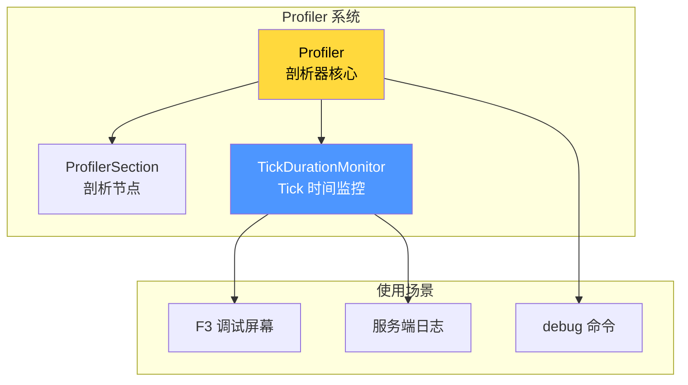
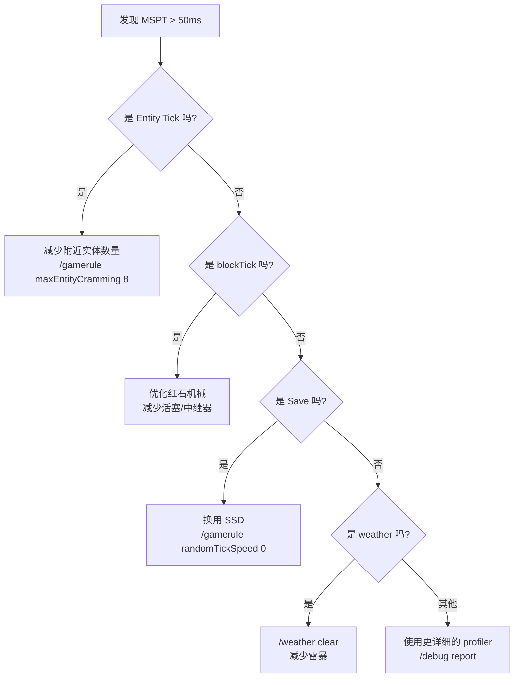
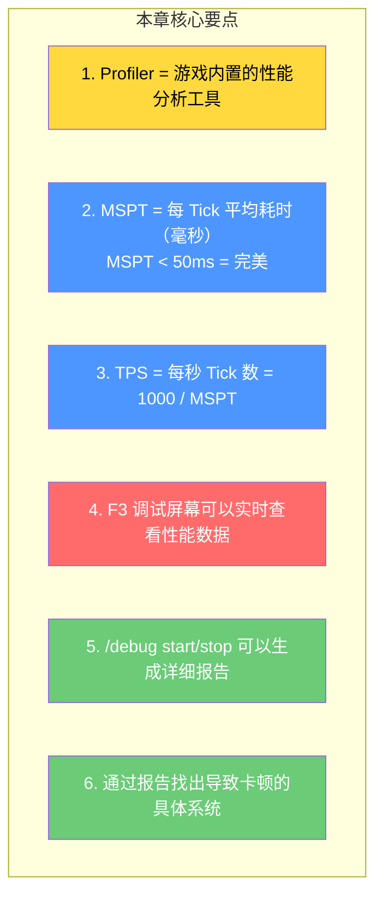

# 第 67 章：性能分析系统（Profiler）

> **理解这章，你就能用 F3 诊断 Minecraft 的卡顿问题——找出到底是哪里拖慢了游戏！**

> ⚠️ **注意**：以下源码示例来源于 CFR 反编译代码，变量名和方法名可能与原始源码有所差异。部分代码经过简化以便于理解。

---

## 目标

学完本章后，你将理解：

1. **Profiler 是什么**：游戏内置的性能分析工具
2. **如何查看性能数据**：F3 调试屏幕的使用
3. **Tick 时间监控**：TPS 和 MSPT 的区别
4. **服务端与客户端Profiler**：两者的不同
5. **如何使用 debug 命令**：性能分析的命令行工具

---

## 前置知识

- 了解 Tick 系统（第 06 章、第 58 章）
- 了解 Minecraft 的客户端-服务端架构
- 知道如何打开 F3 调试屏幕

---

## 核心概念：Profiler 是什么？

### 比喻：医院的心电图

```
医院心电图               Minecraft Profiler
─────────────           ───────────────────
医生记录心脏活动          Profiler 记录代码执行时间

心电图上的波段            Profiler 中的节点：
  - P波 = 心房收缩         - Server Tick
  - QRS波 = 心室收缩       - World Tick
  - T波 = 心室恢复         - Entity Tick
                           - AI Tick

通过心电图，              通过 Profiler，
医生发现心脏问题          开发者/玩家发现卡顿原因
```

### Profiler 能做什么？

| 功能 | 说明 |
|------|------|
| 测量执行时间 | 记录每个方法/区块的耗时 |
| 分层展示 | 展示调用栈的每一层 |
| 可视化图表 | F3 屏幕中的饼图 |
| 命令行工具 | `/debug` 命令系列 |

---

## Profiler 系统架构

### 核心组件



### 核心源码

```java
// net/minecraft/util/profiler/Profiler.java
public class Profiler {

    // 剖析节点栈
    private final Deque<ProfilerSection> stack = new ArrayDeque<>();

    // 剖析数据（路径 → 耗时列表）
    private final Map<String, List<Long>> markers = new HashMap<>();

    // 是否启用
    private boolean enabled = true;

    // 开始一个剖析节点（push）
    public void push(String name) {
        if (!this.enabled) return;
        this.stack.push(new ProfilerSection(name, System.nanoTime()));
    }

    // 结束当前剖析节点（pop）
    public void pop() {
        if (!this.enabled) return;
        ProfilerSection section = this.stack.pop();
        long duration = System.nanoTime() - section.startTime;
        String path = this.buildPath();  // 构建路径，如 "World.Entity.Tick"
        this.markers.computeIfAbsent(path, k -> new ArrayList<>()).add(duration);
    }

    // 交换剖析节点（pop + push）
    public void swap(String name) {
        if (!this.enabled) return;
        this.pop();
        this.push(name);
    }

    // 构建当前路径
    private String buildPath() {
        StringBuilder sb = new StringBuilder();
        for (ProfilerSection section : this.stack) {
            sb.append(section.name).append(".");
        }
        if (sb.length() > 0) {
            sb.setLength(sb.length() - 1);
        }
        return sb.toString();
    }
}
```

---

## Tick 时间监控

### MSPT（Milliseconds Per Tick）

**MSPT** = 每个 Tick 平均耗时（毫秒）

```
MSPT = 所有 Tick 的总耗时 / Tick 数量

理想情况：MSPT = 50ms（TPS = 20）
    │
    ├── MSPT < 50ms → TPS = 20（完美）
    ├── MSPT = 50ms → TPS = 20（刚好）
    ├── MSPT = 60ms → TPS ≈ 16.7（卡顿）
    └── MSPT = 100ms → TPS = 10（严重卡顿）
```

### 过载检测

```java
// MinecraftServer.java 中的过载检测
private static final long TARGET_TICK_TIME = 50_000_000L;      // 50ms
private static final long OVERLOAD_THRESHOLD =
    TARGET_TICK_TIME + 20 * TARGET_TICK_TIME;                    // 1秒

// 如果连续 60 秒 MSPT 超过 1000ms，服务器会警告
if (averageTickTime > OVERLOAD_THRESHOLD) {
    this.overloadWarnings++;
    if (this.overloadWarnings > 60) {
        // 发送警告消息
        LOGGER.warn("Server is lagging! MSPT: " + averageTickTime);
    }
}
```

---

## F3 调试屏幕

### 按 F3 打开的信息

```
┌─────────────────────────────────────────────────────────────┐
│  Minecraft 1.21.1  (进度: 20% / 100%)                       │
├─────────────────────────────────────────────────────────────┤
│  正常游戏:                                                   │
│  DS: 5 (E)  - 区块渲染距离                                   │
│  20 ticks/s (avg: 51.2)                                    │
│  192.168.1.1:25565                                          │
│  WebSocket: 0/32                                            │
├─────────────────────────────────────────────────────────────┤
│  位置信息:                                                   │
│  XYZ: 125.543 / 64.000 / -342.213                          │
│  Block: 125 / 64 / -343                                     │
│  Chunk: 7, -22                                              │
├─────────────────────────────────────────────────────────────┤
│  GPU: Intel HD Graphics 630                                  │
│  OB: 5  SB: 2  ME: 104.2  FE: 41.7                        │
└─────────────────────────────────────────────────────────────┘
```

### 关键指标解释

| 指标 | 含义 | 正常值 |
|------|------|--------|
| `20 ticks/s` | TPS（每秒 Tick 数） | 20 |
| `avg: 51.2` | MSPT（每 Tick 平均耗时） | < 50ms |
| `DS: 5` | 区块渲染距离 | 取决于设置 |
| `OB: 5` | 已加载区块数量 | - |

---

## debug 命令

### 常用 debug 命令

| 命令 | 说明 | 输出 |
|------|------|------|
| `/debug start` | 开始性能分析 | 开始记录 |
| `/debug stop` | 停止性能分析 | 生成报告文件 |
| `/debug report` | 生成性能报告 | 保存到文件 |

### debug start/stop

```
// 开始调试
/debug start

// ... 运行一段时间让问题复现 ...

// 停止调试
/debug stop

// 服务端会输出：
// [Server thread/INFO]: Saving debug report to:
// reports/debug-2024-01-15_12.34.56.txt
```

### 报告文件解读

```text
// debug-2024-01-15_12.34.56.txt

Time: 2024-01-15 12:34:56 +0800
Tick time: 55.2ms avg, 120.5ms max

-- Timings --
Tick - 55.2ms
  World - 30.1ms
    entityTick - 25.3ms
      minecraft:zombie - 8.2ms
      minecraft:skeleton - 6.1ms
      minecraft:creeper - 4.5ms
      ...
    blockTick - 3.5ms
    weatherTick - 1.3ms
  Save - 25.1ms
    chunks - 20.3ms
    players - 4.8ms
```

### 识别问题

```
高耗时分析：

1. Entity Tick 过高
   原因：附近有太多实体
   解决：减少生物生成限制、清理附近生物

2. blockTick 过高
   原因：大量红石机械、活塞
   解决：优化红石设计

3. Save 过高
   原因：存档写入过慢
   解决：使用 SSD、减少存档频率

4. weatherTick 过高
   原因：极端天气设置
   解决：/weather clear
```

---

## 客户端 Profiler

### 客户端的 Profiler

```
客户端 Profiler 主要关注：

1. 渲染时间
   - World Renderer
   - Entity Render
   - GUI Render

2. 帧率（FPS）
   - 目标：60 FPS
   - 低于 30 FPS = 卡顿

3. 内存使用
   - JVM 堆内存
   - GC 频率
```

### 查看客户端性能

```
按 F3 后观察：

FPS: 60                      ← 帧率，60 是完美的
OB: 5  SB: 2                ← 区块数量
ME: 104.2ms                  ← 世界渲染耗时
FE: 41.7ms                   ← 界面渲染耗时
```

---

## 实战：诊断卡顿

### 步骤 1：观察 TPS

```
1. 按 F3 查看右上角
2. 如果 ticks/s 不是 20 → 服务器卡顿
3. 如果 ticks/s 是 20 但游戏卡 → 客户端卡顿
```

### 步骤 2：检查 MSPT

```
1. 观察 avg: XX.Xms
2. 如果 > 50ms → 某个系统有问题
3. 使用 /debug stop 生成的报告分析
```

### 步骤 3：分析报告



---

## 小结



---

## 练习

### 练习 1：计算 TPS

如果 MSPT 是 100ms，TPS 大约是多少？

### 练习 2：识别瓶颈

根据以下 debug 报告，判断哪里是瓶颈：

```
Tick - 120.5ms avg
  World - 80.3ms
    entityTick - 70.2ms   ← 这里是瓶颈！
    blockTick - 8.5ms
    weatherTick - 1.6ms
```

### 练习 3：F3 分析

打开 Minecraft F3 屏幕，记录以下数据：

- TPS：___
- MSPT：___ ms
- 区块加载数量：___

---

## 相关链接

| 文件 | 路径 | 作用 |
|------|------|------|
| `Profiler.java` | `net/minecraft/util/profiler/Profiler.java` | Profiler 核心 |
| `MinecraftServer.java` | `net/minecraft/server/MinecraftServer.java` | Tick 监控 |
| `DebugHud.java` | `net/minecraft/client/gui/hud/DebugHud.java` | F3 显示 |

---

> 💡 **提示**：学会使用 Profiler 可以帮助你快速定位 Minecraft 的性能问题，无论是自己调试 Mod 还是分析服务器性能都非常有用。

---

*文档版本：Minecraft 1.21, Protocol 767, World Version 3953*
*最后更新：2026-03-25*
