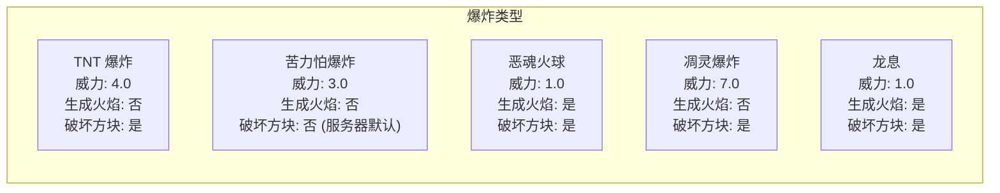
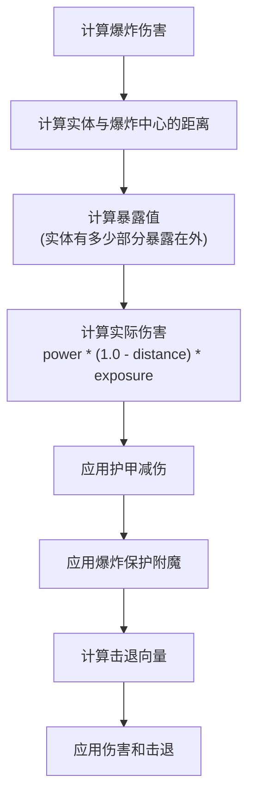
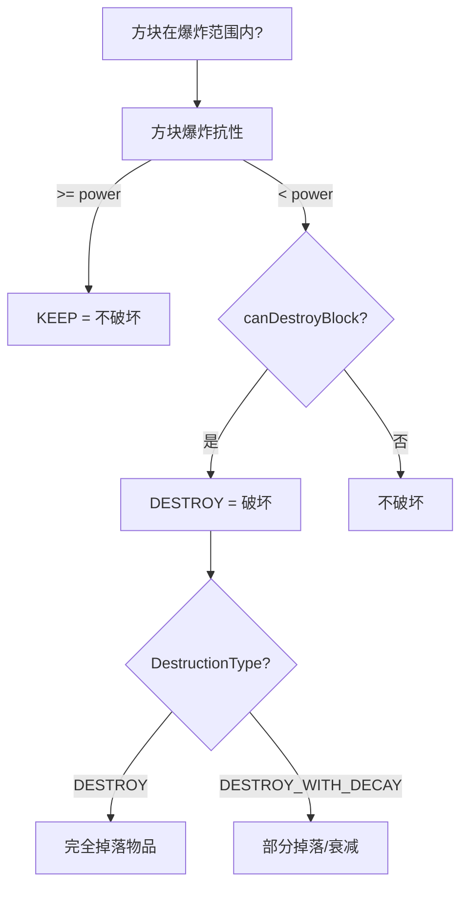
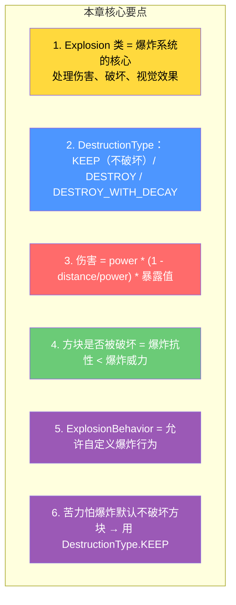

# 第 68 章：爆炸系统（Explosion System）

> **理解这章，你就明白了 TNT 爆炸时发生了什么——伤害计算、方块破坏、粒子效果是如何协同工作的！**

---

## 目标

学完本章后，你将理解：

1. **Explosion 类的核心职责**：爆炸的伤害与破坏计算
2. **DestructionType 枚举**：不同爆炸类型对物体的不同处理
3. **爆炸伤害计算**：基于距离和暴露值的动态伤害
4. **方块破坏流程**：哪些方块会被破坏，哪些不会
5. **爆炸行为扩展**：如何为不同爆炸源定制行为

---

## 前置知识

- 了解实体的基本概念（第 21 章）
- 了解伤害系统（第 25 章）
- 了解粒子系统（第 58 章）

---

## 核心概念：爆炸系统的组成

### 爆炸分解

```
一次爆炸（TNT） = 多个子系统协同工作

┌──────────────────────────────────────────────────────┐
│ 爆炸系统 Explosion                                    │
├──────────────────────────────────────────────────────┤
│ 1. 伤害计算子系统                                    │
│    - 对实体造成伤害（基于距离）                       │
│    - 考虑护甲、附魔、状态效果                        │
│    - 计算击退向量                                    │
│                                                      │
│ 2. 方块破坏子系统                                   │
│    - 检测哪些方块在爆炸范围内                         │
│    - 比较方块爆炸抗性与爆炸威力                        │
│    - 决定保留/破坏/衰减破坏                         │
│                                                      │
│ 3. 视觉效果子系统                                    │
│    - 播放爆炸粒子效果                               │
│    - 播放爆炸音效                                   │
│    - 生成火球（如果 createFire=true）                │
│                                                      │
│ 4. 网络同步子系统                                    │
│    - 向所有客户端广播爆炸事件                        │
│    - 同步方块变化                                   │
└──────────────────────────────────────────────────────┘
```

### 爆炸类型分类



---

## Explosion 类核心结构

### 构造函数与字段

```java
// net/minecraft/world/explosion/Explosion.java
public class Explosion {

    // 爆炸威力（决定破坏范围和伤害）
    private final float power;

    // 是否在爆炸位置生成火焰
    private final boolean createFire;

    // 方块破坏模式
    private final DestructionType destructionType;

    // 爆炸位置
    private final double x, y, z;

    // 触发爆炸的实体（可以是 null，如床爆炸）
    private final Entity entity;

    // 伤害源
    private final DamageSource damageSource;

    // 爆炸行为处理器
    private final ExplosionBehavior behavior;

    // 爆炸影响的方块列表
    private final ObjectArrayList<BlockPos> affectedBlocks = new ObjectArrayList<>();

    // 受爆炸影响的玩家及其击退向量
    private final Map<PlayerEntity, Vec3d> affectedPlayers = Maps.newHashMap();

    // 构造函数
    public Explosion(World world, Entity entity, double x, double y, double z,
                    float power, boolean createFire, DestructionType destructionType) {
        this(world, entity,
             Explosion.createDamageSource(world, entity),
             null, x, y, z,
             power, createFire, destructionType,
             ParticleTypes.EXPLOSION,
             ParticleTypes.EXPLOSION_EMITTER,
             SoundEvents.ENTITY_GENERIC_EXPLODE);
    }
}
```

### DestructionType 枚举

```java
public static enum DestructionType {
    KEEP,               // 保留方块，不破坏（如苦力怕默认）
    DESTROY,            // 破坏方块（标准爆炸）
    DESTROY_WITH_DECAY,  // 破坏方块（带衰减效果，如床）
    TRIGGER_BLOCK       // 触发方块（如压力板、红石）
}
```

---

## 爆炸伤害计算

### 伤害计算流程



### 源码中的伤害计算

```java
// 计算实体伤害
public void collectBlocksAndDamageEntities() {
    // 遍历爆炸范围内的所有实体
    for (Entity entity : this.world.getEntitiesByClass(
            Entity.class,
            new Box(this.x - this.power - 1.0,
                   this.y - this.power - 1.0,
                   this.z - this.power - 1.0,
                   this.x + this.power + 1.0,
                   this.y + this.power + 1.0,
                   this.z + this.power + 1.0),
            entity -> entity.isImmuneToExplosion(this)   // 免疫检查
    )) {
        // 计算伤害
        double distance = Math.sqrt(entity.squaredDistanceTo(this.x, this.y, this.z));
        double damageRatio = (1.0 - distance / this.power) * this.behavior.getDamageReduction(this.world);

        // 计算击退向量
        Vec3d knockback = entity.getPos().relativize(Vec3d.createRadiant(
            this.x, this.y, this.z
        )).normalize().multiply(damageRatio * 2.0);

        // 存储击退向量（稍后应用）
        if (entity instanceof PlayerEntity player) {
            this.affectedPlayers.put(player, knockback);
        }

        // 直接造成伤害
        entity.damage(this.damageSource, (float)(damageRatio * 10.0));
    }
}
```

---

## 方块破坏流程

### 破坏判定逻辑



### 方块爆炸抗性表（部分）

| 方块 | 爆炸抗性 |
|------|---------|
| 基岩 | 18000000 (不可破坏) |
| 黑曜石 | 6000 |
| 铁块 | 30 |
| 石头 | 6 |
| 泥土 | 3 |
| 沙子 | 2 |
| TNT | 0 |

---

## ExplosionBehavior：自定义爆炸行为

### 行为接口

```java
// net/minecraft/world/explosion/ExplosionBehavior.java
public class ExplosionBehavior {

    // 获取方块的爆炸抗性
    public Optional<Float> getBlastResistance(
        Explosion explosion, BlockView world,
        BlockPos pos, BlockState state, FluidState fluid
    ) {
        if (state.isAir() && fluid.isEmpty()) {
            return Optional.empty();
        }
        return Optional.of(Math.max(
            state.getBlock().getBlastResistance(),
            fluid.getBlastResistance()
        ));
    }

    // 检查是否应该破坏方块
    public boolean canDestroyBlock(
        Explosion explosion, BlockView world,
        BlockPos pos, BlockState state, float power
    ) {
        return true;  // 默认允许破坏
    }

    // 检查是否应该伤害实体
    public boolean shouldDamage(Explosion explosion, Entity entity) {
        return true;  // 默认应该伤害
    }
}
```

### 自定义爆炸行为示例

```java
// 自定义爆炸行为：只破坏苦力怕
public class CreeperExplosionBehavior extends ExplosionBehavior {

    @Override
    public boolean canDestroyBlock(
        Explosion explosion, BlockView world,
        BlockPos pos, BlockState state, float power
    ) {
        // 不破坏方块（苦力怕风格）
        return false;
    }

    @Override
    public boolean shouldDamage(Explosion explosion, Entity entity) {
        // 不伤害苦力怕自己
        return !(entity instanceof CreeperEntity);
    }
}
```

---

## 触发爆炸的方式

### 代码示例

```java
// 方式 1：直接创建 Explosion
Explosion explosion = new Explosion(
    world,                    // 世界
    player,                   // 触发者（可以为 null）
    x, y, z,                // 爆炸位置
    4.0f,                    // 爆炸威力
    false,                    // 不生成火焰
    Explosion.DestructionType.DESTROY  // 破坏方块
);
explosion.collectBlocksAndDamageEntities();
explosion.affectWorld(true);

// 方式 2：使用 World 方法（更简单）
world.createExplosion(
    entity,                   // 触发者
    x, y, z,                // 位置
    power,                   // 威力
    fire,                    // 生成火焰
    DestructionType.DESTROY  // 破坏类型
);
```

---

## 小结



---

## 练习

### 练习 1：爆炸威力计算

苦力怕在距离玩家 2 格时爆炸（苦力怕威力=3），玩家受到的伤害比例是多少？

### 练习 2：方块抗性

以下方块哪些会被威力为 4 的爆炸破坏？

- 铁块（抗性 30）→ ?
- 石头（抗性 6）→ ?
- 泥土（抗性 3）→ ?

### 练习 3：创建自定义爆炸

描述如何创建一个「不破坏方块但造成更大伤害」的爆炸。

---

## 相关链接

| 文件 | 路径 | 作用 |
|------|------|------|
| `Explosion.java` | `net/minecraft/world/explosion/Explosion.java` | 爆炸核心类 |
| `ExplosionBehavior.java` | `net/minecraft/world/explosion/ExplosionBehavior.java` | 爆炸行为 |
| `DestructionType.java` | `net/minecraft/world/explosion/DestructionType.java` | 破坏类型枚举 |

---

*文档版本：Minecraft 1.21, Protocol 767, World Version 3953*
*最后更新：2026-03-25*
