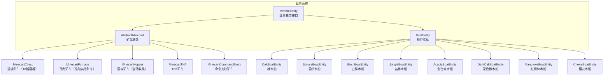
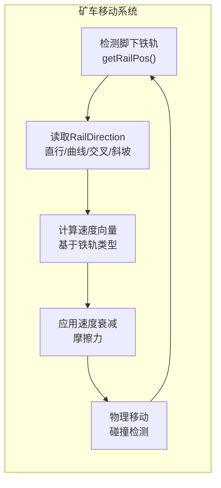
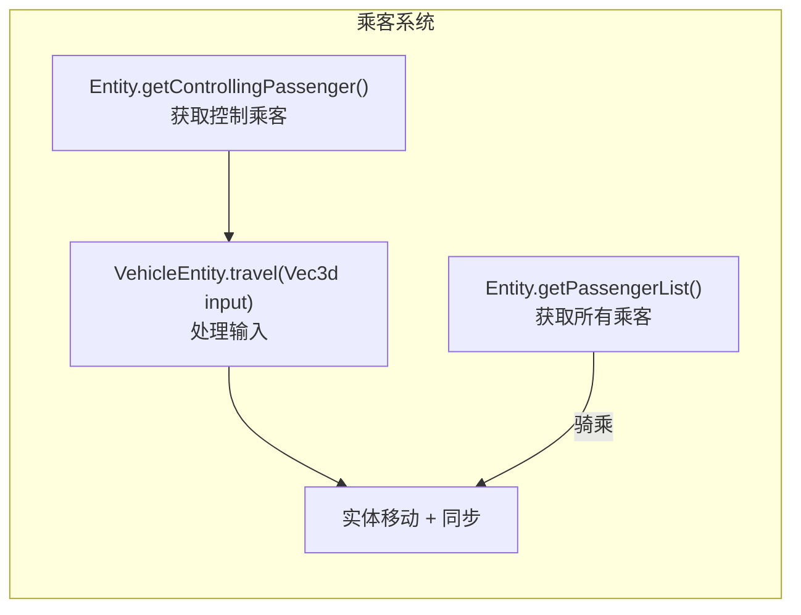
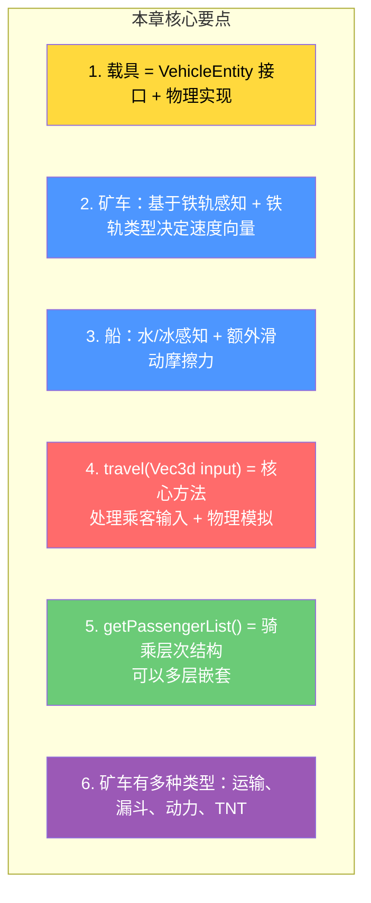

# 第 69 章：载具系统（Vehicles）

> **理解这章，你就明白了矿车为什么在铁轨上跑、船为什么能在水上漂——载具系统的物理与交互机制！**

---

## 目标

学完本章后，你将理解：

1. **载具的分类**：矿车、船只及其变种
2. **VehicleEntity 接口**：所有载具的公共行为定义
3. **矿车系统**：铁轨感知、速度衰减、碰撞检测
4. **船系统**：水上物理、冰上滑行
5. **乘客系统**：实体如何骑乘载具

---

## 前置知识

- 了解实体的基本概念（第 21 章）
- 了解坐标系统和向量（Vec3d）
- 了解铁轨方块的基本概念

---

## 核心概念：载具的分类

### Minecraft 中的载具



---

## VehicleEntity 接口

### 公共行为定义

```java
// net/minecraft/entity/VehicleEntity.java
public interface VehicleEntity {

    // 获取载具当前速度向量
    Vec3d getVelocity();

    // 设置载具速度向量
    void setVelocity(Vec3d velocity);

    // 获取骑乘速度（标量）
    double getMountedSpeed();

    // 处理乘客输入（核心方法）
    void travel(Vec3d input);

    // 获取转向速度
    float getS转向Speed();

    // 是否可交互
    boolean isInteractable();
}
```

---

## 矿车系统

### 铁轨感知与移动



### 核心字段

```java
public abstract class AbstractMinecart extends Entity implements VehicleEntity {

    // 当前所在的铁轨位置
    private BlockPos currentRailPos;

    // 铁轨方向
    private AbstractRailBlock.RailDirection railDirection;

    // 铁轨类型（直行、曲线等）
    private AbstractRailBlock.RailShape railShape;

    // 速度衰减系数
    private double velocityDecayMult = 0.95;

    // 激活延迟（用于漏斗矿车）
    private int activateTicks = 0;

    // 燃油时间（用于动力矿车）
    private int fuel;
}
```

### 铁轨类型与速度

| 铁轨类型 | 加速 | 减速 | 备注 |
|---------|------|------|------|
| 直行 | 否 | 是 | 基础速度 |
| 加速铁轨 | 是 | 否 | 最快 |
| 探测铁轨 | 否 | 否 | 常用于自动化 |
| 斜坡铁轨 | 否 | 否 | 上坡减速，下坡加速 |

---

## 船系统

### 水上物理

```java
public class BoatEntity extends Entity implements VehicleEntity {

    // 水上状态
    private boolean isInWater;           // 是否在水中
    private boolean inWater;              // 帧开始时是否在水中
    private float waterLevel;             // 水面高度
    private float lodWaterLevel;         // LOD 水面高度

    // 滑动属性
    private float horizontalDeceleration;  // 水平减速
    private float damages = 0.0f;         // 受到的伤害
    private long worldTime;               // 世界时间（用于随机性）

    // 输入状态
    private boolean leftInput;             // 左转
    private boolean rightInput;            // 右转
    private boolean forwardInput;           // 前进
    private boolean backwardInput;          // 后退
}
```

### travel() 方法核心逻辑

```java
@Override
public void travel(Vec3d input) {
    // 1. 如果有乘客，使用乘客的输入
    if (this.hasPassenger(this.getControllingPassenger())) {
        Entity passenger = this.getControllingPassenger();

        // 向前/向后
        this.forwardSpeed = -input.z * 0.05f;
        // 左右转向
        this.horizontalSpeed = input.x * 0.05f;
    }

    // 2. 应用速度衰减（摩擦力）
    this.velocity = this.velocity.multiply(
        0.99f,           // 水平衰减
        1.0f,            // 垂直不变
        0.99f             // 水平衰减
    );

    // 3. 在冰上额外滑动
    if (this.isOnIce()) {
        this.velocity = this.velocity.add(
            this.velocity.x * 0.99f,  // 额外的滑动
            0.0f,
            this.velocity.z * 0.99f
        );
    }

    // 4. 移动
    this.move(MovementType.SELF, this.velocity);
}
```

---

## 乘客系统

### 乘客层次结构



### 骑乘关系

```
玩家骑猪的层次结构：

EntityHierarchy：
  Player (骑手)
    │
    │ getControllingPassenger()
    ▼
  PigEntity (猪，被骑)
    │
    │ getControllingPassenger() = null（猪不控制任何东西）
    │ isVehicle() = true
    ▼
  [没有子乘客]

---

玩家坐矿车的层次结构：

EntityHierarchy：
  Player (骑手)
    │
    │ getControllingPassenger()
    ▼
  AbstractMinecart (矿车)
    │
    │ getControllingPassenger() = null
    │ isVehicle() = true
    ▼
  [没有子乘客]
```

---

## 载具对比表

| 特性 | 矿车 | 船 | 猪（可骑） |
|------|------|-----|-----------|
| 基础速度 | 慢 | 中 | 慢 |
| 最大速度 | 中（加速铁轨） | 快 | 中 |
| 地形限制 | 必须有铁轨 | 必须有水/冰 | 任意固体 |
| 存储空间 | 1-27 格（不同类型） | 无 | 无 |
| 特殊能力 | 漏斗收集、动力推动 | 不用铁轨 | 可染色 |
| 伤害 | 碰撞有 | 撞冰块有 | 跌落有 |

---

## 小结



---

## 练习

### 练习 1：载具类型

以下场景应该使用哪种载具？

- 需要运输 27 组物品 → ?
- 需要自动化收集附近物品 → ?
- 需要推动其他矿车 → ?
- 需要在水中快速移动 → ?

### 练习 2：理解铁轨感知

矿车如何知道它当前在哪条铁轨上？

### 练习 3：乘客交互

当玩家骑猪时，猪的 `travel()` 方法收到什么 `input` 参数？

---

## 相关链接

| 文件 | 路径 | 作用 |
|------|------|------|
| `VehicleEntity.java` | `net/minecraft/entity/VehicleEntity.java` | 载具接口 |
| `AbstractMinecart.java` | `net/minecraft/entity/vehicle/AbstractMinecart.java` | 矿车基类 |
| `BoatEntity.java` | `net/minecraft/entity/vehicle/BoatEntity.java` | 船实体 |

---

*文档版本：Minecraft 1.21, Protocol 767, World Version 3953*
*最后更新：2026-03-25*
