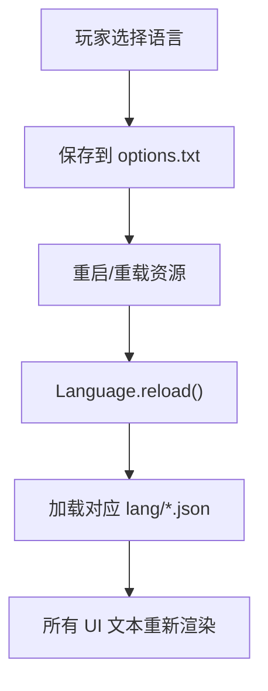
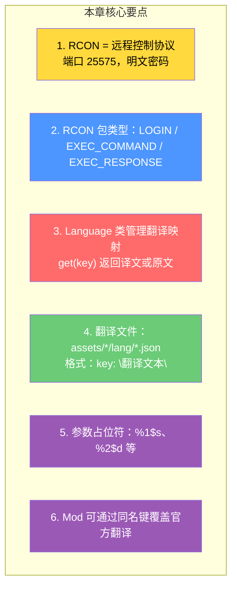

# 第 70 章：RCON 与语言本地化系统（RCON and Language）

> **理解这两章，你就掌握了服务端远程管理的钥匙（RCon）和游戏多语言支持的内部机制（Language）！**

---

## 目标

学完本章后，你将理解：

### RCON 部分
1. **RCON 协议**：什么是 Remote Console，如何远程执行命令
2. **数据包格式**：认证请求、命令执行、响应
3. **使用场景**：自动化备份、远程管理

### 语言系统部分
4. **Language 类**：翻译加载和查询
5. **TranslatableText**：带参数的文本格式化
6. **资源路径**：翻译文件在哪里

---

## 前置知识

- 了解服务端的命令行基础
- 知道 `server.properties` 配置文件

---

## 第一部分：RCON 远程控制

### 什么是 RCON？

> **RCON（Remote Console）** 是一种轻量级远程控制协议，最初在 Quake 系列游戏中引入。

```
不使用 RCON：                        使用 RCON：
─────────────────                   ──────────────────────
你需要坐在服务器前，                  你可以在任何地方，
手动输入命令。                        用客户端连接并执行命令。

缺点：                              优点：
- 必须物理访问服务器                    - 远程操作
- 无法自动化                          - 可以写脚本自动化
- 多人管理困难                        - 支持 Web 控制台
```

### 与其他协议对比

| 协议 | 端口 | 用途 | 安全性 |
|------|------|------|--------|
| RCON | 25575 | 远程命令执行 | 低（明文密码） |
| Query | 25566 | 服务器状态查询 | 低 |
| Game Port | 25565 | 游戏数据传输 | 高（加密） |

### 数据包格式

```
┌──────────────────────────────────────────────────────┐
│ RCON 数据包结构                                       │
├──────────────────────────────────────────────────────┤
│                                                      │
│  int32    int32     int32    string     string        │
│  Length  RequestID  Type     Payload   Padding        │
│  ─────   ──────    ────     ──────   ──────        │
│   4B       4B       4B       N B       1 B           │
│                                                      │
│  Type:                                              │
│    0x00 = COMMAND（未知）                            │
│    0x01 = LOGIN（认证）                            │
│    0x02 = LOGIN_RESPONSE（认证响应）                  │
│    0x03 = EXEC_COMMAND（执行命令）                   │
│    0x04 = EXEC_RESPONSE（执行响应）                   │
│                                                      │
└──────────────────────────────────────────────────────┘
```

### 服务端配置

在 `server.properties` 中：

```properties
# 启用 RCON
enable-rcon=true

# RCON 端口
rcon.port=25575

# RCON 密码
rcon.password=your_secure_password
```

### 使用示例

```bash
# 使用 mcrcon 客户端连接
mcrcon -h 192.168.1.100 -p your_password

# 连接成功后可以执行命令
> list
# There are 5/20 players online: Steve, Alex, ...

> say Server restarting in 5 minutes!
# [通知] Server restarting in 5 minutes!

> stop
# Server stopped.
```

---

## 第二部分：语言本地化系统

### 翻译文件结构

```
assets/minecraft/lang/
├── en_us.json         ← 默认（必须）
├── zh_cn.json         ← 简体中文
├── zh_tw.json         ← 繁体中文
├── ja_jp.json         ← 日语
├── de_de.json         ← 德语
└── ... 50+ 语言文件

Mod 翻译文件：
assets/mymod/lang/zh_cn.json
```

### JSON 翻译文件格式

```json
// zh_cn.json 示例
{
    "menu.disconnect": "断开连接",
    "menu.returnToGame": "返回游戏",
    "menu.openToLan": "对局域网开放",
    "selectWorld.delete": "删除世界",
    "selectWorld.deleteConfirm": "这将会删除「%1$s」，确定吗？",
    "entity.minecraft.zombie": "僵尸",
    "item.minecraft.diamond_sword.display": "钻石剑\n伤害: %1$d"
}
```

### Language 类

```java
// net/minecraft/client/language/Language.java
@Environment(value=EnvType.CLIENT)
public class Language implements TextController {

    // 翻译映射：键 → 译文
    private final Map<String, String> translations;

    // 是否从右到左（阿拉伯语等）
    private final boolean rightToLeft;

    // 获取翻译
    public String get(String key) {
        return this.translations.getOrDefault(key, key);
    }

    // 带默认值的获取
    public String get(String key, String fallback) {
        return this.translations.getOrDefault(key, fallback);
    }

    // 检查键是否存在
    public boolean has(String key) {
        return this.translations.containsKey(key);
    }
}
```

### 参数替换

```
翻译键中的参数占位符：
%s    - 字符串参数
%d    - 整数参数
%1$s  - 第 1 个字符串参数（顺序无关）
%2$d  - 第 2 个整数参数（顺序无关）

示例：
"menu.delete.confirm": "确定要删除「%1$s」吗？"

代码中：
text = new TranslatableText("menu.delete.confirm", worldName);
// worldName = "我的世界"
// 结果："确定要删除「我的世界」吗？"
```

### 多语言切换流程



---

## 小结



---

## 练习

### RCON 练习

1. 在服务端配置中启用 RCON
2. 使用 `mcrcon` 或类似工具连接
3. 执行 `/list` 和 `/say` 命令

### 语言系统练习

1. 找到 `zh_cn.json` 文件
2. 添加一个自定义 Mod 的翻译键
3. 在游戏中验证翻译是否生效

---

## 相关链接

| 文件 | 路径 | 作用 |
|------|------|------|
| `Language.java` | `net/minecraft/client/language/Language.java` | 语言管理 |
| `TranslatableTextContent.java` | `net/minecraft/text/TranslatableTextContent.java` | 可翻译文本 |
| `RCON 协议文档` | Minecraft Wiki | RCON 协议规范 |

---

*文档版本：Minecraft 1.21, Protocol 767, World Version 3953*
*最后更新：2026-03-25*
