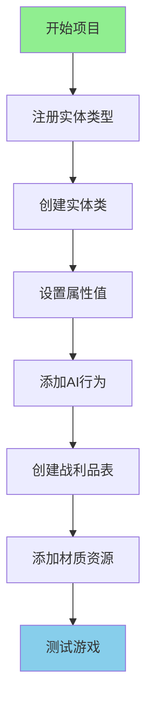
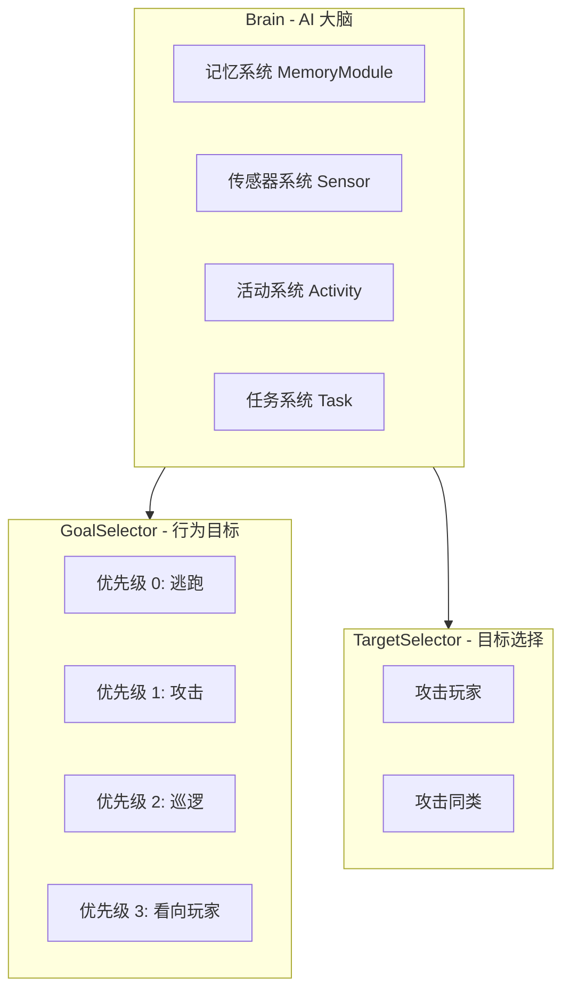

# 第 100 章：项目3：添加新生物（Project 3 — New Entity）

>创建一个会攻击玩家的"火焰精灵"！
>
>本项目基于 Minecraft 1.21 实体系统源码分析。

---

## 项目目标

学完这个项目后，你将掌握：

- 如何注册一个自定义实体类型
- 如何创建实体类并设置属性
- 如何使用属性系统（AttributeSystem）
- 如何添加 AI 行为（Goal/TargetSelector）
- 如何添加掉落物（战利品表）
- 如何添加材质
- 如何测试实体

---

## 项目概览



---

## 前置知识

| 知识 | 说明 |
|------|------|
| 注册表系统 | 理解 `Registry.register()` 的工作原理 |
| Entity 类层次 | `Entity` → `LivingEntity` → `MobEntity` |
| 属性系统 | `AttributeContainer`, `EntityAttributes` |
| AI 系统 | `GoalSelector`, `TargetSelector`, `Goal` |
| 战利品系统 | `LootTable`, `LootPool` |

---

## 步骤详解

### 步骤 1：理解 Minecraft 1.21 实体系统架构

#### 实体类的继承层次

根据 Minecraft 1.21 源码，实体的继承结构如下：

```
237:243:net/minecraft/entity/Entity.java
┌─────────────────────────────────────────────────────────────┐
│                         Entity                              │
│  ├── 位置和运动 (Vec3d pos, velocity)                     │
│  ├── 数据追踪 (DataTracker)                                │
│  └── 骑乘系统 (vehicle, passengerList)                    │
├─────────────────────────────────────────────────────────────┤
│                     LivingEntity                            │
│  ├── 属性系统 (AttributeContainer)                        │
│  ├── 药水效果 (StatusEffect)                               │
│  └── 生命值 (HEALTH)                                      │
├─────────────────────────────────────────────────────────────┤
│                       MobEntity                             │
│  ├── AI系统 (GoalSelector, TargetSelector)                │
│  ├── 导航系统 (EntityNavigation)                          │
│  └── 移动控制 (MoveControl)                                │
└─────────────────────────────────────────────────────────────┘
```

#### 核心字段详解

```java
// Entity.java 的核心字段
private final EntityType<?> type;          // 实体类型引用
private int id;                            // 网络ID
protected UUID uuid;                        // 持久化UUID
public Vec3d pos;                         // 当前坐标
public Vec3d velocity;                    // 速度向量
public float yaw, pitch;                   // 旋转角度
public boolean onGround;                   // 是否在地面
protected final DataTracker dataTracker;   // 数据追踪器

// LivingEntity.java 的核心字段
private final AttributeContainer attributes;  // 属性容器
private final Map<StatusEffect, StatusEffectInstance> activeStatusEffects;  // 药水效果
protected static final TrackedData<Float> HEALTH;  // 生命值

// MobEntity.java 的核心字段
protected final GoalSelector goalSelector;     // 行为目标选择器
protected final GoalSelector targetSelector;   // 目标选择器
protected Navigation导航系统
protected MoveControl移动控制器
```

---

### 步骤 2：注册实体类型

#### 核心概念

注册实体类型就像给生物"登记户口"：

```
┌─────────────────────────────────────────┐
│           Minecraft 注册表               │
│                                         │
│  namespace:path = 唯一的"身份证号"       │
│                                         │
│  "minecraft:pig"        ← 猪           │
│  "minecraft:zombie"     ← 僵尸         │
│  "mymod:flame_spirit"   ← 你的火焰精灵│
│                                         │
└─────────────────────────────────────────┘
```

#### EntityType.Builder 参数说明

| 参数 | 说明 | 僵尸参考值 |
|------|------|-----------|
| dimensions | 碰撞箱尺寸 (width, height) | 0.6f, 1.8f |
| eyeHeight | 眼睛高度 | 1.62f |
| maxTrackingRange | 最大追踪范围 | 8 |
| trackingTickInterval | 追踪更新间隔 | 2 |

#### 代码实现

```java
public class MyMod implements ModInitializer {
    
    // ========== 注册火焰精灵实体类型 ==========
    public static final EntityType<FlameSpiritEntity> FLAME_SPIRIT = 
        Registry.register(
            Registries.ENTITY_TYPE,                              // 实体类型注册表
            Identifier.of("mymod", "flame_spirit"),            // 唯一标识符
            EntityType.Builder.create(FlameSpiritEntity::new,   // 工厂方法
                    SpawnGroup.MONSTER)                          // 生物群组：怪物
                .dimensions(0.6f, 1.8f)                       // 碰撞箱尺寸
                .eyeHeight(1.62f)                              // 眼睛高度
                .maxTrackingRange(8)                           // 最大追踪距离
                .trackingTickInterval(2)                       // 追踪更新间隔
                .build()                                        // 构建
        );
    
    @Override
    public void onInitialize() {
        // 实体类型注册完成！
    }
}
```

#### SpawnGroup 群组类型

| 群组 | 说明 | 生成条件 |
|------|------|----------|
| `MONSTER` | 怪物 | 敌对生物，黑暗处生成 |
| `CREATURE` | 生物 | 被动生物，正常生成 |
| `AMBIENT` | 环境生物 | 蝙蝠等，永久生成 |
| `AXOLOTLS` | 美西螈 | 特殊生成规则 |
| `UNDERGROUND_WATER_CREATURE` | 地下水生生物 | 地下洞穴生成 |
| `WATER_CREATURE` | 水生生物 | 海洋/河流生成 |
| `WATER_AMBIENT` | 水中环境生物 | 鱼群等 |
| `MISC` | 杂项 | 不会自然生成 |

---

### 步骤 3：创建实体类

#### 完整代码实现

```java
// src/main/java/com/mymod/entity/FlameSpiritEntity.java

package com.mymod.entity;

import net.minecraft.entity.EntityType;
import net.minecraft.entity.ai.goal.ActiveTargetGoal;
import net.minecraft.entity.ai.goal.EscapeDangerGoal;
import net.minecraft.entity.ai.goal.MeleeAttackGoal;
import net.minecraft.entity.ai.goal.WanderAroundGoal;
import net.minecraft.entity.ai.goal.LookAtPlayerGoal;
import net.minecraft.entity.ai.goal.RandomLookAroundGoal;
import net.minecraft.entity.attribute.EntityAttributes;
import net.minecraft.entity.damage.DamageSource;
import net.minecraft.entity.mob.MobEntity;
import net.minecraft.entity.player.PlayerEntity;
import net.minecraft.item.ItemStack;
import net.minecraft.item.Items;
import net.minecraft.world.World;

public class FlameSpiritEntity extends MobEntity {
    
    // ========== 构造函数 ==========
    public FlameSpiritEntity(EntityType<? extends FlameSpiritEntity> entityType, World world) {
        super(entityType, world);
    }
    
    // ========== 初始化属性 ==========
    @Override
    public void initializeData() {
        super.initializeData();
        
        // 设置火焰精灵的属性
        this.getAttributeInstance(EntityAttributes.GENERIC_MAX_HEALTH).setBaseValue(30.0);  // 30心生命
        this.getAttributeInstance(EntityAttributes.GENERIC_ATTACK_DAMAGE).setBaseValue(6.0);  // 6点攻击
        this.getAttributeInstance(EntityAttributes.GENERIC_MOVEMENT_SPEED).setBaseValue(0.3);  // 移动速度
        this.getAttributeInstance(EntityAttributes.GENERIC_KNOCKBACK_RESISTANCE).setBaseValue(0.5);  // 50%击退抗性
    }
    
    // ========== 初始化 AI 目标 ==========
    @Override
    protected void initGoals() {
        super.initGoals();
        
        // 逃跑目标（低血量时）
        this.goalSelector.addGoal(0, new EscapeDangerGoal(this, 1.5));
        
        // 近战攻击目标
        this.goalSelector.addGoal(1, new MeleeAttackGoal(this, 1.2, false));
        
        // 巡逻
        this.goalSelector.addGoal(3, new WanderAroundGoal(this, 0.8));
        
        // 看向玩家
        this.goalSelector.addGoal(4, new LookAtPlayerGoal(this, PlayerEntity.class, 8.0f));
        
        // 随机环顾
        this.goalSelector.addGoal(5, new RandomLookAroundGoal(this));
        
        // 目标选择：玩家
        this.targetSelector.addGoal(0, new ActiveTargetGoal<>(
            this, PlayerEntity.class, true
        ));
    }
    
    // ========== 掉落物品 ==========
    @Override
    protected void dropLoot(DamageSource source, boolean causedByPlayer) {
        super.dropLoot(source, causedByPlayer);
        
        // 额外掉落
        if (causedByPlayer) {
            // 必定掉落烈焰棒
            this.dropStack(new ItemStack(Items.BLAZE_ROD, this.random.nextInt(2) + 1));
        }
    }
}
```

---

### 步骤 4：属性系统详解

#### EntityAttributes 属性类型

```java
// net/minecraft/entity/attribute/EntityAttributes.java
┌─────────────────────────────────────────────────────────────┐
│                   EntityAttributes 常用属性                    │
├─────────────────────────────────────────────────────────────┤
│  GENERIC_MAX_HEALTH        - 最大生命值                     │
│  GENERIC_FOLLOW_RANGE      - 跟随范围                       │
│  GENERIC_KNOCKBACK_RESISTANCE - 击退抗性                    │
│  GENERIC_MOVEMENT_SPEED    - 移动速度                       │
│  GENERIC_ARMOR             - 护甲值                         │
│  GENERIC_ARMOR_TOUGHNESS    - 护甲韧性                       │
│  GENERIC_ATTACK_DAMAGE     - 攻击伤害                       │
│  GENERIC_ATTACK_KNOCKBACK  - 攻击击退                       │
│  GENERIC_MAX_ABSORPTION    - 最大吸收值                     │
│  GENERIC_STEP_HEIGHT       - 跨步高度                       │
│  GENERIC_GRAVITY           - 重力                           │
│  GENERIC_LUCK              - 幸运值                         │
│  GENERIC_SAFE_FALL_DISTANCE - 安全掉落距离                  │
│  GENERIC_FALL_DAMAGE_MULTIPLIER - 掉落伤害乘数              │
├─────────────────────────────────────────────────────────────┤
│                   特殊生物属性                               │
├─────────────────────────────────────────────────────────────┤
│  HORSE_JUMP_STRENGTH       - 马匹跳跃力                     │
│  FLYING_SPEED              - 飞行速度                       │
│  SPAWN_REINFORCEMENTS_CHANCE - 召唤援军概率                 │
└─────────────────────────────────────────────────────────────┘
```

#### 属性修饰符操作

```java
// 添加临时属性修饰符
this.getAttributeInstance(EntityAttributes.GENERIC_MOVEMENT_SPEED)
    .addTemporaryModifier(
        new EntityAttributeModifier(
            Identifier.ofVanilla("sprinting"),  // UUID
            0.3f,                                // 值
            EntityAttributeModifier.Operation.ADD_MULTIPLIED_TOTAL  // 操作类型
        )
    );

// 移除属性修饰符
this.getAttributeInstance(EntityAttributes.GENERIC_MOVEMENT_SPEED)
    .removeModifier(Identifier.ofVanilla("sprinting"));
```

---

### 步骤 5：AI 系统详解

#### AI 系统的核心架构



#### 常用 Goal 类

```java
// ========== 常用 Goal 类列表 ==========

// 1. 巡逻目标
this.goalSelector.addGoal(3, new WanderAroundGoal(this, speed));

// 2. 近战攻击目标
this.goalSelector.addGoal(1, new MeleeAttackGoal(this, speed, followWhenNotAggressive));

// 3. 看向玩家
this.goalSelector.addGoal(4, new LookAtPlayerGoal(this, PlayerEntity.class, maxDistance));

// 4. 随机环顾
this.goalSelector.addGoal(5, new RandomLookAroundGoal(this));

// 5. 游泳
this.goalSelector.addGoal(1, new SwimAroundGoal(this, speed, chance));

// 6. 逃跑（低血量或在水里时）
this.goalSelector.addGoal(1, new EscapeDangerGoal(this, speed));

// 7. 追随目标
this.goalSelector.addGoal(2, new FollowTargetGoal(this, EntityType, speed, followDistance));

// 8. 保持在某范围内
this.goalSelector.addGoal(3, new StayWithinRangeGoal(this, speed, maxDistance));
```

#### 常用 Target 类

```java
// ========== 常用 Target 类列表 ==========

// 1. 攻击最近的可视玩家
this.targetSelector.addGoal(1, new ActiveTargetGoal<>(
    this, 
    PlayerEntity.class, 
    true  // checkVisibility
));

// 2. 攻击最近的同类
this.targetSelector.addGoal(1, new NearestAttackableTargetGoal<>(
    this,
    FlameSpiritEntity.class,
    true
));

// 3. 攻击所有可见玩家
this.targetSelector.addGoal(1, new NearestAttackableTargetGoal<>(
    this,
    PlayerEntity.class,
    0,    // 抽取间隔
    true, // 需要检查可见性
    false,// 需要检查视线
    Predicate.not(Entity::isInvisible)
));
```

#### 自定义 Goal 示例

```java
// 火焰冲刺目标
public class FlameChargeGoal extends Goal {
    
    private final FlameSpiritEntity entity;
    private final double speed;
    private int cooldown = 0;
    
    public FlameChargeGoal(FlameSpiritEntity entity, double speed) {
        this.entity = entity;
        this.speed = speed;
        this.setControls(EnumSet.of(Goal.Control.MOVE, Goal.Control.LOOK));
    }
    
    @Override
    public boolean canStart() {
        // 查找附近的玩家
        LivingEntity target = entity.getTarget();
        return target != null 
            && entity.squaredDistanceTo(target) < 100  // 10格以内
            && cooldown <= 0;
    }
    
    @Override
    public void start() {
        LivingEntity target = entity.getTarget();
        if (target != null) {
            // 快速冲向目标
            entity.getNavigation().startMovingTo(target, speed);
            cooldown = 200; // 10秒冷却
        }
    }
    
    @Override
    public void tick() {
        if (cooldown > 0) cooldown--;
    }
    
    @Override
    public boolean shouldContinue() {
        LivingEntity target = entity.getTarget();
        return target != null && entity.squaredDistanceTo(target) < 225;  // 15格以内
    }
}
```

---

### 步骤 6：添加掉落物（战利品表）

#### 战利品表文件结构

```
src/main/resources/
└── data/
    └── mymod/
        └── loot_tables/
            └── entities/
                └── flame_spirit.json
```

#### 战利品表 JSON

```json
{
    "pools": [
        {
            "rolls": 1,
            "entries": [
                {
                    "type": "item",
                    "name": "minecraft:blaze_rod",
                    "weight": 1,
                    "functions": [
                        {
                            "function": "minecraft:set_count",
                            "count": {
                                "type": "minecraft:uniform",
                                "min": 1,
                                "max": 2
                            }
                        }
                    ]
                }
            ]
        },
        {
            "rolls": 1,
            "entries": [
                {
                    "type": "item",
                    "name": "mymod:flame_essence",
                    "weight": 5,
                    "conditions": [
                        {
                            "condition": "minecraft:random_chance",
                            "chance": 0.1
                        }
                    ]
                }
            ]
        }
    ]
}
```

#### 相关条件说明

| 条件 | 说明 | 用法 |
|------|------|------|
| `killed_by_player` | 被玩家击杀 | 只有玩家击杀才掉落 |
| `random_chance` | 随机概率 | `chance: 0.1` 表示10%概率 |
| `entity_properties` | 实体属性 | 检查实体是否着火等 |
| `enchantment_check` | 附魔检查 | 检查抢夺附魔等级 |

---

### 步骤 7：添加材质

#### 材质文件结构

```
src/main/resources/
└── assets/
    └── mymod/
        └── textures/
            └── entity/
                └── flame_spirit/
                    ├── flame_spirit.png         # 实体主材质
                    └── flame_spirit_layer_1.png # 叠加层（如有）
```

---

## 完整代码

### Mod 主类

```java
package com.mymod;

import net.minecraft.entity.EntityType;
import net.minecraft.entity.SpawnGroup;
import net.minecraft.registry.Registries;
import net.minecraft.registry.Registry;
import net.minecraft.util.Identifier;
import net.fabricmc.api.ModInitializer;
import com.mymod.entity.FlameSpiritEntity;

public class MyMod implements ModInitializer {
    
    // ========== 注册火焰精灵实体类型 ==========
    public static final EntityType<FlameSpiritEntity> FLAME_SPIRIT = 
        Registry.register(
            Registries.ENTITY_TYPE,
            Identifier.of("mymod", "flame_spirit"),
            EntityType.Builder.create(FlameSpiritEntity::new, SpawnGroup.MONSTER)
                .dimensions(0.6f, 1.8f)
                .eyeHeight(1.62f)
                .maxTrackingRange(8)
                .build()
        );
    
    @Override
    public void onInitialize() {
        System.out.println("火焰精灵 Mod 已加载！");
    }
}
```

### 自定义实体类

```java
package com.mymod.entity;

import net.minecraft.entity.EntityType;
import net.minecraft.entity.ai.goal.ActiveTargetGoal;
import net.minecraft.entity.ai.goal.EscapeDangerGoal;
import net.minecraft.entity.ai.goal.MeleeAttackGoal;
import net.minecraft.entity.ai.goal.WanderAroundGoal;
import net.minecraft.entity.ai.goal.LookAtPlayerGoal;
import net.minecraft.entity.ai.goal.RandomLookAroundGoal;
import net.minecraft.entity.attribute.EntityAttributes;
import net.minecraft.entity.damage.DamageSource;
import net.minecraft.entity.mob.MobEntity;
import net.minecraft.entity.player.PlayerEntity;
import net.minecraft.item.ItemStack;
import net.minecraft.item.Items;
import net.minecraft.world.World;

public class FlameSpiritEntity extends MobEntity {
    
    public FlameSpiritEntity(EntityType<? extends FlameSpiritEntity> entityType, World world) {
        super(entityType, world);
    }
    
    @Override
    public void initializeData() {
        super.initializeData();
        // 设置火焰精灵的属性
        this.getAttributeInstance(EntityAttributes.GENERIC_MAX_HEALTH).setBaseValue(30.0);
        this.getAttributeInstance(EntityAttributes.GENERIC_ATTACK_DAMAGE).setBaseValue(6.0);
        this.getAttributeInstance(EntityAttributes.GENERIC_MOVEMENT_SPEED).setBaseValue(0.3);
    }
    
    @Override
    protected void initGoals() {
        super.initGoals();
        
        // 逃跑目标（低血量时）
        this.goalSelector.addGoal(0, new EscapeDangerGoal(this, 1.5));
        
        // 攻击目标
        this.goalSelector.addGoal(1, new MeleeAttackGoal(this, 1.2, false));
        
        // 巡逻
        this.goalSelector.addGoal(3, new WanderAroundGoal(this, 0.8));
        
        // 看向玩家
        this.goalSelector.addGoal(4, new LookAtPlayerGoal(this, PlayerEntity.class, 8.0f));
        
        // 随机环顾
        this.goalSelector.addGoal(5, new RandomLookAroundGoal(this));
        
        // 目标选择：玩家
        this.targetSelector.addGoal(0, new ActiveTargetGoal<>(
            this, PlayerEntity.class, true
        ));
    }
    
    @Override
    protected void dropLoot(DamageSource source, boolean causedByPlayer) {
        super.dropLoot(source, causedByPlayer);
        
        // 额外掉落
        if (causedByPlayer) {
            this.dropStack(new ItemStack(Items.BLAZE_ROD, this.random.nextInt(2) + 1));
        }
    }
}
```

---

## 测试步骤

### 测试步骤

1. **启动游戏**
   ```
   ./gradlew runClient
   ```

2. **生成实体**
   ```
   /summon mymod:flame_spirit
   ```

3. **测试功能**
   - 观察火焰精灵是否生成
   - 尝试攻击它，观察是否反击
   - 击杀后检查掉落物品

4. **测试属性**
   ```
   /summon mymod:flame_spirit ~ ~ ~ {Attributes:[{Name:generic.maxHealth,Base:50}]}
   ```

### 预期结果

```
┌─────────────────────────────────────────────────────────┐
│                     测试预期结果                          │
├─────────────────────────────────────────────────────────┤
│                                                         │
│  1. 实体可以正常生成                                    │
│  2. 实体具有30心生命值                                 │
│  3. 实体主动追踪并攻击玩家                              │
│  4. 实体可以移动和环顾四周                             │
│  5. 被玩家击杀后掉落烈焰棒                             │
│                                                         │
└─────────────────────────────────────────────────────────┘
```

### 常见问题排查

| 问题 | 原因 | 解决方法 |
|------|------|----------|
| 实体不生成 | 材质或 AI 配置错误 | 检查日志 |
| AI 不工作 | 未正确初始化目标 | 在 initGoals 中添加目标 |
| 掉落物品不对 | 战利品表路径错误 | 检查 JSON 位置 |
| 实体穿墙 | 未设置碰撞检测 | 检查 dimensions |

---

## 扩展挑战

### 挑战 1：创建飞行生物

```java
public class FlameBatEntity extends MobEntity implements FlyingEntity {
    
    @Override
    protected void initGoals() {
        super.initGoals();
        
        // 飞行相关的 AI
        this.goalSelector.addGoal(0, new FlyGoal(this, 1.0));
        this.goalSelector.addGoal(1, new MeleeAttackGoal(this, 1.2, true));
    }
}
```

### 挑战 2：创建骑乘生物

```java
public class FlameHorseEntity extends HorseEntity {
    
    @Override
    protected void initGoals() {
        super.initGoals();
        // 添加骑乘相关 AI
    }
    
    @Override
    public boolean canBeSaddled() {
        return true;
    }
}
```

### 挑战 3：创建自定义掉落物品

```java
@Override
protected void dropLoot(DamageSource source, boolean causedByPlayer) {
    super.dropLoot(source, causedByPlayer);
    
    // 检查击杀者是否有特定附魔
    if (causedByPlayer && source.getAttacker() instanceof PlayerEntity player) {
        ItemStack weapon = player.getMainStack();
        int lootingLevel = EnchantmentHelper.getLevel(Enchantments.LOOTING, weapon);
        
        // 根据抢夺等级增加掉落
        this.dropStack(new ItemStack(ModItems.FLAME_ESSENCE, 1 + lootingLevel));
    }
}
```

---

## 参考资料

### 相关章节

| 章节 | 内容 |
|------|------|
| [实体系统分析](../../-analysis/05-entity-system.md) | 实体系统的完整源码分析 |
| [战利品系统分析](../../-analysis/14-loot-system.md) | 战利品系统的完整源码分析 |

### 源码参考

| 文件 | 路径 | 说明 |
|------|------|------|
| `Entity.java` | `net/minecraft/entity/Entity.java` | 实体基类 |
| `LivingEntity.java` | `net/minecraft/entity/LivingEntity.java` | 活体实体基类 |
| `MobEntity.java` | `net/minecraft/entity/mob/MobEntity.java` | 生物实体基类 |
| `EntityType.java` | `net/minecraft/entity/EntityType.java` | 实体类型定义 |
| `EntityAttributes.java` | `net/minecraft/entity/attribute/EntityAttributes.java` | 属性定义 |
| `Brain.java` | `net/minecraft/entity/ai/brain/Brain.java` | AI大脑 |
| `Goal.java` | `net/minecraft/entity/ai/goal/Goal.java` | AI目标基类 |
| `LootTable.java` | `net/minecraft/loot/LootTable.java` | 战利品表 |

### 关键代码位置

```java
// MobEntity 的 AI 初始化 - MobEntity.java
protected void initGoals() {
    this.goalSelector.addGoal(0, new EscapeDangerGoal(this, 1.0));
    // ... 更多目标
}

// 属性设置 - LivingEntity.java
private final AttributeContainer attributes;

protected LivingEntity(EntityType<? extends LivingEntity> entityType, World world) {
    this.attributes = new AttributeContainer(DefaultAttributeRegistry.get(entityType));
}

// 掉落逻辑 - MobEntity.java
protected void dropLoot(DamageSource source, boolean causedByPlayer) {
    // 原版掉落逻辑
}
```

---

## 下一步

学会了创建生物？接下来我们学习创建数据包！

> [项目4：创建数据包](./101-project4-datapack.md)

---

*文档版本：Minecraft 1.21, Protocol 767, World Version 3953*
*本教程基于 Minecraft 1.21 源码编写*
