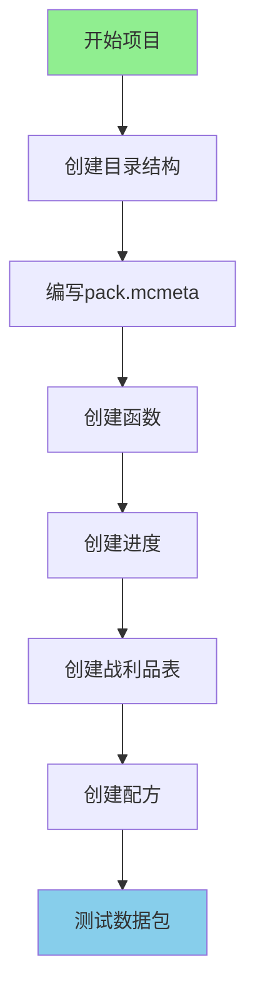

# 第 101 章：项目4：创建数据包（Project 4 — Datapack）

>创建一个包含配方、进度和战利品的数据包！
>
>本项目基于 Minecraft 1.21 配方系统和战利品系统源码分析。

---

## 项目目标

学完这个项目后，你将掌握：

- 数据包的基本结构
- 如何创建函数（Functions）
- 如何添加进度（Advancements）
- 如何创建战利品表（Loot Tables）
- 如何添加配方（Recipes）
- 如何测试数据包

---

## 项目概览



---

## 前置知识

| 知识 | 说明 |
|------|------|
| JSON 基础 | 理解 JSON 格式 |
| 数据包结构 | 了解 `data/` 目录结构 |
| 战利品表 | 了解掉落系统 |
| 配方系统 | 了解合成配方 |

---

## 步骤详解

### 步骤 1：理解数据包架构

#### 数据包 vs Mod

```
┌─────────────────────────────────────────┐
│           数据包 vs Mod                   │
│                                         │
│  Mod（模组）                            │
│    ├─ 需要安装到游戏目录                │
│    ├─ 需要编程知识（Java）              │
│    └─ 可以添加新方块/物品/实体          │
│                                         │
│  数据包（Datapack）                     │
│    ├─ 放入世界文件夹即可                │
│    ├─ 只要 JSON 知识                    │
│    └─ 只能修改现有内容（配方/进度/掉落）│
│                                         │
└─────────────────────────────────────────┘
```

#### 数据包用途

| 用途 | 说明 |
|------|------|
| 配方 | 添加/修改合成配方 |
| 进度 | 添加自定义成就 |
| 战利品 | 添加/修改掉落表 |
| 函数 | 执行一系列命令 |
| 标签 | 组合物品/方块/实体 |
| 结构 | 生成建筑结构 |

---

### 步骤 2：数据包结构

#### 完整目录结构

```
MyFirstDatapack/
├── pack.mcmeta              # 数据包描述文件
└── data/
    ├── mymod/               # 命名空间（你的标识）
    │   ├── advancement/     # 进度
    │   │   ├── root.json
    │   │   └── first_craft.json
    │   ├── function/        # 函数
    │   │   ├── tick.mcfunction
    │   │   └── hello.mcfunction
    │   ├── loot_tables/    # 战利品表
    │   │   ├── blocks/
    │   │   │   └── my_block.json
    │   │   └── entities/
    │   │       └── my_mob.json
    │   └── recipe/          # 配方
    │       ├── my_recipe.json
    │       └── magic_staff.json
    └── minecraft/           # 可以覆盖原版
        └── tags/
            └── function/
                └── tick.json
```

#### pack.mcmeta 文件

```json
{
    "pack": {
        "pack_format": 34,
        "description": "我的第一个数据包"
    }
}
```

#### pack_format 版本对照

| Minecraft 版本 | pack_format |
|---------------|-------------|
| 1.21.x | 34 |
| 1.20.x | 26 |
| 1.19.x | 24 |
| 1.18.x | 15 |

---

### 步骤 3：创建函数（Functions）

#### 什么是函数？

函数是一系列命令的集合：

```
┌─────────────────────────────────────────┐
│           函数的优点                      │
│                                         │
│  # 传统方式：每次都要输入                │
│  /say 你好                              │
│  /give @s diamond 1                     │
│  /playsound minecraft:entity.player.levelup ... │
│                                         │
│  # 函数方式：一键执行                    │
│  /function mymod:welcome                │
│  └── 自动执行上面所有命令                │
│                                         │
└─────────────────────────────────────────┘
```

#### 函数文件示例

创建 `data/mymod/function/welcome.mcfunction`：

```mcfunction
# 欢迎消息
say 欢迎来到魔法世界！

# 给予起始物品
give @s minecraft:diamond 3
give @s minecraft:iron_sword 1

# 给予状态效果
effect give @s minecraft:strength 60 0

# 播放音效
playsound minecraft:entity.player.levelup player @s ~ ~ ~ 1.0 1.0
```

#### 带条件的函数

创建 `data/mymod/function/check_player.mcfunction`：

```mcfunction
# 检查玩家是否满足条件
execute if entity @s[nbt={Inventory:[{id:"minecraft:diamond",Count:10b}]}] run say 你有10个钻石！
execute if entity @s[scores={kills=100..}] run say 你已经击杀100个生物了！
```

#### tick.json（每刻执行）

创建 `data/minecraft/tags/function/tick.json`：

```json
{
    "values": [
        "mymod:tick"
    ]
}
```

创建 `data/mymod/function/tick.mcfunction`：

```mcfunction
# 每刻执行的逻辑
# 例如：检查玩家位置并给予效果
execute as @a at @s if block ~ ~-1 minecraft:magma_block run effect give @s minecraft:fire_resistance 5 0
```

---

### 步骤 4：创建进度（Advancements）

#### 什么是进度？

进度就是"成就"，当玩家完成某些条件时触发：

```
┌─────────────────────────────────────────┐
│           进度触发流程                    │
│                                         │
│  玩家行为 → 检查条件 → 触发进度 → 给予奖励│
│                                         │
│  例如：                                  │
│  玩家合成 → 背包有新物品 → "初学者"成就  │
│                        ↓                │
│                    给予奖励：            │
│                    - 经验                │
│                    - 配方解锁            │
│                    - 物品奖励            │
│                                         │
└─────────────────────────────────────────┘
```

#### 进度文件示例

创建 `data/mymod/advancement/first_magic.json`：

```json
{
    "display": {
        "icon": {
            "item": "minecraft:enchanted_book"
        },
        "title": "初次魔法",
        "description": "制作你的第一件魔法物品",
        "frame": "task",
        "show_toast": true,
        "announce_to_chat": true,
        "hidden": false,
        "background": "minecraft:textures/gui/advancements/backgrounds/adventure.png"
    },
    "parent": "mymod:root",
    "criteria": {
        "crafted": {
            "trigger": "minecraft:inventory_changed",
            "conditions": {
                "items": [
                    {
                        "items": ["mymod:magic_wand"]
                    }
                ]
            }
        }
    },
    "rewards": {
        "experience": 50,
        "loot": ["mymod:chests/magic_reward"],
        "function": "mymod:give_reward"
    }
}
```

#### 根进度（显示在进度界面）

创建 `data/mymod/advancement/root.json`：

```json
{
    "display": {
        "icon": {
            "item": "minecraft:nether_star"
        },
        "title": "魔法冒险",
        "description": "开始你的魔法冒险之旅",
        "background": "minecraft:textures/gui/advancements/backgrounds/adventure.png",
        "show_toast": false,
        "announce_to_chat": false
    },
    "criteria": {
        "tick": {
            "trigger": "minecraft:tick"
        }
    }
}
```

#### 常用触发器

| 触发器 | 说明 | 条件 |
|--------|------|------|
| `inventory_changed` | 背包变化 | 检查物品 |
| `player_killed_entity` | 击杀实体 | 检查被击杀者 |
| `recipe_unlocked` | 配方解锁 | 检查配方 |
| `enter_block` | 进入方块 | 检查方块 |
| `effects_changed` | 效果变化 | 检查药水效果 |
| `consume_item` | 消耗物品 | 检查消耗的物品 |
| `tick` | 每刻触发 | 无条件 |
| `impossible` | 不可能触发 | 无条件 |

---

### 步骤 5：创建战利品表（Loot Tables）

#### 战利品表系统架构

根据 Minecraft 1.21 源码，战利品表的核心组件：

```
┌─────────────────────────────────────────────────────────────┐
│                   战利品表核心架构                            │
├─────────────────────────────────────────────────────────────┤
│                                                             │
│  ┌──────────────────┐   ┌──────────────────────────────┐   │
│  │   LootTable       │   │     LootContext             │   │
│  │   (战利品表)       │◄──│     (上下文)                │   │
│  └────────┬─────────┘   └──────────────┬─────────────┘   │
│           │                              │                  │
│           ▼                              ▼                  │
│  ┌──────────────────┐   ┌──────────────────────────────┐   │
│  │   LootPool        │   │  LootContextParameters      │   │
│  │   (战利品池)       │   │  (上下文参数)                │   │
│  └────────┬─────────┘   └──────────────────────────────┘   │
│           │                                             │
│    ┌─────┴─────┐                                       │
│    ▼           ▼                                        │
│ ┌─────────┐ ┌──────────┐                                 │
│ │LootEntry│ │LootCondition│                               │
│ │(条目)   │ │(条件)     │                                 │
│ └─────────┘ └──────────┘                                 │
│    │                                                        │
│    ▼                                                        │
│ ┌──────────┐                                                │
│ │LootFunction│                                               │
│ │(函数)    │                                                │
│ └──────────┘                                                │
│                                                             │
└─────────────────────────────────────────────────────────────┘
```

#### 实体掉落战利品表

创建 `data/mymod/loot_tables/entities/flame_spirit.json`：

```json
{
    "pools": [
        {
            "rolls": 1,
            "entries": [
                {
                    "type": "item",
                    "name": "minecraft:blaze_rod",
                    "weight": 1,
                    "functions": [
                        {
                            "function": "minecraft:set_count",
                            "count": {
                                "type": "minecraft:uniform",
                                "min": 1,
                                "max": 2
                            }
                        }
                    ]
                }
            ],
            "conditions": [
                {
                    "condition": "minecraft:killed_by_player"
                }
            ]
        },
        {
            "rolls": 1,
            "entries": [
                {
                    "type": "item",
                    "name": "mymod:flame_essence",
                    "weight": 5,
                    "conditions": [
                        {
                            "condition": "minecraft:random_chance",
                            "chance": 0.1
                        }
                    ]
                }
            ]
        }
    ]
}
```

#### 常用条件

| 条件 | JSON ID | 说明 |
|------|---------|------|
| 被玩家击杀 | `killed_by_player` | 只有玩家击杀才掉落 |
| 随机概率 | `random_chance` | `chance: 0.1` 表示10% |
| 实体属性 | `entity_properties` | 检查实体是否着火等 |
| 附魔检查 | `enchantment_check` | 检查抢夺附魔等级 |
| 爆炸存活 | `survives_explosion` | 爆炸中存活才掉落 |
| 表加成 | `table_bonus` | 抢夺/时运加成 |

#### 常用函数

| 函数 | JSON ID | 说明 |
|------|---------|------|
| 设置数量 | `set_count` | 设置物品数量 |
| 随机数量 | `set_count` | 使用 `uniform` 随机 |
| 随机附魔 | `enchant_randomly` | 随机附魔 |
| 抢夺加成 | `looting_enchant` | 根据抢夺等级增加 |
| 烧制 | `furnace_smelt` | 熔炉烧制 |
| 复制NBT | `copy_nbt` | 从上下文复制NBT |
| 设置NBT | `set_nbt` | 设置固定NBT |

---

### 步骤 6：创建配方（Recipes）

#### 配方系统架构

根据 Minecraft 1.21 源码，配方系统的核心组件：

```
┌─────────────────────────────────────────────────────────────┐
│                   配方系统核心架构                            │
├─────────────────────────────────────────────────────────────┤
│                                                             │
│  ┌──────────────────┐   ┌──────────────────────────────┐   │
│  │   Recipe          │   │     RecipeType               │   │
│  │   (配方接口)       │◄──│     (配方类型)                │   │
│  └────────┬─────────┘   └──────────────┬─────────────┘   │
│           │                              │                  │
│           ▼                              ▼                  │
│  ┌──────────────────┐   ┌──────────────────────────────┐   │
│  │  RecipeSerializer │   │    RecipeManager             │   │
│  │  (序列化器)        │   │    (配方管理器)               │   │
│  └──────────────────┘   └──────────────────────────────┘   │
│                                                             │
│  ┌──────────────────────────────────────────────────────┐  │
│  │                    配方类型继承树                        │  │
│  │  Recipe~I~                                            │  │
│  │     │                                                 │  │
│  │     ├── CraftingRecipe                               │  │
│  │     │     ├── ShapedRecipe                          │  │
│  │     │     └── ShapelessRecipe                       │  │
│  │     ├── CookingRecipe                                │  │
│  │     │     ├── SmeltingRecipe                       │  │
│  │     │     ├── SmokingRecipe                        │  │
│  │     │     └── BlastingRecipe                       │  │
│  │     ├── SmithingRecipe                               │  │
│  │     └── StonecuttingRecipe                           │  │
│  │                                                        │  │
│  └──────────────────────────────────────────────────────┘  │
│                                                             │
└─────────────────────────────────────────────────────────────┘
```

#### 有形状合成配方

创建 `data/mymod/recipe/magic_wand.json`：

```json
{
    "type": "minecraft:crafting_shaped",
    "category": "equipment",
    "group": "magic_wands",
    "pattern": [
        "  E",
        " S ",
        "S  "
    ],
    "key": {
        "E": {
            "item": "minecraft:ender_eye"
        },
        "S": {
            "item": "minecraft:stick"
        }
    },
    "result": {
        "item": "mymod:magic_wand",
        "count": 1
    }
}
```

**配方图示**：
```
合成台预览：
  [ ] [E] [ ]     E = 末影之眼
  [S] [ ] [ ]  =  S = 木棍
  [S] [ ] [ ]
  
结果：魔法魔杖 x1
```

#### 无形状合成配方

创建 `data/mymod/recipe/magic_crystal.json`：

```json
{
    "type": "minecraft:crafting_shapeless",
    "category": "misc",
    "group": "magic_items",
    "ingredients": [
        {"item": "minecraft:diamond"},
        {"item": "minecraft:diamond"},
        {"item": "minecraft:blaze_powder"},
        {"item": "minecraft:ender_eye"}
    ],
    "result": {
        "item": "mymod:magic_crystal",
        "count": 1
    }
}
```

#### 熔炉配方

创建 `data/mymod/recipe/magic_dust_from_ore.json`：

```json
{
    "type": "minecraft:smelting",
    "category": "misc",
    "group": "magic_dust",
    "ingredient": {
        "item": "mymod:raw_magic_ore"
    },
    "result": "mymod:magic_dust",
    "experience": 0.5,
    "cookingtime": 200
}
```

#### 配方类型对照

| 类型 | JSON ID | 说明 |
|------|---------|------|
| 有形状合成 | `crafting_shaped` | 按图案排列 |
| 无形状合成 | `crafting_shapeless` | 任意排列 |
| 熔炉烧制 | `smelting` | 200 ticks (10秒) |
| 烟熏炉 | `smoking` | 100 ticks (5秒) |
| 高炉 | `blasting` | 100 ticks (5秒) |
| 锻造 | `smithing_transform` | 升级装备 |
| 切石 | `stonecutting` | 切石加工 |

---

## 完整数据包示例

### 目录结构

```
MagicDatapack/
├── pack.mcmeta
└── data/
    ├── mymod/
    │   ├── advancement/
    │   │   ├── root.json
    │   │   └── first_craft.json
    │   ├── function/
    │   │   ├── welcome.mcfunction
    │   │   └── tick.mcfunction
    │   ├── loot_tables/
    │   │   ├── entities/
    │   │   │   └── flame_spirit.json
    │   │   └── chests/
    │   │       └── magic_reward.json
    │   └── recipe/
    │       ├── magic_wand.json
    │       └── magic_crystal.json
    └── minecraft/
        └── tags/
            └── function/
                └── tick.json
```

### pack.mcmeta

```json
{
    "pack": {
        "pack_format": 34,
        "description": "魔法数据包 - 添加魔法物品和成就"
    }
}
```

### welcome.mcfunction

```mcfunction
# 欢迎消息
tellraw @s {"text":"欢迎来到魔法冒险！","color":"gold"}

# 给予起始物品
give @s minecraft:diamond 5

# 播放音效
playsound minecraft:entity.player.levelup player @s ~ ~ ~ 1.0 1.0
```

### tick.mcfunction

```mcfunction
# 检查站在岩浆块上的玩家
execute as @a at @s if block ~ ~-1 minecraft:magma_block run effect give @s minecraft:fire_resistance 5 0
```

### 进度文件

**root.json**:
```json
{
    "display": {
        "icon": {"item": "minecraft:nether_star"},
        "title": "魔法冒险",
        "description": "开始你的魔法冒险之旅",
        "background": "minecraft:textures/gui/advancements/backgrounds/adventure.png"
    },
    "criteria": {
        "tick": {"trigger": "minecraft:tick"}
    }
}
```

**first_craft.json**:
```json
{
    "display": {
        "icon": {"item": "minecraft:enchanted_book"},
        "title": "初次魔法",
        "description": "制作你的第一件魔法物品"
    },
    "parent": "mymod:root",
    "criteria": {
        "crafted": {
            "trigger": "minecraft:inventory_changed",
            "conditions": {
                "items": [{"items": ["mymod:magic_wand"]}]
            }
        }
    }
}
```

---

## 测试步骤

### 测试步骤

1. **打包数据包**
   ```
   将文件夹压缩为 zip 格式（注意：不是 rar）
   MyFirstDatapack.zip
   ```

2. **放入游戏目录**
   ```
   1. 创建或进入一个世界
   2. 打开 .minecraft/saves/你的世界/datapacks/
   3. 放入 zip 文件或解压后的文件夹
   ```

3. **重载数据包**
   ```
   在游戏中输入 /reload
   ```

4. **测试功能**
   ```
   - 检查配方：/recipe give @s mymod:magic_wand
   - 检查进度：/advancement grant @s everything
   - 测试战利品：/loot give @s loot mymod:entities/flame_spirit
   - 执行函数：/function mymod:welcome
   ```

### 预期结果

```
┌─────────────────────────────────────────────────────────┐
│                     测试预期结果                          │
├─────────────────────────────────────────────────────────┤
│                                                         │
│  1. 数据包加载成功                                    │
│  2. 配方出现在合成台中                                 │
│  3. 进度显示在进度界面                                 │
│  4. 击杀生物触发战利品掉落                            │
│  5. 执行 /function mymod:welcome 给予物品              │
│                                                         │
└─────────────────────────────────────────────────────────┘
```

### 常见问题排查

| 问题 | 原因 | 解决方法 |
|------|------|----------|
| 配方不显示 | JSON 格式错误 | 检查语法 |
| 进度不触发 | 条件不满足 | 检查触发器条件 |
| 战利品表不工作 | 路径错误 | 检查 namespace 和 path |
| 数据包不加载 | pack_format 错误 | 更新版本号 |

---

## 扩展挑战

### 挑战 1：创建自定义进度树

```
root（根进度）
├── 收集材料
│   ├── 收集钻石
│   └── 收集烈焰棒
├── 制作装备
│   ├── 制作魔法杖
│   └── 制作魔法盔甲
└── 最终成就
    └── 成为魔法大师
```

### 挑战 2：创建条件掉落

```json
{
    "pools": [
        {
            "rolls": 1,
            "entries": [
                {
                    "type": "item",
                    "name": "minecraft:diamond",
                    "functions": [
                        {
                            "function": "minecraft:looting_enchant",
                            "count": 1
                        }
                    ]
                }
            ],
            "conditions": [
                {
                    "condition": "minecraft:enchantment_check",
                    "enchantment": "minecraft:looting",
                    "levels": {"min": 1}
                }
            ]
        }
    ]
}
```

### 挑战 3：创建自定义函数系统

```mcfunction
# 检查并给予奖励
execute if entity @s[advancements={mymod:first_craft=true}] run function mymod:give_reward
```

---

## 参考资料

### 相关章节

| 章节 | 内容 |
|------|------|
| [配方系统分析](../../-analysis/15-recipe-system.md) | 配方系统的完整源码分析 |
| [战利品系统分析](../../-analysis/14-loot-system.md) | 战利品系统的完整源码分析 |

### 在线资源

- [Minecraft Wiki - Datapack](https://minecraft.fandom.com/wiki/Datapack)
- [Minecraft Wiki - Advancement](https://minecraft.fandom.com/wiki/Advancement)
- [Minecraft Wiki - Loot table](https://minecraft.fandom.com/wiki/Loot_table)
- [Minecraft Wiki - Recipe](https://minecraft.fandom.com/wiki/Recipe)

### 源码参考

| 文件 | 路径 | 说明 |
|------|------|------|
| `LootTable.java` | `net/minecraft/loot/LootTable.java` | 战利品表 |
| `LootPool.java` | `net/minecraft/loot/LootPool.java` | 战利品池 |
| `RecipeManager.java` | `net/minecraft/recipe/RecipeManager.java` | 配方管理器 |
| `ShapedRecipe.java` | `net/minecraft/recipe/ShapedRecipe.java` | 有形状合成 |
| `CookingRecipe.java` | `net/minecraft/recipe/CookingRecipe.java` | 烹饪配方 |

### 关键代码位置

```java
// LootTable 生成 - LootTable.java
public void generateLoot(LootContextParameterSet parameters,
                        Consumer<ItemStack> lootConsumer) {
    // 创建上下文
    LootContext context = new LootContext.Builder(parameters)
        .withRandom(this.randomSequenceId)
        .build(this.type);

    // 为每个池生成战利品
    for (LootPool pool : this.pools) {
        if (pool.checkCondition(context)) {
            pool.addLoot(lootConsumer, context);
        }
    }
}

// 配方匹配 - ShapedRecipe.java
public boolean matches(CraftingInventory inventory, World world) {
    for (int y = 0; y <= inventory.getHeight() - this.height; y++) {
        for (int x = 0; x <= inventory.getWidth() - this.width; x++) {
            if (this.matchesPattern(inventory, x, y)) {
                return true;
            }
        }
    }
    return false;
}
```

---

## 下一步

恭喜你完成了所有四个实战项目！

你已经学会了：
- ✅ 添加新方块
- ✅ 添加新物品
- ✅ 添加新生物
- ✅ 创建数据包

下一步你可以：
- 尝试组合这些知识，创建更复杂的内容
- 学习服务端-客户端同步机制
- 研究性能优化

> [返回 Part-12 目录](./README.md)

---

*文档版本：Minecraft 1.21, Protocol 767, World Version 3953*
*本教程基于 Minecraft 1.21 源码编写*
