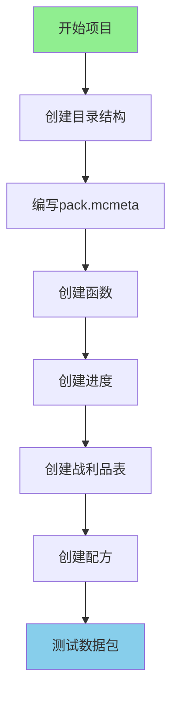

# 项目4：创建数据包

> 创建一个包含配方、进度和战利品的数据包！

---

## 项目目标

学完这个项目后，你将掌握：
- 数据包的基本结构
- 如何创建函数（Functions）
- 如何添加进度（Advancements）
- 如何创建战利品表（Loot Tables）
- 如何添加配方（Recipes）
- 如何测试数据包

---

## 项目概览



---

## 所需知识

- 数据包基础（Part-8 第41章）
- 战利品表（Part-8 第42章）
- 进度系统（Part-8 第43章）
- 配方系统（Part-8 第44章）

---

## 步骤详解

### 步骤 1：什么是数据包？

#### 核心概念

数据包是一种不需要 Mod 就能自定义游戏内容的方式：

```
┌─────────────────────────────────────────┐
│           数据包 vs Mod                   │
│                                         │
│  Mod（模组）                            │
│    ├─ 需要安装到游戏目录                │
│    ├─ 需要编程知识                      │
│    └─ 可以添加新方块/物品/实体          │
│                                         │
│  数据包（Datapack）                     │
│    ├─ 放入世界文件夹即可                │
│    ├─ 只要 JSON 知识                    │
│    └─ 只能修改现有内容（配方/进度/掉落）│
│                                         │
└─────────────────────────────────────────┘
```

#### 生活中的比喻

```
数据包就像游戏规则的"说明书"：

┌─────────────────────────────────────────┐
│  说明书内容        │  相当于数据包的     │
├─────────────────┼─────────────────────  │
│  菜谱            │  合成配方           │
│  成就清单        │  进度系统           │
│  掉落规则        │  战利品表           │
│  任务提示        │  函数命令           │
└─────────────────────────────────────────┘
```

---

### 步骤 2：数据包结构

#### 完整目录结构

```
MyFirstDatapack/
├── pack.mcmeta              # 数据包描述文件
└── data/
    ├── mymod/               # 命名空间（你的标识）
    │   ├── advancement/     # 进度
    │   │   └── my_advancement.json
    │   ├── function/        # 函数
    │   │   ├── tick.mcfunction
    │   │   └── hello.mcfunction
    │   ├── loot_tables/    # 战利品表
    │   │   ├── blocks/
    │   │   │   └── my_block.json
    │   │   └── entities/
    │   │       └── my_mob.json
    │   └── recipe/          # 配方
    │       └── my_recipe.json
    └── minecraft/           # 可以覆盖原版
        └── tags/
            └── function/
                └── tick.json
```

#### pack.mcmeta 文件

```json
{
    "pack": {
        "pack_format": 34,
        "description": "我的第一个数据包"
    }
}
```

#### pack_format 版本对照

| Minecraft 版本 | pack_format |
|---------------|-------------|
| 1.21.x | 34 |
| 1.20.x | 26 |
| 1.19.x | 24 |
| 1.18.x | 15 |

---

### 步骤 3：创建函数（Functions）

#### 什么是函数？

函数是一系列命令的集合：

```
┌─────────────────────────────────────────┐
│           函数的优点                      │
│                                         │
│  # 传统方式：每次都要输入                │
│  /say 你好                              │
│  /give @s diamond 1                     │
│  /playsound minecraft:entity.player.levelup ... │
│                                         │
│  # 函数方式：一键执行                    │
│  /function mymod:welcome                │
│  └── 自动执行上面所有命令                │
│                                         │
└─────────────────────────────────────────┘
```

#### 函数文件示例

创建 `data/mymod/function/welcome.mcfunction`：

```mcfunction
# 欢迎消息
say 欢迎来到魔法世界！

# 给予起始物品
give @s minecraft:diamond 3
give @s minecraft:iron_sword 1

# 给予状态效果
effect give @s minecraft:strength 60 0

# 播放音效
playsound minecraft:entity.player.levelup player @s ~ ~ ~ 1.0 1.0
```

#### 带条件的函数

创建 `data/mymod/function/check_player.mcfunction`：

```mcfunction
# 检查玩家是否满足条件
execute if entity @s[nbt={Inventory:[{id:"minecraft:diamond",Count:10b}]}] run say 你有10个钻石！
execute if entity @s[scores={kills=100..}] run say 你已经击杀100个生物了！
```

#### tick.json（每刻执行）

创建 `data/minecraft/tags/function/tick.json`：

```json
{
    "values": [
        "mymod:tick"
    ]
}
```

创建 `data/mymod/function/tick.mcfunction`：

```mcfunction
# 每刻执行的逻辑
# 例如：检查玩家位置并给予效果
execute as @a at @s if block ~ ~-1 minecraft:magma_block run effect give @s minecraft:fire_resistance 5 0
```

---

### 步骤 4：创建进度（Advancements）

#### 什么是进度？

进度就是"成就"，当玩家完成某些条件时触发：

```
┌─────────────────────────────────────────┐
│           进度触发流程                    │
│                                         │
│  玩家行为 → 检查条件 → 触发进度 → 给予奖励│
│                                         │
│  例如：                                  │
│  玩家挖矿 → 背包有钻石 → "钻石猎手"成就  │
│                        ↓                │
│                    给予奖励：            │
│                    - 经验                │
│                    - 配方解锁            │
│                    - 物品奖励            │
│                                         │
└─────────────────────────────────────────┘
```

#### 进度文件示例

创建 `data/mymod/advancement/first_magic.json`：

```json
{
    "display": {
        "icon": {
            "item": "minecraft:enchanted_book"
        },
        "title": {
            "translate": "成就.初次魔法"
        },
        "description": {
            "translate": "成就.初次魔法.desc"
        },
        "frame": "task",
        "show_toast": true,
        "announce_to_chat": true,
        "hidden": false
    },
    "parent": "mymod:root",
    "criteria": {
        "learned": {
            "trigger": "minecraft:recipe_unlocked",
            "conditions": {
                "recipe": "mymod:magic_staff"
            }
        }
    },
    "rewards": {
        "experience": 50,
        "loot": ["mymod:chests/magic_reward"],
        "recipes": ["mymod:magic_crystal"]
    }
}
```

#### 根进度（显示在进度界面）

创建 `data/mymod/advancement/root.json`：

```json
{
    "display": {
        "icon": {
            "item": "minecraft:nether_star"
        },
        "title": "魔法冒险",
        "description": "开始你的魔法冒险之旅",
        "background": "minecraft:textures/gui/advancements/backgrounds/adventure.png",
        "show_toast": false,
        "announce_to_chat": false
    },
    "criteria": {
        "tick": {
            "trigger": "minecraft:tick"
        }
    }
}
```

#### 常用触发器

| 触发器 | 说明 | 条件 |
|--------|------|------|
| `inventory_changed` | 背包变化 | 检查物品 |
| `player_killed_entity` | 击杀实体 | 检查被击杀者 |
| `recipe_unlocked` | 配方解锁 | 检查配方 |
| `enter_block` | 进入方块 | 检查方块 |
| `effects_changed` | 效果变化 | 检查药水效果 |
| `consume_item` | 消耗物品 | 检查消耗的物品 |

---

### 步骤 5：创建战利品表（Loot Tables）

#### 什么是战利品表？

战利品表定义了什么情况下给予什么物品：

```
┌─────────────────────────────────────────┐
│           战利品表用途                    │
│                                         │
│  1. 实体掉落（猪、牛、僵尸...）          │
│  2. 箱子战利品（地牢、神殿...）          │
│  3. 钓鱼奖励                            │
│  4. 村民交易礼物                        │
│  5. 考古奖励                            │
│                                         │
└─────────────────────────────────────────┘
```

#### 实体掉落战利品表

创建 `data/mymod/loot_tables/entities/magic_beast.json`：

```json
{
    "pools": [
        {
            "rolls": 1,
            "entries": [
                {
                    "type": "item",
                    "name": "minecraft:diamond",
                    "weight": 1,
                    "functions": [
                        {
                            "function": "minecraft:set_count",
                            "count": {
                                "type": "minecraft:uniform",
                                "min": 1,
                                "max": 3
                            }
                        }
                    ]
                }
            ],
            "conditions": [
                {
                    "condition": "minecraft:killed_by_player"
                }
            ]
        },
        {
            "rolls": 1,
            "entries": [
                {
                    "type": "item",
                    "name": "mymod:magic_essence",
                    "weight": 5,
                    "conditions": [
                        {
                            "condition": "minecraft:random_chance",
                            "chance": 0.2
                        }
                    ]
                }
            ]
        }
    ]
}
```

#### 箱子战利品表

创建 `data/mymod/loot_tables/chests/magic_treasure.json`：

```json
{
    "pools": [
        {
            "rolls": {
                "type": "minecraft:uniform",
                "min": 2,
                "max": 4
            },
            "entries": [
                {
                    "type": "item",
                    "name": "minecraft:iron_ingot",
                    "weight": 10,
                    "functions": [
                        {
                            "function": "minecraft:set_count",
                            "count": {
                                "type": "minecraft:uniform",
                                "min": 1,
                                "max": 5
                            }
                        }
                    ]
                },
                {
                    "type": "item",
                    "name": "minecraft:gold_ingot",
                    "weight": 5,
                    "functions": [
                        {
                            "function": "minecraft:set_count",
                            "count": {
                                "type": "minecraft:uniform",
                                "min": 1,
                                "max": 3
                            }
                        }
                    ]
                },
                {
                    "type": "item",
                    "name": "minecraft:diamond",
                    "weight": 2,
                    "functions": [
                        {
                            "function": "minecraft:set_count",
                            "count": {
                                "type": "minecraft:uniform",
                                "min": 1,
                                "max": 2
                            }
                        }
                    ]
                }
            ]
        }
    ]
}
```

---

### 步骤 6：创建配方（Recipes）

#### 什么是配方？

配方定义如何合成物品：

```
┌─────────────────────────────────────────┐
│           配方类型                        │
│                                         │
│  1. 有形状合成（需要按形状排列）         │
│     ┌───┬───┬───┐                      │
│     │ A │ A │   │  A = 钻石            │
│     ├───┼───┼───┤  S = 木棍            │
│     │   │ S │   │                      │
│     ├───┼───┼───┤                      │
│     │   │ S │   │                      │
│     └───┴───┴───┘                      │
│     = 钻石剑                            │
│                                         │
│  2. 无形状合成（材料随意摆放）           │
│     需要：钻石x2 + 木棍x1               │
│     = 钻石剑                            │
│                                         │
│  3. 熔炉配方（烧制）                    │
│     输入 + 燃料 → 输出                  │
│                                         │
└─────────────────────────────────────────┘
```

#### 有形状合成配方

创建 `data/mymod/recipe/magic_staff.json`：

```json
{
    "type": "minecraft:crafting_shaped",
    "category": "equipment",
    "group": "magic_staffs",
    "pattern": [
        "  D",
        " S ",
        "S  "
    ],
    "key": {
        "D": {
            "item": "minecraft:diamond"
        },
        "S": {
            "item": "minecraft:stick"
        }
    },
    "result": {
        "item": "mymod:magic_staff",
        "count": 1
    }
}
```

#### 无形状合成配方

创建 `data/mymod/recipe/magic_crystal.json`：

```json
{
    "type": "minecraft:crafting_shapeless",
    "category": "misc",
    "group": "magic_items",
    "ingredients": [
        {"item": "minecraft:diamond"},
        {"item": "minecraft:diamond"},
        {"item": "minecraft:blaze_powder"},
        {"item": "minecraft:ender_eye"}
    ],
    "result": {
        "item": "mymod:magic_crystal",
        "count": 1
    }
}
```

#### 熔炉配方

创建 `data/mymod/recipe/magic_dust_from_ore.json`：

```json
{
    "type": "minecraft:smelting",
    "category": "misc",
    "group": "magic_dust",
    "ingredient": {
        "item": "mymod:raw_magic_ore"
    },
    "result": "mymod:magic_dust",
    "experience": 0.5,
    "cookingtime": 200
}
```

---

### 步骤 7：测试数据包

#### 测试步骤

1. **打包数据包**
   ```
   将文件夹压缩为 zip 格式（注意：不是 rar）
   MyFirstDatapack.zip
   ```

2. **放入游戏目录**
   ```
   1. 创建或进入一个世界
   2. 打开 .minecraft/saves/你的世界/datapacks/
   3. 放入 zip 文件或解压后的文件夹
   ```

3. **重载数据包**
   ```
   在游戏中输入 /reload
   ```

4. **测试功能**
   ```
   - 检查配方：/recipe give @s mymod:magic_staff
   - 检查进度：/advancement grant @s everything
   - 测试战利品：/loot give @s loot mymod:entities/magic_beast
   - 执行函数：/function mymod:welcome
   ```

#### 常见问题排查

| 问题 | 原因 | 解决方法 |
|------|------|----------|
| 配方不显示 | JSON 格式错误 | 检查语法 |
| 进度不触发 | 条件不满足 | 检查触发器条件 |
| 战利品表不工作 | 路径错误 | 检查 namespace 和 path |
| 数据包不加载 | pack_format 错误 | 更新版本号 |

---

## 完整数据包示例

### 目录结构

```
MagicDatapack/
├── pack.mcmeta
└── data/
    ├── mymod/
    │   ├── advancement/
    │   │   ├── root.json
    │   │   └── first_craft.json
    │   ├── function/
    │   │   ├── welcome.mcfunction
    │   │   └── tick.mcfunction
    │   ├── loot_tables/
    │   │   ├── blocks/
    │   │   │   └── magic_crystal.json
    │   │   └── entities/
    │   │       └── magic_beast.json
    │   └── recipe/
    │       ├── magic_crystal.json
    │       └── magic_staff.json
    └── minecraft/
        └── tags/
            └── function/
                └── tick.json
```

### pack.mcmeta

```json
{
    "pack": {
        "pack_format": 34,
        "description": "魔法数据包 - 添加魔法物品和成就"
    }
}
```

---

## 遇到问题怎么办？

### 调试技巧

1. **查看日志**
   ```
   游戏启动时的日志会显示数据包加载情况
   ```

2. **使用 /datapack 命令**
   ```
   /datapack list          - 列出已加载的数据包
   /datapack enable "..."  - 启用数据包
   /datapack disable "..." - 禁用数据包
   ```

3. **检查 JSON 格式**
   ```
   使用在线 JSON 验证器检查语法
   ```

### 常见错误

| 错误信息 | 原因 | 解决方法 |
|----------|------|----------|
| `Invalid json` | JSON 格式错误 | 检查逗号、引号 |
| `Unknown trigger` | 触发器不存在 | 检查触发器名称 |
| `No namespace` | namespace 缺失 | 确保在 data/ 下有 namespace |
| `Pack format mismatch` | 版本不匹配 | 更新 pack_format |

---

## 扩展挑战

完成了基础项目？试试这些挑战：

### 挑战 1：创建自定义进度树

```
root（根进度）
├── 收集材料
│   ├── 收集钻石
│   └── 收集烈焰棒
├── 制作装备
│   ├── 制作魔法杖
│   └── 制作魔法盔甲
└── 最终成就
    └── 成为魔法大师
```

### 挑战 2：创建条件掉落

```json
{
    "pools": [
        {
            "rolls": 1,
            "entries": [
                {
                    "type": "item",
                    "name": "minecraft:diamond",
                    "functions": [
                        {
                            "function": "minecraft:looting_enchant",
                            "count": 1
                        }
                    ]
                }
            ],
            "conditions": [
                {
                    "condition": "minecraft:enchantment_check",
                    "enchantment": "minecraft:looting",
                    "levels": {"min": 1}
                }
            ]
        }
    ]
}
```

### 挑战 3：创建自定义函数系统

```mcfunction
# 检查并给予奖励
execute if entity @s[advancements={mymod:first_craft=true}] run function mymod:give_reward
```

---

## 参考资料

### 相关章节

- [数据包基础](../Part-8-Resource/41-datapack-intro.md)
- [战利品表](../Part-8-Resource/42-loot-table.md)
- [进度系统](../Part-8-Resource/43-advancement.md)
- [配方系统](../Part-8-Resource/44-recipe-system.md)

### 在线资源

- [Minecraft Wiki - Datapack](https://minecraft.fandom.com/wiki/Datapack)
- [Minecraft Wiki - Advancement](https://minecraft.fandom.com/wiki/Advancement)
- [Minecraft Wiki - Loot table](https://minecraft.fandom.com/wiki/Loot_table)
- [Minecraft Wiki - Recipe](https://minecraft.fandom.com/wiki/Recipe)

---

## 下一步

恭喜你完成了所有四个实战项目！

你已经学会了：
- ✅ 添加新方块
- ✅ 添加新物品
- ✅ 添加新生物
- ✅ 创建数据包

下一步你可以：
- 尝试组合这些知识，创建更复杂的内容
- 学习服务端-客户端同步机制
- 研究性能优化

> [返回 Part-12 目录](../README.md)

---

*本教程基于 Minecraft 1.21 源码编写*
