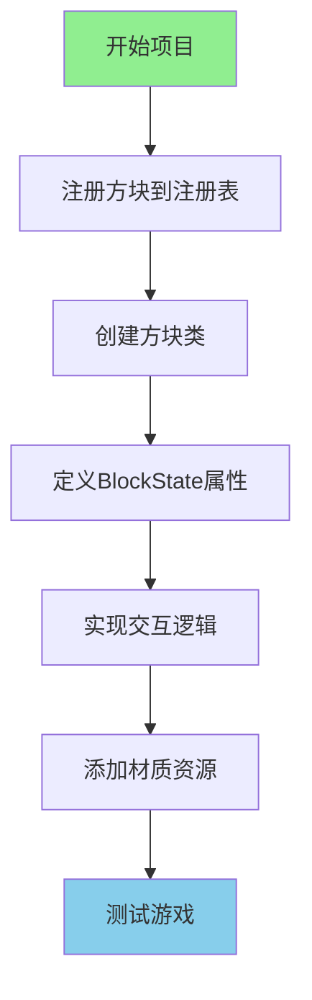
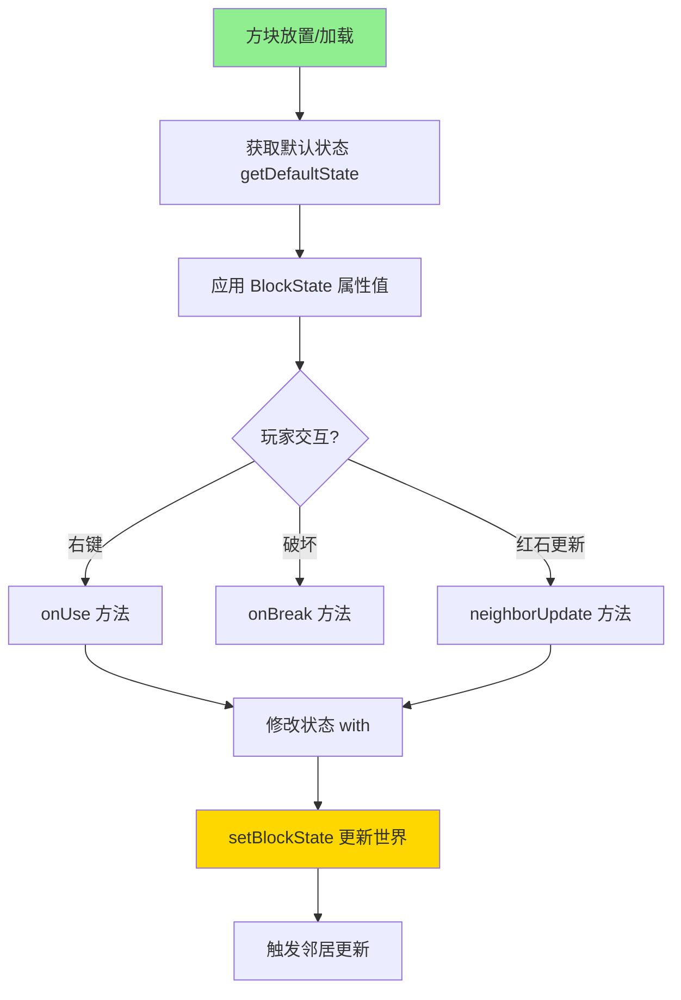

# 第 98 章：项目1：添加新方块（Project 1 — New Block）

>带你创建一个会发光的"魔法水晶方块"！
>
>本项目基于 Minecraft 1.21 方块物品系统源码分析。

---

## 项目目标

学完这个项目后，你将掌握：

- 如何注册一个自定义方块
- 如何创建方块类并设置属性
- 如何给方块添加 BlockState（方块状态）
- 如何给方块添加特殊效果（交互、随机更新）
- 如何添加材质贴图
- 如何测试方块

---

## 项目概览



---

## 前置知识

| 知识 | 说明 |
|------|------|
| 注册表系统 | 理解 `Registry.register()` 的工作原理 |
| Block 类层次 | `Block` → `AbstractBlock` → 具体方块 |
| BlockState | 方块的运行时状态管理 |
| 资源包结构 | 材质、模型的 JSON 配置 |

---

## 步骤详解

### 步骤 1：理解 Minecraft 1.21 方块系统架构

#### 方块类的继承层次

根据 Minecraft 1.21 源码，方块的继承结构如下：

```
98:780:net/minecraft/block/Block.java
┌─────────────────────────────────────────────────────────────┐
│                         Block                                │
│  ├── 注册表条目引用 (RegistryEntry.Reference<Block>)         │
│  ├── 状态管理器 (StateManager<Block, BlockState>)           │
│  └── 默认状态 (BlockState defaultState)                     │
├─────────────────────────────────────────────────────────────┤
│                      AbstractBlock                           │
│  └── 提供方块行为的核心抽象                                 │
├─────────────────────────────────────────────────────────────┤
│              BlockWithEntity (带方块实体的方块)              │
│  └── 需要持久化数据的方块（如箱子、熔炉）                   │
└─────────────────────────────────────────────────────────────┘
```

#### 方块注册的核心代码

```java
// 来自 Block.java 的注册逻辑
public class Block
extends AbstractBlock
implements ItemConvertible,
           FabricBlock {
    
    // 每个方块类型对应一个注册表引用
    private final RegistryEntry.Reference<Block> registryEntry = 
        Registries.BLOCK.createEntry(this);
}
```

---

### 步骤 2：注册方块

#### 核心概念

注册方块就像给方块"上户口"：

```
┌─────────────────────────────────────────┐
│           Minecraft 注册表               │
│                                         │
│  namespace:path = 唯一的"身份证号"       │
│                                         │
│  "minecraft:stone"     ← 石头            │
│  "minecraft:diamond_ore" ← 钻石矿       │
│  "mymod:magic_crystal" ← 你的魔法水晶   │
│                                         │
└─────────────────────────────────────────┘
```

#### 代码实现

在 Mod 主类中添加：

```java
public class MyMod implements ModInitializer {
    
    // ========== 魔法水晶方块 ==========
    public static final Block MAGIC_CRYSTAL = Registry.register(
        Registries.BLOCK,                              // 1. 注册到方块注册表
        Identifier.of("mymod", "magic_crystal"),       // 2. ID = "mymod:magic_crystal"
        new Block(AbstractBlock.Settings.create()       // 3. 创建方块实例
            .strength(3.0f, 6.0f)                    // 硬度3.0, 爆炸抗性6.0
            .luminance(state -> 15)                   // 发光亮度15（最亮）
            .sounds(BlockSoundGroup.AMETHYST)         // 紫水晶音效
            .ticksRandomly()                          // 开启随机刻（用于闪烁效果）
        )
    );
    
    @Override
    public void onInitialize() {
        // 方块注册完成！
    }
}
```

**三要素口诀**：
```
Registry.register(注册表, Identifier, new 方块)
         ↓           ↓          ↓
       放哪柜子     起什么名    什么样子
```

---

### 步骤 3：创建方块类（添加特殊行为）

#### 为什么需要自定义方块类？

普通方块只能设置属性，但如果你想：
- 右键点击时有反应
- 定时改变状态
- 和其他方块交互

就需要创建自定义方块类。

#### BlockState 状态管理

Minecraft 1.21 使用 `StateManager` 管理方块状态：

```java
// 来自 AbstractBlock.java 的状态管理
protected final StateManager<Block, BlockState> stateManager;
private BlockState defaultState;

// 状态属性类型
BooleanProperty FACING = BooleanProperty.of("facing");
IntProperty POWER = IntProperty.of("power", 0, 15);
DirectionProperty HORIZONTAL_FACING = DirectionProperty.create("facing", 
    Direction.Type.HORIZONTAL);
```

#### 完整代码实现

```java
// src/main/java/com/mymod/block/MagicCrystalBlock.java

package com.mymod.block;

import net.minecraft.block.Block;
import net.minecraft.block.BlockState;
import net.minecraft.block.Blocks;
import net.minecraft.util.ActionResult;
import net.minecraft.util.math.BlockPos;
import net.minecraft.world.World;
import net.minecraft.entity.player.PlayerEntity;
import net.minecraft.util.hit.BlockHitResult;
import net.minecraft.server.world.ServerWorld;
import net.minecraft.state.property.IntProperty;
import net.minecraft.state.StateManager;
import net.minecraft.particle.ParticleTypes;
import net.minecraft.text.Text;

import java.util.Random;

public class MagicCrystalBlock extends Block {
    
    // ========== 自定义属性：亮度等级 ==========
    // 这允许方块有 1-15 的亮度级别
    public static final IntProperty LUMINANCE = IntProperty.of("luminance", 1, 15);
    
    public MagicCrystalBlock(Settings settings) {
        super(settings);
        // 设置默认状态：初始亮度为 15（最亮）
        this.setDefaultState(this.stateManager.getDefaultState().with(LUMINANCE, 15));
    }
    
    // ========== 注册状态属性 ==========
    @Override
    protected void appendProperties(StateManager.Builder<Block, BlockState> builder) {
        builder.add(LUMINANCE);
    }
    
    // ========== 右键交互逻辑 ==========
    @Override
    public ActionResult onUse(BlockState state, World world, BlockPos pos, 
                              PlayerEntity player, BlockHitResult hit) {
        if (!world.isClient) {
            // 【服务端执行】- 防止客户端和服务端重复执行
            
            // 1. 发送消息给玩家
            player.sendMessage(Text.literal("你点击了魔法水晶！亮度: " + state.get(LUMINANCE)));
            
            // 2. 生成粒子效果（服务端生成同步到客户端）
            ((ServerWorld) world).spawnParticles(
                ParticleTypes.END_ROD,           // 粒子类型
                pos.getX() + 0.5,               // X 坐标（方块中心）
                pos.getY() + 0.5,               // Y 坐标
                pos.getZ() + 0.5,               // Z 坐标
                10,                             // 粒子数量
                0.2, 0.2, 0.2,                // 扩散范围
                0.01                            // 速度
            );
            
            // 3. 切换亮度状态
            int currentLuminance = state.get(LUMINANCE);
            int newLuminance = (currentLuminance == 15) ? 5 : 15;
            world.setBlockState(pos, state.with(LUMINANCE, newLuminance));
            
            return ActionResult.SUCCESS;
        }
        
        // 【客户端执行】- 返回 CONSUME 表示成功
        return ActionResult.CONSUME;
    }
    
    // ========== 随机刻更新 ==========
    // 类似草方块变泥土、光方块闪烁
    @Override
    protected void randomTick(BlockState state, ServerWorld world, 
                            BlockPos pos, Random random) {
        // 每 tick 有 5% 概率改变亮度
        if (random.nextFloat() < 0.05f) {
            int newLuminance = state.get(LUMINANCE) == 15 ? 5 : 15;
            world.setBlockState(pos, state.with(LUMINANCE, newLuminance));
        }
    }
    
    // ========== 是否启用随机刻 ==========
    @Override
    public boolean hasRandomTicks(BlockState state) {
        return true;
    }
}
```

---

### 步骤 4：方块属性设置详解

#### AbstractBlock.Settings 常用方法

根据 Minecraft 1.21 源码，`AbstractBlock.Settings` 提供了丰富的配置选项：

```java
new Block(AbstractBlock.Settings.create()
    // ========== 基础属性 ==========
    .strength(3.0f, 6.0f)                      // 硬度, 爆炸抗性
    .breakByTool(ParadigmValidators.NORMAL)   // 需要特定工具
    .sounds(BlockSoundGroup.STONE)            // 音效
    
    // ========== 特殊属性 ==========
    .luminance(state -> 15)                   // 发光（0-15）
    .ticksRandomly()                          // 需要随机刻
    .solidBlock((state, world, pos) -> false) // 是否固体
    .suffocates((state, world, pos) -> false) // 是否窒息
    .blockVision((state, world, pos) -> false) // 是否阻挡视野
    
    // ========== 碰撞属性 ==========
    .noCollision()                            // 无碰撞箱（可穿过）
    .nonOpaque()                              // 透明（不阻挡光线）
    .air()                                    // 空气属性
    
    // ========== 可燃属性 ==========
    .burnable()                               // 可燃（木头类）
    .offset(Blocks::getDefaultState)          // 随机偏移放置
    
    // ========== 阻力属性 ==========
    .velocityMultiplier(0.5f)                 // 速度乘数（蜂蜜块）
    .jumpVelocityMultiplier(0.5f)             // 跳跃速度乘数
)
```

#### 属性参考对照表

| 属性 | 钻石 | 石头 | 泥土 | 玻璃 | 蜂蜜块 |
|------|------|------|------|------|--------|
| 硬度 | 5.0 | 1.5 | 0.5 | 0.3 | 0.6 |
| 抗性 | 6.0 | 6.0 | 0.5 | 0.3 | 0.0 |
| 音效 | METAL | STONE | GRASS | GLASS | HONEY |
| 碰撞 | ✓ | ✓ | ✓ | ✗ | ✓ |
| 固体 | ✓ | ✓ | ✓ | ✗ | ✓ |
| 发光 | ✗ | ✗ | ✗ | ✗ | ✗ |

---

### 步骤 5：添加材质贴图

#### 资源文件结构

```
src/main/resources/
└── assets/
    └── mymod/
        ├── textures/
        │   └── block/
        │       └── magic_crystal.png    # 方块材质（16x16 或 32x32）
        └── models/
            └── block/
                └── magic_crystal.json   # 方块模型
```

#### 方块模型 JSON

```json
{
    "parent": "minecraft:block/cube_all",
    "textures": {
        "all": "mymod:block/magic_crystal"
    }
}
```

**模型类型说明**：

| 模型类型 | parent | 用途 |
|----------|--------|------|
| 立方体 | `minecraft:block/cube_all` | 所有面相同纹理 |
| 单面 | `minecraft:block/cube` | 每面可不同纹理 |
| 十字形 | `minecraft:block/cross` | 花草类（非固体） |
| 雪地路径 | `minecraft:block/crop` | 作物类 |

#### 带状态的模型（如果需要）

如果你的方块有多个变体，可以使用 `blockstates`：

```json
// blockstates/magic_crystal.json
{
    "variants": {
        "luminance=1": { "model": "mymod:block/magic_crystal_dim" },
        "luminance=5": { "model": "mymod:block/magic_crystal_dim" },
        "luminance=10": { "model": "mymod:block/magic_crystal_bright" },
        "luminance=15": { "model": "mymod:block/magic_crystal_bright" }
    }
}
```

#### 物品模型 JSON

```json
// models/item/magic_crystal.json
{
    "parent": "mymod:block/magic_crystal"
}
```

---

### 步骤 6：BlockState 生命周期

理解 BlockState 的生命周期对于调试非常重要：



---

## 完整代码

### Mod 主类

```java
package com.mymod;

import net.minecraft.block.Block;
import net.minecraft.block.AbstractBlock;
import net.minecraft.block.BlockSoundGroup;
import net.minecraft.registry.Registries;
import net.minecraft.registry.Registry;
import net.minecraft.util.Identifier;
import net.fabricmc.api.ModInitializer;
import com.mymod.block.MagicCrystalBlock;

public class MyMod implements ModInitializer {
    
    // ========== 注册魔法水晶方块 ==========
    public static final Block MAGIC_CRYSTAL = Registry.register(
        Registries.BLOCK,                              // 方块注册表
        Identifier.of("mymod", "magic_crystal"),       // 唯一标识符
        new MagicCrystalBlock(AbstractBlock.Settings.create()
            .strength(3.0f, 6.0f)                     // 硬度与抗性
            .luminance(state -> state.get(MagicCrystalBlock.LUMINANCE))
            .sounds(BlockSoundGroup.AMETHYST)         // 紫水晶音效
            .ticksRandomly()                          // 开启随机刻
        )
    );
    
    @Override
    public void onInitialize() {
        System.out.println("魔法水晶 Mod 已加载！");
    }
}
```

### 自定义方块类

```java
package com.mymod.block;

import net.minecraft.block.Block;
import net.minecraft.block.BlockState;
import net.minecraft.util.ActionResult;
import net.minecraft.util.math.BlockPos;
import net.minecraft.world.World;
import net.minecraft.entity.player.PlayerEntity;
import net.minecraft.util.hit.BlockHitResult;
import net.minecraft.server.world.ServerWorld;
import net.minecraft.state.property.IntProperty;
import net.minecraft.state.StateManager;
import net.minecraft.particle.ParticleTypes;
import net.minecraft.text.Text;

import java.util.Random;

public class MagicCrystalBlock extends Block {
    
    // ========== 亮度状态属性 ==========
    public static final IntProperty LUMINANCE = IntProperty.of("luminance", 1, 15);
    
    public MagicCrystalBlock(Settings settings) {
        super(settings);
        this.setDefaultState(this.stateManager.getDefaultState().with(LUMINANCE, 15));
    }
    
    // ========== 注册属性到状态管理器 ==========
    @Override
    protected void appendProperties(StateManager.Builder<Block, BlockState> builder) {
        builder.add(LUMINANCE);
    }
    
    // ========== 右键交互 ==========
    @Override
    public ActionResult onUse(BlockState state, World world, BlockPos pos, 
                              PlayerEntity player, BlockHitResult hit) {
        if (!world.isClient) {
            // 服务端逻辑
            player.sendMessage(Text.literal("你点击了魔法水晶！亮度: " + state.get(LUMINANCE)));
            
            // 粒子效果
            ((ServerWorld) world).spawnParticles(
                ParticleTypes.END_ROD,
                pos.getX() + 0.5, pos.getY() + 0.5, pos.getZ() + 0.5,
                10, 0.2, 0.2, 0.2, 0.01
            );
            
            // 切换亮度
            int newLuminance = state.get(LUMINANCE) == 15 ? 5 : 15;
            world.setBlockState(pos, state.with(LUMINANCE, newLuminance));
            
            return ActionResult.SUCCESS;
        }
        return ActionResult.CONSUME;
    }
    
    // ========== 随机刻更新 ==========
    @Override
    protected void randomTick(BlockState state, ServerWorld world, 
                            BlockPos pos, Random random) {
        if (random.nextFloat() < 0.05f) {
            int newLuminance = state.get(LUMINANCE) == 15 ? 5 : 15;
            world.setBlockState(pos, state.with(LUMINANCE, newLuminance));
        }
    }
    
    // ========== 启用随机刻 ==========
    @Override
    public boolean hasRandomTicks(BlockState state) {
        return true;
    }
}
```

---

## 测试步骤

### 测试步骤

1. **启动游戏**
   ```
   运行你的 Mod 开发环境
   ./gradlew runClient
   ```

2. **进入世界**
   ```
   创建一个新世界或进入已有世界
   ```

3. **获取方块**
   ```
   /give @s mymod:magic_crystal
   ```

4. **测试功能**
   - 放置方块，观察是否发光
   - 右键点击，观察粒子效果和消息
   - 等待一会儿，观察亮度自动变化（闪烁效果）

### 预期结果

```
┌─────────────────────────────────────────────────────────┐
│                     测试预期结果                          │
├─────────────────────────────────────────────────────────┤
│                                                         │
│  1. 方块可以正常放置                                    │
│  2. 方块显示为发光状态（亮度 15）                       │
│  3. 右键点击后：                                       │
│     - 聊天栏显示 "你点击了魔法水晶！亮度: 15"           │
│     - 出现粒子效果                                      │
│     - 亮度切换到 5（变暗）                             │
│  4. 等待几秒后，方块亮度会自动在 5 和 15 之间切换       │
│                                                         │
└─────────────────────────────────────────────────────────┘
```

### 常见问题排查

| 问题 | 原因 | 解决方法 |
|------|------|----------|
| 方块不显示 | 材质路径错误 | 检查 `textures/block/magic_crystal.png` 路径 |
| 亮度不变化 | 没开随机刻 | 确保添加了 `.ticksRandomly()` |
| 右键无反应 | 客户端/服务端分离 | 确保逻辑在 `!world.isClient` 中 |
| 模型错误 | JSON 格式错误 | 检查模型 JSON 语法 |
| 注册失败 | Registry is frozen | 确保在 `onInitialize` 中注册 |

---

## 遇到问题怎么办？

### 调试技巧

1. **查看日志**
   ```
   游戏崩溃时查看终端输出，检查具体的错误信息
   ```

2. **逐步测试**
   ```
   先创建最简单的方块（无状态）
   → 添加一个交互功能
   → 添加随机刻功能
   ```

3. **使用命令测试**
   ```
   /setblock ~ ~ ~ mymod:magic_crystal[luminance=10]
   /give @s mymod:magic_crystal 1 0 {"BlockStateTag":{"luminance":"10"}}
   ```

### 常见错误

| 错误信息 | 原因 | 解决方法 |
|----------|------|----------|
| `Registry is frozen` | 注册时机错误 | 确保在 `onInitialize` 中注册 |
| `Missing texture: mymod:block/magic_crystal` | 材质文件不存在 | 检查 textures 目录 |
| `NullPointerException` | 空引用 | 检查 world 是否为 null |
| `No enum constant IntProperty` | 属性值超出范围 | 检查 `IntProperty.of("name", min, max)` |

---

## 扩展挑战

完成了基础项目？试试这些挑战：

### 挑战 1：创建多状态方块

```java
// 添加颜色属性
public static final EnumProperty<CrystalColor> COLOR = 
    EnumProperty.of("color", CrystalColor.class);

// 创建多种颜色的水晶
public enum CrystalColor {
    RED, BLUE, GREEN, PURPLE
}

// 完整的多状态注册
public static final Block MAGIC_CRYSTAL = Registry.register(
    Registries.BLOCK,
    Identifier.of("mymod", "magic_crystal"),
    new MagicCrystalBlock(AbstractBlock.Settings.create()
        .strength(3.0f, 6.0f)
        .luminance(state -> 15)
    )
);

// 组合多个属性
public MagicCrystalBlock(Settings settings) {
    super(settings);
    this.setDefaultState(
        this.stateManager.getDefaultState()
            .with(LUMINANCE, 15)
            .with(COLOR, CrystalColor.PURPLE)
    );
}
```

### 挑战 2：创建可交互的电路方块

```java
// 当被充能时发出红石信号
public class RedstoneCrystalBlock extends Block {
    
    public static final BooleanProperty POWERED = BooleanProperty.of("powered");
    
    @Override
    protected void appendProperties(StateManager.Builder<Block, BlockState> builder) {
        builder.add(POWERED);
    }
    
    // 发出红石信号
    @Override
    public int getWeakRedstonePower(BlockState state) {
        return state.get(POWERED) ? 15 : 0;
    }
    
    // 邻居方块更新时检查
    @Override
    public void neighborUpdate(BlockState state, World world, BlockPos pos, 
                              Block block, BlockPos fromPos, boolean notify) {
        if (!world.isClient) {
            boolean shouldPower = world.isReceivingRedstonePower(pos);
            if (shouldPower != state.get(POWERED)) {
                world.setBlockState(pos, state.with(POWERED, shouldPower));
            }
        }
    }
}
```

### 挑战 3：创建记忆方块（需要 BlockEntity）

```java
// 记住最后点击它的玩家
public class MemoryCrystalBlock extends BlockWithEntity {
    
    @Override
    public BlockEntity createBlockEntity(BlockPos pos, BlockState state) {
        return new MemoryCrystalBlockEntity(pos, state);
    }
    
    @Override
    public ActionResult onUse(BlockState state, World world, BlockPos pos, 
                              PlayerEntity player, BlockHitResult hit) {
        BlockEntity be = world.getBlockEntity(pos);
        if (be instanceof MemoryCrystalBlockEntity memory) {
            // 获取存储的点击者名称
            String lastClicker = memory.getLastClicker();
            if (lastClicker != null) {
                player.sendMessage(Text.literal("上次点击的玩家: " + lastClicker));
            }
            // 更新存储
            memory.setLastClicker(player.getName().getString());
        }
        return super.onUse(state, world, pos, player, hit);
    }
}

// BlockEntity 实现
public class MemoryCrystalBlockEntity extends BlockEntity {
    
    private static final String NBT_KEY = "lastClicker";
    private String lastClicker = null;
    
    public MemoryCrystalBlockEntity(BlockPos pos, BlockState state) {
        super(ModBlockEntities.MEMORY_CRYSTAL, pos, state);
    }
    
    public String getLastClicker() {
        return lastClicker;
    }
    
    public void setLastClicker(String name) {
        this.lastClicker = name;
        this.markDirty();
    }
    
    @Override
    protected void writeNbt(NbtCompound nbt) {
        super.writeNbt(nbt);
        if (lastClicker != null) {
            nbt.putString(NBT_KEY, lastClicker);
        }
    }
    
    @Override
    public void readNbt(NbtCompound nbt) {
        super.readNbt(nbt);
        lastClicker = nbt.getString(NBT_KEY);
    }
}
```

---

## 参考资料

### 相关章节

| 章节 | 内容 |
|------|------|
| [方块物品系统分析](../../-analysis/06-block-item-system.md) | 方块系统的完整源码分析 |
| [BlockState 机制](https://minecraft.wiki/Block_state) | Minecraft Wiki 方块状态 |
| [方块材质制作](https://minecraft.wiki/Tutorials/Creating_texture_packs) | 材质制作教程 |

### 源码参考

| 文件 | 路径 | 说明 |
|------|------|------|
| `Block.java` | `net/minecraft/block/Block.java` | 方块基类 |
| `AbstractBlock.java` | `net/minecraft/block/AbstractBlock.java` | 方块属性定义 |
| `BlockState.java` | `net/minecraft/block/BlockState.java` | 方块状态 |
| `StateManager.java` | `net/minecraft/state/StateManager.java` | 状态管理器 |
| `AmethystBlock.java` | `net/minecraft/block/AmethystBlock.java` | 紫水晶参考实现 |

### 关键代码位置

```java
// Block 构造函数 - Block.java:98
public class Block extends AbstractBlock implements ItemConvertible, FabricBlock {
    private final RegistryEntry.Reference<Block> registryEntry = Registries.BLOCK.createEntry(this);
    protected final StateManager<Block, BlockState> stateManager;
    private BlockState defaultState;
}

// AbstractBlock.Settings 常用方法 - AbstractBlock.java
public AbstractBlock.Settings create() { ... }
public AbstractBlock.Settings strength(float hardness, float resistance) { ... }
public AbstractBlock.Settings luminance(java.util.function.Function<BlockState, Integer> luminance) { ... }
public AbstractBlock.Settings sounds(BlockSoundGroup group) { ... }
```

---

## 下一步

学会了创建方块？接下来我们学习创建物品！

> [项目2：添加新物品](./99-project2-item.md)

---

*文档版本：Minecraft 1.21, Protocol 767, World Version 3953*
*本教程基于 Minecraft 1.21 源码编写*
