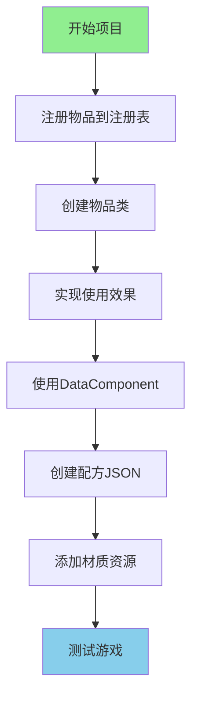

# 第 99 章：项目2：添加新物品（Project 2 — New Item）

>创建一个可以发射火球的"魔法魔杖"！
>
>本项目基于 Minecraft 1.21 组件系统源码分析。

---

## 项目目标

学完这个项目后，你将掌握：

- 如何注册一个自定义物品
- 如何创建物品类并设置属性
- 如何实现物品使用效果
- 如何使用 DataComponent 系统（Minecraft 1.21 新特性）
- 如何创建合成配方（JSON）
- 如何添加材质
- 如何测试物品

---

## 项目概览



---

## 前置知识

| 知识 | 说明 |
|------|------|
| 注册表系统 | 理解 `Registry.register()` 的工作原理 |
| Item 类层次 | `Item` 是物品的基类 |
| ItemStack | 物品堆叠，存储具体物品实例 |
| DataComponent | Minecraft 1.21 新特性，物品数据存储机制 |
| 配方系统 | 了解 JSON 配方格式 |

---

## 步骤详解

### 步骤 1：理解 Minecraft 1.21 物品系统架构

#### 物品类的继承层次

根据 Minecraft 1.21 源码，物品的继承结构如下：

```
96:808:net/minecraft/item/Item.java
┌─────────────────────────────────────────────────────────────┐
│                         Item                                 │
│  ├── 注册表条目 (RegistryEntry.Reference<Item>)               │
│  ├── 组件数据 (ComponentMap components)                      │
│  └── 配方剩余物品 (Item recipeRemainder)                     │
├─────────────────────────────────────────────────────────────┤
│                      具体物品类                              │
│  ├── SwordItem (剑)                                        │
│  ├── PickaxeItem (镐)                                      │
│  ├── FoodItem (食物)                                       │
│  ├── BowItem (弓)                                          │
│  └── BlockItem (方块物品)                                  │
└─────────────────────────────────────────────────────────────┘
```

#### ItemStack - 物品堆叠

```java
148:1373:net/minecraft/item/ItemStack.java
┌─────────────────────────────────────────────────────────────┐
│                     ItemStack                               │
│  ├── 序列化编解码器 (CODEC)                                 │
│  ├── 物品数量 (int count)                                   │
│  ├── 动画时间 (int bobbingAnimationTime)                    │
│  ├── 物品引用 (Item item)                                  │
│  └── 组件映射 (ComponentMapImpl components)                 │
└─────────────────────────────────────────────────────────────┘
```

---

### 步骤 2：注册物品

#### 核心概念

注册物品和注册方块类似，都是"上户口"：

```
┌─────────────────────────────────────────┐
│           Minecraft 注册表               │
│                                         │
│  namespace:path = 唯一的"身份证号"       │
│                                         │
│  "minecraft:diamond_sword" ← 钻石剑      │
│  "minecraft:apple"        ← 苹果         │
│  "mymod:magic_wand"      ← 你的魔法魔杖  │
│                                         │
└─────────────────────────────────────────┘
```

#### 代码实现

```java
public class MyMod implements ModInitializer {
    
    // ========== 魔法魔杖 ==========
    public static final Item MAGIC_WAND = Registry.register(
        Registries.ITEM,                            // 1. 注册到物品注册表
        Identifier.of("mymod", "magic_wand"),      // 2. ID = "mymod:magic_wand"
        new MagicWandItem(new Item.Settings()       // 3. 创建物品实例
            .maxCount(1)                           // 只能堆叠1个
            .maxDamage(100)                        // 100点耐久度
            .rarity(Rarity.RARE)                   // 稀有度：蓝色
        )
    );
    
    @Override
    public void onInitialize() {
        // 物品注册完成！
    }
}
```

---

### 步骤 3：创建物品类

#### 为什么需要自定义物品类？

普通物品只能设置属性，但如果你想：
- 右键使用时发射投射物
- 持有时发光
- 使用时有特殊动画

就需要创建自定义物品类。

#### Item 生命周期方法

根据 Minecraft 1.21 源码，`Item` 类提供了丰富的生命周期方法：

| 方法 | 描述 | 典型用途 |
|------|------|----------|
| `use()` | 玩家开始使用物品时调用 | 食物消耗、弓拉弦 |
| `finishUsing()` | 物品使用完成后调用 | 食物恢复饥饿值 |
| `usageTick()` | 使用过程中的每tick调用 | 弩充能 |
| `onStoppedUsing()` | 提前停止使用时调用 | 弓的取消 |
| `useOnBlock()` | 在方块上使用物品 | 放置方块 |
| `useOnEntity()` | 在实体上使用物品 | 给生物装备鞍 |
| `postMine()` | 成功挖掘方块后调用 | 工具耐久度消耗 |
| `postHit()` | 攻击实体后调用 | 武器耐久度消耗 |
| `inventoryTick()` | 物品在背包中每tick调用 | 物品特殊效果 |

#### 完整代码实现

```java
// src/main/java/com/mymod/item/MagicWandItem.java

package com.mymod.item;

import net.minecraft.item.Item;
import net.minecraft.item.ItemStack;
import net.minecraft.entity.EntityType;
import net.minecraft.entity.projectile.FireballEntity;
import net.minecraft.util.TypedActionResult;
import net.minecraft.util.Hand;
import net.minecraft.world.World;
import net.minecraft.entity.player.PlayerEntity;
import net.minecraft.sound.SoundEvents;
import net.minecraft.sound.SoundCategory;
import net.minecraft.util.math.Vec3d;
import net.minecraft.component.EquipmentSlot;
import net.minecraft.component.DataComponentTypes;

public class MagicWandItem extends Item {
    
    public MagicWandItem(Settings settings) {
        super(settings);
    }
    
    // ========== 右键使用物品 ==========
    @Override
    public TypedActionResult<ItemStack> use(World world, PlayerEntity player, Hand hand) {
        if (!world.isClient) {
            // 【服务端执行】
            
            // 1. 获取玩家朝向
            Vec3d direction = player.getRotationVecClient();
            
            // 2. 创建火球
            FireballEntity fireball = new FireballEntity(
                EntityType.FIREBALL,
                world
            );
            
            // 3. 设置火球位置（在玩家前方）
            fireball.setPosition(
                player.getX() + direction.x * 1.5,
                player.getY() + direction.y * 1.5 + 1.5,  // 眼睛高度
                player.getZ() + direction.z * 1.5
            );
            
            // 4. 设置火球速度（方向 * 速度）
            fireball.setVelocity(direction.x * 2, direction.y * 2, direction.z * 2);
            
            // 5. 生成火球到世界
            world.spawnEntity(fireball);
            
            // 6. 获取物品并消耗耐久度
            ItemStack stack = player.getStackInHand(hand);
            stack.damage(1, player, EquipmentSlot.MAINHAND);
            
            // 7. 播放音效
            world.playSound(
                null,                                        // 无位置（使用玩家位置）
                player.getX(), player.getY(), player.getZ(),
                SoundEvents.ENTITY_BLAZE_SHOOT,              // 烈焰人发射音效
                SoundCategory.PLAYERS,
                0.5f,                                       // 音量
                1.5f                                        // 音调
            );
            
            return TypedActionResult.success(stack);
        }
        
        // 【客户端执行】- 返回 pass 表示需要继续处理
        return TypedActionResult.pass(player.getStackInHand(hand));
    }
}
```

---

### 步骤 4：Minecraft 1.21 组件系统

Minecraft 1.21 引入了全新的组件系统来替代旧的 NBT 数据存储方式。

#### 组件系统架构

```java
// 组件操作示例 - 来自 ItemStack.java
ItemStack stack = new ItemStack(Items.DIAMOND_SWORD);

// 设置组件
stack.set(DataComponentTypes.CUSTOM_NAME, Text.literal("My Sword"));

// 获取组件
int damage = stack.getDamage();

// 移除组件
stack.remove(DataComponentTypes.ENCHANTMENTS);
```

#### 常用组件类型

| 组件类型 | 说明 | 用法 |
|----------|------|------|
| `CUSTOM_NAME` | 自定义名称 | `Text.literal("...")` |
| `ENCHANTMENTS` | 附魔 | `EnchantmentComponent` |
| `DAMAGE` | 耐久度损伤 | `int` |
| `MAX_DAMAGE` | 最大耐久度 | `int` |
| `FOOD` | 食物属性 | `FoodComponent` |
| `DYED_COLOR` | 染色颜色 | `int` (RGB) |
| `LORE` | 物品描述 | `List<Text>` |
| `UNBREAKABLE` | 无法破坏 | `boolean` |
| `HIDE_ADDITIONAL_TOOLTIP` | 隐藏额外提示 | `boolean` |
| `ENCHANTMENT_GLINT_OVERRIDE` | 附魔光效覆盖 | `boolean` |

#### 组件在物品注册中的应用

```java
// 使用组件注册物品
public static final Item MAGIC_CRYSTAL = Registry.register(
    Registries.ITEM,
    Identifier.of("mymod", "magic_crystal"),
    new BlockItem(MAGIC_CRYSTAL_BLOCK, new Item.Settings()
        .component(DataComponentTypes.ENCHANTMENT_GLINT_OVERRIDE, true)  // 附魔光效
        .component(DataComponentTypes.RARITY, Rarity.EPIC)                // 史诗稀有度
    )
);
```

---

### 步骤 5：创建合成配方（JSON）

#### 配方文件结构

```
src/main/resources/
└── data/
    └── mymod/
        └── recipes/
            └── magic_wand.json
```

#### 有形状合成配方

```json
{
    "type": "minecraft:crafting_shaped",
    "category": "equipment",
    "group": "magic_wands",
    "pattern": [
        "  E",
        " S ",
        "S  "
    ],
    "key": {
        "E": {
            "item": "minecraft:ender_eye"
        },
        "S": {
            "item": "minecraft:stick"
        }
    },
    "result": {
        "item": "mymod:magic_wand",
        "count": 1
    }
}
```

#### 配方图示

```
合成台预览：
  [ ] [E] [ ]     E = 末影之眼
  [S] [ ] [ ]  =  S = 木棍
  [S] [ ] [ ]
  
结果：魔法魔杖 x1
```

#### 无形状合成配方

```json
{
    "type": "minecraft:crafting_shapeless",
    "category": "misc",
    "group": "magic_items",
    "ingredients": [
        {"item": "minecraft:diamond"},
        {"item": "minecraft:diamond"},
        {"item": "minecraft:blaze_powder"},
        {"item": "minecraft:stick"}
    ],
    "result": {
        "item": "mymod:magic_wand",
        "count": 1
    }
}
```

#### 熔炉配方

```json
{
    "type": "minecraft:smelting",
    "category": "misc",
    "group": "magic_dust",
    "ingredient": {
        "item": "mymod:raw_magic_ore"
    },
    "result": "mymod:magic_dust",
    "experience": 0.5,
    "cookingtime": 200
}
```

---

### 步骤 6：添加材质

#### 材质文件结构

```
src/main/resources/
└── assets/
    └── mymod/
        ├── textures/
        │   └── item/
        │       └── magic_wand.png    # 物品材质（16x16）
        └── models/
            └── item/
                └── magic_wand.json   # 物品模型
```

#### 物品模型 JSON

```json
{
    "parent": "minecraft:item/handheld",
    "textures": {
        "layer0": "mymod:item/magic_wand"
    }
}
```

**常用模型类型**：

| 模型类型 | parent | 用途 |
|----------|--------|------|
| 手持物品 | `minecraft:item/handheld` | 剑、工具等 |
| 手持物品（有动画） | `minecraft:item/handheld_rod` | 钓鱼竿 |
| 生成物品 | `minecraft:item/generated` | 消耗品、杂物 |

---

## 完整代码

### Mod 主类

```java
package com.mymod;

import net.minecraft.item.Item;
import net.minecraft.item.ItemStack;
import net.minecraft.registry.Registries;
import net.minecraft.registry.Registry;
import net.minecraft.util.Identifier;
import net.minecraft.util.Rarity;
import net.minecraft.component.DataComponentTypes;
import net.fabricmc.api.ModInitializer;
import com.mymod.item.MagicWandItem;

public class MyMod implements ModInitializer {
    
    // ========== 注册魔法魔杖 ==========
    public static final Item MAGIC_WAND = Registry.register(
        Registries.ITEM,
        Identifier.of("mymod", "magic_wand"),
        new MagicWandItem(new Item.Settings()
            .maxCount(1)                              // 不可堆叠
            .maxDamage(100)                           // 100点耐久
            .rarity(Rarity.RARE)                     // 稀有度
            .component(DataComponentTypes.ENCHANTMENT_GLINT_OVERRIDE, true)  // 附魔光效
        )
    );
    
    // ========== 注册魔法水晶（方块物品） ==========
    public static final Block MAGIC_CRYSTAL_BLOCK = Registry.register(
        Registries.BLOCK,
        Identifier.of("mymod", "magic_crystal"),
        new Block(...)
    );
    
    public static final Item MAGIC_CRYSTAL = Registry.register(
        Registries.ITEM,
        Identifier.of("mymod", "magic_crystal"),
        new BlockItem(MAGIC_CRYSTAL_BLOCK, new Item.Settings()
            .component(DataComponentTypes.ENCHANTMENT_GLINT_OVERRIDE, true)
        )
    );
    
    @Override
    public void onInitialize() {
        System.out.println("魔法魔杖 Mod 已加载！");
    }
}
```

### 自定义物品类

```java
package com.mymod.item;

import net.minecraft.item.Item;
import net.minecraft.item.ItemStack;
import net.minecraft.entity.EntityType;
import net.minecraft.entity.projectile.FireballEntity;
import net.minecraft.util.TypedActionResult;
import net.minecraft.util.Hand;
import net.minecraft.world.World;
import net.minecraft.entity.player.PlayerEntity;
import net.minecraft.sound.SoundEvents;
import net.minecraft.sound.SoundCategory;
import net.minecraft.util.math.Vec3d;
import net.minecraft.component.EquipmentSlot;

public class MagicWandItem extends Item {
    
    public MagicWandItem(Settings settings) {
        super(settings);
    }
    
    @Override
    public TypedActionResult<ItemStack> use(World world, PlayerEntity player, Hand hand) {
        if (!world.isClient) {
            // 获取玩家朝向
            Vec3d direction = player.getRotationVecClient();
            
            // 创建火球
            FireballEntity fireball = new FireballEntity(
                EntityType.FIREBALL,
                world
            );
            
            // 设置火球位置
            fireball.setPosition(
                player.getX() + direction.x * 1.5,
                player.getY() + direction.y * 1.5 + 1.5,
                player.getZ() + direction.z * 1.5
            );
            
            // 设置火球速度
            fireball.setVelocity(direction.x * 2, direction.y * 2, direction.z * 2);
            
            // 生成火球
            world.spawnEntity(fireball);
            
            // 消耗耐久
            ItemStack stack = player.getStackInHand(hand);
            stack.damage(1, player, EquipmentSlot.MAINHAND);
            
            // 播放音效
            world.playSound(
                null,
                player.getX(), player.getY(), player.getZ(),
                SoundEvents.ENTITY_BLAZE_SHOOT,
                SoundCategory.PLAYERS,
                0.5f, 1.5f
            );
            
            return TypedActionResult.success(stack);
        }
        
        return TypedActionResult.pass(player.getStackInHand(hand));
    }
}
```

---

## 更多物品效果示例

### 示例 1：传送魔杖

```java
public class TeleportWandItem extends Item {
    
    public TeleportWandItem(Settings settings) {
        super(settings);
    }
    
    @Override
    public TypedActionResult<ItemStack> use(World world, PlayerEntity player, Hand hand) {
        if (!world.isClient && world.getServer() != null) {
            // 获取主世界
            ServerWorld overworld = world.getServer().getWorld(World.OVERWORLD);
            if (overworld == null) {
                return TypedActionResult.fail(player.getStackInHand(hand));
            }
            
            // 传送到顶部
            int teleportY = (int) overworld.getTopY();
            player.teleport(
                overworld,
                player.getX(), teleportY, player.getZ(),
                player.getYaw(), player.getPitch()
            );
            
            // 消耗耐久
            player.getStackInHand(hand).damage(1, player, EquipmentSlot.MAINHAND);
            
            // 粒子效果
            ((ServerWorld) world).spawnParticles(
                Particles.PORTAL,
                player.getX(), player.getY(), player.getZ(),
                20, 0.5, 1, 0.5, 0.1
            );
            
            return TypedActionResult.success(player.getStackInHand(hand));
        }
        
        return TypedActionResult.pass(player.getStackInHand(hand));
    }
}
```

### 示例 2：食物物品

```java
public class MagicAppleItem extends Item {
    
    public MagicAppleItem(Settings settings) {
        super(settings.food(new FoodComponent.Builder()
            .hunger(10)                    // 恢复10点饥饿
            .saturationModifier(15f)       // 高饱和度
            .statusEffect(
                new StatusEffectInstance(StatusEffects.REGENERATION, 200, 1),
                1.0f                       // 100%概率
            )
            .alwaysEdible()                // 饱腹时也能吃
            .build()
        ));
    }
}
```

### 示例 3：药水效果物品

```java
public class PotionWandItem extends Item {
    
    public PotionWandItem(Settings settings) {
        super(settings);
    }
    
    @Override
    public TypedActionResult<ItemStack> use(World world, PlayerEntity player, Hand hand) {
        if (!world.isClient) {
            // 给予力量效果
            player.addStatusEffect(new StatusEffectInstance(
                StatusEffects.STRENGTH,     // 力量效果
                60 * 20,                   // 持续60秒
                1                          // 等级1（第二级）
            ));
            
            // 给予抗性提升效果
            player.addStatusEffect(new StatusEffectInstance(
                StatusEffects.RESISTANCE,
                60 * 20,
                0                          // 等级0（第一级）
            ));
            
            // 消耗物品
            player.getStackInHand(hand).decrement(1);
            
            // 播放音效
            world.playSound(
                null, player.getX(), player.getY(), player.getZ(),
                SoundEvents.ENTITY_WANDERING_TRADER_DRINK_MILK,
                SoundCategory.PLAYERS, 1.0f, 1.0f
            );
            
            return TypedActionResult.success(player.getStackInHand(hand));
        }
        
        return TypedActionResult.pass(player.getStackInHand(hand));
    }
}
```

---

## 测试步骤

### 测试步骤

1. **启动游戏**
   ```
   ./gradlew runClient
   ```

2. **进入世界**
   ```
   创建一个新世界或进入已有世界
   ```

3. **获取物品**
   ```
   /give @s mymod:magic_wand
   ```

4. **测试功能**
   - 右键使用，观察是否发射火球
   - 检查耐久度是否减少
   - 尝试用完耐久度

5. **测试配方**
   ```
   /reload
   打开合成台
   放置对应材料进行合成
   ```

### 预期结果

```
┌─────────────────────────────────────────────────────────┐
│                     测试预期结果                          │
├─────────────────────────────────────────────────────────┤
│                                                         │
│  1. 物品可以正常获取                                    │
│  2. 物品显示为可堆叠1个                                 │
│  3. 右键点击后：                                       │
│     - 发射一个火球                                      │
│     - 耐久度减少1                                      │
│     - 播放烈焰人射击音效                                │
│  4. 耐久度用完后物品消失                                │
│                                                         │
└─────────────────────────────────────────────────────────┘
```

### 常见问题排查

| 问题 | 原因 | 解决方法 |
|------|------|----------|
| 物品不显示 | 物品模型路径错误 | 检查 `textures/item/` 目录 |
| 右键无反应 | 客户端/服务端分离 | 确保逻辑在 `!world.isClient` |
| 耐久度不减少 | 需要在 `use()` 中手动调用 | `stack.damage(1, player, ...)` |
| 配方找不到 | JSON 格式错误或位置错误 | 检查 data 目录结构 |

---

## 遇到问题怎么办？

### 调试技巧

1. **查看日志**
   ```
   游戏崩溃时查看终端输出
   ```

2. **逐步测试**
   ```
   先创建最简单的物品
   → 添加一个功能
   → 再添加一个功能
   ```

3. **使用命令测试**
   ```
   /give @s mymod:magic_wand{Enchantments:[{id:"minecraft:unbreaking",lvl:10}]}
   ```

### 常见错误

| 错误信息 | 原因 | 解决方法 |
|----------|------|----------|
| `Registry is frozen` | 注册时机错误 | 确保在 `onInitialize` 中注册 |
| `NullPointerException` | world 为 null | 检查 `world.isClient` 条件 |
| `ConcurrentModificationException` | 在遍历中修改集合 | 使用 `List` 而非直接遍历 |

---

## 扩展挑战

### 挑战 1：创建工具物品

```java
public class MagicPickaxeItem extends PickaxeItem {
    
    public MagicPickaxeItem(ToolMaterial material, float attackDamage, 
                           float attackSpeed, Settings settings) {
        super(material, attackDamage, attackSpeed, settings);
    }
    
    @Override
    public boolean postHit(ItemStack stack, LivingEntity target, LivingEntity attacker) {
        // 击中时给予力量效果
        attacker.addStatusEffect(new StatusEffectInstance(
            StatusEffects.STRENGTH, 60 * 20, 0
        ));
        return super.postHit(stack, target, attacker);
    }
}
```

### 挑战 2：创建弓类物品

```java
public class LightningBowItem extends BowItem {
    
    @Override
    public void onStoppedUsing(ItemStack stack, World world, 
                              LivingEntity user, int remainingUseTicks) {
        // 发射雷电箭矢
        super.onStoppedUsing(stack, world, user, remainingUseTicks);
        
        // 自定义逻辑：召唤雷电
        if (!world.isClient) {
            // 计算箭矢落点并召唤雷电
        }
    }
}
```

### 挑战 3：使用自定义组件

```java
// 注册自定义组件
public static final ComponentType<Integer> CHARGES = 
    ComponentType.<Integer>builder()
        .codec(Codecs.INT)
        .packetCodec(PacketByteBuf::writeVarInt, PacketByteBuf::readVarInt)
        .build();

// 使用自定义组件
public static final Item POWER_STONE = Registry.register(
    Registries.ITEM,
    Identifier.of("mymod", "power_stone"),
    new PowerStoneItem(new Item.Settings()
        .component(CHARGES, 10)  // 默认10次充能
    )
);
```

---

## 参考资料

### 相关章节

| 章节 | 内容 |
|------|------|
| [方块物品系统分析](../../-analysis/06-block-item-system.md) | 物品系统的完整源码分析 |
| [配方系统分析](../../-analysis/15-recipe-system.md) | 配方系统的完整源码分析 |

### 源码参考

| 文件 | 路径 | 说明 |
|------|------|------|
| `Item.java` | `net/minecraft/item/Item.java` | 物品基类 |
| `ItemStack.java` | `net/minecraft/item/ItemStack.java` | 物品堆叠/组件 |
| `Items.java` | `net/minecraft/item/Items.java` | 原版物品定义 |
| `SwordItem.java` | `net/minecraft/item/SwordItem.java` | 剑物品参考 |
| `BowItem.java` | `net/minecraft/item/BowItem.java` | 弓物品参考 |
| `FoodItem.java` | `net/minecraft/item/FoodItem.java` | 食物物品参考 |
| `DataComponentTypes.java` | `net/minecraft/component/DataComponentTypes.java` | 组件类型常量 |

### 关键代码位置

```java
// Item 构造函数 - Item.java:96
public class Item {
    private final RegistryEntry.Reference<Item> registryEntry = Registries.ITEM.createEntry(this);
    private final ComponentMap components;
    private final Item recipeRemainder;
}

// 组件操作 - ItemStack.java:148
public final class ItemStack implements ComponentHolder {
    private int count;
    private final Item item;
    final ComponentMapImpl components;
    
    public <T> void set(ComponentType<T> type, @Nullable T value) { ... }
    public <T> T get(ComponentType<T> type) { ... }
    public <T> T remove(ComponentType<? extends T> type) { ... }
}
```

---

## 下一步

学会了创建物品？接下来我们学习创建生物实体！

> [项目3：添加新生物](./100-project3-entity.md)

---

*文档版本：Minecraft 1.21, Protocol 767, World Version 3953*
*本教程基于 Minecraft 1.21 源码编写*
