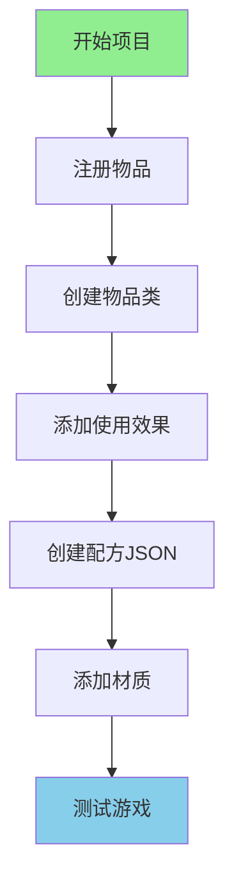

# 项目2：添加新物品

> 创建一个可以发射火球的"魔法魔杖"！

---

## 项目目标

学完这个项目后，你将掌握：
- 如何注册一个自定义物品
- 如何创建物品类并设置属性
- 如何添加使用效果
- 如何创建合成配方（JSON）
- 如何添加材质
- 如何测试物品

---

## 项目概览



---

## 所需知识

- 注册表基础（Part-1 第4章）
- 物品基础（Part-3 第17章）
- 配方系统（Part-8 第44章）
- 数据包结构（Part-8 第41章）

---

## 步骤详解

### 步骤 1：什么是物品？

#### 物品 vs 方块

```
┌─────────────────────────────────────────┐
│                                         │
│    物品 (Item)                          │
│      │                                  │
│      ├── 可以吃的 = 食物                  │
│      │   └── 苹果、金萝卜、蛋糕...      │
│      │                                  │
│      ├── 可以用的 = 工具/武器            │
│      │   └── 镐子、斧头、剑...         │
│      │                                  │
│      └── 可以放的 = BlockItem            │
│          └── 对应一个方块               │
│                                         │
└─────────────────────────────────────────┘
```

#### 生活中的比喻

```
物品就像超市里的商品：

┌─────────────────────────────────────────┐
│  物品类型        │  超市类比            │
├─────────────────┼─────────────────────  │
│  食物           │  食品区（可以吃）     │
│  工具           │  五金区（可以用）     │
│  方块物品       │  建材区（可以放）     │
│  弹药           │  射击区（可以扔）     │
└─────────────────────────────────────────┘
```

---

### 步骤 2：注册物品

#### 核心概念

注册物品和注册方块类似，都是"上户口"：

```
┌─────────────────────────────────────────┐
│           Minecraft 注册表               │
│                                         │
│  namespace:path = 唯一的"身份证号"       │
│                                         │
│  "minecraft:diamond_sword" ← 钻石剑      │
│  "minecraft:apple"        ← 苹果         │
│  "mymod:magic_wand"      ← 你的魔法魔杖  │
│                                         │
└─────────────────────────────────────────┘
```

#### 代码实现

在 Mod 主类中添加：

```java
public class MyMod implements ModInitializer {
    
    // 定义一个魔法魔杖物品
    public static final Item MAGIC_WAND = Registry.register(
        Registries.ITEM,                            // 1. 注册到物品注册表
        Identifier.of("mymod", "magic_wand"),      // 2. ID = "mymod:magic_wand"
        new MagicWandItem(new Item.Settings()      // 3. 创建物品实例
            .maxCount(1)                           // 只能堆叠1个
            .maxDamage(100)                        // 100点耐久度
            .rarity(Rarity.RARE)                   // 稀有度：蓝色
        )
    );
    
    @Override
    public void onInitialize() {
        // 物品注册完成！
    }
}
```

**三要素口诀**：
```
Registry.register(注册表, Identifier, new 物品)
         ↓           ↓          ↓
       放哪柜子     起什么名    什么样子
```

---

### 步骤 3：创建物品类

#### 为什么需要自定义物品类？

普通物品只能设置属性，但如果你想：
- 右键使用时发射火球
- 持有时发光
- 使用时有特殊动画

就需要创建自定义物品类。

#### 代码实现

```java
// src/main/java/com/mymod/item/MagicWandItem.java

public class MagicWandItem extends Item {
    
    public MagicWandItem(Settings settings) {
        super(settings);
    }
    
    // 右键使用物品
    @Override
    public TypedActionResult<ItemStack> use(World world, PlayerEntity player, Hand hand) {
        if (!world.isClient) {
            // 在服务端执行
            
            // 创建火球
            FireballEntity fireball = new FireballEntity(
                EntityType.FIREBALL,     // 火球类型
                world                    // 世界
            );
            
            // 设置火球位置（在玩家前方）
            Vec3d direction = player.getRotationVecClient();
            fireball.setPosition(
                player.getX() + direction.x * 1.5,
                player.getY() + direction.y * 1.5 + 1.5,
                player.getZ() + direction.z * 1.5
            );
            
            // 设置火球方向
            fireball.setVelocity(direction.x * 2, direction.y * 2, direction.z * 2);
            
            // 生成火球
            world.spawnEntity(fireball);
            
            // 消耗耐久度
            ItemStack stack = player.getStackInHand(hand);
            stack.damage(1, player, EquipmentSlot.MAINHAND);
            
            // 播放音效
            world.playSound(
                null, 
                player.getX(), player.getY(), player.getZ(),
                SoundEvents.ENTITY_BLAZE_SHOOT,
                SoundCategory.PLAYERS,
                0.5f, 
                1.5f
            );
            
            return TypedActionResult.success(stack);
        }
        
        return TypedActionResult.pass(player.getStackInHand(hand));
    }
}
```

---

### 步骤 4：添加使用效果

#### 常见使用效果

```java
// 1. 发射投射物
@Override
public TypedActionResult<ItemStack> use(World world, PlayerEntity player, Hand hand) {
    // 创建箭矢/火球/末影珍珠等
    ProjectileEntity projectile = new ArrowEntity(world, player);
    // 设置位置和方向
    projectile.setPosition(...);
    projectile.setVelocity(...);
    world.spawnEntity(projectile);
    return TypedActionResult.success(stack);
}

// 2. 给予药水效果
@Override
public TypedActionResult<ItemStack> use(World world, PlayerEntity player, Hand hand) {
    player.addStatusEffect(new StatusEffectInstance(
        StatusEffects.STRENGTH,    // 力量效果
        60 * 20,                   // 持续60秒
        0                          // 等级0（第一级）
    ));
    return TypedActionResult.success(stack);
}

// 3. 传送玩家
@Override
public TypedActionResult<ItemStack> use(World world, PlayerEntity player, Hand hand) {
    // 传送到主世界出生点
    ServerWorld overworld = world.getServer().getWorld(World.OVERWORLD);
    BlockPos spawn = overworld.getSpawnPos();
    player.teleport(spawn.getX(), spawn.getY(), spawn.getZ());
    return TypedActionResult.success(stack);
}

// 4. 消耗物品并给予新物品
@Override
public ItemStack finishUsing(ItemStack stack, World world, LivingEntity user) {
    // 消耗1个物品
    stack.decrement(1);
    
    // 给予新物品（空瓶子）
    if (stack.isEmpty()) {
        return new ItemStack(Items.GLASS_BOTTLE);
    }
    
    return stack;
}
```

#### 完整示例：传送魔杖

```java
public class TeleportWandItem extends Item {
    
    public TeleportWandItem(Settings settings) {
        super(settings);
    }
    
    @Override
    public TypedActionResult<ItemStack> use(World world, PlayerEntity player, Hand hand) {
        if (!world.isClient && world.getServer() != null) {
            // 获取主世界
            ServerWorld overworld = world.getServer().getWorld(World.OVERWORLD);
            if (overworld == null) {
                return TypedActionResult.fail(player.getStackInHand(hand));
            }
            
            // 传送到100格上方
            int teleportY = (int) overworld.getTopY();
            player.teleport(
                overworld,
                player.getX(), teleportY, player.getZ(),
                player.getYaw(), player.getPitch()
            );
            
            // 消耗耐久
            player.getStackInHand(hand).damage(1, player, EquipmentSlot.MAINHAND);
            
            // 粒子效果
            ((ServerWorld) world).spawnParticles(
                Particles.PORTAL,
                player.getX(), player.getY(), player.getZ(),
                20, 0.5, 1, 0.5, 0.1
            );
            
            return TypedActionResult.success(player.getStackInHand(hand));
        }
        
        return TypedActionResult.pass(player.getStackInHand(hand));
    }
}
```

---

### 步骤 5：创建合成配方（JSON）

#### 配方文件结构

```
data/
└── mymod/
    └── recipes/
        └── magic_wand.json
```

#### 有形状合成配方

```json
{
    "type": "minecraft:crafting_shaped",
    "category": "equipment",
    "group": "magic_wands",
    "pattern": [
        "  E",
        " S ",
        "S  "
    ],
    "key": {
        "E": {
            "item": "minecraft:ender_eye"
        },
        "S": {
            "item": "minecraft:stick"
        }
    },
    "result": {
        "item": "mymod:magic_wand",
        "count": 1
    }
}
```

#### 配方图示

```
合成台预览：
  [ ] [E] [ ]     E = 末影之眼
  [S] [ ] [ ]  =  S = 木棍
  [S] [ ] [ ]
  
结果：魔法魔杖 x1
```

#### 无形状合成配方

```json
{
    "type": "minecraft:crafting_shapeless",
    "category": "misc",
    "ingredients": [
        {"item": "minecraft:diamond"},
        {"item": "minecraft:diamond"},
        {"item": "minecraft:blaze_rod"},
        {"item": "minecraft:stick"}
    ],
    "result": {
        "item": "mymod:magic_wand",
        "count": 1
    }
}
```

---

### 步骤 6：添加材质

#### 材质文件结构

```
resources/
└── assets/
    └── mymod/
        └── textures/
            └── item/
                └── magic_wand.png    # 物品材质（16x16）
```

#### 物品模型 JSON

```json
{
    "parent": "minecraft:item/handheld",
    "textures": {
        "layer0": "mymod:item/magic_wand"
    }
}
```

---

### 步骤 7：测试

#### 测试步骤

1. **启动游戏**
   ```
   运行你的 Mod 开发环境
   ```

2. **进入世界**
   ```
   创建一个新世界或进入已有世界
   ```

3. **获取物品**
   ```
   /give @s mymod:magic_wand
   ```

4. **测试功能**
   - 右键使用，观察是否发射火球
   - 检查耐久度是否减少
   - 尝试用完耐久度

5. **测试配方**
   ```
   /reload
   打开合成台
   放置对应材料进行合成
   ```

#### 常见问题排查

| 问题 | 原因 | 解决方法 |
|------|------|----------|
| 物品不显示 | 物品模型路径错误 | 检查 textures 目录 |
| 右键无反应 | 客户端/服务端分离 | 确保逻辑在 `!world.isClient` |
| 耐久度不减少 | 需要在 `use()` 中手动调用 | `stack.damage(1, player, ...)` |
| 配方找不到 | JSON 格式错误或位置错误 | 检查 data 目录结构 |

---

## 完整代码

### Mod 主类

```java
package com.mymod;

import net.minecraft.item.Item;
import net.minecraft.registry.Registries;
import net.minecraft.registry.Registry;
import net.minecraft.util.Identifier;
import net.minecraft.util.Rarity;
import net.fabricmc.api.ModInitializer;
import com.mymod.item.MagicWandItem;

public class MyMod implements ModInitializer {
    
    // 注册魔法魔杖
    public static final Item MAGIC_WAND = Registry.register(
        Registries.ITEM,
        Identifier.of("mymod", "magic_wand"),
        new MagicWandItem(new Item.Settings()
            .maxCount(1)
            .maxDamage(100)
            .rarity(Rarity.RARE)
        )
    );
    
    @Override
    public void onInitialize() {
        System.out.println("魔法魔杖 Mod 已加载！");
    }
}
```

### 自定义物品类

```java
package com.mymod.item;

import net.minecraft.item.Item;
import net.minecraft.item.ItemStack;
import net.minecraft.entity.projectile.FireballEntity;
import net.minecraft.entity.EntityType;
import net.minecraft.util.TypedActionResult;
import net.minecraft.util.Hand;
import net.minecraft.world.World;
import net.minecraft.entity.player.PlayerEntity;
import net.minecraft.sound.SoundEvents;
import net.minecraft.sound.SoundCategory;
import net.minecraft.util.math.Vec3d;
import net.minecraft.component.EquipmentSlot;

public class MagicWandItem extends Item {
    
    public MagicWandItem(Settings settings) {
        super(settings);
    }
    
    @Override
    public TypedActionResult<ItemStack> use(World world, PlayerEntity player, Hand hand) {
        if (!world.isClient) {
            // 获取玩家朝向
            Vec3d direction = player.getRotationVecClient();
            
            // 创建火球
            FireballEntity fireball = new FireballEntity(
                EntityType.FIREBALL,
                world
            );
            
            // 设置火球位置
            fireball.setPosition(
                player.getX() + direction.x * 1.5,
                player.getY() + direction.y * 1.5 + 1.5,
                player.getZ() + direction.z * 1.5
            );
            
            // 设置火球速度
            fireball.setVelocity(direction.x * 2, direction.y * 2, direction.z * 2);
            
            // 生成火球
            world.spawnEntity(fireball);
            
            // 消耗耐久
            ItemStack stack = player.getStackInHand(hand);
            stack.damage(1, player, EquipmentSlot.MAINHAND);
            
            // 播放音效
            world.playSound(
                null,
                player.getX(), player.getY(), player.getZ(),
                SoundEvents.ENTITY_BLAZE_SHOOT,
                SoundCategory.PLAYERS,
                0.5f, 1.5f
            );
            
            return TypedActionResult.success(stack);
        }
        
        return TypedActionResult.pass(player.getStackInHand(hand));
    }
}
```

---

## 遇到问题怎么办？

### 调试技巧

1. **查看日志**
   ```
   游戏崩溃时查看终端输出
   ```

2. **逐步测试**
   ```
   先创建最简单的物品
   → 添加一个功能
   → 再添加一个功能
   ```

3. **使用命令测试**
   ```
   /give @s mymod:magic_wand{Enchantments:[{id:"minecraft:unbreaking",lvl:10}]}
   ```

### 常见错误

| 错误信息 | 原因 | 解决方法 |
|----------|------|----------|
| `Registry is frozen` | 注册时机错误 | 确保在 `onInitialize` 中注册 |
| `NullPointerException` | world 为 null | 检查 `world.isClient` 条件 |
| `ConcurrentModificationException` | 在遍历中修改集合 | 使用 `List` 而非直接遍历 |

---

## 扩展挑战

完成了基础项目？试试这些挑战：

### 挑战 1：创建食物物品

```java
public class MagicAppleItem extends Item {
    
    public MagicAppleItem(Settings settings) {
        super(settings.food(new FoodComponent.Builder()
            .hunger(10)                    // 恢复10点饥饿
            .saturationModifier(15f)      // 高饱和度
            .statusEffect(
                new StatusEffectInstance(StatusEffects.REGENERATION, 200, 1),
                1.0f                      // 100%概率
            )
            .alwaysEdible()               // 饱腹时也能吃
            .build()
        ));
    }
}
```

### 挑战 2：创建弓类物品

```java
public class LightningBowItem extends BowItem {
    
    @Override
    public void onStoppedUsing(ItemStack stack, World world, 
                               LivingEntity user, int remainingUseTicks) {
        // 发射雷电箭矢
        // 类似原版弓的逻辑
    }
}
```

### 挑战 3：创建工具物品

```java
public class MagicPickaxeItem extends PickaxeItem {
    
    public MagicPickaxeItem(ToolMaterial material, float attackDamage, 
                           float attackSpeed, Settings settings) {
        super(material, attackDamage, attackSpeed, settings);
    }
    
    @Override
    public boolean postHit(ItemStack stack, LivingEntity target, LivingEntity attacker) {
        // 击中时给予力量效果
        attacker.addStatusEffect(new StatusEffectInstance(
            StatusEffects.STRENGTH, 60 * 20, 0
        ));
        return super.postHit(stack, target, attacker);
    }
}
```

---

## 参考资料

### 相关章节

- [注册表基础](../Part-1-Foundation/04-registry-system.md)
- [Item 基础](../Part-3-Block-Item/17-item-basics.md)
- [ItemStack](../Part-3-Block-Item/18-item-stack.md)
- [配方系统](../Part-8-Resource/44-recipe-system.md)
- [数据包](../Part-8-Resource/41-datapack-intro.md)

### 源码参考

```
source/net/minecraft/item/Items.java          - 物品定义示例
source/net/minecraft/item/Item.java           - 物品基类
source/net/minecraft/item/SwordItem.java      - 剑物品参考
source/net/minecraft/item/BowItem.java        - 弓物品参考
source/net/minecraft/item/FoodItem.java       - 食物物品参考
```

---

## 下一步

学会了创建物品？接下来我们学习创建生物实体！

> [项目3：添加新生物](./100-project3-entity.md)

---

*本教程基于 Minecraft 1.21 源码编写*
