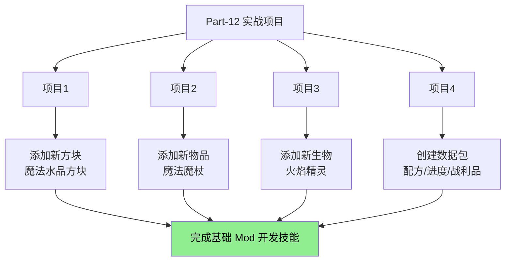

# Part-12：实战项目

>纸上得来终觉浅，绝知此事要躬行。
>
>学习了这么多源码知识，是时候动手做项目了！

---

## 项目概览

本部分包含 4 个实战项目，从简单到复杂，带领你完成从"学知识"到"做东西"的转变：



---

## 项目列表

| 项目 | 章节 | 内容 | 难度 | 源码参考 |
|------|------|------|------|----------|
| 项目 1 | [98-project1-block.md](./98-project1-block.md) | 添加新方块：魔法水晶 | ⭐ | 方块物品系统 |
| 项目 2 | [99-project2-item.md](./99-project2-item.md) | 添加新物品：魔法魔杖 | ⭐⭐ | 组件系统 |
| 项目 3 | [100-project3-entity.md](./100-project3-entity.md) | 添加新生物：火焰精灵 | ⭐⭐⭐ | 实体系统/AI |
| 项目 4 | [101-project4-datapack.md](./101-project4-datapack.md) | 创建数据包 | ⭐⭐ | 配方/战利品 |

---

## 学习路线图

```
┌─────────────────────────────────────────────────────────────────┐
│                        Minecraft 源码学习                          │
├─────────────────────────────────────────────────────────────────┤
│                                                                 │
│  基础阶段                                                       │
│  ├── Part-1: 注册表系统                                         │
│  ├── Part-2: 世界生成                                           │
│  └── Part-3: 方块物品                                           │
│      ├── 方块系统 (06)                                         │
│      └── 物品系统 (06)                                          │
│                                                                 │
│  进阶阶段                                                       │
│  ├── Part-4: 实体系统                                           │
│  ├── Part-5: AI 系统                                            │
│  ├── Part-6: 网络同步                                            │
│  ├── Part-7: 命令系统                                           │
│  └── Part-8: 资源/数据包                                        │
│                                                                 │
│  ─────────────────────────────  ← 你在这里！                      │
│                                                                 │
│  实战阶段 ← 当前                                                 │
│  └── Part-12: 四个实战项目                                      │
│                                                                 │
└─────────────────────────────────────────────────────────────────┘
```

---

## 源码知识对照表

每个项目都对应 Minecraft 1.21 源码中的核心系统：

| 项目 | 源码核心类 | 包路径 |
|------|-----------|--------|
| 方块 | `Block`, `AbstractBlock` | `net.minecraft.block` |
| 物品 | `Item`, `ItemStack` | `net.minecraft.item` |
| 实体 | `Entity`, `MobEntity` | `net.minecraft.entity` |
| 战利品 | `LootTable`, `LootPool` | `net.minecraft.loot` |
| 配方 | `ShapedRecipe`, `CookingRecipe` | `net.minecraft.recipe` |

---

## 每个项目包含的内容

### 项目 1：添加新方块

| 步骤 | 内容 | 关键代码 |
|------|------|----------|
| 1 | 注册方块 | `Registry.register(Registries.BLOCK, id, block)` |
| 2 | 创建方块类 | `extends Block` |
| 3 | 设置方块属性 | `AbstractBlock.Settings.create()` |
| 4 | 添加交互逻辑 | `onUse()`, `randomTick()` |
| 5 | 添加材质 | JSON 模型文件 |
| 6 | 测试验证 | `/give` 命令测试 |

### 项目 2：添加新物品

| 步骤 | 内容 | 关键代码 |
|------|------|----------|
| 1 | 注册物品 | `Registry.register(Registries.ITEM, id, item)` |
| 2 | 创建物品类 | `extends Item` |
| 3 | 实现使用效果 | `use()`, `finishUsing()` |
| 4 | 创建合成配方 | JSON 配方文件 |
| 5 | 添加材质 | PNG + JSON 模型 |
| 6 | 测试验证 | 合成与使用测试 |

### 项目 3：添加新生物

| 步骤 | 内容 | 关键代码 |
|------|------|----------|
| 1 | 注册实体类型 | `Registry.register(Registries.ENTITY_TYPE, id, type)` |
| 2 | 创建实体类 | `extends MobEntity` |
| 3 | 设置属性 | `initializeData()` |
| 4 | 添加 AI 行为 | `initGoals()`, `Goal` 类 |
| 5 | 创建战利品表 | JSON 文件 |
| 6 | 测试验证 | `/summon` 命令测试 |

### 项目 4：创建数据包

| 步骤 | 内容 | 关键文件 |
|------|------|----------|
| 1 | 创建目录结构 | `pack.mcmeta` |
| 2 | 创建函数 | `.mcfunction` 文件 |
| 3 | 添加进度 | JSON 进度文件 |
| 4 | 创建战利品表 | JSON 战利品文件 |
| 5 | 添加配方 | JSON 配方文件 |
| 6 | 测试验证 | `/reload` 重载测试 |

---

## 学习方法建议

### 1. 按顺序完成

建议按照项目 1 → 2 → 3 → 4 的顺序完成，因为后面的项目会用到前面学到的知识。

### 2. 边学边做

每个项目都提供了完整的代码示例，建议你：

1. 先阅读项目文档
2. 理解代码逻辑
3. 动手实践
4. 尝试修改代码看看会发生什么
5. 查看源码参考验证理解

### 3. 完成扩展挑战

每个项目都包含"扩展挑战"部分，这是给你的额外练习题。完成它们可以加深理解。

---

## 前置知识

开始之前，请确保你已经掌握了以下内容：

| 知识 | 来源 |
|------|------|
| Java 基础语法 | 任何 Java 教程 |
| 注册表系统 | [方块物品系统分析](../-analysis/06-block-item-system.md) |
| 方块基础 | [方块物品系统分析](../-analysis/06-block-item-system.md) |
| 物品基础 | [组件系统](../-analysis/06-block-item-system.md) |
| 实体基础 | [实体系统分析](../-analysis/05-entity-system.md) |
| 配方系统 | [配方系统分析](../-analysis/15-recipe-system.md) |
| 战利品系统 | [战利品系统分析](../-analysis/14-loot-system.md) |

---

## 下一步

完成所有四个项目后，你已经掌握了 Minecraft Mod 开发的核心技能！

接下来你可以：

1. **组合项目**：把四个项目的知识组合起来，创建更复杂的内容
2. **深入学习**：继续学习其他高级主题
3. **发布作品**：把你的作品分享给其他人

---

## 相关链接

### 源码参考

| 文件 | 路径 | 作用 |
|------|------|------|
| Block.java | `net/minecraft/block/Block.java` | 方块基类 |
| Item.java | `net/minecraft/item/Item.java` | 物品基类 |
| ItemStack.java | `net/minecraft/item/ItemStack.java` | 物品堆叠/组件 |
| Entity.java | `net/minecraft/entity/Entity.java` | 实体基类 |
| MobEntity.java | `net/minecraft/entity/mob/MobEntity.java` | 生物基类 |
| LootTable.java | `net/minecraft/loot/LootTable.java` | 战利品表 |
| ShapedRecipe.java | `net/minecraft/recipe/ShapedRecipe.java` | 有形状合成 |

### 在线资源

- [Minecraft Wiki](https://minecraft.fandom.com/wiki/Minecraft_Wiki)
- [Fabric Wiki](https://fabricmc.net/wiki/)
- [Minecraft Forge Wiki](https://minecraftforge.net/)

---

## 贡献者

本教程由 Minecraft 源码研究团队编写。

---

*本教程基于 Minecraft 1.21 源码编写*
