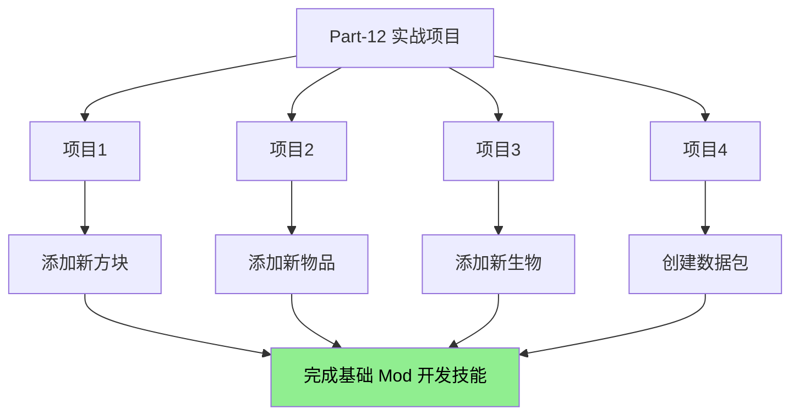

# Part-12：实战项目

> 纸上得来终觉浅，绝知此事要躬行。
> 
> 学习了这么多源码知识，是时候动手做项目了！

---

## 项目概览

本部分包含 4 个实战项目，从简单到复杂，带领你完成从"学知识"到"做东西"的转变：



---

## 项目列表

| 项目 | 章节 | 内容 | 难度 |
|------|------|------|------|
| 项目 1 | [98-project1-block.md](./98-project1-block.md) | 添加新方块：魔法水晶 | ⭐ |
| 项目 2 | [99-project2-item.md](./99-project2-item.md) | 添加新物品：魔法魔杖 | ⭐⭐ |
| 项目 3 | [100-project3-entity.md](./100-project3-entity.md) | 添加新生物：火焰精灵 | ⭐⭐⭐ |
| 项目 4 | [101-project4-datapack.md](./101-project4-datapack.md) | 创建数据包 | ⭐⭐ |

---

## 学习路线图

```
┌─────────────────────────────────────────────────────────────────┐
│                        Minecraft 源码学习                          │
├─────────────────────────────────────────────────────────────────┤
│                                                                 │
│  基础阶段                                                       │
│  ├── Part-1: 注册表系统                                         │
│  ├── Part-2: 世界生成                                           │
│  └── Part-3: 方块物品                                           │
│                                                                 │
│  进阶阶段                                                       │
│  ├── Part-4: 实体系统                                           │
│  ├── Part-5: AI 系统                                            │
│  ├── Part-6: 网络同步                                            │
│  ├── Part-7: 命令系统                                           │
│  └── Part-8: 资源系统                                           │
│                                                                 │
│  ─────────────────────────────  ← 你在这里！                      │
│                                                                 │
│  实战阶段 ← 当前                                                 │
│  └── Part-12: 四个实战项目                                      │
│                                                                 │
└─────────────────────────────────────────────────────────────────┘
```

---

## 每个项目包含的内容

### 项目 1：添加新方块

- 注册方块
- 创建方块类
- 设置方块属性
- 添加材质
- 测试

### 项目 2：添加新物品

- 注册物品
- 创建物品类
- 添加使用效果
- 创建合成配方
- 添加材质
- 测试

### 项目 3：添加新生物

- 注册实体类型
- 创建实体类
- 添加属性
- 添加 AI 行为
- 添加掉落物
- 添加材质
- 测试

### 项目 4：创建数据包

- 数据包结构
- 创建函数
- 添加进度
- 创建战利品表
- 添加配方
- 测试

---

## 学习方法建议

### 1. 按顺序完成

建议按照项目 1 → 2 → 3 → 4 的顺序完成，因为后面的项目会用到前面学到的知识。

### 2. 边学边做

每个项目都提供了完整的代码示例，建议你：
1. 先阅读项目文档
2. 理解代码逻辑
3. 动手实践
4. 尝试修改代码看看会发生什么

### 3. 完成扩展挑战

每个项目都包含"扩展挑战"部分，这是给你的额外练习题。完成它们可以加深理解。

---

## 前置知识

开始之前，请确保你已经掌握了以下内容：

- [x] Java 基础语法
- [x] 注册表系统
- [x] 方块基础
- [x] 物品基础
- [x] 实体基础

---

## 下一步

完成所有四个项目后，你已经掌握了 Minecraft Mod 开发的核心技能！

接下来你可以：

1. **组合项目**：把四个项目的知识组合起来，创建更复杂的内容
2. **深入学习**：继续学习其他高级主题
3. **发布作品**：把你的作品分享给其他人

---

## 相关链接

### 源码参考

- [注册表系统](../Part-1-Foundation/04-registry-system.md)
- [方块基础](../Part-3-Block-Item/14-block-basics.md)
- [物品基础](../Part-3-Block-Item/17-item-basics.md)
- [实体基础](../Part-4-Entity/21-entity-lifecycle.md)
- [MobEntity](../Part-4-Entity/23-mob-entity.md)
- [数据包](../Part-8-Resource/41-datapack-intro.md)
- [战利品表](../Part-8-Resource/42-loot-table.md)
- [进度系统](../Part-8-Resource/43-advancement.md)
- [配方系统](../Part-8-Resource/44-recipe-system.md)

### 在线资源

- [Minecraft Wiki](https://minecraft.fandom.com/wiki/Minecraft_Wiki)
- [Fabric Wiki](https://fabricmc.net/wiki/)
- [Minecraft Forge Wiki](https://.minecraftforge.net/)

---

## 贡献者

本教程由 Minecraft 源码研究团队编写。

---

*本教程基于 Minecraft 1.21 源码编写*
