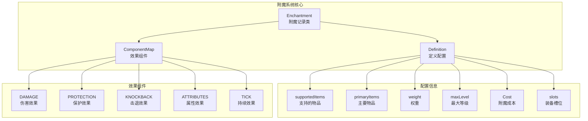
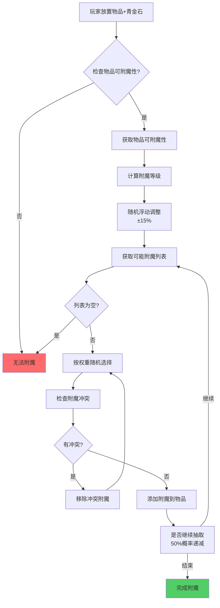
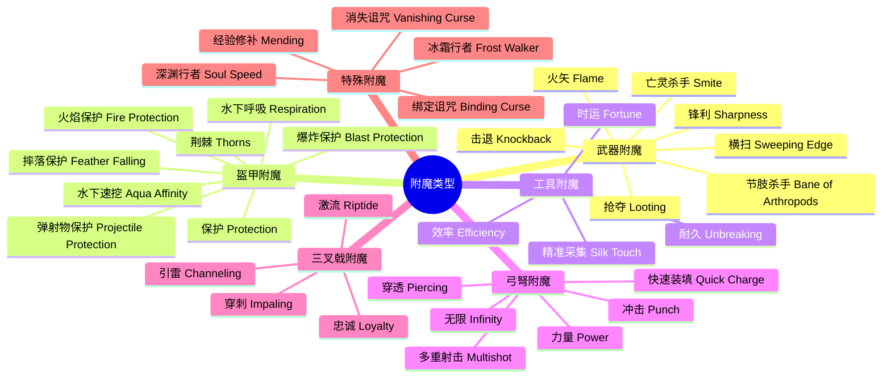

# 附魔系统 (Enchantment System)

## 目标

学完本教程后，你将能够：
- 理解 Minecraft 附魔系统的工作原理
- 掌握 `Enchantment` 类的核心结构
- 了解附魔目标 (`EnchantmentTarget`) 的概念
- 学会创建自定义附魔
- 理解附魔冲突机制

---

## 前置知识

在开始之前，你需要了解：
- Java 基础语法
- Minecraft 的物品系统 (ItemStack)
- 注册表系统 (Registry) 的基本概念
- [Part-3: 物品基础](../Part-3-Block-Item/18-item-basics.md) - 了解物品基础

---

## 核心概念

### 1. 什么是附魔系统？

想象你去纹身店给纹身添加"特殊效果"：

- **纹身师** = 附魔台 / 铁砧
- **纹身图案** = 附魔类型 (如锋利、保护)
- **纹身等级** = I、II、III、IV、V (代表效果强弱)
- **纹身位置** = 装备槽位 (武器、盔甲、工具)

**附魔就是给物品添加"特殊能力"的一种机制！**

在 Minecraft 源码中：

```java
// 附魔本质上是一个包含多个效果的组件容器
public record Enchantment(
    Text description,           // 显示名称
    Definition definition,       // 基础定义
    RegistryEntryList<Enchantment> exclusiveSet,  // 冲突列表
    ComponentMap effects         // 效果列表 (核心!)
) {}
```

---

### 2. Enchantment 类结构

```
Enchantment (记录类)
├── description: Text              → 附魔显示名称
├── definition: Definition          → 基础配置
│   ├── supportedItems              → 支持的物品列表
│   ├── primaryItems                → 主要物品 (比如剑对锋利)
│   ├── weight                      → 权重 (出现概率)
│   ├── maxLevel                    → 最大等级
│   ├── minCost / maxCost           → 附魔成本
│   └── anvilCost                   → 铁砧成本
├── exclusiveSet: RegistryEntryList<Enchantment>  → 互斥附魔组
└── effects: ComponentMap            → 附魔效果组件
```

**Definition 内部类** - 存储附魔的基本配置：

```java
public record Definition(
    RegistryEntryList<Item> supportedItems,      // 哪些物品能用
    Optional<RegistryEntryList<Item>> primaryItems,  // 主要物品
    int weight,                                  // 权重(1-1024)
    int maxLevel,                                // 最大等级(1-255)
    Cost minCost,                                // 最小成本
    Cost maxCost,                                // 最大成本
    int anvilCost,                               // 铁砧使用成本
    List<AttributeModifierSlot> slots            // 适用的装备槽
) {}
```

---

### 3. 附魔目标 (EnchantmentTarget)

在现代 Minecraft 中，附魔目标不再是一个枚举类，而是通过 **物品标签 (ItemTags)** 来定义。

#### 主要物品标签对照表

| 标签名称 | 可附魔物品 | 例子 |
|---------|-----------|------|
| `ARMOR_ENCHANTABLE` | 全部盔甲 | 头盔、胸甲、护腿、靴子 |
| `HEAD_ARMOR_ENCHANTABLE` | 头部盔甲 | 头盔 |
| `FOOT_ARMOR_ENCHANTABLE` | 脚部盔甲 | 靴子 |
| `LEG_ARMOR_ENCHANTABLE` | 腿部盔甲 | 护腿 |
| `CHEST_ARMOR_ENCHANTABLE` | 胸部盔甲 | 胸甲 |
| `SWORD_ENCHANTABLE` | 剑类 | 剑 |
| `WEAPON_ENCHANTABLE` | 武器类 | 剑、斧 |
| `SHARP_WEAPON_ENCHANTABLE` | 锋利武器 | 剑、斧 |
| `MINING_ENCHANTABLE` | 采矿工具 | 镐、锹 |
| `MINING_LOOT_ENCHANTABLE` | 刷怪工具 | 镐、锄 |
| `DURABILITY_ENCHANTABLE` | 耐久物品 | 所有可损坏物品 |
| `BOW_ENCHANTABLE` | 弓类 | 弓 |
| `CROSSBOW_ENCHANTABLE` | 弩类 | 弩 |
| `TRIDENT_ENCHANTABLE` | 三叉戟 | 三叉戟 |
| `MACE_ENCHANTABLE` | 钉刺锤 | 钉刺锤 |
| `FISHING_ENCHANTABLE` | 钓鱼相关 | 钓鱼竿 |
| `EQUIPPABLE_ENCHANTABLE` | 可穿戴物品 | 盔甲、头颅 |
| `VANISHING_ENCHANTABLE` | 可消失物品 | 所有物品 |

#### 装备槽位 (AttributeModifierSlot)

```java
public enum AttributeModifierSlot {
    MAINHAND,    // 主手
    OFFHAND,     // 副手
    HEAD,        // 头部
    CHEST,       // 胸部
    LEGS,        // 腿部
    FEET,        // 脚部
    BODY,        // 身体(鞘翅等)
    HAND,        // 任意手
    ARMOR        // 任意盔甲
}
```

---

### 4. 附魔等级和最大等级

```java
// 最大等级常量
public static final int MAX_LEVEL = 255;

// 获取等级范围
public int getMinLevel() {
    return 1;  // 最小永远是1
}

public int getMaxLevel() {
    return this.definition.maxLevel();  // 从定义中获取
}
```

**常见附魔的最大等级：**

| 附魔 | 最大等级 | 效果 |
|------|---------|------|
| 锋利 (Sharpness) | V (5) | 伤害增加 |
| 效率 (Efficiency) | V (5) | 挖掘加速 |
| 保护 (Protection) | IV (4) | 伤害减少 |
| 耐久 (Unbreaking) | III (3) | 物品更耐用 |
| 经验修补 (Mending) | I (1) | 用经验修复 |
| 火矢 (Flame) | I (1) | 箭矢点燃 |
| 冲击 (Punch) | II (2) | 击退增强 |

---

### 5. 附魔冲突 (Exclusive Set)

有些附魔不能同时存在于同一物品上！

#### 冲突组示例

```java
// 在注册时设置互斥组
.exclusiveSet(registryEntryLookup2.getOrThrow(EnchantmentTags.DAMAGE_EXCLUSIVE_SET))

// 冲突组标签定义在 data/minecraft/tags/enchantment/ 下
```

**常见的互斥组：**

| 互斥组 | 包含的附魔 |
|-------|-----------|
| `DAMAGE_EXCLUSIVE_SET` | 锋利、亡灵杀手、节肢杀手、穿刺、密度 |
| `ARMOR_EXCLUSIVE_SET` | 保护、火焰保护、爆炸保护、弹射物保护 |
| `BOOTS_EXCLUSIVE_SET` | 深渊行者、冰霜行者 |
| `MINING_EXCLUSIVE_SET` | 精准采集、时运 |
| `BOW_EXCLUSIVE_SET` | 无限 |
| `RIPTIDE_EXCLUSIVE_SET` | 激流 |

**判断是否可以合并：**

```java
public static boolean canBeCombined(
    RegistryEntry<Enchantment> first, 
    RegistryEntry<Enchantment> second
) {
    // 不能是自己
    // 不能在对方的互斥组中
    return !first.equals(second) 
        && !first.value().exclusiveSet.contains(second) 
        && !second.value().exclusiveSet.contains(first);
}
```

---

### 6. 附魔效果类型 (Effect Components)

现代 Minecraft 使用 **组件系统 (Component System)** 来定义附魔效果。

#### 6.1 伤害相关效果

```java
// 增加伤害
DAMAGE                     → 锋利、亡灵杀手、节肢杀手
// 伤害保护
DAMAGE_PROTECTION          → 保护、火焰保护等
// 击退
KNOCKBACK                  → 击退
// 破盾
ARMOR_EFFECTIVENESS        → 穿透
// 摔落伤害
SMASH_DAMAGE_PER_FALLEN_BLOCK  → 密度
```

#### 6.2 物品相关效果

```java
// 物品耐久
ITEM_DAMAGE                → 耐久
// 用经验修复
REPAIR_WITH_XP             → 经验修补
// 经验获取
MOB_EXPERIORCE             → 抢夺
// 方块经验
BLOCK_EXPERIENCE           → 经验
```

#### 6.3 投射物相关效果

```java
// 投射物数量
PROJECTILE_COUNT           → 多重射击
// 投射物散射
PROJECTILE_SPREAD         → 多重射击
// 穿透
PROJECTILE_PIERCING       → 穿透
// 弹药使用
AMMO_USE                   → 无限
// 弓蓄力时间
CROSSBOW_CHARGE_TIME       → 快速装填
```

#### 6.4 实体效果

```java
// 攻击后效果
POST_ATTACK                → 火矢、荆棘、引雷
// 持续效果
TICK                       → 灵魂疾行
// 位置变化效果
LOCATION_CHANGED           → 冰霜行者、灵魂疾行
// 属性修改
ATTRIBUTES                 → 深渊行者、水下速挖等
```

#### 6.5 特殊效果

```java
// 禁止装备更换
PREVENT_ARMOR_CHANGE       → 绑定诅咒
// 禁止掉落
PREVENT_EQUIPMENT_DROP     → 消失诅咒
// 免疫伤害
DAMAGE_IMMUNITY            → 冰霜行者
```

---

## 图解 (Mermaid)

### 附魔系统架构图



### 附魔生成流程图



### 附魔类型分类图



### 附魔冲突关系图

```mermaid
erDiagram
    SHARPNESS ||--o| DAMAGE_EXCLUSIVE : belongs_to
    SMITE ||--o| DAMAGE_EXCLUSIVE : belongs_to
    BANE_OF_ARTHROPODS ||--o| DAMAGE_EXCLUSIVE : belongs_to
    IMPALING ||--o| DAMAGE_EXCLUSIVE : belongs_to
    DENSITY ||--o| DAMAGE_EXCLUSIVE : belongs_to
    
    PROTECTION ||--o| ARMOR_EXCLUSIVE : belongs_to
    FIRE_PROTECTION ||--o| ARMOR_EXCLUSIVE : belongs_to
    BLAST_PROTECTION ||--o| ARMOR_EXCLUSIVE : belongs_to
    PROJECTILE_PROTECTION ||--o| ARMOR_EXCLUSIVE : belongs_to
    
    SILK_TOUCH ||--o| MINING_EXCLUSIVE : belongs_to
    FORTUNE ||--o| MINING_EXCLUSIVE : belongs_to
    
    FROST_WALKER ||--o| BOOTS_EXCLUSIVE : belongs_to
    DEPTH_STRIDER ||--o| BOOTS_EXCLUSIVE : belongs_to
    
    INFINITY ||--o| BOW_EXCLUSIVE : belongs_to
```



---

## 核心代码

### 1. 创建附魔定义

```java
// 使用 Builder 模式创建附魔
Enchantment.Builder builder = Enchantment.builder(
    Enchantment.definition(
        registryEntryLookup3.getOrThrow(ItemTags.SWORD_ENCHANTABLE),  // 支持的物品
        registryEntryLookup3.getOrThrow(ItemTags.SHARP_WEAPON_ENCHANTABLE),  // 主要物品
        10,  // weight 权重
        5,   // maxLevel 最大等级
        Enchantment.leveledCost(1, 11),   // minCost 最小成本
        Enchantment.leveledCost(21, 11),  // maxCost 最大成本
        1,   // anvilCost 铁砧成本
        AttributeModifierSlot.MAINHAND    // 装备槽位
    )
);
```

### 2. 添加附魔效果

```java
// 添加伤害效果 (AddEnchantmentEffect)
builder.addEffect(
    EnchantmentEffectComponentTypes.DAMAGE,           // 效果类型
    new AddEnchantmentEffect(                          // 效果实现
        EnchantmentLevelBasedValue.linear(1.0f, 0.5f)  // 随等级线性增长
    )
);

// 添加属性效果
builder.addEffect(
    EnchantmentEffectComponentTypes.ATTRIBUTES,
    new AttributeEnchantmentEffect(
        Identifier.ofVanilla("enchantment.efficiency"),    // 属性ID
        EntityAttributes.PLAYER_MINING_EFFICIENCY,         // 属性类型
        EnchantmentLevelBasedValue.levelsSquared(1.0f),    // 等级平方增长
        EntityAttributeModifier.Operation.ADD_VALUE
    )
);
```

### 3. 设置互斥组

```java
builder.exclusiveSet(
    registryEntryLookup2.getOrThrow(EnchantmentTags.DAMAGE_EXCLUSIVE_SET)
);
```

### 4. 获取物品上的附魔等级

```java
// 从 ItemStack 获取附魔等级
int level = EnchantmentHelper.getLevel(enchantmentEntry, itemStack);

// 遍历所有附魔
EnchantmentHelper.forEachEnchantment(itemStack, (enchantment, level) -> {
    // 处理每个附魔
    System.out.println(enchantment.value().getName() + " " + level);
});
```

### 5. 计算附魔成本

```java
// 固定成本 (适合单级附魔)
Enchantment.constantCost(25)

// 等级递增成本 (适合多级附魔)
// base + perLevelAboveFirst * (level - 1)
Enchantment.leveledCost(1, 11)
// 等级1: 1
// 等级2: 12
// 等级3: 23
// 等级4: 34
// 等级5: 45
```

### 6. 效果等级计算器

```java
// 线性增长
EnchantmentLevelBasedValue.linear(1.0f, 0.5f)
// 效果 = 1.0 + 0.5 * (level - 1)

// 平方增长
EnchantmentLevelBasedValue.levelsSquared(1.0f)
// 效果 = 1.0 * level^2

// 常数
EnchantmentLevelBasedValue.constant(1.0f)
// 效果 = 1.0 (不随等级变化)

// 限制范围
new EnchantmentLevelBasedValue.Clamped(value, min, max)
```

---

## 实战演示

### 创建一个"吸血"附魔

假设我们要创建一个让武器在攻击时恢复生命的附魔：

```java
// 在 Enchantments.java 中添加
public static final RegistryKey<Enchantment> VAMPIRIC = Enchantments.of("vampiric");

// 注册时
Enchantments.register(registry, VAMPIRIC, 
    Enchantment.builder(
        Enchantment.definition(
            registryEntryLookup3.getOrThrow(ItemTags.WEAPON_ENCHANTABLE),
            registryEntryLookup3.getOrThrow(ItemTags.SWORD_ENCHANTABLE),
            5,      // weight
            3,      // maxLevel
            Enchantment.leveledCost(10, 15),
            Enchantment.leveledCost(40, 15),
            4,
            AttributeModifierSlot.MAINHAND
        )
    )
    .exclusiveSet(registryEntryLookup2.getOrThrow(EnchantmentTags.DAMAGE_EXCLUSIVE_SET))
    .addEffect(
        EnchantmentEffectComponentTypes.POST_ATTACK,
        EnchantmentEffectTarget.ATTACKER,
        EnchantmentEffectTarget.VICTIM,
        new ApplyMobEffectEnchantmentEffect(
            RegistryEntryList.of(StatusEffects.REGENERATION),
            EnchantmentLevelBasedValue.constant(2.0f),        // 持续时间
            EnchantmentLevelBasedValue.linear(2.0f, 1.0f),    // 等级加成
            EnchantmentLevelBasedValue.constant(1.0f),        // 效果等级
            EnchantmentLevelBasedValue.constant(5.0f)          // 最大等级
        ),
        EntityPropertiesLootCondition.builder(
            LootContext.EntityTarget.ATTACKER,
            EntityPredicate.Builder.create().type(EntityType.PLAYER)
        )
    )
);
```

---

## 小结

### 本章知识点回顾

```
附魔系统 = 附魔定义 + 效果组件 + 互斥组

1. Enchantment 类
   - description: 显示名称
   - definition: 配置信息
   - exclusiveSet: 冲突列表
   - effects: 效果组件

2. 附魔目标
   - 通过 ItemTags 定义
   - 通过 AttributeModifierSlot 定义槽位

3. 附魔等级
   - getMinLevel() / getMaxLevel()
   - MAX_LEVEL = 255

4. 附魔冲突
   - exclusiveSet 机制
   - canBeCombined() 判断

5. 效果组件
   - DAMAGE / DAMAGE_PROTECTION
   - ATTRIBUTES / TICK
   - POST_ATTACK 等

6. 工具类
   - EnchantmentHelper: 操作附魔
   - EnchantmentLevelEntry: 附魔等级对
```

---

## 练习

### 初级练习

1. **查找附魔** - 找到"锋利"附魔的定义位置
2. **数一数** - 统计游戏中一共有多少种附魔
3. **看图说话** - 根据 `Enchantment.java` 画出类的结构图

### 中级练习

4. **修改成本** - 把"效率"附魔的成本改成更高
5. **添加效果** - 给"击退"附魔添加一个"击中后减速敌人"的效果
6. **调整等级** - 把"保护"附魔的最大等级改成 10

### 高级练习

7. **创建新附魔** - 创建一个"冰冻"附魔，攻击时使敌人减速
8. **创建新互斥组** - 创建一个新的互斥组，让"锋利"和"冰冻"冲突
9. **扩展现有效果** - 为"抢夺"附魔添加一个"额外掉落经验"的效果

---

## 相关链接

### 内部链接

- [Part-3: 物品基础](../Part-3-Block-Item/18-item-basics.md) - 物品基础知识
- [Part-4: 实体系统](../Part-4-Entity/21-entity-intro.md) - 实体与附魔交互
- [Part-13: 物品栏系统](./inventory-system.md) - 物品容器基础

### 源码文件

| 文件 | 说明 |
|------|------|
| `Enchantment.java` | 附魔核心类 |
| `EnchantmentHelper.java` | 附魔工具类 |
| `Enchantments.java` | 所有原版附魔注册 |
| `EnchantmentLevelEntry.java` | 附魔等级对 |
| `EnchantmentEffectContext.java` | 附魔效果上下文 |
| `EnchantmentTarget.java` | (旧版) 附魔目标枚举 |

### 标签文件

| 标签 | 说明 |
|------|------|
| `data/minecraft/tags/item/*_ENCHANTABLE.json` | 可附魔物品标签 |
| `data/minecraft/tags/enchantment/*_EXCLUSIVE_SET.json` | 互斥组标签 |

---

> **小贴士**: 现代 Minecraft (1.20+) 使用组件系统重写了附魔系统，相比旧版本更加灵活和模块化。建议从 `Enchantments.java` 开始阅读源码，了解原版附魔是如何实现的！
