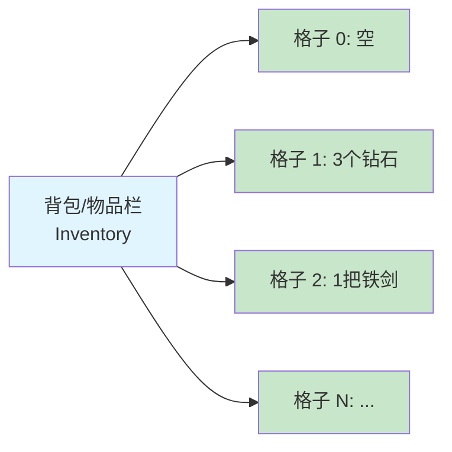
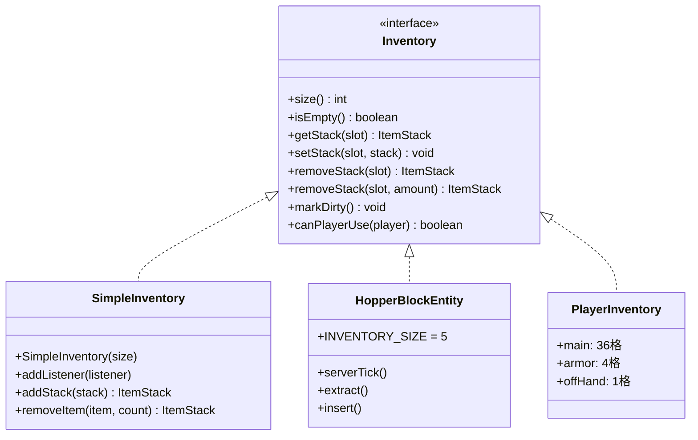
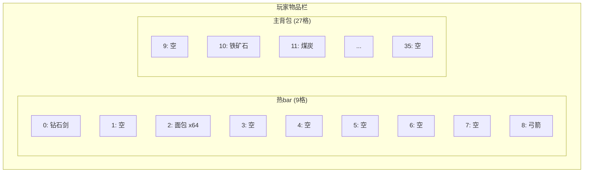
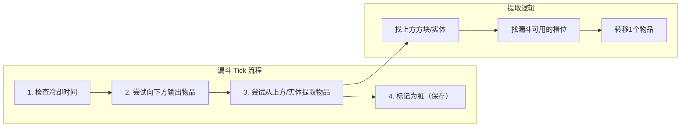
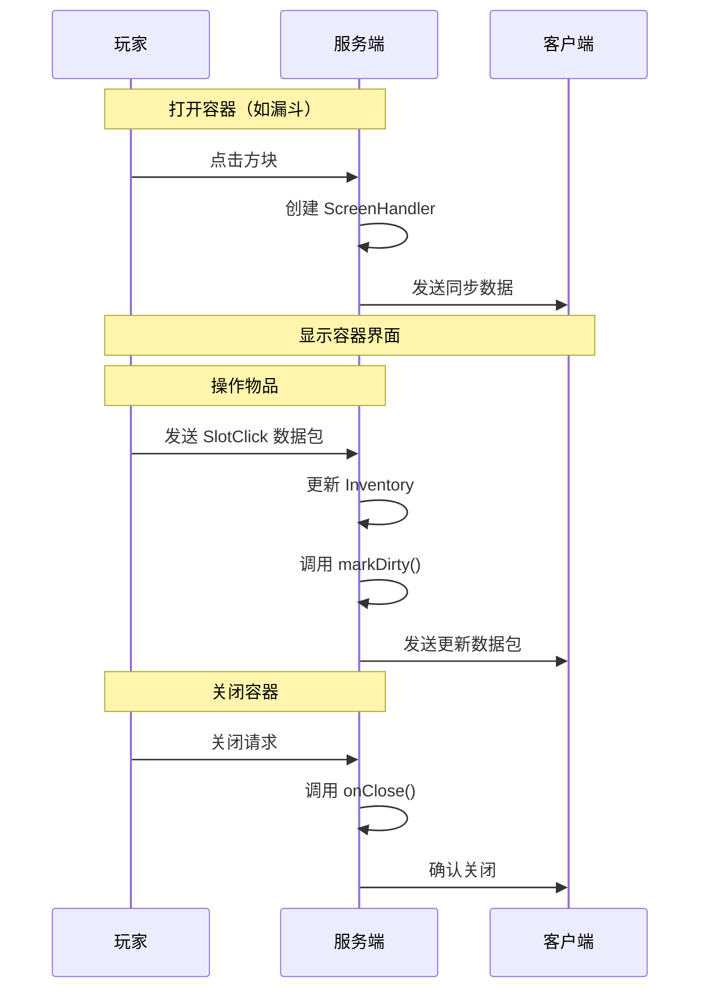

# 物品栏容器系统

## 目标

学完本教程后，你将能够：
- 理解 Minecraft 物品栏（Inventory）系统的核心概念
- 掌握 `Inventory` 接口的用法
- 了解不同类型的物品栏实现（玩家、箱子、漏斗、熔炉）
- 理解客户端-服务端的物品栏同步机制
- 学会使用 `ScreenHandler` 容器接口

---

## 前置知识

- Java 基础（接口、抽象类、继承）
- 了解 Minecraft 方块实体（BlockEntity）概念
- 知道什么是 ItemStack（物品堆）

---

## 核心概念

### 1. 什么是物品栏？

想象一下，**物品栏就像你的背包**。它是一个有固定格子数的容器，每个格子可以放一组物品。

就像现实中的储物柜：
- 每个柜子（格子）可以放东西
- 柜子有编号，从 0 开始
- 有的柜子可以放任意物品，有的只能放特定物品



### 2. Inventory 接口

`Inventory` 是 Minecraft 中所有物品栏的"标准规范"。任何实现这个接口的类，都可以：
- 存放和取出物品
- 被玩家打开（如果是一个方块实体）
- 与漏斗等红石机械交互



### 3. 物品栏的"槽位"概念

**槽位（Slot）** = 物品栏中的格子，编号从 0 开始



> **小贴士**：槽位编号是连续的！
> - 热bar: 0-8
> - 主背包: 9-35
> - 装备栏: (特殊槽位)
> - 副手: 40

---

## 图解：物品栏系统结构

### 整体架构

```mermaid
flowchart TB
    subgraph "服务端"
        SH["ScreenHandler<br/>容器处理器"]
        BE["BlockEntity<br/>方块实体"]
        PE["PlayerEntity<br/>玩家实体"]
        
        BE --> INV_BE["持有 Inventory"]
        PE --> INV_P["PlayerInventory"]
        SH --> "背书" INV_BE
        SH --> "背书" INV_P
    end
    
    subgraph "客户端"
        CSH["Client ScreenHandler<br/>客户端容器处理器"]
        GUI["GUI 界面<br/>HandledScreen"]
        
        CSH --> GUI
    end
    
    subgraph "同步"
        SYNC["服务端 ↔ 客户端<br/>Packet 同步"]
    end
    
    SH <--> SYNC
    CSH <--> SYNC
    
    style SH fill:#81c784
    style CSH fill:#90caf9
    style SYNC fill:#fff59d
```

### 漏斗的工作流程

漏斗是一个很好的例子，展示了物品栏系统如何工作：



---

## 核心代码

### 1. Inventory 接口的方法

```java
// net.minecraft.inventory.Inventory
public interface Inventory extends Clearable {
    
    // 返回物品栏的格子数量
    int size();
    
    // 检查是否所有格子都为空
    boolean isEmpty();
    
    // 获取指定格子的物品
    ItemStack getStack(int slot);
    
    // 设置指定格子的物品
    void setStack(int slot, ItemStack stack);
    
    // 移除指定格子的物品（全部）
    ItemStack removeStack(int slot);
    
    // 移除指定格子的一部分物品
    ItemStack removeStack(int slot, int amount);
    
    // 标记物品栏已修改（重要！每次修改后都要调用）
    void markDirty();
    
    // 检查玩家是否可以使用这个物品栏
    boolean canPlayerUse(PlayerEntity player);
}
```

### 2. SimpleInventory 简单实现

`SimpleInventory` 是一个通用的物品栏实现，适合临时存储：

```java
// 创建一个有 9 个格子的物品栏
SimpleInventory inventory = new SimpleInventory(9);

// 放物品进去
inventory.setStack(0, new ItemStack(Items.DIAMOND, 5));

// 取物品出来
ItemStack stack = inventory.getStack(0);

// 添加物品（自动找空位或堆叠）
inventory.addStack(new ItemStack(Items.DIAMOND, 3));

// 监听物品栏变化
inventory.addListener(inventory -> {
    System.out.println("物品栏被修改了！");
});
```

### 3. 漏斗的实现要点

漏斗（`HopperBlockEntity`）展示了完整的物品栏系统：

```java
public class HopperBlockEntity extends LootableContainerBlockEntity implements Hopper {
    
    // 漏斗有 5 个格子
    public static final int INVENTORY_SIZE = 5;
    private DefaultedList<ItemStack> inventory = DefaultedList.ofSize(5, ItemStack.EMPTY);
    
    @Override
    public int size() {
        return this.inventory.size();
    }
    
    // 服务器 tick 时调用
    public static void serverTick(World world, BlockPos pos, 
                                   BlockState state, HopperBlockEntity blockEntity) {
        
        // 冷却检查
        if (blockEntity.needsCooldown()) {
            return;
        }
        
        // 尝试插入物品到下方容器
        if (!blockEntity.isFull()) {
            HopperBlockEntity.insert(world, pos, blockEntity);
        }
        
        // 尝试从上方提取物品
        if (!blockEntity.isEmpty()) {
            HopperBlockEntity.extract(world, blockEntity);
        }
    }
    
    // 物品转移核心逻辑
    public static ItemStack transfer(Inventory from, Inventory to, 
                                      ItemStack stack, Direction side) {
        // 遍历目标物品栏的所有槽位
        for (int i = 0; i < to.size(); i++) {
            ItemStack existing = to.getStack(i);
            
            if (existing.isEmpty()) {
                // 槽位为空，直接放入
                to.setStack(i, stack);
                return ItemStack.EMPTY;
            } 
            else if (canMergeItems(existing, stack)) {
                // 槽位有同类物品，尝试堆叠
                int space = stack.getMaxCount() - existing.getCount();
                if (space > 0) {
                    existing.increment(space);
                    stack.decrement(space);
                }
            }
        }
        return stack; // 返回未放入的物品
    }
}
```

### 4. 客户端-服务端同步



---

## 实战演示：创建一个带物品栏的方块

### 步骤 1：创建方块实体

```java
// MyInventoryBlockEntity.java
public class MyInventoryBlockEntity extends LootableContainerBlockEntity {
    
    private final DefaultedList<ItemStack> inventory = 
        DefaultedList.ofSize(9, ItemStack.EMPTY);
    
    public MyInventoryBlockEntity(BlockPos pos, BlockState state) {
        super(BlockEntityType.MY_BLOCK, pos, state);
    }
    
    @Override
    public int size() {
        return this.inventory.size();
    }
    
    @Override
    protected Text getContainerName() {
        return Text.translatable("block.my_mod.my_inventory_block");
    }
    
    @Override
    protected ScreenHandler createScreenHandler(int syncId, PlayerInventory playerInventory) {
        return new MyScreenHandler(syncId, playerInventory, this);
    }
}
```

### 步骤 2：创建 ScreenHandler

```java
// MyScreenHandler.java
public class MyScreenHandler extends ScreenHandler {
    
    private final Inventory inventory;
    
    public MyScreenHandler(int syncId, PlayerInventory playerInventory, 
                          Inventory inventory) {
        super(Registry.SCREEN_HANDLER_TYPE, syncId);
        this.inventory = inventory;
        
        // 添加方块物品栏的格子
        for (int row = 0; row < 3; row++) {
            for (int col = 0; col < 9; col++) {
                this.addSlot(new Slot(inventory, col + row * 9, 8 + col * 18, 18 + row * 18));
            }
        }
        
        // 添加玩家物品栏的格子
        for (int row = 0; row < 3; row++) {
            for (int col = 0; col < 9; col++) {
                this.addSlot(new Slot(playerInventory, 9 + col + row * 9, 
                    8 + col * 18, 84 + row * 18));
            }
        }
        
        // 添加热bar
        for (int i = 0; i < 9; i++) {
            this.addSlot(new Slot(playerInventory, i, 8 + i * 18, 142));
        }
    }
    
    @Override
    public boolean canUse(PlayerEntity player) {
        return this.inventory.canPlayerUse(player);
    }
    
    @Override
    public ItemStack quickMove(PlayerEntity player, int slotIndex) {
        ItemStack stack = ItemStack.EMPTY;
        Slot slot = this.getSlot(slotIndex);
        
        if (slot.hasStack()) {
            ItemStack slotStack = slot.getStack();
            stack = slotStack.copy();
            
            // 从容器移动到玩家背包
            if (slotIndex < 27) {
                if (!this.insertItem(slotStack, 27, 36, false)) {
                    return ItemStack.EMPTY;
                }
            } 
            // 从玩家背包移动到容器
            else if (!this.insertItem(slotStack, 0, 27, false)) {
                return ItemStack.EMPTY;
            }
            
            if (slotStack.isEmpty()) {
                slot.setStack(ItemStack.EMPTY);
            } else {
                slot.markDirty();
            }
        }
        
        return stack;
    }
}
```

---

## 小结

```mermaid
mindmap
  root((物品栏系统))
    Inventory 接口
      size() - 格子数量
      getStack() - 获取物品
      setStack() - 放置物品
      markDirty() - 标记修改
    SimpleInventory
      临时物品栏
      可添加监听器
      适合客户端同步
    方块实体物品栏
      继承 LootableContainerBlockEntity
      实现 createScreenHandler
      NBT 保存/读取
    ScreenHandler
      连接 Inventory 和 GUI
      处理客户端同步
      管理 Slot
    漏斗系统
      提取逻辑
      插入逻辑
      冷却机制
```

### 关键要点

| 概念 | 说明 |
|------|------|
| `Inventory` | 物品栏的标准接口，任何存放物品的地方都应该实现它 |
| `markDirty()` | 每次修改物品栏后必须调用，用于同步和保存 |
| `ScreenHandler` | 服务端的容器逻辑，处理玩家交互和同步 |
| `Slot` | 物品栏中的单个格子，连接 Inventory 和 GUI |
| 槽位编号 | 从 0 开始，连续编号，记住这个顺序很重要 |

---

## 练习

1. **基础练习**：创建一个有 3x3 物品栏的自定义方块

2. **进阶练习**：让漏斗只能提取特定类型的物品（使用 `canTransferTo` 方法）

3. **挑战练习**：创建一个"过滤器漏斗"，上面可以放漏斗，下面的物品栏会按过滤器分类存储物品

---

## 相关链接

### 内部链接

- [Part-3: 物品基础](../Part-3-Block-Item/17-item-basics.md) - 物品基础知识
- [Part-3: 方块实体](../Part-3-Block-Item/16-block-entity.md) - 方块实体教程
- [Part-13: NBT 数据系统](./nbt-data-system.md) - 数据存储

### 源码文件

- `net.minecraft.inventory.Inventory` - 物品栏接口
- `net.minecraft.inventory.SimpleInventory` - 简单实现
- `net.minecraft.block.entity.HopperBlockEntity` - 漏斗
- `net.minecraft.screen.ScreenHandler` - 容器处理器

---

### 继续学习

- [Part-13: 粒子系统](./particle-system.md) - 视觉效果
- [Part-13: 声音系统](./sound-system.md) - 音效
