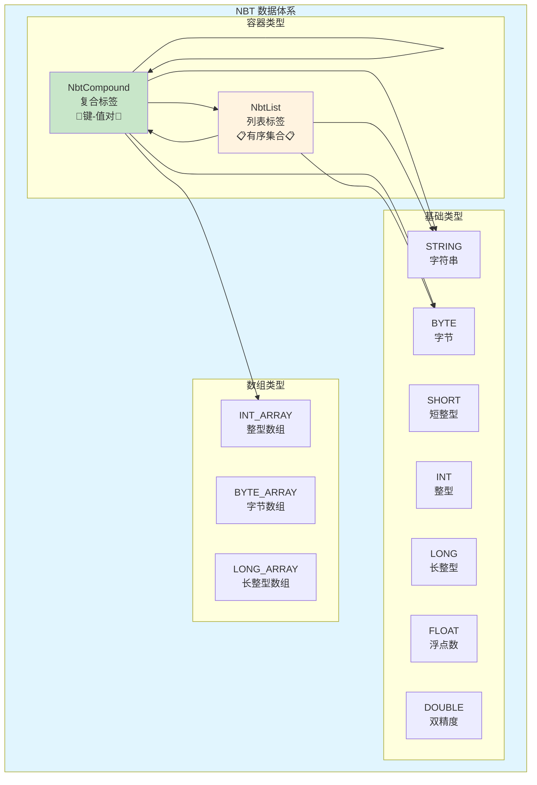
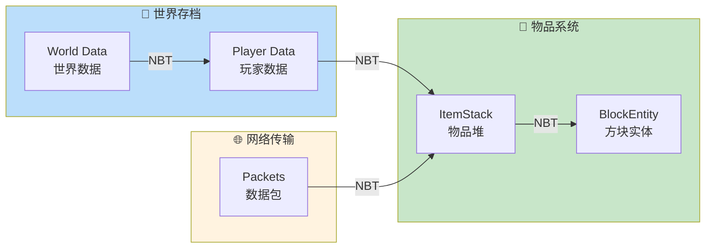
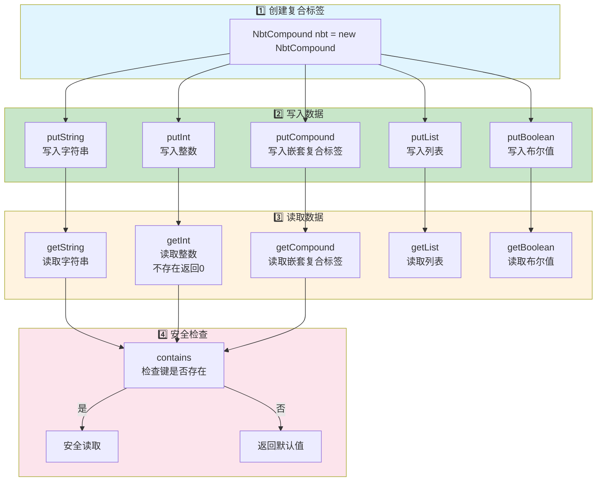
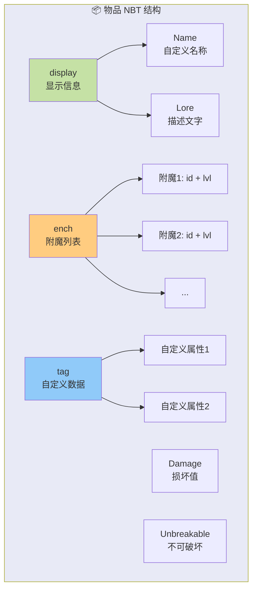

# NBT 数据系统

## 目标

学完本章节后，你将理解：
- NBT 是什么（命名二进制标签）
- NBT 的各种数据类型
- `NbtCompound` 复合标签的用法
- `NbtList` 列表标签的用法
- NBT 在 Minecraft 中的实际应用

## 前置知识

- 理解 [Java 基础](../Part-0-Prerequisites/01-java-basics.md)
- 了解基本的类、接口和集合概念
- 知道 Minecraft 的存档和物品系统是什么

## 核心概念（用生活比喻）

### 什么是 NBT？

**NBT = Named Binary Tag（命名二进制标签）**

简单来说，NBT 就是 Minecraft 用来存储数据的一种格式。就像你写日记需要纸和笔，Minecraft 存储数据就需要 NBT。

### 生活中的比喻：NBT 就像...

想象你搬家时用的**收纳箱系统**：

```
📦 收纳箱（Compound 复合标签）
├── 📋 标签：物品信息
│   ├── 名称：钻石剑
│   ├── 耐久：100/1561
│   └── 附魔：锋利 III
├── 👕 标签：服装
│   ├── 上衣：T恤
│   └── 裤子：牛仔裤
└── 📚 标签：书籍
    ├── 第1本：《Java入门》
    ├── 第2本：《Minecraft模组开发》
    └── 第3本：《数据结构》
```

每个收纳箱里有很多**标签**（tag），每个标签都有自己的**名字**和**内容**。

### NBT 数据类型一览

| 类型 | ID | 说明 | 生活中的例子 |
|------|-----|------|-------------|
| **END** | 0 | 结束标记（很少用） | - |
| **BYTE** | 1 | 1字节整数（-128~127） | 开关状态（开/关） |
| **SHORT** | 2 | 2字节整数（-32768~32767） | 物品数量 |
| **INT** | 3 | 4字节整数 | 坐标、计时器 |
| **LONG** | 4 | 8字节整数 | 大数字、UUID |
| **FLOAT** | 5 | 单精度浮点数 | 坐标、百分比 |
| **DOUBLE** | 6 | 双精度浮点数 | 精确坐标 |
| **STRING** | 8 | 字符串 | 名称、描述 |
| **LIST** | 9 | 列表 | 物品栏、附魔列表 |
| **COMPOUND** | 10 | 复合标签（嵌套） | 物品完整数据 |
| **BYTE_ARRAY** | 7 | 字节数组 | 图像数据 |
| **INT_ARRAY** | 11 | 整数数组 | 旧版存档坐标 |
| **LONG_ARRAY** | 12 | 长整数数组 | UUID（1.16+） |

### NbtCompound 复合标签

**NbtCompound** 就像一个**字典**或 **JSON 对象**：

```
{
    "display": {
        "Name": "§6黄金剑",
        "Lore": ["传说中...", "增加生命"]
    },
    "ench": [
        {"id": 16, "lvl": 5},   // 锋利 V
        {"id": 20, "lvl": 2}    // 亡灵杀手 II
    ],
    "Damage": 0,
    "Unbreakable": 1
}
```

### NbtList 列表标签

**NbtList** 就像一个**数组**或 **List 集合**：

```
[1, 2, 3, 4, 5]           // 数字列表
["剑", "盾", "弓"]         // 字符串列表
[{id:1, lvl:1}, {id:2, lvl:2}]  // 复合标签列表
```

**重要规则**：NbtList 里所有元素的类型必须相同！

## 图解（Mermaid）

### NBT 数据类型层次图



### NBT 在 Minecraft 中的使用场景



### NbtCompound 操作流程图



### 物品 NBT 数据结构示例



## 核心代码

### 源码位置

- `net.minecraft.nbt.NbtElement` - NBT 元素接口
- `net.minecraft.nbt.NbtCompound` - 复合标签
- `net.minecraft.nbt.NbtList` - 列表标签

### 创建和操作 NbtCompound

```java
// 1. 创建复合标签
NbtCompound nbt = new NbtCompound();

// 2. 写入各种类型的数据
nbt.putString("name", "钻石剑");        // 字符串
nbt.putInt("damage", 100);              // 整数
nbt.putInt("maxDamage", 1561);          // 整数
nbt.putBoolean("unbreakable", true);   // 布尔值（存为BYTE）
nbt.putFloat("speed", 3.5f);           // 浮点数
nbt.putLong("uuidMost", 123456789L);    // 长整数
nbt.putLong("uuidLeast", 987654321L);   // 长整数

// 3. 写入嵌套复合标签
NbtCompound display = new NbtCompound();
display.putString("Name", "§6附魔钻石剑");
display.putString("Lore", "[\"传说中...\",\"增加生命\"]");
nbt.put("display", display);

// 4. 读取数据
String name = nbt.getString("name");           // "钻石剑"
int damage = nbt.getInt("damage");             // 100
boolean unbreakable = nbt.getBoolean("unbreakable");  // true

// 5. 安全读取（推荐）
int value = nbt.contains("damage") ? nbt.getInt("damage") : 0;

// 6. 嵌套读取
NbtCompound displayData = nbt.getCompound("display");
String customName = displayData.getString("Name");

// 7. 检查键是否存在
if (nbt.contains("display")) {
    // 安全处理
}

// 8. 删除数据
nbt.remove("damage");

// 9. 获取所有键
Set<String> keys = nbt.getKeys();

// 10. 遍历所有键值对
for (String key : nbt.getKeys()) {
    NbtElement element = nbt.get(key);
    System.out.println(key + " = " + element);
}
```

### 创建和操作 NbtList

```java
// 1. 创建列表
NbtList list = new NbtList();

// 2. 添加元素
list.add(NbtInt.of(1));           // 添加整数 1
list.add(NbtInt.of(2));           // 添加整数 2
list.add(NbtInt.of(3));           // 添加整数 3

// 3. 添加字符串
NbtList stringList = new NbtList();
stringList.add(NbtString.of("剑"));
stringList.add(NbtString.of("盾"));
stringList.add(NbtString.of("弓"));

// 4. 添加复合标签到列表（用于附魔列表）
NbtList enchants = new NbtList();
NbtCompound enchant1 = new NbtCompound();
enchant1.putShort("id", (short)16);  // 锋利附魔ID
enchant1.putShort("lvl", (short)5);  // 锋利V
enchants.add(enchant1);

NbtCompound enchant2 = new NbtCompound();
enchant2.putShort("id", (short)20);  // 亡灵杀手
enchant2.putShort("lvl", (short)2);  // 亡灵杀手II
enchants.add(enchant2);

// 5. 读取列表
int first = list.getInt(0);        // 获取第一个元素
int size = list.size();            // 列表大小

// 6. 安全读取
int value = (index >= 0 && index < list.size()) ? list.getInt(index) : 0;

// 7. 遍历列表
for (int i = 0; i < list.size(); i++) {
    NbtElement element = list.get(i);
    // 处理每个元素
}

// 8. 读取复合标签列表
NbtList enchantList = nbt.getList("ench");
for (int i = 0; i < enchantList.size(); i++) {
    NbtCompound enchant = enchantList.getCompound(i);
    short id = enchant.getShort("id");
    short lvl = enchant.getShort("lvl");
    System.out.println("附魔ID: " + id + ", 等级: " + lvl);
}

// 9. 移除元素
list.remove(0);  // 移除第一个元素

// 10. 清空列表
list.clear();
```

### 常用快捷方法

```java
// NbtCompound 常用方法
NbtCompound nbt = new NbtCompound();

// 链式操作
nbt.putString("name", "Test")
   .putInt("count", 5)
   .putBoolean("active", true);

// 数组操作
int[] coords = {100, 64, 200};
nbt.putIntArray("coords", coords);
int[] savedCoords = nbt.getIntArray("coords");

// UUID 操作（Minecraft 1.16+）
UUID uuid = UUID.randomUUID();
nbt.putUuid("OwnerUUID", uuid);
UUID savedUuid = nbt.getUuid("OwnerUUID");

// 合并数据
NbtCompound source = new NbtCompound();
source.putString("key1", "value1");
NbtCompound target = new NbtCompound();
target.putString("key2", "value2");
target.copyFrom(source);  // 合并到 target
```

### NbtElement 类型常量

```java
// NbtElement 中定义的类型常量
NbtElement.BYTE_TYPE       // = 1
NbtElement.SHORT_TYPE      // = 2
NbtElement.INT_TYPE        // = 3
NbtElement.LONG_TYPE       // = 4
NbtElement.FLOAT_TYPE      // = 5
NbtElement.DOUBLE_TYPE     // = 6
NbtElement.BYTE_ARRAY_TYPE // = 7
NbtElement.STRING_TYPE     // = 8
NbtElement.LIST_TYPE       // = 9
NbtElement.COMPOUND_TYPE   // = 10
NbtElement.INT_ARRAY_TYPE  // = 11
NbtElement.LONG_ARRAY_TYPE // = 12

// 检查元素类型
NbtElement element = nbt.get("key");
if (element.getType() == NbtElement.INT_TYPE) {
    // 是整数类型
}
```

## 实战演示

### 示例1：创建一个附魔书

```java
public static NbtCompound createEnchantedBook() {
    NbtCompound tag = new NbtCompound();
    
    // 附魔信息存储在 StoredEnchantments 里
    NbtList enchants = new NbtList();
    
    NbtCompound sharpness = new NbtCompound();
    sharpness.putShort("id", (short)16);  // 锋利
    sharpness.putShort("lvl", (short)3);  // III
    enchants.add(sharpness);
    
    NbtCompound fireAspect = new NbtCompound();
    fireAspect.putShort("id", (short)20);  // 火焰附加
    fireAspect.putShort("lvl", (short)2);  // II
    enchants.add(fireAspect);
    
    tag.put("StoredEnchantments", enchants);
    
    return tag;
}
```

### 示例2：读取物品的自定义名称

```java
public static String getItemCustomName(ItemStack stack) {
    NbtCompound tag = stack.getNbt();
    if (tag == null) return null;
    
    NbtCompound display = tag.getCompound("display");
    if (display == null) return null;
    
    return display.getString("Name");
}
```

### 示例3：创建一个带lore的物品

```java
public static NbtCompound createItemWithLore(String name, String... lore) {
    NbtCompound tag = new NbtCompound();
    
    // 显示信息
    NbtCompound display = new NbtCompound();
    display.putString("Name", name);  // 可以使用彩色代码如 "§6金苹果"
    
    // Lore（描述文字）是一个字符串列表
    NbtList loreList = new NbtList();
    for (String line : lore) {
        loreList.add(NbtString.of(line));
    }
    display.put("Lore", loreList);
    
    tag.put("display", display);
    
    return tag;
}
```

### 示例4：保存玩家背包到 NBT

```java
public static NbtCompound saveInventory(Iterable<ItemStack> inventory) {
    NbtCompound nbt = new NbtCompound();
    NbtList items = new NbtList();
    
    int slot = 0;
    for (ItemStack stack : inventory) {
        if (!stack.isEmpty()) {
            NbtCompound itemNbt = new NbtCompound();
            itemNbt.putByte("Slot", (byte)slot);
            itemNbt.put("id", NbtString.of(Registries.ITEM.getId(stack.getItem()).toString()));
            itemNbt.putByte("Count", (byte)stack.getCount());
            
            // 保存物品组件数据
            if (stack.containsNbt()) {
                itemNbt.put("tag", stack.getNbt());
            }
            
            items.add(itemNbt);
        }
        slot++;
    }
    
    nbt.put("Items", items);
    return nbt;
}
```

## 小结

1. **NBT** = Minecraft 的数据存储格式，类似 JSON 但是二进制
2. **NbtElement** = 所有 NBT 类型的基类接口
3. **NbtCompound** = 键值对集合，类似 JSON 对象，用于存储复杂数据
4. **NbtList** = 有序列表，类似数组，用于存储列表数据
5. NBT 用于：世界存档、物品数据、方块实体数据、网络传输
6. **核心操作**：`put` 写入，`get` 读取，`contains` 检查，`remove` 删除
7. **安全访问**：优先使用类型安全的方法如 `getInt()`、`getString()`

## 练习

1. **基础练习**：创建一个 NbtCompound，包含玩家的基本信息（名字、等级、金币数量）
2. **进阶练习**：创建一个附魔列表，包括 3 种不同的附魔
3. **实战练习**：编写一个函数，将物品的 NBT 数据打印成易读的格式
4. **思考题**：
   - NBT 和 JSON 有什么区别？
   - 为什么 Minecraft 要用二进制格式而不是纯文本？
5. **挑战练习**：创建一个递归函数，遍历任意嵌套的 NBT 结构并打印所有键值对

## 相关链接

- [ItemStack 物品堆](./Part-3-Block-Item/18-item-stack.md)
- [ComponentMap 组件系统](./Part-3-Block-Item/19-item-component.md)
- [方块实体 BlockEntity](./Part-3-Block-Item/16-block-entity.md)
- [存档系统 Save System](./Part-10-Server/51-save-system.md)
- [物品组件](./Part-3-Block-Item/19-item-component.md)

---

**继续学习**：下一章节将介绍 [数据包系统](../Part-8-Resource/41-datapack-intro.md)，它使用 JSON 格式来定义游戏内容，与 NBT 密切相关。
