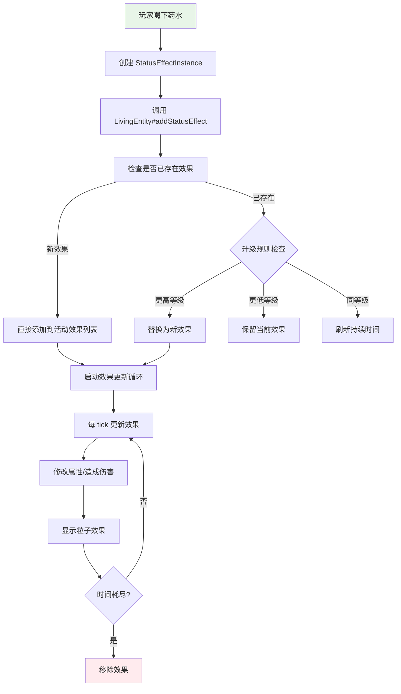
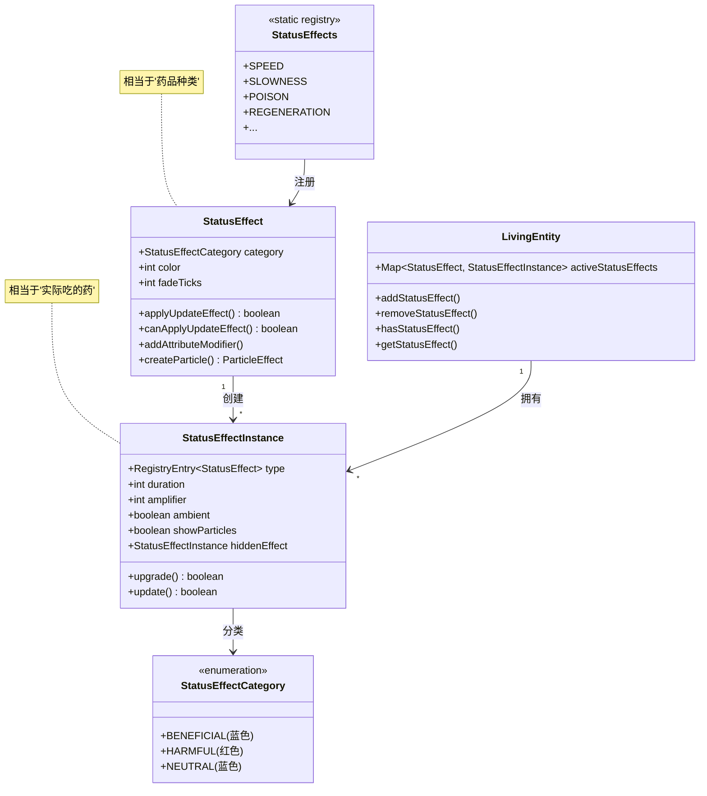
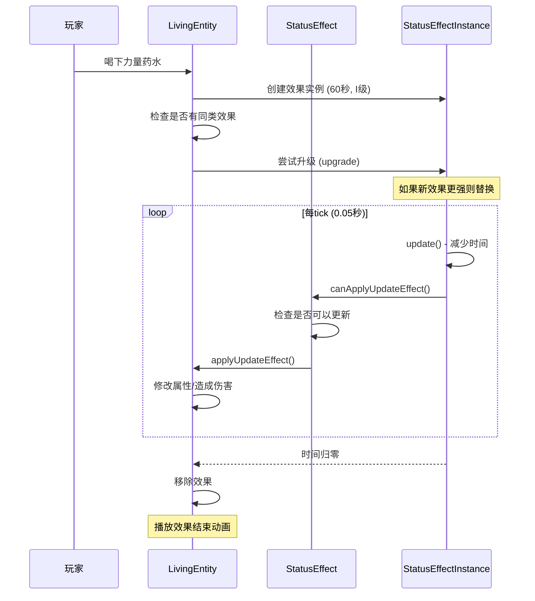

# Minecraft 药水效果系统详解

## 目标

学完本教程后，你将能够：
- 理解 Minecraft 药水效果系统的核心概念
- 掌握 StatusEffect、StatusEffectInstance 的使用
- 学会创建自定义药水效果
- 了解效果叠加规则和实现原理

## 前置知识

- Java 基础（类、抽象类、枚举）
- [实体系统](../Part-4-Entity/21-entity-intro.md) - 药水效果作用于实体
- [属性系统](../Part-4-Entity/25-entity-attributes.md) - 效果可以修改属性
- [粒子系统](./particle-system.md) - 效果会显示粒子

## 核心概念

### 什么是药水效果系统？

想象你在玩 RPG 游戏：
- **Buff** = 正面效果（如攻击增强、移动加速）
- **Debuff** = 负面效果（如中毒、减速）

Minecraft 的药水效果系统就像一个 **状态监控系统**。当你喝下药水或被女巫扔药水时，游戏中会添加一个效果（StatusEffect）到你的身上。这个效果会持续一段时间（Duration），期间可能改变你的属性、移动速度或生成粒子。

### 生活比喻：药水效果 = 生病时吃的药

想象你感冒了去看医生，医生给你开的药就像 Minecraft 中的药水效果：

| 现实中的药 | Minecraft 中的对应 |
|-----------|-------------------|
| 药品种类（感冒药、止痛药） | StatusEffect（速度、力量） |
| 药效等级（普通、加强） | amplifier（0=一级，1=二级） |
| 药效持续时间 | duration（600 tick = 30秒） |
| 吃药后身体变化（退烧、止痛） | 属性修改、伤害、粒子效果 |
| 药效退去 | 效果消失 |

### 效果系统的组成

```
┌─────────────────────────────────────────────────────────┐
│                    药水效果系统组成                         │
├─────────────────────────────────────────────────────────┤
│                                                         │
│   StatusEffect (效果定义)                                │
│      ├── 颜色、分类、图标                                │
│      ├── 属性修改器                                      │
│      └── 持续效果更新逻辑                                │
│                                                         │
│   StatusEffectInstance (效果实例)                        │
│      ├── 持续时间、等级                                  │
│      ├── 粒子显示、叠加规则                              │
│      └── 隐藏的上一个效果                                │
│                                                         │
│   LivingEntity (应用主体)                                │
│      ├── activeStatusEffects (效果列表)                  │
│      └── addStatusEffect() / removeStatusEffect()      │
│                                                         │
└─────────────────────────────────────────────────────────┘
```

## 图解（Mermaid）

### 效果系统结构图



### 效果系统类关系图



### 效果应用时序图



## 核心代码

### 1. StatusEffect - 状态效果定义

`StatusEffect` 代表一种效果类型，定义了效果的基本属性和行为。

```java
// 源码位置: net.minecraft.entity.effect.StatusEffect
public class StatusEffect implements ToggleableFeature {
    private final StatusEffectCategory category;  // 效果分类
    private final int color;                     // 效果颜色（用于粒子）
    private final Map<RegistryEntry<EntityAttribute>, EffectAttributeModifierCreator> attributeModifiers;
    
    protected StatusEffect(StatusEffectCategory category, int color) {
        this.category = category;
        this.color = color;
    }
    
    // 每tick更新时调用，返回false会移除效果
    public boolean applyUpdateEffect(LivingEntity entity, int amplifier) {
        return true;  // 默认不做任何事
    }
    
    // 判断是否可以继续更新
    public boolean canApplyUpdateEffect(int duration, int amplifier) {
        return false;  // 默认不可更新（瞬间效果）
    }
    
    // 创建效果粒子
    public ParticleEffect createParticle(StatusEffectInstance effect) {
        return EntityEffectParticleEffect.create(
            ParticleTypes.ENTITY_EFFECT, 
            ColorHelper.Argb.withAlpha(255, color)
        );
    }
}
```

### 2. StatusEffectCategory - 效果分类

```java
// 源码位置: net.minecraft.entity.effect.StatusEffectCategory
public enum StatusEffectCategory {
    BENEFICIAL(Formatting.BLUE),   // 正面效果（蓝色）
    HARMFUL(Formatting.RED),       // 负面效果（红色）
    NEUTRAL(Formatting.BLUE);      // 中性效果（蓝色）
}
```

### 3. StatusEffectInstance - 效果实例

`StatusEffectInstance` 代表应用到实体上的具体效果实例。

```java
// 源码位置: net.minecraft.entity.effect.StatusEffectInstance
public class StatusEffectInstance implements Comparable<StatusEffectInstance> {
    public static final int INFINITE = -1;  // 无限持续
    
    private final RegistryEntry<StatusEffect> type;  // 效果类型
    private int duration;                   // 持续时间（tick）
    private int amplifier;                 // 等级（0 = I级）
    private boolean ambient;                // 是否是环境效果（如信标）
    private boolean showParticles;         // 是否显示粒子
    private boolean showIcon;               // 是否显示图标
    
    @Nullable
    private StatusEffectInstance hiddenEffect;  // 隐藏的旧效果（升级时保留）
    
    public StatusEffectInstance(
        RegistryEntry<StatusEffect> effect,
        int duration,
        int amplifier
    ) {
        this(effect, duration, amplifier, false, true);
    }
    
    // 升级效果
    public boolean upgrade(StatusEffectInstance that) {
        if (that.amplifier > this.amplifier) {
            // 保留旧效果（当新效果结束时恢复）
            this.hiddenEffect = new StatusEffectInstance(this);
            this.amplifier = that.amplifier;
            this.duration = that.duration;
            return true;
        }
        return false;
    }
}
```

### 4. 原版效果注册示例

```java
// 源码位置: net.minecraft.entity.effect.StatusEffects
public class StatusEffects {
    // 速度效果 - 增加移动速度
    public static final RegistryEntry<StatusEffect> SPEED = 
        StatusEffects.register("speed", 
            new StatusEffect(StatusEffectCategory.BENEFICIAL, 3402751)
                .addAttributeModifier(
                    EntityAttributes.GENERIC_MOVEMENT_SPEED,
                    Identifier.ofVanilla("effect.speed"),
                    0.2f,  // 增加 20% 速度
                    EntityAttributeModifier.Operation.ADD_MULTIPLIED_TOTAL
                )
        );
    
    // 缓慢效果 - 减少移动速度
    public static final RegistryEntry<StatusEffect> SLOWNESS = 
        StatusEffects.register("slowness", 
            new StatusEffect(StatusEffectCategory.HARMFUL, 9154528)
                .addAttributeModifier(
                    EntityAttributes.GENERIC_MOVEMENT_SPEED,
                    Identifier.ofVanilla("effect.slowness"),
                    -0.15f,  // 减少 15% 速度
                    EntityAttributeModifier.Operation.ADD_MULTIPLIED_TOTAL
                )
        );
    
    // 力量效果 - 增加攻击伤害
    public static final RegistryEntry<StatusEffect> STRENGTH = 
        StatusEffects.register("strength", 
            new StatusEffect(StatusEffectCategory.BENEFICIAL, 16762624)
                .addAttributeModifier(
                    EntityAttributes.GENERIC_ATTACK_DAMAGE,
                    Identifier.ofVanilla("effect.strength"),
                    3.0,  // 增加 3 点基础伤害
                    EntityAttributeModifier.Operation.ADD_VALUE
                )
        );
    
    // 中毒效果 - 持续伤害
    public static final RegistryEntry<StatusEffect> POISON = 
        StatusEffects.register("poison", 
            new PoisonStatusEffect(StatusEffectCategory.HARMFUL, 8889187)
        );
    
    // 即时治疗效果
    public static final RegistryEntry<StatusEffect> INSTANT_HEALTH = 
        StatusEffects.register("instant_health", 
            new InstantHealthOrDamageStatusEffect(
                StatusEffectCategory.BENEFICIAL, 
                16262179, 
                false  // false = 治疗, true = 伤害
            )
        );
}
```

### 5. 特殊效果类

#### PoisonStatusEffect - 中毒效果

```java
// 源码位置: net.minecraft.entity.effect.PoisonStatusEffect
public class PoisonStatusEffect extends StatusEffect {
    public PoisonStatusEffect(StatusEffectCategory category, int color) {
        super(category, color);
    }
    
    @Override
    public boolean canApplyUpdateEffect(int duration, int amplifier) {
        // 每 25 tick（约 1.25 秒）造成一次伤害
        int tickInterval = 25 >> amplifier;  // 等级越高间隔越短
        return duration % tickInterval == 0;
    }
    
    @Override
    public boolean applyUpdateEffect(LivingEntity entity, int amplifier) {
        if (entity.canTakeDamage()) {
            // 造成 1 点伤害（等级越高伤害越高）
            entity.damage(
                DamageSource.MAGIC, 
                1.0f << amplifier
            );
        }
        return true;
    }
}
```

#### RegenerationStatusEffect - 再生效果

```java
// 源码位置: net.minecraft.entity.effect.RegenerationStatusEffect
public class RegenerationStatusEffect extends StatusEffect {
    public RegenerationStatusEffect(StatusEffectCategory category, int color) {
        super(category, color);
    }
    
    @Override
    public boolean canApplyUpdateEffect(int duration, int amplifier) {
        // 每 50 tick（约 2.5 秒）治疗一次
        int tickInterval = 50 >> amplifier;
        return duration % tickInterval == 0;
    }
    
    @Override
    public boolean applyUpdateEffect(LivingEntity entity, int amplifier) {
        if (entity.canTakeDamage()) {
            entity.heal(1.0f << amplifier);
        }
        return true;
    }
}
```

## 实战演示

### 场景 1：给玩家添加效果

```java
// 方法1：使用效果实例
public void giveSpeedEffect(PlayerEntity player) {
    StatusEffectInstance effect = new StatusEffectInstance(
        StatusEffects.SPEED,    // 速度效果
        600,                     // 持续 600 tick (30秒)
        0                        // 等级 0 (I级)
    );
    player.addStatusEffect(effect);
}

// 方法2：快捷方法（省略实例创建）
public void giveStrengthEffect(PlayerEntity player) {
    player.addStatusEffect(
        StatusEffects.STRENGTH,
        1200,  // 持续 60秒
        1      // 等级 1 (II级)
    );
}
```

### 场景 2：检查和管理效果

```java
// 检查是否有某种效果
public boolean hasSpeedEffect(PlayerEntity player) {
    return player.hasStatusEffect(StatusEffects.SPEED);
}

// 获取效果等级
public int getSpeedLevel(PlayerEntity player) {
    StatusEffectInstance effect = player.getStatusEffect(StatusEffects.SPEED);
    return effect != null ? effect.getAmplifier() : -1;
}

// 移除效果
public void removeSpeedEffect(PlayerEntity player) {
    player.removeStatusEffect(StatusEffects.SPEED);
}

// 清除所有负面效果
public void curePlayer(PlayerEntity player) {
    for (StatusEffectInstance effect : player.getStatusEffects()) {
        if (effect.getEffectType().value().getCategory() == StatusEffectCategory.HARMFUL) {
            player.removeStatusEffect(effect.getEffectType());
        }
    }
}
```

### 场景 3：创建自定义效果

```java
// 第一步：创建自定义效果类
public class FireAuraStatusEffect extends StatusEffect {
    public FireAuraStatusEffect() {
        super(StatusEffectCategory.BENEFICIAL, 0xFF5500);  // 橙色
    }
    
    @Override
    public boolean canApplyUpdateEffect(int duration, int amplifier) {
        return true;  // 每tick都应用
    }
    
    @Override
    public boolean applyUpdateEffect(LivingEntity entity, int amplifier) {
        // 对附近的敌人造成火焰伤害
        List<LivingEntity> nearby = entity.getWorld().getEntitiesByClass(
            LivingEntity.class,
            entity.getBoundingBox().expand(3.0),
            e -> e != entity && entity.isTeammate(e)
        );
        
        for (LivingEntity target : nearby) {
            target.setOnFire(true);
            target.damage(DamageSource.IN_FIRE, 1.0f << amplifier);
        }
        return true;
    }
}

// 第二步：注册效果
public static final RegistryEntry<StatusEffect> FIRE_AURA = 
    StatusEffects.register("fire_aura", new FireAuraStatusEffect());

// 第三步：添加效果
public void activateFireAura(PlayerEntity player) {
    player.addStatusEffect(
        FireAuraEffects.FIRE_AURA,
        600,  // 30秒
        0     // I级
    );
}
```

### 场景 4：药水物品

```java
// 创建自定义药水物品
public class FireAuraPotion extends PotionItem {
    public FireAuraPotion(Settings settings) {
        super(settings);
    }
    
    @Override
    public ItemStack finishUsing(ItemStack stack, World world, LivingEntity user) {
        // 添加效果
        user.addStatusEffect(new StatusEffectInstance(
            ModEffects.FIRE_AURA,
            1200,  // 60秒
            0      // I级
        ));
        
        // 播放喝药水音效
        world.playSound(null, user.getX(), user.getY(), user.getZ(),
            SoundEvents.ENTITY_GENERIC_DRINK, 
            SoundCategory.PLAYERS, 1.0f, 1.0f
        );
        
        // 消耗药水
        return PotionItem.useChargedItem(stack, world, user);
    }
}
```

### 场景 5：信标效果（环境效果）

```java
// 环境效果的特点是粒子更透明
public void giveBeaconEffect(PlayerEntity player) {
    StatusEffectInstance effect = new StatusEffectInstance(
        StatusEffects.SPEED,
        1800,   // 90秒
        1,      // II级
        true,   // ambient = true（环境效果，粒子更透明）
        true,   // showParticles
        true    // showIcon
    );
    player.addStatusEffect(effect);
}
```

## 效果叠加规则

### 等级叠加规则

```
规则 1: 高等级效果替换低等级效果
  如果喝下 II 级速度时已经有 I 级：
    → II 级速度替换 I 级
    → 当 II 级结束时，自动恢复 I 级（如果有残留时间）

规则 2: 同等级刷新时间
  如果喝下 II 级速度时已经有 II 级：
    → 时间刷新为新的持续时间

规则 3: 不同效果互不影响
  速度 + 跳跃提升 = 可以同时存在
```

### 效果冲突检测

```java
// 检查是否会被替换
public boolean willEffectBeReplaced(LivingEntity entity, StatusEffect effect, int amplifier) {
    StatusEffectInstance current = entity.getStatusEffect(effect);
    if (current == null) {
        return false;  // 没有当前效果，不会被替换
    }
    return current.getAmplifier() > amplifier;
}
```

## 常见原版效果一览

| 效果名称 | 分类 | 效果描述 |
|---------|------|---------|
| SPEED | 正面 | 移动速度 +20% 每级 |
| SLOWNESS | 负面 | 移动速度 -15% 每级 |
| HASTE | 正面 | 挖掘速度 +10% 每级 |
| MINING_FATIGUE | 负面 | 挖掘速度 -10% 每级 |
| STRENGTH | 正面 | 攻击伤害 +3 每级 |
| INSTANT_HEALTH | 正面 | 瞬间恢复 4 心每级 |
| INSTANT_DAMAGE | 负面 | 瞬间伤害 6 心每级 |
| JUMP_BOOST | 正面 | 跳跃高度 +0.5 格每级 |
| NAUSEA | 负面 | 屏幕扭曲 |
| REGENERATION | 正面 | 每 2.5 秒恢复 0.5 心 |
| POISON | 负面 | 每 1.25 秒伤害 0.5 心 |
| WITHER | 负面 | 类似中毒但致死 |
| RESISTANCE | 正面 | 伤害减少 20% 每级 |
| FIRE_RESISTANCE | 正面 | 免疫火焰伤害 |
| WATER_BREATHING | 正面 | 无限水下呼吸 |
| INVISIBILITY | 正面 | 隐形（但攻击会显形）|
| BLINDNESS | 负面 | 视野受限 |
| NIGHT_VISION | 正面 | 黑暗中看清 |
| HUNGER | 负面 | 加速饥饿消耗 |
| WEAKNESS | 负面 | 攻击伤害 -4 |
| ABSORPTION | 正面 | 额外护盾生命 |
| SATURATION | 正面 | 瞬间饱食 |
| GLOWING | 中性 | 灵魂之光 |
| LEVITATION | 负面 | 向上飘浮 |
| LUCK | 正面 | 幸运 +1 每级 |
| UNLUCK | 负面 | 倒霉 -1 每级 |
| SLOW_FALLING | 正面 | 缓慢降落 |
| CONDUIT_POWER | 正面 | 水下能力增强 |
| DOLPHINS_GRACE | 正面 | 游泳加速 |
| DARKNESS | 负面 | 低光照下失明 |

## 小结

| 概念 | 作用 | 生活比喻 |
|------|------|----------|
| StatusEffect | 定义效果类型和行为 | 药品说明书 |
| StatusEffectInstance | 效果的具体实例 | 实际吃掉的药 |
| StatusEffectCategory | 效果分类（正面/负面/中性）| 药品颜色标签 |
| amplifier | 效果等级（0=一级）| 药量加倍 |
| duration | 持续时间 | 药效持续多久 |

**核心要点：**
1. StatusEffect 定义"什么效果"，StatusEffectInstance 是"应用的效果"
2. 效果等级从 0 开始（0 = I级，1 = II级，以此类推）
3. 高等级效果会替换低等级，低等级会被隐藏但不消失
4. 效果通过 `LivingEntity.addStatusEffect()` 添加
5. 即时效果重写 `applyInstantEffect()`，持续效果重写 `applyUpdateEffect()`

## 练习

### 练习 1：基础药水效果
创建一个药水物品，喝下后给玩家 30 秒的跳跃提升效果。

### 练习 2：自定义负面效果
创建一个"饥饿"效果，使玩家的饥饿值快速下降。

### 练习 3：火焰光环效果
创建一个光环效果，附近有敌人时自动对敌人造成火焰伤害。

### 练习 4：效果检测
创建一个命令，可以显示玩家当前所有药水效果的详细信息。

## 相关链接

### 内部链接
- [实体系统](../Part-4-Entity/21-entity-intro.md) - 药水效果应用于实体
- [属性系统](../Part-4-Entity/25-entity-attributes.md) - 效果修改实体属性
- [粒子系统](./particle-system.md) - 效果显示彩色粒子
- [物品系统](../Part-3-Block-Item/18-item-basics.md) - 药水是特殊的物品

### 外部资源
- [Minecraft Wiki: Effects](https://minecraft.fandom.com/wiki/Effect)
- [药水效果ID列表](https://minecraft.fandom.com/wiki/Effect#List_of_effects)
- [女巫机制](https://minecraft.fandom.com/wiki/Witch#Behavior)
